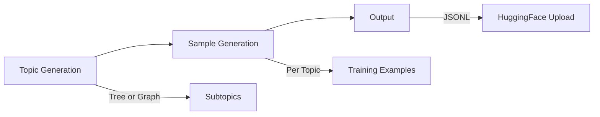

# Dataset Generation

DeepFabric generates four types of synthetic training datasets, each designed for different model capabilities.

## Dataset Types

<div class="grid cards" markdown>

-   :material-chat-question-outline: **Basic**

    ---

    Simple Q&A pairs for general instruction following

    [:octicons-arrow-right-24: Learn more](basic.md)

-   :material-head-cog-outline: **Reasoning**

    ---

    Chain-of-thought traces for step-by-step problem solving

    [:octicons-arrow-right-24: Learn more](reasoning.md)

-   :material-robot-outline: **Agent (Single-Turn)**

    ---

    Tool calls in one response for simple tool use

    [:octicons-arrow-right-24: Learn more](agent.md)

-   :material-robot-happy-outline: **Agent (Multi-Turn)**

    ---

    Extended tool conversations for complex multi-step tasks

    [:octicons-arrow-right-24: Learn more](agent.md#multi-turn-agent)

</div>

## Generation Pipeline

All dataset types follow the same three-stage pipeline:



1. **Topic Generation** - Creates a tree or graph of subtopics from your root prompt
2. **Sample Generation** - Produces training examples for each topic
3. **Output** - Saves to JSONL with optional HuggingFace upload

## Quick Comparison

=== "Basic"

    ```yaml title="config.yaml"
    conversation:
      type: basic
    ```

    Simple Q&A without explicit reasoning.

=== "Reasoning"

    ```yaml title="config.yaml"
    conversation:
      type: cot
      reasoning_style: freetext
    ```

    Includes step-by-step reasoning traces.

=== "Agent Single-Turn"

    ```yaml title="config.yaml"
    conversation:
      type: cot
      reasoning_style: agent
      agent_mode: single_turn
    ```

    One-shot tool use in a single response.

=== "Agent Multi-Turn"

    ```yaml title="config.yaml"
    conversation:
      type: cot
      reasoning_style: agent
      agent_mode: multi_turn
    ```

    Extended conversations with multiple tool calls.

## Choosing a Dataset Type

!!! tip "Quick Selection Guide"
    - **Basic**: General instruction-following without explicit reasoning
    - **Reasoning**: Models that need to explain their logic
    - **Agent**: Tool-calling capabilities (single or multi-turn)

**Basic datasets** work for general instruction-following tasks. The model learns to answer questions directly without explicit reasoning.

**Reasoning datasets** teach models to think before answering. The output includes a `reasoning` field with the model's thought process, useful for training models that explain their logic.

**Agent datasets** train tool-calling capabilities. Single-turn generates complete tool workflows in one response. Multi-turn creates extended conversations with multiple tool calls and observations, following a ReAct-style pattern.

## Next Steps

- [Basic Datasets](basic.md) - Simple Q&A generation
- [Reasoning Datasets](reasoning.md) - Chain-of-thought training data
- [Agent Datasets](agent.md) - Tool-calling datasets
- [Configuration Reference](configuration.md) - Full YAML options
