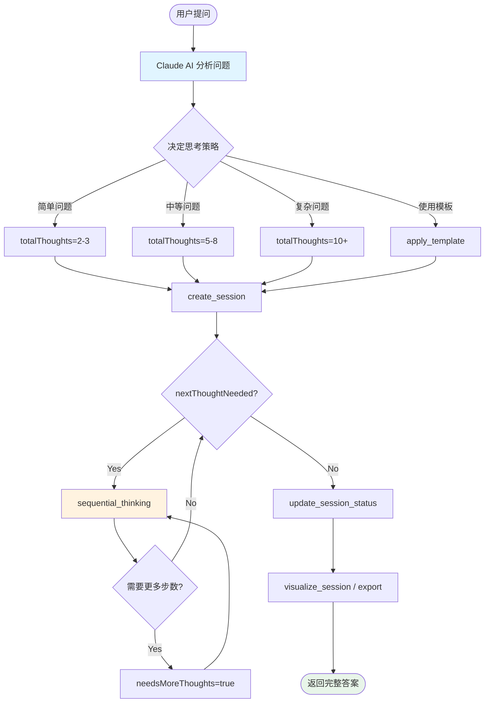

# Deep-Thinking MCP 思考步骤推进机制详解

> **文档版本**: 1.0
> **更新日期**: 2026-01-01
> **目的**: 深入解析 Deep-Thinking MCP 如何响应并解决用户提问

---

## 一、核心机制概述

### 1.1 关键认知：AI 自主驱动

**重要**: Deep-Thinking MCP **不会自动决定**使用多少思考步骤。

```
┌─────────────────────────────────────────────────────────────┐
│                    用户提出问题                             │
└────────────────────┬────────────────────────────────────────┘
                     │
                     ▼
┌─────────────────────────────────────────────────────────────┐
│                  Claude AI 分析                             │
│                                                             │
│  🤔 判断问题复杂度                                          │
│  📊 决定思考策略                                            │
│  🎯 设定思考步骤数 (totalThoughts)                          │
└────────────────────┬────────────────────────────────────────┘
                     │
                     ▼
┌─────────────────────────────────────────────────────────────┐
│          Deep-Thinking MCP 提供工具                        │
│                                                             │
│  sequential_thinking  - 执行单步思考                        │
│  create_session      - 创建思考容器                         │
│  apply_template      - 提供思考框架（可选）                  │
└─────────────────────────────────────────────────────────────┘
```

### 1.2 角色分工

| 组件 | 职责 | 决策权 |
|------|------|--------|
| **Claude AI** | 决定思考步数、思考内容、何时结束 | ✅ 完全控制 |
| **Deep-Thinking MCP** | 提供思考工具、持久化会话 | ❌ 不干预决策 |

---

## 二、思考步骤推进的完整流程

### 2.1 流程图

```mermaid
sequenceDiagram
    participant U as 用户
    participant AI as Claude AI
    participant MCP as Deep-Thinking MCP
    participant Storage as 存储层

    U->>AI: 提出问题（如：分析2026年黄金价格）

    Note over AI: AI 分析问题复杂度
    AI->>AI: 决定使用 8 步思考
    AI->>AI: 创建会话或使用模板

    AI->>MCP: create_session(name, description)
    MCP->>Storage: 保存会话

    loop 每一步思考
        AI->>MCP: sequential_thinking(
            thought: "思考内容",
            thoughtNumber: 当前步骤,
            totalThoughts: 8,
            nextThoughtNeeded: true/false
        )
        MCP->>Storage: 保存思考步骤
        MCP-->>AI: 返回确认
    end

    AI->>MCP: update_session_status("completed")
    MCP->>Storage: 更新会话状态

    AI-->>U: 返回完整分析结果
```

### 2.2 实际案例解析

**用户问题**: "请帮我深度分析一下2026年全球黄金价格会如何发展"

**AI 的决策过程**:

```
1️⃣ 问题分析
   问题类型：经济预测分析
   复杂维度：宏观经济、地缘政治、供需关系、技术面、风险因素
   预计思考步数：8步

2️⃣ 工具调用计划
   - 创建会话："2026年黄金价格趋势分析"
   - 执行 8 次 sequential_thinking
   - 更新会话状态为 completed
   - 生成可视化报告

3️⃣ 执行思考
   Step 1: 宏观经济因素分析 → nextThoughtNeeded=true
   Step 2: 地缘政治分析 → nextThoughtNeeded=true
   Step 3: 供需基本面分析 → nextThoughtNeeded=true
   Step 4: 市场情绪分析 → nextThoughtNeeded=true
   Step 5: 技术分析 → nextThoughtNeeded=true
   Step 6: 风险因素分析 → nextThoughtNeeded=true
   Step 7: 关键时间节点 → nextThoughtNeeded=true
   Step 8: 综合结论 → nextThoughtNeeded=false ✅

4️⃣ 返回结果
   - 整合 8 步思考内容
   - 生成结构化报告
   - 提供投资建议
```

---

## 三、思考步骤数的决定机制

### 3.1 AI 如何决定 totalThoughts

**关键参数**:
```python
sequential_thinking(
    thought="当前思考内容",
    thoughtNumber=3,           # AI 当前在第几步
    totalThoughts=8,           # AI 预计总共需要几步
    nextThoughtNeeded=True,     # AI 决定是否继续
    ...
)
```

**AI 的判断依据**:

| 因素 | 说明 | 影响 |
|------|------|------|
| 问题复杂度 | 简单问题 vs 复杂问题 | 复杂 → 更多步骤 |
| 分析维度 | 单一维度 vs 多维度 | 多维度 → 更多步骤 |
| 期望深度 | 快速回答 vs 深度分析 | 深度分析 → 更多步骤 |
| 模板引导 | 使用模板设定框架 | 模板步数作为参考 |

### 3.2 模板的作用

**模板提供思考框架**，但不强制步数：

```json
// problem_solving.json
{
  "name": "问题求解模板",
  "structure": {
    "steps": [
      {"step_number": 1, "prompt": "明确问题定义"},
      {"step_number": 2, "prompt": "分析问题成因"},
      {"step_number": 3, "prompt": "收集相关信息"},
      {"step_number": 4, "prompt": "生成解决方案"},
      {"step_number": 5, "prompt": "评估方案优劣"},
      {"step_number": 6, "prompt": "选择最佳方案"},
      {"step_number": 7, "prompt": "制定实施计划"},
      {"step_number": 8, "prompt": "验证结果"}
    ]
  },
  "metadata": {
    "estimated_steps": 8  // 仅作为参考
  }
}
```

**AI 如何使用模板**:
1. 调用 `apply_template("problem_solving", context="用户问题")`
2. 获取模板的 8 个引导提示
3. AI **可以选择**:
   - 严格按照模板的 8 步进行
   - 根据实际情况调整步数
   - 某些步骤合并或拆分

### 3.3 动态调整机制

**如果思考过程中发现步数不够**:

```python
# 原计划 5 步，但第 3 步发现需要更多思考
sequential_thinking(
    thought="在分析过程中发现了新的因素...",
    thoughtNumber=3,
    totalThoughts=5,
    needsMoreThoughts=True,  # 🔑 关键：请求增加步数
    nextThoughtNeeded=True
)

# 系统响应
# "📈 思考步骤总数已调整: 5 → 15"
# （每次增加 10 步，上限 1000 步）
```

**needsMoreThoughts 参数**:

| 值 | 效果 | 使用场景 |
|----|------|---------|
| `true` | totalThoughts 增加 10 步 | 发现新的分析维度 |
| `true` (多次) | 最多增加到 1000 步 | 超复杂问题 |
| `false` | 保持原计划 | 按预期进行 |

**最大限制**:
```python
max_thoughts_limit = 1000  # 硬编码上限
```

---

## 四、业务逻辑详解

### 4.1 sequential_thinking 工具的核心逻辑

```python
def sequential_thinking(
    thought: str,              # AI 生成的思考内容
    nextThoughtNeeded: bool,   # AI 决定是否继续
    thoughtNumber: int,        # AI 当前在第几步
    totalThoughts: int,        # AI 预计的总步数
    session_id: str = "default",
    isRevision: bool = False,
    revisesThought: int | None = None,
    branchFromThought: int | None = None,
    branchId: str | None = None,
    needsMoreThoughts: bool = False,  # AI 请求增加步数
) -> str:
```

**参数来源**:

| 参数 | 来源 | 说明 |
|------|------|------|
| `thought` | AI 生成 | Claude 根据上下文生成 |
| `thoughtNumber` | AI 计算 | 当前步数 = 上一步数 + 1 |
| `totalThoughts` | AI 估算 | 基于问题复杂度判断 |
| `nextThoughtNeeded` | AI 决策 | `true` 继续 / `false` 结束 |
| `needsMoreThoughts` | AI 决策 | 发现需要更多思考时设置 |

### 4.2 状态管理

**会话生命周期**:

```
┌─────────────┐
│   created   │ ← create_session() 创建
└──────┬──────┘
       │
       ▼
┌─────────────┐
│   active    │ ← 进行中，可以添加思考步骤
└──────┬──────┘
       │
       ▼ (nextThoughtNeeded=false)
┌─────────────┐
│  completed  │ ← 标记为完成，不再添加思考
└─────────────┘
       │
       ▼ (手动操作)
┌─────────────┐
│  archived   │ ← 归档，保留历史
└─────────────┘
```

**状态转换代码**:
```python
# sequential_thinking.py 第176-183行
if nextThoughtNeeded:
    result_parts.append("➡️ 继续下一步思考...")
else:
    result_parts.append("✅ 思考完成！")
    # 标记会话为已完成
    session.mark_completed()
    manager.update_session(session)
```

### 4.3 数据持久化

**每次调用的数据流**:

```
1. AI 调用 sequential_thinking()
   ↓
2. 获取或创建会话 (StorageManager)
   ↓
3. 创建 Thought 对象 (Pydantic 模型)
   ↓
4. 添加到会话 (session.add_thought())
   ↓
5. 保存到文件 (原子写入)
   ↓
6. 返回确认信息给 AI
```

**存储结构**:
```
./.Deep-Thinking-MCP/
├── sessions/
│   ├── .index.json              # 会话索引
│   ├── 9408db80-0b04-4f00...     # 具体会话文件
│   │   {
│   │     "session_id": "...",
│   │     "name": "2026年黄金价格分析",
│   │     "thoughts": [
│   │       {
│   │         "thought_number": 1,
│   │         "content": "宏观经济因素分析...",
│   │         "timestamp": "2026-01-01T08:11:40Z"
│   │       },
│   │       {
│   │         "thought_number": 2,
│   │         "content": "地缘政治分析...",
│   │         "timestamp": "2026-01-01T08:11:42Z"
│   │       },
│   │       ... (共 8 个思考步骤)
│   │     ]
│   │   }
│   └── ...
```

---

## 五、不同复杂度问题的处理

### 5.1 简单问题（2-3步）

**用户问题**: "Python 中如何反转字符串？"

**AI 的处理**:
```python
# Step 1
sequential_thinking(
    thought="Python 中有多种方法反转字符串：切片、reversed()、join()",
    thoughtNumber=1,
    totalThoughts=2,
    nextThoughtNeeded=True
)

# Step 2
sequential_thinking(
    thought="推荐使用切片法 s[::-1]，简洁高效。提供代码示例。",
    thoughtNumber=2,
    totalThoughts=2,
    nextThoughtNeeded=False  # ✅ 完成
)
```

### 5.2 中等复杂度（5-8步）

**用户问题**: "比较两种技术方案的优劣"

**AI 的处理**:
```python
# Step 1: 理解需求
# Step 2: 分析方案A
# Step 3: 分析方案B
# Step 4: 对比维度定义
# Step 5: 逐项对比
# Step 6: 综合评估
# Step 7: 给出建议
# Step 8: 风险提示
totalThoughts=8
```

### 5.3 高复杂度（10+步）

**用户问题**: "设计一个大型分布式系统架构"

**AI 的处理**:
```python
# Step 1-5: 需求分析、技术选型、架构设计
# Step 6: 发现需要更深入的讨论
sequential_thinking(
    thought="在架构设计过程中，发现了新的考虑因素...",
    thoughtNumber=6,
    totalThoughts=10,
    needsMoreThoughts=True,  # 🔑 增加步数
    nextThoughtNeeded=True
)
# totalThoughts 自动调整为 20

# Step 7-20: 继续深入分析
# Step 15: 再次发现需要扩展
sequential_thinking(
    thought="还需要考虑容灾和备份策略...",
    thoughtNumber=15,
    totalThoughts=20,
    needsMoreThoughts=True,  # 再次增加
    nextThoughtNeeded=True
)
# totalThoughts 自动调整为 30

# 最终可能使用 25 步完成分析
```

---

## 六、关键参数详解

### 6.1 thoughtNumber vs totalThoughts

```python
# thoughtNumber: 当前是第几步（从1开始递增）
thoughtNumber = 1, 2, 3, ..., totalThoughts

# totalThoughts: 预计总共需要几步
# - AI 根据问题复杂度估算
# - 可以通过 needsMoreThoughts 动态调整
totalThoughts = 5, 8, 10, ..., 1000 (上限)

# 关系：thoughtNumber <= totalThoughts
# 当 thoughtNumber > totalThoughts 时，使用 needsMoreThoughts
```

### 6.2 nextThoughtNeeded 的作用

```python
if nextThoughtNeeded:
    # AI 计划继续思考
    # 返回："➡️ 继续下一步思考..."
    # 会话状态保持为 "active"
else:
    # AI 决定结束思考
    # 返回："✅ 思考完成！"
    # 会话状态变为 "completed"
```

**决策依据**:

| 情况 | nextThoughtNeeded | 说明 |
|------|------------------|------|
| 达到预期目标 | `false` | 问题已解决 |
| 发现新问题 | `true` | 需要进一步分析 |
| 总步数未完成 | `true` | 按计划继续 |
| 思考已充分 | `false` | 可以总结 |

### 6.3 needsMoreThoughts 的使用场景

**场景1: 发现新的分析维度**
```python
# 原计划分析技术因素，发现还需要考虑市场因素
sequential_thinking(
    thought="除了技术因素，市场环境也很重要...",
    thoughtNumber=6,
    totalThoughts=8,
    needsMoreThoughts=True  # 需要增加步数来分析市场
)
```

**场景2: 问题比预期复杂**
```python
# 原以为5步能解决，实际需要更深入
sequential_thinking(
    thought="这个问题比预期复杂，需要分解更多子问题...",
    thoughtNumber=5,
    totalThoughts=5,
    needsMoreThoughts=True  # 增加步数
)
# totalThoughts 变为 15
```

---

## 七、断点续传机制

### 7.1 会话恢复

**当思考被中断时**：

```python
# 使用 resume_session 恢复
result = resume_session("9408db80-0b04-4f00-a257-6d708eee4a29")

# 返回：
# "## 🔄 会话恢复成功
#
# **会话ID**: 9408db80-...
# **总思考数**: 8
# **上一个思考步骤**: 步骤 8: 综合结论与投资建议
#
# ### 继续思考
# 要继续添加思考步骤，请设置：
# - thoughtNumber = 9
# - session_id = 9408db80-..."
```

### 7.2 调整历史记录

**查看思考步骤的调整历史**：

```python
# 会话元数据中保存了调整记录
session.metadata["total_thoughts_history"] = [
    {
        "original_total": 5,
        "new_total": 15,
        "thought_number": 6,
        "timestamp": "2026-01-01T10:30:00Z"
    },
    {
        "original_total": 15,
        "new_total": 25,
        "thought_number": 15,
        "timestamp": "2026-01-01T11:00:00Z"
    }
]
```

---

## 八、总结：核心工作流程

### 8.1 完整工作流



### 8.2 关键要点

1. **AI 完全自主**
   - Deep-Thinking MCP **不自动决定**思考步数
   - 所有决策由 AI（Claude）根据问题判断

2. **参数来源**
   - `totalThoughts`: AI 估算
   - `nextThoughtNeeded`: AI 决策
   - `needsMoreThoughts`: AI 按需调整

3. **灵活性**
   - 可以随时增加步数（最多1000步）
   - 可以使用模板作为参考
   - 支持断点续传

4. **持久化**
   - 每步自动保存
   - 会话独立管理
   - 数据完整可靠

---

## 九、实际应用示例

### 9.1 代码审查场景

**用户**: "帮我审查这段代码的安全性"

**AI 的思考过程**:
```
Step 1: 理解代码功能 (totalThoughts=6)
Step 2: 识别输入验证
Step 3: 检查SQL注入风险
Step 4: 检查XSS风险
Step 5: 检查认证授权
Step 6: 生成修复建议 (nextThoughtNeeded=false)
```

### 9.2 系统设计场景

**用户**: "设计一个秒杀系统"

**AI 的思考过程**:
```
Step 1: 需求分析 (totalThoughts=15)
Step 2: 技术选型
Step 3: 架构设计
Step 4: 数据库设计
Step 5: 缓存策略
Step 6: 并发控制
...
Step 10: 发现需要考虑容灾
      → needsMoreThoughts=true (totalThoughts: 15→25)
Step 11: 容灾设计
...
Step 20: 总结方案 (nextThoughtNeeded=false)
```

---

## 十、常见问题

### Q1: Deep-Thinking MCP 会自动分析问题复杂度吗？

**A**: 不会。分析问题复杂度、决定思考步数，这些都是 **Claude AI 的职责**。Deep-Thinking MCP 只提供工具支持。

### Q2: 如果 AI 设定的步数不够怎么办？

**A**: 使用 `needsMoreThoughts=true` 参数，每次增加10步，最多1000步。

### Q3: 模板是强制的吗？

**A**: 不是。模板是可选的参考框架。AI 可以根据实际情况调整步数和内容。

### Q4: 思考步骤有限制吗？

**A**: 有。最大1000步，这是硬编码的限制，防止无限循环。

### Q5: 如何查看之前的思考？

**A**: 使用 `get_session(session_id)` 或 `resume_session(session_id)` 工具。

---

> **文档说明**: 本文档详细解释了 Deep-Thinking MCP 的思考步骤推进机制，帮助理解 AI 如何使用该工具解决用户问题。
