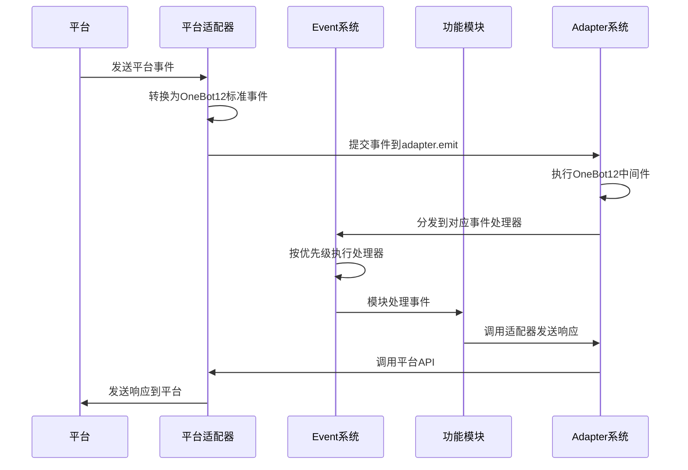

# ErisPulse 核心功能文档

**生成时间**: 2026-01-11 15:32:06

本文件由多个开发文档合并而成，用于辅助开发者理解 ErisPulse 的相关功能。

## 目录

1. [文档总览](#READMEmd)
2. [快速开始指南](#quick-startmd)
3. [核心功能文档列表](#READMEmd)
4. [核心概念](#conceptsmd)
5. [核心模块详解](#modulesmd)
6. [适配器系统](#adaptersmd)
7. [事件系统](#event-systemmd)
8. [命令行接口](#climd)
9. [最佳实践](#best-practicesmd)
10. [平台特性总览](#READMEmd)
11. [云湖平台特性](#yunhumd)
12. [Telegram平台特性](#telegrammd)
13. [OneBot11平台特性](#onebot11md)
14. [邮件平台特性](#emailmd)

## 各文件对应内容说明

| 文件名 | 作用 |
|--------|------|
| [README.md](#READMEmd) | 文档总览 |
| [quick-start.md](#quick-startmd) | 快速开始指南 |
| [README.md](#READMEmd) | 核心功能文档列表 |
| [concepts.md](#conceptsmd) | 核心概念 |
| [modules.md](#modulesmd) | 核心模块详解 |
| [adapters.md](#adaptersmd) | 适配器系统 |
| [event-system.md](#event-systemmd) | 事件系统 |
| [cli.md](#climd) | 命令行接口 |
| [best-practices.md](#best-practicesmd) | 最佳实践 |
| [README.md](#READMEmd) | 平台特性总览 |
| [yunhu.md](#yunhumd) | 云湖平台特性 |
| [telegram.md](#telegrammd) | Telegram平台特性 |
| [onebot11.md](#onebot11md) | OneBot11平台特性 |
| [email.md](#emailmd) | 邮件平台特性 |

---

<a id="READMEmd"></a>
## 文档总览

# ErisPulse Documentation

欢迎阅读 ErisPulse 文档。ErisPulse 是一个可扩展的多平台消息处理框架，支持通过适配器与不同平台进行交互。

## 文档目录

### 快速开始
- [快速开始指南](quick-start.md)            - 安装和运行 ErisPulse 的入门指南

### AI相关文档
- [AI模块生成](ai/module-generation.md)        - 快速使用AIDocs生成一个AI模块/适配器
- 所有AI物料（注意，不推荐直接使用Full投喂给AI，除非这个模型具有强大的上下文能力）:
  - [模块开发物料](ai/AIDocs/ErisPulse-ModuleDev.md)
  - [适配器开发物料](ai/AIDocs/ErisPulse-AdapterDev.md)
  - [物料集合](ai/AIDocs/ErisPulse-Full.md)

### 核心功能
- [命令行接口](core/cli.md)              - 使用命令行界面管理 ErisPulse
- [核心概念](core/concepts.md)      - ErisPulse 的基础架构和设计理念
- [核心模块](core/modules.md)       - 存储、配置、日志等核心组件详解
- [适配器系统](core/adapters.md)    - 平台适配器的使用和开发
- [事件系统](core/event-system.md)  - Event 模块的使用(事件监听、事件处理、事件分发)
- [懒加载模块系统](core/lazy-loading.md) - 懒加载模块系统的使用和配置
- [路由管理器](core/router.md)     - HTTP和WebSocket路由管理
- [框架配置](core/self-config.md)  - 框架默认配置说明
- [最佳实践](core/best-practices.md) - 开发和部署建议

### 开发指南
- [开发入门](development/README.md)     - 开发环境搭建和基本概念
- [模块开发](development/module.md)     - 开发自定义功能模块
- [适配器开发](development/adapter.md)  - 开发一个平台适配器
- [CLI 开发](development/cli.md)        - 扩展命令行工具功能

### 标准规范
- [标准规范](standards/README.md)           - ErisPulse 技术标准总览
- [事件转换](standards/event-conversion.md) - 平台事件到 OneBot12 标准的转换规范
- [API 响应](standards/api-response.md)     - 适配器 API 响应格式标准

### 平台特性
- [平台特性总览](platform-features/README.md) - 平台适配器通用接口和功能说明
- 各个平台特性:
  - [云湖平台特性](platform-features/yunhu.md) - 云湖适配器特有功能说明
  - [Telegram平台特性](platform-features/telegram.md) - Telegram适配器特有功能说明
  - [OneBot11平台特性](platform-features/onebot11.md) - OneBot11适配器特有功能说明
  - [OneBot12平台特性](platform-features/onebot12.md) - OneBot12适配器特有功能说明
  - [邮件平台特性](platform-features/email.md) - 邮件适配器特有功能说明

### API 参考
- [API 文档](api/) - 自动生成的详细 API 参考


---

<a id="quick-startmd"></a>
## 快速开始指南

# 快速开始

## 安装ErisPulse

### 使用 pip 安装
确保你的 Python 版本 >= 3.8，然后使用 pip 安装 ErisPulse：
```bash
pip install ErisPulse
```

### 更先进的安装方法
> 采用 [`uv`](https://github.com/astral-sh/uv) 作为 Python 工具链

### 1. 安装 uv

#### 通用方法 (pip):
```bash
pip install uv
```

#### macOS/Linux:
```bash
curl -LsSf https://astral.sh/uv/install.sh | sh
```

#### Windows (PowerShell):
```powershell
powershell -ExecutionPolicy ByPass -c "irm https://astral.sh/uv/install.ps1 | iex"
```

验证安装:
```bash
uv --version
```

### 2. 创建虚拟环境,并安装 ErisPulse

```bash
uv python install 3.12              # 安装 Python 3.12
uv venv                             # 创建虚拟环境
source .venv/bin/activate           # 激活环境 (Windows: .venv\Scripts\activate)
uv pip install ErisPulse --upgrade  # 安装框架
```

---

## 初始化项目

有两种方式初始化项目：

### 交互式初始化（推荐）

1. 使用 epsdk init 启动交互式初始化：

```bash
epsdk init
```

这将启动一个交互式向导，引导您完成：
- 项目名称设置
- 日志级别配置
- 服务器配置（主机和端口）
- 适配器选择和配置
- 项目结构创建

### 快速初始化

如果您只需要快速创建项目结构，可以使用快速模式：

```bash
# 指定项目名称的快速模式
epsdk init -q -n my_bot

# 或者只指定项目名称，仍然会有基本交互
epsdk init -n my_bot
```

### 传统方式

如果您更喜欢传统方式：

1. 创建项目目录并进入：

```bash
mkdir my_bot && cd my_bot
```

2. 初始化 SDK 并生成配置文件：

```bash
ep-init
```
这将在当前目录下生成 `config.toml` 和 `main.py` 入口。

### 查看系统状态

在项目目录中，你可以使用以下命令查看系统状态：

```bash
# 查看所有组件状态
epsdk status

# 查看详细模块信息
epsdk status -t modules

# 查看详细适配器信息
epsdk status -t adapters
```

### 查看系统状态

在项目目录中，你可以使用以下命令查看系统状态：

```bash
# 查看所有组件状态
epsdk status

# 查看详细模块信息
epsdk status -t modules

# 查看详细适配器信息
epsdk status -t adapters
```

---

## 安装模块

你可以通过 CLI 安装所需模块：

```bash
epsdk install Yunhu AIChat
```

你也可以手动编写模块逻辑，参考开发者文档进行模块开发。

---

## 运行你的机器人
运行我们自动生成的程序入口：
```bash
epsdk run main.py
```

或者使用热重载模式（开发时推荐）：

```bash
epsdk run main.py --reload
```


---

<a id="READMEmd"></a>
## 核心功能文档列表

# ErisPulse 核心功能文档

本目录包含 ErisPulse 核心功能的详细文档，帮助开发者理解框架的核心组件和工作机制。

## 文档列表

- [核心概念](concepts.md) - ErisPulse 的基础架构和设计理念
- [核心模块](modules.md) - 存储、配置、日志等核心组件详解
- [cli](cli.md) - 命令行工具使用
- [适配器系统](adapters.md) - 平台适配器的使用
- [事件系统](event-system.md) - Event 模块的使用(事件监听、事件处理、事件分发)
- [最佳实践](best-practices.md) - 开发和部署建议
- [框架配置解析](self-config.md)

## 核心架构概览

ErisPulse 采用模块化、事件驱动的架构设计，主要包括以下几个核心组件：

1. **适配器系统** - 负责与不同平台进行交互，将平台特定事件转换为统一的 OneBot12 标准事件
2. **事件系统** - 处理各种类型的事件，包括消息、命令、通知、请求和元事件
3. **模块系统** - 提供功能扩展机制，开发者可以创建自定义模块来扩展功能
4. **核心组件** - 包括配置管理、存储系统、日志系统等基础功能


---

<a id="conceptsmd"></a>
## 核心概念

# ErisPulse 的基础架构和设计理念

## 设计理念
- 模块化架构：通过模块化设计实现功能的解耦和复用
- 事件驱动模型：基于事件驱动的架构提高系统的响应性和扩展性
- 跨平台支持：通过适配器系统实现对多种平台的支持
- 用户/AI体验优先：简化开发流程，提供友好的API接口

## 核心组件


## 工作流程
1. **事件接收**：平台适配器接收来自平台的原始事件
2. **事件标准化**：适配器将原始事件转换为OneBot12标准事件格式
3. **事件提交**：通过`adapter.emit`方法将标准化事件提交到适配器系统
4. **中间件处理**：执行注册的OneBot12中间件对事件进行预处理
5. **事件分发**：适配器系统将事件分发到对应的事件处理器
6. **事件处理**：Event系统按照优先级顺序执行注册的事件处理器
7. **模块响应**：功能模块处理事件并生成响应
8. **响应发送**：模块通过适配器系统发送响应到平台


---

<a id="modulesmd"></a>
## 核心模块详解

# ErisPulse 核心模块

ErisPulse 提供了多个核心模块，为开发者提供基础功能支持。

## 0. 核心模块概览

| 名称 | 用途 |
|------|------|
| `sdk` | SDK对象 |
| `storage`/`sdk.storage` | 获取/设置数据库配置 |
| `config`/`sdk.config` | 获取/设置模块配置 |
| `module_registry`/`sdk.module_registry` | 模块状态管理器 |
| `adapter`/`sdk.adapter` | 适配器管理/获取实例 |
| `module`/`sdk.module` | 获取模块实例 |
| `logger`/`sdk.logger` | 日志记录器 |
| `BaseAdapter`/`sdk.BaseAdapter` | 适配器基类 |
| `Event`/`sdk.Event` | 事件处理模块 |
| `lifecycle`/`sdk.lifecycle` | 生命周期事件管理器 |
| `ux`/`sdk.ux` | 用户体验管理器 |
| `UXManager`/`sdk.UXManager` | UX管理器类 |
| `router`/`sdk.router` | 路由管理器 |
| `RouterManager`/`sdk.RouterManager` | 路由管理器类 |

> 注意: `Event` 模块是 ErisPulse 2.2.0 弹簧的新模块,发布模块时请注意提醒用户兼容性问题

### 懒加载模块系统

ErisPulse 默认启用懒加载模块系统，这意味着模块只有在第一次被访问时才会实际加载和初始化。这样可以显著提升应用启动速度和内存效率。

详细说明请参考：[懒加载模块系统](./lazy-loading.md)

```python
# 全局配置懒加载
[ErisPulse.framework]
enable_lazy_loading = true  # true=启用懒加载(默认)，false=禁用懒加载

# 模块级别控制
class MyModule(BaseModule):
    @staticmethod
    def should_eager_load() -> bool:
        return True  # 返回True表示禁用懒加载
```

### 事件系统子模块

Event 模块包含以下子模块：

| 子模块 | 用途 |
|-------|------|
| `Event.command` | 命令处理 |
| `Event.message` | 消息事件处理 |
| `Event.notice` | 通知事件处理 |
| `Event.request` | 请求事件处理 |
| `Event.meta` | 元事件处理 |
| `Event.exceptions` | 事件异常处理 |

```python
# 直接导入方式
from ErisPulse.Core import (
        storage, config, module_registry,
        adapter, module, logger,
        BaseAdapter, Event, lifecycle
    )

# 通过SDK对象方式
from ErisPulse import sdk
sdk.storage  # 等同于直接导入的storage
```

## 1. 存储系统 (storage)

基于 SQLite 的键值存储系统，支持复杂数据类型的持久化存储。

### 主要功能

- 键值存储：`storage.set(key, value)` / `storage.get(key, default)`
- 事务支持：通过 `storage.transaction()` 上下文管理器
- 数据快照和恢复
- 自动备份机制
- 批量操作：`storage.set_multi(dict)` / `storage.delete_multi(list)`

### 使用示例

```python
from ErisPulse import sdk

# 设置存储项
sdk.storage.set("user.settings", {"theme": "dark", "language": "zh-CN"})

# 获取存储项
settings = sdk.storage.get("user.settings", {})

# 使用事务
with sdk.storage.transaction():
    sdk.storage.set("key1", "value1")
    sdk.storage.set("key2", "value2")

# 批量操作
sdk.storage.set_multi({
    "key1": "value1",
    "key2": "value2"
})
sdk.storage.delete_multi(["key1", "key2"])
```

## 2. 配置管理 (config)

TOML 格式配置文件管理器，用于管理模块和适配器配置。

### 主要功能

- 模块配置读取：`config.getConfig(key, default)`
- 配置项设置：`config.setConfig(key, value)`
- 支持嵌套配置结构

### 使用示例

```python
from ErisPulse import sdk

# 获取模块配置
module_config = sdk.config.getConfig("MyModule", {})

# 设置默认配置
if not module_config:
    default_config = {
        "api_url": "https://api.example.com",
        "timeout": 30
    }
    sdk.config.setConfig("MyModule", default_config)

# 嵌套配置访问
nested_value = sdk.config.getConfig("MyModule.subkey.value", "default")
sdk.config.setConfig("MyModule.subkey.value", "new_value")
```

## 3. 日志系统 (logger)

模块化日志系统，支持多级日志和内存存储。

### 主要功能

- 模块级日志级别控制
- 内存日志存储
- 文件日志输出
- 丰富的日志格式
- 子模块日志记录器

### 使用示例

```python
from ErisPulse import sdk

# 记录日志
sdk.logger.info("模块已加载")
sdk.logger.error("发生错误: %s", str(error))

# 设置模块日志级别
sdk.logger.set_module_level("MyModule", "DEBUG")

# 获取子日志记录器
child_logger = sdk.logger.get_child("submodule")
child_logger.info("子模块日志")

# 更多日志级别
sdk.logger.debug("调试信息")
sdk.logger.info("运行状态")
sdk.logger.warning("警告信息")
sdk.logger.error("错误信息")
sdk.logger.critical("致命错误")  # 会触发程序崩溃

# 保存日志到文件
sdk.logger.save_logs("log.txt")
sdk.logger.set_output_file("app.log")
```

## 4. 异常处理 (exceptions)

统一的异常处理机制。

### 主要功能

- 全局异常捕获
- 异步异常处理
- 格式化的错误信息输出

### 使用示例

```python
from ErisPulse import sdk
import asyncio

# 为事件循环设置异常处理器
loop = asyncio.get_running_loop()
sdk.exceptions.setup_async_loop(loop)
```

## 5. 模块管理 (module)

模块管理系统，用于管理模块的启用/禁用状态。

### 主要功能

- 模块状态管理
- 模块信息查询
- 模块依赖处理
- 模块启用/禁用

### 使用示例

```python
from ErisPulse import sdk

# 直接获取模块实例
my_module = sdk.module.get("MyModule")

# 通过属性访问获取模块实例
my_module = sdk.module.MyModule

# 检查模块是否存在且启用
if "MyModule" in sdk.module:
    sdk.module.MyModule.do_something()

# 获取模块信息
module_info = sdk.module.get_info("MyModule")

# 列出所有模块
all_modules = sdk.module.list_modules()

# 启用/禁用模块
sdk.module.enable("MyModule")
sdk.module.disable("MyModule")
```

## 6. 适配器管理 (adapter)

适配器管理系统，用于管理与不同平台的连接和交互。

### 主要功能

- 适配器实例管理
- 事件监听注册
- 消息发送接口

### 使用示例

```python
from ErisPulse import sdk

# 获取适配器实例
adapter_instance = sdk.adapter.yunhu

# 发送消息
sdk.adapter.yunhu.Send.To("user", "U1001").Text("Hello")

# 监听事件
@sdk.adapter.yunhu.on("message")
async def handler(data):
    sdk.logger.info(f"收到原生事件: {data}")

# 监听标准事件
@sdk.adapter.on("message")
async def handler(data):
    if data["platform"] == "yunhu":
        sdk.logger.info(f"收到云湖标准事件: {data}")
```

## 7. 事件处理 (Event)
> 更完整的事件处理示例，请参考 docs/core/event-system.md 文档

事件处理模块，提供了一套完整的事件处理机制。

### 主要功能

- 命令处理
- 消息事件处理
- 通知事件处理
- 请求事件处理
- 元事件处理
- 事件异常处理

### 使用示例

```python
from ErisPulse.Core.Event import message, command, notice, request, meta

# 消息事件处理
@message.on_message()
async def message_handler(event):
    sdk.logger.info(f"收到消息事件: {event}")

# 命令处理
@command(["help", "h"], aliases=["帮助"], help="显示帮助信息")
async def help_handler(event):
    sdk.logger.info(f"收到命令事件: {event}")

# 通知事件处理
@notice.on_group_increase()
async def notice_handler(event):
    sdk.logger.info(f"收到群成员增加事件: {event}")

# 请求事件处理
@request.on_friend_request()
async def request_handler(event):
    sdk.logger.info(f"收到好友请求事件: {event}")

# 元事件处理
@meta.on_connect()
async def connect_handler(event):
    sdk.logger.info(f"平台连接成功: {event['platform']}")
```

## 8. 生命周期管理 (lifecycle)

生命周期管理模块提供了统一的生命周期事件管理和触发机制。所有核心组件和第三方模块都可以通过此模块提交和监听生命周期事件。

### 主要功能

- 生命周期事件注册和监听
- 标准化生命周期事件格式
- 点式结构事件监听（例如 `module.init` 可以被 `module` 监听到）
- 自定义事件支持
- 事件计时器功能

### 事件标准格式

所有生命周期事件都遵循以下标准格式：

```json
{
    "event": "事件名称",
    "timestamp": 1234567890,
    "data": {
        // 事件相关数据
    },
    "source": "事件来源模块",
    "msg": "事件描述"
}
```

### 事件处理机制

#### 点式结构事件
ErisPulse 支持点式结构的事件命名，例如 `module.init`。当触发具体事件时，也会触发其父级事件：
- 触发 `module.init` 事件时，也会触发 `module` 事件
- 触发 `adapter.status.change` 事件时，也会触发 `adapter.status` 和 `adapter` 事件

#### 通配符事件处理器
可以注册 `*` 事件处理器来捕获所有事件。

### 标准生命周期事件

#### 核心初始化事件

| 事件名称 | 触发时机 | 数据结构 |
|---------|---------|---------|
| `core.init.start` | 核心初始化开始时 | `{}` |
| `core.init.complete` | 核心初始化完成时 | `{"duration": "初始化耗时(秒)", "success": true/false}` |

#### 模块生命周期事件

| 事件名称 | 触发时机 | 数据结构 |
|---------|---------|---------|
| `module.load` | 模块加载完成时 | `{"module_name": "模块名", "success": true/false}` |
| `module.init` | 模块初始化完成时 | `{"module_name": "模块名", "success": true/false}` |
| `module.unload` | 模块卸载时 | `{"module_name": "模块名", "success": true/false}` |

#### 适配器生命周期事件

| 事件名称 | 触发时机 | 数据结构 |
|---------|---------|---------|
| `adapter.load` | 适配器加载完成时 | `{"platform": "平台名", "success": true/false}` |
| `adapter.start` | 适配器开始启动时 | `{"platforms": ["平台名列表"]}` |
| `adapter.status.change` | 适配器状态发生变化时 | `{"platform": "平台名", "status": "状态(starting/started/start_failed/stopping/stopped)", "retry_count": 重试次数(可选), "error": "错误信息(可选)"}` |
| `adapter.stop` | 适配器开始关闭时 | `{}` |
| `adapter.stopped` | 适配器关闭完成时 | `{}` |

#### 服务器生命周期事件

| 事件名称 | 触发时机 | 数据结构 |
|---------|---------|---------|
| `server.start` | 服务器启动时 | `{"base_url": "基础url","host": "主机地址", "port": "端口号"}` |
| `server.stop` | 服务器停止时 | `{}` |

### 使用示例

```python
from ErisPulse import sdk

# 监听模块初始化事件
@sdk.lifecycle.on("module.init")
async def module_init_handler(event_data):
    print(f"模块 {event_data['data']['module_name']} 初始化完成")

# 监听适配器状态变化事件
@sdk.lifecycle.on("adapter.status.change")
async def adapter_status_handler(event_data):
    status_data = event_data['data']
    print(f"适配器 {status_data['platform']} 状态变化为: {status_data['status']}")

# 提交自定义生命周期事件
await sdk.lifecycle.submit_event(
    "custom.event",
    data={"custom_field": "custom_value"},
    source="MyModule",
    msg="自定义事件描述"
)

# 使用计时器功能
sdk.lifecycle.start_timer("my_operation")
# ... 执行一些操作 ...
duration = sdk.lifecycle.stop_timer("my_operation")
print(f"操作耗时: {duration} 秒")
```

### 第三方模块集成

生命周期模块是第三方模块也可以使用的核心模块。第三方模块可以通过此模块：

1. 提交自定义生命周期事件
2. 监听标准或自定义生命周期事件
3. 利用计时器功能测量操作耗时

## 模块使用规范

- 所有模块通过 `sdk` 对象统一管理
- 每个模块拥有独立命名空间，使用 `sdk` 进行调用
- 可以在模块间使用 `sdk.<module_name>.<func>` 的方式调用其他模块中的方法
- 生命周期事件可用于模块间通信和状态同步

## 配置管理

### 1. 命令前缀配置
```toml
[ErisPulse]
[ErisPulse.event]
[ErisPulse.event.command]
prefix = "/"
case_sensitive = true
allow_space_prefix = false

[ErisPulse.event.message]
ignore_self = true
```

### 2. 框架配置
```toml
[ErisPulse]
[ErisPulse.server]
host = "0.0.0.0"
port = 8000
ssl_certfile = ""
ssl_keyfile = ""

[ErisPulse.logger]
level = "INFO"
log_files = []
memory_limit = 1000
```

## 9. 用户体验管理 (ux)

用户体验管理器提供了友好的界面和简化的操作方法，包括状态查看、项目初始化和交互式配置等功能。

### 主要功能

- **欢迎信息显示**：显示框架版本和欢迎消息
- **系统状态概览**：展示框架各组件的运行状态
- **模块状态查看**：列出所有模块的详细状态和信息
- **适配器状态查看**：列出所有适配器的状态和信息
- **项目初始化**：创建新的项目结构和配置文件
- **交互式配置**：引导用户完成系统和适配器配置
- **远程适配器获取**：从云端获取可用适配器列表并安装

### 基本使用

```python
from ErisPulse import sdk

# 显示欢迎信息
sdk.ux.welcome("2.3.0")

# 显示系统状态概览
sdk.ux.show_status()

# 列出所有模块状态
sdk.ux.list_modules(detailed=True)

# 列出所有适配器状态
sdk.ux.list_adapters(detailed=True)
```

### 项目初始化

```python
# 初始化新项目（基本结构）
sdk.ux.init_project("MyBot", ["yunhu", "telegram"])

# 交互式初始化（包含配置向导）
sdk.ux.interactive_init("MyBot", force=False)
```

### 高级功能

```python
# 获取可用适配器列表（从云端）
adapters = await sdk.ux._fetch_available_adapters()
print("可用适配器:", adapters)

# 运行交互式适配器配置
sdk.ux._configure_adapters_interactive_sync("/path/to/project")
```

### 命令行使用

```bash
# 初始化新项目
erispulse init MyBot

# 交互式初始化
erispulse init -i

# 查看系统状态
erispulse status

# 查看模块详细信息
erispulse status --type modules

# 查看适配器详细信息
erispulse status --type adapters
```

### 项目结构

使用UX管理器初始化的项目包含以下结构：

```
MyBot/
├── main.py              # 主程序文件
├── config.toml          # 配置文件
├── modules/             # 模块目录
│   └── example.py       # 示例模块
├── config/              # 配置目录
└── logs/                # 日志目录
```

### 自动生成的配置文件

配置文件 `config.toml` 包含以下部分：

```toml
[ErisPulse]
# 全局配置

[ErisPulse.server]
host = "0.0.0.0"
port = 8000

[ErisPulse.logger]
level = "INFO"
log_files = ["logs/app.log"]
memory_limit = 1000

[ErisPulse.adapters.status]
yunhu = false
telegram = false
```

### 自动生成的主程序

主程序 `main.py` 包含基本的启动逻辑：

```python
import asyncio
from ErisPulse import sdk

async def main():
    """主程序入口"""
    # 初始化 SDK
    await sdk.init()
    
    # 启动适配器
    await sdk.adapter.startup()
    
    print("ErisPulse 已启动，按 Ctrl+C 退出")
    try:
        while True:
            await asyncio.sleep(1)
    except KeyboardInterrupt:
        print("\n正在关闭...")
        await sdk.adapter.shutdown()

if __name__ == "__main__":
    asyncio.run(main())
```

### 云端适配器集成

UX管理器与PackageManager集成，支持从云端获取和安装适配器：

```python
# 获取可用适配器（带5分钟缓存）
adapters = await sdk.ux._fetch_available_adapters()

# 默认适配器列表（当云端获取失败时）
default_adapters = {
    "yunhu": "云湖平台适配器",
    "telegram": "Telegram机器人适配器",
    "onebot11": "OneBot11标准适配器",
    "email": "邮件适配器"
}
```

### 交互式配置流程

交互式初始化包含以下步骤：

1. **项目名称确认**：输入或确认项目名称
2. **日志级别配置**：设置日志记录级别
3. **服务器配置**：设置主机地址和端口
4. **适配器选择**：从云端列表选择需要的适配器
5. **适配器安装**：自动安装选中的适配器
6. **配置保存**：保存所有配置到文件

### 缓存机制

UX管理器实现了5分钟的适配器缓存机制，减少网络请求：

```python
# 缓存设置
self._cache_duration = 300  # 5分钟缓存

# 检查缓存有效性
current_time = asyncio.get_event_loop().time()
if self._adapter_cache and (current_time - self._adapter_cache_time) < self._cache_duration:
    return self._adapter_cache
```

### 最佳实践

1. **项目初始化**：使用UX管理器初始化新项目，获得标准化的项目结构
2. **配置管理**：通过交互式配置向导完成系统设置
3. **状态监控**：定期使用状态查看功能监控系统运行情况
4. **适配器安装**：通过云端列表获取和安装最新适配器

# 运行配置向导
epsdk config-wizard
```

### 用户体验管理器方法

| 方法 | 描述 | 示例 |
|------|------|------|
| `welcome(version)` | 显示框架欢迎信息 | `sdk.ux.welcome("2.3.0")` |
| `show_status()` | 显示系统状态概览 | `sdk.ux.show_status()` |
| `list_modules(detailed=False)` | 列出所有模块状态 | `sdk.ux.list_modules(True)` |
| `list_adapters(detailed=False)` | 列出所有适配器状态 | `sdk.ux.list_adapters(True)` |
| `configure_wizard()` | 运行配置向导 | `sdk.ux.configure_wizard()` |
| `init_project(project_name, adapter_list=None)` | 初始化新项目 | `sdk.ux.init_project("MyBot", ["yunhu"])` |


---

<a id="adaptersmd"></a>
## 适配器系统

# ErisPulse 适配器系统

适配器系统是 ErisPulse 实现跨平台支持的核心组件，负责将不同平台的事件转换为统一的 OneBot12 标准事件。

## 适配器职责

1. **事件转换**：将平台特定事件转换为 OneBot12 标准事件
2. **响应发送**：将 OneBot12 标准响应转换为平台特定格式
3. **连接管理**：管理与平台的连接和通信


### 1. SendDSL 消息发送

适配器通过 SendDSL 实现链式调用风格的消息发送接口：

发送中间方法示例：
```python
from ErisPulse.Core import adapter

my_platform = adapter.get("MyPlatform")

# 指定会话类型和对应id的发送接口
my_platform.To('user', '123').Example("hello world")

# 仅指定id的接口（比如email可以仅指定一个ID）
my_platform.To('123').Example("hello world")

# 使用指定账号的发送接口
my_platform.Using('account_id').Example("hello world")

# 直接调用（适用于某些场景，比如没有指定的会话和id）
my_platform.Example("hello world")
```

发送方法示例：
```python
from ErisPulse.Core import adapter

# 使用方式
my_platform = adapter.get("MyPlatform")

# 不等待结果，消息在后台发送
my_platform.Send.To("user", "123").Text("Hello")

# 由于适配器的DSL发送接口返回的是一个AsyncTask，因此你可以自行决定需不需要等待结果

# 等待结果，消息在发送后返回结果
task = my_platform.Send.To("user", "123").Text("Hello")

# 等待结果，并获取结果
result = await task

# 等待结果，并获取结果
result = await my_platform.Send.To("user", "123").Text("Hello")
```
> 返回的 Task 维持了协程的完整状态机，因此可以将其存储在变量中供后续使用 
> **提示**：对于大多数消息发送场景，您不需要等待发送结果。只有在需要确认消息是否成功发送或获取特定返回信息时，才需要 `await` Task 对象。


### 2. 事件监听

有三种事件监听方式：

1. 平台原生事件监听：
   ```python
   from ErisPulse.Core import adapter, logger
   
   @adapter.<AdapterName>.on("event_type")
   async def handler(data):
       logger.info(f"收到原生事件: {data}")
   ```

2. OneBot12标准事件监听：
   ```python
   from ErisPulse.Core import adapter, logger

   @adapter.on("event_type")  # 所有平台的标准事件
   async def handler(data):
       if data["platform"] == "yunhu":
           logger.info(f"收到云湖标准事件: {data}")
   ```

3. 使用 `ErisPulse` 内置的 `Event` 模块进行事件监听（OneBot12标准事件）
    ```python
    from ErisPulse.Core.Event import message, command, notice, request

    @message.on_message()
    async def message_handler(event):
      logger.info(f"收到消息事件: {event}")

    @command(["help", "h"], aliases=["帮助"], help="显示帮助信息")
    async def help_handler(event):
      logger.info(f"收到命令事件: {event}")

    @notice.on_group_increase()
    async def notice_handler(event):
      logger.info(f"收到群成员增加事件: {event}")
    
    @request.on_friend_request()
    async def request_handler(event):
      logger.info(f"收到好友请求事件: {event}")
    ```

ErisPulse对于OneBot12协议进行了一些修改，你可能需要先阅读 `docs/standards` 下的转换标准和api返回规则。


更建议你使用 `Event` 模块来处理事件，它提供了更丰富的功能和语法。


---

<a id="event-systemmd"></a>
## 事件系统

# ErisPulse 事件系统

事件系统是 ErisPulse 的核心组件之一，负责处理各种类型的事件，包括消息、命令、通知、请求、元事件和生命周期事件。

## 事件类型

ErisPulse 支持多种事件类型：

- **消息事件**：处理用户发送的消息
- **命令事件**：处理用户输入的命令
- **通知事件**：处理系统通知（如好友添加、群成员变化等）
- **请求事件**：处理请求（如好友请求、群邀请等）
- **元事件**：处理系统级事件（如连接、断开连接等）
- **生命周期事件**：处理系统生命周期事件（如启动、停止、模块加载等）

## 生命周期事件系统

ErisPulse 提供完整的生命周期事件系统，用于监控系统各组件的运行状态。生命周期事件支持点式结构事件监听，例如可以监听 `module.init` 来捕获所有模块初始化事件。

### 标准生命周期事件

系统定义了以下标准事件类别：

```python
STANDARD_EVENTS = {
    "core": ["init.start", "init.complete"],
    "module": ["load", "init", "unload"],
    "adapter": ["load", "start", "status.change", "stop", "stopped"],
    "server": ["start", "stop"]
}
```

### 事件数据格式

所有生命周期事件都遵循标准格式：

```json
{
    "event": "事件名称",      // 必填
    "timestamp": 1234567890,   // 必填，Unix时间戳
    "data": {},              // 可选，事件相关数据
    "source": "ErisPulse",    // 必填，事件来源
    "msg": "事件描述"          // 可选，事件描述
}
```

### 生命周期事件监听

```python
from ErisPulse.Core import lifecycle

# 监听特定事件
@lifecycle.on("module.init")
async def on_module_init(event):
    print(f"模块初始化: {event['data']['module_name']}")

# 监听父级事件（点式结构）
@lifecycle.on("module")
async def on_any_module_event(event):
    print(f"模块事件: {event['event']}")

# 监听所有事件（通配符）
@lifecycle.on("*")
async def on_any_event(event):
    print(f"系统事件: {event['event']}")

# 监听服务器启动事件
@lifecycle.on("server.start")
async def on_server_start(event):
    print(f"服务器已启动: {event['data']['base_url']}")
```

### 提交生命周期事件

```python
from ErisPulse.Core import lifecycle

# 基本事件提交
await lifecycle.submit_event(
    "custom.event",
    source="MyModule",
    msg="自定义事件",
    data={"key": "value"}
)

# 使用默认值
await lifecycle.submit_event(
    "my.module.loaded",
    data={"module_name": "MyModule"}
)
```

### 计时器功能

生命周期系统提供计时器功能，用于性能测量：

```python
from ErisPulse.Core import lifecycle

# 开始计时
lifecycle.start_timer("operation_1")

# 执行一些操作...

# 获取持续时间（不停止计时器）
elapsed = lifecycle.get_duration("operation_1")
print(f"已运行 {elapsed} 秒")

# 停止计时并获取持续时间
total_time = lifecycle.stop_timer("operation_1")
print(f"操作完成，总耗时 {total_time} 秒")
```

### 命令处理

ErisPulse 提供了强大的命令处理系统，支持基本命令、命令组、权限检查和等待用户回复等高级功能。
```python
from ErisPulse.Core.Event import command

# 基本命令
@command("hello", help="发送问候消息")
async def hello_command(event):
    platform = event["platform"]
    user_id = event["user_id"]
    
    # 发送回复消息
    adapter_instance = getattr(sdk.adapter, platform)
    await adapter_instance.Send.To("user", user_id).Text("Hello World!")

# 带别名的命令
@command(["help", "h"], aliases=["帮助"], help="显示帮助信息")
async def help_command(event):
    platform = event["platform"]
    user_id = event["user_id"]
    help_text = command.help()
    
    adapter_instance = getattr(sdk.adapter, platform)
    await adapter_instance.Send.To("user", user_id).Text(help_text)

# 带权限检查的命令
def is_admin(event):
    # 检查是否为管理员
    user_id = event.get("user_id")
    return user_id in ["admin_id_1", "admin_id_2"]

@command("admin", permission=is_admin, help="管理员命令")
async def admin_command(event):
    # 只有管理员才能执行
    pass

# 隐藏命令
@command("secret", hidden=True, help="秘密命令")
async def secret_command(event):
    # 不会在帮助中显示
    pass

# 命令组
@command("admin.reload", group="admin", help="重新加载模块")
async def reload_command(event):
    # 管理员命令逻辑
    pass

# 等待用户回复的交互式命令
@command("ask", help="询问用户信息")
async def ask_command(event):
    platform = event["platform"]
    user_id = event["user_id"]
    detail_type = "group" if event.get("detail_type") == "group" else "user"
    target_id = event.get("group_id") or user_id
    
    adapter_instance = getattr(sdk.adapter, platform)
    
    # 等待用户回复
    reply_event = await command.wait_reply(
        event, 
        prompt="请输入您的姓名:", 
        timeout=30.0
    )
    
    if reply_event:
        # 提取用户回复内容
        user_reply = ""
        for segment in reply_event.get("message", []):
            if segment.get("type") == "text":
                user_reply = segment.get("data", {}).get("text", "")
                break
        
        if user_reply:
            await adapter_instance.Send.To(detail_type, target_id).Text(f"您好，{user_reply}！")
        else:
            await adapter_instance.Send.To(detail_type, target_id).Text("我没有收到有效的回复。")
    else:
        await adapter_instance.Send.To(detail_type, target_id).Text("您没有在规定时间内回复。")

# 带验证和回调的高级交互命令
@command("confirm", help="确认操作")
async def confirm_command(event):
    platform = event["platform"]
    user_id = event["user_id"]
    detail_type = "group" if event.get("detail_type") == "group" else "user"
    target_id = event.get("group_id") or user_id
    
    adapter_instance = getattr(sdk.adapter, platform)
    
    # 定义验证函数
    def validate_yes_no(reply_event):
        text_content = ""
        for segment in reply_event.get("message", []):
            if segment.get("type") == "text":
                text_content = segment.get("data", {}).get("text", "").strip().lower()
                break
        return text_content in ["是", "否", "yes", "no", "y", "n"]
    
    # 定义回调函数
    async def handle_confirmation(reply_event):
        text_content = ""
        for segment in reply_event.get("message", []):
            if segment.get("type") == "text":
                text_content = segment.get("data", {}).get("text", "").strip().lower()
                break
        
        if text_content in ["是", "yes", "y"]:
            await adapter_instance.Send.To(detail_type, target_id).Text("操作已确认！")
        else:
            await adapter_instance.Send.To(detail_type, target_id).Text("操作已取消。")
    
    # 等待用户确认
    await command.wait_reply(
        event,
        prompt="您确定要执行此操作吗？请输入'是'或'否':",
        timeout=30.0,
        callback=handle_confirmation,
        validator=validate_yes_no
    )
```

### 消息处理
```python
from ErisPulse.Core.Event import message

# 处理所有消息
@message.on_message()
async def handle_message(event):
    sdk.logger.info(f"收到消息: {event['alt_message']}")

# 处理私聊消息
@message.on_private_message()
async def handle_private_message(event):
    user_id = event["user_id"]
    sdk.logger.info(f"收到私聊消息，来自用户: {user_id}")

# 处理群聊消息
@message.on_group_message()
async def handle_group_message(event):
    group_id = event["group_id"]
    user_id = event["user_id"]
    sdk.logger.info(f"收到群消息，群: {group_id}，用户: {user_id}")

# 处理@消息
@message.on_at_message()
async def handle_at_message(event):
    user_id = event["user_id"]
    sdk.logger.info(f"收到@消息，来自用户: {user_id}")
```

### 通知处理
```python
from ErisPulse.Core.Event import notice

# 处理好友添加通知
@notice.on_friend_add()
async def handle_friend_add(event):
    user_id = event["user_id"]
    sdk.logger.info(f"新好友添加: {user_id}")
    
    # 发送欢迎消息
    platform = event["platform"]
    adapter_instance = getattr(sdk.adapter, platform)
    await adapter_instance.Send.To("user", user_id).Text("欢迎添加我为好友！")

# 处理群成员增加通知
@notice.on_group_increase()
async def handle_group_increase(event):
    group_id = event["group_id"]
    user_id = event["user_id"]
    sdk.logger.info(f"新成员加入群: {group_id}，用户: {user_id}")

# 处理好友删除通知
@notice.on_friend_remove()
async def handle_friend_remove(event):
    user_id = event["user_id"]
    sdk.logger.info(f"好友删除: {user_id}")

# 处理群成员减少通知
@notice.on_group_decrease()
async def handle_group_decrease(event):
    group_id = event["group_id"]
    user_id = event["user_id"]
    sdk.logger.info(f"群成员减少，群: {group_id}，用户: {user_id}")
```

### 请求处理
```python
from ErisPulse.Core.Event import request

# 处理好友请求
@request.on_friend_request()
async def handle_friend_request(event):
    user_id = event["user_id"]
    sdk.logger.info(f"收到好友请求，来自用户: {user_id}")

# 处理群邀请请求
@request.on_group_request()
async def handle_group_request(event):
    group_id = event["group_id"]
    user_id = event["user_id"]
    sdk.logger.info(f"收到群邀请请求，群: {group_id}，用户: {user_id}")
```

### 元事件处理
```python
from ErisPulse.Core.Event import meta

# 处理连接事件
@meta.on_connect()
async def handle_connect(event):
    platform = event["platform"]
    sdk.logger.info(f"平台 {platform} 连接成功")

# 处理断开连接事件
@meta.on_disconnect()
async def handle_disconnect(event):
    platform = event["platform"]
    sdk.logger.info(f"平台 {platform} 断开连接")

# 处理心跳事件
@meta.on_heartbeat()
async def handle_heartbeat(event):
    platform = event["platform"]
    sdk.logger.debug(f"平台 {platform} 心跳")
```

### 高级功能

#### 优先级控制
```python
# 设置处理器优先级
@message.on_message(priority=10)
async def high_priority_handler(event):
    # 高优先级处理器先执行
    pass

@message.on_message(priority=1)
async def low_priority_handler(event):
    # 低优先级处理器后执行
    pass
```

#### 命令系统高级功能

##### 1. 等待用户回复

ErisPulse 提供了强大的等待用户回复功能，支持超时、验证器和回调函数：

```python
from ErisPulse.Core.Event import command

# 基本等待回复
@command("ask", help="询问用户信息")
async def ask_command(event):
    platform = event["platform"]
    user_id = event["user_id"]
    detail_type = "group" if event.get("detail_type") == "group" else "user"
    target_id = event.get("group_id") or user_id
    
    adapter_instance = getattr(sdk.adapter, platform)
    
    # 等待用户回复
    reply_event = await command.wait_reply(
        event, 
        prompt="请输入您的姓名:", 
        timeout=30.0
    )
    
    if reply_event:
        # 提取用户回复内容
        user_reply = ""
        for segment in reply_event.get("message", []):
            if segment.get("type") == "text":
                user_reply = segment.get("data", {}).get("text", "")
                break
        
        if user_reply:
            await adapter_instance.Send.To(detail_type, target_id).Text(f"您好，{user_reply}！")
        else:
            await adapter_instance.Send.To(detail_type, target_id).Text("我没有收到有效的回复。")
    else:
        await adapter_instance.Send.To(detail_type, target_id).Text("您没有在规定时间内回复。")

# 带验证和回调的等待回复
@command("confirm", help="确认操作")
async def confirm_command(event):
    platform = event["platform"]
    user_id = event["user_id"]
    detail_type = "group" if event.get("detail_type") == "group" else "user"
    target_id = event.get("group_id") or user_id
    
    adapter_instance = getattr(sdk.adapter, platform)
    
    # 定义验证函数
    def validate_yes_no(reply_event):
        text_content = ""
        for segment in reply_event.get("message", []):
            if segment.get("type") == "text":
                text_content = segment.get("data", {}).get("text", "").strip().lower()
                break
        return text_content in ["是", "否", "yes", "no", "y", "n"]
    
    # 定义回调函数
    async def handle_confirmation(reply_event):
        text_content = ""
        for segment in reply_event.get("message", []):
            if segment.get("type") == "text":
                text_content = segment.get("data", {}).get("text", "").strip().lower()
                break
        
        if text_content in ["是", "yes", "y"]:
            await adapter_instance.Send.To(detail_type, target_id).Text("操作已确认！")
        else:
            await adapter_instance.Send.To(detail_type, target_id).Text("操作已取消。")
    
    # 等待用户确认
    await command.wait_reply(
        event,
        prompt="您确定要执行此操作吗？请输入'是'或'否':",
        timeout=30.0,
        callback=handle_confirmation,
        validator=validate_yes_no
    )
```

##### 2. 命令组

命令组允许您将相关命令组织在一起，便于管理和权限控制：

```python
# 管理员命令组
@command("admin.reload", group="admin", help="重新加载模块")
async def reload_command(event):
    # 管理员命令逻辑
    await sdk.module.reload(event["args"][0] if event["args"] else "all")

@command("admin.stop", group="admin", help="停止机器人")
async def stop_command(event):
    # 停止机器人逻辑
    await sdk.adapter.shutdown()

@command("admin.restart", group="admin", help="重启机器人")
async def restart_command(event):
    # 重启机器人逻辑
    await sdk.adapter.restart()

# 用户命令组
@command("user.profile", group="user", help="查看个人资料")
async def profile_command(event):
    # 查看个人资料逻辑
    pass

@command("user.settings", group="user", help="设置个人偏好")
async def settings_command(event):
    # 设置个人偏好逻辑
    pass

# 获取命令组中的所有命令
admin_commands = command.get_group_commands("admin")
user_commands = command.get_group_commands("user")
```

##### 3. 权限检查系统

ErisPulse 提供了灵活的权限检查系统，可以为命令或命令组设置权限：

```python
# 定义权限检查函数
def is_admin(event):
    """检查是否为管理员"""
    user_id = event.get("user_id")
    return user_id in ["admin_id_1", "admin_id_2"]

async def is_group_admin(event):
    """检查是否为群管理员"""
    platform = event["platform"]
    user_id = event["user_id"]
    group_id = event.get("group_id")
    
    if not group_id:
        return False
    
    adapter_instance = getattr(sdk.adapter, platform)
    # 假设适配器有获取群成员信息的方法
    member_info = await adapter_instance.get_group_member_info(group_id, user_id)
    return member_info.get("role") in ["admin", "owner"]

def is_whitelist(event):
    """检查用户是否在白名单中"""
    user_id = event.get("user_id")
    return user_id in config.getConfig("whitelist", [])

# 为单个命令设置权限
@command("admin", permission=is_admin, help="管理员命令")
async def admin_command(event):
    # 只有管理员才能执行
    pass

# 为命令组设置全局权限
command.permissions["admin"] = is_admin
command.permissions["user"] = is_whitelist

# 复杂权限检查
@command("group.manage", permission=lambda e: is_admin(e) or is_group_admin(e), help="群管理")
async def group_manage_command(event):
    # 管理员或群管理员可执行
    pass
```

##### 4. 高级命令配置

```python
# 隐藏命令（不会在帮助中显示）
@command("secret", hidden=True, help="秘密命令")
async def secret_command(event):
    pass

# 自定义使用说明
@command("custom", usage="/custom <参数1> <参数2>", help="自定义命令")
async def custom_command(event):
    pass

# 多名称命令
@command(["name1", "name2"], aliases=["alias1", "alias2"], help="多名称命令")
async def multi_name_command(event):
    pass
```

##### 5. 命令帮助系统

```python
# 获取命令帮助信息
help_text = command.help()

# 获取特定命令信息
cmd_info = command.get_command("admin")

# 获取所有可见命令
visible_commands = command.get_visible_commands()

# 在命令中显示帮助
@command("help", help="显示帮助信息")
async def help_command(event):
    platform = event["platform"]
    user_id = event["user_id"]
    detail_type = "group" if event.get("detail_type") == "group" else "user"
    target_id = event.get("group_id") or user_id
    
    adapter_instance = getattr(sdk.adapter, platform)
    
    # 获取帮助文本
    help_text = command.help()
    
    # 发送帮助信息
    await adapter_instance.Send.To(detail_type, target_id).Text(help_text)
```
    pass

@message.on_message(priority=20)
async def low_priority_handler(event):
    # 低优先级处理器后执行
    pass
```

#### 条件处理器
```python
# 定义条件函数
def keyword_condition(event):
    message_segments = event.get("message", [])
    for segment in message_segments:
        if segment.get("type") == "text":
            text = segment.get("data", {}).get("text", "")
            return "关键词" in text
    return False

# 注册条件处理器
@message.on_message(condition=keyword_condition)
async def keyword_handler(event):
    # 只有消息包含"关键词"时才会执行
    pass
```


---

<a id="climd"></a>
## 命令行接口

# ErisPulse CLI 命令手册

## 官方 CLI 命令手册

### 包管理命令

| 命令       | 参数                      | 描述                                  | 示例                          |
|------------|---------------------------|---------------------------------------|-------------------------------|
| `install`  | `<package>... [--upgrade/-U] [--pre]` | 安装模块/适配器包（支持多个包）      | `epsdk install Yunhu Weather`  |
|            |                           | 支持远程包简称自动解析                | `epsdk install Yunhu -U` |
| `uninstall`| `<package>...`            | 卸载模块/适配器包（支持多个包）       | `epsdk uninstall old-module1 old-module2`  |
| `upgrade`  | `[package]... [--force/-f] [--pre]` | 升级指定模块/适配器或所有包         | `epsdk upgrade --force`       |
| `search`   | `<query> [--installed/-i] [--remote/-r]` | 搜索模块/适配器包             | `epsdk search github`         |
| `self-update` | `[version] [--pre] [--force/-f]` | 更新ErisPulse SDK本身           | `epsdk self-update`           |

### 模块管理命令

| 命令       | 参数       | 描述                  | 示例                  |
|------------|------------|-----------------------|-----------------------|
| `enable`   | `<module>` | 启用已安装的模块      | `epsdk enable chat`   |
| `disable`  | `<module>` | 禁用已安装的模块      | `epsdk disable stats` |

### 信息查询命令

| 命令          | 参数                      | 描述                                  | 示例                          |
|---------------|---------------------------|---------------------------------------|-------------------------------|
| `list`        | `[--type/-t <type>]`      | 列出已安装的模块/适配器               | `epsdk list --type=modules`   |
|               | `[--outdated/-o]`         | 仅显示可升级的包                      | `epsdk list -o`               |
|               |                           | `--type`: `modules`/`adapters`/`cli`/`all`  | `epsdk list -t adapters`      |
| `list-remote` | `[--type/-t <type>]`      | 列出远程可用的模块和适配器            | `epsdk list-remote`           |
|               | `[--refresh/-r]`          | 强制刷新远程包列表                    | `epsdk list-remote -r`        |
|               |                           | `--type`: `modules`/`adapters`/`cli`/`all`  | `epsdk list-remote -t all`    |

### 运行控制命令

| 命令       | 参数                      | 描述                                  | 示例                          |
|------------|---------------------------|---------------------------------------|-------------------------------|
| `run`      | `<script> [--reload] [--no-reload]` | 运行指定脚本                    | `epsdk run main.py`           |
|            |                           | `--reload`: 启用热重载模式            | `epsdk run app.py --reload`   |

### 项目管理命令

| 命令       | 参数                      | 描述                                  | 示例                          |
|------------|---------------------------|---------------------------------------|-------------------------------|
| `init`     | `[--project-name/-n <name>]` | 交互式初始化新的 ErisPulse 项目  | `epsdk init -n my_bot`       |
|            | `[--quick/-q]`             | 快速模式，跳过交互配置            | `epsdk init -q -n my_bot`      |
|            | `[--force/-f]`             | 强制覆盖现有配置                  | `epsdk init -f`               |
| `status`   | `[--type/-t <type>]`       | 显示 ErisPulse 系统状态        | `epsdk status`                |
|            |                           | `--type`: `modules`/`adapters`/`all` | `epsdk status -t modules`     |


## 第三方 CLI 模块扩展

ErisPulse 支持第三方 CLI 模块扩展，开发者可以创建自定义命令来扩展 CLI 功能。

如需开发第三方 CLI 模块，请参考开发文档：
`docs/development/cli.md`

该文档详细介绍了：
- 如何创建 CLI 扩展模块
- 命令注册机制
- 参数处理最佳实践
- 输出格式规范
- 错误处理指南

## 技术细节

- 优先使用 `uv` 进行包管理 (如果已安装)
- 支持多源远程仓库查询
- 热重载模式支持:
  - 开发模式: 监控所有 `.py` 文件变化
  - 普通模式: 仅监控 `config.toml` 变更
- 自动检查模块的最低SDK版本要求
- 支持通过简称安装/卸载远程包

## 反馈与支持

如遇到 CLI 使用问题，请在 GitHub Issues 提交反馈。

---

<a id="best-practicesmd"></a>
## 最佳实践

# ErisPulse 最佳实践

本文档提供了 ErisPulse 开发和部署的最佳实践建议。

## 1. 模块开发最佳实践

### 1.1 模块结构设计

```python
class Main:
    def __init__(self):
        self.sdk = sdk
        self.logger = sdk.logger.get_child("MyModule")
        self.storage = sdk.storage
        self.config = self._load_config()
        
    def _load_config(self):
        config = self.sdk.config.getConfig("MyModule")
        if not config:
            default_config = self._get_default_config()
            self.sdk.config.setConfig("MyModule", default_config)
            return default_config
        return config
        
    def _get_default_config(self):
        return {
            "api_url": "https://api.example.com",
            "timeout": 30,
            "retry_count": 3
        }
```

### 1.2 异步编程模型

优先使用异步库，避免阻塞主线程：

```python
import aiohttp

class Main:
    def __init__(self):
        self.session = aiohttp.ClientSession()
    
    async def fetch_data(self, url):
        async with self.session.get(url) as response:
            return await response.json()
    
    async def shutdown(self):
        await self.session.close()
```

### 1.3 异常处理

统一异常处理机制，记录详细日志：

```python
import traceback

class Main:
    async def handle_event(self, event):
        try:
            # 业务逻辑
            await self.process_event(event)
        except Exception as e:
            self.logger.error(f"处理事件时出错: {e}")
            self.logger.debug(f"错误详情: {traceback.format_exc()}")
```

## 2. 适配器开发最佳实践

### 2.1 连接管理

实现连接重试机制，确保服务稳定性：

```python
import asyncio

class MyAdapter(BaseAdapter):
    async def start(self):
        retry_count = 0
        while retry_count < 5:
            try:
                await self._connect_to_platform()
                break
            except Exception as e:
                retry_count += 1
                wait_time = min(60 * (2 ** retry_count), 600)  # 指数退避
                self.logger.warning(f"连接失败，{wait_time}秒后重试: {e}")
                await asyncio.sleep(wait_time)
```

### 2.2 事件转换

严格按照 OneBot12 标准进行事件转换：

```python
class MyPlatformConverter:
    def convert(self, raw_event):
        onebot_event = {
            "id": self._generate_event_id(raw_event),
            "time": self._convert_timestamp(raw_event.get("timestamp")),
            "type": self._convert_event_type(raw_event.get("type")),
            "detail_type": self._convert_detail_type(raw_event),
            "platform": "myplatform",
            "self": {
                "platform": "myplatform",
                "user_id": str(raw_event.get("bot_id", ""))
            },
            "myplatform_raw": raw_event  # 保留原始数据
        }
        return onebot_event
```

## 3. 配置管理最佳实践

### 3.1 配置结构化

使用结构化配置，便于管理和维护：

```python
# config.toml
[MyModule]
api_url = "https://api.example.com"
timeout = 30

[MyModule.database]
host = "localhost"
port = 5432
name = "mymodule"

[MyModule.features]
enable_cache = true
cache_ttl = 3600
```

### 3.2 配置验证

对配置进行验证，确保配置正确性：

```python
def _validate_config(self, config):
    required_fields = ["api_url", "timeout"]
    for field in required_fields:
        if field not in config:
            raise ValueError(f"缺少必要配置项: {field}")
    
    if not isinstance(config["timeout"], int) or config["timeout"] <= 0:
        raise ValueError("timeout 配置必须为正整数")
```

## 4. 存储系统最佳实践

### 4.1 事务使用

在关键操作中使用事务，确保数据一致性：

```python
async def update_user_data(self, user_id, data):
    with self.sdk.storage.transaction():
        self.sdk.storage.set(f"user:{user_id}:profile", data["profile"])
        self.sdk.storage.set(f"user:{user_id}:settings", data["settings"])
```

## 5. 日志系统最佳实践

### 5.1 日志级别使用

合理使用不同日志级别：

```python
class Main:
    def __init__(self):
        self.logger = sdk.logger.get_child("MyModule")
    
    async def process_event(self, event):
        self.logger.debug(f"开始处理事件: {event['id']}")
        
        try:
            result = await self._handle_event(event)
            self.logger.info(f"事件处理成功: {event['id']}")
            return result
        except ValueError as e:
            self.logger.warning(f"事件处理警告: {e}")
        except Exception as e:
            self.logger.error(f"事件处理失败: {e}")
            raise
```

### 5.2 日志输出配置

配置日志输出到文件，便于问题排查：

```python
# 在模块初始化时配置日志输出
sdk.logger.set_output_file(["app.log", "module.log"])
sdk.logger.set_module_level("MyModule", "DEBUG")
```

## 6. 性能优化最佳实践

### 6.1 缓存使用

对频繁查询的数据使用缓存：

```python
import asyncio

class Main:
    def __init__(self):
        self._cache = {}
        self._cache_lock = asyncio.Lock()
    
    async def get_user_info(self, user_id):
        async with self._cache_lock:
            if user_id in self._cache:
                # 检查缓存是否过期
                if self._cache[user_id]["expires"] > asyncio.get_event_loop().time():
                    return self._cache[user_id]["data"]
                else:
                    del self._cache[user_id]
        
        # 从数据库获取数据
        user_info = await self._fetch_user_info_from_db(user_id)
        
        # 缓存数据
        async with self._cache_lock:
            self._cache[user_id] = {
                "data": user_info,
                "expires": asyncio.get_event_loop().time() + 3600  # 1小时过期
            }
        
        return user_info
```

### 6.2 资源管理

及时释放资源，避免内存泄漏：

```python
class Main:
    def __init__(self):
        self.resources = []
    
    async def create_resource(self):
        resource = await self._create_new_resource()
        self.resources.append(resource)
        return resource
    
    async def cleanup_resources(self):
        for resource in self.resources:
            await resource.close()
        self.resources.clear()
```

## 7. 安全最佳实践

### 7.1 敏感数据保护

避免将密钥、密码等硬编码在代码中：

```python
# config.toml
[MyModule]
api_key = "YOUR_API_KEY_HERE"  # 用户需要替换为实际值

# 代码中
class Main:
    def __init__(self):
        config = self.sdk.config.getConfig("MyModule")
        self.api_key = config.get("api_key")
        if not self.api_key or self.api_key == "YOUR_API_KEY_HERE":
            raise ValueError("请在 config.toml 中配置 API 密钥")
```

## 8. 部署最佳实践

### 8.1 环境配置

使用环境变量配置敏感信息：

```python
import os

class Main:
    def __init__(self):
        self.config = self._load_config()
        self._load_env_config()
    
    def _load_env_config(self):
        # 从环境变量加载配置，覆盖默认配置
        api_key = os.getenv("MYMODULE_API_KEY")
        if api_key:
            self.config["api_key"] = api_key
```

### 8.2 监控和健康检查

实现健康检查接口：

```python
from fastapi import APIRouter

class Main:
    def __init__(self):
        self._register_health_check()
    
    def _register_health_check(self):
        router = APIRouter()
        
        @router.get("/health")
        async def health_check():
            return {
                "status": "ok",
                "module": "MyModule",
                "version": "1.0.0"
            }
        
        self.sdk.router.register_http_route(
            module_name="MyModule",
            path="/health",
            handler=health_check,
            methods=["GET"]
        )
```

遵循这些最佳实践可以帮助您开发出高质量、稳定可靠的 ErisPulse 模块和适配器。

---

<a id="READMEmd"></a>
## 平台特性总览

# ErisPulse PlatformFeatures 文档

> 基线协议：[OneBot12](https://12.onebot.dev/) 
> 
> 本文档为**平台特定功能指南**，包含：
> - 各适配器支持的Send方法链式调用示例
> - 平台特有的事件/消息格式说明
> 
> 通用使用方法请参考：
> - [使用核心模块](docs/core/)
> - [事件转换标准](docs/standards/event-conversion.md)  
> - [API响应规范](docs/standards/api-response.md)

---

## 平台特定功能

此部分由各适配器开发者维护，用于说明该适配器与 OneBot12 标准的差异和扩展功能。请参考以下各平台的详细文档：

- [云湖平台特性](yunhu.md)
- [Telegram平台特性](telegram.md)
- [OneBot11平台特性](onebot11.md)
- [OneBot12平台特性](onebot12.md)
- [邮件平台特性](email.md)

---

## 通用接口

### Send 链式调用
所有适配器都支持以下标准调用方式：

> **注意：** 文档中的 `{AdapterName}` 需替换为实际适配器名称（如 `yunhu`、`telegram`、`onebot11`、`email` 等）。

1. 指定类型和ID: `To(type,id).Func()`
   ```python
   # 获取适配器实例
   my_adapter = adapter.get("{AdapterName}")
   
   # 发送消息
   await my_adapter.Send.To("user", "U1001").Text("Hello")
   
   # 例如：
   yunhu = adapter.get("yunhu")
   await yunhu.Send.To("user", "U1001").Text("Hello")
   ```
2. 仅指定ID: `To(id).Func()`
   ```python
   my_adapter = adapter.get("{AdapterName}")
   await my_adapter.Send.To("U1001").Text("Hello")
   
   # 例如：
   telegram = adapter.get("telegram")
   await telegram.Send.To("U1001").Text("Hello")
   ```
3. 指定发送账号: `Using(account_id)`
   ```python
   my_adapter = adapter.get("{AdapterName}")
   await my_adapter.Send.Using("bot1").To("U1001").Text("Hello")
   
   # 例如：
   onebot11 = adapter.get("onebot11")
   await onebot11.Send.Using("bot1").To("U1001").Text("Hello")
   ```
4. 直接调用: `Func()`
   ```python
   my_adapter = adapter.get("{AdapterName}")
   await my_adapter.Send.Text("Broadcast message")
   
   # 例如：
   email = adapter.get("email")
   await email.Send.Text("Broadcast message")
   ```

#### 异步发送与结果处理

Send DSL 的方法返回 `asyncio.Task` 对象，这意味着您可以选择是否立即等待结果：

```python
# 获取适配器实例
my_adapter = adapter.get("{AdapterName}")

# 不等待结果，消息在后台发送
task = my_adapter.Send.To("user", "123").Text("Hello")

# 如果需要获取发送结果，稍后可以等待
result = await task
```

### 事件监听
有三种事件监听方式：

1. 平台原生事件监听：
   ```python
   from ErisPulse.Core import adapter, logger
   
   @adapter.on("event_type", raw=True, platform="{AdapterName}")
   async def handler(data):
       logger.info(f"收到{AdapterName}原生事件: {data}")
   ```

2. OneBot12标准事件监听：
   ```python
   from ErisPulse.Core import adapter, logger

   # 监听OneBot12标准事件
   @adapter.on("event_type")
   async def handler(data):
       logger.info(f"收到标准事件: {data}")

   # 监听特定平台的标准事件
   @adapter.on("event_type", platform="{AdapterName}")
   async def handler(data):
       logger.info(f"收到{AdapterName}标准事件: {data}")
   ```

3. Event模块监听：
    `Event`的事件基于 `adapter.on()` 函数，因此`Event`提供的事件格式是一个OneBot12标准事件

    ```python
    from ErisPulse.Core.Event import message, notice, request, command

    message.on_message()(message_handler)
    notice.on_notice()(notice_handler)
    request.on_request()(request_handler)
    command("hello", help="发送问候消息", usage="hello")(command_handler)

    async def message_handler(event):
        logger.info(f"收到消息: {event}")
    async def notice_handler(event):
        logger.info(f"收到通知: {event}")
    async def request_handler(event):
        logger.info(f"收到请求: {event}")
    async def command_handler(event):
        logger.info(f"收到命令: {event}")
    ```

其中，最推荐的是使用 `Event` 模块进行事件处理，因为 `Event` 模块提供了丰富的事件类型，以及丰富的事件处理方法。

---

## 标准格式
为方便参考，这里给出了简单的事件格式，如果需要详细信息，请参考上方的链接。

> **注意：** 以下格式为基础 OneBot12 标准格式，各适配器可能在此基础上有扩展字段。具体请参考各适配器的特定功能说明。

### 标准事件格式
所有适配器必须实现的事件转换格式：
```json
{
  "id": "event_123",
  "time": 1752241220,
  "type": "message",
  "detail_type": "group",
  "platform": "example_platform",
  "self": {"platform": "example_platform", "user_id": "bot_123"},
  "message_id": "msg_abc",
  "message": [
    {"type": "text", "data": {"text": "你好"}}
  ],
  "alt_message": "你好",
  "user_id": "user_456",
  "user_nickname": "ExampleUser",
  "group_id": "group_789"
}
```

### 标准响应格式
#### 消息发送成功
```json
{
  "status": "ok",
  "retcode": 0,
  "data": {
    "message_id": "1234",
    "time": 1632847927.599013
  },
  "message_id": "1234",
  "message": "",
  "echo": "1234",
  "{platform}_raw": {...}
}
```

#### 消息发送失败
```json
{
  "status": "failed",
  "retcode": 10003,
  "data": null,
  "message_id": "",
  "message": "缺少必要参数",
  "echo": "1234",
  "{platform}_raw": {...}
}
```

---

## 参考链接
ErisPulse 项目：
- [主库](https://github.com/ErisPulse/ErisPulse/)
- [Yunhu 适配器库](https://github.com/ErisPulse/ErisPulse-YunhuAdapter)
- [Telegram 适配器库](https://github.com/ErisPulse/ErisPulse-TelegramAdapter)
- [OneBot 适配器库](https://github.com/ErisPulse/ErisPulse-OneBotAdapter)

相关官方文档：
- [OneBot V11 协议文档](https://github.com/botuniverse/onebot-11)
- [Telegram Bot API 官方文档](https://core.telegram.org/bots/api)
- [云湖官方文档](https://www.yhchat.com/document/1-3)

## 参与贡献

我们欢迎更多开发者参与编写和维护适配器文档！请按照以下步骤提交贡献：
1. Fork [ErisPuls](https://github.com/ErisPulse/ErisPulse) 仓库。
2. 在 `docs/platform-features/` 目录下创建一个 Markdown 文件，并命名格式为 `<平台名称>.md`。
3. 在本 `README.md` 文件中添加对您贡献的适配器的链接以及相关官方文档。
4. 提交 Pull Request。

感谢您的支持！


---

<a id="yunhumd"></a>
## 云湖平台特性

# 云湖平台特性文档

YunhuAdapter 是基于云湖协议构建的适配器，整合了所有云湖功能模块，提供统一的事件处理和消息操作接口。

---

## 文档信息

- 对应模块版本: 3.2.0
- 维护者: ErisPulse

## 支持的消息发送类型

所有发送方法均通过链式语法实现，例如：
```python
from ErisPulse.Core import adapter
yunhu = adapter.get("yunhu")

await yunhu.Send.To("user", user_id).Text("Hello World!")
```

支持的发送类型包括：
- `.Text(text: str, buttons: List = None, parent_id: str = "")`：发送纯文本消息，可选添加按钮和父消息ID。
- `.Html(html: str, buttons: List = None, parent_id: str = "")`：发送HTML格式消息。
- `.Markdown(markdown: str, buttons: List = None, parent_id: str = "")`：发送Markdown格式消息。
- `.Image(file: bytes, buttons: List = None, parent_id: str = "", stream: bool = False, filename: str = None)`：发送图片消息，支持流式上传和自定义文件名。
- `.Video(file: bytes, buttons: List = None, parent_id: str = "", stream: bool = False, filename: str = None)`：发送视频消息，支持流式上传和自定义文件名。
- `.File(file: bytes, buttons: List = None, parent_id: str = "", stream: bool = False, filename: str = None)`：发送文件消息，支持流式上传和自定义文件名。
- `.Batch(target_ids: List[str], message: str, content_type: str = "text", **kwargs)`：批量发送消息。
- `.Edit(msg_id: str, text: str, content_type: str = "text", buttons: List = None)`：编辑已有消息。
- `.Recall(msg_id: str)`：撤回消息。
- `.Board(scope: str, content: str, **kwargs)`：发布公告看板，scope支持`local`和`global`。
- `.DismissBoard(scope: str, **kwargs)`：撤销公告看板。
- `.Stream(content_type: str, content_generator: AsyncGenerator, **kwargs)`：发送流式消息。

Board board_type 支持以下类型：
- `local`：指定用户看板
- `global`：全局看板

### 按钮参数说明

`buttons` 参数是一个嵌套列表，表示按钮的布局和功能。每个按钮对象包含以下字段：

| 字段         | 类型   | 是否必填 | 说明                                                                 |
|--------------|--------|----------|----------------------------------------------------------------------|
| `text`       | string | 是       | 按钮上的文字                                                         |
| `actionType` | int    | 是       | 动作类型：<br>`1`: 跳转 URL<br>`2`: 复制<br>`3`: 点击汇报            |
| `url`        | string | 否       | 当 `actionType=1` 时使用，表示跳转的目标 URL                         |
| `value`      | string | 否       | 当 `actionType=2` 时，该值会复制到剪贴板<br>当 `actionType=3` 时，该值会发送给订阅端 |

示例：
```python
buttons = [
    [
        {"text": "复制", "actionType": 2, "value": "xxxx"},
        {"text": "点击跳转", "actionType": 1, "url": "http://www.baidu.com"},
        {"text": "汇报事件", "actionType": 3, "value": "xxxxx"}
    ]
]
await yunhu.Send.To("user", user_id).Text("带按钮的消息", buttons=buttons)
```
> **注意：**
> - 只有用户点击了**按钮汇报事件**的按钮才会收到推送，**复制**和**跳转URL**均无法收到推送。

## 特有事件类型

需要 platform=="yunhu" 检测再使用本平台特性

### 核心差异点

1. 特有事件类型：
    - 表单（如表单指令）：yunhu_form
    - 按钮点击：yunhu_button_click
    - 机器人设置：yunhu_bot_setting
    - 快捷菜单：yunhu_shortcut_menu
2. 扩展字段：
    - 所有特有字段均以yunhu_前缀标识
    - 保留原始数据在yunhu_raw字段
    - 私聊中self.user_id表示机器人ID

### 特殊字段示例

```python
# 表单命令
{
  "type": "message",
  "detail_type": "private",
  "yunhu_command": {
    "name": "表单指令名",
    "id": "指令ID",
    "form": {
      "字段ID1": {
        "id": "字段ID1",
        "type": "input/textarea/select/radio/checkbox/switch",
        "label": "字段标签",
        "value": "字段值"
      }
    }
  }
}

# 按钮事件
{
  "type": "notice",
  "detail_type": "yunhu_button_click",
  "user_id": "点击按钮的用户ID",
  "user_nickname": "用户昵称",
  "message_id": "消息ID",
  "yunhu_button": {
    "id": "按钮ID（可能为空）",
    "value": "按钮值"
  }
}

# 机器人设置
{
  "type": "notice",
  "detail_type": "yunhu_bot_setting",
  "group_id": "群组ID（可能为空）",
  "user_nickname": "用户昵称",
  "yunhu_setting": {
    "设置项ID": {
      "id": "设置项ID",
      "type": "input/radio/checkbox/select/switch",
      "value": "设置值"
    }
  }
}

# 快捷菜单
{
  "type": "notice",
  "detail_type": "yunhu_shortcut_menu",
  "user_id": "触发菜单的用户ID",
  "user_nickname": "用户昵称",
  "group_id": "群组ID（如果是群聊）",
  "yunhu_menu": {
    "id": "菜单ID",
    "type": "菜单类型(整数)",
    "action": "菜单动作(整数)"
  }
}
```

## 扩展字段说明

- 所有特有字段均以 `yunhu_` 前缀标识，避免与标准字段冲突
- 保留原始数据在 `yunhu_raw` 字段，便于访问云湖平台的完整原始数据
- 私聊中 `self.user_id` 表示机器人ID，群聊中表示群ID
- 表单指令通过 `yunhu_command` 字段提供结构化数据
- 按钮点击事件通过 `yunhu_button` 字段提供按钮相关信息
- 机器人设置变更通过 `yunhu_setting` 字段提供设置项数据
- 快捷菜单操作通过 `yunhu_menu` 字段提供菜单相关信息


---

<a id="telegrammd"></a>
## Telegram平台特性

# Telegram平台特性文档

TelegramAdapter 是基于 Telegram Bot API 构建的适配器，支持多种消息类型和事件处理。

---

## 文档信息

- 对应模块版本: 3.3.0
- 维护者: ErisPulse

## 基本信息

- 平台简介：Telegram 是一个跨平台的即时通讯软件
- 适配器名称：TelegramAdapter
- 支持的协议/API版本：Telegram Bot API

## 支持的消息发送类型

所有发送方法均通过链式语法实现，例如：
```python
from ErisPulse.Core import adapter
telegram = adapter.get("telegram")

await telegram.Send.To("user", user_id).Text("Hello World!")
```

支持的发送类型包括：
- `.Text(text: str)`：发送纯文本消息，不包含任何格式。
- `.Markdown(text: str, content_type: str = "MarkdownV2")`：发送Markdown格式消息。
- `.Html(text: str, content_type: str = "HTML")`：发送HTML格式消息。
- `.Image(file: bytes, caption: str = "", content_type: str = None)`：发送图片消息，支持说明文字和格式。
- `.Video(file: bytes, caption: str = "", content_type: str = None)`：发送视频消息，支持说明文字和格式。
- `.Audio(file: bytes, caption: str = "", content_type: str = None)`：发送音频消息，支持说明文字和格式。
- `.Document(file: bytes, caption: str = "", content_type: str = None)`：发送文件消息，支持说明文字和格式。
- `.Edit(message_id: int, text: str, content_type: str = None)`：编辑已有消息。
- `.Recall(message_id: int)`：删除指定消息。
- `.CheckExist(message_id: int)`：检查消息是否存在。

## 特有事件类型

Telegram事件转换到OneBot12协议，其中标准字段完全遵守OneBot12协议，但存在以下差异：

### 核心差异点

1. 特有事件类型：
   - 内联查询：telegram_inline_query
   - 回调查询：telegram_callback_query
   - 投票事件：telegram_poll
   - 投票答案：telegram_poll_answer

2. 扩展字段：
   - 所有特有字段均以telegram_前缀标识
   - 保留原始数据在telegram_raw字段
   - 频道消息使用detail_type="channel"

### 事件监听方式

Telegram适配器支持两种方式监听事件：

```python
# 使用原始事件名
@sdk.adapter.Telegram.on("message")
async def handle_message(event):
    pass

# 使用映射后的事件名
@sdk.adapter.Telegram.on("message")
async def handle_message(event):
    pass
```

### 特殊字段示例

```python
# 回调查询事件
{
  "type": "notice",
  "detail_type": "telegram_callback_query",
  "user_id": "123456",
  "user_nickname": "YingXinche",
  "telegram_callback_data": {
    "id": "cb_123",
    "data": "callback_data",
    "message_id": "msg_456"
  }
}

# 内联查询事件
{
  "type": "notice",
  "detail_type": "telegram_inline_query",
  "user_id": "789012",
  "user_nickname": "YingXinche",
  "telegram_inline_query": {
    "id": "iq_789",
    "query": "search_text",
    "offset": "0"
  }
}

# 频道消息
{
  "type": "message",
  "detail_type": "channel",
  "message_id": "msg_345",
  "channel_id": "channel_123",
  "telegram_chat": {
    "title": "News Channel",
    "username": "news_official"
  }
}
```

## 扩展字段说明

- 所有特有字段均以 `telegram_` 前缀标识
- 保留原始数据在 `telegram_raw` 字段
- 频道消息使用 `detail_type="channel"`
- 消息内容中的实体（如粗体、链接等）会转换为相应的消息段
- 回复消息会添加 `telegram_reply` 类型的消息段

## 配置选项

Telegram 适配器支持以下配置选项：

### 基本配置
- `token`: Telegram Bot Token
- `mode`: 运行模式 ("webhook" 或 "polling")
- `proxy_enabled`: 是否启用代理

### Webhook 配置
- `webhook.path`: Webhook 路径
- `webhook.domain`: 外部可访问域名

### 代理配置
- `proxy.host`: 代理服务器地址
- `proxy.port`: 代理端口
- `proxy.type`: 代理类型 ("socks4" 或 "socks5")


---

<a id="onebot11md"></a>
## OneBot11平台特性

# OneBot11平台特性文档

OneBot11Adapter 是基于 OneBot V11 协议构建的适配器。

---

## 文档信息

- 对应模块版本: 3.5.0
- 维护者: ErisPulse

## 基本信息

- 平台简介：OneBot 是一个聊天机器人应用接口标准
- 适配器名称：OneBotAdapter
- 支持的协议/API版本：OneBot V11
- 多账户支持：默认多账户架构，支持同时配置和运行多个OneBot账户
- 旧配置兼容：兼容旧版本配置格式，提供迁移提醒（非自动迁移）

## 支持的消息发送类型

所有发送方法均通过链式语法实现，例如：
```python
from ErisPulse.Core import adapter
onebot = adapter.get("onebot11")

# 使用默认账户发送
await onebot.Send.To("group", group_id).Text("Hello World!")

# 指定特定账户发送
await onebot.Send.To("group", group_id).Account("main").Text("来自主账户的消息")
```

支持的发送类型包括：
- `.Text(text: str)`：发送纯文本消息。
- `.Image(file: Union[str, bytes])`：发送图片消息（支持 URL、Base64 或 bytes）。
- `.Voice(file: Union[str, bytes])`：发送语音消息。
- `.Video(file: Union[str, bytes])`：发送视频消息。
- `.Face(id: Union[str, int])`：发送表情。
- `.At(user_id: Union[str, int], name: str = None)`：发送@消息。
- `.Rps()`：发送猜拳魔法表情。
- `.Dice()`：发送掷骰子魔法表情。
- `.Shake()`：发送窗口抖动（戳一戳）。
- `.Location(lat: float, lon: float, title: str = "", content: str = "")`：发送位置。
- `.Music(type: str, ...)`：发送音乐分享。
- `.Reply(message_id: Union[str, int])`：发送回复消息。
- `.Xml(data: str)`：发送XML消息。
- `.Json(data: str)`：发送JSON消息。
- `.Poke(type: str, id: Union[str, int] = None, name: str = None)`：发送戳一戳。
- `.Raw(message_list: List[Dict])`：发送原生 OneBot 消息结构。
- `.Recall(message_id: Union[str, int])`：撤回消息。
- `.Edit(message_id: Union[str, int], new_text: str)`：编辑消息。
- `.Batch(target_ids: List[str], text: str)`：批量发送消息。

## 特有事件类型

OneBot11事件转换到OneBot12协议，其中标准字段完全遵守OneBot12协议，但存在以下差异：

### 核心差异点

1. 特有事件类型：
   - CQ码扩展事件：onebot11_cq_{type}
   - 荣誉变更事件：onebot11_honor
   - 戳一戳事件：onebot11_poke
   - 群红包运气王事件：onebot11_lucky_king

2. 扩展字段：
   - 所有特有字段均以onebot11_前缀标识
   - 保留原始CQ码消息在onebot11_raw_message字段
   - 保留原始事件数据在onebot11_raw字段

### 事件监听方式

OneBot适配器支持两种方式监听事件：

```python
# 使用原始事件名
@sdk.adapter.OneBot.on("message")
async def handle_message(event):
    pass

# 使用映射后的事件名
@sdk.adapter.OneBot.on("message")
async def handle_message(event):
    pass
```

### 特殊字段示例

```python
// 荣誉变更事件
{
  "type": "notice",
  "detail_type": "onebot11_honor",
  "group_id": "123456",
  "user_id": "789012",
  "onebot11_honor_type": "talkative",
  "onebot11_operation": "set"
}

// 戳一戳事件
{
  "type": "notice",
  "detail_type": "onebot11_poke",
  "group_id": "123456",
  "user_id": "789012",
  "target_id": "345678",
  "onebot11_poke_type": "normal"
}

// 群红包运气王事件
{
  "type": "notice",
  "detail_type": "onebot11_lucky_king",
  "group_id": "123456",
  "user_id": "789012",
  "target_id": "345678"
}

// CQ码消息段
{
  "type": "message",
  "message": [
    {
      "type": "onebot11_face",
      "data": {"id": "123"}
    },
    {
      "type": "onebot11_shake",
      "data": {} 
    }
  ]
}
```

## 扩展字段说明

- 所有特有字段均以 `onebot11_` 前缀标识
- 保留原始CQ码消息在 `onebot11_raw_message` 字段
- 保留原始事件数据在 `onebot11_raw` 字段
- 消息内容中的CQ码会转换为相应的消息段
- 回复消息会添加 `reply` 类型的消息段
- @消息会添加 `mention` 类型的消息段

## 配置选项

OneBot 适配器每个账户独立配置以下选项：

### 账户配置
- `mode`: 该账户的运行模式 ("server" 或 "client")
- `server_path`: Server模式下的WebSocket路径
- `server_token`: Server模式下的认证Token（可选）
- `client_url`: Client模式下要连接的WebSocket地址
- `client_token`: Client模式下的认证Token（可选）
- `enabled`: 是否启用该账户

### 内置默认值
- 重连间隔：30秒
- API调用超时：30秒
- 最大重试次数：3次

### 配置示例
```toml
[OneBotv11_Adapter.accounts.main]
mode = "server"
server_path = "/onebot-main"
server_token = "main_token"
enabled = true

[OneBotv11_Adapter.accounts.backup]
mode = "client"
client_url = "ws://127.0.0.1:3002"
client_token = "backup_token"
enabled = true

[OneBotv11_Adapter.accounts.test]
mode = "client"
client_url = "ws://127.0.0.1:3003"
enabled = false
```

### 默认配置
如果未配置任何账户，适配器会自动创建：
```toml
[OneBotv11_Adapter.accounts.default]
mode = "server"
server_path = "/"
enabled = true
```

## 发送方法返回值

所有发送方法均返回一个 Task 对象，可以直接 await 获取发送结果。返回结果遵循 ErisPulse 适配器标准化返回规范：

```python
{
    "status": "ok",           // 执行状态
    "retcode": 0,             // 返回码
    "data": {...},            // 响应数据
    "self": {...},            // 自身信息
    "message_id": "123456",   // 消息ID
    "message": "",            // 错误信息
    "onebot_raw": {...}       // 原始响应数据
}
```

### 多账户发送语法

```python
# 账户选择方法
await onebot.Send.Using("main").To("group", 123456).Text("主账户消息")
await onebot.Send.Using("backup").To("group", 123456).Image("http://example.com/image.jpg")

# API调用方式
await onebot.call_api("send_msg", account_id="main", group_id=123456, message="Hello")
```

## 异步处理机制

OneBot 适配器采用异步非阻塞设计，确保：
1. 消息发送不会阻塞事件处理循环
2. 多个并发发送操作可以同时进行
3. API 响应能够及时处理
4. WebSocket 连接保持活跃状态
5. 多账户并发处理，每个账户独立运行

## 错误处理

适配器提供完善的错误处理机制：
1. 网络连接异常自动重连（支持每个账户独立重连，间隔30秒）
2. API 调用超时处理（固定30秒超时）
3. 消息发送失败重试（最多3次重试）

## 事件处理增强

多账户模式下，所有事件都会自动添加账户信息：
```python
{
    "type": "message",
    "detail_type": "private",
    "self": {"user_id": "main"},  // 新增：发送事件的账户ID（标准字段）
    "platform": "onebot11",
    // ... 其他事件字段
}
```

## 管理接口

```python
# 获取所有账户信息
accounts = onebot.accounts

# 检查账户连接状态
connection_status = {
    account_id: connection is not None and not connection.closed
    for account_id, connection in onebot.connections.items()
}

# 动态启用/禁用账户（需要重启适配器）
onebot.accounts["test"].enabled = False
```


---

<a id="emailmd"></a>
## 邮件平台特性

# 邮件平台特性文档

MailAdapter 是基于SMTP/IMAP协议的邮件适配器，支持邮件发送、接收和处理。

---

## 文档信息

- 对应模块版本: 1.0.0
- 维护者: ErisPulse


## 支持的消息发送类型

所有发送方法均通过链式语法实现，例如：
```python
from ErisPulse.Core import adapter
mail = adapter.get("email")

# 简单文本邮件
await mail.Send.Using("from@example.com").To("to@example.com").Subject("测试").Text("内容")

# 带附件的HTML邮件
await mail.Send.Using("from@example.com")
    .To("to@example.com")
    .Subject("HTML邮件")
    .Cc(["cc1@example.com", "cc2@example.com"])
    .Attachment("report.pdf")
    .Html("<h1>HTML内容</h1>")

# 注意：使用链式语法时，参数方法必须在发送方法（Text，Html）之前设置
```

支持的发送类型包括：
- `.Text(text: str)`：发送纯文本邮件
- `.Html(html: str)`：发送HTML格式邮件
- `.Attachment(file: str, filename: str = None)`：添加附件
- `.Cc(emails: Union[str, List[str]])`：设置抄送
- `.Bcc(emails: Union[str, List[str]])`：设置密送
- `.ReplyTo(email: str)`：设置回复地址

### 特有参数说明

| 参数       | 类型               | 说明                          |
|------------|--------------------|-----------------------------|
| Subject    | str                | 邮件主题                      |
| From       | str                | 发件人地址(通过Using设置)      |
| To         | str                | 收件人地址                    |
| Cc         | str 或 List[str]   | 抄送地址列表                  |
| Bcc        | str 或 List[str]   | 密送地址列表                  |
| Attachment | str 或 Path        | 附件文件路径                 |

## 特有事件类型

邮件接收事件格式：
```python
{
  "type": "message",
  "detail_type": "private",  # 邮件默认为私聊
  "platform": "email",
  "self": {"platform": "email", "user_id": account_id},
  "message": [
    {
      "type": "text",
      "data": {
        "text": f"Subject: {subject}\nFrom: {from_}\n\n{text_content}"
      }
    }
  ],
  "email_raw": {
    "subject": subject,
    "from": from_,
    "to": to,
    "date": date,
    "text_content": text_content,
    "html_content": html_content,
    "attachments": [att["filename"] for att in attachments]
  },
  "attachments": [  # 附件数据列表
    {
      "filename": "document.pdf",
      "content_type": "application/pdf",
      "size": 1024,
      "data": b"..."  # 附件二进制数据
    }
  ]
}
```

## 扩展字段说明

- `email_raw`: 包含原始邮件数据
- `attachments`: 附件数据列表

## OneBot12协议转换说明

邮件事件转换到OneBot12协议，主要差异点：

### 核心差异点

1. 特有字段：
   - `email_raw`: 包含原始邮件数据
   - `attachments`: 附件数据列表

2. 特殊处理：
   - 邮件主题和发件人信息会包含在消息文本中
   - 附件数据会以二进制形式提供
   - HTML内容会保留在email_raw字段中

### 示例

```python
{
  "type": "message",
  "platform": "email",
  "message": [
    {
      "type": "text",
      "data": {
        "text": "Subject: 会议通知\nFrom: sender@example.com\n\n请查收附件"
      }
    }
  ],
  "email_raw": {
    "subject": "会议通知",
    "from": "sender@example.com",
    "to": "receiver@example.com",
    "html_content": "<p>请查收附件</p>",
    "attachments": ["document.pdf"]
  },
  "attachments": [
    {
      "filename": "document.pdf",
      "data": b"...",  # 附件二进制数据
      "size": 1024
    }
  ]
}


---

# API参考

## API文档目录

- [ErisPulse/Core/Bases/__init__.md](#ErisPulse_Core_Bases___init__)
- [ErisPulse/Core/Bases/adapter.md](#ErisPulse_Core_Bases_adapter)
- [ErisPulse/Core/Bases/module.md](#ErisPulse_Core_Bases_module)
- [ErisPulse/Core/Event/__init__.md](#ErisPulse_Core_Event___init__)
- [ErisPulse/Core/Event/base.md](#ErisPulse_Core_Event_base)
- [ErisPulse/Core/Event/command.md](#ErisPulse_Core_Event_command)
- [ErisPulse/Core/Event/exceptions.md](#ErisPulse_Core_Event_exceptions)
- [ErisPulse/Core/Event/message.md](#ErisPulse_Core_Event_message)
- [ErisPulse/Core/Event/meta.md](#ErisPulse_Core_Event_meta)
- [ErisPulse/Core/Event/notice.md](#ErisPulse_Core_Event_notice)
- [ErisPulse/Core/Event/request.md](#ErisPulse_Core_Event_request)
- [ErisPulse/Core/_self_config.md](#ErisPulse_Core__self_config)
- [ErisPulse/Core/adapter.md](#ErisPulse_Core_adapter)
- [ErisPulse/Core/config.md](#ErisPulse_Core_config)
- [ErisPulse/Core/exceptions.md](#ErisPulse_Core_exceptions)
- [ErisPulse/Core/lifecycle.md](#ErisPulse_Core_lifecycle)
- [ErisPulse/Core/logger.md](#ErisPulse_Core_logger)
- [ErisPulse/Core/module.md](#ErisPulse_Core_module)
- [ErisPulse/Core/router.md](#ErisPulse_Core_router)
- [ErisPulse/Core/storage.md](#ErisPulse_Core_storage)
- [ErisPulse/Core/ux.md](#ErisPulse_Core_ux)
- [ErisPulse/__init__.md](#ErisPulse___init__)
- [ErisPulse/__main__.md](#ErisPulse___main__)
- [ErisPulse/utils/__init__.md](#ErisPulse_utils___init__)
- [ErisPulse/utils/cli.md](#ErisPulse_utils_cli)
- [ErisPulse/utils/console.md](#ErisPulse_utils_console)
- [ErisPulse/utils/package_manager.md](#ErisPulse_utils_package_manager)
- [ErisPulse/utils/reload_handler.md](#ErisPulse_utils_reload_handler)

---

<a id="ErisPulse_Core_Bases___init__"></a>
## ErisPulse/Core/Bases/__init__.md


<sup>更新时间: 2026-01-11 15:32:06</sup>

---

## 模块概述


ErisPulse 基础模块

提供核心基类定义，包括适配器和模块基类

---

<sub>文档最后更新于 2026-01-11 15:32:06</sub>

<a id="ErisPulse_Core_Bases_adapter"></a>
## ErisPulse/Core/Bases/adapter.md


<sup>更新时间: 2026-01-11 15:32:06</sup>

---

## 模块概述


ErisPulse 适配器基础模块

提供适配器和消息发送DSL的基类实现

<div class='admonition tip'><p class='admonition-title'>提示</p><p>1. 用于实现与不同平台的交互接口
2. 提供统一的消息发送DSL风格接口</p></div>

---

## 类列表

### `class SendDSL`

    消息发送DSL基类

用于实现 Send.To(...).Func(...) 风格的链式调用接口

<div class='admonition tip'><p class='admonition-title'>提示</p><p>1. 子类应实现具体的消息发送方法(如Text, Image等)
2. 通过__getattr__实现动态方法调用</p></div>

    
#### 方法列表

##### `__init__(adapter: 'BaseAdapter', target_type: Optional[str] = None, target_id: Optional[str] = None, account_id: Optional[str] = None)`

    初始化DSL发送器

:param adapter: 所属适配器实例
:param target_type: 目标类型(可选)
:param target_id: 目标ID(可选)
:param _account_id: 发送账号(可选)

    ---
    
##### `To(target_type: str = None, target_id: Union[str, int] = None)`

    设置消息目标

:param target_type: 目标类型(可选)
:param target_id: 目标ID(可选)
:return: SendDSL实例

<details class='example'><summary>示例</summary>

```python
>>> adapter.Send.To("user", "123").Text("Hello")
>>> adapter.Send.To("123").Text("Hello")  # 简化形式
```
</details>

    ---
    
##### `Using(account_id: Union[str, int])`

    设置发送账号

:param _account_id: 发送账号
:return: SendDSL实例

<details class='example'><summary>示例</summary>

```python
>>> adapter.Send.Using("bot1").To("123").Text("Hello")
>>> adapter.Send.To("123").Using("bot1").Text("Hello")  # 支持乱序
```
</details>

    ---
    
### `class BaseAdapter`

    适配器基类

提供与外部平台交互的标准接口，子类必须实现必要方法

<div class='admonition tip'><p class='admonition-title'>提示</p><p>1. 必须实现call_api, start和shutdown方法
2. 可以自定义Send类实现平台特定的消息发送逻辑
3. 通过on装饰器注册事件处理器
4. 支持OneBot12协议的事件处理</p></div>

    
#### 方法列表

##### async `async call_api(endpoint: str)`

    调用平台API的抽象方法

:param endpoint: API端点
:param params: API参数
:return: API调用结果
<dt>异常</dt><dd><code>NotImplementedError</code> 必须由子类实现</dd>

    ---
    
##### async `async start()`

    启动适配器的抽象方法

<dt>异常</dt><dd><code>NotImplementedError</code> 必须由子类实现</dd>

    ---
    
##### async `async shutdown()`

    关闭适配器的抽象方法

<dt>异常</dt><dd><code>NotImplementedError</code> 必须由子类实现</dd>

    ---
    
##### `send(target_type: str, target_id: str, message: Any)`

    发送消息的便捷方法，返回一个 asyncio Task

:param target_type: 目标类型
:param target_id: 目标ID
:param message: 消息内容
:param kwargs: 其他参数
    - method: 发送方法名(默认为"Text")
:return: asyncio.Task 对象，用户可以自主决定是否等待

<dt>异常</dt><dd><code>AttributeError</code> 当发送方法不存在时抛出</dd>
    
<details class='example'><summary>示例</summary>

```python
>>> task = adapter.send("user", "123", "Hello")
>>> # 用户可以选择等待: result = await task
>>> # 或者不等待让其在后台执行
>>> await adapter.send("group", "456", "Hello", method="Markdown")  # 直接等待
```
</details>

    ---
    
<sub>文档最后更新于 2026-01-11 15:32:06</sub>

<a id="ErisPulse_Core_Bases_module"></a>
## ErisPulse/Core/Bases/module.md


<sup>更新时间: 2026-01-11 15:32:06</sup>

---

## 模块概述


ErisPulse 模块基础模块

提供模块基类定义和标准接口

---

## 类列表

### `class BaseModule`

    模块基类

提供模块加载和卸载的标准接口

    
#### 方法列表

##### `should_eager_load()`

    模块是否应该在启动时加载
默认为False(即懒加载)

:return: 是否应该在启动时加载

    ---
    
##### async `async on_load(event: dict)`

    当模块被加载时调用

:param event: 事件内容
:return: 处理结果

<div class='admonition tip'><p class='admonition-title'>提示</p><p>其中，event事件内容为:
    `{ "module_name": "模块名" }`</p></div>

    ---
    
##### async `async on_unload(event: dict)`

    当模块被卸载时调用

:param event: 事件内容
:return: 处理结果

<div class='admonition tip'><p class='admonition-title'>提示</p><p>其中，event事件内容为:
    `{ "module_name": "模块名" }`</p></div>

    ---
    
<sub>文档最后更新于 2026-01-11 15:32:06</sub>

<a id="ErisPulse_Core_Event___init__"></a>
## ErisPulse/Core/Event/__init__.md


<sup>更新时间: 2026-01-11 15:32:06</sup>

---

## 模块概述


ErisPulse 事件处理模块

提供统一的事件处理接口，支持命令、消息、通知、请求和元事件处理

<div class='admonition tip'><p class='admonition-title'>提示</p><p>1. 所有事件处理都基于OneBot12标准事件格式
2. 通过装饰器方式注册事件处理器
3. 支持优先级和条件过滤</p></div>

---

## 函数列表

### `_clear_all_handlers()`

<div class='admonition warning'><p class='admonition-title'>内部方法</p><p></p></div>
清除所有已注册的事件处理器和命令

---

### `_setup_default_config()`

<div class='admonition warning'><p class='admonition-title'>内部方法</p><p></p></div>
设置默认配置

---

<sub>文档最后更新于 2026-01-11 15:32:06</sub>

<a id="ErisPulse_Core_Event_base"></a>
## ErisPulse/Core/Event/base.md


<sup>更新时间: 2026-01-11 15:32:06</sup>

---

## 模块概述


ErisPulse 事件处理基础模块

提供事件处理的核心功能，包括事件注册和处理

<div class='admonition tip'><p class='admonition-title'>提示</p><p>1. 所有事件处理都基于OneBot12标准事件格式
2. 通过适配器系统进行事件分发和接收</p></div>

---

## 类列表

### `class BaseEventHandler`

    基础事件处理器

提供事件处理的基本功能，包括处理器注册和注销

    
#### 方法列表

##### `__init__(event_type: str, module_name: str = None)`

    初始化事件处理器

:param event_type: 事件类型
:param module_name: 模块名称

    ---
    
##### `register(handler: Callable, priority: int = 0, condition: Callable = None)`

    注册事件处理器

:param handler: 事件处理器函数
:param priority: 处理器优先级，数值越小优先级越高
:param condition: 处理器条件函数，返回True时才会执行处理器

    ---
    
##### `unregister(handler: Callable)`

    注销事件处理器

:param handler: 要注销的事件处理器
:return: 是否成功注销

    ---
    
##### `__call__(priority: int = 0, condition: Callable = None)`

    装饰器方式注册事件处理器

:param priority: 处理器优先级
:param condition: 处理器条件函数
:return: 装饰器函数

    ---
    
##### async `async _process_event(event: Dict[str, Any])`

    处理事件

<div class='admonition warning'><p class='admonition-title'>内部方法</p><p></p></div>
内部使用的方法，用于处理事件

:param event: 事件数据

    ---
    
##### `_clear_handlers()`

    <div class='admonition warning'><p class='admonition-title'>内部方法</p><p></p></div>
清除所有已注册的事件处理器

:return: 被清除的处理器数量

    ---
    
<sub>文档最后更新于 2026-01-11 15:32:06</sub>

<a id="ErisPulse_Core_Event_command"></a>
## ErisPulse/Core/Event/command.md


<sup>更新时间: 2026-01-11 15:32:06</sup>

---

## 模块概述


ErisPulse 命令处理模块

提供基于装饰器的命令注册和处理功能

<div class='admonition tip'><p class='admonition-title'>提示</p><p>1. 支持命令别名和命令组
2. 支持命令权限控制
3. 支持命令帮助系统
4. 支持等待用户回复交互</p></div>

---

## 类列表

### `class CommandHandler`

    命令处理器

提供命令注册、处理和管理功能

    
#### 方法列表

##### `__call__(name: Union[str, List[str]] = None, aliases: List[str] = None, group: str = None, priority: int = 0, permission: Callable = None, help: str = None, usage: str = None, hidden: bool = False)`

    命令装饰器

:param name: 命令名称，可以是字符串或字符串列表
:param aliases: 命令别名列表
:param group: 命令组名称
:param priority: 处理器优先级
:param permission: 权限检查函数，返回True时允许执行命令
:param help: 命令帮助信息
:param usage: 命令使用方法
:param hidden: 是否在帮助中隐藏命令
:return: 装饰器函数

    ---
    
##### `unregister(handler: Callable)`

    注销命令处理器

:param handler: 要注销的命令处理器
:return: 是否成功注销

    ---
    
##### async `async wait_reply(event: Dict[str, Any], prompt: str = None, timeout: float = 60.0, callback: Callable[[Dict[str, Any]], Awaitable[Any]] = None, validator: Callable[[Dict[str, Any]], bool] = None)`

    等待用户回复

:param event: 原始事件数据
:param prompt: 提示消息，如果提供会发送给用户
:param timeout: 等待超时时间(秒)
:param callback: 回调函数，当收到回复时执行
:param validator: 验证函数，用于验证回复是否有效
:return: 用户回复的事件数据，如果超时则返回None

    ---
    
##### async `async _handle_message(event: Dict[str, Any])`

    处理消息事件中的命令

<div class='admonition warning'><p class='admonition-title'>内部方法</p><p></p></div>
内部使用的方法，用于从消息中解析并执行命令

:param event: 消息事件数据

    ---
    
##### async `async _check_pending_reply(event: Dict[str, Any])`

    检查是否是等待回复的消息

:param event: 消息事件数据

    ---
    
##### async `async _send_permission_denied(event: Dict[str, Any])`

    发送权限拒绝消息

<div class='admonition warning'><p class='admonition-title'>内部方法</p><p></p></div>
内部使用的方法

:param event: 事件数据

    ---
    
##### async `async _send_command_error(event: Dict[str, Any], error: str)`

    发送命令错误消息

<div class='admonition warning'><p class='admonition-title'>内部方法</p><p></p></div>
内部使用的方法

:param event: 事件数据
:param error: 错误信息

    ---
    
##### `_clear_commands()`

    <div class='admonition warning'><p class='admonition-title'>内部方法</p><p></p></div>
清除所有已注册的命令

:return: 被清除的命令数量

    ---
    
##### `get_command(name: str)`

    获取命令信息

:param name: 命令名称
:return: 命令信息字典，如果不存在则返回None

    ---
    
##### `get_commands()`

    获取所有命令

:return: 命令信息字典

    ---
    
##### `get_group_commands(group: str)`

    获取命令组中的命令

:param group: 命令组名称
:return: 命令名称列表

    ---
    
##### `get_visible_commands()`

    获取所有可见命令（非隐藏命令）

:return: 可见命令信息字典

    ---
    
##### `help(command_name: str = None, show_hidden: bool = False)`

    生成帮助信息

:param command_name: 命令名称，如果为None则生成所有命令的帮助
:param show_hidden: 是否显示隐藏命令
:return: 帮助信息字符串

    ---
    
<sub>文档最后更新于 2026-01-11 15:32:06</sub>

<a id="ErisPulse_Core_Event_exceptions"></a>
## ErisPulse/Core/Event/exceptions.md


<sup>更新时间: 2026-01-11 15:32:06</sup>

---

## 模块概述


ErisPulse 事件系统异常处理模块

提供事件系统中可能发生的各种异常类型定义

---

## 类列表

### `class EventException(Exception)`

    事件系统基础异常

所有事件系统相关异常的基类

    
### `class CommandException(EventException)`

    命令处理异常

当命令处理过程中发生错误时抛出

    
### `class EventHandlerException(EventException)`

    事件处理器异常

当事件处理器执行过程中发生错误时抛出

    
### `class EventNotFoundException(EventException)`

    事件未找到异常

当尝试获取不存在的事件处理器时抛出

    
<sub>文档最后更新于 2026-01-11 15:32:06</sub>

<a id="ErisPulse_Core_Event_message"></a>
## ErisPulse/Core/Event/message.md


<sup>更新时间: 2026-01-11 15:32:06</sup>

---

## 模块概述


ErisPulse 消息处理模块

提供基于装饰器的消息事件处理功能

<div class='admonition tip'><p class='admonition-title'>提示</p><p>1. 支持私聊、群聊消息分类处理
2. 支持@消息特殊处理
3. 支持自定义条件过滤</p></div>

---

## 类列表

### `class MessageHandler`

    消息事件处理器

提供不同类型消息事件的处理功能

    
#### 方法列表

##### `on_message(priority: int = 0)`

    消息事件装饰器

:param priority: 处理器优先级
:return: 装饰器函数

    ---
    
##### `remove_message_handler(handler: Callable)`

    取消注册消息事件处理器

:param handler: 要取消注册的处理器
:return: 是否成功取消注册

    ---
    
##### `on_private_message(priority: int = 0)`

    私聊消息事件装饰器

:param priority: 处理器优先级
:return: 装饰器函数

    ---
    
##### `remove_private_message_handler(handler: Callable)`

    取消注册私聊消息事件处理器

:param handler: 要取消注册的处理器
:return: 是否成功取消注册

    ---
    
##### `on_group_message(priority: int = 0)`

    群聊消息事件装饰器

:param priority: 处理器优先级
:return: 装饰器函数

    ---
    
##### `remove_group_message_handler(handler: Callable)`

    取消注册群聊消息事件处理器

:param handler: 要取消注册的处理器
:return: 是否成功取消注册

    ---
    
##### `on_at_message(priority: int = 0)`

    @消息事件装饰器

:param priority: 处理器优先级
:return: 装饰器函数

    ---
    
##### `remove_at_message_handler(handler: Callable)`

    取消注册@消息事件处理器

:param handler: 要取消注册的处理器
:return: 是否成功取消注册

    ---
    
##### `_clear_message_handlers()`

    <div class='admonition warning'><p class='admonition-title'>内部方法</p><p></p></div>
清除所有已注册的消息处理器

:return: 被清除的处理器数量

    ---
    
<sub>文档最后更新于 2026-01-11 15:32:06</sub>

<a id="ErisPulse_Core_Event_meta"></a>
## ErisPulse/Core/Event/meta.md


<sup>更新时间: 2026-01-11 15:32:06</sup>

---

## 模块概述


ErisPulse 元事件处理模块

提供基于装饰器的元事件处理功能

<div class='admonition tip'><p class='admonition-title'>提示</p><p>1. 支持连接、断开连接等生命周期事件
2. 适用于系统状态监控和初始化操作</p></div>

---

## 类列表

### `class MetaHandler`

    元事件处理器

提供元事件处理功能，如连接、断开连接等

    
#### 方法列表

##### `on_meta(priority: int = 0)`

    通用元事件装饰器

:param priority: 处理器优先级
:return: 装饰器函数

    ---
    
##### `remove_meta_handler(handler: Callable)`

    取消注册通用元事件处理器

:param handler: 要取消注册的处理器
:return: 是否成功取消注册

    ---
    
##### `on_connect(priority: int = 0)`

    连接事件装饰器

:param priority: 处理器优先级
:return: 装饰器函数

    ---
    
##### `remove_connect_handler(handler: Callable)`

    取消注册连接事件处理器

:param handler: 要取消注册的处理器
:return: 是否成功取消注册

    ---
    
##### `on_disconnect(priority: int = 0)`

    断开连接事件装饰器

:param priority: 处理器优先级
:return: 装饰器函数

    ---
    
##### `remove_disconnect_handler(handler: Callable)`

    取消注册断开连接事件处理器

:param handler: 要取消注册的处理器
:return: 是否成功取消注册

    ---
    
##### `on_heartbeat(priority: int = 0)`

    心跳事件装饰器

:param priority: 处理器优先级
:return: 装饰器函数

    ---
    
##### `remove_heartbeat_handler(handler: Callable)`

    取消注册心跳事件处理器

:param handler: 要取消注册的处理器
:return: 是否成功取消注册

    ---
    
##### `_clear_meta_handlers()`

    <div class='admonition warning'><p class='admonition-title'>内部方法</p><p></p></div>
清除所有已注册的元事件处理器

:return: 被清除的处理器数量

    ---
    
<sub>文档最后更新于 2026-01-11 15:32:06</sub>

<a id="ErisPulse_Core_Event_notice"></a>
## ErisPulse/Core/Event/notice.md


<sup>更新时间: 2026-01-11 15:32:06</sup>

---

## 模块概述


ErisPulse 通知处理模块

提供基于装饰器的通知事件处理功能

<div class='admonition tip'><p class='admonition-title'>提示</p><p>1. 支持好友、群组等不同类型通知
2. 支持成员变动等细粒度事件</p></div>

---

## 类列表

### `class NoticeHandler`

    通知事件处理器

提供通知事件处理功能

    
#### 方法列表

##### `on_notice(priority: int = 0)`

    通用通知事件装饰器

:param priority: 处理器优先级
:return: 装饰器函数

    ---
    
##### `remove_notice_handler(handler: Callable)`

    取消注册通用通知事件处理器

:param handler: 要取消注册的处理器
:return: 是否成功取消注册

    ---
    
##### `on_friend_add(priority: int = 0)`

    好友添加通知事件装饰器

:param priority: 处理器优先级
:return: 装饰器函数

    ---
    
##### `remove_friend_add_handler(handler: Callable)`

    取消注册好友添加通知事件处理器

:param handler: 要取消注册的处理器
:return: 是否成功取消注册

    ---
    
##### `on_friend_remove(priority: int = 0)`

    好友删除通知事件装饰器

:param priority: 处理器优先级
:return: 装饰器函数

    ---
    
##### `remove_friend_remove_handler(handler: Callable)`

    取消注册好友删除通知事件处理器

:param handler: 要取消注册的处理器
:return: 是否成功取消注册

    ---
    
##### `on_group_increase(priority: int = 0)`

    群成员增加通知事件装饰器

:param priority: 处理器优先级
:return: 装饰器函数

    ---
    
##### `remove_group_increase_handler(handler: Callable)`

    取消注册群成员增加通知事件处理器

:param handler: 要取消注册的处理器
:return: 是否成功取消注册

    ---
    
##### `on_group_decrease(priority: int = 0)`

    群成员减少通知事件装饰器

:param priority: 处理器优先级
:return: 装饰器函数

    ---
    
##### `remove_group_decrease_handler(handler: Callable)`

    取消注册群成员减少通知事件处理器

:param handler: 要取消注册的处理器
:return: 是否成功取消注册

    ---
    
##### `_clear_notice_handlers()`

    <div class='admonition warning'><p class='admonition-title'>内部方法</p><p></p></div>
清除所有已注册的通知处理器

:return: 被清除的处理器数量

    ---
    
<sub>文档最后更新于 2026-01-11 15:32:06</sub>

<a id="ErisPulse_Core_Event_request"></a>
## ErisPulse/Core/Event/request.md


<sup>更新时间: 2026-01-11 15:32:06</sup>

---

## 模块概述


ErisPulse 请求处理模块

提供基于装饰器的请求事件处理功能

<div class='admonition tip'><p class='admonition-title'>提示</p><p>1. 支持好友请求、群邀请等不同类型请求
2. 可以通过返回特定值来同意或拒绝请求</p></div>

---

## 类列表

### `class RequestHandler`

    请求事件处理器

提供请求事件处理功能

    
#### 方法列表

##### `on_request(priority: int = 0)`

    通用请求事件装饰器

:param priority: 处理器优先级
:return: 装饰器函数

    ---
    
##### `remove_request_handler(handler: Callable)`

    取消注册通用请求事件处理器

:param handler: 要取消注册的处理器
:return: 是否成功取消注册

    ---
    
##### `on_friend_request(priority: int = 0)`

    好友请求事件装饰器

:param priority: 处理器优先级
:return: 装饰器函数

    ---
    
##### `remove_friend_request_handler(handler: Callable)`

    取消注册好友请求事件处理器

:param handler: 要取消注册的处理器
:return: 是否成功取消注册

    ---
    
##### `on_group_request(priority: int = 0)`

    群邀请请求事件装饰器

:param priority: 处理器优先级
:return: 装饰器函数

    ---
    
##### `remove_group_request_handler(handler: Callable)`

    取消注册群邀请请求事件处理器

:param handler: 要取消注册的处理器
:return: 是否成功取消注册

    ---
    
##### `_clear_request_handlers()`

    <div class='admonition warning'><p class='admonition-title'>内部方法</p><p></p></div>
清除所有已注册的请求处理器

:return: 被清除的处理器数量

    ---
    
<sub>文档最后更新于 2026-01-11 15:32:06</sub>

<a id="ErisPulse_Core__self_config"></a>
## ErisPulse/Core/_self_config.md


<sup>更新时间: 2026-01-11 15:32:06</sup>

---

## 模块概述


ErisPulse 框架配置管理

专门管理 ErisPulse 框架自身的配置项。

---

## 函数列表

### `_ensure_erispulse_config_structure(config_dict: Dict[str, Any])`

确保 ErisPulse 配置结构完整，补全缺失的配置项

:param config_dict: 当前配置
:return: 补全后的完整配置

---

### `get_erispulse_config()`

获取 ErisPulse 框架配置，自动补全缺失的配置项并保存

:return: 完整的 ErisPulse 配置字典

---

### `update_erispulse_config(new_config: Dict[str, Any])`

更新 ErisPulse 配置，自动补全缺失的配置项

:param new_config: 新的配置字典
:return: 是否更新成功

---

### `get_server_config()`

获取服务器配置，确保结构完整

:return: 服务器配置字典

---

### `get_logger_config()`

获取日志配置，确保结构完整

:return: 日志配置字典

---

### `get_storage_config()`

获取存储模块配置

:return: 存储配置字典

---

### `get_framework_config()`

获取框架配置

:return: 框架配置字典

---

<sub>文档最后更新于 2026-01-11 15:32:06</sub>

<a id="ErisPulse_Core_adapter"></a>
## ErisPulse/Core/adapter.md


<sup>更新时间: 2026-01-11 15:32:06</sup>

---

## 模块概述


ErisPulse 适配器系统

提供平台适配器管理功能。支持多平台消息处理、事件驱动和生命周期管理。

---

## 类列表

### `class AdapterManager`

    适配器管理器

管理多个平台适配器的注册、启动和关闭，提供与模块管理器一致的接口

<div class='admonition tip'><p class='admonition-title'>提示</p><p>1. 通过register方法注册适配器
2. 通过startup方法启动适配器
3. 通过shutdown方法关闭所有适配器
4. 通过on装饰器注册OneBot12协议事件处理器</p></div>

    
#### 方法列表

##### `register(platform: str, adapter_class: Type[BaseAdapter], adapter_info: Optional[Dict] = None)`

    注册新的适配器类（标准化注册方法）

:param platform: 平台名称
:param adapter_class: 适配器类
:param adapter_info: 适配器信息
:return: 注册是否成功

<dt>异常</dt><dd><code>TypeError</code> 当适配器类无效时抛出</dd>

<details class='example'><summary>示例</summary>

```python
>>> adapter.register("MyPlatform", MyPlatformAdapter)
```
</details>

    ---
    
##### `_register_platform_attributes(platform: str, instance: BaseAdapter)`

    注册平台名称的多种大小写形式作为属性

:param platform: 平台名称
:param instance: 适配器实例

    ---
    
##### async `async startup(platforms = None)`

    启动指定的适配器

:param platforms: 要启动的平台列表，None表示所有平台

<dt>异常</dt><dd><code>ValueError</code> 当平台未注册时抛出</dd>

<details class='example'><summary>示例</summary>

```python
>>> # 启动所有适配器
>>> await adapter.startup()
>>> # 启动指定适配器
>>> await adapter.startup(["Platform1", "Platform2"])
```
</details>

    ---
    
##### async `async _run_adapter(adapter: BaseAdapter, platform: str)`

    <div class='admonition warning'><p class='admonition-title'>内部方法</p><p></p></div>
运行适配器实例

:param adapter: 适配器实例
:param platform: 平台名称

    ---
    
##### async `async shutdown()`

    关闭所有适配器

    ---
    
##### `_config_register(platform: str, enabled: bool = False)`

    注册新平台适配器（仅当平台不存在时注册）

:param platform: 平台名称
<dt><code>enabled</code> <span class='type-hint'>bool</span></dt><dd>是否启用适配器</dd>
<dt>返回值</dt><dd><span class='type-hint'>bool</span> 操作是否成功</dd>

    ---
    
##### `exists(platform: str)`

    检查平台是否存在

:param platform: 平台名称
<dt>返回值</dt><dd><span class='type-hint'>bool</span> 平台是否存在</dd>

    ---
    
##### `is_enabled(platform: str)`

    检查平台适配器是否启用

:param platform: 平台名称
<dt>返回值</dt><dd><span class='type-hint'>bool</span> 平台适配器是否启用</dd>

    ---
    
##### `enable(platform: str)`

    启用平台适配器

:param platform: 平台名称
<dt>返回值</dt><dd><span class='type-hint'>bool</span> 操作是否成功</dd>

    ---
    
##### `disable(platform: str)`

    禁用平台适配器

:param platform: 平台名称
<dt>返回值</dt><dd><span class='type-hint'>bool</span> 操作是否成功</dd>

    ---
    
##### `list_adapters()`

    列出所有平台适配器状态

<dt>返回值</dt><dd><span class='type-hint'>Dict[str, bool</span> ] 平台适配器状态字典</dd>

    ---
    
##### `on(event_type: str = '*')`

    OneBot12协议事件监听装饰器

:param event_type: OneBot12事件类型
:param raw: 是否监听原生事件
:param platform: 指定平台，None表示监听所有平台
:return: 装饰器函数

<details class='example'><summary>示例</summary>

```python
>>> # 监听OneBot12标准事件（所有平台）
>>> @sdk.adapter.on("message")
>>> async def handle_message(data):
>>>     print(f"收到OneBot12消息: {data}")
>>>
>>> # 监听特定平台的OneBot12标准事件
>>> @sdk.adapter.on("message", platform="onebot11")
>>> async def handle_onebot11_message(data):
>>>     print(f"收到OneBot11标准消息: {data}")
>>>
>>> # 监听平台原生事件
>>> @sdk.adapter.on("message", raw=True, platform="onebot11")
>>> async def handle_raw_message(data):
>>>     print(f"收到OneBot11原生事件: {data}")
>>>
>>> # 监听所有平台的原生事件
>>> @sdk.adapter.on("message", raw=True)
>>> async def handle_all_raw_message(data):
>>>     print(f"收到原生事件: {data}")
```
</details>

    ---
    
##### `middleware(func: Callable)`

    添加OneBot12中间件处理器

:param func: 中间件函数
:return: 中间件函数

<details class='example'><summary>示例</summary>

```python
>>> @sdk.adapter.middleware
>>> async def onebot_middleware(data):
>>>     print("处理OneBot12数据:", data)
>>>     return data
```
</details>

    ---
    
##### async `async emit(data: Any)`

    提交OneBot12协议事件到指定平台

:param data: 符合OneBot12标准的事件数据

<details class='example'><summary>示例</summary>

```python
>>> await sdk.adapter.emit({
>>>     "id": "123",
>>>     "time": 1620000000,
>>>     "type": "message",
>>>     "detail_type": "private",
>>>     "message": [{"type": "text", "data": {"text": "Hello"}}],
>>>     "platform": "myplatform",
>>>     "myplatform_raw": {...平台原生事件数据...},
>>>     "myplatform_raw_type": "text_message"
>>> })
```
</details>

    ---
    
##### `get(platform: str)`

    获取指定平台的适配器实例

:param platform: 平台名称
:return: 适配器实例或None

<details class='example'><summary>示例</summary>

```python
>>> adapter = adapter.get("MyPlatform")
```
</details>

    ---
    
##### `platforms()`

    获取所有已注册的平台列表

:return: 平台名称列表

<details class='example'><summary>示例</summary>

```python
>>> print("已注册平台:", adapter.platforms)
```
</details>

    ---
    
##### `__getattr__(platform: str)`

    通过属性访问获取适配器实例

:param platform: 平台名称
:return: 适配器实例
<dt>异常</dt><dd><code>AttributeError</code> 当平台不存在或未启用时</dd>

    ---
    
##### `__contains__(platform: str)`

    检查平台是否存在且处于启用状态

:param platform: 平台名称
<dt>返回值</dt><dd><span class='type-hint'>bool</span> 平台是否存在且启用</dd>

    ---
    
<sub>文档最后更新于 2026-01-11 15:32:06</sub>

<a id="ErisPulse_Core_config"></a>
## ErisPulse/Core/config.md


<sup>更新时间: 2026-01-11 15:32:06</sup>

---

## 模块概述


ErisPulse 配置中心

集中管理所有配置项，避免循环导入问题
提供自动补全缺失配置项的功能
添加内存缓存和延迟写入机制以提高性能

---

## 类列表

### `class ConfigManager`

    ConfigManager 类提供相关功能。

    
#### 方法列表

##### `_load_config()`

    从文件加载配置到缓存

    ---
    
##### `_flush_config()`

    将待写入的配置刷新到文件

    ---
    
##### `_schedule_write()`

    安排延迟写入

    ---
    
##### `_check_cache_validity()`

    检查缓存有效性，必要时重新加载

    ---
    
##### `getConfig(key: str, default: Any = None)`

    获取模块/适配器配置项（优先从缓存获取）
:param key: 配置项的键(支持点分隔符如"module.sub.key")
:param default: 默认值
:return: 配置项的值

    ---
    
##### `setConfig(key: str, value: Any, immediate: bool = False)`

    设置模块/适配器配置（缓存+延迟写入）
:param key: 配置项键名(支持点分隔符如"module.sub.key")
:param value: 配置项值
:param immediate: 是否立即写入磁盘（默认为False，延迟写入）
:return: 操作是否成功

    ---
    
##### `force_save()`

    强制立即保存所有待写入的配置到磁盘

    ---
    
##### `reload()`

    重新从磁盘加载配置，丢弃所有未保存的更改

    ---
    
<sub>文档最后更新于 2026-01-11 15:32:06</sub>

<a id="ErisPulse_Core_exceptions"></a>
## ErisPulse/Core/exceptions.md


<sup>更新时间: 2026-01-11 15:32:06</sup>

---

## 模块概述


ErisPulse 全局异常处理系统

提供统一的异常捕获和格式化功能，支持同步和异步代码的异常处理。

---

## 函数列表

### `global_exception_handler(exc_type: Type[Exception], exc_value: Exception, exc_traceback: Any)`

全局异常处理器

:param exc_type: 异常类型
:param exc_value: 异常值
:param exc_traceback: 追踪信息

---

### `async_exception_handler(loop: asyncio.AbstractEventLoop, context: Dict[str, Any])`

异步异常处理器

:param loop: 事件循环
:param context: 上下文字典

---

### `setup_async_loop(loop: asyncio.AbstractEventLoop = None)`

为指定的事件循环设置异常处理器

:param loop: 事件循环实例，如果为None则使用当前事件循环

---

## 类列表

### `class ExceptionHandler`

    ExceptionHandler 类提供相关功能。

    
#### 方法列表

##### `format_exception(exc_type: Type[Exception], exc_value: Exception, exc_traceback: Any)`

    :param exc_type: 异常类型
:param exc_value: 异常值
:param exc_traceback: 追踪信息
:return: 格式化后的异常信息

    ---
    
##### `format_async_exception(exception: Exception)`

    :param exception: 异常对象
:return: 格式化后的异常信息

    ---
    
<sub>文档最后更新于 2026-01-11 15:32:06</sub>

<a id="ErisPulse_Core_lifecycle"></a>
## ErisPulse/Core/lifecycle.md


<sup>更新时间: 2026-01-11 15:32:06</sup>

---

## 模块概述


ErisPulse 生命周期管理模块

提供统一的生命周期事件管理和触发机制

事件标准格式:
{
    "event": "事件名称",  # 必填
    "timestamp": float,  # 必填，Unix时间戳
    "data": dict,        # 可选，事件相关数据
    "source": str,       # 必填，事件来源
    "msg": str           # 可选，事件描述
}

---

## 类列表

### `class LifecycleManager`

    生命周期管理器

管理SDK的生命周期事件，提供事件注册和触发功能
支持点式结构事件监听，例如 module.init 可以被 module 监听到

    
#### 方法列表

##### `_validate_event(event_data: Dict[str, Any])`

    验证事件数据格式

:param event_data: 事件数据字典
:return: 是否有效

    ---
    
##### `on(event: str)`

    注册生命周期事件处理器

:param event: 事件名称，支持点式结构如 module.init
:return: 装饰器函数

<dt>异常</dt><dd><code>ValueError</code> 当事件名无效时抛出</dd>

    ---
    
##### `start_timer(timer_id: str)`

    开始计时

:param timer_id: 计时器ID

    ---
    
##### `get_duration(timer_id: str)`

    获取指定计时器的持续时间

:param timer_id: 计时器ID
:return: 持续时间(秒)

    ---
    
##### `stop_timer(timer_id: str)`

    停止计时并返回持续时间

:param timer_id: 计时器ID
:return: 持续时间(秒)

    ---
    
##### async `async submit_event(event_type: str)`

    提交生命周期事件

:param event: 事件名称
:param event_data: 事件数据字典

    ---
    
##### async `async _execute_handlers(event: str, event_data: Dict[str, Any])`

    执行事件处理器

:param event: 事件名称
:param event_data: 事件数据

    ---
    
<sub>文档最后更新于 2026-01-11 15:32:06</sub>

<a id="ErisPulse_Core_logger"></a>
## ErisPulse/Core/logger.md


<sup>更新时间: 2026-01-11 15:32:06</sup>

---

## 模块概述


ErisPulse 日志系统

提供模块化日志记录功能，支持多级日志、模块过滤和内存存储。

<div class='admonition tip'><p class='admonition-title'>提示</p><p>1. 支持按模块设置不同日志级别
2. 日志可存储在内存中供后续分析
3. 自动识别调用模块名称</p></div>

---

## 类列表

### `class Logger`

    日志管理器

提供模块化日志记录和存储功能

<div class='admonition tip'><p class='admonition-title'>提示</p><p>1. 使用set_module_level设置模块日志级别
2. 使用get_logs获取历史日志
3. 支持标准日志级别(DEBUG, INFO等)</p></div>

    
#### 方法列表

##### `set_memory_limit(limit: int)`

    设置日志内存存储上限

:param limit: 日志存储上限
:return: bool 设置是否成功

    ---
    
##### `set_level(level: str)`

    设置全局日志级别

:param level: 日志级别(DEBUG/INFO/WARNING/ERROR/CRITICAL)
:return: bool 设置是否成功

    ---
    
##### `set_module_level(module_name: str, level: str)`

    设置指定模块日志级别

:param module_name: 模块名称
:param level: 日志级别(DEBUG/INFO/WARNING/ERROR/CRITICAL)
:return: bool 设置是否成功

    ---
    
##### `set_output_file(path)`

    设置日志输出

:param path: 日志文件路径 Str/List
:return: bool 设置是否成功

    ---
    
##### `save_logs(path)`

    保存所有在内存中记录的日志

:param path: 日志文件路径 Str/List
:return: bool 设置是否成功

    ---
    
##### `get_logs(module_name: str = 'Unknown')`

    获取日志内容

:param module_name (可选): 模块名称
:return: dict 日志内容

    ---
    
##### `get_child(child_name: str = 'UnknownChild')`

    获取子日志记录器

:param child_name: 子模块名称(可选)
:return: LoggerChild 子日志记录器实例

    ---
    
##### `critical(msg)`

    记录 CRITICAL 级别日志
这是最高级别的日志，表示严重的系统错误
注意：此方法不会触发程序崩溃，仅记录日志

<div class='admonition tip'><p class='admonition-title'>提示</p><p>1. 这是最高级别的日志，表示严重系统错误
2. 不会触发程序崩溃，如需终止程序请显式调用 sys.exit()
3. 会在日志文件中添加 CRITICAL 标记便于后续分析</p></div>

    ---
    
### `class LoggerChild`

    子日志记录器

用于创建具有特定名称的子日志记录器，仅改变模块名称，其他功能全部委托给父日志记录器

    
#### 方法列表

##### `__init__(parent_logger: Logger, name: str)`

    初始化子日志记录器

:param parent_logger: 父日志记录器实例
:param name: 子日志记录器名称

    ---
    
##### `critical(msg)`

    记录 CRITICAL 级别日志
这是最高级别的日志，表示严重的系统错误
注意：此方法不会触发程序崩溃，仅记录日志

<div class='admonition tip'><p class='admonition-title'>提示</p><p>1. 这是最高级别的日志，表示严重系统错误
2. 不会触发程序崩溃，如需终止程序请显式调用 sys.exit()
3. 会在日志文件中添加 CRITICAL 标记便于后续分析</p></div>

    ---
    
##### `get_child(child_name: str)`

    获取子日志记录器的子记录器

:param child_name: 子模块名称
:return: LoggerChild 子日志记录器实例

    ---
    
<sub>文档最后更新于 2026-01-11 15:32:06</sub>

<a id="ErisPulse_Core_module"></a>
## ErisPulse/Core/module.md


<sup>更新时间: 2026-01-11 15:32:06</sup>

---

## 模块概述


ErisPulse 模块系统

提供标准化的模块注册、加载和管理功能，与适配器系统保持一致的设计模式

---

## 类列表

### `class ModuleManager`

    模块管理器

提供标准化的模块注册、加载和管理功能，模仿适配器管理器的模式

<div class='admonition tip'><p class='admonition-title'>提示</p><p>1. 使用register方法注册模块类
2. 使用load/unload方法加载/卸载模块
3. 通过get方法获取模块实例</p></div>

    
#### 方法列表

##### `register(module_name: str, module_class: Type, module_info: Optional[Dict] = None)`

    注册模块类

:param module_name: 模块名称
:param module_class: 模块类
:param module_info: 模块信息
:return: 是否注册成功

<dt>异常</dt><dd><code>TypeError</code> 当模块类无效时抛出</dd>
    
<details class='example'><summary>示例</summary>

```python
>>> module.register("MyModule", MyModuleClass)
```
</details>

    ---
    
##### async `async load(module_name: str)`

    加载指定模块（标准化加载逻辑）

:param module_name: 模块名称
:return: 是否加载成功
    
<details class='example'><summary>示例</summary>

```python
>>> await module.load("MyModule")
```
</details>

    ---
    
##### async `async unload(module_name: str = 'Unknown')`

    卸载指定模块或所有模块

:param module_name: 模块名称，如果为None则卸载所有模块
:return: 是否卸载成功
    
<details class='example'><summary>示例</summary>

```python
>>> await module.unload("MyModule")
>>> await module.unload()  # 卸载所有模块
```
</details>

    ---
    
##### async `async _unload_single_module(module_name: str)`

    <div class='admonition warning'><p class='admonition-title'>内部方法</p><p></p></div>
卸载单个模块

:param module_name: 模块名称
:return: 是否卸载成功

    ---
    
##### `get(module_name: str)`

    获取模块实例

:param module_name: 模块名称
:return: 模块实例或None
    
<details class='example'><summary>示例</summary>

```python
>>> my_module = module.get("MyModule")
```
</details>

    ---
    
##### `exists(module_name: str)`

    检查模块是否存在（在配置中注册）

<dt><code>module_name</code> <span class='type-hint'>str</span></dt><dd>模块名称</dd>
<dt>返回值</dt><dd><span class='type-hint'>bool</span> 模块是否存在</dd>

    ---
    
##### `is_loaded(module_name: str)`

    检查模块是否已加载

:param module_name: 模块名称
:return: 模块是否已加载
    
<details class='example'><summary>示例</summary>

```python
>>> if module.is_loaded("MyModule"): ...
```
</details>

    ---
    
##### `list_registered()`

    列出所有已注册的模块

:return: 模块名称列表
    
<details class='example'><summary>示例</summary>

```python
>>> registered = module.list_registered()
```
</details>

    ---
    
##### `list_loaded()`

    列出所有已加载的模块

:return: 模块名称列表
    
<details class='example'><summary>示例</summary>

```python
>>> loaded = module.list_loaded()
```
</details>

    ---
    
##### `_config_register(module_name: str, enabled: bool = False)`

    注册新模块信息

<dt><code>module_name</code> <span class='type-hint'>str</span></dt><dd>模块名称</dd>
<dt><code>enabled</code> <span class='type-hint'>bool</span></dt><dd>是否启用模块</dd>
<dt>返回值</dt><dd><span class='type-hint'>bool</span> 操作是否成功</dd>

    ---
    
##### `is_enabled(module_name: str)`

    检查模块是否启用

<dt><code>module_name</code> <span class='type-hint'>str</span></dt><dd>模块名称</dd>
<dt>返回值</dt><dd><span class='type-hint'>bool</span> 模块是否启用</dd>

    ---
    
##### `enable(module_name: str)`

    启用模块

<dt><code>module_name</code> <span class='type-hint'>str</span></dt><dd>模块名称</dd>
<dt>返回值</dt><dd><span class='type-hint'>bool</span> 操作是否成功</dd>

    ---
    
##### `disable(module_name: str)`

    禁用模块

<dt><code>module_name</code> <span class='type-hint'>str</span></dt><dd>模块名称</dd>
<dt>返回值</dt><dd><span class='type-hint'>bool</span> 操作是否成功</dd>

    ---
    
##### `list_modules()`

    列出所有模块状态

<dt>返回值</dt><dd><span class='type-hint'>Dict[str, bool</span> ] 模块状态字典</dd>

    ---
    
##### `__getattr__(module_name: str)`

    通过属性访问获取模块实例

<dt><code>module_name</code> <span class='type-hint'>str</span></dt><dd>模块名称</dd>
<dt>返回值</dt><dd><span class='type-hint'>Any</span> 模块实例</dd>
<dt>异常</dt><dd><code>AttributeError</code> 当模块不存在或未启用时</dd>

    ---
    
##### `__contains__(module_name: str)`

    检查模块是否存在且处于启用状态

<dt><code>module_name</code> <span class='type-hint'>str</span></dt><dd>模块名称</dd>
<dt>返回值</dt><dd><span class='type-hint'>bool</span> 模块是否存在且启用</dd>

    ---
    
<sub>文档最后更新于 2026-01-11 15:32:06</sub>

<a id="ErisPulse_Core_router"></a>
## ErisPulse/Core/router.md


<sup>更新时间: 2026-01-11 15:32:06</sup>

---

## 模块概述


ErisPulse 路由系统

提供统一的HTTP和WebSocket路由管理，支持多适配器路由注册和生命周期管理。

<div class='admonition tip'><p class='admonition-title'>提示</p><p>1. 适配器只需注册路由，无需自行管理服务器
2. WebSocket支持自定义认证逻辑</p></div>

---

## 类列表

### `class RouterManager`

    路由管理器

<div class='admonition tip'><p class='admonition-title'>提示</p><p>核心功能：
- HTTP/WebSocket路由注册
- 生命周期管理
- 统一错误处理</p></div>

    
#### 方法列表

##### `__init__()`

    初始化路由管理器

<div class='admonition tip'><p class='admonition-title'>提示</p><p>会自动创建FastAPI实例并设置核心路由</p></div>

    ---
    
##### `_setup_core_routes()`

    设置系统核心路由

<div class='admonition warning'><p class='admonition-title'>内部方法</p><p></p></div>
此方法仅供内部使用
{!--< /internal-use >!--}

    ---
    
##### `register_http_route(module_name: str, path: str, handler: Callable, methods: List[str] = ['POST'])`

    注册HTTP路由

:param module_name: str 模块名称
:param path: str 路由路径
:param handler: Callable 处理函数
:param methods: List[str] HTTP方法列表(默认["POST"])

<dt>异常</dt><dd><code>ValueError</code> 当路径已注册时抛出</dd>

    ---
    
##### `register_webhook()`

    兼容性方法：注册HTTP路由（适配器旧接口）

    ---
    
##### `unregister_http_route(module_name: str, path: str)`

    取消注册HTTP路由

:param module_name: 模块名称
:param path: 路由路径

:return: Bool

    ---
    
##### `register_websocket(module_name: str, path: str, handler: Callable[[WebSocket], Awaitable[Any]], auth_handler: Optional[Callable[[WebSocket], Awaitable[bool]]] = None)`

    注册WebSocket路由

:param module_name: str 模块名称
:param path: str WebSocket路径
:param handler: Callable[[WebSocket], Awaitable[Any]] 主处理函数
:param auth_handler: Optional[Callable[[WebSocket], Awaitable[bool]]] 认证函数

<dt>异常</dt><dd><code>ValueError</code> 当路径已注册时抛出</dd>

    ---
    
##### `get_app()`

    获取FastAPI应用实例

:return: FastAPI应用实例

    ---
    
##### async `async start(host: str = '0.0.0.0', port: int = 8000, ssl_certfile: Optional[str] = None, ssl_keyfile: Optional[str] = None)`

    启动路由服务器

:param host: str 监听地址(默认"0.0.0.0")
:param port: int 监听端口(默认8000)
:param ssl_certfile: Optional[str] SSL证书路径
:param ssl_keyfile: Optional[str] SSL密钥路径

<dt>异常</dt><dd><code>RuntimeError</code> 当服务器已在运行时抛出</dd>

    ---
    
##### async `async stop()`

    停止服务器

    ---
    
##### `_format_display_url(url: str)`

    格式化URL显示，将回环地址转换为更友好的格式

:param url: 原始URL
:return: 格式化后的URL

    ---
    
<sub>文档最后更新于 2026-01-11 15:32:06</sub>

<a id="ErisPulse_Core_storage"></a>
## ErisPulse/Core/storage.md


<sup>更新时间: 2026-01-11 15:32:06</sup>

---

## 模块概述


ErisPulse 存储管理模块

提供键值存储、事务支持、快照和恢复功能，用于管理框架运行时数据。
基于SQLite实现持久化存储，支持复杂数据类型和原子操作。

支持两种数据库模式：
1. 项目数据库（默认）：位于项目目录下的 config/config.db
2. 全局数据库：位于包内的 ../data/config.db

用户可通过在 config.toml 中配置以下选项来选择使用全局数据库：
```toml
[ErisPulse.storage]
use_global_db = true
```

<div class='admonition tip'><p class='admonition-title'>提示</p><p>1. 支持JSON序列化存储复杂数据类型
2. 提供事务支持确保数据一致性
3. 自动快照功能防止数据丢失</p></div>

---

## 类列表

### `class StorageManager`

    存储管理器

单例模式实现，提供键值存储的增删改查、事务和快照管理

支持两种数据库模式：
1. 项目数据库（默认）：位于项目目录下的 config/config.db
2. 全局数据库：位于包内的 ../data/config.db

用户可通过在 config.toml 中配置以下选项来选择使用全局数据库：
```toml
[ErisPulse.storage]
use_global_db = true
```

<div class='admonition tip'><p class='admonition-title'>提示</p><p>1. 使用get/set方法操作存储项
2. 使用transaction上下文管理事务
3. 使用snapshot/restore管理数据快照</p></div>

    
#### 方法列表

##### `_ensure_directories()`

    确保必要的目录存在

    ---
    
##### `_init_db()`

    <div class='admonition warning'><p class='admonition-title'>内部方法</p><p></p></div>
初始化数据库

    ---
    
##### `get(key: str, default: Any = None)`

    获取存储项的值

:param key: 存储项键名
:param default: 默认值(当键不存在时返回)
:return: 存储项的值

<details class='example'><summary>示例</summary>

```python
>>> timeout = storage.get("network.timeout", 30)
>>> user_settings = storage.get("user.settings", {})
```
</details>

    ---
    
##### `get_all_keys()`

    获取所有存储项的键名

:return: 键名列表

<details class='example'><summary>示例</summary>

```python
>>> all_keys = storage.get_all_keys()
>>> print(f"共有 {len(all_keys)} 个存储项")
```
</details>

    ---
    
##### `set(key: str, value: Any)`

    设置存储项的值

:param key: 存储项键名
:param value: 存储项的值
:return: 操作是否成功

<details class='example'><summary>示例</summary>

```python
>>> storage.set("app.name", "MyApp")
>>> storage.set("user.settings", {"theme": "dark"})
```
</details>

    ---
    
##### `set_multi(items: Dict[str, Any])`

    批量设置多个存储项

:param items: 键值对字典
:return: 操作是否成功

<details class='example'><summary>示例</summary>

```python
>>> storage.set_multi({
>>>     "app.name": "MyApp",
>>>     "app.version": "1.0.0",
>>>     "app.debug": True
>>> })
```
</details>

    ---
    
##### `getConfig(key: str, default: Any = None)`

    获取模块/适配器配置项（委托给config模块）
:param key: 配置项的键(支持点分隔符如"module.sub.key")
:param default: 默认值
:return: 配置项的值

    ---
    
##### `setConfig(key: str, value: Any)`

    设置模块/适配器配置（委托给config模块）
:param key: 配置项键名(支持点分隔符如"module.sub.key")
:param value: 配置项值
:return: 操作是否成功

    ---
    
##### `delete(key: str)`

    删除存储项

:param key: 存储项键名
:return: 操作是否成功

<details class='example'><summary>示例</summary>

```python
>>> storage.delete("temp.session")
```
</details>

    ---
    
##### `delete_multi(keys: List[str])`

    批量删除多个存储项

:param keys: 键名列表
:return: 操作是否成功

<details class='example'><summary>示例</summary>

```python
>>> storage.delete_multi(["temp.key1", "temp.key2"])
```
</details>

    ---
    
##### `get_multi(keys: List[str])`

    批量获取多个存储项的值

:param keys: 键名列表
:return: 键值对字典

<details class='example'><summary>示例</summary>

```python
>>> settings = storage.get_multi(["app.name", "app.version"])
```
</details>

    ---
    
##### `transaction()`

    创建事务上下文

:return: 事务上下文管理器

<details class='example'><summary>示例</summary>

```python
>>> with storage.transaction():
>>>     storage.set("key1", "value1")
>>>     storage.set("key2", "value2")
```
</details>

    ---
    
##### `_check_auto_snapshot()`

    <div class='admonition warning'><p class='admonition-title'>内部方法</p><p></p></div>
检查并执行自动快照

    ---
    
##### `set_snapshot_interval(seconds: int)`

    设置自动快照间隔

:param seconds: 间隔秒数

<details class='example'><summary>示例</summary>

```python
>>> # 每30分钟自动快照
>>> storage.set_snapshot_interval(1800)
```
</details>

    ---
    
##### `clear()`

    清空所有存储项

:return: 操作是否成功

<details class='example'><summary>示例</summary>

```python
>>> storage.clear()  # 清空所有存储
```
</details>

    ---
    
##### `__getattr__(key: str)`

    通过属性访问存储项

:param key: 存储项键名
:return: 存储项的值

<dt>异常</dt><dd><code>AttributeError</code> 当存储项不存在时抛出</dd>
    
<details class='example'><summary>示例</summary>

```python
>>> app_name = storage.app_name
```
</details>

    ---
    
##### `__setattr__(key: str, value: Any)`

    通过属性设置存储项

:param key: 存储项键名
:param value: 存储项的值
    
<details class='example'><summary>示例</summary>

```python
>>> storage.app_name = "MyApp"
```
</details>

    ---
    
##### `snapshot(name: Optional[str] = None)`

    创建数据库快照

:param name: 快照名称(可选)
:return: 快照文件路径

<details class='example'><summary>示例</summary>

```python
>>> # 创建命名快照
>>> snapshot_path = storage.snapshot("before_update")
>>> # 创建时间戳快照
>>> snapshot_path = storage.snapshot()
```
</details>

    ---
    
##### `restore(snapshot_name: str)`

    从快照恢复数据库

:param snapshot_name: 快照名称或路径
:return: 恢复是否成功

<details class='example'><summary>示例</summary>

```python
>>> storage.restore("before_update")
```
</details>

    ---
    
##### `list_snapshots()`

    列出所有可用的快照

:return: 快照信息列表(名称, 创建时间, 大小)

<details class='example'><summary>示例</summary>

```python
>>> for name, date, size in storage.list_snapshots():
>>>     print(f"{name} - {date} ({size} bytes)")
```
</details>

    ---
    
##### `delete_snapshot(snapshot_name: str)`

    删除指定的快照

:param snapshot_name: 快照名称
:return: 删除是否成功

<details class='example'><summary>示例</summary>

```python
>>> storage.delete_snapshot("old_backup")
```
</details>

    ---
    
<sub>文档最后更新于 2026-01-11 15:32:06</sub>

<a id="ErisPulse_Core_ux"></a>
## ErisPulse/Core/ux.md


<sup>更新时间: 2026-01-11 15:32:06</sup>

---

## 模块概述


ErisPulse UX优化模块

提供更友好的初始化和API接口，简化常用操作

---

## 类列表

### `class UXManager`

    UX优化管理器

提供用户友好的界面和简化操作

    
#### 方法列表

##### async `async _fetch_available_adapters()`

    从云端获取可用适配器列表

:return: 适配器名称到描述的映射

    ---
    
##### `welcome(version: str = None)`

    显示欢迎信息

:param version: 框架版本号

    ---
    
##### `show_status()`

    显示系统状态概览

    ---
    
##### `list_modules(detailed: bool = False)`

    列出所有模块状态

:param detailed: 是否显示详细信息

    ---
    
##### `list_adapters(detailed: bool = False)`

    列出所有适配器状态

:param detailed: 是否显示详细信息

    ---
    
##### `init_project(project_name: str, adapter_list: List[str] = None)`

    初始化新项目

:param project_name: 项目名称
:param adapter_list: 需要初始化的适配器列表
:return: 是否初始化成功

    ---
    
##### `interactive_init(project_name: str = None, force: bool = False)`

    交互式初始化项目，包括项目创建和配置设置

:param project_name: 项目名称，可为None
:param force: 是否强制覆盖现有配置
:return: 是否初始化成功

    ---
    
##### `_configure_adapters_interactive_sync(project_path: str = None)`

    交互式配置适配器的同步版本，从云端获取适配器列表

:param project_path: 项目路径，用于加载项目特定的配置

    ---
    
##### async `async _configure_adapters_interactive(project_path: str = None)`

    交互式配置适配器，从云端获取适配器列表

:param project_path: 项目路径，用于加载项目特定的配置

    ---
    
<sub>文档最后更新于 2026-01-11 15:32:06</sub>

<a id="ErisPulse___init__"></a>
## ErisPulse/__init__.md


<sup>更新时间: 2026-01-11 15:32:06</sup>

---

## 模块概述


ErisPulse SDK 主模块

提供SDK核心功能模块加载和初始化功能

<div class='admonition tip'><p class='admonition-title'>提示</p><p>1. 使用前请确保已正确安装所有依赖
2. 调用await sdk.init()进行初始化
3. 模块加载采用懒加载机制</p></div>

---

## 函数列表

### async `async init_progress()`

初始化项目环境文件

1. 检查并创建main.py入口文件
2. 确保基础目录结构存在

:return: bool 是否创建了新的main.py文件

<div class='admonition tip'><p class='admonition-title'>提示</p><p>1. 如果main.py已存在则不会覆盖
2. 此方法通常由SDK内部调用</p></div>

---

### async `async _prepare_environment()`

<div class='admonition warning'><p class='admonition-title'>内部方法</p><p></p></div>
准备运行环境

初始化项目环境文件

:return: bool 环境准备是否成功

---

### async `async init()`

SDK初始化入口

:return: bool SDK初始化是否成功

---

### `init_sync()`

SDK初始化入口（同步版本）

用于命令行直接调用，自动在事件循环中运行异步初始化

:return: bool SDK初始化是否成功

---

### `init_task()`

SDK初始化入口，返回Task对象

:return: asyncio.Task 初始化任务

---

### async `async uninit()`

SDK反初始化

执行以下操作：
1. 关闭所有适配器
2. 卸载所有模块
3. 清理所有事件处理器
4. 清理僵尸线程

:return: bool 反初始化是否成功

---

### async `async restart()`

SDK重新启动

执行完整的反初始化后再初始化过程

:return: bool 重新加载是否成功

---

### async `async run()`

无头模式运行ErisPulse

此方法提供了一种无需入口启动的方式，适用于与其它框架集成的场景

---

### async `async load_module(module_name: str)`

手动加载指定模块

:param module_name: str 要加载的模块名称
:return: bool 加载是否成功

<div class='admonition tip'><p class='admonition-title'>提示</p><p>1. 可用于手动触发懒加载模块的初始化
2. 如果模块不存在或已加载会返回False
3. 对于需要异步初始化的模块，这是唯一的加载方式</p></div>

---

## 类列表

### `class LazyModule`

    懒加载模块包装器

当模块第一次被访问时才进行实例化

<div class='admonition tip'><p class='admonition-title'>提示</p><p>1. 模块的实际实例化会在第一次属性访问时进行
2. 依赖模块会在被使用时自动初始化
3. 对于继承自 BaseModule 的模块，会自动调用生命周期方法</p></div>

    
#### 方法列表

##### `__init__(module_name: str, module_class: Type, sdk_ref: Any, module_info: Dict[str, Any])`

    初始化懒加载包装器

:param module_name: str 模块名称
:param module_class: Type 模块类
:param sdk_ref: Any SDK引用
:param module_info: Dict[str, Any] 模块信息字典

    ---
    
##### async `async _initialize()`

    实际初始化模块

<dt>异常</dt><dd><code>LazyLoadError</code> 当模块初始化失败时抛出</dd>

    ---
    
##### `_initialize_sync()`

    同步初始化模块，用于在异步上下文中进行同步调用

<dt>异常</dt><dd><code>LazyLoadError</code> 当模块初始化失败时抛出</dd>

    ---
    
##### async `async _complete_async_init()`

    完成异步初始化部分，用于同步初始化后的异步处理

这个方法用于处理 module.load 和事件提交等异步操作

    ---
    
##### `_ensure_initialized()`

    确保模块已初始化

<dt>异常</dt><dd><code>LazyLoadError</code> 当模块未初始化时抛出</dd>

    ---
    
##### `__getattr__(name: str)`

    属性访问时触发初始化

:param name: str 属性名
:return: Any 属性值

    ---
    
##### `__setattr__(name: str, value: Any)`

    属性设置

:param name: str 属性名
:param value: Any 属性值

    ---
    
##### `__delattr__(name: str)`

    属性删除

:param name: str 属性名

    ---
    
##### `__getattribute__(name: str)`

    属性访问，初始化后直接委托给实际实例

:param name: str 属性名
:return: Any 属性值

    ---
    
##### `__dir__()`

    返回模块属性列表

:return: List[str] 属性列表

    ---
    
##### `__repr__()`

    返回模块表示字符串

:return: str 表示字符串

    ---
    
##### `__call__()`

    代理函数调用

    ---
    
### `class AdapterLoader`

    适配器加载器

专门用于从PyPI包加载和初始化适配器

<div class='admonition tip'><p class='admonition-title'>提示</p><p>1. 适配器必须通过entry-points机制注册到erispulse.adapter组
2. 适配器类必须继承BaseAdapter
3. 适配器不适用懒加载</p></div>

    
#### 方法列表

##### async `async load()`

    从PyPI包entry-points加载适配器

:return: 
    Dict[str, object]: 适配器对象字典 {适配器名: 模块对象}
    List[str]: 启用的适配器名称列表
    List[str]: 停用的适配器名称列表
    
<dt>异常</dt><dd><code>ImportError</code> 当无法加载适配器时抛出</dd>

    ---
    
##### async `async _process_adapter(entry_point: Any, adapter_objs: Dict[str, object], enabled_adapters: List[str], disabled_adapters: List[str])`

    <div class='admonition warning'><p class='admonition-title'>内部方法</p><p></p></div>
处理单个适配器entry-point

:param entry_point: entry-point对象
:param adapter_objs: 适配器对象字典
:param enabled_adapters: 启用的适配器列表
:param disabled_adapters: 停用的适配器列表

:return: 
    Dict[str, object]: 更新后的适配器对象字典
    List[str]: 更新后的启用适配器列表 
    List[str]: 更新后的禁用适配器列表
    
<dt>异常</dt><dd><code>ImportError</code> 当适配器加载失败时抛出</dd>

    ---
    
### `class ModuleLoader`

    模块加载器

专门用于从PyPI包加载和初始化普通模块

<div class='admonition tip'><p class='admonition-title'>提示</p><p>1. 模块必须通过entry-points机制注册到erispulse.module组
2. 模块类名应与entry-point名称一致</p></div>

    
#### 方法列表

##### async `async load()`

    从PyPI包entry-points加载模块

:return: 
    Dict[str, object]: 模块对象字典 {模块名: 模块对象}
    List[str]: 启用的模块名称列表
    List[str]: 停用的模块名称列表
    
<dt>异常</dt><dd><code>ImportError</code> 当无法加载模块时抛出</dd>

    ---
    
##### async `async _process_module(entry_point: Any, module_objs: Dict[str, object], enabled_modules: List[str], disabled_modules: List[str])`

    <div class='admonition warning'><p class='admonition-title'>内部方法</p><p></p></div>
处理单个模块entry-point

:param entry_point: entry-point对象
:param module_objs: 模块对象字典
:param enabled_modules: 启用的模块列表
:param disabled_modules: 停用的模块列表

:return: 
    Dict[str, object]: 更新后的模块对象字典
    List[str]: 更新后的启用模块列表 
    List[str]: 更新后的禁用模块列表
    
<dt>异常</dt><dd><code>ImportError</code> 当模块加载失败时抛出</dd>

    ---
    
##### `_should_lazy_load(module_class: Type)`

    检查模块是否应该懒加载

:param module_class: Type 模块类
:return: bool 如果返回 False，则立即加载；否则懒加载

    ---
    
### `class ModuleInitializer`

    模块初始化器（注意：适配器是一个特殊的模块）

负责协调适配器和模块的初始化流程

<div class='admonition tip'><p class='admonition-title'>提示</p><p>1. 初始化顺序：适配器 → 模块
2. 模块初始化采用懒加载机制</p></div>

    
#### 方法列表

##### async `async init()`

    初始化所有模块和适配器

执行步骤:
1. 从PyPI包加载适配器
2. 从PyPI包加载模块
3. 预记录所有模块信息
4. 注册适配器
5. 初始化各模块

:return: bool 初始化是否成功
<dt>异常</dt><dd><code>InitError</code> 当初始化失败时抛出</dd>

    ---
    
##### async `async _initialize_modules(modules: List[str], module_objs: Dict[str, Any])`

    <div class='admonition warning'><p class='admonition-title'>内部方法</p><p></p></div>
初始化模块

:param modules: List[str] 模块名称列表
:param module_objs: Dict[str, Any] 模块对象字典

:return: bool 模块初始化是否成功

    ---
    
##### async `async _register_adapters(adapters: List[str], adapter_objs: Dict[str, Any])`

    <div class='admonition warning'><p class='admonition-title'>内部方法</p><p></p></div>
注册适配器

:param adapters: List[str] 适配器名称列表
:param adapter_objs: Dict[str, Any] 适配器对象字典

:return: bool 适配器注册是否成功

    ---
    
<sub>文档最后更新于 2026-01-11 15:32:06</sub>

<a id="ErisPulse___main__"></a>
## ErisPulse/__main__.md


<sup>更新时间: 2026-01-11 15:32:06</sup>

---

## 模块概述


ErisPulse SDK 命令行工具

提供ErisPulse生态系统的包管理、模块控制和开发工具功能。

<div class='admonition tip'><p class='admonition-title'>提示</p><p>1. 需要Python 3.8+环境
2. Windows平台需要colorama支持ANSI颜色</p></div>

---

## 函数列表

### `main()`

CLI入口点

<div class='admonition tip'><p class='admonition-title'>提示</p><p>1. 创建CLI实例并运行
2. 处理全局异常</p></div>

---

<sub>文档最后更新于 2026-01-11 15:32:06</sub>

<a id="ErisPulse_utils___init__"></a>
## ErisPulse/utils/__init__.md


<sup>更新时间: 2026-01-11 15:32:06</sup>

---

## 模块概述


ErisPulse SDK 工具模块

包含各种辅助工具和实用程序。

---

<sub>文档最后更新于 2026-01-11 15:32:06</sub>

<a id="ErisPulse_utils_cli"></a>
## ErisPulse/utils/cli.md


<sup>更新时间: 2026-01-11 15:32:06</sup>

---

## 模块概述


该模块暂无概述信息。

---

## 函数列表

### `_cleanup_adapters()`

清理适配器资源

---

### `_cleanup_modules()`

清理模块资源

---

## 类列表

### `class CLI`

    ErisPulse命令行接口

提供完整的命令行交互功能

<div class='admonition tip'><p class='admonition-title'>提示</p><p>1. 支持动态加载第三方命令
2. 支持模块化子命令系统</p></div>

    
#### 方法列表

##### `__init__()`

    初始化CLI

    ---
    
##### `_create_parser()`

    创建命令行参数解析器

:return: 配置好的ArgumentParser实例

    ---
    
##### `_get_external_commands()`

    获取所有已注册的第三方命令名称

:return: 第三方命令名称列表

    ---
    
##### `_load_external_commands(subparsers)`

    加载第三方CLI命令

:param subparsers: 子命令解析器

<dt>异常</dt><dd><code>ImportError</code> 加载命令失败时抛出</dd>

    ---
    
##### `_print_version()`

    打印版本信息

    ---
    
##### `_print_installed_packages(pkg_type: str, outdated_only: bool = False)`

    打印已安装包信息

:param pkg_type: 包类型 (modules/adapters/cli/all)
:param outdated_only: 是否只显示可升级的包

    ---
    
##### `_print_remote_packages(pkg_type: str)`

    打印远程包信息

:param pkg_type: 包类型 (modules/adapters/cli/all)

    ---
    
##### `_is_package_outdated(package_name: str, current_version: str)`

    检查包是否过时

:param package_name: 包名
:param current_version: 当前版本
:return: 是否有新版本可用

    ---
    
##### `_resolve_package_name(short_name: str)`

    解析简称到完整包名（大小写不敏感）

:param short_name: 模块/适配器简称
:return: 完整包名，未找到返回None

    ---
    
##### `_print_search_results(query: str, results: Dict[str, List[Dict[str, str]]])`

    打印搜索结果

:param query: 搜索关键词
:param results: 搜索结果

    ---
    
##### `_print_version_list(versions: List[Dict[str, Any]], include_pre: bool = False)`

    打印版本列表

:param versions: 版本信息列表
:param include_pre: 是否包含预发布版本

    ---
    
##### `_setup_watchdog(script_path: str, reload_mode: bool)`

    设置文件监控

:param script_path: 要监控的脚本路径
:param reload_mode: 是否启用重载模式

    ---
    
##### `_cleanup()`

    清理资源

    ---
    
##### `run()`

    运行CLI

<dt>异常</dt><dd><code>KeyboardInterrupt</code> 用户中断时抛出</dd>
<dt>异常</dt><dd><code>Exception</code> 命令执行失败时抛出</dd>

    ---
    
<sub>文档最后更新于 2026-01-11 15:32:06</sub>

<a id="ErisPulse_utils_console"></a>
## ErisPulse/utils/console.md


<sup>更新时间: 2026-01-11 15:32:06</sup>

---

## 模块概述


该模块暂无概述信息。

---

## 类列表

### `class CommandHighlighter(RegexHighlighter)`

    高亮CLI命令和参数

<div class='admonition tip'><p class='admonition-title'>提示</p><p>使用正则表达式匹配命令行参数和选项</p></div>

    
<sub>文档最后更新于 2026-01-11 15:32:06</sub>

<a id="ErisPulse_utils_package_manager"></a>
## ErisPulse/utils/package_manager.md


<sup>更新时间: 2026-01-11 15:32:06</sup>

---

## 模块概述


ErisPulse SDK 包管理器

提供包安装、卸载、升级和查询功能

---

## 类列表

### `class PackageManager`

    ErisPulse包管理器

提供包安装、卸载、升级和查询功能

<div class='admonition tip'><p class='admonition-title'>提示</p><p>1. 支持本地和远程包管理
2. 包含1小时缓存机制</p></div>

    
#### 方法列表

##### `__init__()`

    初始化包管理器

    ---
    
##### async `async _fetch_remote_packages(url: str)`

    从指定URL获取远程包数据

:param url: 远程包数据URL
:return: 解析后的JSON数据，失败返回None

<dt>异常</dt><dd><code>ClientError</code> 网络请求失败时抛出</dd>
<dt>异常</dt><dd><code>JSONDecodeError</code> JSON解析失败时抛出</dd>

    ---
    
##### async `async get_remote_packages(force_refresh: bool = False)`

    获取远程包列表，带缓存机制

:param force_refresh: 是否强制刷新缓存
:return: 包含模块和适配器的字典

:return:
    dict: {
        "modules": {模块名: 模块信息},
        "adapters": {适配器名: 适配器信息},
        "cli_extensions": {扩展名: 扩展信息}
    }

    ---
    
##### `get_installed_packages()`

    获取已安装的包信息

:return: 已安装包字典，包含模块、适配器和CLI扩展

:return:
    dict: {
        "modules": {模块名: 模块信息},
        "adapters": {适配器名: 适配器信息},
        "cli_extensions": {扩展名: 扩展信息}
    }

    ---
    
##### `_is_module_enabled(module_name: str)`

    检查模块是否启用

:param module_name: 模块名称
:return: 模块是否启用

<dt>异常</dt><dd><code>ImportError</code> 核心模块不可用时抛出</dd>

    ---
    
##### `_normalize_name(name: str)`

    标准化包名，统一转为小写以实现大小写不敏感比较

:param name: 原始名称
:return: 标准化后的名称

    ---
    
##### async `async _find_package_by_alias(alias: str)`

    通过别名查找实际包名（大小写不敏感）

:param alias: 包别名
:return: 实际包名，未找到返回None

    ---
    
##### `_find_installed_package_by_name(name: str)`

    在已安装包中查找实际包名（大小写不敏感）

:param name: 包名或别名
:return: 实际包名，未找到返回None

    ---
    
##### `_run_pip_command_with_output(args: List[str], description: str)`

    执行pip命令并捕获输出

:param args: pip命令参数列表
:param description: 进度条描述
:return: (是否成功, 标准输出, 标准错误)

    ---
    
##### `_compare_versions(version1: str, version2: str)`

    比较两个版本号

:param version1: 版本号1
:param version2: 版本号2
:return: 1 if version1 > version2, -1 if version1 < version2, 0 if equal

    ---
    
##### `_check_sdk_compatibility(min_sdk_version: str)`

    检查SDK版本兼容性

:param min_sdk_version: 所需的最小SDK版本
:return: (是否兼容, 当前版本信息)

    ---
    
##### async `async _get_package_info(package_name: str)`

    获取包的详细信息（包括min_sdk_version等）

:param package_name: 包名或别名
:return: 包信息字典

    ---
    
##### `install_package(package_names: List[str], upgrade: bool = False, pre: bool = False)`

    安装指定包（支持多个包）

:param package_names: 要安装的包名或别名列表
:param upgrade: 是否升级已安装的包
:param pre: 是否包含预发布版本
:return: 安装是否成功

    ---
    
##### `uninstall_package(package_names: List[str])`

    卸载指定包（支持多个包，支持别名）

:param package_names: 要卸载的包名或别名列表
:return: 卸载是否成功

    ---
    
##### `upgrade_all()`

    升级所有已安装的ErisPulse包

:return: 升级是否成功

<dt>异常</dt><dd><code>KeyboardInterrupt</code> 用户取消操作时抛出</dd>

    ---
    
##### `upgrade_package(package_names: List[str], pre: bool = False)`

    升级指定包（支持多个包）

:param package_names: 要升级的包名或别名列表
:param pre: 是否包含预发布版本
:return: 升级是否成功

    ---
    
##### `search_package(query: str)`

    搜索包（本地和远程）

:param query: 搜索关键词
:return: 匹配的包信息

    ---
    
##### `get_installed_version()`

    获取当前安装的ErisPulse版本

:return: 当前版本号

    ---
    
##### async `async get_pypi_versions()`

    从PyPI获取ErisPulse的所有可用版本

:return: 版本信息列表

    ---
    
##### `_is_pre_release(version: str)`

    判断版本是否为预发布版本

:param version: 版本号
:return: 是否为预发布版本

    ---
    
##### `update_self(target_version: str = None, force: bool = False)`

    更新ErisPulse SDK本身

:param target_version: 目标版本号，None表示更新到最新版本
:param force: 是否强制更新
:return: 更新是否成功

    ---
    
<sub>文档最后更新于 2026-01-11 15:32:06</sub>

<a id="ErisPulse_utils_reload_handler"></a>
## ErisPulse/utils/reload_handler.md


<sup>更新时间: 2026-01-11 15:32:06</sup>

---

## 模块概述


ErisPulse SDK 热重载处理器

实现热重载功能，监控文件变化并重启进程

---

## 类列表

### `class ReloadHandler(FileSystemEventHandler)`

    文件系统事件处理器

实现热重载功能，监控文件变化并重启进程

<div class='admonition tip'><p class='admonition-title'>提示</p><p>1. 支持.py文件修改重载
2. 支持配置文件修改重载</p></div>

    
#### 方法列表

##### `__init__(script_path: str, reload_mode: bool = False)`

    初始化处理器

:param script_path: 要监控的脚本路径
:param reload_mode: 是否启用重载模式

    ---
    
##### `start_process()`

    启动监控进程

    ---
    
##### `_terminate_process()`

    终止当前进程

:raises subprocess.TimeoutExpired: 进程终止超时时抛出

    ---
    
##### `on_modified(event)`

    文件修改事件处理

:param event: 文件系统事件

    ---
    
##### `_handle_reload(event, reason: str)`

    处理热重载逻辑
:param event: 文件系统事件
:param reason: 重载原因

    ---
    
<sub>文档最后更新于 2026-01-11 15:32:06</sub>

---
