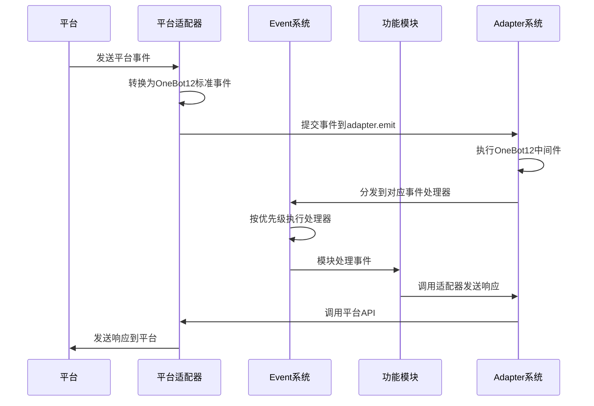

# ErisPulse 模块开发文档

**生成时间**: 2026-01-11 15:32:06

本文件由多个开发文档合并而成，用于辅助开发者理解 ErisPulse 的相关功能。

## 目录

1. [文档总览](#READMEmd)
2. [快速开始指南](#quick-startmd)
3. [基础架构和设计理念](#conceptsmd)
4. [核心模块](#modulesmd)
5. [适配器](#adaptersmd)
6. [事件系统](#event-systemmd)
7. [开发者指南列表](#READMEmd)
8. [模块开发指南](#modulemd)
9. [标准规范总览](#READMEmd)
10. [事件转换标准](#event-conversionmd)
11. [API响应标准](#api-responsemd)
12. [平台特性总览](#READMEmd)
13. [云湖平台特性](#yunhumd)
14. [Telegram平台特性](#telegrammd)
15. [OneBot11平台特性](#onebot11md)
16. [邮件平台特性](#emailmd)

## 各文件对应内容说明

| 文件名 | 作用 |
|--------|------|
| [README.md](#READMEmd) | 文档总览 |
| [quick-start.md](#quick-startmd) | 快速开始指南 |
| [concepts.md](#conceptsmd) | 基础架构和设计理念 |
| [modules.md](#modulesmd) | 核心模块 |
| [adapters.md](#adaptersmd) | 适配器 |
| [event-system.md](#event-systemmd) | 事件系统 |
| [README.md](#READMEmd) | 开发者指南列表 |
| [module.md](#modulemd) | 模块开发指南 |
| [README.md](#READMEmd) | 标准规范总览 |
| [event-conversion.md](#event-conversionmd) | 事件转换标准 |
| [api-response.md](#api-responsemd) | API响应标准 |
| [README.md](#READMEmd) | 平台特性总览 |
| [yunhu.md](#yunhumd) | 云湖平台特性 |
| [telegram.md](#telegrammd) | Telegram平台特性 |
| [onebot11.md](#onebot11md) | OneBot11平台特性 |
| [email.md](#emailmd) | 邮件平台特性 |

---

<a id="READMEmd"></a>
## 文档总览

# ErisPulse Documentation

欢迎阅读 ErisPulse 文档。ErisPulse 是一个可扩展的多平台消息处理框架，支持通过适配器与不同平台进行交互。

## 文档目录

### 快速开始
- [快速开始指南](quick-start.md)            - 安装和运行 ErisPulse 的入门指南

### AI相关文档
- [AI模块生成](ai/module-generation.md)        - 快速使用AIDocs生成一个AI模块/适配器
- 所有AI物料（注意，不推荐直接使用Full投喂给AI，除非这个模型具有强大的上下文能力）:
  - [模块开发物料](ai/AIDocs/ErisPulse-ModuleDev.md)
  - [适配器开发物料](ai/AIDocs/ErisPulse-AdapterDev.md)
  - [物料集合](ai/AIDocs/ErisPulse-Full.md)

### 核心功能
- [命令行接口](core/cli.md)              - 使用命令行界面管理 ErisPulse
- [核心概念](core/concepts.md)      - ErisPulse 的基础架构和设计理念
- [核心模块](core/modules.md)       - 存储、配置、日志等核心组件详解
- [适配器系统](core/adapters.md)    - 平台适配器的使用和开发
- [事件系统](core/event-system.md)  - Event 模块的使用(事件监听、事件处理、事件分发)
- [懒加载模块系统](core/lazy-loading.md) - 懒加载模块系统的使用和配置
- [路由管理器](core/router.md)     - HTTP和WebSocket路由管理
- [框架配置](core/self-config.md)  - 框架默认配置说明
- [最佳实践](core/best-practices.md) - 开发和部署建议

### 开发指南
- [开发入门](development/README.md)     - 开发环境搭建和基本概念
- [模块开发](development/module.md)     - 开发自定义功能模块
- [适配器开发](development/adapter.md)  - 开发一个平台适配器
- [CLI 开发](development/cli.md)        - 扩展命令行工具功能

### 标准规范
- [标准规范](standards/README.md)           - ErisPulse 技术标准总览
- [事件转换](standards/event-conversion.md) - 平台事件到 OneBot12 标准的转换规范
- [API 响应](standards/api-response.md)     - 适配器 API 响应格式标准

### 平台特性
- [平台特性总览](platform-features/README.md) - 平台适配器通用接口和功能说明
- 各个平台特性:
  - [云湖平台特性](platform-features/yunhu.md) - 云湖适配器特有功能说明
  - [Telegram平台特性](platform-features/telegram.md) - Telegram适配器特有功能说明
  - [OneBot11平台特性](platform-features/onebot11.md) - OneBot11适配器特有功能说明
  - [OneBot12平台特性](platform-features/onebot12.md) - OneBot12适配器特有功能说明
  - [邮件平台特性](platform-features/email.md) - 邮件适配器特有功能说明

### API 参考
- [API 文档](api/) - 自动生成的详细 API 参考


---

<a id="quick-startmd"></a>
## 快速开始指南

# 快速开始

## 安装ErisPulse

### 使用 pip 安装
确保你的 Python 版本 >= 3.8，然后使用 pip 安装 ErisPulse：
```bash
pip install ErisPulse
```

### 更先进的安装方法
> 采用 [`uv`](https://github.com/astral-sh/uv) 作为 Python 工具链

### 1. 安装 uv

#### 通用方法 (pip):
```bash
pip install uv
```

#### macOS/Linux:
```bash
curl -LsSf https://astral.sh/uv/install.sh | sh
```

#### Windows (PowerShell):
```powershell
powershell -ExecutionPolicy ByPass -c "irm https://astral.sh/uv/install.ps1 | iex"
```

验证安装:
```bash
uv --version
```

### 2. 创建虚拟环境,并安装 ErisPulse

```bash
uv python install 3.12              # 安装 Python 3.12
uv venv                             # 创建虚拟环境
source .venv/bin/activate           # 激活环境 (Windows: .venv\Scripts\activate)
uv pip install ErisPulse --upgrade  # 安装框架
```

---

## 初始化项目

有两种方式初始化项目：

### 交互式初始化（推荐）

1. 使用 epsdk init 启动交互式初始化：

```bash
epsdk init
```

这将启动一个交互式向导，引导您完成：
- 项目名称设置
- 日志级别配置
- 服务器配置（主机和端口）
- 适配器选择和配置
- 项目结构创建

### 快速初始化

如果您只需要快速创建项目结构，可以使用快速模式：

```bash
# 指定项目名称的快速模式
epsdk init -q -n my_bot

# 或者只指定项目名称，仍然会有基本交互
epsdk init -n my_bot
```

### 传统方式

如果您更喜欢传统方式：

1. 创建项目目录并进入：

```bash
mkdir my_bot && cd my_bot
```

2. 初始化 SDK 并生成配置文件：

```bash
ep-init
```
这将在当前目录下生成 `config.toml` 和 `main.py` 入口。

### 查看系统状态

在项目目录中，你可以使用以下命令查看系统状态：

```bash
# 查看所有组件状态
epsdk status

# 查看详细模块信息
epsdk status -t modules

# 查看详细适配器信息
epsdk status -t adapters
```

### 查看系统状态

在项目目录中，你可以使用以下命令查看系统状态：

```bash
# 查看所有组件状态
epsdk status

# 查看详细模块信息
epsdk status -t modules

# 查看详细适配器信息
epsdk status -t adapters
```

---

## 安装模块

你可以通过 CLI 安装所需模块：

```bash
epsdk install Yunhu AIChat
```

你也可以手动编写模块逻辑，参考开发者文档进行模块开发。

---

## 运行你的机器人
运行我们自动生成的程序入口：
```bash
epsdk run main.py
```

或者使用热重载模式（开发时推荐）：

```bash
epsdk run main.py --reload
```


---

<a id="conceptsmd"></a>
## 基础架构和设计理念

# ErisPulse 的基础架构和设计理念

## 设计理念
- 模块化架构：通过模块化设计实现功能的解耦和复用
- 事件驱动模型：基于事件驱动的架构提高系统的响应性和扩展性
- 跨平台支持：通过适配器系统实现对多种平台的支持
- 用户/AI体验优先：简化开发流程，提供友好的API接口

## 核心组件


## 工作流程
1. **事件接收**：平台适配器接收来自平台的原始事件
2. **事件标准化**：适配器将原始事件转换为OneBot12标准事件格式
3. **事件提交**：通过`adapter.emit`方法将标准化事件提交到适配器系统
4. **中间件处理**：执行注册的OneBot12中间件对事件进行预处理
5. **事件分发**：适配器系统将事件分发到对应的事件处理器
6. **事件处理**：Event系统按照优先级顺序执行注册的事件处理器
7. **模块响应**：功能模块处理事件并生成响应
8. **响应发送**：模块通过适配器系统发送响应到平台


---

<a id="modulesmd"></a>
## 核心模块

# ErisPulse 核心模块

ErisPulse 提供了多个核心模块，为开发者提供基础功能支持。

## 0. 核心模块概览

| 名称 | 用途 |
|------|------|
| `sdk` | SDK对象 |
| `storage`/`sdk.storage` | 获取/设置数据库配置 |
| `config`/`sdk.config` | 获取/设置模块配置 |
| `module_registry`/`sdk.module_registry` | 模块状态管理器 |
| `adapter`/`sdk.adapter` | 适配器管理/获取实例 |
| `module`/`sdk.module` | 获取模块实例 |
| `logger`/`sdk.logger` | 日志记录器 |
| `BaseAdapter`/`sdk.BaseAdapter` | 适配器基类 |
| `Event`/`sdk.Event` | 事件处理模块 |
| `lifecycle`/`sdk.lifecycle` | 生命周期事件管理器 |
| `ux`/`sdk.ux` | 用户体验管理器 |
| `UXManager`/`sdk.UXManager` | UX管理器类 |
| `router`/`sdk.router` | 路由管理器 |
| `RouterManager`/`sdk.RouterManager` | 路由管理器类 |

> 注意: `Event` 模块是 ErisPulse 2.2.0 弹簧的新模块,发布模块时请注意提醒用户兼容性问题

### 懒加载模块系统

ErisPulse 默认启用懒加载模块系统，这意味着模块只有在第一次被访问时才会实际加载和初始化。这样可以显著提升应用启动速度和内存效率。

详细说明请参考：[懒加载模块系统](./lazy-loading.md)

```python
# 全局配置懒加载
[ErisPulse.framework]
enable_lazy_loading = true  # true=启用懒加载(默认)，false=禁用懒加载

# 模块级别控制
class MyModule(BaseModule):
    @staticmethod
    def should_eager_load() -> bool:
        return True  # 返回True表示禁用懒加载
```

### 事件系统子模块

Event 模块包含以下子模块：

| 子模块 | 用途 |
|-------|------|
| `Event.command` | 命令处理 |
| `Event.message` | 消息事件处理 |
| `Event.notice` | 通知事件处理 |
| `Event.request` | 请求事件处理 |
| `Event.meta` | 元事件处理 |
| `Event.exceptions` | 事件异常处理 |

```python
# 直接导入方式
from ErisPulse.Core import (
        storage, config, module_registry,
        adapter, module, logger,
        BaseAdapter, Event, lifecycle
    )

# 通过SDK对象方式
from ErisPulse import sdk
sdk.storage  # 等同于直接导入的storage
```

## 1. 存储系统 (storage)

基于 SQLite 的键值存储系统，支持复杂数据类型的持久化存储。

### 主要功能

- 键值存储：`storage.set(key, value)` / `storage.get(key, default)`
- 事务支持：通过 `storage.transaction()` 上下文管理器
- 数据快照和恢复
- 自动备份机制
- 批量操作：`storage.set_multi(dict)` / `storage.delete_multi(list)`

### 使用示例

```python
from ErisPulse import sdk

# 设置存储项
sdk.storage.set("user.settings", {"theme": "dark", "language": "zh-CN"})

# 获取存储项
settings = sdk.storage.get("user.settings", {})

# 使用事务
with sdk.storage.transaction():
    sdk.storage.set("key1", "value1")
    sdk.storage.set("key2", "value2")

# 批量操作
sdk.storage.set_multi({
    "key1": "value1",
    "key2": "value2"
})
sdk.storage.delete_multi(["key1", "key2"])
```

## 2. 配置管理 (config)

TOML 格式配置文件管理器，用于管理模块和适配器配置。

### 主要功能

- 模块配置读取：`config.getConfig(key, default)`
- 配置项设置：`config.setConfig(key, value)`
- 支持嵌套配置结构

### 使用示例

```python
from ErisPulse import sdk

# 获取模块配置
module_config = sdk.config.getConfig("MyModule", {})

# 设置默认配置
if not module_config:
    default_config = {
        "api_url": "https://api.example.com",
        "timeout": 30
    }
    sdk.config.setConfig("MyModule", default_config)

# 嵌套配置访问
nested_value = sdk.config.getConfig("MyModule.subkey.value", "default")
sdk.config.setConfig("MyModule.subkey.value", "new_value")
```

## 3. 日志系统 (logger)

模块化日志系统，支持多级日志和内存存储。

### 主要功能

- 模块级日志级别控制
- 内存日志存储
- 文件日志输出
- 丰富的日志格式
- 子模块日志记录器

### 使用示例

```python
from ErisPulse import sdk

# 记录日志
sdk.logger.info("模块已加载")
sdk.logger.error("发生错误: %s", str(error))

# 设置模块日志级别
sdk.logger.set_module_level("MyModule", "DEBUG")

# 获取子日志记录器
child_logger = sdk.logger.get_child("submodule")
child_logger.info("子模块日志")

# 更多日志级别
sdk.logger.debug("调试信息")
sdk.logger.info("运行状态")
sdk.logger.warning("警告信息")
sdk.logger.error("错误信息")
sdk.logger.critical("致命错误")  # 会触发程序崩溃

# 保存日志到文件
sdk.logger.save_logs("log.txt")
sdk.logger.set_output_file("app.log")
```

## 4. 异常处理 (exceptions)

统一的异常处理机制。

### 主要功能

- 全局异常捕获
- 异步异常处理
- 格式化的错误信息输出

### 使用示例

```python
from ErisPulse import sdk
import asyncio

# 为事件循环设置异常处理器
loop = asyncio.get_running_loop()
sdk.exceptions.setup_async_loop(loop)
```

## 5. 模块管理 (module)

模块管理系统，用于管理模块的启用/禁用状态。

### 主要功能

- 模块状态管理
- 模块信息查询
- 模块依赖处理
- 模块启用/禁用

### 使用示例

```python
from ErisPulse import sdk

# 直接获取模块实例
my_module = sdk.module.get("MyModule")

# 通过属性访问获取模块实例
my_module = sdk.module.MyModule

# 检查模块是否存在且启用
if "MyModule" in sdk.module:
    sdk.module.MyModule.do_something()

# 获取模块信息
module_info = sdk.module.get_info("MyModule")

# 列出所有模块
all_modules = sdk.module.list_modules()

# 启用/禁用模块
sdk.module.enable("MyModule")
sdk.module.disable("MyModule")
```

## 6. 适配器管理 (adapter)

适配器管理系统，用于管理与不同平台的连接和交互。

### 主要功能

- 适配器实例管理
- 事件监听注册
- 消息发送接口

### 使用示例

```python
from ErisPulse import sdk

# 获取适配器实例
adapter_instance = sdk.adapter.yunhu

# 发送消息
sdk.adapter.yunhu.Send.To("user", "U1001").Text("Hello")

# 监听事件
@sdk.adapter.yunhu.on("message")
async def handler(data):
    sdk.logger.info(f"收到原生事件: {data}")

# 监听标准事件
@sdk.adapter.on("message")
async def handler(data):
    if data["platform"] == "yunhu":
        sdk.logger.info(f"收到云湖标准事件: {data}")
```

## 7. 事件处理 (Event)
> 更完整的事件处理示例，请参考 docs/core/event-system.md 文档

事件处理模块，提供了一套完整的事件处理机制。

### 主要功能

- 命令处理
- 消息事件处理
- 通知事件处理
- 请求事件处理
- 元事件处理
- 事件异常处理

### 使用示例

```python
from ErisPulse.Core.Event import message, command, notice, request, meta

# 消息事件处理
@message.on_message()
async def message_handler(event):
    sdk.logger.info(f"收到消息事件: {event}")

# 命令处理
@command(["help", "h"], aliases=["帮助"], help="显示帮助信息")
async def help_handler(event):
    sdk.logger.info(f"收到命令事件: {event}")

# 通知事件处理
@notice.on_group_increase()
async def notice_handler(event):
    sdk.logger.info(f"收到群成员增加事件: {event}")

# 请求事件处理
@request.on_friend_request()
async def request_handler(event):
    sdk.logger.info(f"收到好友请求事件: {event}")

# 元事件处理
@meta.on_connect()
async def connect_handler(event):
    sdk.logger.info(f"平台连接成功: {event['platform']}")
```

## 8. 生命周期管理 (lifecycle)

生命周期管理模块提供了统一的生命周期事件管理和触发机制。所有核心组件和第三方模块都可以通过此模块提交和监听生命周期事件。

### 主要功能

- 生命周期事件注册和监听
- 标准化生命周期事件格式
- 点式结构事件监听（例如 `module.init` 可以被 `module` 监听到）
- 自定义事件支持
- 事件计时器功能

### 事件标准格式

所有生命周期事件都遵循以下标准格式：

```json
{
    "event": "事件名称",
    "timestamp": 1234567890,
    "data": {
        // 事件相关数据
    },
    "source": "事件来源模块",
    "msg": "事件描述"
}
```

### 事件处理机制

#### 点式结构事件
ErisPulse 支持点式结构的事件命名，例如 `module.init`。当触发具体事件时，也会触发其父级事件：
- 触发 `module.init` 事件时，也会触发 `module` 事件
- 触发 `adapter.status.change` 事件时，也会触发 `adapter.status` 和 `adapter` 事件

#### 通配符事件处理器
可以注册 `*` 事件处理器来捕获所有事件。

### 标准生命周期事件

#### 核心初始化事件

| 事件名称 | 触发时机 | 数据结构 |
|---------|---------|---------|
| `core.init.start` | 核心初始化开始时 | `{}` |
| `core.init.complete` | 核心初始化完成时 | `{"duration": "初始化耗时(秒)", "success": true/false}` |

#### 模块生命周期事件

| 事件名称 | 触发时机 | 数据结构 |
|---------|---------|---------|
| `module.load` | 模块加载完成时 | `{"module_name": "模块名", "success": true/false}` |
| `module.init` | 模块初始化完成时 | `{"module_name": "模块名", "success": true/false}` |
| `module.unload` | 模块卸载时 | `{"module_name": "模块名", "success": true/false}` |

#### 适配器生命周期事件

| 事件名称 | 触发时机 | 数据结构 |
|---------|---------|---------|
| `adapter.load` | 适配器加载完成时 | `{"platform": "平台名", "success": true/false}` |
| `adapter.start` | 适配器开始启动时 | `{"platforms": ["平台名列表"]}` |
| `adapter.status.change` | 适配器状态发生变化时 | `{"platform": "平台名", "status": "状态(starting/started/start_failed/stopping/stopped)", "retry_count": 重试次数(可选), "error": "错误信息(可选)"}` |
| `adapter.stop` | 适配器开始关闭时 | `{}` |
| `adapter.stopped` | 适配器关闭完成时 | `{}` |

#### 服务器生命周期事件

| 事件名称 | 触发时机 | 数据结构 |
|---------|---------|---------|
| `server.start` | 服务器启动时 | `{"base_url": "基础url","host": "主机地址", "port": "端口号"}` |
| `server.stop` | 服务器停止时 | `{}` |

### 使用示例

```python
from ErisPulse import sdk

# 监听模块初始化事件
@sdk.lifecycle.on("module.init")
async def module_init_handler(event_data):
    print(f"模块 {event_data['data']['module_name']} 初始化完成")

# 监听适配器状态变化事件
@sdk.lifecycle.on("adapter.status.change")
async def adapter_status_handler(event_data):
    status_data = event_data['data']
    print(f"适配器 {status_data['platform']} 状态变化为: {status_data['status']}")

# 提交自定义生命周期事件
await sdk.lifecycle.submit_event(
    "custom.event",
    data={"custom_field": "custom_value"},
    source="MyModule",
    msg="自定义事件描述"
)

# 使用计时器功能
sdk.lifecycle.start_timer("my_operation")
# ... 执行一些操作 ...
duration = sdk.lifecycle.stop_timer("my_operation")
print(f"操作耗时: {duration} 秒")
```

### 第三方模块集成

生命周期模块是第三方模块也可以使用的核心模块。第三方模块可以通过此模块：

1. 提交自定义生命周期事件
2. 监听标准或自定义生命周期事件
3. 利用计时器功能测量操作耗时

## 模块使用规范

- 所有模块通过 `sdk` 对象统一管理
- 每个模块拥有独立命名空间，使用 `sdk` 进行调用
- 可以在模块间使用 `sdk.<module_name>.<func>` 的方式调用其他模块中的方法
- 生命周期事件可用于模块间通信和状态同步

## 配置管理

### 1. 命令前缀配置
```toml
[ErisPulse]
[ErisPulse.event]
[ErisPulse.event.command]
prefix = "/"
case_sensitive = true
allow_space_prefix = false

[ErisPulse.event.message]
ignore_self = true
```

### 2. 框架配置
```toml
[ErisPulse]
[ErisPulse.server]
host = "0.0.0.0"
port = 8000
ssl_certfile = ""
ssl_keyfile = ""

[ErisPulse.logger]
level = "INFO"
log_files = []
memory_limit = 1000
```

## 9. 用户体验管理 (ux)

用户体验管理器提供了友好的界面和简化的操作方法，包括状态查看、项目初始化和交互式配置等功能。

### 主要功能

- **欢迎信息显示**：显示框架版本和欢迎消息
- **系统状态概览**：展示框架各组件的运行状态
- **模块状态查看**：列出所有模块的详细状态和信息
- **适配器状态查看**：列出所有适配器的状态和信息
- **项目初始化**：创建新的项目结构和配置文件
- **交互式配置**：引导用户完成系统和适配器配置
- **远程适配器获取**：从云端获取可用适配器列表并安装

### 基本使用

```python
from ErisPulse import sdk

# 显示欢迎信息
sdk.ux.welcome("2.3.0")

# 显示系统状态概览
sdk.ux.show_status()

# 列出所有模块状态
sdk.ux.list_modules(detailed=True)

# 列出所有适配器状态
sdk.ux.list_adapters(detailed=True)
```

### 项目初始化

```python
# 初始化新项目（基本结构）
sdk.ux.init_project("MyBot", ["yunhu", "telegram"])

# 交互式初始化（包含配置向导）
sdk.ux.interactive_init("MyBot", force=False)
```

### 高级功能

```python
# 获取可用适配器列表（从云端）
adapters = await sdk.ux._fetch_available_adapters()
print("可用适配器:", adapters)

# 运行交互式适配器配置
sdk.ux._configure_adapters_interactive_sync("/path/to/project")
```

### 命令行使用

```bash
# 初始化新项目
erispulse init MyBot

# 交互式初始化
erispulse init -i

# 查看系统状态
erispulse status

# 查看模块详细信息
erispulse status --type modules

# 查看适配器详细信息
erispulse status --type adapters
```

### 项目结构

使用UX管理器初始化的项目包含以下结构：

```
MyBot/
├── main.py              # 主程序文件
├── config.toml          # 配置文件
├── modules/             # 模块目录
│   └── example.py       # 示例模块
├── config/              # 配置目录
└── logs/                # 日志目录
```

### 自动生成的配置文件

配置文件 `config.toml` 包含以下部分：

```toml
[ErisPulse]
# 全局配置

[ErisPulse.server]
host = "0.0.0.0"
port = 8000

[ErisPulse.logger]
level = "INFO"
log_files = ["logs/app.log"]
memory_limit = 1000

[ErisPulse.adapters.status]
yunhu = false
telegram = false
```

### 自动生成的主程序

主程序 `main.py` 包含基本的启动逻辑：

```python
import asyncio
from ErisPulse import sdk

async def main():
    """主程序入口"""
    # 初始化 SDK
    await sdk.init()
    
    # 启动适配器
    await sdk.adapter.startup()
    
    print("ErisPulse 已启动，按 Ctrl+C 退出")
    try:
        while True:
            await asyncio.sleep(1)
    except KeyboardInterrupt:
        print("\n正在关闭...")
        await sdk.adapter.shutdown()

if __name__ == "__main__":
    asyncio.run(main())
```

### 云端适配器集成

UX管理器与PackageManager集成，支持从云端获取和安装适配器：

```python
# 获取可用适配器（带5分钟缓存）
adapters = await sdk.ux._fetch_available_adapters()

# 默认适配器列表（当云端获取失败时）
default_adapters = {
    "yunhu": "云湖平台适配器",
    "telegram": "Telegram机器人适配器",
    "onebot11": "OneBot11标准适配器",
    "email": "邮件适配器"
}
```

### 交互式配置流程

交互式初始化包含以下步骤：

1. **项目名称确认**：输入或确认项目名称
2. **日志级别配置**：设置日志记录级别
3. **服务器配置**：设置主机地址和端口
4. **适配器选择**：从云端列表选择需要的适配器
5. **适配器安装**：自动安装选中的适配器
6. **配置保存**：保存所有配置到文件

### 缓存机制

UX管理器实现了5分钟的适配器缓存机制，减少网络请求：

```python
# 缓存设置
self._cache_duration = 300  # 5分钟缓存

# 检查缓存有效性
current_time = asyncio.get_event_loop().time()
if self._adapter_cache and (current_time - self._adapter_cache_time) < self._cache_duration:
    return self._adapter_cache
```

### 最佳实践

1. **项目初始化**：使用UX管理器初始化新项目，获得标准化的项目结构
2. **配置管理**：通过交互式配置向导完成系统设置
3. **状态监控**：定期使用状态查看功能监控系统运行情况
4. **适配器安装**：通过云端列表获取和安装最新适配器

# 运行配置向导
epsdk config-wizard
```

### 用户体验管理器方法

| 方法 | 描述 | 示例 |
|------|------|------|
| `welcome(version)` | 显示框架欢迎信息 | `sdk.ux.welcome("2.3.0")` |
| `show_status()` | 显示系统状态概览 | `sdk.ux.show_status()` |
| `list_modules(detailed=False)` | 列出所有模块状态 | `sdk.ux.list_modules(True)` |
| `list_adapters(detailed=False)` | 列出所有适配器状态 | `sdk.ux.list_adapters(True)` |
| `configure_wizard()` | 运行配置向导 | `sdk.ux.configure_wizard()` |
| `init_project(project_name, adapter_list=None)` | 初始化新项目 | `sdk.ux.init_project("MyBot", ["yunhu"])` |


---

<a id="adaptersmd"></a>
## 适配器

# ErisPulse 适配器系统

适配器系统是 ErisPulse 实现跨平台支持的核心组件，负责将不同平台的事件转换为统一的 OneBot12 标准事件。

## 适配器职责

1. **事件转换**：将平台特定事件转换为 OneBot12 标准事件
2. **响应发送**：将 OneBot12 标准响应转换为平台特定格式
3. **连接管理**：管理与平台的连接和通信


### 1. SendDSL 消息发送

适配器通过 SendDSL 实现链式调用风格的消息发送接口：

发送中间方法示例：
```python
from ErisPulse.Core import adapter

my_platform = adapter.get("MyPlatform")

# 指定会话类型和对应id的发送接口
my_platform.To('user', '123').Example("hello world")

# 仅指定id的接口（比如email可以仅指定一个ID）
my_platform.To('123').Example("hello world")

# 使用指定账号的发送接口
my_platform.Using('account_id').Example("hello world")

# 直接调用（适用于某些场景，比如没有指定的会话和id）
my_platform.Example("hello world")
```

发送方法示例：
```python
from ErisPulse.Core import adapter

# 使用方式
my_platform = adapter.get("MyPlatform")

# 不等待结果，消息在后台发送
my_platform.Send.To("user", "123").Text("Hello")

# 由于适配器的DSL发送接口返回的是一个AsyncTask，因此你可以自行决定需不需要等待结果

# 等待结果，消息在发送后返回结果
task = my_platform.Send.To("user", "123").Text("Hello")

# 等待结果，并获取结果
result = await task

# 等待结果，并获取结果
result = await my_platform.Send.To("user", "123").Text("Hello")
```
> 返回的 Task 维持了协程的完整状态机，因此可以将其存储在变量中供后续使用 
> **提示**：对于大多数消息发送场景，您不需要等待发送结果。只有在需要确认消息是否成功发送或获取特定返回信息时，才需要 `await` Task 对象。


### 2. 事件监听

有三种事件监听方式：

1. 平台原生事件监听：
   ```python
   from ErisPulse.Core import adapter, logger
   
   @adapter.<AdapterName>.on("event_type")
   async def handler(data):
       logger.info(f"收到原生事件: {data}")
   ```

2. OneBot12标准事件监听：
   ```python
   from ErisPulse.Core import adapter, logger

   @adapter.on("event_type")  # 所有平台的标准事件
   async def handler(data):
       if data["platform"] == "yunhu":
           logger.info(f"收到云湖标准事件: {data}")
   ```

3. 使用 `ErisPulse` 内置的 `Event` 模块进行事件监听（OneBot12标准事件）
    ```python
    from ErisPulse.Core.Event import message, command, notice, request

    @message.on_message()
    async def message_handler(event):
      logger.info(f"收到消息事件: {event}")

    @command(["help", "h"], aliases=["帮助"], help="显示帮助信息")
    async def help_handler(event):
      logger.info(f"收到命令事件: {event}")

    @notice.on_group_increase()
    async def notice_handler(event):
      logger.info(f"收到群成员增加事件: {event}")
    
    @request.on_friend_request()
    async def request_handler(event):
      logger.info(f"收到好友请求事件: {event}")
    ```

ErisPulse对于OneBot12协议进行了一些修改，你可能需要先阅读 `docs/standards` 下的转换标准和api返回规则。


更建议你使用 `Event` 模块来处理事件，它提供了更丰富的功能和语法。


---

<a id="event-systemmd"></a>
## 事件系统

# ErisPulse 事件系统

事件系统是 ErisPulse 的核心组件之一，负责处理各种类型的事件，包括消息、命令、通知、请求、元事件和生命周期事件。

## 事件类型

ErisPulse 支持多种事件类型：

- **消息事件**：处理用户发送的消息
- **命令事件**：处理用户输入的命令
- **通知事件**：处理系统通知（如好友添加、群成员变化等）
- **请求事件**：处理请求（如好友请求、群邀请等）
- **元事件**：处理系统级事件（如连接、断开连接等）
- **生命周期事件**：处理系统生命周期事件（如启动、停止、模块加载等）

## 生命周期事件系统

ErisPulse 提供完整的生命周期事件系统，用于监控系统各组件的运行状态。生命周期事件支持点式结构事件监听，例如可以监听 `module.init` 来捕获所有模块初始化事件。

### 标准生命周期事件

系统定义了以下标准事件类别：

```python
STANDARD_EVENTS = {
    "core": ["init.start", "init.complete"],
    "module": ["load", "init", "unload"],
    "adapter": ["load", "start", "status.change", "stop", "stopped"],
    "server": ["start", "stop"]
}
```

### 事件数据格式

所有生命周期事件都遵循标准格式：

```json
{
    "event": "事件名称",      // 必填
    "timestamp": 1234567890,   // 必填，Unix时间戳
    "data": {},              // 可选，事件相关数据
    "source": "ErisPulse",    // 必填，事件来源
    "msg": "事件描述"          // 可选，事件描述
}
```

### 生命周期事件监听

```python
from ErisPulse.Core import lifecycle

# 监听特定事件
@lifecycle.on("module.init")
async def on_module_init(event):
    print(f"模块初始化: {event['data']['module_name']}")

# 监听父级事件（点式结构）
@lifecycle.on("module")
async def on_any_module_event(event):
    print(f"模块事件: {event['event']}")

# 监听所有事件（通配符）
@lifecycle.on("*")
async def on_any_event(event):
    print(f"系统事件: {event['event']}")

# 监听服务器启动事件
@lifecycle.on("server.start")
async def on_server_start(event):
    print(f"服务器已启动: {event['data']['base_url']}")
```

### 提交生命周期事件

```python
from ErisPulse.Core import lifecycle

# 基本事件提交
await lifecycle.submit_event(
    "custom.event",
    source="MyModule",
    msg="自定义事件",
    data={"key": "value"}
)

# 使用默认值
await lifecycle.submit_event(
    "my.module.loaded",
    data={"module_name": "MyModule"}
)
```

### 计时器功能

生命周期系统提供计时器功能，用于性能测量：

```python
from ErisPulse.Core import lifecycle

# 开始计时
lifecycle.start_timer("operation_1")

# 执行一些操作...

# 获取持续时间（不停止计时器）
elapsed = lifecycle.get_duration("operation_1")
print(f"已运行 {elapsed} 秒")

# 停止计时并获取持续时间
total_time = lifecycle.stop_timer("operation_1")
print(f"操作完成，总耗时 {total_time} 秒")
```

### 命令处理

ErisPulse 提供了强大的命令处理系统，支持基本命令、命令组、权限检查和等待用户回复等高级功能。
```python
from ErisPulse.Core.Event import command

# 基本命令
@command("hello", help="发送问候消息")
async def hello_command(event):
    platform = event["platform"]
    user_id = event["user_id"]
    
    # 发送回复消息
    adapter_instance = getattr(sdk.adapter, platform)
    await adapter_instance.Send.To("user", user_id).Text("Hello World!")

# 带别名的命令
@command(["help", "h"], aliases=["帮助"], help="显示帮助信息")
async def help_command(event):
    platform = event["platform"]
    user_id = event["user_id"]
    help_text = command.help()
    
    adapter_instance = getattr(sdk.adapter, platform)
    await adapter_instance.Send.To("user", user_id).Text(help_text)

# 带权限检查的命令
def is_admin(event):
    # 检查是否为管理员
    user_id = event.get("user_id")
    return user_id in ["admin_id_1", "admin_id_2"]

@command("admin", permission=is_admin, help="管理员命令")
async def admin_command(event):
    # 只有管理员才能执行
    pass

# 隐藏命令
@command("secret", hidden=True, help="秘密命令")
async def secret_command(event):
    # 不会在帮助中显示
    pass

# 命令组
@command("admin.reload", group="admin", help="重新加载模块")
async def reload_command(event):
    # 管理员命令逻辑
    pass

# 等待用户回复的交互式命令
@command("ask", help="询问用户信息")
async def ask_command(event):
    platform = event["platform"]
    user_id = event["user_id"]
    detail_type = "group" if event.get("detail_type") == "group" else "user"
    target_id = event.get("group_id") or user_id
    
    adapter_instance = getattr(sdk.adapter, platform)
    
    # 等待用户回复
    reply_event = await command.wait_reply(
        event, 
        prompt="请输入您的姓名:", 
        timeout=30.0
    )
    
    if reply_event:
        # 提取用户回复内容
        user_reply = ""
        for segment in reply_event.get("message", []):
            if segment.get("type") == "text":
                user_reply = segment.get("data", {}).get("text", "")
                break
        
        if user_reply:
            await adapter_instance.Send.To(detail_type, target_id).Text(f"您好，{user_reply}！")
        else:
            await adapter_instance.Send.To(detail_type, target_id).Text("我没有收到有效的回复。")
    else:
        await adapter_instance.Send.To(detail_type, target_id).Text("您没有在规定时间内回复。")

# 带验证和回调的高级交互命令
@command("confirm", help="确认操作")
async def confirm_command(event):
    platform = event["platform"]
    user_id = event["user_id"]
    detail_type = "group" if event.get("detail_type") == "group" else "user"
    target_id = event.get("group_id") or user_id
    
    adapter_instance = getattr(sdk.adapter, platform)
    
    # 定义验证函数
    def validate_yes_no(reply_event):
        text_content = ""
        for segment in reply_event.get("message", []):
            if segment.get("type") == "text":
                text_content = segment.get("data", {}).get("text", "").strip().lower()
                break
        return text_content in ["是", "否", "yes", "no", "y", "n"]
    
    # 定义回调函数
    async def handle_confirmation(reply_event):
        text_content = ""
        for segment in reply_event.get("message", []):
            if segment.get("type") == "text":
                text_content = segment.get("data", {}).get("text", "").strip().lower()
                break
        
        if text_content in ["是", "yes", "y"]:
            await adapter_instance.Send.To(detail_type, target_id).Text("操作已确认！")
        else:
            await adapter_instance.Send.To(detail_type, target_id).Text("操作已取消。")
    
    # 等待用户确认
    await command.wait_reply(
        event,
        prompt="您确定要执行此操作吗？请输入'是'或'否':",
        timeout=30.0,
        callback=handle_confirmation,
        validator=validate_yes_no
    )
```

### 消息处理
```python
from ErisPulse.Core.Event import message

# 处理所有消息
@message.on_message()
async def handle_message(event):
    sdk.logger.info(f"收到消息: {event['alt_message']}")

# 处理私聊消息
@message.on_private_message()
async def handle_private_message(event):
    user_id = event["user_id"]
    sdk.logger.info(f"收到私聊消息，来自用户: {user_id}")

# 处理群聊消息
@message.on_group_message()
async def handle_group_message(event):
    group_id = event["group_id"]
    user_id = event["user_id"]
    sdk.logger.info(f"收到群消息，群: {group_id}，用户: {user_id}")

# 处理@消息
@message.on_at_message()
async def handle_at_message(event):
    user_id = event["user_id"]
    sdk.logger.info(f"收到@消息，来自用户: {user_id}")
```

### 通知处理
```python
from ErisPulse.Core.Event import notice

# 处理好友添加通知
@notice.on_friend_add()
async def handle_friend_add(event):
    user_id = event["user_id"]
    sdk.logger.info(f"新好友添加: {user_id}")
    
    # 发送欢迎消息
    platform = event["platform"]
    adapter_instance = getattr(sdk.adapter, platform)
    await adapter_instance.Send.To("user", user_id).Text("欢迎添加我为好友！")

# 处理群成员增加通知
@notice.on_group_increase()
async def handle_group_increase(event):
    group_id = event["group_id"]
    user_id = event["user_id"]
    sdk.logger.info(f"新成员加入群: {group_id}，用户: {user_id}")

# 处理好友删除通知
@notice.on_friend_remove()
async def handle_friend_remove(event):
    user_id = event["user_id"]
    sdk.logger.info(f"好友删除: {user_id}")

# 处理群成员减少通知
@notice.on_group_decrease()
async def handle_group_decrease(event):
    group_id = event["group_id"]
    user_id = event["user_id"]
    sdk.logger.info(f"群成员减少，群: {group_id}，用户: {user_id}")
```

### 请求处理
```python
from ErisPulse.Core.Event import request

# 处理好友请求
@request.on_friend_request()
async def handle_friend_request(event):
    user_id = event["user_id"]
    sdk.logger.info(f"收到好友请求，来自用户: {user_id}")

# 处理群邀请请求
@request.on_group_request()
async def handle_group_request(event):
    group_id = event["group_id"]
    user_id = event["user_id"]
    sdk.logger.info(f"收到群邀请请求，群: {group_id}，用户: {user_id}")
```

### 元事件处理
```python
from ErisPulse.Core.Event import meta

# 处理连接事件
@meta.on_connect()
async def handle_connect(event):
    platform = event["platform"]
    sdk.logger.info(f"平台 {platform} 连接成功")

# 处理断开连接事件
@meta.on_disconnect()
async def handle_disconnect(event):
    platform = event["platform"]
    sdk.logger.info(f"平台 {platform} 断开连接")

# 处理心跳事件
@meta.on_heartbeat()
async def handle_heartbeat(event):
    platform = event["platform"]
    sdk.logger.debug(f"平台 {platform} 心跳")
```

### 高级功能

#### 优先级控制
```python
# 设置处理器优先级
@message.on_message(priority=10)
async def high_priority_handler(event):
    # 高优先级处理器先执行
    pass

@message.on_message(priority=1)
async def low_priority_handler(event):
    # 低优先级处理器后执行
    pass
```

#### 命令系统高级功能

##### 1. 等待用户回复

ErisPulse 提供了强大的等待用户回复功能，支持超时、验证器和回调函数：

```python
from ErisPulse.Core.Event import command

# 基本等待回复
@command("ask", help="询问用户信息")
async def ask_command(event):
    platform = event["platform"]
    user_id = event["user_id"]
    detail_type = "group" if event.get("detail_type") == "group" else "user"
    target_id = event.get("group_id") or user_id
    
    adapter_instance = getattr(sdk.adapter, platform)
    
    # 等待用户回复
    reply_event = await command.wait_reply(
        event, 
        prompt="请输入您的姓名:", 
        timeout=30.0
    )
    
    if reply_event:
        # 提取用户回复内容
        user_reply = ""
        for segment in reply_event.get("message", []):
            if segment.get("type") == "text":
                user_reply = segment.get("data", {}).get("text", "")
                break
        
        if user_reply:
            await adapter_instance.Send.To(detail_type, target_id).Text(f"您好，{user_reply}！")
        else:
            await adapter_instance.Send.To(detail_type, target_id).Text("我没有收到有效的回复。")
    else:
        await adapter_instance.Send.To(detail_type, target_id).Text("您没有在规定时间内回复。")

# 带验证和回调的等待回复
@command("confirm", help="确认操作")
async def confirm_command(event):
    platform = event["platform"]
    user_id = event["user_id"]
    detail_type = "group" if event.get("detail_type") == "group" else "user"
    target_id = event.get("group_id") or user_id
    
    adapter_instance = getattr(sdk.adapter, platform)
    
    # 定义验证函数
    def validate_yes_no(reply_event):
        text_content = ""
        for segment in reply_event.get("message", []):
            if segment.get("type") == "text":
                text_content = segment.get("data", {}).get("text", "").strip().lower()
                break
        return text_content in ["是", "否", "yes", "no", "y", "n"]
    
    # 定义回调函数
    async def handle_confirmation(reply_event):
        text_content = ""
        for segment in reply_event.get("message", []):
            if segment.get("type") == "text":
                text_content = segment.get("data", {}).get("text", "").strip().lower()
                break
        
        if text_content in ["是", "yes", "y"]:
            await adapter_instance.Send.To(detail_type, target_id).Text("操作已确认！")
        else:
            await adapter_instance.Send.To(detail_type, target_id).Text("操作已取消。")
    
    # 等待用户确认
    await command.wait_reply(
        event,
        prompt="您确定要执行此操作吗？请输入'是'或'否':",
        timeout=30.0,
        callback=handle_confirmation,
        validator=validate_yes_no
    )
```

##### 2. 命令组

命令组允许您将相关命令组织在一起，便于管理和权限控制：

```python
# 管理员命令组
@command("admin.reload", group="admin", help="重新加载模块")
async def reload_command(event):
    # 管理员命令逻辑
    await sdk.module.reload(event["args"][0] if event["args"] else "all")

@command("admin.stop", group="admin", help="停止机器人")
async def stop_command(event):
    # 停止机器人逻辑
    await sdk.adapter.shutdown()

@command("admin.restart", group="admin", help="重启机器人")
async def restart_command(event):
    # 重启机器人逻辑
    await sdk.adapter.restart()

# 用户命令组
@command("user.profile", group="user", help="查看个人资料")
async def profile_command(event):
    # 查看个人资料逻辑
    pass

@command("user.settings", group="user", help="设置个人偏好")
async def settings_command(event):
    # 设置个人偏好逻辑
    pass

# 获取命令组中的所有命令
admin_commands = command.get_group_commands("admin")
user_commands = command.get_group_commands("user")
```

##### 3. 权限检查系统

ErisPulse 提供了灵活的权限检查系统，可以为命令或命令组设置权限：

```python
# 定义权限检查函数
def is_admin(event):
    """检查是否为管理员"""
    user_id = event.get("user_id")
    return user_id in ["admin_id_1", "admin_id_2"]

async def is_group_admin(event):
    """检查是否为群管理员"""
    platform = event["platform"]
    user_id = event["user_id"]
    group_id = event.get("group_id")
    
    if not group_id:
        return False
    
    adapter_instance = getattr(sdk.adapter, platform)
    # 假设适配器有获取群成员信息的方法
    member_info = await adapter_instance.get_group_member_info(group_id, user_id)
    return member_info.get("role") in ["admin", "owner"]

def is_whitelist(event):
    """检查用户是否在白名单中"""
    user_id = event.get("user_id")
    return user_id in config.getConfig("whitelist", [])

# 为单个命令设置权限
@command("admin", permission=is_admin, help="管理员命令")
async def admin_command(event):
    # 只有管理员才能执行
    pass

# 为命令组设置全局权限
command.permissions["admin"] = is_admin
command.permissions["user"] = is_whitelist

# 复杂权限检查
@command("group.manage", permission=lambda e: is_admin(e) or is_group_admin(e), help="群管理")
async def group_manage_command(event):
    # 管理员或群管理员可执行
    pass
```

##### 4. 高级命令配置

```python
# 隐藏命令（不会在帮助中显示）
@command("secret", hidden=True, help="秘密命令")
async def secret_command(event):
    pass

# 自定义使用说明
@command("custom", usage="/custom <参数1> <参数2>", help="自定义命令")
async def custom_command(event):
    pass

# 多名称命令
@command(["name1", "name2"], aliases=["alias1", "alias2"], help="多名称命令")
async def multi_name_command(event):
    pass
```

##### 5. 命令帮助系统

```python
# 获取命令帮助信息
help_text = command.help()

# 获取特定命令信息
cmd_info = command.get_command("admin")

# 获取所有可见命令
visible_commands = command.get_visible_commands()

# 在命令中显示帮助
@command("help", help="显示帮助信息")
async def help_command(event):
    platform = event["platform"]
    user_id = event["user_id"]
    detail_type = "group" if event.get("detail_type") == "group" else "user"
    target_id = event.get("group_id") or user_id
    
    adapter_instance = getattr(sdk.adapter, platform)
    
    # 获取帮助文本
    help_text = command.help()
    
    # 发送帮助信息
    await adapter_instance.Send.To(detail_type, target_id).Text(help_text)
```
    pass

@message.on_message(priority=20)
async def low_priority_handler(event):
    # 低优先级处理器后执行
    pass
```

#### 条件处理器
```python
# 定义条件函数
def keyword_condition(event):
    message_segments = event.get("message", [])
    for segment in message_segments:
        if segment.get("type") == "text":
            text = segment.get("data", {}).get("text", "")
            return "关键词" in text
    return False

# 注册条件处理器
@message.on_message(condition=keyword_condition)
async def keyword_handler(event):
    # 只有消息包含"关键词"时才会执行
    pass
```


---

<a id="READMEmd"></a>
## 开发者指南列表

# ErisPulse 开发者指南

本文档包含 ErisPulse 的模块和适配器开发指南，帮助开发者快速上手开发自定义功能。

## 开发文档列表

- [模块开发指南](module.md) - 开发自定义功能模块
- [适配器开发指南](adapter.md) - 开发一个平台适配器
- [CLI 开发指南](cli.md) - 扩展命令行工具功能

## 开发准备

在开始开发之前，请确保您已经：

1. 阅读了 [核心概念](../core/concepts.md) 文档，了解 ErisPulse 的基础架构
2. 熟悉了 [事件系统](../core/event-system.md) 的工作原理
3. 了解了 [适配器系统](../core/adapters.md) 的设计模式
4. 安装了必要的开发环境和依赖

## 开发类型选择

根据您的需求选择合适的开发类型：

### 模块开发
适用于扩展 ErisPulse 的功能，如命令处理、业务逻辑等。
- 参考文档：[模块开发指南](module.md)
- 典型应用：聊天机器人功能、数据处理模块等

### 适配器开发
适用于连接新的消息平台，实现跨平台消息处理。
- 参考文档：[适配器开发指南](adapter.md)
- 典型应用：连接新的聊天平台、邮件系统等

### CLI 扩展开发
适用于扩展命令行工具功能，提供额外的管理命令。
- 参考文档：[CLI 开发指南](cli.md)
- 典型应用：自定义管理命令、工具脚本等

## 开发最佳实践

1. 遵循 [标准规范](../standards/README.md) 确保兼容性
2. 使用 [事件系统](../core/event-system.md) 进行事件处理
3. 合理使用 [核心模块](../core/modules.md) 提供的功能
4. 参考 [最佳实践](../core/best-practices.md) 提高代码质量


---

<a id="modulemd"></a>
## 模块开发指南

# ErisPulse 模块开发指南

## 1. 模块结构
一个标准的模块包结构应该是：

```
MyModule/
├── pyproject.toml    # 项目配置
├── README.md         # 项目说明
├── LICENSE           # 许可证文件
└── MyModule/
    ├── __init__.py  # 模块入口
    └── Core.py      # 核心逻辑(只是推荐结构使用Core.py | 只要模块入口使用正确，你可以使用任何你喜欢的文件名)
```

## 2. `pyproject.toml` 文件
模块的配置文件, 包括模块信息、依赖项、模块/适配器入口点等信息

```toml
[project]
name = "ErisPulse-MyModule"     # 模块名称, 建议使用 ErisPulse-<模块名称> 的格式命名
version = "1.0.0"
description = "一个非常哇塞的模块"
readme = "README.md"
requires-python = ">=3.9"
license = { file = "LICENSE" }
authors = [ { name = "yourname", email = "your@mail.com" } ]
dependencies = [
    
]

# 模块主页, 用于在模块管理器中显示模块信息 | 尽量使用仓库地址，以便模块商店显示文档时指定为仓库的 README.md 文件
[project.urls]
"homepage" = "https://github.com/yourname/MyModule"

# 模块入口点，用于指定模块的入口类 当然也可以在一个包中定义多个模块，但并不建议这样做
[project.entry-points]
"erispulse.module" = { "MyModule" = "MyModule:Main" }

```

## 3. `MyModule/__init__.py` 文件

顾名思义,这只是使你的模块变成一个Python包, 你可以在这里导入模块核心逻辑, 当然也可以让他保持空白

示例这里导入了模块核心逻辑

```python
from .Core import Main
```

---

## 4. `MyModule/Core.py` 文件

实现模块主类 `Main`，必须继承 `BaseModule` 基类以获得标准化的生命周期管理功能。

```python
from ErisPulse import sdk
from ErisPulse.Core.Bases import BaseModule
from ErisPulse.Core.Event import command

class Main(BaseModule):
    def __init__(self):
        self.sdk = sdk
        self.logger = sdk.logger.get_child("MyModule")
        self.storage = sdk.storage
        
        self.config = self._get_config()

    @staticmethod
    def should_eager_load():
        # 这适用于懒加载模块, 如果模块需要立即加载, 请返回 True | 比如一些监听器模块/定时器模块等等
        return False
    
    async def on_load(self, event):
        command("一个命令", help="这是一个命令", usage="命令 参数")(self.ACommand)
        self.logger.info("模块已加载")
        
    async def on_unload(self, event):
        command.unregister(self.ACommand)
        self.logger.info("模块已卸载")

    # 从 config.toml 中获取配置, 如果不存在则使用默认值
    def _get_config(self):
        config = self.sdk.config.getConfig("MyModule")
        if not config:
            default_config = {
                "my_config_key": "default_value"
            }
            self.sdk.config.setConfig("MyModule", default_config)
            self.logger.warning("未找到模块配置, 对应模块配置已经创建到config.toml中")
            return default_config
        return config

    async def ACommand(self):
        self.logger.info("命令已执行")

    def print_hello(self):
        self.logger.info("Hello World!")
```

- 所有 SDK 提供的功能都可通过 `sdk` 对象访问。
```python
# 这时候在其它地方可以访问到该模块
from ErisPulse import sdk
sdk.MyModule.print_hello()

# 运行模块主程序（推荐使用CLI命令）
# epsdk run main.py --reload
```

### BaseModule 基类
方法说明
| 方法名 | 说明 | 必须实现 | 参数 | 返回值 |
| --- | --- | --- | --- | --- |
| should_eager_load() | 静态方法，决定模块是否应该立即加载而不是懒加载 | 否 | 无 | bool |
| on_load(event) | 模块加载时调用，用于初始化资源、注册事件处理器等 | 是 | event | bool |
| on_unload(event) | 模块卸载时调用，用于清理资源、注销事件处理器等 | 是 | event | bool |

## 6. 模块路由注册

从 ErisPulse 2.1.15 版本开始，模块也可以注册自己的 HTTP/WebSocket 路由，用于提供 Web API 或实时通信功能。

### 6.1 HTTP 路由注册

模块可以注册 HTTP 路由来提供 REST API 接口：

```python
from ErisPulse import sdk
from fastapi import Request

class Main(BaseModule):
    def __init__(self):
        super().__init__()
        self.sdk = sdk
        self.logger = sdk.logger.get_child("MyModule")
        self.storage = sdk.storage
        
        # 注册模块路由
        self._register_routes()
        
    def _register_routes(self):
        """注册模块路由"""
        
        # 注册 HTTP GET 路由
        async def get_info():
            return {
                "module": "MyModule", 
                "version": "1.0.0",
                "status": "running"
            }
        
        # 注册 HTTP POST 路由
        async def process_data(request: Request):
            data = await request.json()
            # 处理数据逻辑
            return {"result": "success", "received": data}
        
        # 使用 router 注册路由
        self.sdk.router.register_http_route(
            module_name="MyModule",
            path="/info",
            handler=get_info,
            methods=["GET"]
        )
        
        self.sdk.router.register_http_route(
            module_name="MyModule", 
            path="/process",
            handler=process_data,
            methods=["POST"]
        )
        
        self.logger.info("模块路由注册完成")
```

### 6.2 WebSocket 路由注册

模块也可以注册 WebSocket 路由来实现实时通信功能：

```python
from ErisPulse import sdk
from fastapi import WebSocket, WebSocketDisconnect

class Main(BaseModule):
    def __init__(self):
        super().__init__()
        self.sdk = sdk
        self.logger = sdk.logger.get_child("MyModule")
        self.storage = sdk.storage
        self._connections = set()
        
        # 注册 WebSocket 路由
        self._register_websocket_routes()
        
    def _register_websocket_routes(self):
        """注册 WebSocket 路由"""
        
        async def websocket_handler(websocket: WebSocket):
            """WebSocket 连接处理器"""
            await websocket.accept()
            self._connections.add(websocket)
            self.logger.info(f"新的 WebSocket 连接: {websocket.client}")
            
            try:
                while True:
                    data = await websocket.receive_text()
                    # 处理接收到的消息
                    response = f"收到消息: {data}"
                    await websocket.send_text(response)
                    
                    # 广播给所有连接
                    await self._broadcast(f"广播: {data}")
                    
            except WebSocketDisconnect:
                self.logger.info(f"WebSocket 连接断开: {websocket.client}")
            finally:
                self._connections.discard(websocket)
        
        async def auth_handler(websocket: WebSocket) -> bool:
            """WebSocket 认证处理器（可选）"""
            # 实现认证逻辑
            token = websocket.headers.get("authorization")
            return token == "Bearer valid-token"  # 简单示例
        
        # 注册 WebSocket 路由
        self.sdk.router.register_websocket(
            module_name="MyModule",
            path="/ws",
            handler=websocket_handler,
            auth_handler=auth_handler  # 可选
        )
        
        self.logger.info("WebSocket 路由注册完成")
    
    async def _broadcast(self, message: str):
        """向所有连接广播消息"""
        disconnected = set()
        for connection in self._connections:
            try:
                await connection.send_text(message)
            except:
                disconnected.add(connection)
        
        # 移除断开的连接
        for conn in disconnected:
            self._connections.discard(conn)
```

### 6.3 路由使用说明

注册的路由将自动添加模块名称作为前缀：

- HTTP 路由 `/info` 将可通过 `/MyModule/info` 访问
- WebSocket 路由 `/ws` 将可通过 `/MyModule/ws` 访问

可以通过以下方式访问：
```
GET http://localhost:8000/MyModule/info
POST http://localhost:8000/MyModule/process

WebSocket 连接: ws://localhost:8000/MyModule/ws
```

### 6.4 路由最佳实践

1. **路由命名规范**：
   - 使用清晰、描述性的路径名
   - 遵循 RESTful API 设计原则
   - 避免与其他模块的路由冲突

2. **安全性考虑**：
   - 为敏感操作实现认证机制
   - 对用户输入进行验证和过滤
   - 使用 HTTPS（在生产环境中）

3. **错误处理**：
   - 实现适当的错误处理和响应格式
   - 记录关键操作日志
   - 提供有意义的错误信息

```python
from ErisPulse import sdk
from fastapi import HTTPException

class Main(BaseModule):
    def __init__(self):
        super().__init__()
        self.sdk = sdk
        self.logger = sdk.logger.get_child("MyModule")
        self.storage = sdk.storage
        self._register_routes()
        
    def _register_routes(self):
        async def get_item(item_id: int):
            """获取项目信息"""
            if item_id < 0:
                raise HTTPException(status_code=400, detail="无效的项目ID")
            
            # 模拟数据获取
            item = {"id": item_id, "name": f"Item {item_id}"}
            self.logger.info(f"获取项目: {item}")
            return item
        
        self.sdk.router.register_http_route(
            module_name="MyModule",
            path="/items/{item_id}",
            handler=get_item,
            methods=["GET"]
        )
```

## 7. `LICENSE` 文件
`LICENSE` 文件用于声明模块的版权信息, 示例模块的声明默认为 `MIT` 协议。

---

## 开发建议

### 1. 使用异步编程模型
- **优先使用异步库**：如 `aiohttp`、`asyncpg` 等，避免阻塞主线程。
- **合理使用事件循环**：确保异步函数正确地被 `await` 或调度为任务（`create_task`）。

### 2. 异常处理与日志记录
- **统一异常处理机制**：直接 `raise` 异常，上层会自动捕获并记录日志。
- **详细的日志输出**：在关键路径上打印调试日志，便于问题排查。

### 3. 模块化与解耦设计
- **职责单一原则**：每个模块/类只做一件事，降低耦合度。
- **依赖注入**：通过构造函数传递依赖对象（如 `sdk`），提高可测试性。

### 4. 性能优化
- **避免死循环**：避免无止境的循环导致阻塞或内存泄漏。
- **使用智能缓存**：对频繁查询的数据使用缓存，例如数据库查询结果、配置信息等。

### 5. 安全与隐私
- **敏感数据保护**：避免将密钥、密码等硬编码在代码中，使用sdk的配置模块。
- **输入验证**：对所有用户输入进行校验，防止注入攻击等安全问题。


---

<a id="READMEmd"></a>
## 标准规范总览

# ErisPulse 标准规范

本文档包含 ErisPulse 的技术标准规范，确保各组件间的一致性和兼容性。

## 标准文档列表

- [事件转换标准](event-conversion.md) - 平台事件到 OneBot12 标准的转换规范
- [API 响应标准](api-response.md) - 适配器 API 响应格式标准

## 标准概述

ErisPulse 采用 OneBot12 作为核心事件标准，并在此基础上进行了扩展和细化，以适应不同平台的特性需求。所有适配器和模块都应遵循这些标准规范，确保系统的一致性和可扩展性。

### 核心原则

1. **兼容性**：所有标准都必须与 OneBot12 标准保持兼容
2. **扩展性**：平台特有功能通过前缀方式扩展，避免冲突
3. **一致性**：时间戳、ID 格式等关键字段需要统一处理
4. **可追溯性**：保留原始数据以便调试和问题排查


---

<a id="event-conversionmd"></a>
## 事件转换标准

# 适配器标准化转换规范

## 1. 核心原则
1. 严格兼容：所有标准字段必须完全遵循OneBot12规范
2. 明确扩展：平台特有功能必须添加 {platform}_ 前缀（如 yunhu_form）
3. 数据完整：原始事件数据必须保留在 {platform}_raw 字段中，原始事件类型必须保留在 {platform}_raw_type 字段中
4. 时间统一：所有时间戳必须转换为10位Unix时间戳（秒级）
5. 平台统一：platform项命名必须与你在ErisPulse中注册的名称/别称一致

## 2. 标准字段要求

### 2.1 必须字段
| 字段 | 类型 | 说明 |
|------|------|------|
| id | string | 事件唯一标识符 |
| time | integer | Unix时间戳（秒级） |
| type | string | 事件类型 |
| detail_type | string | 事件详细类型 |
| platform | string | 平台名称 |
| self | object | 机器人自身信息 |
| self.platform | string | 平台名称 |
| self.user_id | string | 机器人用户ID |

### 2.2 消息事件字段
| 字段 | 类型 | 说明 |
|------|------|------|
| message | array | 消息段数组 |
| alt_message | string | 消息段备用文本 |
| user_id | string | 用户ID |
| user_nickname | string | 用户昵称（可选） |

### 2.3 通知事件字段
| 字段 | 类型 | 说明 |
|------|------|------|
| user_id | string | 用户ID |
| user_nickname | string | 用户昵称（可选） |
| operator_id | string | 操作者ID（可选） |

### 2.4 请求事件字段
| 字段 | 类型 | 说明 |
|------|------|------|
| user_id | string | 用户ID |
| user_nickname | string | 用户昵称（可选） |
| comment | string | 请求附言（可选） |

## 3. 事件格式示例

### 3.1 消息事件 (message)
```json
{
  "id": "1234567890",
  "time": 1752241223,
  "type": "message",
  "detail_type": "group",
  "platform": "yunhu",
  "self": {
    "platform": "yunhu",
    "user_id": "bot_123"
  },
  "message": [
    {
      "type": "text",
      "data": {
        "text": "抽奖 超级大奖"
      }
    }
  ],
  "alt_message": "抽奖 超级大奖",
  "user_id": "user_456",
  "user_nickname": "YingXinche",
  "group_id": "group_789",
  "yunhu_raw": {...},
  "yunhu_raw_type": "message.receive.normal",
  "yunhu_command": {
    "name": "抽奖",
    "args": "超级大奖"
  }
}
```

### 3.2 通知事件 (notice)
```json
{
  "id": "1234567891",
  "time": 1752241224,
  "type": "notice",
  "detail_type": "group_member_increase",
  "platform": "yunhu",
  "self": {
    "platform": "yunhu",
    "user_id": "bot_123"
  },
  "user_id": "user_456",
  "user_nickname": "YingXinche",
  "group_id": "group_789",
  "operator_id": "",
  "yunhu_raw": {...},
  "yunhu_raw_type": "bot.followed"
}
```

### 3.3 请求事件 (request)
```json
{
  "id": "1234567892",
  "time": 1752241225,
  "type": "request",
  "detail_type": "friend",
  "platform": "onebot11",
  "self": {
    "platform": "onebot11",
    "user_id": "bot_123"
  },
  "user_id": "user_456",
  "user_nickname": "YingXinche",
  "comment": "请加好友",
  "onebot11_raw": {...},
  "onebot11_raw_type": "request"  // onebot11原始事件类型就是 `request`
}
```

## 4. 消息段标准

### 4.1 通用消息段
```json
{
  "type": "text",
  "data": {
    "text": "Hello World"
  }
}
```

### 4.2 特殊消息段
平台特有的消息段需要添加平台前缀：
```json
{
  "type": "yunhu_form",
  "data": {
    "form_id": "123456"
  }
}
```

## 5. 未知事件处理

对于无法识别的事件类型，应生成警告事件：
```json
{
  "id": "1234567893",
  "time": 1752241223,
  "type": "unknown",
  "platform": "yunhu",
  "yunhu_raw": {...},
  "yunhu_raw_type": "unknown",
  "warning": "Unsupported event type: special_event",
  "alt_message": "This event type is not supported by this system."
}
```

## 6. 平台特性字段

所有平台特有字段必须以平台名称作为前缀

比如:
- 云湖平台：`yunhu_`
- Telegram平台：`telegram_`
- OneBot11平台：`onebot11_`

### 6.1 特有字段示例
```json
{
  "yunhu_command": {
    "name": "抽奖",
    "args": "超级大奖"
  },
  "yunhu_form": {
    "form_id": "123456"
  },
  "telegram_sticker": {
    "file_id": "CAACAgIAAxkBAA..."
  }
}
```

## 7. 适配器实现检查清单
- [ ] 所有标准字段已正确映射
- [ ] 平台特有字段已添加前缀
- [ ] 时间戳已转换为10位秒级
- [ ] 原始数据保存在 {platform}_raw, 原始事件类型已经保存到 {platform}_raw_type
- [ ] 消息段的 alt_message 已生成
- [ ] 所有事件类型已通过单元测试
- [ ] 文档包含完整示例和说明


---

<a id="api-responsemd"></a>
## API响应标准

# ErisPulse 适配器标准化返回规范

## 1. 说明
为什么会有这个规范？

为了确保各平台发送接口返回统一性与OneBot12兼容性，ErisPulse适配器在API响应格式上采用了OneBot12定义的消息发送返回结构标准。

但ErisPulse的协议有一些特殊性定义:
- 1. 基础字段中，message_id是必须的，但OneBot12标准中无此字段
- 2. 返回内容中需要添加 {platform_name}_raw 字段，用于存放原始响应数据

## 2. 基础返回结构
所有动作响应必须包含以下基础字段：

| 字段名 | 数据类型 | 必选 | 说明 |
|-------|---------|------|------|
| status | string | 是 | 执行状态，必须是"ok"或"failed" |
| retcode | int64 | 是 | 返回码，遵循OneBot12返回码规则 |
| data | any | 是 | 响应数据，成功时包含请求结果，失败时为null |
| message_id | string | 是 | 消息ID，用于标识消息, 没有则为空字符串 |
| message | string | 是 | 错误信息，成功时为空字符串 |
| {platform_name}_raw | any | 否 | 原始响应数据 |

可选字段：
| 字段名 | 数据类型 | 必选 | 说明 |
|-------|---------|------|------|
| echo | string | 否 | 当请求中包含echo字段时，原样返回 |

## 3. 完整字段规范

### 3.1 通用字段

#### 成功响应示例
```json
{
    "status": "ok",
    "retcode": 0,
    "data": {
        "message_id": "1234",
        "time": 1632847927.599013
    },
    "message_id": "1234",
    "message": "",
    "echo": "1234",
    "telegram_raw": {...}
}
```

#### 失败响应示例
```json
{
    "status": "failed",
    "retcode": 10003,
    "data": null,
    "message_id": "",
    "message": "缺少必要参数: user_id",
    "echo": "1234",
    "telegram_raw": {...}
}
```

### 3.2 返回码规范

#### 0 成功（OK）
- 0: 成功（OK）

#### 1xxxx 动作请求错误（Request Error）
| 错误码 | 错误名 | 说明 |
|-------|-------|------|
| 10001 | Bad Request | 无效的动作请求 |
| 10002 | Unsupported Action | 不支持的动作请求 |
| 10003 | Bad Param | 无效的动作请求参数 |
| 10004 | Unsupported Param | 不支持的动作请求参数 |
| 10005 | Unsupported Segment | 不支持的消息段类型 |
| 10006 | Bad Segment Data | 无效的消息段参数 |
| 10007 | Unsupported Segment Data | 不支持的消息段参数 |
| 10101 | Who Am I | 未指定机器人账号 |
| 10102 | Unknown Self | 未知的机器人账号 |

#### 2xxxx 动作处理器错误（Handler Error）
| 错误码 | 错误名 | 说明 |
|-------|-------|------|
| 20001 | Bad Handler | 动作处理器实现错误 |
| 20002 | Internal Handler Error | 动作处理器运行时抛出异常 |

#### 3xxxx 动作执行错误（Execution Error）
| 错误码范围 | 错误类型 | 说明 |
|-----------|---------|------|
| 31xxx | Database Error | 数据库错误 |
| 32xxx | Filesystem Error | 文件系统错误 |
| 33xxx | Network Error | 网络错误 |
| 34xxx | Platform Error | 机器人平台错误 |
| 35xxx | Logic Error | 动作逻辑错误 |
| 36xxx | I Am Tired | 实现决定罢工 |

#### 保留错误段
- 4xxxx、5xxxx: 保留段，不应使用
- 6xxxx～9xxxx: 其他错误段，供实现自定义使用

## 4. 实现要求
1. 所有响应必须包含status、retcode、data和message字段
2. 当请求中包含非空echo字段时，响应必须包含相同值的echo字段
3. 返回码必须严格遵循OneBot12规范
4. 错误信息(message)应当是人类可读的描述

## 5. 注意事项
- 对于3xxxx错误码，低三位可由实现自行定义
- 避免使用保留错误段(4xxxx、5xxxx)
- 错误信息应当简洁明了，便于调试


---

<a id="READMEmd"></a>
## 平台特性总览

# ErisPulse PlatformFeatures 文档

> 基线协议：[OneBot12](https://12.onebot.dev/) 
> 
> 本文档为**平台特定功能指南**，包含：
> - 各适配器支持的Send方法链式调用示例
> - 平台特有的事件/消息格式说明
> 
> 通用使用方法请参考：
> - [使用核心模块](docs/core/)
> - [事件转换标准](docs/standards/event-conversion.md)  
> - [API响应规范](docs/standards/api-response.md)

---

## 平台特定功能

此部分由各适配器开发者维护，用于说明该适配器与 OneBot12 标准的差异和扩展功能。请参考以下各平台的详细文档：

- [云湖平台特性](yunhu.md)
- [Telegram平台特性](telegram.md)
- [OneBot11平台特性](onebot11.md)
- [OneBot12平台特性](onebot12.md)
- [邮件平台特性](email.md)

---

## 通用接口

### Send 链式调用
所有适配器都支持以下标准调用方式：

> **注意：** 文档中的 `{AdapterName}` 需替换为实际适配器名称（如 `yunhu`、`telegram`、`onebot11`、`email` 等）。

1. 指定类型和ID: `To(type,id).Func()`
   ```python
   # 获取适配器实例
   my_adapter = adapter.get("{AdapterName}")
   
   # 发送消息
   await my_adapter.Send.To("user", "U1001").Text("Hello")
   
   # 例如：
   yunhu = adapter.get("yunhu")
   await yunhu.Send.To("user", "U1001").Text("Hello")
   ```
2. 仅指定ID: `To(id).Func()`
   ```python
   my_adapter = adapter.get("{AdapterName}")
   await my_adapter.Send.To("U1001").Text("Hello")
   
   # 例如：
   telegram = adapter.get("telegram")
   await telegram.Send.To("U1001").Text("Hello")
   ```
3. 指定发送账号: `Using(account_id)`
   ```python
   my_adapter = adapter.get("{AdapterName}")
   await my_adapter.Send.Using("bot1").To("U1001").Text("Hello")
   
   # 例如：
   onebot11 = adapter.get("onebot11")
   await onebot11.Send.Using("bot1").To("U1001").Text("Hello")
   ```
4. 直接调用: `Func()`
   ```python
   my_adapter = adapter.get("{AdapterName}")
   await my_adapter.Send.Text("Broadcast message")
   
   # 例如：
   email = adapter.get("email")
   await email.Send.Text("Broadcast message")
   ```

#### 异步发送与结果处理

Send DSL 的方法返回 `asyncio.Task` 对象，这意味着您可以选择是否立即等待结果：

```python
# 获取适配器实例
my_adapter = adapter.get("{AdapterName}")

# 不等待结果，消息在后台发送
task = my_adapter.Send.To("user", "123").Text("Hello")

# 如果需要获取发送结果，稍后可以等待
result = await task
```

### 事件监听
有三种事件监听方式：

1. 平台原生事件监听：
   ```python
   from ErisPulse.Core import adapter, logger
   
   @adapter.on("event_type", raw=True, platform="{AdapterName}")
   async def handler(data):
       logger.info(f"收到{AdapterName}原生事件: {data}")
   ```

2. OneBot12标准事件监听：
   ```python
   from ErisPulse.Core import adapter, logger

   # 监听OneBot12标准事件
   @adapter.on("event_type")
   async def handler(data):
       logger.info(f"收到标准事件: {data}")

   # 监听特定平台的标准事件
   @adapter.on("event_type", platform="{AdapterName}")
   async def handler(data):
       logger.info(f"收到{AdapterName}标准事件: {data}")
   ```

3. Event模块监听：
    `Event`的事件基于 `adapter.on()` 函数，因此`Event`提供的事件格式是一个OneBot12标准事件

    ```python
    from ErisPulse.Core.Event import message, notice, request, command

    message.on_message()(message_handler)
    notice.on_notice()(notice_handler)
    request.on_request()(request_handler)
    command("hello", help="发送问候消息", usage="hello")(command_handler)

    async def message_handler(event):
        logger.info(f"收到消息: {event}")
    async def notice_handler(event):
        logger.info(f"收到通知: {event}")
    async def request_handler(event):
        logger.info(f"收到请求: {event}")
    async def command_handler(event):
        logger.info(f"收到命令: {event}")
    ```

其中，最推荐的是使用 `Event` 模块进行事件处理，因为 `Event` 模块提供了丰富的事件类型，以及丰富的事件处理方法。

---

## 标准格式
为方便参考，这里给出了简单的事件格式，如果需要详细信息，请参考上方的链接。

> **注意：** 以下格式为基础 OneBot12 标准格式，各适配器可能在此基础上有扩展字段。具体请参考各适配器的特定功能说明。

### 标准事件格式
所有适配器必须实现的事件转换格式：
```json
{
  "id": "event_123",
  "time": 1752241220,
  "type": "message",
  "detail_type": "group",
  "platform": "example_platform",
  "self": {"platform": "example_platform", "user_id": "bot_123"},
  "message_id": "msg_abc",
  "message": [
    {"type": "text", "data": {"text": "你好"}}
  ],
  "alt_message": "你好",
  "user_id": "user_456",
  "user_nickname": "ExampleUser",
  "group_id": "group_789"
}
```

### 标准响应格式
#### 消息发送成功
```json
{
  "status": "ok",
  "retcode": 0,
  "data": {
    "message_id": "1234",
    "time": 1632847927.599013
  },
  "message_id": "1234",
  "message": "",
  "echo": "1234",
  "{platform}_raw": {...}
}
```

#### 消息发送失败
```json
{
  "status": "failed",
  "retcode": 10003,
  "data": null,
  "message_id": "",
  "message": "缺少必要参数",
  "echo": "1234",
  "{platform}_raw": {...}
}
```

---

## 参考链接
ErisPulse 项目：
- [主库](https://github.com/ErisPulse/ErisPulse/)
- [Yunhu 适配器库](https://github.com/ErisPulse/ErisPulse-YunhuAdapter)
- [Telegram 适配器库](https://github.com/ErisPulse/ErisPulse-TelegramAdapter)
- [OneBot 适配器库](https://github.com/ErisPulse/ErisPulse-OneBotAdapter)

相关官方文档：
- [OneBot V11 协议文档](https://github.com/botuniverse/onebot-11)
- [Telegram Bot API 官方文档](https://core.telegram.org/bots/api)
- [云湖官方文档](https://www.yhchat.com/document/1-3)

## 参与贡献

我们欢迎更多开发者参与编写和维护适配器文档！请按照以下步骤提交贡献：
1. Fork [ErisPuls](https://github.com/ErisPulse/ErisPulse) 仓库。
2. 在 `docs/platform-features/` 目录下创建一个 Markdown 文件，并命名格式为 `<平台名称>.md`。
3. 在本 `README.md` 文件中添加对您贡献的适配器的链接以及相关官方文档。
4. 提交 Pull Request。

感谢您的支持！


---

<a id="yunhumd"></a>
## 云湖平台特性

# 云湖平台特性文档

YunhuAdapter 是基于云湖协议构建的适配器，整合了所有云湖功能模块，提供统一的事件处理和消息操作接口。

---

## 文档信息

- 对应模块版本: 3.2.0
- 维护者: ErisPulse

## 支持的消息发送类型

所有发送方法均通过链式语法实现，例如：
```python
from ErisPulse.Core import adapter
yunhu = adapter.get("yunhu")

await yunhu.Send.To("user", user_id).Text("Hello World!")
```

支持的发送类型包括：
- `.Text(text: str, buttons: List = None, parent_id: str = "")`：发送纯文本消息，可选添加按钮和父消息ID。
- `.Html(html: str, buttons: List = None, parent_id: str = "")`：发送HTML格式消息。
- `.Markdown(markdown: str, buttons: List = None, parent_id: str = "")`：发送Markdown格式消息。
- `.Image(file: bytes, buttons: List = None, parent_id: str = "", stream: bool = False, filename: str = None)`：发送图片消息，支持流式上传和自定义文件名。
- `.Video(file: bytes, buttons: List = None, parent_id: str = "", stream: bool = False, filename: str = None)`：发送视频消息，支持流式上传和自定义文件名。
- `.File(file: bytes, buttons: List = None, parent_id: str = "", stream: bool = False, filename: str = None)`：发送文件消息，支持流式上传和自定义文件名。
- `.Batch(target_ids: List[str], message: str, content_type: str = "text", **kwargs)`：批量发送消息。
- `.Edit(msg_id: str, text: str, content_type: str = "text", buttons: List = None)`：编辑已有消息。
- `.Recall(msg_id: str)`：撤回消息。
- `.Board(scope: str, content: str, **kwargs)`：发布公告看板，scope支持`local`和`global`。
- `.DismissBoard(scope: str, **kwargs)`：撤销公告看板。
- `.Stream(content_type: str, content_generator: AsyncGenerator, **kwargs)`：发送流式消息。

Board board_type 支持以下类型：
- `local`：指定用户看板
- `global`：全局看板

### 按钮参数说明

`buttons` 参数是一个嵌套列表，表示按钮的布局和功能。每个按钮对象包含以下字段：

| 字段         | 类型   | 是否必填 | 说明                                                                 |
|--------------|--------|----------|----------------------------------------------------------------------|
| `text`       | string | 是       | 按钮上的文字                                                         |
| `actionType` | int    | 是       | 动作类型：<br>`1`: 跳转 URL<br>`2`: 复制<br>`3`: 点击汇报            |
| `url`        | string | 否       | 当 `actionType=1` 时使用，表示跳转的目标 URL                         |
| `value`      | string | 否       | 当 `actionType=2` 时，该值会复制到剪贴板<br>当 `actionType=3` 时，该值会发送给订阅端 |

示例：
```python
buttons = [
    [
        {"text": "复制", "actionType": 2, "value": "xxxx"},
        {"text": "点击跳转", "actionType": 1, "url": "http://www.baidu.com"},
        {"text": "汇报事件", "actionType": 3, "value": "xxxxx"}
    ]
]
await yunhu.Send.To("user", user_id).Text("带按钮的消息", buttons=buttons)
```
> **注意：**
> - 只有用户点击了**按钮汇报事件**的按钮才会收到推送，**复制**和**跳转URL**均无法收到推送。

## 特有事件类型

需要 platform=="yunhu" 检测再使用本平台特性

### 核心差异点

1. 特有事件类型：
    - 表单（如表单指令）：yunhu_form
    - 按钮点击：yunhu_button_click
    - 机器人设置：yunhu_bot_setting
    - 快捷菜单：yunhu_shortcut_menu
2. 扩展字段：
    - 所有特有字段均以yunhu_前缀标识
    - 保留原始数据在yunhu_raw字段
    - 私聊中self.user_id表示机器人ID

### 特殊字段示例

```python
# 表单命令
{
  "type": "message",
  "detail_type": "private",
  "yunhu_command": {
    "name": "表单指令名",
    "id": "指令ID",
    "form": {
      "字段ID1": {
        "id": "字段ID1",
        "type": "input/textarea/select/radio/checkbox/switch",
        "label": "字段标签",
        "value": "字段值"
      }
    }
  }
}

# 按钮事件
{
  "type": "notice",
  "detail_type": "yunhu_button_click",
  "user_id": "点击按钮的用户ID",
  "user_nickname": "用户昵称",
  "message_id": "消息ID",
  "yunhu_button": {
    "id": "按钮ID（可能为空）",
    "value": "按钮值"
  }
}

# 机器人设置
{
  "type": "notice",
  "detail_type": "yunhu_bot_setting",
  "group_id": "群组ID（可能为空）",
  "user_nickname": "用户昵称",
  "yunhu_setting": {
    "设置项ID": {
      "id": "设置项ID",
      "type": "input/radio/checkbox/select/switch",
      "value": "设置值"
    }
  }
}

# 快捷菜单
{
  "type": "notice",
  "detail_type": "yunhu_shortcut_menu",
  "user_id": "触发菜单的用户ID",
  "user_nickname": "用户昵称",
  "group_id": "群组ID（如果是群聊）",
  "yunhu_menu": {
    "id": "菜单ID",
    "type": "菜单类型(整数)",
    "action": "菜单动作(整数)"
  }
}
```

## 扩展字段说明

- 所有特有字段均以 `yunhu_` 前缀标识，避免与标准字段冲突
- 保留原始数据在 `yunhu_raw` 字段，便于访问云湖平台的完整原始数据
- 私聊中 `self.user_id` 表示机器人ID，群聊中表示群ID
- 表单指令通过 `yunhu_command` 字段提供结构化数据
- 按钮点击事件通过 `yunhu_button` 字段提供按钮相关信息
- 机器人设置变更通过 `yunhu_setting` 字段提供设置项数据
- 快捷菜单操作通过 `yunhu_menu` 字段提供菜单相关信息


---

<a id="telegrammd"></a>
## Telegram平台特性

# Telegram平台特性文档

TelegramAdapter 是基于 Telegram Bot API 构建的适配器，支持多种消息类型和事件处理。

---

## 文档信息

- 对应模块版本: 3.3.0
- 维护者: ErisPulse

## 基本信息

- 平台简介：Telegram 是一个跨平台的即时通讯软件
- 适配器名称：TelegramAdapter
- 支持的协议/API版本：Telegram Bot API

## 支持的消息发送类型

所有发送方法均通过链式语法实现，例如：
```python
from ErisPulse.Core import adapter
telegram = adapter.get("telegram")

await telegram.Send.To("user", user_id).Text("Hello World!")
```

支持的发送类型包括：
- `.Text(text: str)`：发送纯文本消息，不包含任何格式。
- `.Markdown(text: str, content_type: str = "MarkdownV2")`：发送Markdown格式消息。
- `.Html(text: str, content_type: str = "HTML")`：发送HTML格式消息。
- `.Image(file: bytes, caption: str = "", content_type: str = None)`：发送图片消息，支持说明文字和格式。
- `.Video(file: bytes, caption: str = "", content_type: str = None)`：发送视频消息，支持说明文字和格式。
- `.Audio(file: bytes, caption: str = "", content_type: str = None)`：发送音频消息，支持说明文字和格式。
- `.Document(file: bytes, caption: str = "", content_type: str = None)`：发送文件消息，支持说明文字和格式。
- `.Edit(message_id: int, text: str, content_type: str = None)`：编辑已有消息。
- `.Recall(message_id: int)`：删除指定消息。
- `.CheckExist(message_id: int)`：检查消息是否存在。

## 特有事件类型

Telegram事件转换到OneBot12协议，其中标准字段完全遵守OneBot12协议，但存在以下差异：

### 核心差异点

1. 特有事件类型：
   - 内联查询：telegram_inline_query
   - 回调查询：telegram_callback_query
   - 投票事件：telegram_poll
   - 投票答案：telegram_poll_answer

2. 扩展字段：
   - 所有特有字段均以telegram_前缀标识
   - 保留原始数据在telegram_raw字段
   - 频道消息使用detail_type="channel"

### 事件监听方式

Telegram适配器支持两种方式监听事件：

```python
# 使用原始事件名
@sdk.adapter.Telegram.on("message")
async def handle_message(event):
    pass

# 使用映射后的事件名
@sdk.adapter.Telegram.on("message")
async def handle_message(event):
    pass
```

### 特殊字段示例

```python
# 回调查询事件
{
  "type": "notice",
  "detail_type": "telegram_callback_query",
  "user_id": "123456",
  "user_nickname": "YingXinche",
  "telegram_callback_data": {
    "id": "cb_123",
    "data": "callback_data",
    "message_id": "msg_456"
  }
}

# 内联查询事件
{
  "type": "notice",
  "detail_type": "telegram_inline_query",
  "user_id": "789012",
  "user_nickname": "YingXinche",
  "telegram_inline_query": {
    "id": "iq_789",
    "query": "search_text",
    "offset": "0"
  }
}

# 频道消息
{
  "type": "message",
  "detail_type": "channel",
  "message_id": "msg_345",
  "channel_id": "channel_123",
  "telegram_chat": {
    "title": "News Channel",
    "username": "news_official"
  }
}
```

## 扩展字段说明

- 所有特有字段均以 `telegram_` 前缀标识
- 保留原始数据在 `telegram_raw` 字段
- 频道消息使用 `detail_type="channel"`
- 消息内容中的实体（如粗体、链接等）会转换为相应的消息段
- 回复消息会添加 `telegram_reply` 类型的消息段

## 配置选项

Telegram 适配器支持以下配置选项：

### 基本配置
- `token`: Telegram Bot Token
- `mode`: 运行模式 ("webhook" 或 "polling")
- `proxy_enabled`: 是否启用代理

### Webhook 配置
- `webhook.path`: Webhook 路径
- `webhook.domain`: 外部可访问域名

### 代理配置
- `proxy.host`: 代理服务器地址
- `proxy.port`: 代理端口
- `proxy.type`: 代理类型 ("socks4" 或 "socks5")


---

<a id="onebot11md"></a>
## OneBot11平台特性

# OneBot11平台特性文档

OneBot11Adapter 是基于 OneBot V11 协议构建的适配器。

---

## 文档信息

- 对应模块版本: 3.5.0
- 维护者: ErisPulse

## 基本信息

- 平台简介：OneBot 是一个聊天机器人应用接口标准
- 适配器名称：OneBotAdapter
- 支持的协议/API版本：OneBot V11
- 多账户支持：默认多账户架构，支持同时配置和运行多个OneBot账户
- 旧配置兼容：兼容旧版本配置格式，提供迁移提醒（非自动迁移）

## 支持的消息发送类型

所有发送方法均通过链式语法实现，例如：
```python
from ErisPulse.Core import adapter
onebot = adapter.get("onebot11")

# 使用默认账户发送
await onebot.Send.To("group", group_id).Text("Hello World!")

# 指定特定账户发送
await onebot.Send.To("group", group_id).Account("main").Text("来自主账户的消息")
```

支持的发送类型包括：
- `.Text(text: str)`：发送纯文本消息。
- `.Image(file: Union[str, bytes])`：发送图片消息（支持 URL、Base64 或 bytes）。
- `.Voice(file: Union[str, bytes])`：发送语音消息。
- `.Video(file: Union[str, bytes])`：发送视频消息。
- `.Face(id: Union[str, int])`：发送表情。
- `.At(user_id: Union[str, int], name: str = None)`：发送@消息。
- `.Rps()`：发送猜拳魔法表情。
- `.Dice()`：发送掷骰子魔法表情。
- `.Shake()`：发送窗口抖动（戳一戳）。
- `.Location(lat: float, lon: float, title: str = "", content: str = "")`：发送位置。
- `.Music(type: str, ...)`：发送音乐分享。
- `.Reply(message_id: Union[str, int])`：发送回复消息。
- `.Xml(data: str)`：发送XML消息。
- `.Json(data: str)`：发送JSON消息。
- `.Poke(type: str, id: Union[str, int] = None, name: str = None)`：发送戳一戳。
- `.Raw(message_list: List[Dict])`：发送原生 OneBot 消息结构。
- `.Recall(message_id: Union[str, int])`：撤回消息。
- `.Edit(message_id: Union[str, int], new_text: str)`：编辑消息。
- `.Batch(target_ids: List[str], text: str)`：批量发送消息。

## 特有事件类型

OneBot11事件转换到OneBot12协议，其中标准字段完全遵守OneBot12协议，但存在以下差异：

### 核心差异点

1. 特有事件类型：
   - CQ码扩展事件：onebot11_cq_{type}
   - 荣誉变更事件：onebot11_honor
   - 戳一戳事件：onebot11_poke
   - 群红包运气王事件：onebot11_lucky_king

2. 扩展字段：
   - 所有特有字段均以onebot11_前缀标识
   - 保留原始CQ码消息在onebot11_raw_message字段
   - 保留原始事件数据在onebot11_raw字段

### 事件监听方式

OneBot适配器支持两种方式监听事件：

```python
# 使用原始事件名
@sdk.adapter.OneBot.on("message")
async def handle_message(event):
    pass

# 使用映射后的事件名
@sdk.adapter.OneBot.on("message")
async def handle_message(event):
    pass
```

### 特殊字段示例

```python
// 荣誉变更事件
{
  "type": "notice",
  "detail_type": "onebot11_honor",
  "group_id": "123456",
  "user_id": "789012",
  "onebot11_honor_type": "talkative",
  "onebot11_operation": "set"
}

// 戳一戳事件
{
  "type": "notice",
  "detail_type": "onebot11_poke",
  "group_id": "123456",
  "user_id": "789012",
  "target_id": "345678",
  "onebot11_poke_type": "normal"
}

// 群红包运气王事件
{
  "type": "notice",
  "detail_type": "onebot11_lucky_king",
  "group_id": "123456",
  "user_id": "789012",
  "target_id": "345678"
}

// CQ码消息段
{
  "type": "message",
  "message": [
    {
      "type": "onebot11_face",
      "data": {"id": "123"}
    },
    {
      "type": "onebot11_shake",
      "data": {} 
    }
  ]
}
```

## 扩展字段说明

- 所有特有字段均以 `onebot11_` 前缀标识
- 保留原始CQ码消息在 `onebot11_raw_message` 字段
- 保留原始事件数据在 `onebot11_raw` 字段
- 消息内容中的CQ码会转换为相应的消息段
- 回复消息会添加 `reply` 类型的消息段
- @消息会添加 `mention` 类型的消息段

## 配置选项

OneBot 适配器每个账户独立配置以下选项：

### 账户配置
- `mode`: 该账户的运行模式 ("server" 或 "client")
- `server_path`: Server模式下的WebSocket路径
- `server_token`: Server模式下的认证Token（可选）
- `client_url`: Client模式下要连接的WebSocket地址
- `client_token`: Client模式下的认证Token（可选）
- `enabled`: 是否启用该账户

### 内置默认值
- 重连间隔：30秒
- API调用超时：30秒
- 最大重试次数：3次

### 配置示例
```toml
[OneBotv11_Adapter.accounts.main]
mode = "server"
server_path = "/onebot-main"
server_token = "main_token"
enabled = true

[OneBotv11_Adapter.accounts.backup]
mode = "client"
client_url = "ws://127.0.0.1:3002"
client_token = "backup_token"
enabled = true

[OneBotv11_Adapter.accounts.test]
mode = "client"
client_url = "ws://127.0.0.1:3003"
enabled = false
```

### 默认配置
如果未配置任何账户，适配器会自动创建：
```toml
[OneBotv11_Adapter.accounts.default]
mode = "server"
server_path = "/"
enabled = true
```

## 发送方法返回值

所有发送方法均返回一个 Task 对象，可以直接 await 获取发送结果。返回结果遵循 ErisPulse 适配器标准化返回规范：

```python
{
    "status": "ok",           // 执行状态
    "retcode": 0,             // 返回码
    "data": {...},            // 响应数据
    "self": {...},            // 自身信息
    "message_id": "123456",   // 消息ID
    "message": "",            // 错误信息
    "onebot_raw": {...}       // 原始响应数据
}
```

### 多账户发送语法

```python
# 账户选择方法
await onebot.Send.Using("main").To("group", 123456).Text("主账户消息")
await onebot.Send.Using("backup").To("group", 123456).Image("http://example.com/image.jpg")

# API调用方式
await onebot.call_api("send_msg", account_id="main", group_id=123456, message="Hello")
```

## 异步处理机制

OneBot 适配器采用异步非阻塞设计，确保：
1. 消息发送不会阻塞事件处理循环
2. 多个并发发送操作可以同时进行
3. API 响应能够及时处理
4. WebSocket 连接保持活跃状态
5. 多账户并发处理，每个账户独立运行

## 错误处理

适配器提供完善的错误处理机制：
1. 网络连接异常自动重连（支持每个账户独立重连，间隔30秒）
2. API 调用超时处理（固定30秒超时）
3. 消息发送失败重试（最多3次重试）

## 事件处理增强

多账户模式下，所有事件都会自动添加账户信息：
```python
{
    "type": "message",
    "detail_type": "private",
    "self": {"user_id": "main"},  // 新增：发送事件的账户ID（标准字段）
    "platform": "onebot11",
    // ... 其他事件字段
}
```

## 管理接口

```python
# 获取所有账户信息
accounts = onebot.accounts

# 检查账户连接状态
connection_status = {
    account_id: connection is not None and not connection.closed
    for account_id, connection in onebot.connections.items()
}

# 动态启用/禁用账户（需要重启适配器）
onebot.accounts["test"].enabled = False
```


---

<a id="emailmd"></a>
## 邮件平台特性

# 邮件平台特性文档

MailAdapter 是基于SMTP/IMAP协议的邮件适配器，支持邮件发送、接收和处理。

---

## 文档信息

- 对应模块版本: 1.0.0
- 维护者: ErisPulse


## 支持的消息发送类型

所有发送方法均通过链式语法实现，例如：
```python
from ErisPulse.Core import adapter
mail = adapter.get("email")

# 简单文本邮件
await mail.Send.Using("from@example.com").To("to@example.com").Subject("测试").Text("内容")

# 带附件的HTML邮件
await mail.Send.Using("from@example.com")
    .To("to@example.com")
    .Subject("HTML邮件")
    .Cc(["cc1@example.com", "cc2@example.com"])
    .Attachment("report.pdf")
    .Html("<h1>HTML内容</h1>")

# 注意：使用链式语法时，参数方法必须在发送方法（Text，Html）之前设置
```

支持的发送类型包括：
- `.Text(text: str)`：发送纯文本邮件
- `.Html(html: str)`：发送HTML格式邮件
- `.Attachment(file: str, filename: str = None)`：添加附件
- `.Cc(emails: Union[str, List[str]])`：设置抄送
- `.Bcc(emails: Union[str, List[str]])`：设置密送
- `.ReplyTo(email: str)`：设置回复地址

### 特有参数说明

| 参数       | 类型               | 说明                          |
|------------|--------------------|-----------------------------|
| Subject    | str                | 邮件主题                      |
| From       | str                | 发件人地址(通过Using设置)      |
| To         | str                | 收件人地址                    |
| Cc         | str 或 List[str]   | 抄送地址列表                  |
| Bcc        | str 或 List[str]   | 密送地址列表                  |
| Attachment | str 或 Path        | 附件文件路径                 |

## 特有事件类型

邮件接收事件格式：
```python
{
  "type": "message",
  "detail_type": "private",  # 邮件默认为私聊
  "platform": "email",
  "self": {"platform": "email", "user_id": account_id},
  "message": [
    {
      "type": "text",
      "data": {
        "text": f"Subject: {subject}\nFrom: {from_}\n\n{text_content}"
      }
    }
  ],
  "email_raw": {
    "subject": subject,
    "from": from_,
    "to": to,
    "date": date,
    "text_content": text_content,
    "html_content": html_content,
    "attachments": [att["filename"] for att in attachments]
  },
  "attachments": [  # 附件数据列表
    {
      "filename": "document.pdf",
      "content_type": "application/pdf",
      "size": 1024,
      "data": b"..."  # 附件二进制数据
    }
  ]
}
```

## 扩展字段说明

- `email_raw`: 包含原始邮件数据
- `attachments`: 附件数据列表

## OneBot12协议转换说明

邮件事件转换到OneBot12协议，主要差异点：

### 核心差异点

1. 特有字段：
   - `email_raw`: 包含原始邮件数据
   - `attachments`: 附件数据列表

2. 特殊处理：
   - 邮件主题和发件人信息会包含在消息文本中
   - 附件数据会以二进制形式提供
   - HTML内容会保留在email_raw字段中

### 示例

```python
{
  "type": "message",
  "platform": "email",
  "message": [
    {
      "type": "text",
      "data": {
        "text": "Subject: 会议通知\nFrom: sender@example.com\n\n请查收附件"
      }
    }
  ],
  "email_raw": {
    "subject": "会议通知",
    "from": "sender@example.com",
    "to": "receiver@example.com",
    "html_content": "<p>请查收附件</p>",
    "attachments": ["document.pdf"]
  },
  "attachments": [
    {
      "filename": "document.pdf",
      "data": b"...",  # 附件二进制数据
      "size": 1024
    }
  ]
}


---

