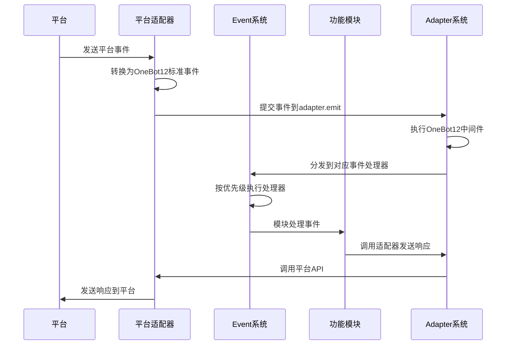

# ErisPulse 的基础架构和设计理念

## 设计理念
- 模块化架构：通过模块化设计实现功能的解耦和复用
- 事件驱动模型：基于事件驱动的架构提高系统的响应性和扩展性
- 跨平台支持：通过适配器系统实现对多种平台的支持
- 用户/AI体验优先：简化开发流程，提供友好的API接口

## 核心组件

## 工作流程
1. **事件接收**：平台适配器接收来自平台的原始事件
2. **事件标准化**：适配器将原始事件转换为OneBot12标准事件格式
3. **事件提交**：通过`adapter.emit`方法将标准化事件提交到适配器系统
4. **中间件处理**：执行注册的OneBot12中间件对事件进行预处理
5. **事件分发**：适配器系统将事件分发到对应的事件处理器
6. **事件处理**：Event系统按照优先级顺序执行注册的事件处理器
7. **模块响应**：功能模块处理事件并生成响应
8. **响应发送**：模块通过适配器系统发送响应到平台
