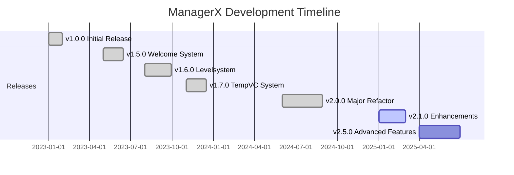

<div align="center">


# 🤖 ManagerX Discord Bot

### *Der ultimative All-in-One Bot für professionelles Community Management*

<br>

<!-- Haupt-Badges -->
<p align="center">
  <a href="https://github.com/Oppro-net-Development/ManagerX/releases">
    
  </a>
  <a href="#-roadmap">
    
  </a>
  <a href="https://github.com/Oppro-net-Development/ManagerX/commits/main">
    
  </a>
  <a href="LICENSE">
    
  </a>
</p>

<!-- Technologie-Badges -->
<p align="center">
  
  
  
  
  
  
</p>

<br>

```ascii
╔══════════════════════════════════════════════════════════════════════╗
║                                                                      ║
║     🤖  Professionelles Discord Bot Framework für Communities  🚀   ║
║                                                                      ║
║   Moderation • Leveling • Welcome • TempVC • Globalchat • Stats    ║
║                                                                      ║
╚══════════════════════════════════════════════════════════════════════╝
```

<br>

**Entwickelt von** [**OPPRO.NET Development**](https://github.com/Oppro-net-Development) **|** ⚡ **Powered by OPPRO.NET Network™**

<br>

---

## 📦 Quick Install

<table>
<tr>
<td width="50%">

### 🎯 Für End-User

```bash
# Bot direkt nutzen
pip install ManagerX
```

**Mit Dokumentation:**
```bash
pip install ManagerX[docs]
```

</td>
<td width="50%">

### 👨‍💻 Für Entwickler

```bash
# Development Setup
pip install ManagerX[dev]
```

**Vollständige Installation:**
```bash
pip install ManagerX[all]
```

</td>
</tr>
</table>

<br>

<p align="center">
  <a href="#-installation"><b>📥 Detaillierte Installation</b></a> •
  <a href="#-features"><b>✨ Features</b></a> •
  <a href="https://docs.oppro-network.de"><b>📖 Dokumentation</b></a> •
  <a href="#-support--community"><b>💬 Support</b></a>
</p>

</div>

<br>

---

<div align="center">

## 🎯 Was ist ManagerX?

</div>

<table>
<tr>
<td width="55%">

**ManagerX** ist ein hochmoderner, leistungsstarker Discord-Bot, der speziell für professionelles Community-Management entwickelt wurde. Mit modernster Architektur und einer Vielzahl an Features bietet ManagerX alles, was anspruchsvolle Discord-Server benötigen.

<br>

### 🌟 Warum ManagerX?

<table>
<tr>
<td align="center">⚡</td>
<td><b>Blazing Fast</b><br>Optimierte SQLite-Architektur für maximale Performance</td>
</tr>
<tr>
<td align="center">🛡️</td>
<td><b>Enterprise Security</b><br>Anti-Spam, Moderation-Logs und umfassende Sicherheitsfeatures</td>
</tr>
<tr>
<td align="center">🎨</td>
<td><b>Hochgradig Anpassbar</b><br>Jedes Modul vollständig konfigurierbar für deine Bedürfnisse</td>
</tr>
<tr>
<td align="center">🌍</td>
<td><b>Global Connected</b><br>Verbinde deine Community mit Servern weltweit via Globalchat</td>
</tr>
<tr>
<td align="center">📈</td>
<td><b>Aktive Entwicklung</b><br>Regelmäßige Updates mit neuen Features und Verbesserungen</td>
</tr>
<tr>
<td align="center">🆓</td>
<td><b>100% Open Source</b><br>Transparent, community-driven und kostenlos verfügbar</td>
</tr>
</table>

</td>
<td width="45%">

```yaml
⚙️ Technical Specifications
━━━━━━━━━━━━━━━━━━━━━━━━━━━━━
Status:         Production Ready ✓
Current:        v2.0.0
Next Release:   v2.1.0 (Q1 2025)

🔧 Technology Stack
━━━━━━━━━━━━━━━━━━━━━━━━━━━━━
Language:       Python 3.10+
Framework:      py-cord + ezcord
Database:       SQLite3
API:            Discord API v10
Architecture:   Modular Cogs System

🌐 Deployment
━━━━━━━━━━━━━━━━━━━━━━━━━━━━━
Platforms:      Linux, Windows, macOS
Hosting:        Cloud-Ready
Requirements:   512MB RAM (1GB+ rec.)
Uptime:         99.9%+ Verfügbarkeit

📦 Active Modules
━━━━━━━━━━━━━━━━━━━━━━━━━━━━━
✓ Advanced Moderation System
✓ Dynamic Leveling & XP Engine
✓ Smart Welcome Automation
✓ Temporary Voice Channels
✓ Global Cross-Server Chat
✓ Real-Time Weather Data
✓ Wikipedia Integration
✓ Comprehensive Statistics
✓ Custom Command Framework
```

</td>
</tr>
</table>

<br>

---

<div align="center">

## ✨ Feature-Übersicht

*Entdecke die leistungsstarken Module von ManagerX*

</div>

<br>

<table>
<tr>
<td width="50%" valign="top">

### 🛡️ Moderation & Sicherheit

<div align="center">

**🔒 Advanced Moderation Toolkit**

</div>

```yaml
Moderation Commands:
  /ban      - Permanenter Server-Ausschluss
  /kick     - User vom Server entfernen
  /mute     - Temporäres Timeout verhängen
  /warn     - Verwarnungen aussprechen
  /timeout  - Zeitlich begrenzte Stummschaltung
  /purge    - Massen-Nachrichtenlöschung

Anti-Spam Engine:
  ✓ Intelligente Spam-Erkennung
  ✓ Duplicate Message Detection
  ✓ Mention Spam Protection
  ✓ Link & URL Filter
  ✓ Custom Regex Patterns
  ✓ Configurable Thresholds

Moderation Logs:
  ✓ Vollständige Action History
  ✓ Reason Tracking
  ✓ Moderator Attribution
  ✓ Automatic Evidence Collection
  ✓ Appeal System Ready
```

<br>

### 📊 Community Engagement

<div align="center">

**🎮 Gamification & Engagement**

</div>

```yaml
Levelsystem Features:
  XP System:
    - Vollständig anpassbare XP-Raten
    - Text & Voice Channel XP
    - XP-Multiplier & Boosts
    - Daily/Weekly Bonuses
  
  Rewards:
    - Automatische Rollenbelohnungen
    - Custom Level-Up Messages
    - Achievement System
    - Milestone Rewards
  
  Leaderboards:
    - Server Top Rankings
    - Global Leaderboards
    - Category-Specific Rankings
    - Historical Statistics

Welcome System:
  ✓ Benutzerdefinierte Embed-Designs
  ✓ Auto-Role Assignment
  ✓ Regel- & Info-Nachrichten
  ✓ User Counter Integration
  ✓ Custom Welcome Images
  ✓ Join/Leave Logging
```

</td>
<td width="50%" valign="top">

### 🌐 Social & Communication

<div align="center">

**💬 Cross-Server Communication**

</div>

```yaml
Globalchat System:
  Core Features:
    - Echtzeit Cross-Server Chat
    - Moderierte Kommunikation
    - Server-übergreifende Community
    - Report & Block Funktionen
    - User Reputation System
  
  Safety Features:
    ✓ Content-Filterung
    ✓ Blacklist System
    ✓ Admin-Kontrolle
    ✓ Spam Prevention
    ✓ Moderation Queue
    ✓ Appeal Process

Information Tools:
  Wikipedia Integration:
    - Direkte Artikelsuche
    - Formatierte Previews
    - Multi-Language Support
    - Related Articles
    - Quick Summaries
  
  Weather System:
    - Live-Wetterdaten
    - 5-Tage Vorhersage
    - Detaillierte Metriken
    - Location Auto-Detection
    - Weather Alerts
```

<br>

### 🎮 Interaktive Features

<div align="center">

**🎙️ Dynamic Voice & Analytics**

</div>

```yaml
Temporary Voice Channels:
  User Control:
    ✓ Eigene Voice-Channel erstellen
    ✓ Custom Namen & Beschreibung
    ✓ User-Limit Management
    ✓ Permission Control
    ✓ Channel Transfer
  
  Automation:
    - Auto-Delete bei Inaktivität
    - Category Organization
    - Template System
    - VIP Channel Options

Stats & Analytics:
  Real-Time Metrics:
    - Server Activity Tracking
    - User Engagement Stats
    - Command Usage Analytics
    - Voice Channel Statistics
    - Growth Metrics
  
  Reports:
    ✓ Daily/Weekly Summaries
    ✓ Performance Dashboards
    ✓ Member Insights
    ✓ Trend Analysis
```

</td>
</tr>
</table>

<br>

---

<div align="center">

## 🚀 Installation & Setup

*Starte ManagerX in wenigen Minuten*

</div>

<br>

### 📋 Systemanforderungen

<table>
<tr>
<td width="50%">

**Minimum Requirements**

```yaml
Operating System:
  - Linux (Ubuntu 20.04+)
  - Windows 10/11
  - macOS 11+

Software:
  - Python 3.10 oder höher
  - pip (Python Package Manager)
  - Git 2.0+

Resources:
  - RAM: 512 MB minimum
  - Storage: 200 MB freier Speicher
  - Network: Stabile Internetverbindung
```

</td>
<td width="50%">

**Empfohlene Konfiguration**

```yaml
Production Environment:
  - Linux Server (Ubuntu 22.04 LTS)
  - Python 3.11+
  - 1 GB+ RAM
  - SSD Storage
  - 24/7 Uptime Hosting

Optional Services:
  - Discord Bot Token (Required)
  - Weather API Key (Optional)
  - Custom Domain (Optional)
  - SSL Certificate (Optional)
```

</td>
</tr>
</table>

<br>

### ⚡ Installation Guide

<details>
<summary><b>🐧 Linux / macOS Installation</b> (Click to expand)</summary>

<br>

```bash
# ──────────────────────────────────────────────────────────
# Step 1: Repository klonen
# ──────────────────────────────────────────────────────────
git clone https://github.com/Oppro-net-Development/ManagerX.git
cd ManagerX

# ──────────────────────────────────────────────────────────
# Step 2: Virtual Environment erstellen (empfohlen)
# ──────────────────────────────────────────────────────────
python3 -m venv venv
source venv/bin/activate

# ──────────────────────────────────────────────────────────
# Step 3: Dependencies installieren
# ──────────────────────────────────────────────────────────
pip install --upgrade pip
pip install -r requirements.txt

# ──────────────────────────────────────────────────────────
# Step 4: Konfiguration erstellen
# ──────────────────────────────────────────────────────────
cp .env.example .env
nano .env  # Passe TOKEN und andere Einstellungen an

# ──────────────────────────────────────────────────────────
# Step 5: Erste Datenbankinitialisierung
# ──────────────────────────────────────────────────────────
python -c "from utils.database import init_db; init_db()"

# ──────────────────────────────────────────────────────────
# Step 6: Bot starten
# ──────────────────────────────────────────────────────────
python main.py

# ──────────────────────────────────────────────────────────
# Optional: Systemd Service erstellen (für 24/7 Betrieb)
# ──────────────────────────────────────────────────────────
sudo nano /etc/systemd/system/managerx.service
# Füge Service-Konfiguration hinzu (siehe Dokumentation)
sudo systemctl enable managerx
sudo systemctl start managerx
```

</details>

<details>
<summary><b>🪟 Windows Installation</b> (Click to expand)</summary>

<br>

```powershell
# ──────────────────────────────────────────────────────────
# Step 1: Repository klonen
# ──────────────────────────────────────────────────────────
git clone https://github.com/Oppro-net-Development/ManagerX.git
cd ManagerX

# ──────────────────────────────────────────────────────────
# Step 2: Virtual Environment erstellen
# ──────────────────────────────────────────────────────────
python -m venv venv
venv\Scripts\activate

# ──────────────────────────────────────────────────────────
# Step 3: Dependencies installieren
# ──────────────────────────────────────────────────────────
python -m pip install --upgrade pip
pip install -r req.txt

# ──────────────────────────────────────────────────────────
# Step 4: Konfiguration erstellen
# ──────────────────────────────────────────────────────────
copy .env.example .env
notepad .env  # TOKEN und Einstellungen anpassen

# ──────────────────────────────────────────────────────────
# Step 5: Datenbank initialisieren
# ──────────────────────────────────────────────────────────
python -c "from utils.database import init_db; init_db()"

# ──────────────────────────────────────────────────────────
# Step 6: Bot starten
# ──────────────────────────────────────────────────────────
python main.py

# ──────────────────────────────────────────────────────────
# Optional: Als Windows Service einrichten
# ──────────────────────────────────────────────────────────
# Siehe Dokumentation für NSSM Setup
```

</details>

<br>

### 🔧 Konfiguration

<table>
<tr>
<td width="60%">

**Environment Variables (.env)**

```bash
# ════════════════════════════════════════════════
# Discord Bot Configuration
# ════════════════════════════════════════════════
DISCORD_TOKEN=your_bot_token_here
DISCORD_CLIENT_ID=your_client_id
DISCORD_CLIENT_SECRET=your_client_secret
DISCORD_REDIRECT_URI=http://localhost:8080/callback

# ════════════════════════════════════════════════
# Optional API Keys
# ════════════════════════════════════════════════
WEATHER_API=your_openweathermap_api_key

# ════════════════════════════════════════════════
# Bot Settings
# ════════════════════════════════════════════════
BOT_PREFIX=!
DEBUG_MODE=false
LOG_LEVEL=INFO

# ════════════════════════════════════════════════
# Database Configuration
# ════════════════════════════════════════════════
DATABASE_PATH=./data/managerx.db
BACKUP_ENABLED=true
BACKUP_INTERVAL=24h
```

</td>
<td width="40%">

**📍 Token erstellen**

1. Besuche [Discord Developer Portal](https://discord.com/developers/applications)
2. Klicke auf "New Application"
3. Gehe zu "Bot" → "Add Bot"
4. Kopiere den Token
5. Füge ihn in `.env` ein

**🔑 Wichtige Berechtigungen**

```yaml
Required Intents:
  ✓ Server Members Intent
  ✓ Message Content Intent
  ✓ Presence Intent

Bot Permissions:
  ✓ Manage Roles
  ✓ Manage Channels
  ✓ Kick Members
  ✓ Ban Members
  ✓ Send Messages
  ✓ Embed Links
  ✓ Attach Files
  ✓ Manage Messages
  ✓ Read Message History
```

**🌦️ Weather API**

Kostenloser API-Key: [OpenWeatherMap](https://openweathermap.org/api)

</td>
</tr>
</table>

<br>

---

<div align="center">

## 📋 Version History & Roadmap

*Entwicklungsgeschichte und zukünftige Features*

</div>

<br>

### 🔄 Release Timeline



<br>

<table>
<tr>
<td align="center" width="20%"><b>Version</b></td>
<td align="center" width="15%"><b>Status</b></td>
<td align="center" width="15%"><b>Datum</b></td>
<td align="center" width="50%"><b>Key Features</b></td>
</tr>
<tr>
<td align="center"><b>v2.1.0</b></td>
<td align="center">🔜 <i>In Dev</i></td>
<td align="center">Q1 2025</td>
<td>
• Performance Optimierungen<br>
• Bug Fixes & Stability<br>
• Enhanced Error Handling<br>
• UI/UX Improvements
</td>
</tr>
<tr>
<td align="center"><b>v2.0.0</b></td>
<td align="center">✅ <i>Current</i></td>
<td align="center">2024-12</td>
<td>
• Komplettes Code Refactoring<br>
• Globalchat v2 Launch<br>
• Enhanced Statistics Module<br>
• Improved Database Architecture
</td>
</tr>
<tr>
<td align="center"><b>v1.7.1</b></td>
<td align="center">📦 <i>Stable</i></td>
<td align="center">2024-08</td>
<td>
• Feature Enhancements<br>
• Critical Bug Fixes<br>
• Security Updates
</td>
</tr>
<tr>
<td align="center"><b>v1.7.0</b></td>
<td align="center">📦 <i>Archived</i></td>
<td align="center">2024-05</td>
<td>
• TempVC System Implementation<br>
• Dynamic Voice Channel Management<br>
• User Control Features
</td>
</tr>
<tr>
<td align="center"><b>v1.6.0</b></td>
<td align="center">📦 <i>Archived</i></td>
<td align="center">2024-02</td>
<td>
• Advanced Levelsystem<br>
• XP & Rewards Engine<br>
• Leaderboard System
</td>
</tr>
<tr>
<td align="center"><b>v1.5.0</b></td>
<td align="center">📦 <i>Archived</i></td>
<td align="center">2023-11</td>
<td>
• Welcome System Launch<br>
• Auto-Role Assignment<br>
• Custom Embeds
</td>
</tr>
</table>

<br>

### 🗺️ Roadmap

<table>
<tr>
<td width="33%" valign="top">

**🎯 v2.1.0 - Q1 2025**

```yaml
Focus: Stability & Polish

Features:
  - Performance Tuning
  - Memory Optimization
  - Enhanced Logging
  - Bug Fixes

Improvements:
  - Error Recovery
  - Database Indexing
  - Command Response Time
  - Resource Management
```

</td>
<td width="33%" valign="top">

**🚀 v2.2.0 - Q2 2025**

```yaml
Focus: New Features

Planned Features:
  - Ticket System
  - Advanced Polls
  - Music Module
  - Custom Commands 2.0
  
Enhancements:
  - AI Integration
  - Multi-Language Support
  - Enhanced Analytics
  - API Webhooks
```

</td>
<td width="33%" valign="top">

**💫 v2.3.0 - Q4 2025**

```yaml
Focus: Major Upgrade

Revolutionary Features:
  - Web Dashboard
  - Mobile App Support
  - Plugin System
  - Advanced AI Features
  
Architecture:
  - Microservices
  - Cloud-Native
  - Horizontal Scaling
  - GraphQL API
```

</td>
</tr>
</table>

<br>

<div align="center">

[📖 **Vollständiges Changelog anzeigen** →](CHANGELOG.md)

</div>

<br>

---

<div align="center">

## 🤝 Contributing & Development

*Werde Teil unseres Open-Source Projekts!*

</div>

<br>

### 💡 Wie kann ich beitragen?

<table>
<tr>
<td width="25%" align="center">

**🐛 Bug Reports**

Fehler gefunden?<br>
[Issue erstellen →](https://github.com/Oppro-net-Development/ManagerX/issues/new?template=bug_report.md)

</td>
<td width="25%" align="center">

**✨ Feature Requests**

Idee für ein Feature?<br>
[Feature vorschlagen →](https://github.com/Oppro-net-Development/ManagerX/issues/new?template=feature_request.md)

</td>
<td width="25%" align="center">

**💻 Code Beiträge**

Code beisteuern?<br>
[Pull Request →](https://github.com/Oppro-net-Development/ManagerX/pulls)

</td>
<td width="25%" align="center">

**📖 Dokumentation**

Docs verbessern?<br>
[Docs bearbeiten →](https://github.com/Oppro-net-Development/ManagerX-Docs)

</td>
</tr>
</table>

<br>

### 📝 Commit-Konventionen

Wir verwenden standardisierte Commit-Prefixes für bessere Nachvollziehbarkeit:

<table>
<tr>
<td width="20%" align="center"><b>Präfix</b></td>
<td width="30%"><b>Verwendung</b></td>
<td width="50%"><b>Beispiel</b></td>
</tr>
<tr>
<td align="center"><code>✨ FEATURE:</code></td>
<td>Neue Funktion hinzugefügt</td>
<td><code>✨ FEATURE: Add weather command integration</code></td>
</tr>
<tr>
<td align="center"><code>🔄 UPDATE:</code></td>
<td>Bestehende Funktion verbessert</td>
<td><code>🔄 UPDATE: Improve levelsystem performance by 40%</code></td>
</tr>
<tr>
<td align="center"><code>🐛 BUGFIX:</code></td>
<td>Bug behoben (normal)</td>
<td><code>🐛 BUGFIX: Fix welcome message formatting issue</code></td>
</tr>
<tr>
<td align="center"><code>🚑 HOTFIX:</code></td>
<td>Kritischer Bug behoben</td>
<td><code>🚑 HOTFIX: Resolve critical database connection error</code></td>
</tr>
<tr>
<td align="center"><code>📚 DOCS:</code></td>
<td>Dokumentation aktualisiert</td>
<td><code>📚 DOCS: Update installation guide with troubleshooting</code></td>
</tr>
<tr>
<td align="center"><code>🗑️ DELETE:</code></td>
<td>Code/Feature entfernt</td>
<td><code>🗑️ DELETE: Remove deprecated legacy commands</code></td>
</tr>
<tr>
<td align="center"><code>🎨 STYLE:</code></td>
<td>Code-Style Änderungen</td>
<td><code>🎨 STYLE: Refactor code to match PEP 8 standards</code></td>
</tr>
<tr>
<td align="center"><code>♻️ REFACTOR:</code></td>
<td>Code-Umstrukturierung</td>
<td><code>♻️ REFACTOR: Restructure database module architecture</code></td>
</tr>
<tr>
<td align="center"><code>⚡ PERF:</code></td>
<td>Performance-Verbesserung</td>
<td><code>⚡ PERF: Optimize query execution time</code></td>
</tr>
<tr>
<td align="center"><code>🧪 TEST:</code></td>
<td>Tests hinzugefügt/geändert</td>
<td><code>🧪 TEST: Add unit tests for moderation module</code></td>
</tr>
</table>

<br>

### 📌 Versionierungs-Schema

Um maximale Transparenz und Aktualität zu gewährleisten, nutzen wir eine duale Strategie:

* **GitHub (Source Code):** Nutzt das **Semantic Versioning** (Beispiel: `2.0.0`). Dies markiert große Meilensteine und strukturelle Änderungen im Code.
* **PyPI (Distribution):** Nutzt **CalVer (Calendar Versioning)** (Beispiel: `2.2026.1.9.1`). Dies ermöglicht es Entwicklern, sofort zu erkennen, wie aktuell das installierte Paket ist.

| Plattform | Schema | Beispiel |
| :--- | :--- | :--- |
| **GitHub** | MAJOR.MINOR.PATCH | `2.0.0` |
| **PyPI** | MAJOR.JJJJ.MM.TT | `2.2026.01.09.1` |

### 🔧 Development Workflow

```bash
# ════════════════════════════════════════════════════════════════════════
# 1. Repository forken & klonen
# ════════════════════════════════════════════════════════════════════════
git clone https://github.com/YOUR_USERNAME/ManagerX.git
cd ManagerX

# ════════════════════════════════════════════════════════════════════════
# 2. Development Branch erstellen
# ════════════════════════════════════════════════════════════════════════
git checkout -b feature/amazing-feature
# Oder für Bugfixes:
git checkout -b bugfix/fix-critical-issue

# ════════════════════════════════════════════════════════════════════════
# 3. Development Environment aufsetzen
# ════════════════════════════════════════════════════════════════════════
python -m venv venv
source venv/bin/activate  # Windows: venv\Scripts\activate
pip install -r requirements-dev.txt

# ════════════════════════════════════════════════════════════════════════
# 4. Änderungen vornehmen und testen
# ════════════════════════════════════════════════════════════════════════
# Code schreiben...
python main.py  # Bot testen
pytest tests/   # Unit Tests ausführen

# ════════════════════════════════════════════════════════════════════════
# 5. Code Style prüfen
#