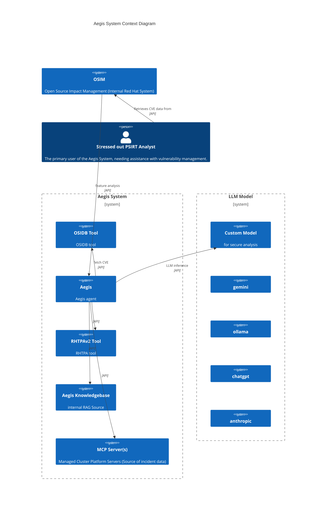

#  Aegis-AI - Red Hat Product Security Agent

[](https://github.com/RedHatProductSecurity/aegis/actions/workflows/tests.yml)

**Note: As Aegis is an agent - be careful of which LLM model you use ... if you want to integrate with OSIDB/RHTPA, you MUST use a secure model**

## Overview

**Aegis enables security teams to leverage the latest Generative AI models for enhanced security analysis.** Integrate your preferred LLM (ChatGPT, Anthropic, Gemini, or even a local model) to quickly perform deep security analysis on critical artifacts like **CVEs, advisories, and more**.

Aegis helps by:

* **Accelerate Analysis:** Insights into complex security data.
* **Improve Accuracy:** Augment LLM capabilities with in-context security information.
* **Enhance Efficiency:** Automate repetitive analysis tasks, working on security entities (ex. CVE) to focus on higher-value work.

---

## Features
Aegis features provide common product security analysis:

### CVE Analysis
* **Suggest Impact:** Get an in context LLM-driven suggestion for a CVE's overall impact.
* **Suggest CWE:** Get an in context LLM-driven Common Weakness Enumeration (CWE) mappings for CVE.
* **Suggest CVSS:** Get an in context LLM-driven Common Vulnerability Scoring System (CVSS) score.
* **Identify PII:** Automatically detect and flag Personally Identifiable Information within security texts.
* **Suggest Security Text:** Rephrase or refine security advisories and descriptions for clarity or specific audiences.
* **CVSS Diff Explainer:** Understand  differences between Red Hat and NVD CVSS scores with AI-generated explanations.

### Component Intelligence
* **Component Intelligence:** Generate a component information 'card'.

## Security Context
Feature analysis requires 'context' beyond that contained by any specific LLM model. 

We provide 'out of the box' integrations providing security context with the following:

* [OSIDB](https://github.com/RedHatProductSecurity/osidb) 
* [RHTPAv2](https://github.com/trustification/trustify)
* [osv.dev](https://osv.dev)
* CWE (https://cwe.mitre.org)

which perform lookups on security entities (ex. CVE).

Aegis is also a [MCP](https://modelcontextprotocol.io/introduction) client allowing it to easily integrate with any compliant MCP server.

---

## Quick Start

Clone this repo 

or install via [pypi](https://pypi.org/project/aegis-ai/):

```commandline
pip install aegis-ai
```


First ensure `Aegis` can use any required ca certs:
```commandline
REQUESTS_CA_BUNDLE="/etc/pki/tls/certs/ca-bundle.crt"
```

Note: some tools require podman.

### Connecting to LLMs

Aegis allows you to connect to various LLM providers, from your own custom LLM models to cloud LLM services and MaaS.

**Using Aegis with Gemini:**
Connect to Gemini (replace `YOUR_GEMINI_API_KEY` with your actual key):

```bash
AEGIS_LLM_HOST="https://generativelanguage.googleapis.com"
AEGIS_LLM_MODEL="gemini-2.5-flash"
GEMINI_API_KEY="YOUR_GEMINI_API_KEY"
````

**Using Aegis with Anthropic:**
Connect to Anthropic's powerful Claude models (replace `YOUR_ANTHROPIC_API_KEY` with your actual key):

```bash
export AEGIS_LLM_HOST="https://api.anthropic.com"
export AEGIS_LLM_MODEL="anthropic:claude-3-5-sonnet-latest"
export ANTHROPIC_API_KEY="YOUR_ANTHROPIC_API_KEY"
```

**Using Aegis with Local Ollama:**
Configure Aegis to use a locally running Ollama instance:

```bash
export AEGIS_LLM_HOST=http://localhost:11434
export AEGIS_LLM_MODEL=llama3.2:3b
# Ensure Ollama is running and 'llama3.2:3b' model is pulled
```

**Note:** For other LLM providers (e.g., OpenAI), similar environment variables will have to set. Refer to the `DEVELOP.md` for environment var information.

Be aware that `Aegis` is an agent (which autonomously invokes tools) so any LLM model you use must be secure/trusted.

### Setting up Aegis Tools

Aegis provides a few 'out of the box' tools that the agent can use to enhance LLM query context.

#### Public tools

##### NVD
Integration with [NVD](https://nvd.nist.gov/vuln) for looking up NIST CVE:
```bash
export AEGIS_USE_MITRE_NVD_MCP_TOOL_CONTEXT=true
export NVD_API_KEY="XXXXXXXXXXXXXXXXXXXXXXXXXXXXXXx"
```

##### Github
Integration with [github](https://github.com/):
```bash
export AEGIS_USE_GITHUB_MCP_TOOL_CONTEXT=true
export GITHUB_PERSONAL_ACCESS_TOKEN=
```
When using on local dev platform then ensure container is available by pulling it:
```commandline
podman pull mcp/github-mcp-server
```

##### Tavily Search engine
Integration with [Tavily](https://www.tavily.com/) via built in pydantic-ai support:
```bash
export TAVILY_API_KEY="tvly-dev-XXXXXX"
export AEGIS_USE_TAVILY_TOOL_CONTEXT=true
```

##### Linux cves
Integration with [linux cves repo](https://git.kernel.org/pub/scm/linux/security/vulns.git):
```bash
export AEGIS_USE_LINUX_CVE_TOOL_CONTEXT=true
```
##### Mitre CWE
Integration with [Mitre CWE definitions](https://cwe.mitre.org/data/downloads.html)

```bash
export AEGIS_USE_CWE_TOOL_CONTEXT=true
export AEGIS_CWE_TOOL_ALLOWED_CWE_IDS=CWE-190, CWE-120, .....
```

##### Wikipedia
Integration with [wikipedia](https://www.wikipedia.org/):
```bash
export AEGIS_USE_WIKIPEDIA_MCP_CONTEXT=true
```
##### pypi
Integration with [pypi](https://pypi.org/):
```bash
export AEGIS_USE_PYPI_MCP_CONTEXT=true
```

##### CISA Kev
Integration with [cisa-kev](https://www.cisa.gov/known-exploited-vulnerabilities-catalog):
```bash
export AEGIS_USE_CISA_KEV_TOOL_CONTEXT=true
```

#### RedHat tools

##### OSIDB
Integration with [OSIDB](https://github.com/RedHatProductSecurity/osidb) is achieved via [osidb-bindings](https://github.com/RedHatProductSecurity/osidb-bindings), set
OSIDB server url for Aegis with:
```bash
export AEGIS_OSIDB_SERVER_URL="https://localhost:8080"
```

Uses kerberos built in auth with `osidb-bindings`.


---

## Using Aegis Features
`Aegis` features can be invoked programmatically via Python, through its built-in Command-Line Interface (CLI), or exposed via a REST API.

### Command-Line Interface (CLI)
Run features directly from your terminal using the CLI:

```bash
uv run aegis suggest-impact "CVE-2025-5399"
```

If you installed aegis-ai with pypi, there is no need to use uv:
```commandline
aegis suggest-impact "CVE-2025-5399" 
```

### Programmatic Usage (Python)
If you installed with pypi all dependencies should be installed.

Otherwise if you cloned the repo you must ensure required dependencies are installed before running code example:

```commandline
uv sync 
```

The following programmatically invokes the `SuggestImpact` feature:
```python
import asyncio
from aegis_ai.agents import public_feature_agent
from aegis_ai.features import cve


async def main():
    feature = cve.SuggestImpact(public_feature_agent)
    result = await feature.exec("CVE-2025-0725")
    print(result.output.model_dump_json(indent=2))


if __name__ == "__main__":
    asyncio.run(main())
```

Which produces JSON output:

```json
{
    "confidence": 0.95,
    "tools_used": [
        "osidb_tool"
    ],
    "disclaimer": "This response was generated by Aegis AI (https://github.com/RedHatProductSecurity/aegis-ai) using generative AI for informational purposes. All findings should be validated by a human expert.",
    "cve_id": "CVE-2025-0725",
    "title": "Buffer Overflow in libcurl via zlib Integer Overflow",
    "components": [
        "libcurl"
    ],
    "affected_products": [
        "Ansible Services",
        "Hosted OpenShift",
        "cloud.redhat.com"
    ],
    "explanation": "The vulnerability is a buffer overflow within libcurl that occurs during the automatic decompression of gzip-encoded content. 
       However, this flaw is only exploitable when libcurl is used in conjunction with a significantly outdated version of the zlib 
       library (1.2.0.3 or older). Supported Red Hat products, including Red Hat Enterprise Linux, utilize modern versions of zlib and
        are therefore not affected. The impact is rated as LOW because the conditions required for a successful exploit are highly 
        unlikely to be present in any supported Red Hat environment. The official Red Hat CVSS vector indicates a low-impact, local 
        availability issue, reflecting the minimal practical risk.",
    "impact": "LOW",
    "cvss3_score": "3.3",
    "cvss3_vector": "CVSS:3.1/AV:L/AC:L/PR:N/UI:N/S:U/C:N/I:N/A:L",
    "cvss4_score": "3.7",
    "cvss4_vector": "CVSS:4.0/AV:L/AC:L/AT:N/PR:N/UI:N/VC:N/VI:N/VA:L/SC:N/SI:N/SA:N"
}

```

Note - Many features, like `SuggestImpact`, require access to an OSIDB server so you will need to be `kinited` in with appropriate access rights.

### REST API Server
You can also accesss the `fastapi` based REST API server:

```bash
uv run uvicorn src.aegis_restapi.src.main:app --port 9000
```

Once running - interact with the API via HTTP - for example: `http://localhost:9000`. 

Documentation for the REST API is provided via OpenAPI docs.

---
## System Overview
System context diagram for Aegis.


