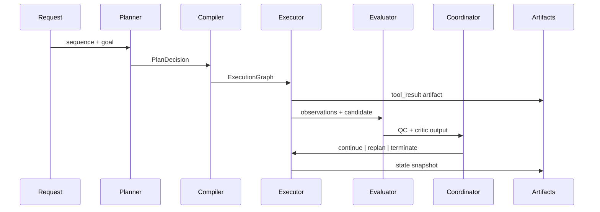

# Execution Model

Lifecycle:

- Request is validated.
- Planner emits a PlanDecision.
- Compiler produces an ExecutionGraph.
- Executor runs the tool and writes artifacts.
- Evaluator produces QC and critic outputs.
- Coordinator decides to continue, replan, or stop.

Replanning:

- Critic blocking or stagnation yields a replan decision.
- Replan produces a new plan and execution graph.

Failure propagation:

- Tool failures map to failure_type and stop execution.
- Invalid plans fail before tool invocation.
- Missing human decision fails after loop completion when required.

Determinism enforcement:

- Deterministic tools and artifact fingerprints provide reproducibility.

Failure modes and next steps:

- input_invalid: run stops with error.json.
- invalid_plan: run stops before tool execution.
- tool_timeout/tool_crash/tool_failure/invalid_output: run stops with error.json and tool metadata.
- human_decision_missing: run stops after evaluation when human review is required.

Module refs: agentic_proteins.runtime.control.execution, agentic_proteins.agents.planning, agentic_proteins.execution.
