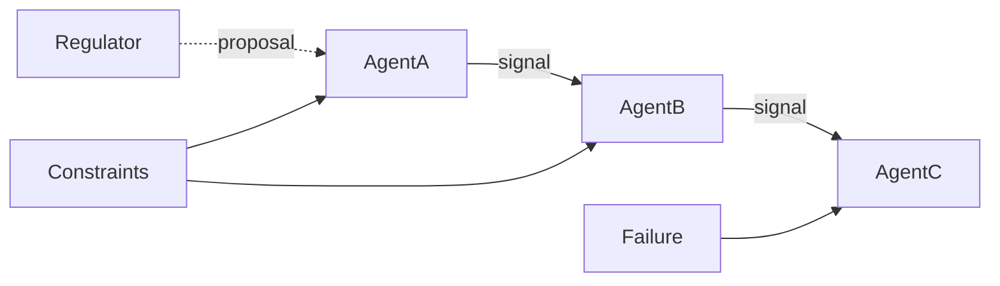

# system_schematic  

**Scope:** One-page system schematic.  
**Audience:** Reviewers and contributors.  
**Guarantees:** Components and boundaries are explicit.  
**Non-Goals:** Full architecture narrative.  
Why: This doc exists to record its single responsibility for review.  

## Overview  
This doc provides a single schematic.  
Architecture context lives in [architecture/architecture.md](../architecture/architecture.md).  
Vocabulary aligns with [../concepts/core_concepts.md](../concepts/core_concepts.md).  

## Contracts  
Agents exchange signals within pathway edges.  
Constraints gate transitions and outputs.  
Regulator proposals remain bounded.  
Evidence uses [tests/unit/test_protein_system_rigidity.py](https://github.com/bijux/agentic-proteins/blob/main/tests/unit/test_protein_system_rigidity.py).  

## Invariants  
Schematic elements stay aligned with [../governance/core.md](../governance/core.md).  
Boundaries align with [architecture/llm_authority.md](../architecture/llm_authority.md).  
Evidence aligns with [tests/unit/test_protein_system_rigidity.py](https://github.com/bijux/agentic-proteins/blob/main/tests/unit/test_protein_system_rigidity.py).  

## Failure Modes  
Missing boundary labels weakens reviewability.  
Diagram drift breaks [../governance/core.md](../governance/core.md).  
Missing evidence breaks [../meta/DOCS_STYLE.md](../meta/DOCS_STYLE.md).  

## Extension Points  
Schematic updates follow [../meta/DOCS_STYLE.md](../meta/DOCS_STYLE.md).  
Extensions align with [architecture/experimental.md](../architecture/experimental.md).  
Evidence updates align with [tests/unit/test_docs_contract.py](https://github.com/bijux/agentic-proteins/blob/main/tests/unit/test_docs_contract.py).  

## Exit Criteria  
This doc is obsolete when diagrams are generated.  
The replacement is [architecture/architecture.md](../architecture/architecture.md).  
Obsolete docs are removed.  

Code refs: [tests/unit/test_protein_system_rigidity.py](https://github.com/bijux/agentic-proteins/blob/main/tests/unit/test_protein_system_rigidity.py).  

