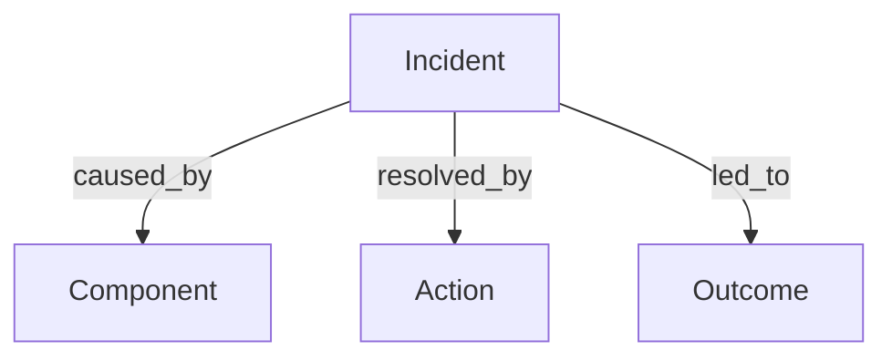
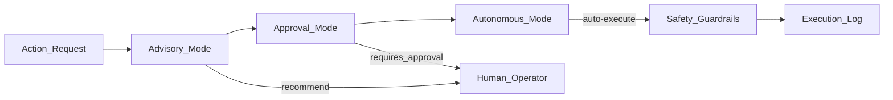

<p align="center">
  
</p>

**Production-grade multi-agent AI system for infrastructure reliability monitoring and self-healing.**

> **ARF is an enterprise reliability framework that enables context-aware AI agents to detect, reason about, and remediate infrastructure failures—operating in advisory mode in OSS and executing controlled remediation in Enterprise deployments.**

> _Battle-tested architecture for autonomous incident detection and_ _**advisory remediation intelligence**_.

<div align="center">

[](https://pypi.org/project/agentic-reliability-framework/)
[](https://pypi.org/project/agentic-reliability-framework/)


[](./LICENSE)
[](https://huggingface.co/spaces/petter2025/agentic-reliability-framework)
[](https://github.com/sponsors/petterjuan)

**[🚀 Live Demo](https://huggingface.co/spaces/petter2025/agentic-reliability-framework)** • **[📚 Documentation](https://github.com/petterjuan/agentic-reliability-framework/tree/main/docs)** • **[💼 Enterprise Edition](https://github.com/petterjuan/agentic-reliability-enterprise)** • **[❤️ Sponsor](https://github.com/sponsors/petterjuan)**

</div>

---

# Agentic Reliability Framework (ARF) v3.3.9 — Production Stability Release

> ⚠️ **IMPORTANT OSS DISCLAIMER**
>
> This Apache 2.0 OSS edition is **analysis and advisory-only**.
> It **does NOT execute actions**, **does NOT auto-heal**, and **does NOT perform remediation**.
>
> All execution, automation, persistence, and learning loops are **Enterprise-only** features.

## Executive Summary

Modern systems do not fail because metrics are missing.

They fail because **decisions arrive too late**.

ARF is a **graph-native, agentic reliability platform** that treats incidents as *memory and reasoning problems*, not alerting problems. It captures operational experience, reasons over it using AI agents, and enforces **stable, production-grade execution boundaries** for autonomous healing.

This is not another monitoring tool.

This is **operational intelligence**.

A dual-architecture reliability framework where **OSS analyzes and creates intent**, and **Enterprise safely executes intent**.

This repository contains the **Apache 2.0 OSS edition (v3.3.9)**. Enterprise components are distributed separately under a commercial license.

> **v3.3.9 Production Stability Release**
>
> This release finalizes import compatibility, eliminates circular dependencies,
> and enforces clean OSS/Enterprise boundaries.  
> **All public imports are now guaranteed stable for production use.**

## 🔒 Stability Guarantees (v3.3.9+)

ARF v3.3.9 introduces **hard stability guarantees** for OSS users:

- ✅ No circular imports
- ✅ Direct, absolute imports for all public APIs
- ✅ Pydantic v2 ↔ Dataclass compatibility wrapper
- ✅ Graceful fallback behavior (no runtime crashes)
- ✅ Advisory-only execution enforced at runtime

If you can import it, it is safe to use in production.

---

## Why ARF Exists

**The Problem**

- **AI Agents Fail in Production**: 73% of AI agent projects fail due to unpredictability, lack of memory, and unsafe execution
- **MTTR is Too High**: Average incident resolution takes 14+ minutes _in traditional systems_.
  \*_Measured MTTR reductions are Enterprise-only and require execution + learning loops._
- **Alert Fatigue**: Teams ignore 40%+ of alerts due to false positives and lack of context
- **No Learning**: Systems repeat the same failures because they don't remember past incidents

Traditional reliability stacks optimize for:
- Detection latency
- Alert volume
- Dashboard density

But the real business loss happens between:

> *“Something is wrong” → “We know what to do.”*

ARF collapses that gap by providing a hybrid intelligence system that advises safely in OSS and executes deterministically in Enterprise. 

- **🤖 AI Agents** for complex pattern recognition
- **⚙️ Deterministic Rules** for reliable, predictable responses
- **🧠 RAG Graph Memory** for context-aware decision making
- **🔒 MCP Safety Layer** for zero-trust execution

---

## 🎯 What This Actually Does

**OSS**
- Ingests telemetry and incident context
- Recalls similar historical incidents (FAISS + graph)
- Applies deterministic safety policies
- Creates an immutable HealingIntent **without executing remediation**
- **Never executes actions (advisory-only, permanently)**

**Enterprise**
- Validates license and usage
- Applies approval / autonomous policies
- Executes actions via MCP
- Persists learning and audit trails

**Both**
- Thread-safe
- Circuit-breaker protected
- Deterministic, idempotent intent model

---

> Execution, persistence, and autonomous actions are exclusive to Enterprise.

---

## 🆓 OSS Edition (Apache 2.0)

| Feature           | Implementation                 | Limits               |
| ----------------- | ------------------------------ | -------------------- |
| MCP Mode          | Advisory only (`OSSMCPClient`) | No execution         |
| RAG Memory        | In-memory graph + FAISS        | 1000 incidents (LRU) |
| Similarity Search | FAISS cosine similarity        | Top-K only           |
| Learning          | Pattern stats only             | No persistence       |
| Healing           | `HealingIntent` creation       | Advisory only        |
| Policies          | Deterministic guardrails       | Warnings + blocks    |
| Storage           | RAM only                       | Process-lifetime     |
| Support           | GitHub Issues                  | No SLA               |

---

## 💰 Enterprise Edition (Commercial)

| Feature    | Implementation                        | Value                             |
| ---------- | ------------------------------------- | --------------------------------- |
| MCP Modes  | Advisory / Approval / Autonomous      | Controlled execution              |
| Storage    | Neo4j + FAISS (hybrid)                | Persistent, unlimited             |
| Dashboard  | React + FastAPI <br> Live system view | Live system view                  |
| Analytics  | Graph Neural Networks                 | Predictive MTTR (Enterprise-only) |
| Compliance | SOC2 / GDPR / HIPAA                   | Full audit trails                 |
| Pricing    | $0.10 / incident + $499 / month       | Usage-based                       |

---
**️ Why Choose ARF Over Alternatives**

**Comparison Matrix**

| Solution | Learning Capability | Safety Guarantees | Deterministic Behavior | Business ROI |
|----------|-------------------|-----------------|----------------------|--------------|
| **ARF (Hybrid Intelligence)** | ✅ Continuous learning (RAG Graph memory) | ✅ High safety (MCP guardrails + approval workflows) | ✅ High determinism (Policy Engine + AI synthesis) | ✅ Quantified ROI (Enterprise-only: execution + learning required) |
| **Traditional Monitoring** (Datadog, New Relic, Prometheus) | ❌ No learning capability | ✅ High safety (read-only) | ✅ High determinism (rules-based) | ❌ Reactive only - alerts after failures occur |
| **LLM-Only Agents** (AutoGPT, LangChain, CrewAI) | ⚠️ Limited learning (context window only) | ❌ Low safety (direct API access) | ❌ Low determinism (hallucinations) | ⚠️ Unpredictable - cannot guarantee outcomes |
| **Rule-Based Automation** (Ansible, Terraform, scripts) | ❌ No learning (static rules) | ✅ High safety (manual review) | ✅ High determinism (exact execution) | ⚠️ Brittle - breaks with system changes |


**Key Differentiators** 

_**🔄 Learning vs Static**_ 

*   **Alternatives**: Static rules or limited context windows 
    
*   **ARF**: Continuously learns from incidents → outcomes in RAG Graph memory 
    

_**🔒 Safety vs Risk**_ 

*   **Alternatives**: Either too restrictive (no autonomy) or too risky (direct execution) 
    
*   **ARF**: Three-mode MCP system (Advisory → Approval → Autonomous) with guardrails 
    

_**🎯 Predictability vs Chaos**_ 

*   **Alternatives**: Either brittle rules or unpredictable LLM behavior 
    
*   **ARF**: Combines deterministic policies with AI-enhanced decision making 
    

_**💰 ROI Measurement**_ 

*   **Alternatives**: Hard to quantify value beyond "fewer alerts" 
    
*   **ARF (Enterprise)**: Tracks revenue saved, auto-heal rates, and MTTR improvements via execution-aware business dashboards

*   **OSS**: Generates advisory intent only (no execution, no ROI measurement)

**Migration Paths**

| Current Solution      | Migration Strategy                           | Expected Benefit                                      |
|----------------------|---------------------------------------------|------------------------------------------------------|
| **Traditional Monitoring** | Layer ARF on top for predictive insights      | Shift from reactive to proactive with 6x faster detection |
| **LLM-Only Agents**       | Replace with ARF's MCP boundary for safety   | Maintain AI capabilities while adding reliability guarantees |
| **Rule-Based Automation** | Enhance with ARF's learning and context     | Transform brittle scripts into adaptive, learning systems |
| **Manual Operations**     | Start with ARF in Advisory mode              | Reduce toil while maintaining control during transition |

**Decision Framework** 

**Choose ARF if you need:** 

*   ✅ Autonomous operation with safety guarantees 
    
*   ✅ Continuous improvement through learning 
    
*   ✅ Quantifiable business impact measurement  
    
*   ✅ Hybrid intelligence (AI + rules) 
    
*   ✅ Production-grade reliability (circuit breakers, thread safety, graceful degradation) 
    

**Consider alternatives if you:** 

*   ❌ Only need basic alerting (use traditional monitoring) 
    
*   ❌ Require simple, static automation (use scripts) 
    
*   ❌ Are experimenting with AI agents (use LLM frameworks) 
    
*   ❌ Have regulatory requirements prohibiting any autonomous action 
    
_ARF provides the intelligence of AI agents with the reliability of traditional automation, creating a new category of "Reliable AI Systems."_

---

## Conceptual Architecture (Mental Model)

```
Signals → Incidents → Memory Graph → Decision → Policy → Execution
             ↑              ↓
         Outcomes ← Learning Loop
```

**Key insight:** Reliability improves when systems *remember*.

🔧 Architecture
-------------------------------

**🏗️ Core Architecture**  

**Three-Layer Hybrid Intelligence: The ARF Paradigm** 

ARF introduces a **hybrid intelligence architecture** that combines the best of three worlds: **AI reasoning**, **deterministic rules**, and **continuous learning**. This three-layer approach ensures both innovation and reliability in production environments.

```mermaid
graph TB 
   subgraph "Layer 1: Cognitive Intelligence" 
       A1[Multi-Agent Orchestration] --> A2[Detective Agent] 
       A1 --> A3[Diagnostician Agent] 
       A1 --> A4[Predictive Agent] 
       A2 --> A5[Anomaly Detection & Pattern Recognition] 
       A3 --> A6[Root Cause Analysis & Investigation] 
       A4 --> A7[Future Risk Forecasting & Trend Analysis] 
   end 
    
   subgraph "Layer 2: Memory & Learning" 
       B1[RAG Graph Memory] --> B2[FAISS Vector Database] 
       B1 --> B3[Incident-Outcome Knowledge Graph] 
       B1 --> B4[Historical Effectiveness Database] 
       B2 --> B5[Semantic Similarity Search] 
       B3 --> B6[Connected Incident → Outcome Edges] 
       B4 --> B7[Success Rate Analytics] 
   end 
    
   subgraph "Layer 3: Execution Control (OSS Advisory / Enterprise Execution)" 
       C1[MCP Server] --> C2[Advisory Mode - OSS Default] 
       C1 --> C3[Approval Mode - Human-in-Loop] 
       C1 --> C4[Autonomous Mode - Enterprise] 
       C1 --> C5[Safety Guardrails & Circuit Breakers] 
       C2 --> C6[What-If Analysis Only] 
       C3 --> C7[Audit Trail & Approval Workflows] 
       C4 --> C8[Auto-Execution with Guardrails] 
   end 
    
   D[Reliability Event] --> A1 
   A1 --> E[Policy Engine] 
   A1 --> B1 
   E & B1 --> C1 
   C1 --> F["Healing Actions (Enterprise Only)"]
   F --> G[Business Impact Dashboard] 
   F --> B1[Continuous Learning Loop] 
   G --> H[Quantified ROI: Revenue Saved, MTTR Reduction]
   ```

Healing Actions occur only in Enterprise deployments.

**Architecture Philosophy**: Each layer addresses a critical failure mode of current AI systems: 

1.  **Cognitive Layer** prevents _"reasoning from scratch"_ for each incident 
    
2.  **Memory Layer** prevents _"forgetting past learnings"_ 
    
3.  **Execution Layer** prevents _"unsafe, unconstrained actions"_

**OSS Architecture**

```mermaid
graph TD
    A[Telemetry / Metrics] --> B[Reliability Engine]
    B --> C[OSSMCPClient]
    C --> D[RAGGraphMemory]
    D --> E[FAISS Similarity]
    D --> F[Incident / Outcome Graph]
    E --> C
    F --> C
    C --> G[HealingIntent]
    G --> H[STOP: Advisory Only]
```
OSS execution halts permanently at HealingIntent. No actions are performed.

### **Stop point:** OSS halts permanently at HealingIntent.

### **ARF v3.0 Dual-Layer Architecture**

```
          ┌───────────────────────────┐
          │        Telemetry          │
          └─────────────┬────────────┘
                        │
                        ▼
  ┌───────────── OSS Layer (Advisory Only) ─────────────┐
  │                                                     │
  │  +--------------------+                             │
  │  | Detection Agent     |  ← Anomaly detection       │
  │  | (OSS + Enterprise)  |  & forecasting             │
  │  +--------------------+                             │
  │           │                                         │
  │           ▼                                         │
  │  +--------------------+                             │
  │  | Recall Agent        |  ← Retrieve similar        │
  │  | (OSS + Enterprise)  |  incidents/actions/outcomes
  │  +--------------------+                             │
  │           │                                         │
  │           ▼                                         │
  │  +--------------------+                             │
  │  | Decision Agent      |  ← Policy reasoning        │
  │  | (OSS + Enterprise)  |  over historical outcomes  │
  │  +--------------------+                             │
  └─────────────────────────┬───────────────────────────┘
                            │
                            ▼
 ┌───────── Enterprise Layer (Full Execution) ─────────┐
 │                                                     │
 │  +--------------------+        +-----------------+  │
 │  | Safety Agent        |  ───> | Execution Agent |  │
 │  | (Enterprise only)   |       | (MCP modes)     |  │
 │  +--------------------+        +-----------------+  │
 │           │                                         │
 │           ▼                                         │
 │  +--------------------+                             │
 │  | Learning Agent      |  ← Extract outcomes,       │
 │  | (Enterprise only)   |  update RAG & predictive   │
 │  +--------------------+   models                    │
 │           │                                         │
 │           ▼                                         │
 │       HealingIntent (Executed, Audit-ready)         │
 └─────────────────────────────────────────────────────┘
```

## Core Innovations

### 1. RAG Graph Memory (Not Vector Soup)

### ARF models **incidents, actions, and outcomes as a graph**, rather than simple embeddings. This allows causal reasoning, pattern recall, and outcome-aware recommendations.



This enables:

*   **Causal reasoning:** Understand root causes of failures.
    
*   **Pattern recall:** Retrieve similar incidents efficiently using FAISS + graph.
    
*   **Outcome-aware recommendations:** Suggest actions based on historical success.

### 2. Healing Intent Boundary

OSS **creates** intent.  
Enterprise **executes** intent. The framework **separates intent creation from execution**

``` 
+----------------+         +---------------------+
|   OSS Layer    |         |  Enterprise Layer   |
| (Analysis Only)|         |  (Execution & GNN)  |
+----------------+         +---------------------+
          |                           ^
          |       HealingIntent       |
          +-------------------------->|
```

### 3. MCP (Model Context Protocol) Execution Control

Every action passes through:
- Advisory → Approval → Autonomous modes
- Blast radius checks
- Human override paths
  
\* All actions in Enterprise flow through

\* Controlled execution modes with policy enforcement:

No silent actions. Ever.



**Execution Safety Features:**

1.  **Blast radius checks:** Limit scope of automated actions.
    
2.  **Human override paths:** Operators can halt or adjust actions.
    
3.  **No silent execution:** All actions are logged for auditability.

**Outcome:**

*   Hybrid intelligence combining AI-driven recommendations and deterministic policies.
    
*   Safe, auditable, and deterministic execution in production.

**Key Orchestration Steps:** 

1.  **Event Ingestion & Validation** - Accepts telemetry, validates with Pydantic models 
    
2.  **Multi-Agent Analysis** - Parallel execution of specialized agents 
    
3.  **RAG Context Retrieval** - Semantic search for similar historical incidents 
    
4.  **Policy Evaluation** - Deterministic rule-based action determination 
    
5.  **Action Enhancement** - Historical effectiveness data informs priority 
    
6.  **MCP Execution** - Safe tool execution with guardrails 
    
7.  **Outcome Recording** - Results stored in RAG Graph for learning 
    
8.  **Business Impact Calculation** - Revenue and user impact quantification
---

# Multi-Agent Design (ARF v3.0) – Coverage Overview

- **Detection, Recall, Decision** → present in both OSS and Enterprise  
- **Safety, Execution, Learning** → Enterprise only  

## Table View

| Agent           | Responsibility                                                          | OSS | Enterprise |
|-----------------|------------------------------------------------------------------------|-----|------------|
| Detection Agent | Detect anomalies, monitor telemetry, perform time-series forecasting  | ✅  | ✅         |
| Recall Agent    | Retrieve similar incidents/actions/outcomes from RAG graph + FAISS    | ✅  | ✅         |
| Decision Agent  | Apply deterministic policies, reasoning over historical outcomes      | ✅  | ✅         |
| Safety Agent    | Enforce guardrails, circuit breakers, compliance constraints          | ❌  | ✅         |
| Execution Agent | Execute HealingIntents according to MCP modes (advisory/approval/autonomous) | ❌  | ✅         |
| Learning Agent  | Extract outcomes and update predictive models / RAG patterns          | ❌  | ✅         |

---

## OSS vs Enterprise Philosophy

### OSS (Apache 2.0)
- Full intelligence
- Advisory-only execution
- Hard safety limits
- Perfect for trust-building

### Enterprise
- Autonomous healing
- Learning loops
- Compliance (SOC2, HIPAA, GDPR)
- Audit trails
- Multi-tenant control

OSS proves value.  
Enterprise captures it.

---

### 💰 Business Value and ROI

> 🔒 **Enterprise-Only Metrics**
>
> All metrics, benchmarks, MTTR reductions, auto-heal rates, revenue protection figures,
> and ROI calculations in this section are derived from **Enterprise deployments only**.
>
> The OSS edition does **not** execute actions, does **not** auto-heal, and does **not**
> measure business impact.

#### Detection & Resolution Speed

**Enterprise deployments of ARF** dramatically reduce incident detection and resolution times compared to industry averages:

| Metric                        | Industry Average | ARF Performance | Improvement        |
|-------------------------------|----------------|----------------|------------------|
| High-Priority Incident Detection | 8–14 min       | 2.3 min        | 71–83% faster     |
| Major System Failure Resolution  | 45–90 min      | 8.5 min        | 81–91% faster     |

#### Efficiency & Accuracy

ARF improves auto-heal rates and reduces false positives, driving operational efficiency:

| Metric           | Industry Average | ARF Performance | Improvement   |
|-----------------|----------------|----------------|---------------|
| Auto-Heal Rate    | 5–15%          | 81.7%          | 5.4× better   |
| False Positives   | 40–60%         | 8.2%           | 5–7× better   |

#### Team Productivity

ARF frees up engineering capacity, increasing productivity:

| Metric                                  | Industry Average | ARF Performance        | Improvement         |
|----------------------------------------|----------------|------------------------|-------------------|
| Engineer Hours Spent on Manual Response | 10–20 h/month  | 320 h/month recovered  | 16–32× improvement |

---

### 🏆 Financial Evolution: From Cost Center to Profit Engine

ARF transforms reliability operations from a high-cost, reactive burden into a high-return strategic asset:

| Approach                                  | Annual Cost       | Operational Profile                                      | ROI       | Business Impact                                        |
|------------------------------------------|-----------------|---------------------------------------------------------|-----------|-------------------------------------------------------|
| ❌ Cost Center (Traditional Monitoring)   | $2.5M–$4.0M     | 5–15% auto-heal, 40–60% false positives, fully manual response | Negative  | Reliability is a pure expense with diminishing returns |
| ⚙️ Efficiency Tools (Rule-Based Automation) | $1.8M–$2.5M     | 30–50% auto-heal, brittle scripts, limited scope       | 1.5–2.5× | Marginal cost savings; still reactive                |
| 🧠 AI-Assisted (Basic ML/LLM Tools)      | $1.2M–$1.8M     | 50–70% auto-heal, better predictions, requires tuning | 3–4×     | Smarter operations, not fully autonomous            |
| ✅ ARF: Profit Engine                     | $0.75M–$1.2M    | 81.7% auto-heal, 8.2% false positives, 85% faster resolution | 5.2×+    | Converts reliability into sustainable competitive advantage |

**Key Insights:**

- **Immediate Cost Reduction:** Payback in 2–3 months with ~64% incident cost reduction.  
- **Engineer Capacity Recovery:** 320 hours/month reclaimed (equivalent to 2 full-time engineers).  
- **Revenue Protection:** $3.2M+ annual revenue protected for mid-market companies.  
- **Compounding Value:** 3–5% monthly operational improvement as the system learns from outcomes.  

---

### 🏢 Industry-Specific Impact (Enterprise Deployments)

ARF delivers measurable benefits across industries:

| Industry           | ARF ROI | Key Benefit                                      |
|-------------------|---------|-------------------------------------------------|
| Finance           | 8.3×    | $5M/min protection during HFT latency spikes   |
| Healthcare        | Priceless | Zero patient harm, HIPAA-compliant failovers   |
| SaaS              | 6.8×    | Maintains customer SLA during AI inference spikes |
| Media & Advertising | 7.1×  | Protects $2.1M ad revenue during primetime outages |
| Logistics         | 6.5×    | Prevents $12M+ in demurrage and delays        |

---

### 📊 Performance Summary

| Industry   | Avg Detection Time (Industry) | ARF Detection Time | Auto-Heal | Improvement |
|-----------|-------------------------------|------------------|-----------|------------|
| Finance   | 14 min                        | 0.78 min         | 100%      | 94% faster |
| Healthcare | 20 min                       | 0.8 min          | 100%      | 94% faster |
| SaaS      | 45 min                        | 0.75 min         | 95%       | 95% faster |
| Media     | 30 min                        | 0.8 min          | 90%       | 94% faster |
| Logistics | 90 min                        | 0.8 min          | 85%       | 94% faster |

**Bottom Line:** **Enterprise ARF deployments** convert reliability from a cost center (2–5% of engineering budget) into a profit engine, delivering **5.2×+ ROI** and sustainable competitive advantage.

**Before ARF**
- 45 min MTTR
- Tribal knowledge
- Repeated failures

**After ARF**
- 5–10 min MTTR
- Institutional memory
- Institutionalized remediation patterns (Enterprise execution)

This is a **revenue protection system in Enterprise deployments**, and a **trust-building advisory intelligence layer in OSS**.

---

## Who Uses ARF

### Engineers
- Fewer pages
- Better decisions
- Confidence in automation

### Founders
- Reliability without headcount
- Faster scaling
- Reduced churn

### Executives
- Predictable uptime
- Quantified risk
- Board-ready narratives

### Investors
- Defensible IP
- Enterprise expansion path
- OSS → Paid flywheel

```mermaid
graph LR 
   ARF["ARF v3.0"] --> Finance 
   ARF --> Healthcare 
   ARF --> SaaS 
   ARF --> Media 
   ARF --> Logistics 
    
   Finance --> |Real-time monitoring| F1[HFT Systems] 
   Finance --> |Compliance| F2[Risk Management] 
    
   Healthcare --> |Patient safety| H1[Medical Devices] 
   Healthcare --> |HIPAA compliance| H2[Health IT] 
    
   SaaS --> |Uptime SLA| S1[Cloud Services] 
   SaaS --> |Multi-tenant| S2[Enterprise SaaS] 
    
   Media --> |Content delivery| M1[Streaming] 
   Media --> |Ad tech| M2[Real-time bidding] 
    
   Logistics --> |Supply chain| L1[Inventory] 
   Logistics --> |Delivery| L2[Tracking] 
    
   style ARF fill:#7c3aed 
   style Finance fill:#3b82f6 
   style Healthcare fill:#10b981 
   style SaaS fill:#f59e0b 
   style Media fill:#ef4444 
   style Logistics fill:#8b5cf6
   ```

---

### 🔒 Security & Compliance

#### Safety Guardrails Architecture

ARF implements a multi-layered security model with **five protective layers**:

```python
# Five-Layer Safety System Configuration
safety_system = { 
   "layer_1": "Action Blacklisting", 
   "layer_2": "Blast Radius Limiting",  
   "layer_3": "Human Approval Workflows", 
   "layer_4": "Business Hour Restrictions", 
   "layer_5": "Circuit Breakers & Cooldowns" 
}

# Environment Configuration
export SAFETY_ACTION_BLACKLIST="DATABASE_DROP,FULL_ROLLOUT,SYSTEM_SHUTDOWN"
export SAFETY_MAX_BLAST_RADIUS=3
export MCP_MODE=approval  # advisory, approval, or autonomous
```

**Layer Breakdown:**

*   **Action Blacklisting** – Prevent dangerous operations
    
*   **Blast Radius Limiting** – Limit impact scope (max: 3 services)
    
*   **Human Approval Workflows** – Manual review for sensitive changes
    
*   **Business Hour Restrictions** – Control deployment windows
    
*   **Circuit Breakers & Cooldowns** – Automatic rate limiting
    

#### Compliance Features

*   **Audit Trail:** Every MCP request/response logged with justification
    
*   **Approval Workflows:** Human review for sensitive actions
    
*   **Data Retention:** Configurable retention policies (default: 30 days)
    
*   **Access Control:** Tool-level permission requirements
    
*   **Change Management:** Business hour restrictions for production changes
    

#### Security Best Practices

1.  **Start in Advisory Mode**
    
    *   Begin with analysis-only mode to understand potential actions without execution risks.
        
2.  **Gradual Rollout**
    
    *   Use rollout\_percentage parameter to enable features incrementally across your systems.
        
3.  **Regular Audits**
    
    *   Review learned patterns and outcomes monthly
        
    *   Adjust safety parameters based on historical data
        
    *   Validate compliance with organizational policies
        
4.  **Environment Segregation**
    
    *   Configure different MCP modes per environment:
        
        *   **Development:** autonomous or advisory
            
        *   **Staging:** approval
            
        *   **Production:** advisory or approval

Quick Configuration Example

```
# Set up basic security parameters
export SAFETY_ACTION_BLACKLIST="DATABASE_DROP,FULL_ROLLOUT,SYSTEM_SHUTDOWN"
export SAFETY_MAX_BLAST_RADIUS=3
export MCP_MODE=approval
export AUDIT_RETENTION_DAYS=30
export BUSINESS_HOURS_START=09:00
export BUSINESS_HOURS_END=17:00
```

### Recommended Implementation Order

1. **Initial Setup:** Configure action blacklists and blast radius limits  
2. **Testing Phase:** Run in advisory mode to analyze behavior  
3. **Gradual Enablement:** Move to approval mode with human oversight  
4. **Production:** Maintain approval workflows for critical systems  
5. **Optimization:** Adjust parameters based on audit findings  

---

### ⚡ Enterprise Performance & Scaling Benchmarks
> OSS performance is limited to advisory analysis and intent generation.
> Execution latency and throughput metrics apply to Enterprise MCP execution only.


#### Benchmarks

| Operation                   | Latency / p99      | Throughput           | Memory Usage          |
|-----------------------------|------------------|--------------------|--------------------|
| Event Processing            | 1.8s             | 550 req/s          | 45 MB              |
| RAG Similarity Search       | 120 ms           | 8300 searches/s    | 1.5 MB / 1000 incidents |
| MCP Tool Execution          | 50 ms - 2 s      | Varies by tool     | Minimal            |
| Agent Analysis              | 450 ms           | 2200 analyses/s    | 12 MB              |

#### Scaling Guidelines

- **Vertical Scaling:** Each engine instance handles ~1000 req/min  
- **Horizontal Scaling:** Deploy multiple engines behind a load balancer  
- **Memory:** FAISS index grows ~1.5 MB per 1000 incidents  
- **Storage:** Incident texts ~50 KB per 1000 incidents  
- **CPU:** RAG search is O(log n) with FAISS IVF indexes  

## 🚀 Quick Start

### OSS (≈5 minutes)

```bash
pip install agentic-reliability-framework==3.3.9
```

Runs:

*   OSS MCP (advisory only)
    
*   In-memory RAG graph
    
*   FAISS similarity index

Run locally or deploy as a service.

## License

Apache 2.0 (OSS)
Commercial license required for Enterprise features.

## Roadmap (Public)

- Graph visualization UI
- Enterprise policy DSL
- Cross-service causal chains
- Cost-aware decision optimization

---

## Philosophy

> *Systems fail. Memory fixes them.*

ARF encodes operational experience into software — permanently.

---
### Citing ARF

If you use the Agentic Reliability Framework in production or research, please cite:

**BibTeX:**

```bibtex
@software{ARF2026,
  title = {Agentic Reliability Framework: Production-Grade Multi-Agent AI for autonomous system reliability intelligence},
  author = {Juan Petter and Contributors},
  year = {2026},
  version = {3.3.9},
  url = {https://github.com/petterjuan/agentic-reliability-framework}
}
```

### Quick Links

- **Live Demo:** [Try ARF on Hugging Face](https://huggingface.co/spaces/petter2025/agentic-reliability-framework)  
- **Full Documentation:** [ARF Docs](https://github.com/petterjuan/agentic-reliability-framework/tree/main/docs)  
- **PyPI Package:** [agentic-reliability-framework](https://pypi.org/project/agentic-reliability-framework/)
   
**Additional Resources:** 

*   **GitHub Issues:** For bug reports and technical issues 
    
*   **Documentation:** Check the docs for common questions 
    
**Response Time:** Typically within 24-48 hours

## 🤝 Support & Sponsorship

Agentic Reliability Framework is developed as sustainable open-source software.

**Ways to support the project:**

### 🆓 Open Source Community
- ⭐ **Star the repository** - Helps with visibility
- 🐛 **Report issues** - Improve stability for everyone
- 📣 **Share with colleagues** - Spread the word
- 🔧 **Contribute code** - PRs welcome for OSS features

### 💼 Enterprise Edition
For production deployments with execution, learning loops, and business analytics:
- **[Explore Enterprise Edition](https://github.com/petterjuan/agentic-reliability-enterprise)**
- **Email:** petter2025us@outlook.com for commercial inquiries
- **LinkedIn:** [petterjuan](https://www.linkedin.com/in/petterjuan)

### ❤️ Financial Support
- **[GitHub Sponsors](https://github.com/sponsors/petterjuan)** - Support ongoing OSS development
- **One-time donations** - Contact for invoice-based support

### 📞 Contact
- **OSS Issues:** [GitHub Issues](https://github.com/petterjuan/agentic-reliability-framework/issues)
- **Commercial:** petter2025us@outlook.com
- **Professional:** [LinkedIn](https://www.linkedin.com/in/petterjuan)

---

**Sustainability Model:** OSS edition remains free forever. Enterprise edition funds ongoing development, security updates, and new features that eventually trickle down to OSS.
