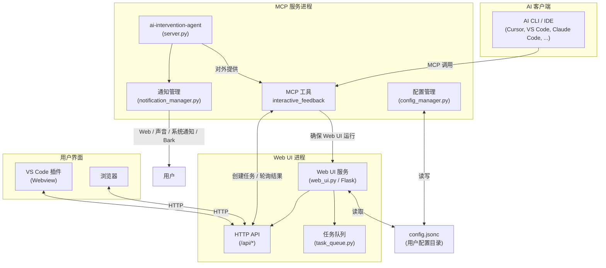

<div align="center">
  <a href="https://github.com/xiadengma/ai-intervention-agent">
    
  </a>

  <h2>AI Intervention Agent</h2>

  <p><strong>让 MCP 智能体支持“实时人工介入”。</strong></p>

  <p>
    <a href="https://github.com/xiadengma/ai-intervention-agent/actions/workflows/test.yml">
      
    </a>
    <a href="https://pypi.org/project/ai-intervention-agent/">
      
    </a>
    <a href="https://www.python.org/downloads/">
      
    </a>
    <a href="https://open-vsx.org/extension/xiadengma/ai-intervention-agent">
      
    </a>
    <a href="https://open-vsx.org/extension/xiadengma/ai-intervention-agent">
      
    </a>
    <a href="https://open-vsx.org/extension/xiadengma/ai-intervention-agent">
      
    </a>
    <a href="https://deepwiki.com/xiadengma/ai-intervention-agent">
      
    </a>
    <a href="https://github.com/xiadengma/ai-intervention-agent/blob/main/LICENSE">
      
    </a>
  </p>

  <p>
    <a href="./README.md">English</a> | 简体中文
  </p>
</div>

使用 AI CLI/IDE 时，经常会出现偏离预期的情况。这个项目提供一种简单方式：在关键节点**干预智能体**，通过 Web UI 展示上下文，并用 `interactive_feedback` 收集你的输入/选择/图片，让 AI 以你最新的要求继续任务。

支持 `Cursor`、`VS Code`、`Claude Code`、`Augment`、`Windsurf`、`Trae` 等。

## 快速开始

1. 安装：

```bash
pip install ai-intervention-agent

# 或
uv add ai-intervention-agent
```

2. 在你的 AI 工具中配置 MCP（推荐用 `uvx` 启动）：

```json
{
  "mcpServers": {
    "ai-intervention-agent": {
      "command": "uvx",
      "args": ["ai-intervention-agent"],
      "timeout": 600,
      "autoApprove": ["interactive_feedback"]
    }
  }
}
```

> [!NOTE] > `interactive_feedback` 是一个**长时间等待**的工具。有些客户端存在硬超时限制，因此 Web UI 提供倒计时 + 自动提交（自动重调）以尽量保持会话不断开。

<details>
<summary>提示词（可复制）</summary>

```text
- **只能通过 MCP `ai-intervention-agent` 对我进行询问，禁止直接询问或结束任务询问**
- **如果调用工具发生错误，需要坚持再次使用 `ai-intervention-agent` 询问，而不是自作主张，直到工具调用成功**

ai-intervention-agent 工具使用细节：

- 需求不明确时使用 `ai-intervention-agent` 询问澄清，提供预定义选项
- 在有多个方案的时候，需要使用 `ai-intervention-agent` 询问，而不是自作主张
- 在有方案/策略需要更新时，需要使用 `ai-intervention-agent` 询问，而不是自作主张
- 即将完成请求前必须调用 `ai-intervention-agent` 请求反馈
- 在没有明确通过使用 `ai-intervention-agent` 询问并得到可以完成任务/结束时，禁止主动结束对话/请求
```

</details>

## 界面截图

<p align="center">
  
  
</p>

<p align="center"><sub>反馈页（浅色模式）</sub></p>

<details>
<summary>更多截图</summary>

<p align="center">
  
  
</p>

<p align="center"><sub>空状态（浅色模式）</sub></p>

<p align="center">
  
  
</p>

<p align="center"><sub>反馈页（深色模式）</sub></p>

<p align="center">
  
  
</p>

<p align="center"><sub>空状态（深色模式）</sub></p>

<p align="center">
  
  
</p>

<p align="center"><sub>设置页（深色）</sub></p>

</details>

## 主要特性

- **实时介入**：AI 在关键节点暂停，等待你的指示
- **Web 界面**：Markdown / 代码高亮 / 数学公式渲染
- **多任务**：多任务标签页切换，每个任务独立倒计时
- **自动重调**：倒计时到点自动提交，减少会话超时中断
- **通知**：Web / 声音 / 系统通知 / Bark
- **远程友好**：适配 SSH 端口转发等远程开发场景

## VS Code 插件（可选）

| 项目                        | 说明                                                                                                                                                                     |
| --------------------------- | ------------------------------------------------------------------------------------------------------------------------------------------------------------------------ |
| 用途                        | 把交互面板放进 VS Code 侧边栏，避免频繁切换浏览器。                                                                                                                      |
| 安装（Open VSX）            | [Open VSX](https://open-vsx.org/extension/xiadengma/ai-intervention-agent)                                                                                               |
| 下载 VSIX（GitHub Release） | [GitHub Releases](https://github.com/xiadengma/ai-intervention-agent/releases/latest)                                                                                    |
| 设置                        | `ai-intervention-agent.serverUrl`（填写你的 Web UI 地址，例如 `http://localhost:8080`；端口可在 [`config.jsonc.default`](config.jsonc.default) 的 `web_ui.port` 中修改） |

## 配置说明

| 项目                 | 说明                                                                                  |
| -------------------- | ------------------------------------------------------------------------------------- |
| 配置文档（English）  | [docs/configuration.md](docs/configuration.md)                                        |
| 配置文档（简体中文） | [docs/configuration.zh-CN.md](docs/configuration.zh-CN.md)                            |
| 默认模板             | [`config.jsonc.default`](config.jsonc.default)（首次运行会自动复制为 `config.jsonc`） |

| 操作系统 | 配置目录位置                                           |
| -------- | ------------------------------------------------------ |
| Linux    | `~/.config/ai-intervention-agent/`                     |
| macOS    | `~/Library/Application Support/ai-intervention-agent/` |
| Windows  | `%APPDATA%/ai-intervention-agent/`                     |

## 架构



## 文档

- **API 文档索引（简体中文）**：[`docs/api.zh-CN/index.md`](docs/api.zh-CN/index.md)
- **API Docs (English)**：[`docs/api/index.md`](docs/api/index.md)
- **DeepWiki**：[deepwiki.com/xiadengma/ai-intervention-agent](https://deepwiki.com/xiadengma/ai-intervention-agent)

## 同类产品

1. [interactive-feedback-mcp](https://github.com/poliva/interactive-feedback-mcp)
2. [mcp-feedback-enhanced](https://github.com/Minidoracat/mcp-feedback-enhanced)
3. [cunzhi](https://github.com/imhuso/cunzhi)
4. [other interactive-feedback-mcp](https://github.com/Pursue-LLL/interactive-feedback-mcp)

## 开源协议

MIT License
