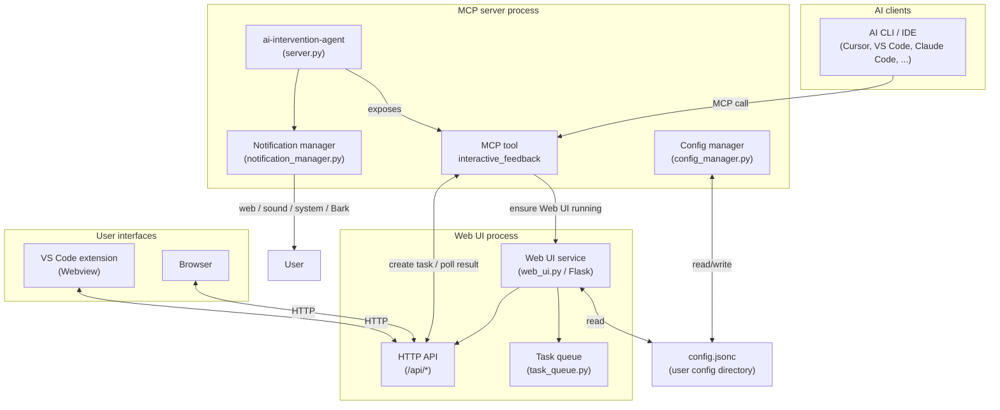

<div align="center">
  <a href="https://github.com/xiadengma/ai-intervention-agent">
    
  </a>

  <h2>AI Intervention Agent</h2>

  <p><strong>Real-time user intervention for MCP agents.</strong></p>

  <p>
    <a href="https://github.com/xiadengma/ai-intervention-agent/actions/workflows/test.yml">
      
    </a>
    <a href="https://pypi.org/project/ai-intervention-agent/">
      
    </a>
    <a href="https://www.python.org/downloads/">
      
    </a>
    <a href="https://open-vsx.org/extension/xiadengma/ai-intervention-agent">
      
    </a>
    <a href="https://open-vsx.org/extension/xiadengma/ai-intervention-agent">
      
    </a>
    <a href="https://open-vsx.org/extension/xiadengma/ai-intervention-agent">
      
    </a>
    <a href="https://deepwiki.com/xiadengma/ai-intervention-agent">
      
    </a>
    <a href="https://github.com/xiadengma/ai-intervention-agent/blob/main/LICENSE">
      
    </a>
  </p>

  <p>
    English | <a href="./README.zh-CN.md">简体中文</a>
  </p>
</div>

When using AI CLIs/IDEs, agents can drift from your intent. This project gives you a simple way to **intervene** at key moments, review context in a Web UI, and send your latest instructions via `interactive_feedback` so the agent can continue on track.

Works with `Cursor`, `VS Code`, `Claude Code`, `Augment`, `Windsurf`, `Trae`, and more.

## Quick start

1. Install:

```bash
pip install ai-intervention-agent

# or
uv add ai-intervention-agent
```

2. Configure your AI tool to launch the MCP server via `uvx`:

```json
{
  "mcpServers": {
    "ai-intervention-agent": {
      "command": "uvx",
      "args": ["ai-intervention-agent"],
      "timeout": 600,
      "autoApprove": ["interactive_feedback"]
    }
  }
}
```

> [!NOTE] > `interactive_feedback` is a **long-running tool**. Some clients have a hard request timeout, so the Web UI provides a countdown + auto re-submit option to keep sessions alive.

<details>
<summary>Prompt snippet (copy/paste)</summary>

```text
- Only ask me through the MCP `ai-intervention-agent` tool; do not ask directly in chat or ask for end-of-task confirmation in chat.
- If a tool call fails, keep asking again through `ai-intervention-agent` instead of making assumptions, until the tool call succeeds.

ai-intervention-agent usage details:

- If requirements are unclear, use `ai-intervention-agent` to ask for clarification with predefined options.
- If there are multiple approaches, use `ai-intervention-agent` to ask instead of deciding unilaterally.
- If a plan/strategy needs to change, use `ai-intervention-agent` to ask instead of deciding unilaterally.
- Before finishing a request, always ask for feedback via `ai-intervention-agent`.
- Do not end the conversation/request unless the user explicitly allows it via `ai-intervention-agent`.
```

</details>

## Screenshots

<p align="center">
  <picture>
    <source media="(prefers-color-scheme: dark)" srcset=".github/assets/desktop_dark_content.png">
    
  </picture>
  <picture>
    <source media="(prefers-color-scheme: dark)" srcset=".github/assets/mobile_dark_content.png">
    
  </picture>
</p>

<p align="center"><sub>Feedback page (auto switches between dark/light)</sub></p>

<details>
<summary>More screenshots (empty state + settings)</summary>

<p align="center">
  <picture>
    <source media="(prefers-color-scheme: dark)" srcset=".github/assets/desktop_dark_no_content.png">
    
  </picture>
  <picture>
    <source media="(prefers-color-scheme: dark)" srcset=".github/assets/mobile_dark_no_content.png">
    
  </picture>
</p>

<p align="center"><sub>Empty state (auto switches between dark/light)</sub></p>

<p align="center">
  
  
</p>

<p align="center"><sub>Settings (dark)</sub></p>

</details>

## Key features

- **Real-time intervention**: the agent pauses and waits for your input via `interactive_feedback`
- **Web UI**: Markdown, code highlighting, and math rendering
- **Multi-task**: tab switching with independent countdown timers
- **Auto re-submit**: keep sessions alive by auto-submitting at timeout
- **Notifications**: web / sound / system / Bark
- **SSH-friendly**: great with port forwarding

## VS Code extension (optional)

| Item                           | Value                                                                                                                                                                          |
| ------------------------------ | ------------------------------------------------------------------------------------------------------------------------------------------------------------------------------ |
| Purpose                        | Embed the interaction panel into VS Code’s sidebar to avoid switching to a browser.                                                                                            |
| Install (Open VSX)             | [Open VSX](https://open-vsx.org/extension/xiadengma/ai-intervention-agent)                                                                                                     |
| Download VSIX (GitHub Release) | [GitHub Releases](https://github.com/xiadengma/ai-intervention-agent/releases/latest)                                                                                          |
| Setting                        | `ai-intervention-agent.serverUrl` (should match your Web UI URL, e.g. `http://localhost:8080`; you can change `web_ui.port` in [`config.jsonc.default`](config.jsonc.default)) |

## Configuration

| Item             | Value                                                                                             |
| ---------------- | ------------------------------------------------------------------------------------------------- |
| Docs (English)   | [docs/configuration.md](docs/configuration.md)                                                    |
| Docs (简体中文)  | [docs/configuration.zh-CN.md](docs/configuration.zh-CN.md)                                        |
| Default template | [`config.jsonc.default`](config.jsonc.default) (on first run it will be copied to `config.jsonc`) |

| OS      | User config directory                                  |
| ------- | ------------------------------------------------------ |
| Linux   | `~/.config/ai-intervention-agent/`                     |
| macOS   | `~/Library/Application Support/ai-intervention-agent/` |
| Windows | `%APPDATA%/ai-intervention-agent/`                     |

## Architecture



## Documentation

- **API docs index**: [`docs/api/index.md`](docs/api/index.md)
- **API docs (简体中文)**: [`docs/api.zh-CN/index.md`](docs/api.zh-CN/index.md)
- **DeepWiki**: [deepwiki.com/xiadengma/ai-intervention-agent](https://deepwiki.com/xiadengma/ai-intervention-agent)

## Related projects

- [interactive-feedback-mcp](https://github.com/poliva/interactive-feedback-mcp)
- [mcp-feedback-enhanced](https://github.com/Minidoracat/mcp-feedback-enhanced)
- [cunzhi](https://github.com/imhuso/cunzhi)
- [other interactive-feedback-mcp](https://github.com/Pursue-LLL/interactive-feedback-mcp)

## License

MIT License
