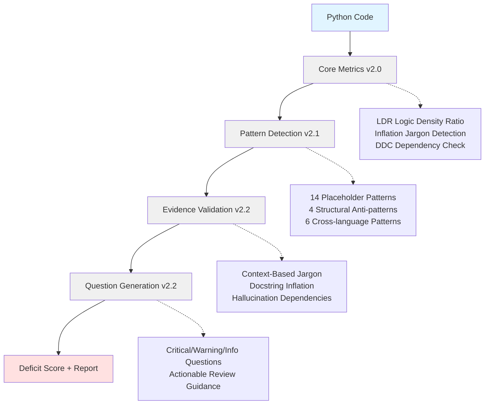

<p align="center">
  
</p>

# AI-SLOP Detector v2.6.2

[](https://pypi.org/project/ai-slop-detector/)
[](https://www.python.org/downloads/)
[](https://opensource.org/licenses/MIT)
[](tests/)
[](htmlcov/)

**Production-grade static analyzer for detecting AI-generated code quality issues with evidence-based validation.**

Detects six critical categories of AI-generated code problems with actionable, context-aware questions.

---

**Quick Navigation:**
[🚀 Quick Start](#quick-start) •
[✨ What's New](#whats-new-in-v262) •
[🏗️ Architecture](#architecture-overview) •
[📊 Core Features](#core-features) •
[⚙️ Configuration](docs/CONFIGURATION.md) •
[🔧 CLI Usage](docs/CLI_USAGE.md) •
[🚦 CI/CD Integration](docs/CI_CD.md) •
[👨‍💻 Development](docs/DEVELOPMENT.md)

---

## Quick Start

```bash
# Install from PyPI
pip install ai-slop-detector

# Analyze a single file
slop-detector mycode.py

# Scan entire project
slop-detector --project ./src

# CI/CD Integration (Soft mode - PR comments only)
slop-detector --project ./src --ci-mode soft --ci-report

# CI/CD Integration (Hard mode - fail build on issues)
slop-detector --project ./src --ci-mode hard --ci-report

# Generate JSON report
slop-detector mycode.py --json --output report.json
```

---

## What's New in v2.6.2

### Evidence-Based Validation

**"Trust, but Verify" - Now Enforced:**
- ✅ **Integration Test Requirement**: Claims like `production-ready`, `scalable`, or `enterprise-grade` now **FAIL** if no integration tests are detected.
- ✅ **4-Layer Evidence Detection**: Scans paths (`tests/integration`), filenames (`*_integration_test.py`), markers (`@pytest.mark.e2e`), and runtime usage (`TestClient`).
- ✅ **Enhanced Reporting**: Reports now explicitly break down `tests_unit` vs `tests_integration`.

### Quality Improvements
- **Tests**: 170 comprehensive tests (up from 165)
- **Coverage**: 95% Context-Jargon coverage
- **Zero-False-Positive Tuning**: Helper files excluded from test counts

### Core Features (v2.x)

1. **Context-Based Jargon Detection** - Cross-validates quality claims with actual evidence
2. **Docstring Inflation Analysis** - Detects documentation-heavy, implementation-light code
3. **Placeholder Pattern Catalog** - 14 patterns detecting unfinished/scaffolded code
4. **Hallucination Dependencies** - Identifies purpose-specific imports that are never used
5. **Question Generation UX** - Converts findings into actionable review questions
6. **CI Gate 3-Tier System** - Soft/Hard/Quarantine enforcement modes (fully tested)

---

## What is AI Slop?

**AI Slop** refers to code patterns commonly produced by AI code generators that lack substance:

### Pattern 1: Placeholder Code
```python
def quantum_encode(self, data):
    """Apply quantum encoding with advanced algorithms."""
    pass  # [CRITICAL] Empty implementation

def process_data(self):
    """Process data comprehensively."""
    raise NotImplementedError  # [HIGH] Unimplemented
```

**Detection:** 14 placeholder patterns (empty except, NotImplementedError, pass, ellipsis, return None, etc.)

### Pattern 2: Buzzword Inflation
```python
class EnterpriseProcessor:
    """
    Production-ready, enterprise-grade, highly scalable processor
    with fault-tolerant architecture and comprehensive error handling.
    """
    def process(self, data):
        return data + 1  # [CRITICAL] Claims without evidence
```

**Detection:** Cross-validates claims like "production-ready" against actual evidence (error handling, logging, tests, etc.)

### Pattern 3: Docstring Inflation
```python
def add(a, b):
    """
    Sophisticated addition algorithm with advanced optimization.

    This function implements a state-of-the-art arithmetic operation
    using enterprise-grade validation and comprehensive error handling
    with production-ready reliability guarantees.

    Args:
        a: First operand with advanced type validation
        b: Second operand with enterprise-grade checking

    Returns:
        Optimized sum with comprehensive quality assurance
    """
    return a + b  # [WARNING] 12 lines of docs, 1 line of code
```

**Detection:** Ratio analysis (docstring lines / implementation lines)

### Pattern 4: Hallucinated Dependencies
```python
# [CRITICAL] 10 unused purpose-specific imports detected
import torch  # ML: never used
import tensorflow as tf  # ML: never used
import requests  # HTTP: never used
import sqlalchemy  # Database: never used

def process():
    return "hello"  # None of the imports are actually used
```

**Detection:** Categorizes imports by purpose (ML, HTTP, database) and validates usage

---

## Architecture Overview

AI-SLOP Detector v2.6.2 uses a **multi-dimensional analysis engine**:



---

## Core Features

### 1. Context-Based Jargon Detection

Validates quality claims against actual codebase evidence:

```python
# Claims "production-ready" but missing:
# - error_handling
# - logging
# - tests
# - input_validation
# - config_management

# [CRITICAL] "production-ready" claim lacks 5/5 required evidence
```

**Evidence tracked (15 types):**

| Category | Evidence Types | Detection Signals |
|----------|----------------|-------------------|
| **Testing** | Unit tests | test functions, test files, test directories |
| | Integration tests | tests/integration path, pytest markers, TestClient/testcontainers |
| **Quality Assurance** | Error handling | try/except with non-empty handlers |
| | Logging | actual logger usage, not just imports |
| | Input validation | isinstance, type checks, assertions |
| | Documentation | meaningful docstrings |
| **Configuration** | Config management | settings, .env, yaml references |
| | Monitoring | prometheus, statsd, sentry |
| **Security** | Security measures | auth, encryption, sanitization |
| **Performance** | Caching | @cache, redis, memcache |
| | Async support | async/await usage |
| | Optimization | vectorization, memoization |
| **Reliability** | Retry logic | @retry, backoff, circuit breaker |
| **Architecture** | Design patterns | Factory, Singleton, Observer |
| | Advanced algorithms | complexity >= 10 |

### 2. Docstring Inflation Analysis

Detects documentation-heavy, implementation-light functions:

```python
Ratio = docstring_lines / implementation_lines

CRITICAL: ratio >= 2.0  (2x more docs than code)
WARNING:  ratio >= 1.0  (more docs than code)
INFO:     ratio >= 0.5  (substantial docs)
PASS:     ratio <  0.5  (balanced or code-heavy)
```

### 3. Placeholder Pattern Catalog

14 patterns detecting unfinished/scaffolded code:

**Critical Severity:**
- Empty exception handlers (`except: pass`)
- Bare except blocks

**High Severity:**
- `raise NotImplementedError`
- Ellipsis placeholders (`...`)
- HACK comments

**Medium Severity:**
- `return None` placeholders
- Interface-only classes (75%+ placeholder methods)

**Low Severity:**
- `pass` statements
- TODO/FIXME comments

### 4. Hallucination Dependencies

Categorizes imports by purpose and validates usage:

**12 Categories tracked:**
- ML: torch, tensorflow, keras, transformers
- Vision: cv2, PIL, imageio
- HTTP: requests, httpx, aiohttp, flask
- Database: sqlalchemy, pymongo, redis
- Async: asyncio, trio, anyio
- Data: pandas, polars, dask
- Serialization: json, yaml, toml
- Testing: pytest, unittest, mock
- Logging: logging, loguru, structlog
- CLI: argparse, click, typer, rich
- Cloud: boto3, google-cloud, azure
- Security: cryptography, jwt, passlib

### 5. Question Generation UX

Converts findings into actionable review questions:

```
CRITICAL QUESTIONS:
1. Only 14% of quality claims are backed by evidence.
   Are these marketing buzzwords without substance?

2. Claims like "fault-tolerant", "scalable" have ZERO supporting evidence.
   Where are the tests, error handling, and other indicators?

WARNING QUESTIONS:
3. (Line 4) "production-ready" claim lacks: error_handling, logging, tests.
   Only 20% of required evidence present.

4. Function "process" has 15 lines of docstring but only 2 lines of implementation.
   Is this AI-generated documentation without substance?

5. Why import "torch" for machine learning but never use it?
   Was this AI-generated boilerplate?
```

### 6. CI Gate 3-Tier System

Progressive enforcement for CI/CD pipelines:

**Soft Mode (Informational):**
```bash
slop-detector --project . --ci-mode soft --ci-report
# Posts PR comment, never fails build
# Use for: visibility, onboarding
```

**Hard Mode (Strict):**
```bash
slop-detector --project . --ci-mode hard --ci-report
# Fails build if deficit_score >= 70 or critical_patterns >= 3
# Exit code 1 on failure
# Use for: production branches
```

**Quarantine Mode (Gradual):**
```bash
slop-detector --project . --ci-mode quarantine --ci-report
# Tracks repeat offenders in .slop_quarantine.json
# Escalates to FAIL after 3 violations
# Use for: gradual rollout
```

**GitHub Action Example:**
```yaml
- name: Quality Gate
  run: |
    pip install ai-slop-detector
    slop-detector --project . --ci-mode quarantine --ci-report
```

---

## CLI Usage

```bash
# Single file
slop-detector mycode.py

# Project scan
slop-detector --project ./src

# CI/CD Integration
slop-detector --project . --ci-mode hard --ci-report

# With custom config
slop-detector --project ./src --config .slopconfig.yaml
```

📖 **[Complete CLI Reference →](docs/CLI_USAGE.md)**

---

## Configuration

Create `.slopconfig.yaml` for custom thresholds:

```yaml
weights:
  ldr: 0.40        # Logic Density Ratio
  inflation: 0.35  # Jargon Detection
  ddc: 0.25        # Dependency Check

thresholds:
  ldr:
    critical: 0.30
    warning: 0.60
```

⚙️ **[Full Configuration Guide →](docs/CONFIGURATION.md)**

---

## CI/CD Integration

```bash
# Soft mode - informational only
slop-detector --project . --ci-mode soft --ci-report

# Hard mode - fail build on issues
slop-detector --project . --ci-mode hard --ci-report

# Claim-based enforcement (v2.6.2)
slop-detector --project . --ci-mode hard --ci-claims-strict
```

🚦 **[CI/CD Integration Guide →](docs/CI_CD.md)**

---

## Output Examples

### Console Output (Rich)

```
┌────────────────────────────┐
│ AI CODE QUALITY REPORT     │
└────────────────────────────┘

File: mycode.py
Status: CRITICAL
Score: 71.1/100

LDR: 47.22% (B)
ICR: 1.50 (FAIL)
DDC: 10.00% (SUSPICIOUS)

CRITICAL QUESTIONS:
1. Only 14% of quality claims are backed by evidence.
2. "production-ready" claim lacks: error_handling, logging, tests.

WARNING QUESTIONS:
3. Function "process" has 15 lines of docstring, 2 lines of code.
4. Why import "torch" for ML but never use it?
```

### JSON Output

```json
{
  "file_path": "mycode.py",
  "deficit_score": 71.1,
  "status": "critical_deficit",
  "ldr": {"ldr_score": 0.47, "grade": "B"},
  "inflation": {"inflation_score": 1.5, "status": "FAIL"},
  "ddc": {"usage_ratio": 0.10, "grade": "SUSPICIOUS"},
  "context_jargon": {
    "justification_ratio": 0.14,
    "worst_offenders": ["production-ready", "scalable"]
  },
  "docstring_inflation": {
    "overall_ratio": 7.5,
    "inflated_count": 3
  },
  "hallucination_deps": {
    "total_hallucinated": 10,
    "categories": ["ml", "http", "database"]
  }
}
```

---

## VS Code Extension

**Coming Soon:** Real-time analysis in VS Code with inline diagnostics.

Current status: Local testing complete, marketplace publishing pending.

---

## Development & Contributing

Contributions welcome! Quick setup:

```bash
git clone https://github.com/flamehaven01/AI-SLOP-Detector.git
cd AI-SLOP-Detector
pip install -e ".[dev]"
pytest tests/ -v --cov
```

**Guidelines:** 80%+ coverage • Tests required • Follow code style

👨‍💻 **[Development Guide →](docs/DEVELOPMENT.md)**

---

## License

MIT License - see [LICENSE](LICENSE) file for details.

---

## Citation

If you use AI-SLOP Detector in research, please cite:

```bibtex
@software{ai_slop_detector,
  title = {AI-SLOP Detector: Evidence-Based Static Analysis for AI-Generated Code},
  author = {Flamehaven},
  year = {2024},
  version = {2.6.2},
  url = {https://github.com/yourusername/ai-slop-detector}
}
```

---

## Acknowledgments

- Built with Python 3.8+
- AST analysis powered by Python's `ast` module
- Pattern detection inspired by traditional linters
- Evidence validation methodology developed in-house
- Thanks to the open-source community

---

## Roadmap

**v2.7 (In Progress):**
- [ ] VS Code Extension marketplace release (dev complete, pending publish)
- [ ] Enhanced evidence types (15+ types) - currently 14 types ✅
- [ ] Custom pattern DSL for user-defined rules
- [ ] Performance optimizations for large codebases

**v2.8 (Planned Q1 2025):**
- [ ] Multi-language support (JavaScript, TypeScript)
- [ ] Enhanced CI/CD integrations (GitLab CI, CircleCI)
- [ ] Real-time analysis daemon mode
- [ ] Team analytics dashboard (beta)

**v3.0 (Planned Q2 2025):**
- [ ] ML-based pattern recognition
- [ ] Auto-fix suggestions with confidence scores
- [ ] IDE plugins (PyCharm, IntelliJ, JetBrains)
- [ ] Enterprise features (SSO, RBAC already implemented)

---

## Support

- **Documentation:** [docs/](docs/)
- **Issues:** [GitHub Issues](https://github.com/yourusername/ai-slop-detector/issues)
- **Discussions:** [GitHub Discussions](https://github.com/yourusername/ai-slop-detector/discussions)

---

**Made with ❤️ by Flamehaven | Detecting AI slop since 2024**
