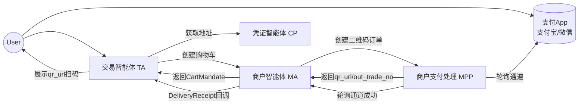
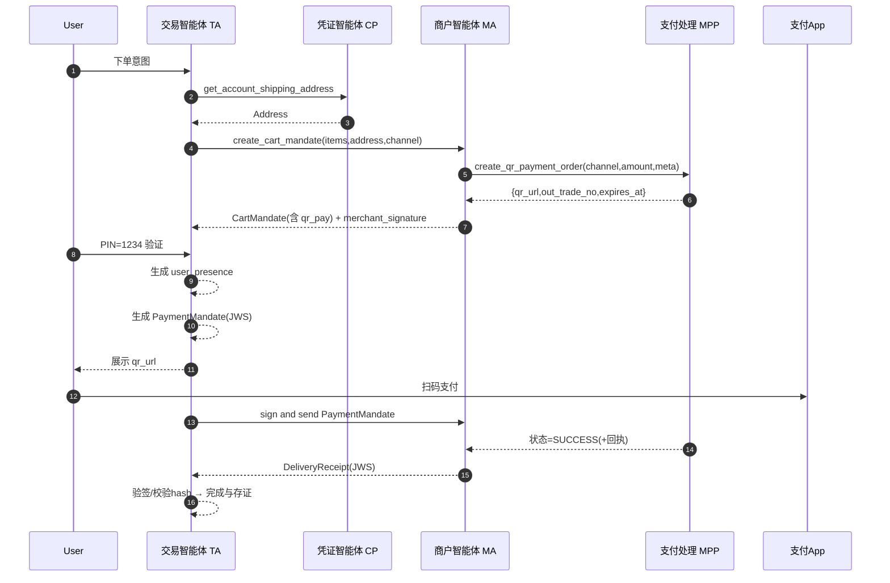
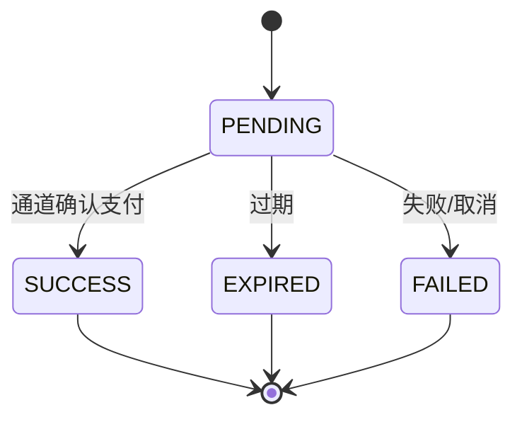

# ANP 对 AP2 最小实现规格（M1/QR/CNY）v1.4

参考与上下文来源：[研究/ap2深度分析.md](研究/ap2深度分析.md)

本文档为“人在场 + 二维码拉式支付（Alipay/WeChat）”的最小实现规格（M1），用于指导 ANP 团队设计、开发、测试与验收。身份与密钥全生命周期由 ANP 开发者自行管理（本规范仅规定验签/签发接口契约）。与 AP2 的对齐点和差异点在文末附录中明确。

—  
术语引用（点击查看来源说明）：
- [JWS()](研究/ap2深度分析.md:1)（JWT 签名容器，使用 RS256）
- [JCS()](研究/ap2深度分析.md:1)（RFC 8785 JSON 规范化）
- [cart_hash()](研究/ap2深度分析.md:1)（购物车内容规范化哈希）
- [pmt_hash()](研究/ap2深度分析.md:1)（支付凭证负载规范化哈希）
- [cnf()](研究/ap2深度分析.md:1)（JWS cnf 绑定：JWK 或 kid）
- [sd_hash()](研究/ap2深度分析.md:1)（SD-JWT 升级占位）
- [verify_jws()](研究/ap2深度分析.md:1)（验签接口约束）
- [sign_jws()](研究/ap2深度分析.md:1)（签发接口约束）
- [get_peer_pubkey()](研究/ap2深度分析.md:1)（获取对端公钥接口）

---

## 1. 目标与范围

- 场景：人类在场（PIN 弱校验）+ 二维码拉式支付（ALIPAY_QR、WECHAT_QR）
- 货币：CNY
- 参与代理：
  - TA：交易智能体（用户界面、PIN 校验、展示二维码、生成支付凭证、接收交付凭证）
  - MA：商户智能体（生成购物车、签名、对接 MPP、签发交付凭证）
  - CP：凭证智能体（用户地址/账户资料；不提供支付 token）
  - MPP：商户支付处理智能体（创建二维码订单并轮询通道）
- 关键约定：
  - 不使用 HTTP 头 X-A2A-Extensions，改为消息体 `extensions` 自描述 + 各代理 [ad.json](研究/ap2深度分析.md) 的 ANP 风格 `transaction` 段声明
  - 支付凭证采用单一 [JWS()](研究/ap2深度分析.md:1) 容器（M1），含 [cnf()](研究/ap2深度分析.md:1) 与 [sd_hash()](研究/ap2深度分析.md:1) 占位；不实现 SD‑JWT‑VC 完整链路
  - TA 不轮询支付状态；由 MPP→MA→TA 回调交付凭证

---

## 2. 架构与职责

### 2.1 角色职责矩阵

| 角色 | 核心职责 | 签名/验签 | 存证 |
|---|---|---|---|
| TA | 用户交互；PIN 校验并生成 user_presence；生成 PaymentMandate；展示二维码；接收 DeliveryReceipt 并验签落存证 | 生成 PaymentMandate [JWS()](研究/ap2深度分析.md:1)；验 MA 的 Cart/Delivery 签名 | CartMandate、PaymentMandate、DeliveryReceipt、user_presence、时间线 |
| MA | 生成购物车；调用 MPP 创建二维码订单；对 Cart 做 [cart_hash()](研究/ap2深度分析.md:1) 后签名；接收 MPP 成功并签发 DeliveryReceipt | 生成 Cart [JWS()](研究/ap2深度分析.md:1)；生成 DeliveryReceipt [JWS()](研究/ap2深度分析.md:1)；验 TA 的 PaymentMandate | 同步存证含 MPP 回执与时间线 |
| CP | 提供用户配送地址/资料 | 无 | 请求与响应留痕 |
| MPP | 创建二维码订单；轮询通道状态并回报 MA | 无 | 渠道回执与轮询时间线 |

说明：身份与密钥管理（生成/轮换/分发）由 ANP 开发者自管，规范仅要求验签/签发接口见 [verify_jws()](研究/ap2深度分析.md:1)/[sign_jws()](研究/ap2深度分析.md:1)/[get_peer_pubkey()](研究/ap2深度分析.md:1)。

### 2.2 组件关系图



### 2.3 全流程时序图（人在场，TA不轮询）



---

## 3. ad.json（ANP风格）与消息结构

### 3.1 ad.json 的 `transaction` 段（ANP 风格）

统一路径前缀：`/anp/{role}/{method}`（HTTP POST JSON）

通用字段：
- `supportedChannels`: ["ALIPAY_QR","WECHAT_QR"]（MA、MPP）
- `extensions`: ["anp.ap2.qr.v1","anp.human_presence.v1"]
- `endpoints`: 方法名 → 路径映射
- `security`: {"sig":"RS256","hash":"JCS-SHA256"}

示例（MA 片段）：
```json
{
  "transaction": {
    "supportedChannels": ["ALIPAY_QR","WECHAT_QR"],
    "extensions": ["anp.ap2.qr.v1","anp.human_presence.v1"],
    "endpoints": {
      "search_catalog": "/anp/merchant/search_catalog",
      "create_cart_mandate": "/anp/merchant/create_cart_mandate",
      "update_cart_with_address": "/anp/merchant/update_cart_with_address",
      "issue_delivery_receipt": "/anp/merchant/issue_delivery_receipt"
    },
    "security": {"sig":"RS256","hash":"JCS-SHA256"}
  }
}
```

其他角色（CP/MPP/TA 回调）参照相同风格定义。

### 3.2 消息顶层结构（取消 Header 扩展协商）

所有请求/响应推荐包含：
```json
{
  "extensions": ["anp.ap2.qr.v1","anp.human_presence.v1"],
  "context": { "messageId": "...", "contextId": "...", "taskId": "...", "ts": "ISO8601" },
  "from": "did:anp:xxx",
  "to": "did:anp:yyy",
  "data": { /* 领域负载 */ }
}
```
- 服务端必须校验 `extensions` 包含所需扩展，否则拒绝。

---

## 4. 数据模型与字段规范

所有需参与签名/比对的对象先经 [JCS()](研究/ap2深度分析.md:1) 规范化，再做 SHA‑256，Base64URL 编码。

### 4.1 CartMandate（MA 生成并签名）

结构：
```json
{
  "contents": {
    "shop_cart":
    {

    },
    "payment_request": {
      "details": {
        "total": { "currency": "CNY", "value": 120.00 },
        "displayItems": [
          { "label": "Item-1", "amount": { "currency": "CNY", "value": 120.00 } }
        ]
      }
    },
    "qr_pay": {
      "channel": "ALIPAY_QR",
      "qr_url": "https://pay.example.com/qrcode/...",
      "out_trade_no": "uuid-or-serial",
      "amount": { "currency": "CNY", "value": 120.00 },
      "expires_at": "2025-10-17T09:00:00Z"
    }
  },
  "merchant_signature": "JWS(RS256 over cart_hash)",
  "timestamp": "ISO8601"
}
```

哈希计算：
- `cart_hash = b64url( sha256( JCS(contents) ) )`

关键字段表：

| 字段 | 类型 | 约束 | 说明 |
|---|---|---|---|
| contents.payment_request.details.total | object | currency=CNY | 总金额 |
| contents.qr_pay.channel | enum | ALIPAY_QR/WECHAT_QR | 支付渠道 |
| contents.qr_pay.qr_url | string | 必填 | 二维码 URL |
| contents.qr_pay.out_trade_no | string | 必填 | 支付单号 |
| contents.qr_pay.expires_at | ISO8601 | 必填 | 二维码过期时间 |
| merchant_signature | string(JWS) | RS256 | 对 `cart_hash` 的 [JWS()](研究/ap2深度分析.md:1) 签名 |

### 4.2 PaymentMandate（TA 生成，M1：JWS 容器）

payload 示例：
```json
{
  "iss": "did:anp:TA",
  "aud": "did:anp:MA",
  "iat": 1730000000,
  "exp": 1730000900,
  "jti": "uuid",
  "cart_hash": "...",
  "payment_request_id": "order_xxx",
  "payment_method": { "type": "QR", "channel": "ALIPAY_QR", "out_trade_no": "..." },
  "amount": { "currency": "CNY", "value": 120.00 },
  "cnf": { "kid": "TA-kid" },
  "user_authorization": cart_mandate_hash + "_" + payment_mandate_hash
}

```

用 user_authorization 字段最终签名时（两个mandate的hash）

 payment_mandate.user_authorization = (
      cart_mandate_hash + "_" + payment_mandate_hash
  )
  tool_context.state["signed_payment_mandate"] = payment_mandate
  return payment_mandate.user_authorization


但是user的key应该来自这个声明
  "cnf": { "kid": "TA-kid" },
  "sd_hash": "placeholder",
  但是这部分如何配合did使用 需要讨论


哈希计算：
- `pmt_hash = b64url( sha256( JCS(payload-without-signature) ) )`

字段表：

| 字段 | 类型 | 约束 | 说明 |
|---|---|---|---|
| iss/aud | DID | 必填 | 发行方/受众 |
| iat/exp | 时间戳 | 必填 | 建议有效期 ≤ 15 分钟 |
| jti | string | 必填 | 全局唯一（防重放） |
| cart_hash | string | 必填 | 对齐 CartMandate |
| payment_method | object | type=QR | 指向二维码支付单 |
| user_presence | object | 必填 | 人在场证明（PIN=“1234”） |
| cnf | object | kid 或 jwk | 持有者密钥绑定 |
| sd_hash | string | 可选 | SD-JWT 升级占位 |
| extensions | array | 必填 | 启用扩展列表 |

### 4.3 DeliveryReceipt（MA 成功后签发回 TA）

payload 示例：
```json
{
  "iss": "did:anp:MA",
  "aud": "did:anp:TA",
  "iat": 1730000010,
  "exp": 1730003610,
  "jti": "uuid",
  "payment_status": "SUCCESS",
  "channel": "ALIPAY_QR",
  "out_trade_no": "...",
  "amount": { "currency": "CNY", "value": 120.00 },
  "cart_hash": "...",
  "pmt_hash": "...",
  "mpp_report": {
    "paid_at": "ISO8601",
    "txn_id": "channel_txn_id",
    "timeline": [
      { "ts": "ISO8601", "event": "PENDING", "raw": { } },
      { "ts": "ISO8601", "event": "SUCCESS", "raw": { } }
    ]
  },
  "evidence_refs": [ "uri-or-hash" ],
  "extensions": ["anp.ap2.qr.v1","anp.human_presence.v1"]
}
```

字段表：

| 字段 | 约束 | 说明 |
|---|---|---|
| payment_status | SUCCESS/FAILED/EXPIRED | 必填 |
| cart_hash/pmt_hash | 与请求对应 | 哈希引用一致性 |
| mpp_report | 需包含 timeline | 证明链与回执 |

### 4.4 QRPaymentOrder（MPP 创建）
| 字段 | 类型 | 说明 |
|---|---|---|
| channel | enum | ALIPAY_QR/WECHAT_QR |
| qr_url | string | 二维码 URL |
| out_trade_no | string | 支付单号 |
| amount | object | 金额 |
| expires_at | ISO8601 | 过期时间 |
| merchant_id | string | 商户标识 |
| notify_mode | string | 固定 "internal_to_MA" |

### 4.5 Address（CP 返回）
| 字段 | 说明 |
|---|---|
| recipient_name, phone | 收件信息 |
| region, city, address_line, postal_code | 地址信息 |

---

## 5. API 定义（POST JSON）

统一前缀：`/anp/{role}/{method}`  
请求/响应顶层需含 `extensions/context/from/to/data`。下表仅列 `data` 部分结构。

### 5.1 MA
| 方法 | 路径 | 请求 data | 响应 data | 备注 |
|---|---|---|---|---|
| search_catalog | /anp/merchant/search_catalog | { shopping_intent:string } | { items:[{sku,label,unit_price}] } | 可固定样例 |
| create_cart_mandate | /anp/merchant/create_cart_mandate | { items:[{sku,qty}], address:Address, channel } | CartMandate | 生成 qr_pay + merchant_signature |
| update_cart_with_address | /anp/merchant/update_cart_with_address | { cart_id, address:Address } | CartMandate | 选配 |
| issue_delivery_receipt | /anp/merchant/issue_delivery_receipt | { cart_hash, pmt_hash } | DeliveryReceipt | 成功或异常均签发 |

### 5.2 CP
| 方法 | 路径 | 请求 data | 响应 data |
|---|---|---|---|
| get_account_shipping_address | /anp/cp/get_account_shipping_address | { user_ref:string } | Address |

### 5.3 MPP
| 方法 | 路径 | 请求 data | 响应 data |
|---|---|---|---|
| create_qr_payment_order | /anp/mpp/create_qr_payment_order | { channel, amount, meta? } | QRPaymentOrder |
| get_payment_status | /anp/mpp/get_payment_status | { out_trade_no } | { status:"PENDING\|SUCCESS\|EXPIRED\|FAILED", txn_id?, paid_at?, raw? } |

### 5.4 TA（回调接收）
| 方法 | 路径 | 请求 data | 响应 data |
|---|---|---|---|
| receive_delivery_receipt | /anp/ta/receive_delivery_receipt | DeliveryReceipt（作为 data 负载） | { ack:true, received_at } |

---

## 6. 算法与验证

### 6.1 规范化与哈希
流程：
1) 对象（如 `contents`）→ [JCS()](研究/ap2深度分析.md:1) 规范化  
2) 规范化文本 → SHA‑256  
3) 摘要 → Base64URL

规则：
- `cart_hash = b64url(sha256(JCS(CartMandate.contents)))`
- `pmt_hash = b64url(sha256(JCS(PaymentMandate.payload_without_signature)))`

### 6.2 签名与验签（RS256）
- CartMandate：MA 对 `cart_hash` 生成 [JWS()](研究/ap2深度分析.md:1)
- PaymentMandate：TA 生成 [JWS()](研究/ap2深度分析.md:1)（负载如 4.2）
- DeliveryReceipt：MA 对载荷生成 [JWS()](研究/ap2深度分析.md:1)

开发者需提供的最小接口：
- [verify_jws()](研究/ap2深度分析.md:1)：验签、`iss/aud/iat/exp/jti` 校验、`kid→公钥` 解析
- [sign_jws()](研究/ap2深度分析.md:1)：生成 JWS（alg=RS256）
- [get_peer_pubkey()](研究/ap2深度分析.md:1)：按 `kid` 获取对端公钥/JWK

### 6.3 校验要点
| 对象 | 验证方 | 校验点 |
|---|---|---|
| CartMandate | TA | MA 签名有效；`exp/iat/jti` 合规；`cart_hash` 一致 |
| PaymentMandate | MA | TA 签名有效；时间窗；`jti` 未见过；`cnf` 存在；`cart_hash` 对齐；`user_presence` 存在 |
| DeliveryReceipt | TA | MA 签名有效；`payment_status` 合法；`cart_hash/pmt_hash` 对齐；`timeline` 合理 |

---

## 7. 异常与状态

### 7.1 异常处理
| 场景 | MA→TA 回传 | 行为 |
|---|---|---|
| 二维码过期 | DeliveryReceipt.payment_status="EXPIRED" | TA 关闭并提示重试 |
| 渠道失败 | DeliveryReceipt.payment_status="FAILED" | TA 呈现失败信息 |
| PIN 失败 | 无 PaymentMandate | TA 重新挑战 |
| 签名/哈希不一致 | 规范错误 | 拒绝并落证（错误日志+证据） |
| 重放（jti 重复） | 规范错误 | 拒绝并落证 |

### 7.2 MPP 轮询状态机（示意）


---

## 8. 审计与存证

- 双方（TA/MA）统一落盘（jsonl）：
  - `ad.json` 快照、`extensions` 列表、DID 对
  - CartMandate（含 `merchant_signature` 原文）
  - PaymentMandate（JWS 原文）
  - user_presence 记录（`challenge_id` 可哈希化脱敏）
  - DeliveryReceipt（JWS 原文，含 `mpp_report.timeline`）
  - 时序日志：`{ts,event,actor,jti,hashes,status}`
- 保存期：180 天；时间源：UTC ISO8601；日志敏感字段脱敏

---

## 9. 安全说明（MVP）

- 人在场：PIN “1234”为低强度，仅用于 MVP 演示，应在生产替换为系统级可信 UI 与更强因子
- 传输：HTTPS 强制；最小权限访问；敏感日志脱敏
- 密钥：`kid` 版本化；轮换与分发由开发者自管
- 重放：`jti` 全局唯一 + 有效期短（≤ 15 分钟）；本地黑名单缓存

---

## 10. 测试与验收

| 用例 | 前置 | 步骤 | 期望 |
|---|---|---|---|
| 正常支付（两渠道） | 配置两渠道 | 全流程跑通 | 收到 SUCCESS 的 DeliveryReceipt，验签与哈希一致 |
| PIN 失败 | PIN 错误 | 生成 PaymentMandate 前失败 | 不得生成 PaymentMandate |
| 二维码过期 | 调整 expires | 到期后支付 | 收到 EXPIRED 的 DeliveryReceipt |
| 签名失败 | 篡改 JWS | 各验签方 | 拒绝并落证 |
| 哈希不一致 | 篡改 contents | TA 校验 | 拒绝并落证 |
| jti 重放 | 重发相同 jti | 验证端 | 拒绝并落证 |
| 金额边界 | 小数精度 | 生成/校验 | 不丢精度，校验通过 |

---

## 11. 工程落地计划与交付物

实施阶段：
1) 准备
   - 四类代理 [ad.json](研究/ap2深度分析.md)（`transaction` 段、`/anp/` 前缀、`extensions`、`security`）
   - 公钥分发与 `kid` 映射（开发者自管）
2) 公共库
   - 引入 PyJWT/cryptography；实现 [JCS()](研究/ap2深度分析.md:1)+SHA‑256+b64url 工具；
   - [verify_jws()](研究/ap2深度分析.md:1)/[sign_jws()](研究/ap2深度分析.md:1) 模块；`jti` 存储与过期
3) CP（地址）
   - `/anp/cp/get_account_shipping_address`：内存固定地址
4) MPP（二维码）
   - `/anp/mpp/create_qr_payment_order`：返回 `{qr_url,out_trade_no,expires_at}`
   - `/anp/mpp/get_payment_status`：状态机 PENDING→SUCCESS/EXPIRED（测试触发器）
   - 内部轮询并通知 MA
5) MA（购物车与签名）
   - 目录/定价样例
   - 组装 `contents + qr_pay` → 计算 [cart_hash()](研究/ap2深度分析.md:1) → `merchant_signature`（[JWS()](研究/ap2深度分析.md:1)）
   - `/anp/merchant/issue_delivery_receipt`：生成 DeliveryReceipt 并签名；主动回调 TA
6) TA（PIN 与支付凭证）
   - PIN 挑战 → 生成 `user_presence`
   - 生成 PaymentMandate（M1：[JWS()](研究/ap2深度分析.md:1) 容器，含 [cnf()](研究/ap2深度分析.md:1)）
   - 展示 `qr_url`
   - `/anp/ta/receive_delivery_receipt`：验签→状态落盘→完成
7) 存证与日志
   - 统一 jsonl 模式；清理策略（180d）
8) 测试与验收
   - 覆盖第 10 章用例与双渠道

交付清单：
- 本规格（Markdown）
- 四份 `ad.json` 模板（TA/MA/CP/MPP）
- JSON 样例：CartMandate、PaymentMandate、DeliveryReceipt、QRPaymentOrder、Address
- 时序图源文件（Mermaid）
- Postman 集合（端点与示例）
- 测试用例清单与验收标准

---

## 12. 与完整 SD‑JWT‑VC 的差异（显式声明）

- M1 不实现选择性披露与 OpenID4VP；仅保留 [sd_hash()](研究/ap2深度分析.md:1) 占位与 [cnf()](研究/ap2深度分析.md:1) 绑定
- 隐私最小化与跨域互操作能力有限；审计依赖 DeliveryReceipt + 时间线 + 哈希引用
- 升级路径：M2（SD‑JWT‑lite，增加披露集与 KB‑JWT）→ M3（完整 SD‑JWT‑VC + OpenID4VP）

---

## 13. anp与ap2的差异思考

- 如果都有did 是不是就不需要dnf了？ 因为验证方可以自己通过did resolver去查vc来验证did的可信？

## 附录 A：M1 vs M2 快速对比

| 维度 | M1（本规格） | M2（SD‑JWT‑lite，后续可选增强） |
|---|---|---|
| 凭证结构 | 单一 [JWS()](研究/ap2深度分析.md:1) 容器 | SD‑JWT 主体 + disclosures + KB‑JWT |
| 选择性披露 | 无 | 有（最小策略：必选 cart_hash/pmt_hash；可选 user_presence.method/level；禁止 challenge_id） |
| 会话绑定 | 无 nonce 绑定 | KB‑JWT 含 aud/nonce |
| 复杂度 | 低（1–2 人日） | 中（5–7 人日） |
| 互操作 | ANP 内部 | 贴近 IETF SD‑JWT/VC，便于向 M3 过渡 |


## 附录
### ap2委托样例

#### 意愿委托样例

意向授权可能包含以下绑定信息（不是某些 它可能会因人类存在和人类不存在的情况而异）：

付款人和收款人信息：用户的可验证身份，即 商家及其各自的凭证提供商。
收费付款方式：用户支付方式的列表或类别 已授权交易。
风险有效载荷：商家所需的风险相关信号的容器， 支付处理商和发卡机构
购物意图：定义购买的参数，例如产品 类别或特定 SKU 和相关的购买决策标准，例如 可退款性。
提示回放：代理对用户提示的理解自然 语言。
生存时间 （TTL）：授权有效性的到期时间。
```
{
  "messageId": "e0b84c60-3f5f-4234-adc6-91f2b73b19e5",
  "contextId": "sample-payment-context",
  "taskId": "sample-payment-task",
  "role": "user",
  "parts": [
    {
      "kind": "data",
      "data": {
        "ap2.mandates.IntentMandate": {
          "user_cart_confirmation_required": false,
          "natural_language_description": "I'd like some cool red shoes in my size",
          "merchants": null,
          "skus": null,
          "required_refundability": true,
          "intent_expiry": "2025-09-16T15:00:00Z"
        }
      }
    }
  ]
}
```
#### 购物委托样例

购物车授权包含以下绑定信息：

付款人和收款人信息：用户的可验证身份，即 商家及其各自的凭证提供商。
付款方式：单个特定支付的代币化表示 由凭据提供商选择并确认的收费方法 由用户。
风险有效载荷：商家所需的风险相关信号的容器， 支付处理商和发卡机构
交易详情：最终、确切的交易产品、目的地 （电子邮件或实际地址）、金额和货币。
如果适用，购买的退款条件

```
{
  "contents": {
    "id": "cart_shoes_123",
    "user_signature_required": false,
    "payment_request": {
      "method_data": [
        {
          "supported_methods": "CARD",
          "data": {
            "payment_processor_url": "http://example.com/pay"
          }
        }
      ],
      "details": {
        "id": "order_shoes_123",
        "displayItems": [
          {
            "label": "Nike Air Max 90",
            "amount": {
              "currency": "USD",
              "value": 120.0
            },
            "pending": null
          }
        ],
        "shipping_options": null,
        "modifiers": null,
        "total": {
          "label": "Total",
          "amount": {
            "currency": "USD",
            "value": 120.0
          },
          "pending": null
        }
      },
      "options": {
        "requestPayerName": false,
        "requestPayerEmail": false,
        "requestPayerPhone": false,
        "requestShipping": true,
        "shippingType": null
      }
    }
  },
  "merchant_signature": "sig_merchant_shoes_abc1",
  "timestamp": "2025-08-26T19:36:36.377022Z"
}
```

#### 支付样例

协议单独提供了对代理的额外可见性 交易到支付生态系统。为此，可验证的数字凭证 “PaymentMandate”（绑定到购物车/意图授权，但包含单独的 信息）可以与标准一起与网络/发行人共享 交易授权消息。PaymentMandate 的目标是帮助 network/issuer 将信任构建到代理交易中，它包含 以下信息。

AI 代理存在和交易模式（人类在场与不在场） 必须始终共享信号
在用户同意的情况下，发行人和/或网络可以通过合同执行规则 需要共享购物车中存在的其他信息和/或 用于预防欺诈等目的的意向授权。
发生争议时，商家可以使用完整的购物车和/或意图授权 作为在网络/发行人处代表期间的证据，如 网络规则。
这种架构代表了传统架构的重大演变， 命令式 API 调用（例如，）对“合同 对话。协议消息不仅仅是命令;他们是一步 正式的、可审计的谈判，最终形成具有约束力的数字合同。 这种声明性、共识驱动的模型本质上更加安全和健壮 对于将定义代理时代的复杂多方互动， 为信任和争议解决提供了比任何 客户端-服务器 API 模型可以提供并为未来的安全性铺平道路 数字支付凭证和其他加密等增强功能 方法

```
{
  "payment_details": {
    "cart_mandate": "<user-signed hash of the cart mandate>"
    "payment_request_id": "order_shoes_123",
    "merchant_agent_card": {
      "name": "MerchantAgent"
    },
    "payment_method": {
      "supported_methods": "CARD",
      "data": {
        "token": "xyz789"
      },
    },
    "amount": {
      "currency": "USD",
      "value": 120.0,
    },
    "risk_info": {
      "device_imei": "abc123"
    },
    "display_info": "<image bytes>"
  },
  "creation_time": "2025-08-26T19:36:36.377022Z"
}
```


—  
许可建议：Apache‑2.0  
参考来源：[研究/ap2深度分析.md](研究/ap2深度分析.md)
