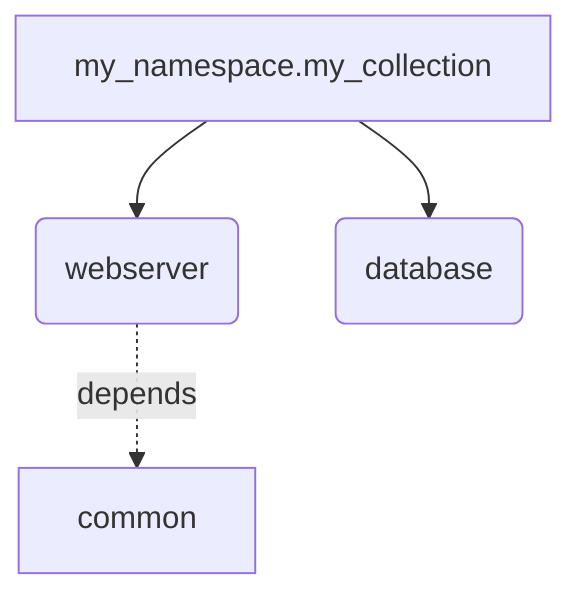
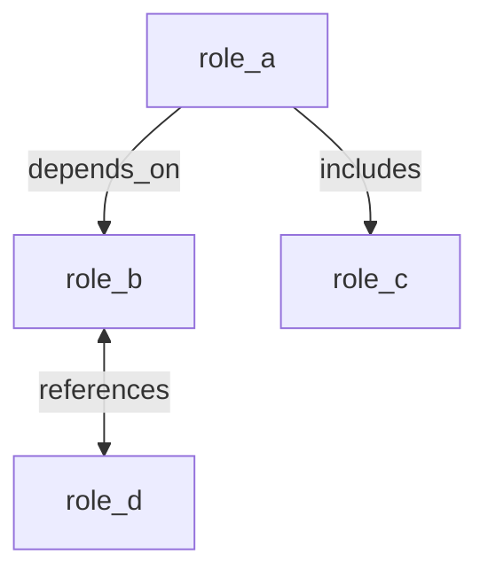
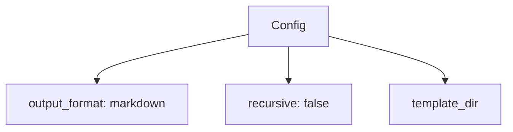

# Ansible Doctor Enhanced

<!-- Version & License -->
[](https://github.com/K4M1coder/ansible-doctor-enhanced/releases)
[](LICENSE)

<!-- Language Version & Code Quality Tools -->
[](https://www.python.org/downloads/)
[](https://github.com/psf/black)
[](https://pycqa.github.io/isort/)
[](https://github.com/astral-sh/ruff)
[](http://mypy-lang.org/)

<!-- Coverage & Test Results -->
[](https://github.com/K4M1coder/ansible-doctor-enhanced/actions)
[](https://github.com/K4M1coder/ansible-doctor-enhanced/actions)
[](https://github.com/K4M1coder/ansible-doctor-enhanced/actions)
[](https://github.com/K4M1coder/ansible-doctor-enhanced/actions)
[](https://github.com/K4M1coder/ansible-doctor-enhanced/actions)
[](https://github.com/K4M1coder/ansible-doctor-enhanced/actions)

<!-- Build & CI Status -->
[](https://github.com/K4M1coder/ansible-doctor-enhanced/actions/workflows/pre-commit.yml)
[](https://github.com/K4M1coder/ansible-doctor-enhanced/actions/workflows/ci-windows.yml)
[](https://github.com/K4M1coder/ansible-doctor-enhanced/actions/workflows/badges.yml)

<!-- 
📊 Dynamic Badge Setup Available!
To enable auto-updating badges with live metrics (coverage %, mypy errors, test counts):
1. Follow setup guide: BADGE_SETUP_QUICKSTART.md
2. Replace static badges above with dynamic versions from docs/BADGES.md
3. Badges will auto-update after each CI run with real-time stats
-->

---


> A modernized fork of ansible-doctor with enhanced logging, error handling, documentation generation, and reporting capabilities built on KISS, SMART, and SOLID principles.

## 🎯 Project Description

Ansible Doctor Enhanced is a comprehensive tool for automatically generating documentation from any Ansible project collection role plugins modules and inventory. It parses role structures, extracts metadata, variables, task tags, and inline annotations to produce high-quality, structured documentation in multiple formats. Built with specification-driven development using GitHub spec-kit methodology.

## 📑 Table of Contents

<!-- toc -->

- [🎯 Project Description](#-project-description)
- [✨ Key Features](#-key-features)
- [📦 Ansible Collection Support (New in v0.5.0)](#-ansible-collection-support-new-in-v050)
  - [Parse Collection Metadata](#parse-collection-metadata)
  - [Generate Collection Documentation](#generate-collection-documentation)
  - [Analyze Role Dependencies](#analyze-role-dependencies)
- [📊 Project Documentation Support (New in v0.6.0)](#-project-documentation-support-new-in-v060)
  - [Generate Project Documentation](#generate-project-documentation)
  - [Parse Project Structure](#parse-project-structure)
- [📑 Index Generation & Navigation (New in v0.5.0)](#-index-generation--navigation-new-in-v050)
  - [Generate Indexes](#generate-indexes)
  - [Filter Indexes](#filter-indexes)
  - [Embedded Section Indexes](#embedded-section-indexes)
- [🔗 Links & Cross-References (New in v0.12.0)](#-links--cross-references-new-in-v0120)
  - [Automatic Cross-References](#automatic-cross-references)
  - [Link Validation](#link-validation)
  - [External Resource Integration](#external-resource-integration)
  - [Index-Based Navigation](#index-based-navigation)
  - [Section Navigation](#section-navigation)
  - [Link Health Reporting](#link-health-reporting)
  - [Bidirectional Relationships](#bidirectional-relationships)
- [🌐 Internationalization (i18n) Support (New in v0.5.1)](#-internationalization-i18n-support-new-in-v051)
  - [Language Configuration](#language-configuration)
  - [Generate Multi-Language Documentation](#generate-multi-language-documentation)
  - [Custom Translations](#custom-translations)
  - [Template Translation Markers](#template-translation-markers)
- [🔍 Schema Validation & Documentation (New in v0.5.0)](#-schema-validation--documentation-new-in-v050)
  - [Configuration Validation](#configuration-validation)
  - [Schema Export](#schema-export)
  - [Format Conversion](#format-conversion)
  - [Data Model Validation](#data-model-validation)
  - [Schema Documentation](#schema-documentation)
- [🏗️ Architecture](#-architecture)
  - [Core Components](#core-components)
  - [Design Principles](#design-principles)
  - [Data Flow](#data-flow)
  - [Key Patterns](#key-patterns)
- [🚀 Installation](#-installation)
  - [Prerequisites](#prerequisites)
  - [From Source (Development)](#from-source-development)
- [⚙️ Configuration](#-configuration)
  - [Configuration File (`.ansibledoctor.yml`)](#configuration-file-ansibledoctoryml)
  - [Configuration Commands](#configuration-commands)
  - [Environment Variables](#environment-variables)
- [CI/CD Integration](#cicd-integration)
  - [Exit Codes](#exit-codes)
  - [Using in CI/CD Pipelines](#using-in-cicd-pipelines)
  - [Execution Reports](#execution-reports)
  - [Correlation IDs](#correlation-ids)
- [📚 Documentation](#-documentation)
- [🏗️ Project Architecture](#-project-architecture)
- [🛠️ Development](#-development)
  - [Setup Development Environment](#setup-development-environment)
  - [Running Tests](#running-tests)
  - [Running Tests](#running-tests-1)
- [🤝 Contributing](#-contributing)
- [📊 Project Status](#-project-status)
- [🔄 Version Compatibility](#-version-compatibility)
- [📊 Project Status](#-project-status-1)
  - [Test Metrics](#test-metrics)
  - [Completed Features](#completed-features)
    - [✅ Core Functionality (MVP)](#-core-functionality-mvp)
    - [🎯 Roadmap to v1.0.0](#-roadmap-to-v100)
- [📄 License](#-license)
- [🙏 Acknowledgments](#-acknowledgments)
- [📞 Support & Contact](#-support--contact)

<!-- tocstop -->

## ✨ Key Features

- **Test-Driven Development (TDD)**: Mandatory Red-Green-Refactor cycle with 80%+ code coverage
- **Domain-Driven Design (DDD)**: Ubiquitous Language from Ansible domain, Bounded Contexts, rich domain models
- **Intelligent Role Parsing**: Extract metadata from `meta/main.yml`, variables from `defaults/` and `vars/`, task tags, and inline documentation annotations
- **Annotation System**: Support for `@var`, `@tag`, `@todo`, `@example`, and `@meta` annotations with multiple formats (single-line, multiline, JSON)
- **Collection Support (v0.5.0)**: Parse, generate documentation, and analyze dependencies for Ansible Collections
- **Project Documentation (v0.6.0)**: Generate comprehensive project-level documentation with architecture diagrams, role/collection inventories, and multi-language support
- **Internationalization (v0.5.1)**: Initial i18n support with translation files for English, French and German and a Jinja2 `t()` filter for templates
- **Links & Cross-References (v0.12.0)**: Smart link management with automatic cross-references, broken link detection, external resource integration, and multiple navigation indexes
- **Code Quality & CI/CD (v0.14.0)**: Advanced quality gates with 16 dynamic badges, performance telemetry, and strict atomic commit validation
- **Structured Logging**: Advanced observability with structured logging, correlation IDs, and performance metrics
- **Error Handling**: Graceful error recovery with actionable suggestions and detailed context
- **Multiple Output Formats**: Generate documentation in Markdown, HTML, reStructuredText, and custom templates
- **CLI-First Design**: Scriptable command-line interface with JSON output for pipeline integration
- **Type-Safe**: Full type hints with mypy strict mode validation
- **Constitutional Governance**: 10 core principles ensuring quality, maintainability, and SOLID architecture

## 📦 Ansible Collection Support (New in v0.5.0)

Ansible Doctor Enhanced now provides comprehensive support for **Ansible Collections** with three powerful commands:

### Parse Collection Metadata

Extract and validate collection metadata from `galaxy.yml`:

```bash
# Parse collection metadata
poetry run ansible-doctor-enhanced collection parse ./my_namespace.my_collection

# Output to JSON file
poetry run ansible-doctor-enhanced collection parse ./my_namespace.my_collection --output metadata.json --pretty
```

### Generate Collection Documentation

Create professional README.md for your collection:

```bash
# Generate Markdown documentation (default)
# Output: docs/lang/en/collection_namespace.name/README.md
poetry run ansible-doctor-enhanced collection generate ./my_namespace.my_collection

# Generate HTML documentation
poetry run ansible-doctor-enhanced collection generate ./my_namespace.my_collection --format html

# Use legacy output structure (docs/README.md)
poetry run ansible-doctor-enhanced collection generate ./my_namespace.my_collection --legacy-output

# Use custom template
poetry run ansible-doctor-enhanced collection generate ./my_namespace.my_collection --template custom.md.j2
```

### Analyze Role Dependencies

Visualize and validate role dependencies within collections:

```bash
# Show dependency tree (ASCII)
poetry run ansible-doctor-enhanced collection analyze ./my_namespace.my_collection --show-dependencies

# Check for circular dependencies (CI/CD)
poetry run ansible-doctor-enhanced collection analyze ./my_namespace.my_collection --check-circular

# Export to Mermaid diagram
poetry run ansible-doctor-enhanced collection analyze ./my_namespace.my_collection --show-dependencies --output-format mermaid
```

**Example Output**:

```
Dependency Graph (TEXT format):
============================================================
└── database
    └── application
        └── webserver
```

**Features**:

- ✅ Parse `galaxy.yml` metadata (namespace, name, version, dependencies)
- ✅ Discover roles and plugins automatically
- ✅ Generate comprehensive collection README with installation instructions
- ✅ Detect circular role dependencies
- ✅ Export dependency graphs (ASCII tree, JSON, Mermaid)
- ✅ Multiple output formats (Markdown, HTML, RST)

**Documentation**: See [COLLECTION_GUIDE.md](docs/COLLECTION_GUIDE.md) for comprehensive usage guide with examples.

**Demo**: Try the included demo collection at `demo/demo_namespace.demo_collection/`

## 📊 Project Documentation Support (New in v0.6.0)

Ansible Doctor Enhanced now provides comprehensive **Project-level Documentation** generation with architecture visualization and multi-language support:

### Generate Project Documentation

Create professional project README with architecture diagrams and component inventories:

```bash
# Generate Markdown documentation (default)
poetry run ansible-doctor-enhanced project generate ./

# Generate HTML documentation
poetry run ansible-doctor-enhanced project generate ./ --format html

# Generate multi-language documentation
poetry run ansible-doctor-enhanced project generate ./ --languages en,fr,de

# Use legacy output path (for migration from older versions)
poetry run ansible-doctor-enhanced project generate ./ --legacy-output

# Use custom template
poetry run ansible-doctor-enhanced project generate ./ --template custom.md.j2

# Specify output directory
poetry run ansible-doctor-enhanced project generate ./ --output docs/
```

### Parse Project Structure

Extract and analyze project metadata, roles, collections, playbooks, and inventory:

```bash
# Parse project structure
poetry run ansible-doctor-enhanced project parse ./

# Output to JSON file
poetry run ansible-doctor-enhanced project parse ./ --output project.json --pretty
```

**Features**:

- ✅ Parse `ansible.cfg`, inventory files, playbooks, roles, and collections
- ✅ Generate project README with Mermaid architecture diagrams
- ✅ Multi-language documentation support with i18n
- ✅ Automatic slug-based output paths (`docs/ansibleproject_{projectname}/`)
- ✅ Multiple output formats (Markdown, HTML, RST)
- ✅ Custom template support

## 📑 Index Generation & Navigation (New in v0.5.0)

Ansible Doctor Enhanced provides comprehensive **Index Generation** with multiple visualization formats, filtering capabilities, and embedded section indexes:

### Generate Indexes

Create professional index pages for roles, plugins, and collections:

```bash
# List format (default) - Bulleted list with descriptions
ansible-doctor-enhanced collection generate ./my_collection --include-index

# Table format - Compact table view
ansible-doctor-enhanced collection generate ./my_collection \
    --include-index --index-style table

# Tree format - Hierarchical structure with ASCII art
ansible-doctor-enhanced collection generate ./my_collection \
    --include-index --index-style tree --index-depth 3

# Nested table - Collections with inline children display
ansible-doctor-enhanced collection generate ./my_collection \
    --include-index --index-style nested-table --nested-depth 2

# Mermaid diagram - Visual flowchart with clickable nodes
ansible-doctor-enhanced collection generate ./my_collection \
    --include-index --index-style diagram
```

### Filter Indexes

Filter components by tag, namespace, type, or custom metadata:

```bash
# Single filter - Show only web-tagged components
ansible-doctor-enhanced collection generate ./my_collection \
    --include-index --index-style table \
    --filter 'tag:web'

# Multiple filters - AND logic (all must match)
ansible-doctor-enhanced collection generate ./my_collection \
    --include-index --index-style table \
    --filter 'tag:web' \
    --filter 'namespace:my_namespace'

# Filter by type
ansible-doctor-enhanced collection generate ./my_collection \
    --include-index --filter 'type:role'
```

### Embedded Section Indexes

Use `{{ index() }}` function in Jinja2 templates to embed indexes anywhere:

```jinja
## Available Roles

{{ index('roles', format='table') }}

## Web Infrastructure (Top 5)

{{ index('roles', format='list', filter='tag:web', limit=5) }}

## Plugins by Type

{{ index('plugins', format='table', group_by='metadata.plugin_type') }}
```

**Features**:

- ✅ **5 Index Formats**: list, table, tree, nested-table, diagram (Mermaid)
- ✅ **Hierarchical Organization**: Collections → Roles/Plugins/Playbooks
- ✅ **Embedded Sections**: `{{ index() }}` function for inline indexes
- ✅ **Advanced Filtering**: Filter by tag, namespace, type, metadata
- ✅ **Visual Diagrams**: Mermaid flowcharts and mindmaps with clickable nodes
- ✅ **Nested Tables**: Inline display of children with role/plugin counts
- ✅ **50+ Tests**: Comprehensive test coverage with TDD approach

**Example Output**:

**List Format:**

```markdown
# Roles Index

## [webserver](docs/roles/webserver.md)

Deploy and configure a web server with Nginx or Apache.

**Tags:** `web`, `nginx`, `apache`

**Dependencies:** common, firewall

---

## [database](docs/roles/database.md)

Deploy PostgreSQL or MySQL database servers.

**Tags:** `database`, `postgres`, `mysql`
```

**Tree Format:**

```
Collection: my_namespace.my_collection
├── Role: webserver (tags: web, nginx)
│   ├── Dependencies: common, firewall
│   └── Used by: app_server
├── Role: database (tags: database, postgres)
└── Plugin: web_config (type: module)
```

**Nested Table Format:**

```markdown
| Collection | Namespace | Roles | Plugins | Description |
|------------|-----------|-------|---------|-------------|
| [my_collection](docs/index.md) | my_namespace | 5 | 8 | Web infrastructure |
| ↳ **Roles:** | | webserver, database, cache | | |
| ↳ **Plugins:** | | web_config, db_backup | | |
```

**Mermaid Diagram:**

````markdown

````

**Documentation**: See [INDEX_GUIDE.md](docs/INDEX_GUIDE.md) for comprehensive usage guide with examples.

**CLI Reference**:

- `--include-index`: Enable index generation
- `--index-style`: Format (list, table, tree, nested-table, diagram)
- `--index-format`: Page format (full, section)
- `--index-depth`: Maximum tree depth (default: 5)
- `--nested-depth`: Nesting depth for nested-table (default: 2)
- `--filter`: Filter by field:value (multiple allowed)

**Documentation**: See [PROJECT_COMPLETION.md](PROJECT_COMPLETION.md) for comprehensive usage guide.

**Demo**: Try the included demo project at `demo-role/` or `test-role/`

## 🔗 Links & Cross-References (New in v0.12.0)

Ansible Doctor Enhanced provides comprehensive **Link Management** with automatic cross-reference generation, broken link detection, and intelligent navigation features:

### Automatic Cross-References

Links are automatically generated between related documentation:

```bash
# Generate documentation with automatic cross-references
ansible-doctor-enhanced role ./my_role --output ./docs

# Links are generated for:
# - Dependencies (roles that this role depends on)
# - Parent collection (link back to collection)
# - Related roles (by tags or functionality)
# - Project context (breadcrumb navigation)
```

**Generated Links Include**:

```markdown
## Dependencies

- [common](../common/README.md)
- [database](../database/README.md)

**Part of Collection**: [namespace.collection](../../README.md)

## Related Roles

- [nginx](../nginx/README.md) - Web server configuration
- [haproxy](../haproxy/README.md) - Load balancer setup
```

### Link Validation

Validate all links in your documentation to catch broken links before deployment:

```bash
# Validate all links (internal + external)
ansible-doctor linkcheck ./docs

# Internal links only (fast)
ansible-doctor linkcheck ./docs --internal-only

# External links only (with caching)
ansible-doctor linkcheck ./docs --external-only

# JSON output for CI/CD
ansible-doctor linkcheck ./docs --format json --output validation.json

# Validate during generation
ansible-doctor role ./my_role --output ./docs --validate-links
```

**CI/CD Integration**:

```yaml
# .github/workflows/docs.yml
- name: Validate Documentation Links
  run: |
    ansible-doctor linkcheck ./docs --format json
    if [ $? -ne 0 ]; then
      echo "❌ Broken links detected!"
      exit 1
    fi
```

**Exit Codes**:

- `0`: All links valid ✅
- `1`: Broken links found ❌
- `2`: Validation error occurred ⚠️

### External Resource Integration

Automatically link to official Ansible documentation and Galaxy:

```bash
# Enable external link integration
ansible-doctor role ./my_role --output ./docs
```

**Automatic Links Generated For**:

- **Module Documentation**: `ansible.builtin.apt` → <https://docs.ansible.com/ansible/latest/collections/ansible/builtin/apt_module.html>
- **Galaxy Pages**: Collections → <https://galaxy.ansible.com/namespace/collection>
- **Best Practices**: Keywords like "security", "vault", "molecule" link to official guides
- **Version-Specific**: Uses configured Ansible version (e.g., `/ansible/2.15/`)

**Configuration**:

```yaml
# .ansibledoctor.yml
ansible_version: "2.15"

external_links:
  enable_module_docs: true
  enable_galaxy_links: true
  enable_best_practices: true
  ansible_docs_base: "https://docs.ansible.com"
  galaxy_base: "https://galaxy.ansible.com"
```

### Index-Based Navigation

Multiple pathways to discover content:

```bash
# Generate documentation with indexes
ansible-doctor collection ./my_collection --output ./docs
```

**Generated Indexes**:

- **Alphabetical Index**: Group by first letter (A-Z, #)
- **Category Index**: Group by type (role, module, plugin)
- **Tag Index**: Group by tags with popularity sorting
- **Search Index**: Full-text search with relevance scoring

**Tag Navigation Example**:

```markdown
# Tags

## webserver (5 items)
- [apache](./apache/README.md) *role*
- [nginx](./nginx/README.md) *role*
- [haproxy](./haproxy/README.md) *role*

## database (3 items)
- [postgres](./postgres/README.md) *role*
- [mysql](./mysql/README.md) *role*

**Tags**: [`webserver`](../tags.md#tag-webserver), [`production`](../tags.md#tag-production)
```

### Section Navigation

Table of contents with anchor links for long documents:

```bash
# TOC automatically generated for documents with 5+ headings
ansible-doctor role ./my_role --output ./docs
```

**Generated TOC**:

```markdown
## Table of Contents

- [Overview](#overview)
- [Installation](#installation)
  - [Requirements](#requirements)
  - [Dependencies](#dependencies)
- [Configuration](#configuration)
- [Usage](#usage)
```

**Features**:

- ✅ Automatic TOC generation for long documents
- ✅ Nested structure support (H2-H6)
- ✅ URL-safe anchor slugs
- ✅ Duplicate heading handling
- ✅ Mobile-responsive HTML TOC

### Link Health Reporting

Generate comprehensive link health reports:

```bash
# Markdown report
ansible-doctor linkreport ./docs --format markdown --output report.md

# HTML report with all links
ansible-doctor linkreport ./docs --format html --include-valid --output report.html

# JSON report grouped by file
ansible-doctor linkreport ./docs --format json --group-by file
```

**Report Includes**:

- Valid links count with ✅ indicator
- Warning links (redirects, slow responses)
- Broken links with file:line locations
- HTTP status codes for external links
- Suggested fixes for common issues

### Bidirectional Relationships

Track "links to" and "linked by" relationships:

```bash
# Generate documentation with relationship tracking
ansible-doctor collection ./my_collection --output ./docs
```

**Relationship Visualization**:



**Features**:

- ✅ **Automatic Cross-References**: Links between related roles/collections/projects
- ✅ **Broken Link Detection**: Internal and external link validation
- ✅ **External Integration**: Official Ansible docs and Galaxy links
- ✅ **Multiple Indexes**: Alphabetical, category, tag, and search indexes
- ✅ **Section Navigation**: Auto-generated table of contents
- ✅ **Link Caching**: External link validation caching (< 30s for 1000+ docs)
- ✅ **Relationship Tracking**: Bidirectional "links to" / "linked by"
- ✅ **CI/CD Ready**: JSON output, exit codes, automated validation

**CLI Commands**:

- `ansible-doctor linkcheck`: Validate all links
- `ansible-doctor linkreport`: Generate link health report
- `ansible-doctor linkfix`: Interactive broken link fixing (coming soon)

**Documentation**: See [LINKS_GUIDE.md](docs/LINKS_GUIDE.md) for comprehensive usage guide with examples.

**Configuration**: See `.ansibledoctor.yml` for external link configuration options.

## 🌐 Internationalization (i18n) Support (New in v0.5.1)

Ansible Doctor Enhanced supports multi-language documentation generation through a translation system. Generate documentation in multiple languages from a single codebase with YAML-based translation files.

### Language Configuration

Configure language settings in `.ansibledoctor.yml`:

```yaml
# .ansibledoctor.yml
languages:
  default: en              # Default language
  enabled:                 # Languages to generate
    - en
    - fr
    - de
  fallback: en            # Fallback when translation missing
```

### Generate Multi-Language Documentation

```bash
# Generate project docs in multiple languages
poetry run ansible-doctor-enhanced project generate ./ --languages en,fr,de

# Generate in a single language
poetry run ansible-doctor-enhanced project generate ./ --language fr

# Output structure:
# docs/
# └── lang/
#     ├── en/README.md
#     ├── fr/README.md
#     └── de/README.md
```

### Custom Translations

Override default translations by creating custom translation files in your project:

```
.ansibledoctor/
└── translations/
    ├── en.yml    # English overrides
    ├── fr.yml    # French overrides
    └── de.yml    # German overrides
```

Translation file format:

```yaml
# translations/fr.yml
overview:
  title: "Aperçu"
  description: "Description du rôle"
variables:
  title: "Variables"
  required: "Variables Requises"
  optional: "Variables Optionnelles"
```

### Template Translation Markers

Use the `t()` filter in custom templates for translatable strings:

```jinja2
{# Using translation in templates #}
## {{ t('overview.title') }}

{{ t('overview.description') }}

{# With variable substitution #}
{{ t('install.version', version='1.0.0') }}

{# Pluralization support #}
{{ t('items.count', count=5) }}
```

**Supported Languages**: English (en), French (fr), German (de) - extensible with custom translation files.

## 🔍 Schema Validation & Documentation (New in v0.5.0)

Ansible Doctor Enhanced provides comprehensive **Schema Validation, Export, Conversion, and Documentation** capabilities for configuration files, data models, and documentation workflows.

### Configuration Validation

Validate `.ansibledoctor.yml` files against JSON Schema:

```bash
# Basic validation
ansible-doctor-enhanced schema validate .ansibledoctor.yml

# Strict mode (warnings as errors)
ansible-doctor-enhanced schema validate .ansibledoctor.yml --strict

# Verbose output with suggestions
ansible-doctor-enhanced schema validate .ansibledoctor.yml --verbose
```

**Example Output**:

```
✗ Configuration validation failed
  1 error(s):
    - output_format: Input should be 'markdown', 'html' or 'rst'
      Suggestion: Use one of the allowed values: markdown, html, rst
```

### Schema Export

Export JSON Schema definitions for IDE integration:

```bash
# Export to stdout
ansible-doctor-enhanced schema export config

# Export to file
ansible-doctor-enhanced schema export config --output config-schema.json

# OpenAPI format
ansible-doctor-enhanced schema export config --format openapi --output openapi.yaml
```

**IDE Integration** - Enable autocomplete and validation in VS Code:

```json
// .vscode/settings.json
{
  "yaml.schemas": {
    "./config-schema.json": ".ansibledoctor.yml"
  }
}
```

### Format Conversion

Convert configuration files between YAML, JSON, XML, and Mermaid:

```bash
# YAML to JSON (pretty)
ansible-doctor-enhanced schema convert .ansibledoctor.yml --to json --pretty

# YAML to XML
ansible-doctor-enhanced schema convert .ansibledoctor.yml --to xml --output config.xml

# Generate Mermaid diagram
ansible-doctor-enhanced schema convert .ansibledoctor.yml --to mermaid --output diagram.mmd
```

**Mermaid Output Example**:



### Data Model Validation

Validate role and collection data against pydantic models:

```bash
# Validate role data
ansible-doctor-enhanced schema validate-model role role_data.yml

# Validate collection metadata
ansible-doctor-enhanced schema validate-model collection galaxy.yml

# Strict mode (warnings as errors)
ansible-doctor-enhanced schema validate-model role role.yml --strict-validation
```

**Example Validation**:

```
✓ Role data is valid
  1 warning(s):
    - metadata.description: Description is recommended but missing or empty
```

### Schema Documentation

Generate human-readable Markdown documentation from JSON Schema:

```bash
# Generate to stdout
ansible-doctor-enhanced schema docs config

# Save to file
ansible-doctor-enhanced schema docs config --output schema-docs.md
```

**Generated Documentation Example**:

```markdown
# ConfigModel

Configuration model for .ansibledoctor.yml files.

## Properties

### `output_format` *(required)*

**Type**: `string`

Documentation format (markdown, html, or rst).

**Allowed values**:
- `markdown`
- `html`
- `rst`

**Default**: `markdown`
```

**Features**:

- ✅ **Configuration Validation**: Validate `.ansibledoctor.yml` with strict mode
- ✅ **Schema Export**: JSON Schema Draft 2020-12 for IDE integration
- ✅ **Format Conversion**: YAML ↔ JSON ↔ XML ↔ Mermaid
- ✅ **Data Model Validation**: Validate roles and collections with pydantic
- ✅ **Schema Documentation**: Generate Markdown from JSON Schema
- ✅ **IDE Autocomplete**: VS Code, IntelliJ IDEA, PyCharm integration
- ✅ **Strict Mode**: Treat warnings as errors for CI/CD
- ✅ **Verbose Output**: Detailed error messages with suggestions

**Documentation**: See [SCHEMA_GUIDE.md](docs/SCHEMA_GUIDE.md) for comprehensive usage guide.

**CLI Commands**:

- `schema validate` - Validate configuration files
- `schema export` - Export JSON Schema definitions
- `schema convert` - Convert between formats
- `schema validate-model` - Validate data models
- `schema docs` - Generate schema documentation

## 🏗️ Architecture

Ansible Doctor Enhanced follows **Domain-Driven Design (DDD)** principles with clean architecture:

### Core Components

```
ansibledoctor/
├── models/           # Domain Models (DDD Value Objects & Entities)
│   ├── annotation.py    - Annotation value objects (@var, @tag, @todo, @example, @meta)
│   ├── metadata.py      - Role metadata entity (author, platforms, dependencies)
│   ├── variable.py      - Variable value object (name, type, value, annotations)
│   ├── tag.py           - Task tag value object
│   └── role.py          - Aggregate root combining all role information
├── parser/           # Domain Services (Anti-Corruption Layer)
│   ├── annotation_extractor.py  - Extract annotations from YAML comments
│   ├── metadata_parser.py       - Parse meta/main.yml into Metadata entity
│   ├── variable_parser.py       - Parse defaults/vars with type inference
│   ├── yaml_loader.py           - YAML loading abstraction (ruamel.yaml)
│   └── protocols.py             - Parser protocols (interfaces)
├── generator/        # Documentation Generation (NEW in v0.3.0)
│   ├── engine.py        - Jinja2 template engine with custom filters
│   ├── loaders.py       - Template loaders (filesystem, embedded)
│   ├── renderers.py     - Format-specific renderers (Markdown, HTML, RST)
│   ├── validator.py     - Template validation and variable checking
│   ├── filters.py       - Custom Jinja2 filters (rst_escape, code_block, etc.)
│   ├── models.py        - Generation models (TemplateContext, RenderResult)
│   ├── templates/       - Default templates for all output formats
│   └── protocols.py     - Generator protocols (TemplateLoader interface)
├── cli/              # Application Layer (CLI Interface)
│   └── __init__.py      - Click-based CLI with parse command
├── utils/            # Infrastructure Layer (Cross-cutting concerns)
│   ├── logging.py       - Structured logging with correlation IDs
│   └── paths.py         - Path validation and role structure checks
└── exceptions.py     # Domain Exceptions (AnsibleDoctorError hierarchy)
```

### Design Principles

1. **Immutability**: All domain models are frozen Pydantic models (value objects)
2. **Ubiquitous Language**: Terminology from Ansible domain (role, variable, meta, defaults, handlers)
3. **Bounded Contexts**: Clear separation between parsing (input) and generation (output - Phase 2)
4. **Type Safety**: 100% type hints with mypy --strict validation
5. **Testability**: Protocol-based design enabling dependency injection and mocking

### Data Flow

```
Role Directory → YAMLLoader → Parsers → Domain Models → CLI Output (JSON/Text)
                    ↓            ↓           ↓
                  YAML     Annotations  Immutable
                 Content    Extraction   Entities
```

### Key Patterns

- **Parser Protocol**: Abstract interface for all parsers (metadata, variable, tag)
- **Value Objects**: Annotation, Variable, Tag (immutable, equality by value)
- **Entity**: Metadata (identity by role name)
- **Aggregate Root**: Role (composition of metadata + variables + tags)
- **Anti-Corruption Layer**: Parsers shield domain from YAML library changes

## 🚀 Installation

### Prerequisites

- Python 3.11 or higher
- Poetry (for development)

### From Source (Development)

```bash
# Clone the repository
git clone https://github.com/yourusername/ansible-doctor-enhanced.git
cd ansible-doctor-enhanced

# Install with Poetry
poetry install

# Activate virtual environment
poetry shell
```

Alternatively, if you prefer to run directly from the source without relying on Poetry,
install the package into a local editable venv (makes the console script available):

```powershell
# Windows PowerShell (from repo root)
python -m venv .venv
.venv\Scripts\Activate.ps1
python -m pip install -e .
# Now the command `ansible-doctor-enhanced` is available
ansible-doctor-enhanced --help
```

Or invoke the module directly:

```powershell
python -m ansibledoctor -- --help
```

```

### From PyPI (Coming Soon)

```bash
pip install ansible-doctor-enhanced
```

### Publish to PyPI (outline)

When you are ready to publish, we recommend creating a new release and uploading to the Python Package Index. A simple release flow (with Poetry) is:

```bash
# Build distribution files
poetry build

# Publish to PyPI (use Poetry's publish or twine)
# poetry publish --username <user> --password <pass>  # or configure Poetry auth
# or using twine:
python -m pip install build twine
python -m build
python -m twine upload dist/*
```

Notes:

- Make sure `tool.poetry.name` in `pyproject.toml` is set to the package name you want on PyPI (e.g., `ansible-doctor-enhanced`).
- Configure release version in `pyproject.toml` and update `CHANGELOG.md` before publishing.
- Use `test.pypi.org` to test the upload before publishing to production PyPI.

## 🏃 Quick Start

Parse an Ansible role and generate documentation:

```bash
# Parse a single role
ansible-doctor-enhanced parse --role-path ./my-ansible-role --output role-docs.json

# Parse with structured logging
ansible-doctor-enhanced parse --role-path ./my-ansible-role --log-level INFO

# Recursive parsing
ansible-doctor-enhanced parse --role-path ./roles/ --recursive

# Generate Markdown documentation
ansible-doctor-enhanced generate --input role-docs.json --output README.md --template readme
```

**Example Output:**

```json
{
  "name": "my-role",
  "metadata": {
    "author": "John Doe",
    "description": "Configures web server",
    "license": "MIT"
  },
  "variables": [
    {
      "name": "web_port",
      "value": 80,
      "type": "number",
      "description": "HTTP port for web server"
    }
  ],
  "tags": [
    {
      "name": "installation",
      "description": null,
      "usage_count": 3,
      "file_locations": ["tasks/main.yml:5", "tasks/install.yml:2"]
    },
    {
      "name": "configuration",
      "description": null,
      "usage_count": 2,
      "file_locations": ["tasks/main.yml:15", "tasks/configure.yml:1"]
    }
  ],
  "todos": [
    {
      "description": "Add SSL certificate validation",
      "file_path": "tasks/main.yml",
      "line_number": 42,
      "priority": "high"
    }
  ],
  "examples": [
    {
      "title": "Basic web server setup",
      "code": "web_port: 8080\nweb_ssl_enabled: true",
      "description": null,
      "language": "yaml"
    }
  ],
  "handlers": [
    {
      "name": "restart nginx",
      "tags": ["restart", "service"],
      "listen": ["nginx config changed"],
      "file_path": "handlers/main.yml",
      "line_number": 3
    },
    {
      "name": "reload nginx",
      "tags": ["reload"],
      "listen": ["nginx config updated"],
      "file_path": "handlers/main.yml",
      "line_number": 8
    }
  ],
  "existing_docs": {
    "readme_content": "# My Ansible Role\n\nConfigures web server...",
    "readme_format": "markdown",
    "changelog_content": "## [1.0.0] - 2025-01-01\n\n### Added\n- Initial release",
    "contributing_content": "# Contributing Guide\n\nPlease follow...",
    "license_content": "MIT License\n\nCopyright (c) 2025...",
    "license_type": "MIT",
    "templates_list": ["nginx.conf.j2", "vhost.conf.j2"],
    "files_list": ["index.html", "favicon.ico"]
  }
}
```

## 🎨 Theming & Customization (New in v0.8.0)

ansible-doctor-enhanced supports comprehensive theming for HTML documentation output.

### Template Variants

Choose from three built-in variants:

```bash
# Minimal - compact essential info
ansible-doctor role ./my-role --variant minimal --format html

# Detailed - full documentation (default)
ansible-doctor role ./my-role --variant detailed --format html

# Modern - contemporary card-based styling
ansible-doctor role ./my-role --variant modern --format html
```

### CSS Customization

Apply custom CSS via external URL or inline styles:

```bash
# External CSS theme
ansible-doctor role ./my-role --css-url https://cdn.example.com/theme.css

# Inline CSS overrides
ansible-doctor role ./my-role --css-inline ":root { --ad-color-primary: #dc2626; }"
```

### Dark Mode Toggle

Add a theme toggle button for dark/light mode:

```bash
ansible-doctor role ./my-role --format html --theme-toggle
```

Features:

- ✅ Respects `prefers-color-scheme` system preference
- ✅ Persists user choice to `localStorage`
- ✅ ARIA attributes for accessibility

### Color Schemes

```bash
# Force light/dark mode
ansible-doctor role ./my-role --color-scheme light
ansible-doctor role ./my-role --color-scheme dark

# Auto (respects OS preference - default)
ansible-doctor role ./my-role --color-scheme auto
```

### Configuration File

```yaml
# .ansibledoctor.yml
theme:
  variant: modern
  color_scheme: auto
  css_url: https://example.com/theme.css
  toggle_enabled: true
```

**Documentation:** See [TEMPLATE_GUIDE.md](docs/TEMPLATE_GUIDE.md) for CSS variables, custom templates, and advanced theming.

**Demo:** Try demo templates at `demo/templates/` and CSS examples at `demo/css/`.

## 📖 Usage

### Library API (Phase 2 Complete)

```python
from pathlib import Path
from ansibledoctor.parser import MetadataParser, RuamelYAMLLoader

# Initialize parser
yaml_loader = RuamelYAMLLoader()
metadata_parser = MetadataParser(yaml_loader)

# Parse role metadata
role_meta_dir = Path("/path/to/ansible-role/meta")
metadata = metadata_parser.parse_metadata(role_meta_dir)

# Access parsed metadata
print(f"Author: {metadata.author}")
print(f"License: {metadata.license}")
print(f"Platforms: {metadata.get_supported_platforms_summary()}")
print(f"Has dependencies: {metadata.has_dependencies()}")
```

### Generator API (Phase 9 Foundation Complete - NEW in v0.3.0)

```python
from pathlib import Path
from datetime import datetime
from ansibledoctor.generator import (
    TemplateEngine,
    TemplateContext,
    OutputFormat,
    TemplateValidator,
)
from ansibledoctor.models import Role

# Create template engine with custom template directory
engine = TemplateEngine.create(
    template_dir="/path/to/templates",
    auto_reload=True  # Reload templates on change
)

# Validate template before rendering
validator = TemplateValidator(engine.environment)
template_source = Path("templates/custom.j2").read_text()
result = validator.validate_template(
    template_source,
    required_vars={"role", "generator_version"}
)
if not result["valid"]:
    print(f"Template errors: {result['errors']}")

# Create rendering context
context = TemplateContext(
    role=role_obj,  # Parsed Role object
    generator_version="0.3.0",
    generation_date=datetime.now(),
    output_format=OutputFormat.MARKDOWN,
)

# Load and render template
template = engine.get_template("markdown/role.j2")
content = template.render(**context.to_dict())

# Write to file
output_path = Path("README.md")
output_path.write_text(content, encoding="utf-8")
```

### Template Validation

```python
from ansibledoctor.generator import TemplateValidator, TemplateEngine

engine = TemplateEngine.create()
validator = TemplateValidator(engine.environment)

# Validate template syntax
try:
    validator.validate_syntax(
        "{{ role.name | upper }}",
        template_name="custom.j2"
    )
except TemplateValidationError as e:
    print(f"Syntax error: {e}")

# Check for undeclared variables
template_source = "{{ role.name }} by {{ role.metadata.author }}"
vars_used = validator.get_undeclared_variables(template_source)
print(f"Variables used: {vars_used}")  # {'role'}

# Validate required variables are present
validator.validate_required_variables(
    template_source,
    required_vars={"role"},
    ## 📌 Changelog & Versioning

    This project follows [Keep a Changelog](https://keepachangelog.com/en/1.1.0/) conventions and adheres to [Semantic Versioning (SemVer)](https://semver.org/spec/v2.0.0.html). See the `CHANGELOG.md` file for the latest and historical release notes.

    ## 📜 License

    This repository is distributed under the Apache License 2.0 with additional Commons Clause restrictions. See `LICENSE` for full terms and conditions.

    template_name="custom.j2"
)

# Comprehensive validation
result = validator.validate_template(
    template_source,
    template_name="custom.j2",
    required_vars={"role"}
)
print(f"Valid: {result['valid']}")
print(f"Errors: {result['errors']}")
print(f"Warnings: {result['warnings']}")
print(f"Variables: {result['undeclared_variables']}")
```

### CLI Interface

Ansible Doctor Enhanced provides a comprehensive CLI for parsing, generating, and analyzing Ansible content:

```bash
# Role parsing and generation
ansible-doctor-enhanced role parse /path/to/role
ansible-doctor-enhanced role generate /path/to/role --format markdown

# Collection parsing, generation, and analysis
ansible-doctor-enhanced collection parse ./my_namespace.my_collection
ansible-doctor-enhanced collection generate ./my_namespace.my_collection --format html
ansible-doctor-enhanced collection analyze ./my_namespace.my_collection --show-dependencies

# Project parsing and generation (NEW in v0.6.0)
ansible-doctor-enhanced project parse ./
ansible-doctor-enhanced project generate ./ --languages en,fr,de
```

**Full Command Reference**:

- `role parse`: Parse role metadata, variables, and annotations
- `role generate`: Generate role documentation in multiple formats
- `collection parse`: Parse collection metadata and structure
- `collection generate`: Generate collection documentation
- `collection analyze`: Analyze collection dependencies and structure
- `project parse`: Parse project structure (ansible.cfg, inventory, playbooks)
- `project generate`: Generate project-level documentation with architecture diagrams

**Global Options**:

- `--output FILE`: Write output to file instead of stdout
- `--format FORMAT`: Output format (markdown, html, rst, json)
- `--log-level LEVEL`: Set logging verbosity (DEBUG, INFO, WARNING, ERROR)
- `--pretty`: Pretty-print JSON output

#### Generate reStructuredText documentation (NEW in v0.3.0 Phase 11)

ansible-doctor generate /path/to/ansible-role --format rst --output docs/role.rst

#### RST with Sphinx directives (default: enabled)

ansible-doctor generate /path/to/ansible-role --format rst --sphinx-compat --output docs/role.rst

#### RST without Sphinx directives (plain RST)

ansible-doctor generate /path/to/ansible-role --format rst --no-sphinx-compat --output docs/role.rst

#### Enable verbose logging

ansible-doctor generate /path/to/ansible-role --verbose --output README.md

```

**Sphinx Integration (RST Format):**

```bash
# 1. Generate RST documentation for your role
ansible-doctor generate my-ansible-role/ --format rst --output docs/role.rst

# 2. Create a minimal Sphinx conf.py (if not exists)
cat > docs/conf.py << 'EOF'
project = 'My Ansible Role'
copyright = '2024, Your Name'
author = 'Your Name'

extensions = []
templates_path = ['_templates']
exclude_patterns = ['_build', 'Thumbs.db', '.DS_Store']

html_theme = 'alabaster'
html_static_path = ['_static']
EOF

# 3. Create Sphinx index.rst that includes the generated role.rst
cat > docs/index.rst << 'EOF'
My Ansible Role Documentation
==============================

.. toctree::
   :maxdepth: 2
   :caption: Contents:

   role

EOF

# 4. Build HTML documentation with Sphinx
sphinx-build -b html docs docs/_build/html

# 5. View the generated documentation
# Open docs/_build/html/index.html in your browser
```

The `--sphinx-compat` flag enables Sphinx-specific directives:

- `.. warning::` for high/critical priority TODOs
- `.. note::` for documentation attribution
- `.. code-block::` with syntax highlighting

**Batch Generation for Multiple Roles (NEW in v0.3.0 T251):**

```bash
# Generate documentation for all roles in a directory recursively
ansible-doctor generate /path/to/roles --recursive --output-dir /path/to/docs

# Example: Generate HTML for entire roles/ directory
ansible-doctor generate ./roles --recursive --format html --output-dir ./docs/html

# With progress indicator for large projects
ansible-doctor generate /large/project/roles --recursive --output-dir ./docs --verbose
```

The `--recursive` flag discovers all Ansible roles in subdirectories and generates documentation for each role automatically. Roles are identified by the presence of `meta/main.yml` or `defaults/main.yml`. Failed roles are logged but don't stop the batch process.

**Template Management (NEW in v0.3.0 T252):**

```bash
# List available template formats
ansible-doctor templates list

# Show default template for a format
ansible-doctor templates show markdown
ansible-doctor templates show html
ansible-doctor templates show rst

# Validate a custom template
ansible-doctor templates validate /path/to/custom-template.j2

# Example: Create custom template from default
ansible-doctor templates show markdown > my-template.j2
# Edit my-template.j2...
ansible-doctor templates validate my-template.j2
ansible-doctor generate /role --template my-template.j2 --output README.md
```

**Watch Mode - Auto-Regenerate on File Changes (NEW in v0.4.0-alpha.2):**

```bash
# Watch role directory and auto-regenerate docs on changes
ansible-doctor watch /path/to/role

# Watch with specific output format and file
ansible-doctor watch ./my-role --format html --output docs/index.html

# Watch and auto-update README on changes
ansible-doctor watch . --output README.md

# Watch mode features:
# - Monitors meta/, defaults/, vars/, tasks/, handlers/, .ansibledoctor.yml
# - Debounces rapid changes (500ms quiet period)
# - Excludes .pyc, __pycache__, .git, .swp, .tmp
# - Continues watching even if generation fails
# - Graceful shutdown with Ctrl+C
# - Timestamps for each regeneration event
```

**Advanced Usage:**

```bash
# Generate for multiple roles with custom output paths (traditional approach)
for role in roles/*/; do
    ansible-doctor generate "$role" --output "$role/README.md"
done

# Pipeline integration (stdout to file)
ansible-doctor generate my-role/ > documentation.md

# Create nested documentation structure
ansible-doctor generate my-role/ --output docs/generated/README.md
# Creates docs/generated/ directory automatically

# Watch mode with config file (discovers .ansibledoctor.yml automatically)
ansible-doctor watch ./my-role  # Uses settings from .ansibledoctor.yml
```

**Generated Documentation Includes:**

- 📋 **Role Overview**: Name, description, metadata
- 📦 **Requirements**: Platforms, dependencies, minimum Ansible version
- ⚙️ **Variables**: All variables from defaults/ and vars/ with descriptions, types, defaults
- 🏷️ **Task Tags**: Unique tags extracted from all tasks with usage counts
- 📝 **TODOs**: All TODO annotations with priorities and locations
- 💡 **Examples**: Usage examples from role documentation
- 📜 **License**: License information from metadata

**Output Formats Available:**

- ✅ **Markdown Renderer**: Production-ready Markdown generation (GitHub Flavored Markdown)
  - Fenced code blocks with syntax highlighting
  - Table of contents with anchor links
  - Emoji support for visual clarity
  - Responsive tables for variables

- ✅ **HTML Renderer**: Modern HTML5 documentation (NEW in v0.3.0 Phase 11)
  - Responsive design with mobile breakpoint (@media 768px)
  - Embedded CSS or external stylesheet option (`--embed-css / --no-embed-css`)
  - Table of contents with smooth scroll anchors (`--generate-toc / --no-generate-toc`)
  - Semantic HTML5 markup (proper heading hierarchy, sections, nav)
  - XSS protection with automatic HTML entity escaping
  - Code blocks with syntax highlighting classes
  - Print-friendly styles

- 🚧 **RST Renderer**: reStructuredText for Sphinx (Coming soon in Phase 11)

**Foundation Components:**

- ✅ **Template Engine**: Jinja2-based rendering with custom filters
- ✅ **Template Loaders**: Filesystem and embedded template support
- ✅ **Custom Filters**: `html_escape`, `markdown_escape`, `rst_escape`, `code_block`, `header_anchor`, `format_date`, `pluralize`, `wordwrap_filter`, `format_priority`
- ✅ **Template Validation**: Syntax checking, variable detection, required variable validation
- ✅ **Default Templates**: Production-ready Markdown and HTML templates
- ✅ **E2E Testing**: 20 integration tests validating complete workflow (12 Markdown + 8 HTML)
- ✅ **Property Testing**: Hypothesis-based tests for XSS prevention and output validation

## ⚙️ Configuration

**NEW in v0.4.0**: Configuration file support for persistent settings

### Configuration File (`.ansibledoctor.yml`)

Place a `.ansibledoctor.yml` or `.ansibledoctor.yaml` file in your role directory or any parent directory. The tool automatically discovers and uses the nearest config file.

**Example configuration:**

```yaml
# Output settings
output_format: html          # markdown, html, or rst
output: docs/README.html     # Output file path
output_dir: docs/            # Output directory for recursive mode

# Template settings
template: custom-template.j2 # Custom template path
template_dir: ./templates    # Template directory

# Processing options
recursive: false             # Process subdirectories
exclude_patterns:            # Patterns to exclude
  - "*.pyc"
  - __pycache__
  - .git
  - test_*
```

**Configuration Priority:** CLI arguments > config file > defaults

### Configuration Commands

```bash
# Validate your config file
ansible-doctor config validate

# Show effective configuration (merged defaults + file + CLI)
ansible-doctor config show

# Validate config in specific directory
ansible-doctor config validate --path /path/to/role

# Show config from specific directory
ansible-doctor config show --path /path/to/role
```

**Config File Discovery:**

- Searches current directory for `.ansibledoctor.yml` or `.ansibledoctor.yaml`
- If not found, searches parent directories up to filesystem root
- Nearest config file wins (like `.gitconfig`)

**Example Usage with Config File:**

```bash
# Create config file
cat > .ansibledoctor.yml << 'EOF'
output_format: html
recursive: true
exclude_patterns:
  - "*.pyc"
  - .git
EOF

# Generate docs using config (no flags needed!)
ansible-doctor generate .

# Override config with CLI flag
ansible-doctor generate . --format markdown  # Markdown wins over config's html
```

### Environment Variables

Environment variables override config file settings:

- `ANSIBLE_DOCTOR_LOG_LEVEL`: Set log level (DEBUG, INFO, WARNING, ERROR)
- `ANSIBLE_DOCTOR_OUTPUT`: Default output file path
- `ANSIBLE_DOCTOR_TEMPLATE`: Default template name

## CI/CD Integration

Ansible Doctor Enhanced provides predictable exit codes and execution reports for seamless CI/CD pipeline integration.

### Exit Codes

All commands follow a consistent exit code convention for automation:

| Exit Code | Status | Description | When to Expect |
| ----------- | -------- | ------------- | ---------------- |
| `0` | ✅ Success | Command completed without errors | Normal execution with no issues |
| `1` | ❌ Error | Fatal error occurred | YAML parse errors, file not found, permission denied |
| `2` | ⚠️ Warning | Warnings present with `--fail-on-warnings` | Warnings found and flag set (CI/CD quality gates) |
| `3` | 🚫 Invalid | Invalid arguments or configuration | Wrong command syntax, invalid paths, config errors |

### Using in CI/CD Pipelines

**GitHub Actions Example:**

```yaml
name: Documentation Quality Gate

on: [push, pull_request]

jobs:
  validate:
    runs-on: ubuntu-latest
    steps:
      - uses: actions/checkout@v4
      
      - name: Setup Python
        uses: actions/setup-python@v4
        with:
          python-version: '3.11'
      
      - name: Install Ansible Doctor
        run: pip install ansible-doctor-enhanced
      
      - name: Generate Documentation
        run: |
          ansible-doctor generate roles/my-role \
            --output docs/role-doc.md \
            --fail-on-warnings \
            --report execution-report.json
      
      - name: Upload Execution Report
        if: always()
        uses: actions/upload-artifact@v3
        with:
          name: execution-report
          path: execution-report.json
```

**GitLab CI Example:**

```yaml
validate-docs:
  stage: test
  script:
    - pip install ansible-doctor-enhanced
    - >
      ansible-doctor generate roles/my-role
      --output docs/role-doc.md
      --fail-on-warnings
      --report execution-report.json
  artifacts:
    when: always
    reports:
      dotenv: execution-report.json
    paths:
      - docs/
```

**Quality Gates:**

```bash
# Fail pipeline if ANY warnings are present (strict mode)
ansible-doctor generate roles/my-role --fail-on-warnings

# Exit code 0: No warnings → Pipeline continues
# Exit code 2: Warnings found → Pipeline fails
```

### Execution Reports

Generate structured reports for analysis and debugging:

```bash
# JSON report (machine-readable)
ansible-doctor generate roles/my-role --report report.json

# Text report (human-readable)
ansible-doctor generate roles/my-role --report report.txt --report-format text

# Summary format (concise overview)
ansible-doctor generate roles/my-role --report report.txt --report-format summary
```

**Report Contents:**

- ✅ Execution status (success, failed, completed_with_warnings)
- ⏱️ Performance metrics (timing, file counts, throughput)
- 🔍 Correlation ID for distributed tracing
- ⚠️ Warnings and errors with file paths and suggestions
- 📊 Processing statistics (roles documented, files processed)

**Example Report (JSON):**

```json
{
  "status": "completed_with_warnings",
  "started_at": "2026-01-05T12:00:00Z",
  "completed_at": "2026-01-05T12:00:05Z",
  "duration_ms": 5000,
  "correlation_id": "a1b2c3d4-e5f6-7890-abcd-ef1234567890",
  "command": "generate roles/my-role",
  "metrics": {
    "files_processed": 42,
    "roles_documented": 1,
    "total_duration_ms": 5000
  },
  "warnings": [
    {
      "file": "roles/my-role/defaults/main.yml",
      "line": 15,
      "message": "Variable 'example_var' lacks documentation"
    }
  ],
  "output_files": ["docs/role-doc.md"]
}
```

### Correlation IDs

Use correlation IDs to trace execution across multiple commands:

```bash
# Auto-generated correlation ID
ansible-doctor generate roles/my-role --report report.json

# Custom correlation ID (for tracking in distributed systems)
ansible-doctor generate roles/my-role \
  --correlation-id "$CI_PIPELINE_ID" \
  --report report.json
```

All log entries and reports include the correlation ID for easy troubleshooting.

## 📚 Documentation

- [Full Documentation](https://ansible-doctor-enhanced.readthedocs.io/) *(coming soon)*
- [API Reference](docs/api.md) *(coming soon)*
- [Contributing Guide](CONTRIBUTING.md) *(coming soon)*
- [Architecture Overview](docs/architecture.md) *(coming soon)*
- [Changelog](CHANGELOG.md)

## 🏗️ Project Architecture

Built with **Specification-Driven Development (SDD)** using GitHub spec-kit:

- **Constitution**: Governance principles (KISS, SMART, SOLID)
- **Specifications**: Feature specs with user stories and acceptance criteria
- **Plans**: Technical implementation plans with architecture decisions
- **Tasks**: Atomic, dependency-ordered task breakdowns

See [Constitution](​.specify/memory/constitution.md) for development principles.

## 🛠️ Development

### Setup Development Environment

### Running Tests

```bash
pytest
```

```bash
# Clone repository
git clone https://github.com/yourusername/ansible-doctor-enhanced.git
cd ansible-doctor-enhanced

# Install dependencies including dev tools
poetry install --with dev

# Run tests
poetry run pytest

# Run type checking
poetry run mypy ansibledoctor/

# Run linting
poetry run ruff check .

# Format code
poetry run black ansibledoctor/ tests/
poetry run isort ansibledoctor/ tests/

### Run CLI & Tests from sources (quick guide)

You can run the CLI directly from the sources without publishing the package to PyPI or packaging it first.

Option A: `python -m` (recommended cross-platform):

```powershell
# Show CLI help
python -m ansibledoctor -- --help

# Generate docs via module
python -m ansibledoctor -- generate demo/role_demo_namespace.demo_demo_role --format markdown --output demo/role_demo_namespace.demo_demo_role/README.md

# Run unit tests
python -m pytest tests/unit -q
```

Option B: Install editable into venv (creates `ansible-doctor-enhanced` script):

```powershell
python -m venv .venv
.venv\Scripts\Activate.ps1   # Windows
# or: source .venv/bin/activate  # Unix
python -m pip install -e .
ansible-doctor-enhanced --help
```

Option C: Use the helper scripts in `scripts/` to run in your environment:

PowerShell

```powershell
.\scripts\run_cli.ps1 -- --help
.\scripts\run_tests.ps1 unit
```

Unix

```bash
./scripts/run_cli.sh -- --help
./scripts/run_tests.sh unit
```

```

### Running Tests

```bash
# All tests
pytest

# Unit tests only
pytest tests/unit

# Integration tests
pytest tests/integration

# With coverage report
pytest --cov=ansibledoctor --cov-report=html
```

## 🤝 Contributing

Contributions are welcome! Please see [CONTRIBUTING.md](CONTRIBUTING.md) for guidelines.

Key principles:

- Follow the [Constitution](​.specify/memory/constitution.md) (all 9 principles)
- Test-First Development (TDD mandatory)
- Update CHANGELOG.md for all changes
- Maintain 80%+ test coverage
- Use Conventional Commits format

## 📊 Project Status

**Current Phase**: Initial Development

- ✅ Project initialization with spec-kit
- ✅ Constitution defined (v1.1.0)
- ✅ Feature 001 specified: Ansible Role Parser
- ✅ Implementation plan created
- 🔄 Task breakdown (in progress)
- ⏳ Implementation (pending)

## 🔄 Version Compatibility

| ansible-doctor-enhanced | Python | Ansible | Status |
| ------------------------ | -------- | --------- | -------- |
| 0.1.x (dev) | 3.11+ | 2.9+ | MVP Complete |

## 📊 Project Status

**Current Release**: v0.4.0-alpha.2 (Watch Mode Auto-Regeneration) ✅  
**In Development**: v0.4.0 final - Documentation & Polish

### Test Metrics

- **Total Tests**: 673 (262 Feature 001 + 233 Feature 002 + 178 Feature 003)
- **Coverage**: 81% overall (Target: 80%+ achieved!)
- **Status**: All passing ✅ (100% pass rate, including all property tests)

### Completed Features

#### ✅ Core Functionality (MVP)

- **Metadata Parser (US1)**: Extract role metadata from `meta/main.yml`
  - Author, description, license, company
  - Platform support with versions
  - Role dependencies with version constraints
  - Argument specs (Ansible 2.11+)
  - 30 test methods ensuring correctness

- **Variables Parser (US2)**: Parse role variables with annotations
  - Extract from `defaults/main.yml` and `vars/main.yml`
  - Automatic type inference (string, number, boolean, list, dict, null)
  - Support 3 annotation formats: plain text, JSON, YAML
  - Required/example/deprecated attributes
  - 60 test methods ensuring correctness

- **Task Tags Parser (US3)**: Extract and analyze task tags
  - Parse tags from `tasks/*.yml` and `handlers/*.yml`
  - Track tag usage counts across tasks
  - Record file locations for each tag occurrence
  - Support both string and list tag formats
  - 21 test methods ensuring correctness

- **TODO & Examples Parser (US4)**: Extract inline documentation
  - Parse `@todo` annotations with priority levels (low, medium, high, critical)
  - Extract `@example` code blocks with language detection
  - Support multiline blocks with `@example...@end` syntax
  - Track file paths and line numbers for all annotations
  - 40 test methods ensuring correctness

- **CLI Interface**: Command-line tool ready for production
  - `parse` command with role_path argument
  - Flags: `--output`, `--recursive`, `--validate`, `--log-level`
  - JSON output to stdout or file
  - Exit codes for automation (0=success, 1=error, 2=validation)
  - Recursive mode for parsing multiple roles
  - 20 test methods ensuring correctness

#### 🎯 Roadmap to v1.0.0

**v0.3.0 - Role Documentation Generator** ✅ **COMPLETE**

- ✅ Phase 9 Foundation (T201-T215): Template engine, loaders, renderers, validators
- ✅ Phase 10: Markdown MVP (T216-T224) - 23 tests, property-based testing
- ✅ Phase 11: HTML and RST renderers (T231-T255) - Multi-format support
- **Released**: December 2024 with 495 tests, 89% coverage

**v0.4.0-alpha.1 - Configuration File Support** ✅ **COMPLETE**

- ✅ `.ansibledoctor.yml` config file discovery (current dir → parents)
- ✅ Config loading with Pydantic validation (clear error messages)
- ✅ Config merging with priority (CLI > file > defaults)
- ✅ `config show` and `config validate` commands
- ✅ Generate command auto-discovers config files
- **Released**: November 2024 with 633 tests, 80% coverage

**v0.4.0-alpha.2 - Watch Mode** ✅ **COMPLETE**

- ✅ Debouncer for rate-limiting file changes (8 tests, 100% coverage)
- ✅ FileChangeHandler for watchdog integration (8 tests, 95% coverage)
- ✅ WatchMonitor for role directory monitoring (3 tests, 100% coverage)
- ✅ `watch` command with auto-regeneration
- ✅ Signal handling for graceful shutdown (SIGINT/SIGTERM)
- **Released**: November 2024 with 660 tests, 79% coverage

**v0.4.0-alpha.3 - Config Discovery & Validation** ✅ **COMPLETE**

- ✅ Parent directory config discovery (walks up to root like Git)
- ✅ Enhanced config validate with detailed error messages
- ✅ Enhanced config show with resolved paths and setting origins
- ✅ 12 integration tests for config commands
- ✅ Fixed Windows Unicode encoding issues
- **Released**: November 2024 with 672 tests, 81% coverage

**v0.4.0 - Documentation Parity** (Final Release - IN PROGRESS)

- ✅ All feature implementation complete (US1, US2, US3)
- ⏳ Documentation and migration guides (T030-T034)
- ⏳ Final test validation and coverage review (T035)
- ⏳ Performance optimization (<500ms per role)
- ⏳ Cross-platform validation (Windows, macOS, Linux)

**v0.5.0 - Collection Documentation** (NEW - Not in original)

- Parse Ansible collections (multiple roles, plugins, modules)
- Collection-level metadata (galaxy.yml, requirements.yml)
- Cross-role dependency visualization
- Collection README generation

**v0.6.0 - Project Documentation** (NEW - Not in original)

- Full Ansible project parsing (roles, collections, playbooks)
- Project-level documentation (architecture, inventory, vars)
- Playbook documentation with task flow
- Multi-format project reports

**v1.0.0 - Production Release**

- Complete Ansible documentation solution (Role → Collection → Project)
- Stable API and CLI interface
- Comprehensive test coverage (90%+)
- Production-ready templates and themes
- Complete user documentation

**Post v1.0.0**

- Web UI for interactive browsing
- CI/CD integration templates
- Plugin ecosystem for custom renderers

## 📄 License

This project is licensed under the Apache License 2.0 - see the [LICENSE](LICENSE) file for details.

## 🙏 Acknowledgments

- Original [ansible-doctor](https://github.com/thegeeklab/ansible-doctor) by thegeeklab
- [GitHub spec-kit](https://github.com/github/spec-kit) for Specification-Driven Development methodology
- Ansible community for role structure conventions

## 📞 Support & Contact

- **Issues**: [GitHub Issues](https://github.com/yourusername/ansible-doctor-enhanced/issues)
- **Discussions**: [GitHub Discussions](https://github.com/yourusername/ansible-doctor-enhanced/discussions)
- **Changelog**: [CHANGELOG.md](CHANGELOG.md)

---

**Built with ❤️ following KISS, SMART, and SOLID principles**
