# 🏗️ What is AutoCRUD

AutoCRUD 的設計核心理念是 **「Schema as Infrastructure」**。開發者只需定義資料模型 (Schema)，系統便會自動構建出完整的後端基礎設施，包含 API 路由、業務邏輯層、權限控制以及底層的儲存機制。

為了達成這個目標，AutoCRUD 採用了 **分層式架構 (Layered Architecture)**，將 HTTP 介面、業務邏輯與資料儲存解耦。

## 架構全貌 (Overview)

整體架構主要分為四層，下圖呈現了 **AutoCRUD 系統組件 (藍/綠色線條)** 與 **開發者自定義邊界 (紫色虛線/標籤)** 的互動關係。特別強調的是，開發者透過 `AutoCRUD` Interface 來編排與初始化這三層結構：

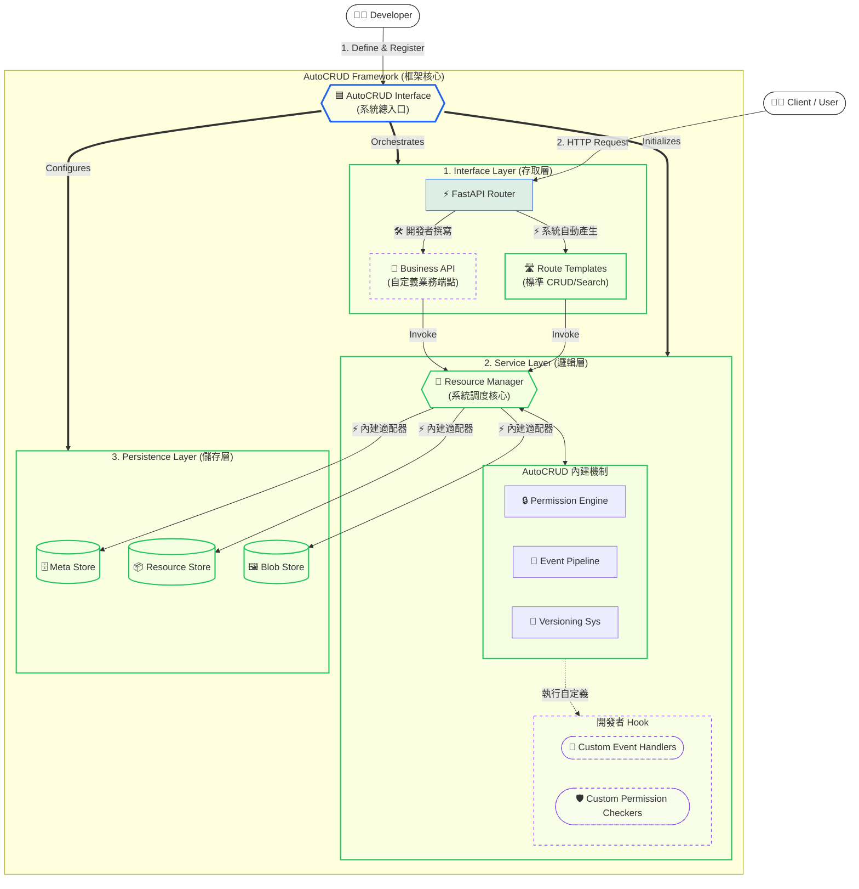
```mermaid
flowchart TD
    Dev([👨‍💻 Developer]) --> |"1. Define & Register"| AC{{"🟦 AutoCRUD Interface<br/>(系統總入口)"}}
    Client([🧑‍💻 Client / User]) --> |"2. HTTP Request"| API[⚡ FastAPI Router]

    subgraph Framework ["AutoCRUD Framework (框架核心)"]
        direction TB
        
        AC ==> |"Orchestrates"| Interface
        AC ==> |"Initializes"| Service
        AC ==> |"Configures"| Persistence

        subgraph Interface ["1. Interface Layer (存取層)"]
            direction TB
            API --> |"⚡ 系統自動產生"| Templates["🛣️ Route Templates<br/>(標準 CRUD/Search)"]
            API --> |"🛠️ 開發者撰寫"| BizAPI["🧩 Business API<br/>(自定義業務端點)"]
        end

        subgraph Service ["2. Service Layer (邏輯層)"]
            direction TB
            Templates & BizAPI --> |"Invoke"| RM{{"🧠 Resource Manager<br/>(系統調度核心)"}}
            
            subgraph Logic ["AutoCRUD 內建機制"]
                direction LR
                Perm["🔒 Permission Engine"]
                Event["🔔 Event Pipeline"]
                Ver["📜 Versioning Sys"]
            end
            
            RM <--> Logic
            
            subgraph CustomHandlers ["開發者 Hook"]
                direction LR
                CH(["🧩 Custom Event Handlers"])
                CP(["🛡️ Custom Permission Checkers"])
            end
            
            Logic -.-> |"執行自定義"| CustomHandlers
        end

        subgraph Persistence ["3. Persistence Layer (儲存層)"]
            direction LR
            RM --> |"⚡ 內建適配器"| MetaStore[("🗄️ Meta Store")]
            RM --> |"⚡ 內建適配器"| ResStore[("📦 Resource Store")]
            RM --> |"⚡ 內建適配器"| BlobStore[("🖼️ Blob Store")]
        end
    end

    %% Styling
    classDef sys fill:#dcfce730,stroke:#22c55e,stroke-width:2px;
    classDef user fill:#f5f3ff30,stroke:#7c3aed,stroke-dasharray: 5 5;
    classDef bridge fill:#eff6ff30,stroke:#2563eb,stroke-width:3px;
    
    class Interface,Service,Persistence,RM,Logic,Templates,MetaStore,ResStore,BlobStore sys;
    class BizAPI,CustomHandlers,CH,CP user;
    class AC bridge;

    style Dev fill:#f9f9f930,stroke:#333
    style Client fill:#f9f9f930,stroke:#333
    style API fill:#60a5fa30,stroke:#2563eb
```

### 系統邊界明細：我負責什麼 vs 系統提供什麼

為了讓開發者更快速上手，AutoCRUD 明確劃分了職責邊界：

| 層級 | 📦 AutoCRUD 提供的 (Built-in) | 🧑‍💻 你需要提供的 (User-defined) |
| :--- | :--- | :--- |
| **基礎設施** | 混合儲存適配器 (SQL, S3, FS)、資料編解碼 (msgspec)、去重機制 | 儲存連接資訊 (Connection Strings) |
| **路由層** | RESTful CRUD/Search 路由模板、GraphQL 自動生成 | **資源模型 (Schema)**、特定業務端點 (Custom Endpoints) |
| **邏輯層** | 權限驗證框架 (RBAC/ACL)、版本追蹤鏈、事件廣播器、遷移調度 | **業務 Hook (Event Handlers)**、客製化權限邏輯 (Permission Logic) |
| **營運層** | 自動化審計日誌腳本、多版本共存支援、Partial Patch 驗證 | 資料遷移函式 (Data Converters) |

---


```{include} functions.md
```


## 為什麼選擇 AutoCRUD？(Why AutoCRUD?)

雖然 SQLAlchemy 或 Django ORM 在 Python 生態系中佔據主導地位，但 AutoCRUD 選擇了一條不同的架構路線，旨在解決傳統 ORM 在大型應用中的痛點。

| 特性 | 傳統 ORM (SQLAlchemy / Django) | AutoCRUD |
| :--- | :--- | :--- |
| **設計核心** | **Table-First**：資料庫表的物件映射 | **Resource-First**：業務資源的生命週期管理 |
| **新增資源成本** | **極高**：需定義 DB Table、編寫 Migration、開發 CRUD Service、建立 DTO (Pydantic/Marshmallow)、手動掛載 API Route、實作權限驗證 | **極低**：僅需定義一個 `msgspec.Struct` (Schema) 並注入 AutoCRUD，系統即刻生成完整的 API 路由、混合儲存鏈、權限框架與版本機制 |
| **查詢思考** | **SQL-Oriented**：需處理複雜 Join 與表格關聯，難以完全脫離 SQL 思考 | **Pythonic**：透過 Partial Read 過濾欄位，避免 Join 複雜度，專注收攏業務邏輯 |
| **關聯性** | **Foreign Key**：依賴資料庫約束與 Cascade | **Event-Driven**：無隱性外鍵，關聯行為由明確的 Event Handler 控制 |
| **版本控制** | 需外掛或自行實作 | **Native**：內建 Revision History、Draft/Stable 狀態機 |
| **資料遷移** | **Imperative**：Alembic 複雜的升版/降版腳本 | **Functional**：提供 `Data -> Data` 的純函數轉換器，支援 Lazy Migration |
| **儲存架構** | 單一關聯式資料庫 | **Hybrid**：Meta (SQL/Redis) + Payload (Object Storage) + Blob 分離 |

### 開發流程：從「繁瑣工程」到「即時上線」 (Development Efficiency)

在傳統開發流程中，新增一個業務資源（例如「客戶合約」）往往意味著巨大的開發勞動，因為你必須處理各層之間的細節對接。AutoCRUD 將這些自動化了重複性的工作。

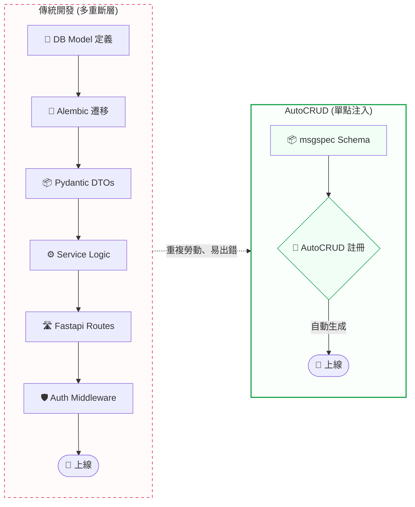
```mermaid
flowchart LR
    subgraph Traditional ["傳統開發 (多重斷層)"]
        direction TB
        T1["📐 DB Model 定義"] --> T2["📑 Alembic 遷移"]
        T2 --> T3["📦 Pydantic DTOs"]
        T3 --> T4["⚙️ Service Logic"]
        T4 --> T5["🛣️ Fastapi Routes"]
        T5 --> T6["🛡️ Auth Middleware"]
        T6 --> Finish1(["🚀 上線"])
    end

    subgraph AC ["AutoCRUD (單點注入)"]
        direction TB
        S1["📦 msgspec Schema"] --> S2{"🔌 AutoCRUD 註冊"}
        S2 --> |"自動生成"| Finish2(["🚀 上線"])
    end

    Traditional -.-> |"重複勞動、易出錯"| AC
    
    %% Styling
    style Traditional fill:#fff1f250,stroke:#e11d48,stroke-dasharray: 5 5
    style AC fill:#f0fdf450,stroke:#16a34a,stroke-width:2px
    style S1 fill:#dcfce750
    style S2 fill:#dcfce750,stroke:#16a34a
```

### 純粹的 Python (Pure Python)

AutoCRUD 讓開發者脫離 SQL 與 DB Dialect 的泥沼。
*   **無需學習 Migration DSL**: 遷移邏輯就是單純的 Python 函數，輸入舊資料，回傳新結構。
*   **低維運成本**: 由於不強依賴強一致性的關聯式資料庫功能（如外鍵），底層儲存可以輕易替換為分散式資料庫或 NoSQL 方案，具備更高的水平擴展潛力。

### 專注業務邏輯：告別 Join 的泥沼 (Logic-First over SQL-Heavy)

在傳統 ORM 世界中，即便是最 Pythonic 的工具（如 SQLAlchemy），開發者在查詢時仍需耗費大量精力思考「如何 Join」、「外鍵欄位是否對應」。這會導致業務邏輯分散在多張表的關聯結構中，增加維護難度。

AutoCRUD 採取了不同的哲學：
*   **高度收攏邏輯**: 建議將一個資源所需的所有資料都內聚在 Schema 中，而非碎裂化地分佈。
*   **透過 Partial Read 減負**: 擔心寬表產生過大的 Payload？透過 AutoCRUD 內建的 `Partial Read` 功能，你可以在解碼階段就精確過濾掉這次請求不需要的欄位。
*   **專注於「什麼」而非「如何」**: 開發者不再需要去思考 SQL 語法或表格 join key，而是將百分之百的精力集中在「業務邏輯的思考」與「資料的生命週期」本身。

### 拒絕隱性副作用 (No Hidden Side Effects)

傳統 ORM 的 `ON DELETE CASCADE` 雖然方便，但往往是系統穩定性的隱形殺手。AutoCRUD 採取 **「行為顯式化」** 策略：不使用資料庫層級的外鍵。

*   **所見即所得**: 若刪除 A 需要連動刪除 B，必須顯式註冊一個 `AfterDelete` 事件。
*   **可測試性**: 所有的業務邏輯都在 Python 程式碼中，而非隱藏在資料庫 Schema 定義裡，這讓單元測試更容易覆蓋。

### 虛擬 NoSQL 引擎 (Virtual NoSQL Engine)

AutoCRUD 可以被視為一種 **「Soft NoSQL」** 解決方案。
*   **無引擎負擔**: 我們沒有重新發明資料庫引擎，而是將各個成熟儲存方案（RDBMS 的索引能力 + Object Storage 的吞吐能力）揉合在一起。
*   **最佳實踐封裝**: 開發者獲得了 NoSQL 的靈活性（Schema Free, Scale Out），但無需自行處理資料分片或一致性問題，因為 AutoCRUD 已經透過 `ResourceManager` 封裝了這些複雜度。

### 1. 設計核心：表優先 vs 資源優先 (Design Core)

傳統 ORM 往往強迫開發者將「業務物件」拆解 (Normalize) 到多張資料庫表中，這導致業務邏輯被儲存層「遷就」。AutoCRUD 則讓開發者專注於定義 Schema，系統自動處理底層儲存映射。

<table>
<tr>
<td width="50%">

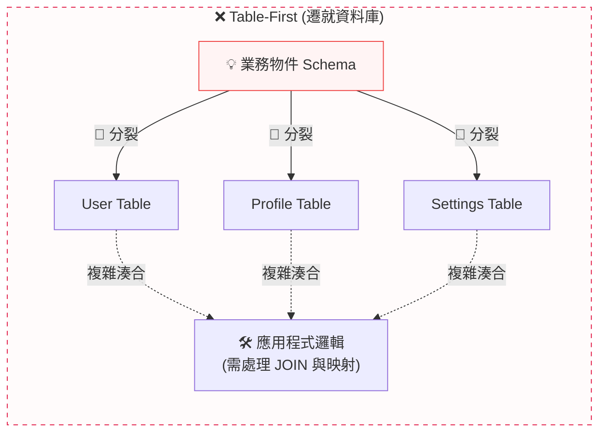
```mermaid
flowchart TD
    subgraph ORM ["❌ Table-First (遷就資料庫)"]
        direction TB
        OBJ["💡 業務物件 Schema"]
        OBJ -- "🚫 分裂" --> T1[User Table]
        OBJ -- "🚫 分裂" --> T2[Profile Table]
        OBJ -- "🚫 分裂" --> T3[Settings Table]
        
        T1 & T2 & T3 -.-> |"複雜湊合"| APP["🛠️ 應用程式邏輯<br/>(需處理 JOIN 與映射)"]
    end
    
    %% Styling
    style ORM fill:#fff1f250,stroke:#e11d48,stroke-dasharray: 5 5
    style OBJ fill:#fee2e250,stroke:#ef4444
```

</td>
<td width="50%">

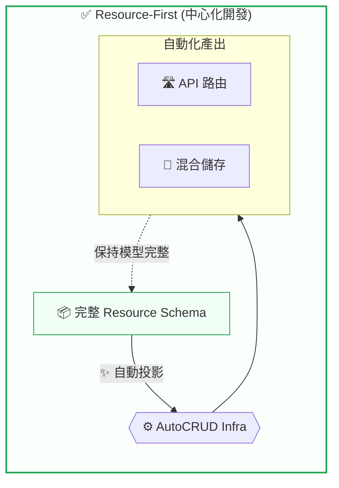
```mermaid
flowchart TD
    subgraph AC ["✅ Resource-First (中心化開發)"]
        direction TB
        SCHEMA["📦 完整 Resource Schema"]
        SCHEMA -- "✨ 自動投影" --> INFRA{{"⚙️ AutoCRUD Infra"}}
        
        subgraph Auto [自動化產出]
            API["🛣️ API 路由"]
            STORE["💾 混合儲存"]
        end
        
        INFRA --> Auto
        Auto -.-> |"保持模型完整"| SCHEMA
    end
    
    %% Styling
    style AC fill:#f0fdf450,stroke:#16a34a,stroke-width:2px
    style SCHEMA fill:#dcfce750,stroke:#16a34a
```

</td>
</tr>
</table>


### 2. 查詢思考：SQL 導向 vs Pythonic (Query Paradigm)

<table>
<tr>
<td width="50%">

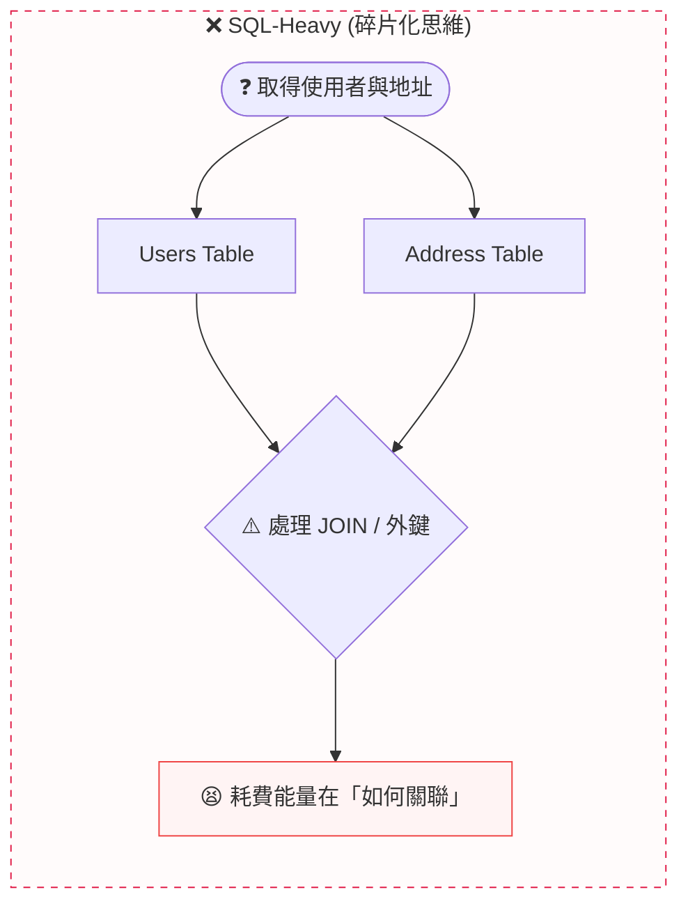
```mermaid
flowchart TD
    subgraph ORM ["❌ SQL-Heavy (碎片化思維)"]
        direction TB
        Goal(["❓ 取得使用者與地址"])
        Goal --> T1[Users Table]
        Goal --> T2[Address Table]
        T1 & T2 --> JOIN{"⚠️ 處理 JOIN / 外鍵"}
        JOIN --> Logic["😫 耗費能量在「如何關聯」"]
    end
    
    %% Styling
    style ORM fill:#fff1f250,stroke:#e11d48,stroke-dasharray: 5 5
    style Logic fill:#fee2e250,stroke:#ef4444
```

</td>
<td width="50%">

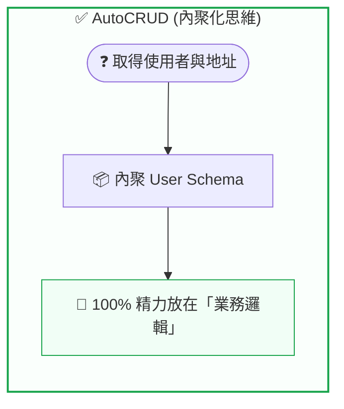
```mermaid
flowchart TD
    subgraph AC ["✅ AutoCRUD (內聚化思維)"]
        direction TB
        Goal2(["❓ 取得使用者與地址"])
        Goal2 --> Schema["📦 內聚 User Schema"]
        Schema --> Logic2["🧠 100% 精力放在「業務邏輯」"]
    end
    
    %% Styling
    style AC fill:#f0fdf450,stroke:#16a34a,stroke-width:2px
    style Logic2 fill:#dcfce750,stroke:#16a34a
```

</td>
</tr>
</table>

### 3. 邏輯控制：隱性約束 vs 顯式事件 (Logic Control)

<table>
<tr>
<td width="50%">

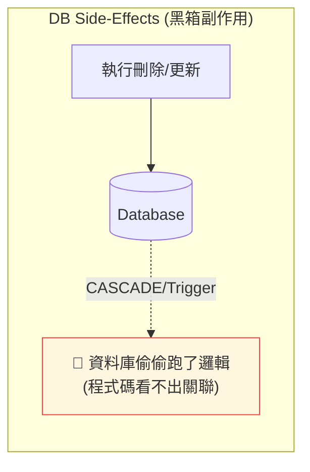
```mermaid
flowchart TD
    subgraph ORM ["DB Side-Effects (黑箱副作用)"]
        direction TB
        Action[執行刪除/更新] --> DB[(Database)]
        DB -.-> |"CASCADE/Trigger"| Secret["👀 資料庫偷偷跑了邏輯<br/>(程式碼看不出關聯)"]
        style Secret fill:#fee2e250,stroke:#ef4444
    end
```

</td>
<td width="50%">

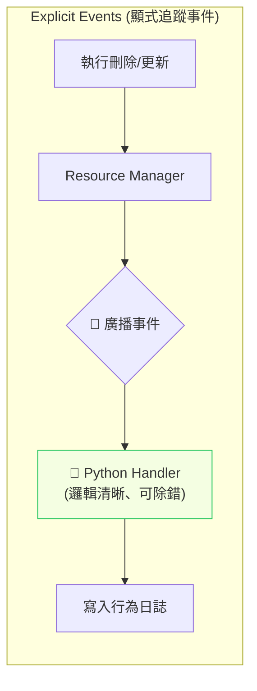
```mermaid
flowchart TD
    subgraph AC ["Explicit Events (顯式追蹤事件)"]
        direction TB
        Action2[執行刪除/更新] --> RM[Resource Manager]
        RM --> Event{📢 廣播事件}
        Event --> Handler["🧩 Python Handler<br/>(邏輯清晰、可除錯)"]
        Handler --> Log[寫入行為日誌]
        style Handler fill:#dcfce750,stroke:#22c55e
    end
```

</td>
</tr>
</table>

### 4. 版本控管：覆蓋更新 vs 歷史追加 (Versioning)

<table>
<tr>
<td width="50%">

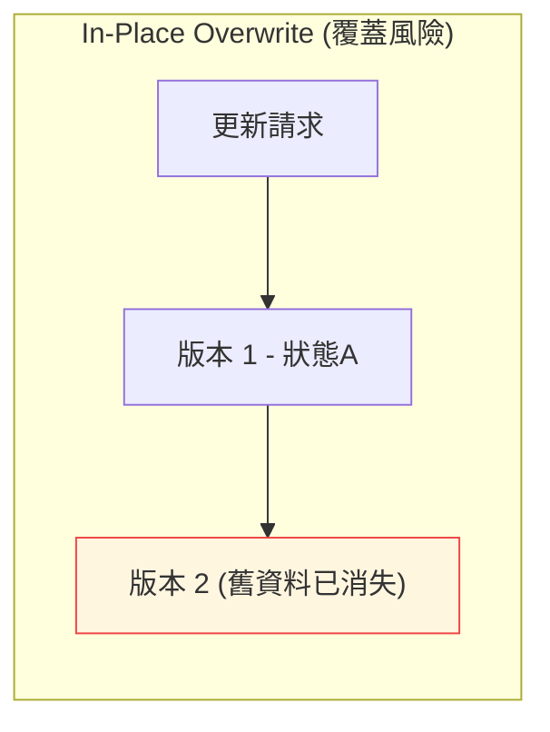
```mermaid
flowchart TD
    subgraph ORM ["In-Place Overwrite (覆蓋風險)"]
        direction TB
        V1[版本 1 - 狀態A]
        Update[更新請求] --> V1
        V1 --> V1_NEW["版本 2 (舊資料已消失)"]
        style V1_NEW fill:#fee2e250,stroke:#ef4444
    end
```

</td>
<td width="50%">

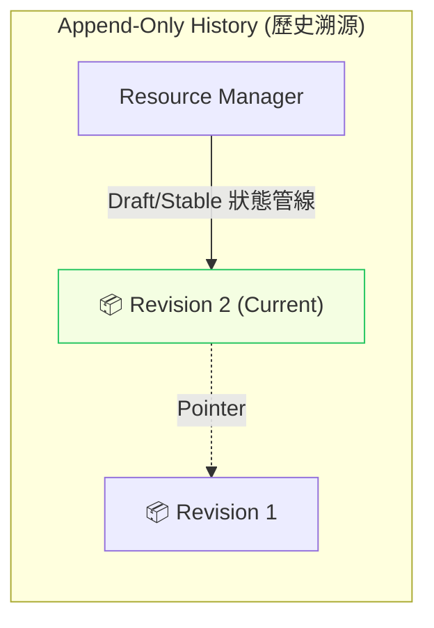
```mermaid
flowchart TD
    subgraph AC ["Append-Only History (歷史溯源)"]
        direction TB
        H1["📦 Revision 1"]
        H2["📦 Revision 2 (Current)"]
        H2 -.-> |"Pointer"| H1
        RM[Resource Manager] --> |"Draft/Stable 狀態管線"| H2
        style H2 fill:#dcfce750,stroke:#22c55e
    end
```

</td>
</tr>
</table>

### 5. 資料遷移：結構變更 vs 惰性轉換 (Migration)

<table>
<tr>
<td width="50%">

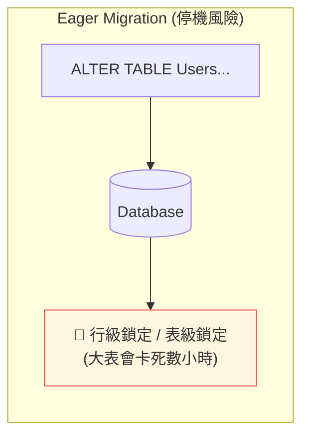
```mermaid
flowchart TD
    subgraph ORM ["Eager Migration (停機風險)"]
        direction TB
        ALTER["ALTER TABLE Users..."]
        ALTER --> DB[(Database)]
        DB --> Lock["🚫 行級鎖定 / 表級鎖定<br/>(大表會卡死數小時)"]
        style Lock fill:#fee2e250,stroke:#ef4444
    end
```

</td>
<td width="50%">

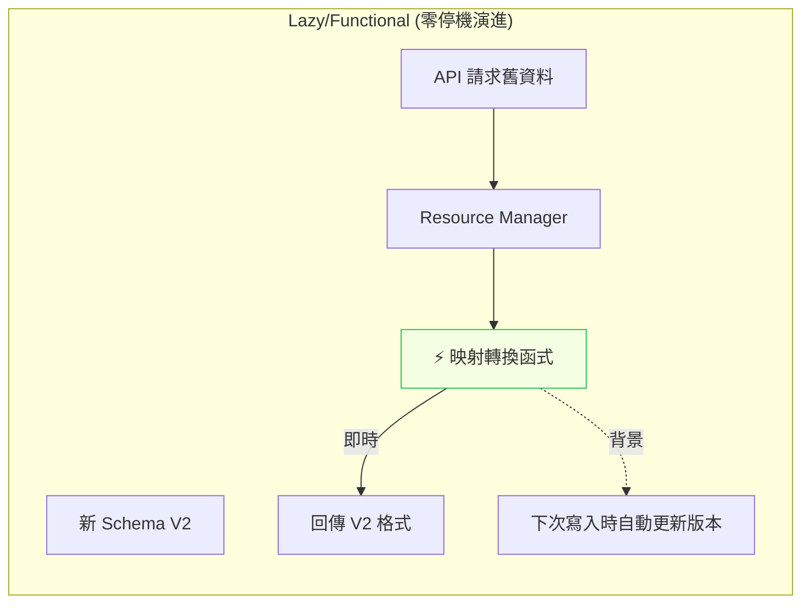
```mermaid
flowchart TD
    subgraph AC ["Lazy/Functional (零停機演進)"]
        direction TB
        Schema2[新 Schema V2]
        Req[API 請求舊資料] --> RM[Resource Manager]
        RM --> Map["⚡ 映射轉換函式"]
        Map -->|即時| Resp[回傳 V2 格式]
        Map -.-> |背景| STORE["下次寫入時自動更新版本"]
        style Map fill:#dcfce750,stroke:#22c55e
    end
```

</td>
</tr>
</table>

### 6. 儲存架構：單體 vs 混合 (Storage Architecture)

<table>
<tr>
<td width="50%">

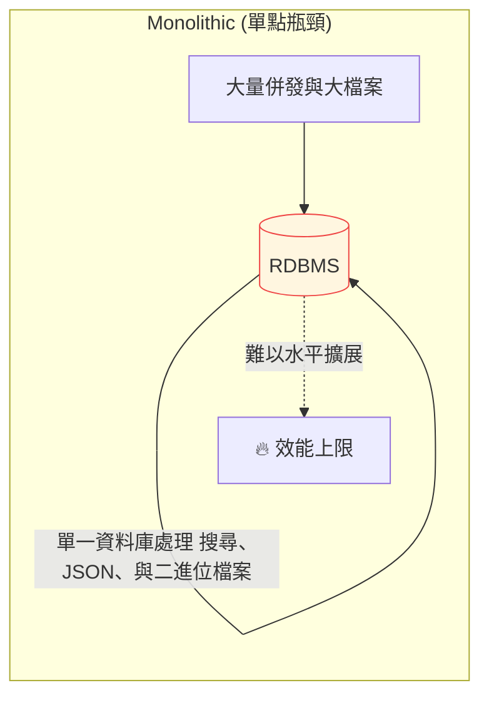
```mermaid
flowchart TD
    subgraph ORM ["Monolithic (單點瓶頸)"]
        direction TB
        REQ[大量併發與大檔案] --> DB[(RDBMS)]
        DB --> |"單一資料庫處理 搜尋、JSON、與二進位檔案"| DB
        DB -.-> |"難以水平擴展"| CRASH[🔥 效能上限]
        style DB fill:#fee2e250,stroke:#ef4444
    end
```

</td>
<td width="50%">

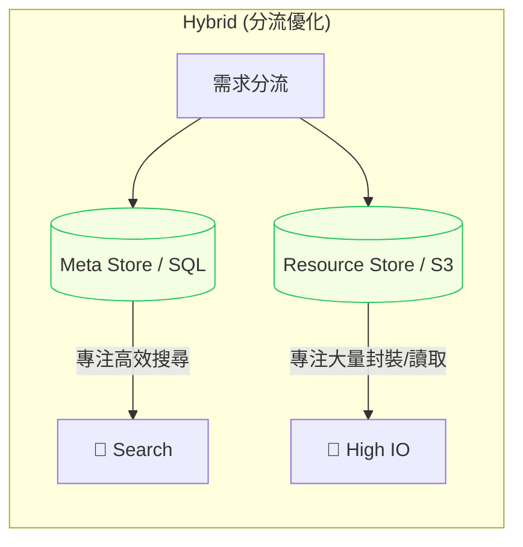
```mermaid
flowchart TD
    subgraph AC ["Hybrid (分流優化)"]
        direction TB
        REQ2[需求分流] --> META[(Meta Store / SQL)]
        REQ2 --> DATA[(Resource Store / S3)]
        META --> |"專注高效搜尋"| SEARCH[🔎 Search]
        DATA --> |"專注大量封裝/讀取"| IO[🚀 High IO]
        style META fill:#dcfce750,stroke:#22c55e
        style DATA fill:#dcfce750,stroke:#22c55e
    end
```

</td>
</tr>
</table>

## 核心組件 (Core Components)

### 1. Application Layer: `AutoCRUD`
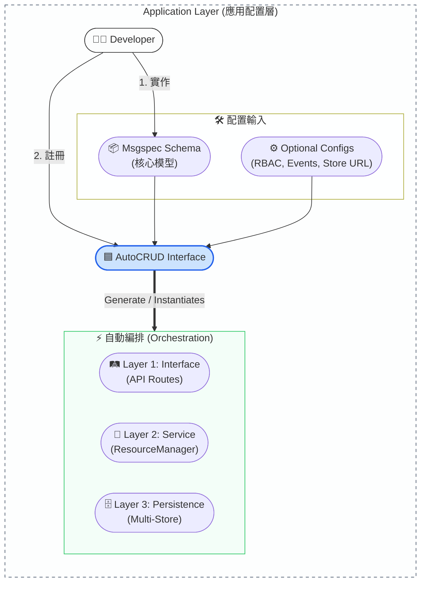
```mermaid
flowchart TD
    subgraph App ["Application Layer (應用配置層)"]
        direction TB
        DEV([👨‍💻 Developer])
        
        subgraph Definitions ["🛠️ 配置輸入"]
            SCHEMA(["📦 Msgspec Schema<br/>(核心模型)"])
            CONFIG(["⚙️ Optional Configs<br/>(RBAC, Events, Store URL)"])
        end
        
        AC_INTF(["🟦 AutoCRUD Interface"])
        
        DEV --> |"1. 實作"| SCHEMA
        DEV --> |"2. 註冊"| AC_INTF
        SCHEMA & CONFIG --> AC_INTF
        
        subgraph Orchestration ["⚡ 自動編排 (Orchestration)"]
            direction LR
            L1(["🛤️ Layer 1: Interface<br/>(API Routes)"])
            L2(["🧠 Layer 2: Service<br/>(ResourceManager)"])
            L3(["🗄️ Layer 3: Persistence<br/>(Multi-Store)"])
        end
        
        AC_INTF ==> |"Generate / Instantiates"| Orchestration
    end

    %% Styling
    style AC_INTF fill:#60a5fa50,stroke:#2563eb,stroke-width:2px
    style DEV fill:#f9f9f950,stroke:#333
    style App fill:#f8fafc50,stroke:#475569,stroke-dasharray: 5 5
    style Definitions fill:#ffffff50
    style Orchestration fill:#dcfce750,stroke:#22c55e
```

`AutoCRUD` 是開發者與系統互動的單一入口。它的職責是：
- 接收使用者定義的 Schema (msgspec.Struct)。
- 協調 `StorageFactory` 來創建對應的儲存後端。
- 將 `ResourceManager` 與 `RouteTemplate` 綁定。
- 將最終生成的路由掛載到 FastAPI App 上。

### 2. Interface Layer: `RouteTemplate` & `Business API`
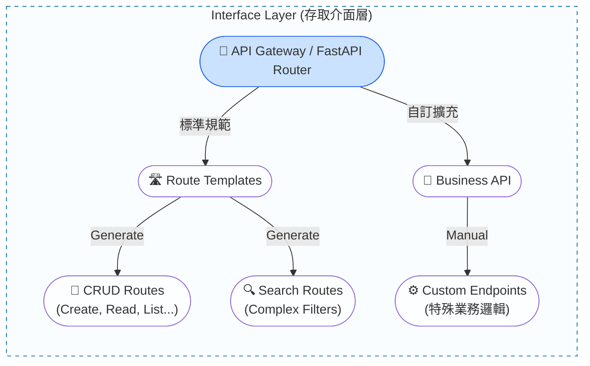
```mermaid
flowchart TD
    subgraph Interface ["Interface Layer (存取介面層)"]
        direction TB
        API(["🔗 API Gateway / FastAPI Router"])
        
        API --> |"標準規範"| RT(["🛣️ Route Templates"])
        API --> |"自訂擴充"| BA(["🧩 Business API"])
        
        RT --> |"Generate"| CRUD(["📝 CRUD Routes<br/>(Create, Read, List...)"])
        RT --> |"Generate"| SEARCH(["🔍 Search Routes<br/>(Complex Filters)"])
        BA --> |"Manual"| CUSTOM(["⚙️ Custom Endpoints<br/>(特殊業務邏輯)"])
    end

    %% Styling
    style API fill:#60a5fa50,stroke:#2563eb
    style Interface fill:#f0f9ff50,stroke:#0369a1,stroke-dasharray: 5 5
    style RT fill:#ffffff50
    style BA fill:#ffffff50
    style CRUD fill:#ffffff50
    style SEARCH fill:#ffffff50
    style CUSTOM fill:#ffffff50
```

這層決定了 API 的「長相」。`AutoCRUD Interface` 會根據開發者註冊的 Schema，透過 `IRouteTemplate` 介面自動生成對應路由。
- **Route Templates**: 提供標準的 CRUD 操作 (Create, Update, List...)。
- **Business API**: 開發者可以撰寫自定義的 FastAPI 路由，直接調用由系統生成的 `ResourceManager` 來復用底層邏輯（如權限、版控），而無需重造輪子。
- **職責**: 解析 HTTP 請求參數 -> 呼叫 Resource Manager -> 格式化回傳 Response。

### 3. Service Layer: `ResourceManager`
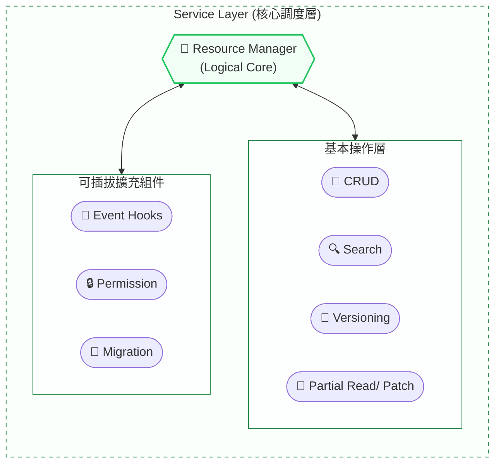
```mermaid
flowchart TD
    subgraph Service ["Service Layer (核心調度層)"]
        direction TB
        RM{{"🧠 Resource Manager<br/>(Logical Core)"}}
        
        subgraph Ops ["基本操作層"]
            direction LR
            CRUD(["📝 CRUD"])
            SEARCH(["🔍 Search"])
            VER(["📜 Versioning"])
            PARTIAL(["🧩 Partial Read/ Patch"])
        end
        
        subgraph Plugins ["可插拔擴充組件"]
            direction LR
            EVENT(["🔔 Event Hooks"])
            PERM(["🔒 Permission"])
            MIG(["🔄 Migration"])
        end
        
        RM <--> Ops
        RM <--> Plugins
    end

    %% Styling
    style RM fill:#dcfce750,stroke:#22c55e,stroke-width:2px
    style Service fill:#f0fdf450,stroke:#15803d,stroke-dasharray: 5 5
    style Ops fill:#ffffff50,stroke:#15803d
    style Plugins fill:#ffffff50,stroke:#15803d
```

`ResourceManager` 是 AutoCRUD 的「大腦」，也是所有自定義邏輯發生的地方。它由 `AutoCRUD Interface` 在系統啟動時自動實例化，並負責協調所有的組件。當路由收到請求後，會轉交給它處理。

它執行的標準作業流程 (SOP) 如下：
1.  **Context Setup**: 建立執行當下的 Context (包含 User, Timestamp)。
2.  **Permission Check**: 呼叫 `IPermissionChecker` 確認操作者權限。
3.  **Before Hooks**: 觸發 `before` 事件 (例如：資料驗證、自動填值)。
4.  **Action Execution**: 執行實體動作 (CRUD、版本切換或搜尋)。
5.  **Status Hooks**: 根據結果觸發 `on_success` 或 `on_error`。
6.  **After Hooks**: 觸發 `after` 事件 (無論勝敗，皆執行收尾)。
7.  **Response Construction**: 將結果封裝回傳。

### 4. Persistence Layer: Multi-Store Strategy
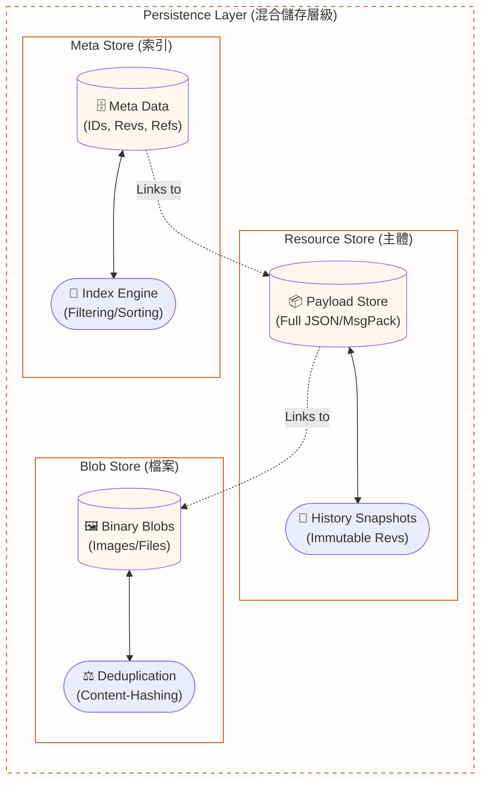
```mermaid
flowchart TD
    subgraph Persistence ["Persistence Layer (混合儲存層級)"]
        direction TB
        
        subgraph Meta ["Meta Store (索引)"]
            META[("🗄️ Meta Data<br/>(IDs, Revs, Refs)")]
            IDX(["🔎 Index Engine<br/>(Filtering/Sorting)"])
            META <--> IDX
        end
        
        subgraph Data ["Resource Store (主體)"]
            RES[("📦 Payload Store<br/>(Full JSON/MsgPack)")]
            SNAP(["📜 History Snapshots<br/>(Immutable Revs)"])
            RES <--> SNAP
        end
        
        subgraph Blobs ["Blob Store (檔案)"]
            BLOB[("🖼️ Binary Blobs<br/>(Images/Files)")]
            DEDUP(["⚖️ Deduplication<br/>(Content-Hashing)"])
            BLOB <--> DEDUP
        end
        
        META -.-> |"Links to"| RES
        RES -.-> |"Links to"| BLOB
    end

    %% Styling
    style Persistence fill:#fff7ed30,stroke:#c2410c,stroke-dasharray: 5 5
    style Meta fill:#ffffff30,stroke:#c2410c
    style Data fill:#ffffff30,stroke:#c2410c
    style Blobs fill:#ffffff30,stroke:#c2410c
    style META fill:#fed7aa30
    style RES fill:#fed7aa30
    style BLOB fill:#fed7aa30
```

為了同時滿足 **高效搜尋**、**大容量儲存** 與 **二進位檔案管理**，AutoCRUD 採取了三層儲存分離策略：

*   **Meta Store (索引層)**: 
    *   儲存資源的 Metadata (ID, CreatedTime, Tags, RevisionID) 與索引欄位。
    *   通常使用關聯式資料庫 (Postgres, SQLite) 或高效 KV Store (Redis)。
    *   **職責**: `Search`, `Filter`, `Sort`, `Pagination`。
*   **Resource Store (資料層)**:
    *   儲存完整的 JSON/MsgPack Payload 以及歷史版本快照 (Revision Blobs)。
    *   通常使用 Object Storage (S3, MinIO) 或 File System。
    *   **職責**: `Load`, `Dump`, `History Management`。
*   **Blob Store (檔案層)**:
    *   專門儲存非結構化的二進位資料 (Images, PDFs, Videos)。
    *   資源中的 `Binary` 欄位僅儲存 reference ID，實際內容存於此。
    *   **職責**: `File Upload/Download`, `Streaming`, `Signed URL Generation`。

## 協作流程範例 (Interaction Flow)

以「新增一筆資源 (Create Resource)」為例：

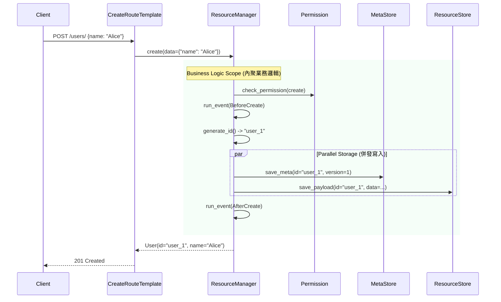
```mermaid
sequenceDiagram
    participant Client
    participant API as CreateRouteTemplate
    participant RM as ResourceManager
    participant Perm as Permission
    participant Meta as MetaStore
    participant Store as ResourceStore

    Client->>API: POST /users/ {name: "Alice"}
    API->>RM: create(data={"name": "Alice"})
    
    rect rgb(220, 252, 231, 0.3)
        Note over RM: Business Logic Scope (內聚業務邏輯)
        RM->>Perm: check_permission(create)
        RM->>RM: run_event(BeforeCreate)
        RM->>RM: generate_id() -> "user_1"
        
        par Parallel Storage (併發寫入)
            RM->>Meta: save_meta(id="user_1", version=1)
            RM->>Store: save_payload(id="user_1", data=...)
        end
        
        RM->>RM: run_event(AfterCreate)
    end
    
    RM-->>API: User(id="user_1", name="Alice")
    API-->>Client: 201 Created
```

透過這種架構，AutoCRUD 讓開發者能夠專注於「定義資料」，而將複雜的基礎設施建置工作交由系統自動完成。

## 關鍵特性深入剖析 (Deep Dive Features)

### 1. 版本控制模型 (Versioning Model)

AutoCRUD 內建了完善的版本控制機制，每一筆資源的變更都會產生新的 `Revision`。

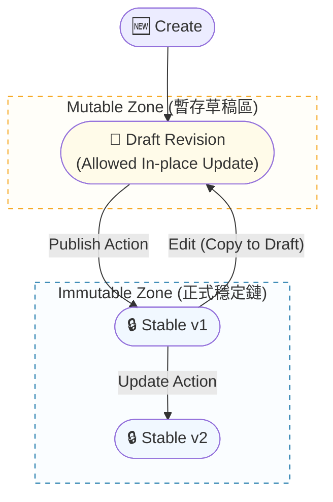
```mermaid
flowchart TD
    subgraph DraftZone ["Mutable Zone (暫存草稿區)"]
        D1(["📝 Draft Revision<br/>(Allowed In-place Update)"])
    end

    subgraph StableZone ["Immutable Zone (正式穩定鏈)"]
        S1(["🔒 Stable v1"])
        S2(["🔒 Stable v2"])
        S1 --> |"Update Action"| S2
    end

    Start([🆕 Create]) --> D1
    D1 --> |"Publish Action"| S1
    S1 --> |"Edit (Copy to Draft)"| D1

    %% Styling
    style DraftZone fill:#fffbeb50,stroke:#f59e0b,stroke-dasharray: 5 5
    style StableZone fill:#f0f9ff50,stroke:#0369a1,stroke-dasharray: 5 5
    style D1 fill:#fef3c750
    style S1 fill:#dbeafe50
    style S2 fill:#dbeafe50
```

*   **Revision 狀態**:
    *   `draft`: 草稿狀態，允許就地更新 (In-place update) 而不產生新版本。
    *   `stable`: 穩定狀態，一旦進入此狀態，任何修改都會強制產生一個全新的 Revision ID。
*   **指向與回溯**:
    *   系統會維護一個 `parent_revision_id` 指向來源版本，形成一條完整的變更鏈。
    *   開發者可以隨時將資源 `switch`（切換）回歷史上的任何一個 stable 版本。
*   **Schema 版本連結**: 每個 Revision 都會紀錄當時使用的 `schema_version`，確保在資料遷移 (Migration) 後依然能正確解析歷史資料。

### 2. 基礎設施決策脫鉤 (Infrastructure Decoupling)

在開發傳統 ORM 專案時，開發者往往需要耗費大量精力在與業務無關、但又不得不處理的「基礎設施欄位」與「架構決策」上。AutoCRUD 將這些雜事完全自動化，讓您真正只定義 **「業務資料層」**。

```mermaid
flowchart LR
    subgraph ORM ["傳統 ORM (精力分散)"]
        direction TB
        Dec1["🆔 ID：用 Int 還是 UUID？<br/>DB 生成還是 App 生成？"]
        Dec2["⏰ Time：時區怎麼處理？<br/>Created/Updated 何時寫入？"]
        Dec3["👤 User：欄位要叫 created_by<br/>還是 creator_id？"]
        Dec4["🔏 Integrity：Hash 值怎麼產？<br/>版號手動遞增？"]
    end

    subgraph AC ["AutoCRUD (精力聚焦)"]
        direction TB
        Core[("💡 您的業務模型")]
        Meta{{"⚙️ 系統自動裝甲<br/>(ResourceMeta)"}}
        
        Core --> Meta
        Meta -.-> |"Auto-Gen"| ID["🆔 Unique Resource ID"]
        Meta -.-> |"Auto-Sync"| Time["⏰ Timestamp (ISO/UTC)"]
        Meta -.-> |"Auto-Inject"| User["👤 Operator Tracking"]
        Meta -.-> |"Auto-Calc"| Hash["🔏 Data Hash & Revisions"]
    end

    classDef focus fill:#dcfce750,stroke:#22c55e,stroke-width:2px;
    class Core focus;
```

*   **免除重複定義**: 每個資源一定會有的 `resource_id`, `revision_id`, `created_at`, `updated_at`, `created_by`, `updated_by` 等欄位，通通不需要寫在 Schema 裡。AutoCRUD 會透過 `ResourceMeta` 與 `RevisionInfo` 自動幫您管理。
*   **一致性的架構決策**: 
    - **ID 策略**: 統一採用具備型別標記的內容尋址/隨機 ID，無需爭論自增值的高效性與安全性。
    - **時區與寫入時機**: 全系統統一使用 UTC/ISO 格式，並在 `ResourceManager` 核心步驟中自動捕捉，消除「忘記更新時間戳」的 Bug。
    - **人員追蹤**: 透過 Context 注入，自動追蹤是誰執行了這次 Create/Update，無需手動傳遞 User 物件到每一個層回寫。
*   **專注於「變動」**: 系統自動生成的 `data_hash` 確保只有在內容真正改變時才會產生新版本，避免多餘的寫入與版本雜訊。

### 3. 權限與安全性 (Security & Permissions)

權限驗證被整合在 `ResourceManager` 的核心流程中，確保無論是透過 API 還是內部調用，都能受到保護。

```mermaid
flowchart TD
    REQ(["📩 API Request"]) --> AUTH{{"🛡️ Auth Chain"}}
    
    subgraph Layers ["多層次驗證網"]
        direction TB
        GLOBAL{"🌐 Global Rules<br/>(RBAC)"}
        MODEL{"📦 Model Rules<br/>(Resource Type)"}
        ACL{"🔑 Resource ACL<br/>(Instance Level)"}
        
        GLOBAL --> |Pass| MODEL
        MODEL --> |Pass| ACL
    end

    AUTH --> Layers
    ACL --> |"Success"| OK(["✅ Authorized"])
    
    GLOBAL -- "Deny" --> FAIL(["🚫 403 Forbidden"])
    MODEL -- "Deny" --> FAIL
    ACL -- "Deny" --> FAIL

    %% Styling
    style Layers fill:#f8fafc50,stroke:#475569,stroke-dasharray: 5 5
    style OK fill:#dcfce750,stroke:#22c55e
    style FAIL fill:#fee2e250,stroke:#ef4444
```

*   **RBAC (Role-Based Access Control)**: 支援基於角色的權限管理，可以定義 `admin`, `editor`, `viewer` 等角色對不同資源的操作權限。
*   **多層次驗證**:
    1.  **Global Level**: 應用程式層級的預設權限。
    2.  **Model Level**: 針對特定資料模型的權限設定。
    3.  **Resource Level (ACL)**: 針對單一資源實例的存取控制列表。
*   **自定義驗證器**: 透過實作 `IPermissionChecker`，開發者可以撰寫複雜的邏輯（例如：只有資源擁有者在特定時間內才能修改）。

### 4. 事件驅動架構 (Event-Driven Hooks)

AutoCRUD 提供了靈活的事件 Hook 點，讓開發者在不侵入核心邏輯的情況下擴充功能。

```mermaid
sequenceDiagram
    participant RM as ResourceManager
    participant EH as EventHandler
    participant Store as Persistence Layer

    RM->>EH: trigger(BeforeAction)
    activate EH
    EH-->>RM: continue
    deactivate EH
    
    Note over RM, Store: 執行核心動作
    RM->>Store: execute(Action)
    
    alt Success Case
        Store-->>RM: result
        RM->>EH: trigger(OnSuccess)
    else Failure Case
        Store-->>RM: raise Exception
        RM->>EH: trigger(OnError)
    end
    
    RM->>EH: trigger(AfterAction) (Always)
```

*   **四種事件 Hook**:
    *   `Before`: 在執行動作前觸發。可用於進階資料校驗、欄位自動補全（例如：自動填入 `created_by`）。
    *   `OnSuccess`: 動作「成功執行」後觸發。可用於發送 Webhook、清理快取、發送郵件通知。
    *   `OnError`: 動作「執行失敗」時觸發。可用於錯誤追蹤、即時警報或補償邏輯。
    *   `After`: 動作「結束後」觸發（無論成功或失敗）。適合做最終的資源清理或審計日誌。

### 5. 二進位資料優化 (Binary Data Optimization)

針對非結構化資料 (Files)，AutoCRUD 採用了「欄位級別的透明化處理」：

```mermaid
flowchart TD
    RAW(["📄 Raw Bytes (Upload)"]) --> RM{{"🧠 Resource Manager"}}
    RM --> HASH["🧮 Content Hashing<br/>(XXH3-128)"]
    
    subgraph Storage ["Blob Store Logic"]
        HASH --> BLOB{{"🔍 Exists?"}}
        BLOB -- "No" --> SAVE["💾 Save to Object Store"]
        BLOB -- "Yes" --> SKIP["⏭️ Skip Upload"]
    end
    
    SAVE & SKIP --> REF["🔑 Get File Reference ID"]
    REF --> META["📝 Store ID in MetaStore"]

    %% Styling
    style RM fill:#dcfce750,stroke:#22c55e
    style Storage fill:#fcfaf850,stroke:#c2410c,stroke-dasharray: 5 5
```

*   **Binary Struct**: 當 Schema 中使用 `Binary` 類型時，系統會自動處理上傳與儲存。
*   **去重儲存 (Deduplication)**: Blob Store 會根據檔案內容的 Hash 值來儲存。如果多個資源上傳了相同的圖片，實體檔案只會儲存一份，節省空間。
*   **延遲讀取 (Lazy Loading)**: 當查詢資源列表時，系統不會包含原始的二進位內容，而是返回檔案 Metadata (ID, Size, Content-Type)，僅在明確請求下載時才由 Blob Store 提供串流服務。

### 6. Schema 演進與遷移 (Schema Evolution & Migration)

隨著業務發展，資料模型勢必會發生變化。AutoCRUD 提供了半自動化的遷移路徑：

```mermaid
flowchart TD
    READ(["📥 Read Request"]) --> RM{{"🧠 Resource Manager"}}
    RM --> VER{{"🔢 Version Check"}}
    
    VER -- "Match" --> RET(["✅ Return Data"])
    
    subgraph Migration ["On-the-fly Upgrade"]
        VER -- "Old Version" --> CONV["⚡ Apply Converter<br/>(Python Function)"]
        CONV --> MAP["🧪 Transform to New Schema"]
    end
    
    MAP --> RET
    MAP -. "Lazy Write" .-> WRITE["💾 Update Storage<br/>(Next Write Operation)"]

    %% Styling
    style RM fill:#dcfce750,stroke:#22c55e
    style Migration fill:#fff7ed50,stroke:#c2410c,stroke-dasharray: 5 5
```

*   **多版本共存**: 系統允許在同一個 `ResourceManager` 中存在不同的 `schema_version` 的資料。
*   **遷移腳本 (Migration Scripts)**: 當開發者升級模型時，可提供一個 `Converter`。當舊版本的資料被讀取時，系統會自動套用 Converter 將其升級為最新格式。
*   **Lazily Update**: 資料不需要一次性全部遷移（以免造成停機），而是在讀取時動態升級，並在下一次寫入時存入新版本，分散資料庫壓力。

### 7. 局部更新 (RFC 6902 JSON Patch)

為了讓開發者無需處理複雜的「先讀取、再合併、再寫回」邏輯，AutoCRUD 採用了 **RFC 6902 JSON Patch** 標準。開發者只需發送「變更指令」，其餘的原子性操作與型別檢查由系統自動完成。

```mermaid
sequenceDiagram
    participant User as 🧑‍💻 Client / Developer
    participant RM as 🧠 Resource Manager
    participant Store as 📦 Hybrid Storage
    
    User->>RM: PATCH (ID, Patch Ops)
    Note right of User: 💡 僅需傳送「變更指令」<br/>(例如：將 /status 替換為 "active")

    rect rgb(232, 240, 254, 0.6)
        Note over RM: ⚡ 原子更新程序 (Atomic Patch Workflow)
        RM->>Store: 1. 獲取當前最新資料
        Store-->>RM: 原始資料 (Full Payload)
        RM->>RM: 2. 在記憶體中精準套用 Ops 指令
        Note over RM: 不會影響資料庫，僅在暫存區計算
        RM->>RM: 3. 型別安全驗證 (msgspec)
        Note over RM: 確保變更後的資料仍符合 Schema
    end
    
    RM->>Store: 4. 產生並存入新的 Revision
    RM-->>User: 200 OK (回傳更新後的完整資源)
```

*   **無需手動合併 (No Manual Merge)**: 你不需要在程式碼中寫 `if field in data: obj.field = data.field`。只需描述「我要對路徑 X 做什麼」，系統會保證正確性。
*   **標準化指令集**: 支援 `add`, `remove`, `replace`, `move`, `copy`, `test` 等標準操作，可處理深層嵌套結構（如 `/metadata/tags/0`）。
*   **原子性保證 (Atomicity)**: 讀取、套用、驗證、寫入是在一個受控制的 Lifecycle 中完成，確保不會產生中間態的髒資料。
*   **強型別防護**: 即使 Patch 指令集是動態的，最終產生的結果必須通過 `msgspec` 的強型別驗證，否則會直接報錯並終止更新。
*   **自動版本追蹤**: 每次成功 Patch 都會自動產生一條版本紀錄，方便隨時回溯。

### 8. 局部讀取與動態 Schema 優化 (Partial Read & Dynamic Schema)

為了進一步提升效能並減少網路頻寬消耗，AutoCRUD 支援「局部讀取」功能，這背後依賴於一套強大的 **動態 Schema 生成技術 (Dynamic Schema Generation)**。

```mermaid
flowchart TD
    BASE["📦 Base Model"] --> GEN{{"⚙️ Partial Type Generator"}}
    PATHS(["📍 JSON Paths / Pointers<br/>(e.g. name, /meta/title)"]) --> GEN
    
    subgraph TypeGen ["⚡ Just-in-Time Schema"]
        GEN --> DYNAMIC["🧪 Dynamic Struct Class<br/>(Sub-type of Base)"]
    end
    
    subgraph Decoding ["🚀 msgspec Fast Decoding"]
        STORAGE[("🗄️ Storage bytes")] --> DECODE{{"🧩 Specialized Decoder"}}
        DYNAMIC -. "Constraint" .-> DECODE
        DECODE --> OBJ(["🎁 Partial Object"])
    end
    
    OBJ --> RES(["📤 Response"])

    %% Styling
    style TypeGen fill:#f5f3ff50,stroke:#7c3aed,stroke-dasharray: 5 5
    style Decoding fill:#f0fdf450,stroke:#15803d,stroke-dasharray: 5 5
```

*   **動態類型生成 (Just-in-Time Schema)**: 系統能根據請求的欄位路徑，透過 `create_partial_type` 即時生成一個僅包含目標欄位的 `msgspec.Struct` 類別。
*   **高效解碼 (Efficient Decoding)**: 不同於傳統「讀進內存、轉換成 Dict 再 filter」的做法，AutoCRUD 將動態生成的 Schema 傳給 `msgspec` 解碼器。這讓底層 C 實作的解碼器能在掃描位元組流時，直接跳過 (Skip) 不需要處理的欄位。
*   **記憶體與帶寬雙重優化**: 
    - **記憶體**: 僅實例化需要的物件節點。
    - **帶寬**: 對於包含大量全文檢索內容或複雜巢狀結構的資源，局部讀取能顯著減少產出的 JSON payload 大小。
*   **應用場景**: 列表分頁 (Pagination) 僅顯示摘要、手機端低流量模式、GraphQL 的準確欄位選擇。

### 9. GraphQL 整合 (GraphQL Integration)

除了 RESTful API，AutoCRUD 也原生支援 GraphQL，實現了「定義一次，雙重介面」。

```mermaid
flowchart TD
    Schema(["📦 Msgspec Schema"]) --> |"Introspection"| GQLGen{{"✨ GraphQL Generator"}}
    
    subgraph GQL ["Auto-Generated Layer"]
        GQLGen --> GQLType["🟣 GraphQL Types"]
        GQLType --> Query["🔍 Queries<br/>(Auto-Filter)"]
        GQLType --> Mutation["✍️ Mutations<br/>(Auto-Action)"]
    end
    
    Client(["🧑‍💻 Client Query"]) --> Res{{"🛡️ Resolver"}}
    Res --> |"Delegate"| RM{{"🧠 Resource Manager"}}

    %% Styling
    style GQL fill:#f5f3ff50,stroke:#7c3aed,stroke-dasharray: 5 5
    style GQLType fill:#ede9fe50
```

*   **自動對應 (Auto-Mapping)**: 利用 `Strawberry` 函式庫，自動將 msgspec 模型轉換為 GraphQL Types。
*   **豐富的搜尋能力**: 自動生成的 GraphQL Query 支援完整的過濾條件 (DataSearchOperator)，如 `eq`, `gt`, `contains` 原生對應。
*   **統一邏輯**: GraphQL Resolver 底層同樣呼叫 `Resource Manager`，因此所有的權限檢查、事件 Hook 與版本控制邏輯完全一致。

### 10. 訊息佇列與非同步任務 (Message Queue & Async Tasks)
```{versionadded} 0.7.0
```
AutoCRUD 將「任務 (Job)」視為一種標準資源，透過 `IMessageQueue` 介面實現與核心架構的無縫整合。這讓非同步處理不再是架構外的孤島，而是系統的一流公民。

```mermaid
flowchart LR
    APP(["🚀 Application"]) --> |"Enqueue"| MQ{{"📨 Message Queue"}}
    MQ --> |"Create Job Resource"| RM{{"🧠 Resource Manager"}}
    
    subgraph Worker ["Async Worker"]
        direction TB
        W(["⚙️ Consumer"]) --> |"ack/nack"| Q_BACKEND[("RabbitMQ / Memory")]
        W --> |"Update Status"| RM
    end

    RM <--> |"Persist State"| DB[("Storage")]
```

*   **Job as Resource**: 所有的非同步任務（如發送郵件、生成報表）都被封裝為 `Job` 資源。這意味著任務本身也享有 **版本控制**、**權限管理** 與 **生命週期事件**。管理者可以像查詢普通資料一樣，查詢任務的執行歷史與狀態。
*   **狀態可觀測**: 任務狀態（Pending, Processing, Completed, Failed）的變遷由 `ResourceManager` 嚴格控管。配合 Event Hooks，可以在任務失敗時自動觸發告警。
*   **後端中立**: 支援 `Memory` (開發用) 與 `RabbitMQ` (生產用) 等不同後端，並提供自動重試 (Retry) 機制，確保在高並發下的一致性。


## 結語 (Conclusion)

AutoCRUD 的架構設計初衷是為了**消除開發過程中的重複性基礎勞動**。透過明確的職責分層與高度模組化的組件設計，它不僅提供了開箱即用的自動化功能，還保留了應對複雜業務場景所需的彈性。無論是簡單的資料標註後台，還是複雜的內容管理系統 (CMS)，AutoCRUD 都能提供穩定且可擴展的基石。
