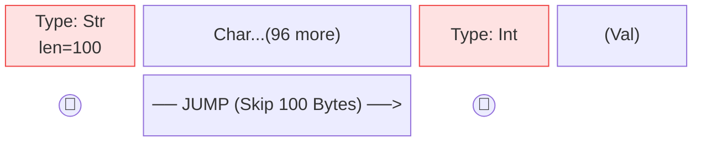

# 🗂️ Resource Manager

ResourceManager 是 AutoCRUD 的核心類別，負責管理各類型資源的 CRUD、版本、索引、權限、事件等操作。以下文檔將介紹其主要功能、常用方法與使用範例。

---

## Resource 管理哲學

- **專注業務邏輯**：metadata 自動管理，業務只需定義資料本體  

    所有資源的 metadata（如 id、建立者、時間、schema 版本等）與本體分離，減少重複設計，支援自動生成、查詢、排序、索引。  
    開發者不再需要為每個資源重複定義 `id`、`created/updated by/time` 或 `hash` 等基礎欄位。這免除了每次建立資源時都要面臨的瑣碎決策：應該用 `int id` 還是 `str id`？是否 auto-increment？時區該如何處理？AutoCRUD 統一標準化了這些與業務無關但必要的技術架構。

    ➡️ *[Resource Meta 與 Revision Info](#resource-meta-revision-info)*

- **完整版本控管**：所有操作均可回溯、復原  

    每次更新、刪除都會產生新版本（revision），可回溯歷史、切換版本，支援列出所有版本、還原已刪除資源。  
    ➡️ *[版本管理](#version-control)*

- **多元儲存機制**: 提供PostgreSQL, S3, Redis

    metadata與本體分開儲存: metadata可使用RDMBS以便快速查找任意index欄位,
    本體使用S3或Disk, 以便快速以key-value方式讀取  
    ➡️ *[Storage](auto_routes.md#storage)*

- **事件驅動架構 (Event Driven)**: 支援 Sync 與 Async 處理

    - **Sync (同步)**: 直接介入 Request 週期 (Before/After)，適合驗證、交易一致性更新。
    - **Async (非同步)**: 透過整合 Message Queue 或 Background Tasks 處理耗時任務，不阻塞 API 回應。
    ➡️ *[Event Handling](#event-handling)*

- **彈性的結構變更**：schema 版本控管，支援自訂搬遷邏輯  

    當需要不相容的結構更新時，僅須定義最小化/僅業務的搬遷邏輯，即可支援自動升級與資料遷移。  
    ➡️ *[Schema Migration](#schema-migration)*

- **進階功能皆以資源為中心**：權限、事件驅動、備份

    權限檢查可細緻到資源層級，事件處理支援多階段，索引查詢與資料備份還原皆方便整合第三方功能。  
    ➡️ *[Advance Usage](#advance-usage)*

---

## Resource Manager 與一般 ORM（如 SQLAlchemy）的差異

- **沒有 Foreign Key（外鍵），行為明確在程式碼**

    - 行為不藏在資料庫設定：外鍵常啟用 `ON DELETE/UPDATE CASCADE`、`SET NULL` 等自動行為；一旦在 DB 層啟用，即使更動應用程式邏輯也會持續生效，導致行為不完全體現在程式碼、從程式碼角度難以審核與測試（除非同步調整 DB schema）。  
    - 索引不等於外鍵：若目標只是查詢效能或標記關聯，建立索引即可，未必要外鍵。外鍵的核心是參照完整性與（可選的）自動行為，而非查詢能力；需要 DB 級一致性才用外鍵，不需要時用索引即可。  
    - 不提供關聯與外鍵標記：AutoCRUD 不支援跨資源「關聯」或外鍵標記，也不會在 DB 層面強制參照完整性或啟用自動行為。你可在結構中自行存放其他資源的 `resource_id` 或 `revision_id` 作為業務欄位，但框架不視為外鍵、也不產生隱性副作用。  
    - 所見即所得、事件驅動：所有行為都在程式碼中明確呈現；需要級聯刪除或同步更新時，請以事件處理器（event handler）顯性實作。沒有 handler，就不做隱性動作。系統因此更單純、易讀、可測、可審計。  

- **版本控制**

    - 版本是核心概念：每次建立、更新、修補都會產生新版本（revision），完整保留歷史；一般 ORM 多以覆蓋更新為主，版本留存需自行設計。  
    - 可切換與還原：支援列出版本、讀取任意版本、切換到指定版本、軟刪除後還原；一般 ORM 通常不原生提供版本切換與還原。  
    - 草稿與正式分離：草稿（draft）狀態允許不進版修改（`modify`），確認後再進版為正式（stable）；多數 ORM 不內建此狀態流與不進版編輯。  
    - 刪除仍保留歷史：刪除為軟刪除，資料與版本仍在；一般 ORM 的刪除常為硬刪除或需自行擴充。  
    - 查詢與審計友善：版本完整、行為可回溯，適合比對、審核、恢復；一般 ORM 需額外審計表或事件機制才有同等能力。  
    
    ➡️ *[版本管理](#version-control)*

- **Schema Migration**
    - 類似 [Alembic](https://alembic.sqlalchemy.org/en/latest/)，但更強調「跨版本欄位變動」的可觀測性。
    - 僅需提供一個函式：輸入舊版 schema 的資料（`IO[bytes]`），輸出新版 schema 的物件。
    - 遷移細節由你掌握，簡單透明。  

    ➡️ *[Schema Migration](#schema-migration)*

- **Pure Python**
    - 完全以 Python 實作與使用，無框架耦合與隱性魔術；易讀、易測、易整合，部署與維運成本低。

- **Event Driven**
    - 以事件驅動擴展行為：支援自訂事件處理器（event handler）在建立、更新、刪除、遷移等階段插入邏輯。
    - 需要級聯刪除、同步更新、通知等流程時，透過事件顯性實作；未註冊事件則不做隱性動作。

- **權限管理**
    - 以資源為中心的權限檢查：可注入 `IPermissionChecker`，細緻到資源/版本層級的讀寫控制。
    - 支援情境化權限（依使用者、時間、狀態）、複合策略與審計需求，易於與既有認證系統整合。

---

## 註冊資源

透過 AutoCRUD 來註冊模型並取得 ResourceManager 實例：

```{code-block} python
:emphasize-lines: 9
from autocrud import AutoCRUD
from msgspec import Struct

class TodoItem(Struct):
    title: str
    completed: bool

autocrud = AutoCRUD(default_user="user", default_now=datetime.now)
autocrud.add_model(TodoItem)
manager = autocrud.get_resource_manager(TodoItem)
```

你可以在 add_model 時指定 storage、migration、indexed_fields 等參數，AutoCRUD 會自動建立並管理 ResourceManager。

```{code-block} python
:emphasize-lines: 3
autocrud.add_model(
    TodoItem,
    indexed_fields=["completed"],
)
```


---

### Terminology

| 方法 | 說明 | 範例 |
|------|------|------|
| `resource_type` | 資源的型別 | TodoItem |
| `resource_id` | 資源的唯一識別碼，每個資源都會有一個獨立的 resource_id。類似 Git repo 的名稱，不管內容怎麼改，檔案名稱都不變。| `todo-item:1fff687d5e8f` |
| `revision_id` | 資源版本的唯一識別碼，每次資源內容變更（如更新、修改）都會產生新的 revision_id（進版）。像是 Git 的 commit hash，每次 commit 都會產生一個新的 hash，並且紀錄誰更新, 何時更新。| `todo-item:1fff687d5e8f:1` |
| `resource_name` | 資源類別名稱, 從autocrud取得manager時或是自動生成的CRUD API endpoint用到。| todo-item |
| `revision_status` | 資源目前版本的狀態，常見有 stable（穩定）、draft（草稿）等，影響可執行的操作。當狀態為 stable 時，無法執行不進版的修改（modify），僅 draft 狀態可用。| stable/draft |
| `indexed_field` | 被索引的欄位，用於快速查找，排序資源。| title/completed  |
| `schema_version` | 資源的 schema 版本。| None/v1 |

---

## 資源操作方法

| 方法 | 說明 |
|------|------|
| [＃建立](#create)|
| [`create(data, status=...)`](#autocrud.resource_manager.core.ResourceManager.create)                                       | 建立新資源 |
| [＃讀取](#read)|
| [`get(resource_id)`](#autocrud.resource_manager.core.ResourceManager.get)                                                  | 取得資源最新版本 |
| [`get_resource_revision(resource_id, revision_id)`](#autocrud.resource_manager.core.ResourceManager.get_resource_revision) | 取得指定版本 |
| [`search_resources(query)`](#autocrud.resource_manager.core.ResourceManager.search_resources)                              | 查詢資源（支援索引, 分頁, 排序）|
| [`count_resources(query)`](#autocrud.resource_manager.core.ResourceManager.count_resources)                                | 計算資源數量 |
| [`list_revisions(resource_id)`](#autocrud.resource_manager.core.ResourceManager.list_revisions)                            | 列出所有版本 |
| [＃更新](#update)|
| [`update(resource_id, data, status=...)`](#autocrud.resource_manager.core.ResourceManager.update)                          | 全量更新資源，會產生新的 revision id（進版） |
| [`patch(resource_id, patch_data)`](#autocrud.resource_manager.core.ResourceManager.patch)                                  | 套用 JSON Patch，會產生新 revision id（進版） |
| [`modify(resource_id, data/patch, status=...)`](#autocrud.resource_manager.core.ResourceManager.modify)                    | 全量或局部更新，不會產生新 revision id（不進版），僅限資源狀態為 draft，狀態為 stable 時會失敗 |
| [`switch(resource_id, revision_id)`](#autocrud.resource_manager.core.ResourceManager.switch)                               | 切換到指定版本 |
| [＃刪除](#delete) |
| [`delete(resource_id)`](#autocrud.resource_manager.core.ResourceManager.delete)                                            | 軟刪除資源 |
| [`restore(resource_id)`](#autocrud.resource_manager.core.ResourceManager.restore)                                          | 還原已刪除資源 |
| [＃管理](#management)|
| [`migrate(resource_id)`](#autocrud.resource_manager.core.ResourceManager.migrate)                                          | 執行 schema 遷移 |
| [`dump()`](#autocrud.resource_manager.core.ResourceManager.dump)                                                           | 備份所有資源資料 |
| [`load(key, bio)`](#autocrud.resource_manager.core.ResourceManager.load)                                                   | 還原資料 |

### Create

建立新資源，會產生獨立的 resource_id 與第一個 revision。  
常用於新增資料，支援指定初始狀態（如 draft/stable）。

- [`create(data, status=...)`](#autocrud.resource_manager.core.ResourceManager.create)：建立新資源，回傳`ResourceMeta`。

```python
manager: ResourceManager[TodoItem]
# 建立一個新的 TodoItem 資源
info: ResourceMeta = manager.create(TodoItem(title="買牛奶", completed=False), status="draft")
print(info.resource_id)  # 取得新資源的 resource_id
```

---

### Read

取得資源最新版本或指定版本，支援查詢、分頁、排序、計數、版本列表。

- [`get(resource_id, revision_id: str|UnsetType=UNSET)](#autocrud.resource_manager.core.ResourceManager.get)：取得資源最新版本。

When `revision_id` is not set, use the latest revision.

```python
# 取得指定 resource_id 的當前版本
resource = manager.get(resource_id)
print(resource.data)  # resource data
print(resource.info)  # resource info
```

- [`get_resource_revision(resource_id, revision_id)`](#autocrud.resource_manager.core.ResourceManager.get_resource_revision)：取得指定版本內容。

```python
# 取得指定 resource_id 與 revision_id 的版本內容
resource = manager.get_resource_revision(resource_id, revision_id)
print(resource.data)  # resource data
print(resource.info)  # resource info
```

- [`get_partial(resource_id, revision_id: str|UnsetType=UNSET, partial: list[str|JsonPointer])`](#autocrud.resource_manager.core.ResourceManager.get_partial)：取得資源的部分內容，支援巢狀欄位與 List Slicing。

```{versionadded} 0.6.8
```

When `revision_id` is not set, use the latest revision.

```python
# 取得部分欄位
data = manager.get_partial(
    resource_id,
    partial=["title", "completed"]
)

# 支援巢狀欄位與 List Slicing
# 例如：取得 sub_items 前兩筆的 title，以及所有 sub_items 的 completed
data = manager.get_partial(
    resource_id,
    partial=[
        "sub_items/:2/title",     # 前兩筆 sub_items 的 title
        "sub_items/-/completed"   # 所有 sub_items 的 completed
    ]
)
```

```{seealso}
[Partial Read](#partial-read)
```

- [`search_resources(query)`](#autocrud.resource_manager.core.ResourceManager.search_resources)：依條件查詢資源（支援索引、分頁、排序）。

```{important}
使用data_conditions必須先建立該field的index, 參考[這裡](#data-attribute-index)獲得更多資訊。
```
```{seealso}
[Resource Searching](#resource-searching)
```

```python
from autocrud.types import ResourceMetaSearchQuery, DataSearchCondition

# 查詢已完成的 TodoItem
query = ResourceMetaSearchQuery(
    # 使用data_conditions必須先建立該field的index
    data_conditions=[
        DataSearchCondition(field_path="completed", operator="eq", value=True)
    ]
)
metas = manager.search_resources(query)
for meta in metas:
    print(meta.resource_id, meta.indexed_data)
```

- [`count_resources(query)`](#autocrud.resource_manager.core.ResourceManager.count_resources)：計算符合條件的資源數量。

```python
# 計算已完成的 TodoItem 數量
count = manager.count_resources(query)
print("已完成數量:", count)
```

- [`list_revisions(resource_id)`](#autocrud.resource_manager.core.ResourceManager.list_revisions)：列出所有版本資訊。

```python
# 列出指定 resource_id 的所有版本資訊
revisions = manager.list_revisions(resource_id)
for rev in revisions:
    print(rev.revision_id, rev.status, rev.created_time)
```

---

### Update

更新資源內容，分為進版（產生新 revision）與不進版（僅限 draft 狀態）。
```{seealso}
[版本管理](#version-control)
```  

- [`update(resource_id, data, status=...)`](#autocrud.resource_manager.core.ResourceManager.update)：全量更新，進版。

```python
# 全量更新資源內容，並進版
manager.update(resource_id, TodoItem(title="新標題", completed=True), status="stable")
```

- [`patch(resource_id, patch_data)`](#autocrud.resource_manager.core.ResourceManager.patch)：套用 JSON Patch，進版。

```python
from jsonpatch import JsonPatch

# 局部更新（JSON Patch），並進版
patch = JsonPatch([{"op": "replace", "path": "/completed", "value": True}])
manager.patch(resource_id, patch)
```

```{seealso}
JSON Patch 定義了一種 JSON 文件結構，用來描述一連串要套用在JSON上的操作序列；這種格式適合用於 HTTP PATCH 方法。  

- [Python `jsonpatch`官方文檔](https://python-json-patch.readthedocs.io/en/latest/tutorial.html#creating-a-patch)
- [JSON Patch (RFC6902) 官方文檔](https://datatracker.ietf.org/doc/html/rfc6902)
```

- [`modify(resource_id, data/patch, status=...)`](#autocrud.resource_manager.core.ResourceManager.modify)：不進版更新（僅 draft 可用）。

```python
# 草稿狀態下直接修改內容（不進版）
manager.modify(resource_id, TodoItem(title="draft修改", completed=False))
# 或用 patch
manager.modify(resource_id, JsonPatch([{"op": "replace", "path": "/title", "value": "draft again"}]))
```

- [`switch(resource_id, revision_id)`](#autocrud.resource_manager.core.ResourceManager.switch)：切換到指定版本。

```python
# 切換到指定 revision_id 的版本
manager.switch(resource_id, revision_id)
```

---

### Delete

軟刪除資源，保留所有版本，可隨時還原。

- [`delete(resource_id)`](#autocrud.resource_manager.core.ResourceManager.delete)：軟刪除資源。

```python
# 軟刪除指定資源
manager.delete(resource_id)
```

- [`restore(resource_id)`](#autocrud.resource_manager.core.ResourceManager.restore)：還原已刪除資源。

```python
# 還原已刪除的資源
manager.restore(resource_id)
```

---

### Management

進行 schema 遷移、資料備份與還原。

- [`migrate(resource_id)`](#autocrud.resource_manager.core.ResourceManager.migrate)：執行 schema migration。  
```{seealso}
[Schema Migration](#schema-migration)
```  

```python
# 執行 schema migration
manager.migrate(resource_id)
```

- [`dump()`](#autocrud.resource_manager.core.ResourceManager.dump)：備份所有資源資料。

```python
# 備份所有資源資料
backup = manager.dump()
```

- [`load(key, bio)`](#autocrud.resource_manager.core.ResourceManager.load)：還原資料。

```python
# 還原資料
with open("backup_file", "rb") as bio:
    manager.load(key, bio)
```

---

## 使用範例

```{code-block} python
:emphasize-lines: 13,16,20,23,26
from autocrud.resource_manager import ResourceManager
from autocrud.storage import LocalStorage

# 假設有一個 TodoItem 結構
class TodoItem(Struct):
    title: str
    completed: bool

storage = LocalStorage()
manager = ResourceManager(TodoItem, storage=storage)

# 建立資源
info = manager.create(TodoItem(title="test", completed=False))

# 查詢資源
resource = manager.get(info.resource_id)
print(resource.data)

# 更新資源
manager.update(info.resource_id, TodoItem(title="done", completed=True))

# 刪除資源
manager.delete(info.resource_id)

# 還原資源
manager.restore(info.resource_id)
```

---

## Resource Meta 與 Revision Info

Resource Meta 負責資源的整體狀態與索引，Revision Info 負責每個版本的細節與追蹤。

**Resource Meta 紀錄資源層級的資訊**
- `resource_id`：資源唯一識別碼
- `current_revision_id`：目前版本的 revision id
- `schema_version`：目前資料結構的版本
- `total_revision_count`：該資源的所有版本數量
- `created_time` / `updated_time`：建立與更新時間
- `created_by` / `updated_by`：建立者與最後更新者
- `is_deleted`：是否已刪除
- `indexed_data`：用於快速查找的索引欄位

**Revision Info 紀錄每個版本的詳細資訊**
- `revision_id`：版本唯一識別碼
- `parent_revision_id`：父版本 id（如有）
- `schema_version` / `parent_schema_version`：本版與父版的 schema 版本
- `data_hash`：資料雜湊值（用於比對內容是否變更）
- `status`：版本狀態（stable/draft）
- `created_time` / `updated_time`：建立與更新時間
- `created_by` / `updated_by`：建立者與最後更新者


## Partial Read

```{versionadded} 0.6.8
```

`get_partial` 允許你僅讀取資源的部分欄位，這在處理大型物件或僅需少量資訊時非常有用。

### Why would you care

使用 `get_partial` 可以顯著提升讀取效能，特別是在處理大型物件時。

想像一個情境：您的資源物件中包含大量的資料（例如 `artifacts` 列表），但此次操作僅需讀取部分欄位（例如 `name`）。若完整解碼整個物件，將會造成不必要的效能浪費。

為了驗證 `get_partial` 的效益，我們設計了一個基準測試（Benchmark）。在此實驗中，我們建立包含 1,000 個 `artifacts` 的使用者物件，其中每個 `artifact` 的 `type` 欄位皆為 200 至 20,000 字元的隨機字串。

我們比較了以下幾種處理方式的效能差異：

| | Partial Read | Full Read |
| :--- | :--- | :--- |
| | 完整解析整個 JSON/Msgpack 物件| 僅解析並讀取部分欄位，略過不必要的資料以提升效能 |
| **msgspec (msgpack)** | ✅ (最快) | ✅ |
| **msgspec (json)** | ✅ | ✅ |
| **pydantic (json)** | ✅ | ✅ |

使用的資料結構如下(json)
```json
{
  "name": "Hero",
  "artifacts": [
    {
      "id": "artifact_0",
      "type": "...",
      "power": 123
    },
    ...
  ],
  "level": 10
}
```

以下是效能測試結果：

Benchmark Results (ms):

| Method | Time (ms) | vs Fastest | Partial Speedup | Runs |
| :--- | :--- | :--- | :--- | :--- |
| msgspec+msgpack+partial | 0.0274 | 1.00x | **🚀 31.6x** (vs Full) | 37007 |
| msgspec+msgpack | 0.8671 | 31.63x | - | 1101 |
| msgspec+json+partial | 2.0374 | 74.31x | ⚡ 1.16x (vs Full) | 490 |
| msgspec+json | 2.3715 | 86.50x | - | 421 |
| pydantic+partial | 2.4517 | 89.42x | ⚡ 1.48x (vs Full) | 409 |
| pydantic | 3.6218 | 132.10x | - | 267 |

> **觀察重點**：Msgpack 在開啟 Partial Read 後，效能提升了 **31.6 倍**；而 JSON 僅提升約 **1.16 倍**。這驗證了 Msgpack 的「長度標頭型跳過」遠比 JSON 的「循序掃描」更適合局部讀取。


完整測試腳本請參考 `examples/benchmark_partial.py`。

#### 為什麼我們推薦使用 Msgpack 進行 Partial Read？

Msgpack 是一種二進位序列化格式，它比 JSON 更適合「局部讀取」的核心原因在於其 **「可預測的跳過機制 (Efficient Skipping)」**：

1.  **自帶長度標頭 (Length-Prefixed)**：
    *   在 Msgpack 中，字串、陣列或地圖 (Map) 的開頭都會包含該資料的 **長度資訊**。
    *   **優勢**：當 `msgspec` 的解碼器遇到一個不需要的欄位時，它只需讀取標頭中的長度，就能直接計算出下一個欄位的記憶體偏移量 (Offset) 並直接「跳過」該段位元組，完全不需要讀取內容。



2.  **JSON 的侷限性**：
    *   JSON 是一種文字格式，必須透過 **循序掃描 (Sequential Scanning)** 來尋找結束符號（如引號 `"`、大括號 `}`）。
    *   **劣勢**：即使解碼器不需要某個大字串欄位，它仍必須讀取該欄位的每一個字元來確認哪裡才是結尾（並處理轉義字元 `\`），這會消耗大量的 CPU 週期。


3.  **極致的 CPU 優化**：
    *   結合 `msgspec` 預編譯的解碼器，Msgpack 的跳過操作幾乎等同於一次簡單的記憶體指標運算。這也是為什麼在基準測試中，Msgpack 的 Partial Read 效能可以達到 JSON 的數倍甚至數十倍。

**總結：** 如果您的資源包含大型二進位資料、長文本或深層巢狀結構，切換至 Msgpack 將能最大化 Partial Read 的效能收益。

#### Partial Schema 與生成物件

當你呼叫 `get_partial` 時，AutoCRUD 會根據你提供的 `partial` 路徑動態生成一個新的 `Struct` 型別。這個新生成的型別會盡可能保留原始 Schema 的結構，但僅包含你請求的欄位。

- **欄位保留**：請求的欄位會保留其原始型別。
- **未請求欄位**：未被請求的欄位將不會出現在生成的物件中（或被標記為 `Unset`）。
- **結構一致性**：生成的物件結構與原始物件結構一致，這意味著你可以像操作原始物件一樣操作 Partial 物件，只是可用的欄位變少了。

例如，若原始 `TodoItem` 結構如下：

```python
class TodoItem(Struct):
    title: str
    completed: bool
    sub_items: list[SubItem]
```

當你請求 `partial=["title"]` 時，回傳的物件型別將類似於：

```python
class Partial_TodoItem(Struct):
    title: str
    # completed 與 sub_items 不存在
```

這確保了型別安全與序列化的效率。

#### Path Syntax (路徑語法)

`partial` 參數接受一組路徑字串或 `JsonPointer`。

```{note}
此語法為 **JsonPointer 的超集 (Superset)**。
除了標準 JsonPointer 規範外，我們額外擴充了：
1. **非強制開頭斜線**：例如 `"boss/name"` 等同於 `"/boss/name"`。
2. **列表切片 (Slicing)**：支援使用 `:` 進行 Python 風格的切片操作。
```

支援豐富的語法來精確選取資料：

- **巢狀欄位**：使用 `/` 分隔層級。
    - `"boss/name"`：選取 `boss` 物件內的 `name`。

- **列表索引 (Index)**：指定特定索引。
    - `"items/0/name"`：選取 `items` 列表第 1 筆的 `name`。

- **列表通配符 (Wildcard)**：使用 `-` 代表全部。
    - `"items/-/name"`：選取 `items` 列表所有項目的 `name`。

- **列表切片 (Slicing)**：支援 Python 風格的切片語法。
    - `"items/:2/name"`：前 2 筆 (`[:2]`)。
    - `"items/1:3/name"`：第 2 到 3 筆 (`[1:3]`)。
    - `"items/::2/name"`：每間隔 2 筆 (`[::2]`)。

**範例：**

假設原始資源資料如下：

```python
data = {
    "title": "Project A",
    "priority": "High",
    "assignee": {
        "name": "Alice",
        "email": "alice@example.com"
    },
    "sub_items": [
        {"title": "Task 1", "completed": True},
        {"title": "Task 2", "completed": False},
        {"title": "Task 3", "completed": False},
        {"title": "Task 4", "completed": True}
    ]
}
```

**1. 基本欄位與巢狀物件**

```python
partial = ["title", "assignee/name"]
# 結果：
{
    "title": "Project A",
    "assignee": {
        "name": "Alice"
    }
}
```

**2. 列表通配符 (Wildcard)**

```python
partial = ["sub_items/-/title"]
# 結果：
{
    "sub_items": [
        {"title": "Task 1"},
        {"title": "Task 2"},
        {"title": "Task 3"},
        {"title": "Task 4"}
    ]
}
```

**3. 列表切片 (Slicing)**

取得前兩筆 sub_items 的 title：

```python
partial = ["sub_items/:2/title"]
# 結果：
{
    "sub_items": [
        {"title": "Task 1"},
        {"title": "Task 2"}
    ]
}
```

**4. 複雜組合**

取得 title 以及每間隔 2 筆 sub_items 的 completed 狀態：

```python
partial = ["title", "sub_items/::2/completed"]
# 結果：
{
    "title": "Project A",
    "sub_items": [
        {"completed": True},  # Task 1
        {"completed": False}  # Task 3
    ]
}
```

### Resource Searching

```{code-block} python
:emphasize-lines: 3-6
# query過去7天內建立的todo items
manager = autocrud.get_resource_manager(TodoItem)
query = ResourceMetaSearchQuery(
    created_time_start=datetime.now()-timedelta(days=7)
)
metas: list[ResourceMeta] = manager.search_resources(query)
count = manager.count_resources(query)
assert len(metas) == count
```

| 欄位 | 說明 | 型別 |
|------|------|------|
| [`is_deleted`](#autocrud.types.ResourceMetaSearchQuery.is_deleted)                  |資源是否被刪除                 | bool                                |
| [`created_time_start`](#autocrud.types.ResourceMetaSearchQuery.created_time_start)  |在這之後建立（含）                   | datetime                    |
| [`created_time_end`](#autocrud.types.ResourceMetaSearchQuery.created_time_end)      |在這之前建立（含）                   | datetime                      |
| [`updated_time_start`](#autocrud.types.ResourceMetaSearchQuery.updated_time_start)  |在這之後修改（含）                   | datetime                    |
| [`updated_time_end`](#autocrud.types.ResourceMetaSearchQuery.updated_time_end)      |在這之前修改（含）                   | datetime                      |
| [`created_bys`](#autocrud.types.ResourceMetaSearchQuery.created_bys)                |誰建立                         | list[str]                          |
| [`updated_bys`](#autocrud.types.ResourceMetaSearchQuery.updated_bys)                |誰更新                         | list[str]                          |
| [`conditions`](#autocrud.types.ResourceMetaSearchQuery.conditions)                  |使用meta欄位或data的indexed fields搜尋 (see [General Filtering](#general-filtering-meta-data)) (**New in 0.6.9**) | list[DataSearchCondition or DataSearchGroup]                     |
| [`data_conditions`](#autocrud.types.ResourceMetaSearchQuery.data_conditions)        |(Deprecated) 使用data的indexed fields搜尋 (see [Data Search Filter](#data-search-filter) and [data attribute index](#data-attribute-index))  | list[DataSearchCondition or DataSearchGroup]                     |
| [`sorts`](#autocrud.types.ResourceMetaSearchQuery.sorts)                            |sort fields (see [sorting](#sorting))                    | list[ResourceMetaSearchSort or ResourceDataSearchSort] |
| [`limit`](#autocrud.types.ResourceMetaSearchQuery.limit)                            |pagination limit (see [pagination](#pagination))               | int = 10                                            |
| [`offset`](#autocrud.types.ResourceMetaSearchQuery.offset)                          |pagination offset (see [pagination](#pagination))              | int = 0                                            |


#### Data Attribute Index

你可以在`AutoCrud.add_model`時指定需要index的attributes有哪些, 
ResourceMeta會根據設定負責紀錄需要作為索引的attributes。
想要搜尋時即可使用indexed fields最為篩選條件。

```{code-block} python
:emphasize-lines: 3-11,18
autocrud.add_model(
    TodoItem,
    indexed_fields=[
        # to use completed as an index.
        "completed",
        # ("completed", bool),
        # IndexableField("completed", str)
        
        # to use type as an index
        IndexableField("type", SpecialIndex.msgspec_tag)
    ]
)
...
manager = autocrud.get_resource_manager(TodoItem)
metas = manager.search_resources(ResourceMetaSearchQuery(
    data_conditions=[
        DataSearchCondition(
            field_path="completed", operator="eq", value=True,
        ),
    ]
))
```

`DataSearchCondition`與`DataSearchGroup`可以提供基本的搜尋功能，詳細使用方式可以參考[DataSearchCondition](#autocrud.types.DataSearchCondition)與[DataSearchGroup](#autocrud.types.DataSearchGroup)

#### General Filtering (Meta & Data)

```{versionadded} 0.6.9
```

`conditions` 提供了統一的搜尋介面，可用於篩選 **Metadata** (如 `resource_id`, `created_time`) 與 **Index Data** 欄位。這比舊有的 `data_conditions` 更具彈性。

**支援的 Metadata 欄位**:
- `resource_id`, `revision_id`
- `created_time`, `updated_time`
- `created_by`, `updated_by`
- `is_deleted`

```python
# 同時過濾 Metadata (created_time) 與 Data (completed)
query = ResourceMetaSearchQuery(
    conditions=[
        DataSearchCondition(field_path="created_time", operator="gt", value=datetime(2023, 1, 1)),
        DataSearchCondition(field_path="completed", operator="eq", value=True)
    ]
)
```

`conditions` (與舊的 `data_conditions`) 支援複雜的邏輯組合，包括 `AND`、`OR`、`NOT` 以及巢狀條件。
這是一個遞迴定義的結構，由 `DataSearchCondition` (基本條件) 與 `DataSearchGroup` (邏輯群組) 組成。

**DataSearchCondition (基本條件)**

這是搜尋過濾的最基本單位，用於對單一欄位進行判斷。

- **field_path** (`str`): 目標欄位的路徑 (必須是已建立索引的欄位)。
- **value** (`Any`): 用於比對的值。
- **operator** (`DataSearchOperator`): 比對運算子，支援以下操作：

    | Operator | Code | 說明 |
    | :--- | :--- | :--- |
    | **Equality** | | |
    | `equals` | `"eq"` | 等於 (`==`) |
    | `not_equals` | `"ne"` | 不等於 (`!=`) |
    | **Existence** | | |
    | `is_null` | `"is_null"` | 值為 Null |
    | `exists` | `"exists"` | 欄位存在 |
    | `isna` | `"isna"` | 值為 Null 或 不存在 (類似 JS `== null`) |
    | **Comparison** | | |
    | `greater_than` | `"gt"` | 大於 (`>`) |
    | `greater_than_or_equal` | `"gte"` | 大於等於 (`>=`) |
    | `less_than` | `"lt"` | 小於 (`<`) |
    | `less_than_or_equal` | `"lte"` | 小於等於 (`<=`) |
    | **String** | | |
    | `contains` | `"contains"` | 字串包含 |
    | `starts_with` | `"starts_with"` | 字串開頭為 |
    | `ends_with` | `"ends_with"` | 字串結尾為 |
    | `regex` | `"regex"` | 正規表達式匹配 |
    | **List** | | |
    | `in_list` | `"in"` | 值在列表中 |
    | `not_in_list` | `"not_in"` | 值不在列表中 |

```python
from autocrud.types import DataSearchCondition, DataSearchOperator

# 範例：搜尋 completed 等於 True
condition = DataSearchCondition(
    field_path="completed",
    operator=DataSearchOperator.equals, # 或直接用字串 "eq"
    value=True
)
```

**DataSearchGroup (邏輯群組)**

```{versionadded} 0.6.8
```

用於組合多個 `DataSearchCondition` 或其他的 `DataSearchGroup`，實現複雜的邏輯運算。

- **conditions** (`list[DataSearchCondition | DataSearchGroup]`): 包含的條件列表。
- **operator** (`DataSearchLogicOperator`): 邏輯運算子，決定如何組合列表中的條件。

    | Operator | Code | 說明 |
    | :--- | :--- | :--- |
    | `and_op` | `"and"` | 所有條件皆須符合 (AND) |
    | `or_op` | `"or"` | 任一條件符合即可 (OR) |
    | `not_op` | `"not"` | 反轉條件結果 (NOT) |

```python
from autocrud.types import DataSearchGroup, DataSearchLogicOperator

# 範例：搜尋 (age < 20) OR (age > 60)
group = DataSearchGroup(
    operator=DataSearchLogicOperator.or_op, # 或直接用字串 "or"
    conditions=[
        DataSearchCondition(field_path="age", operator="lt", value=20),
        DataSearchCondition(field_path="age", operator="gt", value=60),
    ]
)
```

**巢狀組合範例 (Nested Logic)**

你可以自由巢狀組合 Group 與 Condition 來表達任意複雜度的查詢邏輯。

```python
# 範例：搜尋 (status == 'active') AND ((age < 20) OR (age > 60))
complex_filter = DataSearchGroup(
    operator="and",
    conditions=[
        DataSearchCondition(field_path="status", operator="eq", value="active"),
        DataSearchGroup(
            operator="or",
            conditions=[
                DataSearchCondition(field_path="age", operator="lt", value=20),
                DataSearchCondition(field_path="age", operator="gt", value=60),
            ]
        )
    ]
)

manager.search_resources(ResourceMetaSearchQuery(
    # 使用 conditions
    conditions=[complex_filter]
))
```

#### Data Search Filter (Legacy)

**Deprecated**. `data_conditions` 參數已棄用，請使用上面的 `conditions` (General Filtering)。用法完全相同，差別僅在於 `conditions` 額外支援 metadata 欄位。

#### Sorting

可以使用內建的key來排序，也可以使用[data attribute index](#data-attribute-index)。

```python
# 取得 todo items，先依 completed 排序，再依建立時間排序（升冪）
query = ResourceMetaSearchQuery(
    sorts=[
        # 先依 completed 欄位（已完成在前）排序
        ResourceDataSearchSort(direction="+", field_path="completed"),
        # 再依 created_time（建立時間）排序
        ResourceMetaSearchSort(direction="+", key="created_time"),
    ]
)
```
詳細使用方式可以參考[ResourceDataSearchSort](#autocrud.types.ResourceDataSearchSort)與[ResourceMetaSearchSort](#autocrud.types.ResourceMetaSearchSort)

#### Pagination

這個function示範如何用 limit/offset 參數分批取得查詢結果：

- `limit` 設定每頁最大筆數（這裡用 page_size+1 是為了判斷是否還有下一頁）。
- `offset` 設定目前查詢的起始位置。
- 每次查詢後，`yield` 回傳本頁資料，並判斷是否已到最後一頁（如果回傳筆數 <= page_size 就結束）。
- 這種寫法適合用在大量資料分頁查詢，避免一次載入全部資料造成記憶體壓力。

你可以根據需求調整 page_size，或在 yield 前做資料處理。

```python
def pagination_recipe(query: ResourceMetaSearchQuery):
    query = copy(query)
    page_size = 10
    page_index = 0
    query.limit = page_size+1
    while True:
        query.offset = page_index*page_size
        page_index += 1
        with manager.meta_provide(user, now):
            metas = manager.search_resources(query)
        yield metas[:page_size]
        if len(metas) <= page_size:
            break
```

---

## 版本管理 (Version Control)

AutoCRUD 的版本管理機制，旨在確保每一次資源內容的變更都能被完整記錄、回溯與還原。每個資源都擁有獨立的版本編號（revision id），不論是建立、更新、修改或刪除，都會留下歷史紀錄，方便日後查詢、比對、審計與復原。

這種設計特別適合需要審核流程、草稿反覆編輯、正式版本控管、以及資料安全的場景。無論是草稿階段的暫存、正式發佈的進版、或是誤刪後的還原，都能透過版本管理功能輕鬆實現。

### 進版或不進版

AutoCRUD 的版本管理設計，讓每次資源內容變更都能被完整記錄與回溯。

**進版（create/update/patch）**：
每次呼叫 create、update 或 patch 方法時，系統都會產生新的 revision id，代表一次「進版」操作。這樣可以保留所有歷史版本，方便查詢、比對、還原。

**不進版（modify）**：
只有在資源狀態為 draft（草稿）時，才允許直接修改內容而不產生新 revision id。這種修改僅限於草稿階段，適合反覆編輯、暫存，等到內容確定後再進版。

**查詢與切換版本**：
可用 list_revisions 取得所有 revision id，並用 get_resource_revision 取得任意版本內容。switch 可切換目前版本到任意 revision。

**還原已刪除資源**：
delete 為軟刪除，所有版本仍保留，可用 restore 還原。

這種設計讓資源管理既安全又彈性，能滿足審計、回溯、草稿編輯等多種需求。

---

#### 進版與不進版的實務建議

- **草稿流程**：在內容尚未確定前，建議先將資源 update 成 draft 狀態，再用 modify 反覆編輯內容，最後再用 modify 將狀態切換為 stable，這樣可以避免產生過多無用版本。
    典型流程如下：
    1. 先用 `update(resource_id, ..., status="draft")` 產生 draft 版本。
    2. 用 `modify(resource_id, new_data)` 反覆編輯內容。
    3. 確認內容後，用 `modify(resource_id, ..., status="stable")` 進版為正式。
- **回溯/比對**：所有進版操作都會保留歷史版本，可隨時用 get_resource_revision 取得任意版本內容，或用 switch 切換目前版本，方便比對差異或還原。
- **刪除與還原**：delete 只會標記資源為已刪除，所有版本仍保留，隨時可用 restore 還原，確保資料安全。


#### 狀態切換：stable 改為 draft

若資源目前為 stable 狀態，想要重新進入草稿模式（draft）以便修改，可以直接呼叫：

```python
# 將 stable 狀態改為 draft，並可繼續用 modify 編輯
mgr.modify(resource_id, status="draft")
```
此操作會將資源狀態切換為 draft，之後即可用 modify 反覆編輯內容，直到把status改為stable或是再次進版。

#### API 操作流程範例

```python
# 建立草稿
info = manager.create(data, status="draft")
# 草稿階段反覆修改
manager.modify(info.resource_id, new_data)
# 草稿確認後進版
manager.update(info.resource_id, final_data)
# 取得所有版本
revisions = manager.list_revisions(info.resource_id)
# 切換到舊版本
manager.switch(info.resource_id, revisions[0])
# 軟刪除資源
manager.delete(info.resource_id)
# 還原已刪除資源
manager.restore(info.resource_id)
```

---

## Schema Migration

你只需要提供必要的schema升級邏輯，其他的雜事都由AutoCRUD處理。

當你需要breaking change時，可以告訴AutoCRUD該如何把舊資料舊格式換成新格式，你可以在`add_model`時注入`Migration`。

### 案例

原始`TodoItem`的schema想要加入`category: str`。

```python
# 原始TodoItem schema
class TodoItem(Struct):
    title: str
    completed: bool

autocrud = AutoCRUD(default_user="user", default_now=datetime.now)
autocrud.add_model(TodoItem)
manager = autocrud.get_resource_manager(TodoItem)

# 已經有舊資料存在系統
res: Resource[TodoItem] = manager.get(old_res_id)
```

寫一個`Migration`注入model即可使用`migrate API`做schema migration。

```{code-block} python
:emphasize-lines: 7-18,21

# 新版TodoItem schema
class TodoItem(Struct):
    title: str
    completed: bool
    category: str

class TodoItemMigration(IMigration):
    def migrate(self, data: IO[bytes], schema_version: str | None) -> TodoItem:
        if schema_version is None: # no migration then schema version is None
            obj = msgspec.json.decode(data.read())  # JSON is the default serialization
            obj["category"] = "uncategorized"  # add default category for old data
            return msgspec.convert(obj, TodoItem)  # return new TodoItem object
        # do not support unexpected schema version.
        raise ValueError(f"{schema_version=} is not supported")

    @property
    def schema_version(self) -> str|None:
        return "v1.0"

autocrud = AutoCRUD(default_user="user", default_now=datetime.now)
autocrud.add_model(TodoItem, migration=TodoItemMigration())
manager = autocrud.get_resource_manager(TodoItem)

# 已經有舊資料存在系統
manager.get(old_res_id)
# > msgspec.ValidationError: Object missing required field `category`
# 可以直接使用`migrate`進版
manager.migrate(old_res_id)
# 過後直接使用id取值即可拿到新版資料
res: Resource[TodoItem] = manager.get(old_res_id)
assert res.category == "uncategorized"
```

## 進階功能（Advance Usage）

- 權限檢查：可注入 `IPermissionChecker` 實現細緻權限控管
- 事件處理：支援自訂事件處理器，擴展行為（詳見下方專章）

---

## 事件處理 (Event Handling)

AutoCRUD 提供了一套強大的事件掛鉤機制，讓您能在資源生命週期的各個階段介入。

### 事件階段 (Phases)

- `before`: 動作執行前。若拋出異常可中斷流程。適合資料驗證、權限檢查。
- `after`: 動作執行後（執行完畢，尚未回傳）。
- `on_success`: 僅在動作成功後觸發。適合觸發後續流程、審計日誌。
- `on_failure`: 僅在動作失敗時觸發。適合錯誤告警。

最常見的使用方式，直接在 API 請求線程中執行 (Blocking)。使用 `autocrud.resource_manager.events.do` 建構鏈式處理器。

```{code-block} python
from autocrud.resource_manager.events import do
from autocrud.types import ResourceAction, EventContext

def validate_category(ctx: EventContext):
    # ctx.data contains the payload
    if ctx.data.category == "forbidden":
        raise ValueError("Forbidden category")

def audit_log(ctx: EventContext):
    print(f"User {ctx.user} created {ctx.resource_name}")

# 定義 Handler Chain
handlers = (
    do(validate_category).before(ResourceAction.create)
    .do(audit_log).on_success(ResourceAction.create)
)

autocrud.add_model(MyModel, event_handlers=handlers)
```

---

## 訊息佇列整合 (Message Queue Integration)
```{versionadded} 0.7.0
```
AutoCRUD 將「任務 (Job)」視為一種標準資源，這意味著您可以使用 ResourceManager 的強大功能（版本控制、權限檢查、搜尋）來管理後台任務。

### 基本設定

使用 `add_model` 並配合 `job_handler` 參數，即可自動啟用 Message Queue 功能。

1.  **定義任務 Payload 與 Job 模型**
    須繼承 `autocrud.types.Job`。

    ```{code-block} python
    from autocrud.types import Job, Resource
    from msgspec import Struct
    
    # 定義任務內容
    class EmailPayload(Struct):
        to: str
        subject: str
    
    # 定義 Job 模型 (繼承 Job[Payload])
    class EmailJob(Job[EmailPayload]):
        pass
    ```

2.  **實作處理邏輯 (Worker)**

    ```{code-block} python
    def send_email_worker(resource: Resource[EmailJob]):
        job = resource.data  # EmailJob
        # payload = job.payload # (視 Job 定義而定，通常 Job 繼承 msgspec.Struct，欄位直接在 Job 上)
        # 若使用 Job[T], 則 T 的欄位會被 flatten 還是作為 payload? 
        # 查看 Job[T] 定義: class Job(Struct, Generic[T]): payload: T, status: ...
        payload = job.payload
        
        print(f"Sending email to {payload.to}")
        # 模擬發送...
    ```

3.  **註冊與使用**

    在 `AutoCRUD` 初始化時指定 `message_queue_factory`，並在 `add_model` 時傳入 `job_handler`。

    ```{code-block} python
    from autocrud import AutoCRUD
    from autocrud.message_queue.simple import SimpleMessageQueueFactory

    # 使用 SimpleMQ (開發用) 或 RabbitMQMessageQueueFactory (生產用)
    mq_factory = SimpleMessageQueueFactory() 

    crud = AutoCRUD(message_queue_factory=mq_factory)
    
    # 註冊 Job 模型並綁定處理器
    # 系統會自動將 status 欄位加入索引
    crud.add_model(EmailJob, job_handler=send_email_worker)

    # 取得 Manager
    manager = crud.get_resource_manager(EmailJob)

    # 發布任務
    # 1. 建立 Job 資料
    job_data = EmailJob(payload=EmailPayload(to="user@example.com", subject="Hi"))
    
    # 2. 透過 manager 建立資源 -> 自動 Enqueue
    manager.create(job_data)
    ```

### 任務狀態查詢

由於 Job 也是資源，您可以直接使用 `search_data` 來監控任務狀態。

```{code-block} python
from autocrud.types import DataSearchCondition, TaskStatus

# 尋找所有失敗的任務
failed_jobs = manager.search_data(
    DataSearchCondition("status", "eq", TaskStatus.FAILED)
)

for res in failed_jobs:
    print(f"Job {res.id} failed: {res.data.errmsg}") # errmsg 欄位儲存錯誤訊息
```

---

## Binary Data Handling

```{versionadded} 0.7.0
```

AutoCRUD 提供了 `Binary` 類型來優化二進位資料（如圖片、文件）的處理。透過將大型二進位資料從主要的 JSON/Msgpack 結構中分離並儲存至專門的 `BlobStore`（如 S3 或 Disk），可以保持資源 metadata 的輕量與高效。

### Why use Binary type

- **效能優化**：主資料庫（MetaStore）僅儲存輕量的 JSON/Msgpack 結構，大型檔案儲存在專門的儲存服務（BlobStore）。
- **自動去重**：若多個資源使用相同的二進位資料（內容雜湊相同），系統僅會儲存一份實體檔案 (Content Addressing)。
- **自動管理**：ResourceManager 自動處理上傳、雜湊計算與存儲邏輯。

### 如何使用

**1. 定義模型**

在資源模型中使用 `autocrud.types.Binary` 型別。

```{code-block} python
:emphasize-lines: 5
from autocrud.types import Binary
from msgspec import Struct

class UserProfile(Struct):
    username: str
    avatar: Binary  # 定義二進位欄位
```

**2. 建立資源 (Create/Update)**

在建立或更新時，傳入包含 `data` (bytes) 的 `Binary` 物件。

```{code-block} python
# 讀取圖片資料
with open("avatar.png", "rb") as f:
    image_data = f.read()

# 建立資源
user = UserProfile(
    username="alice",
    # 建立 Binary 物件，傳入原始資料與 Content-Type
    avatar=Binary(
        data=image_data,
        content_type="image/png"
    )
)

# ResourceManager 會自動將 data 上傳至 BlobStore，
# 並將 file_id (hash) 填入資源中，data 欄位則會被清除。
manager.create(user)
```

**3. 讀取資源 (Read)**

當您讀取資源（`get` 或 `search`）時，`Binary` 欄位中的 `data` 會是 `UNSET`，以避免不必要的資料傳輸。您可以使用 `file_id` 從 `blob_store` 取得原始資料。

```{code-block} python
resource = manager.get(resource_id)
avatar = resource.data.avatar

print(f"File ID: {avatar.file_id}")
print(f"Size: {avatar.size} bytes")
print(f"Type: {avatar.content_type}")

# 若需要讀取原始二進位資料
if manager.blob_store and avatar.file_id:
    # 使用 manager.get_blob 讀取
    # binary_obj 是一個包含 metadata 與 data 的 Binary 物件
    binary_obj = manager.get_blob(avatar.file_id)
    raw_data = binary_obj.data
    
    # 處理 raw_data (bytes)...
```

```{note}
使用 Binary 功能需在初始化 `ResourceManager` 時提供 `blob_store`。
若未提供 `blob_store`，`Binary` 欄位將不會被特殊處理（資料仍會留在結構中，失去優化效果）。
```

**4. 取得 Blob URL**

某些 `BlobStore` (如 S3) 支援產生暫時的存取 URL (Presigned URL)，可讓前端直接下載檔案而不需透過 API Server 中轉。

```{code-block} python
# 取得 avatar 的 file_id
file_id = resource.data.avatar.file_id

# 取得下載 URL (若不支援則回傳 None)
url = manager.get_blob_url(file_id)
if url:
    print(f"Download URL: {url}")
```

**5. 還原 Binary 資料 (Restore Binary)**

有時您希望將 `Binary` 欄位中的資料直接填回物件中 (例如為了匯出或 migrate)，可以使用 `restore_binary`。

```{code-block} python
# 讀取資源 (此時 avatar.data 為 UNSET)
resource = manager.get(resource_id)

# 將所有 Binary 欄位的 data 從 BlobStore 讀回並填入
full_resource = manager.restore_binary(resource)

# 此時 avatar.data 包含原始 bytes
print(len(full_resource.data.avatar.data))
```

---

## 原始碼

```{eval-rst}
.. autoclass:: autocrud.types.ResourceMeta
   :members:
   :show-inheritance:
```

```{eval-rst}
.. autoclass:: autocrud.types.RevisionInfo
   :members:
   :show-inheritance:
```

```{eval-rst}
.. autoclass:: autocrud.resource_manager.core.ResourceManager
   :members:
   :no-undoc-members:
   :show-inheritance:
```

```{eval-rst}
.. autoclass:: autocrud.types.ResourceMetaSearchQuery
   :members:
   :no-undoc-members:
   :show-inheritance:
```


```{eval-rst}
.. autoclass:: autocrud.types.DataSearchCondition
   :members:
.. autoclass:: autocrud.types.DataSearchGroup
   :members:
.. autoclass:: autocrud.types.DataSearchLogicOperator
   :members:
.. autoclass:: autocrud.types.DataSearchOperator
   :members:
```

```{eval-rst}
.. autoclass:: autocrud.types.ResourceMetaSearchSort
   :members:
.. autoclass:: autocrud.types.ResourceDataSearchSort
   :members:
.. autoclass:: autocrud.types.ResourceMetaSortKey
   :members:
.. autoclass:: autocrud.types.ResourceMetaSortDirection
   :members:
```
