# ğŸ—ï¸ What is AutoCRUD

AutoCRUD 的設計核心ç†å¿µæ˜¯ **「Schema as Infrastructureã€**。開發者åªéœ€å®šç¾©è³‡æ–™æ¨¡å‹ (Schema)，系統便會自動構建出完整的後端基ç¤è¨­æ–½ï¼ŒåŒ…å« API 路由ã€æ¥­å‹™é‚輯層ã€æ¬Šé™æ§åˆ¶ä»¥åŠåº•å±¤çš„儲存機制。

為了é”æˆé€™å€‹ç›®æ¨™ï¼ŒAutoCRUD æ¡ç”¨äº† **分層å¼æ¶æ§‹ (Layered Architecture)**，將 HTTP 介é¢ã€æ¥­å‹™é‚輯與資料儲存解耦。

## æ¶æ§‹å…¨è²Œ (Overview)

æ•´é«”æ¶æ§‹ä¸»è¦åˆ†ç‚ºå››å±¤ï¼Œä¸‹åœ–呈ç¾äº† **AutoCRUD 系統組件 (è—/綠色線æ¢)** 與 **開發者自定義邊界 (紫色虛線/標籤)** 的互動關係。特別強調的是，開發者é€é `AutoCRUD` Interface 來編æ’與åˆå§‹åŒ–這三層çµæ§‹ï¼š

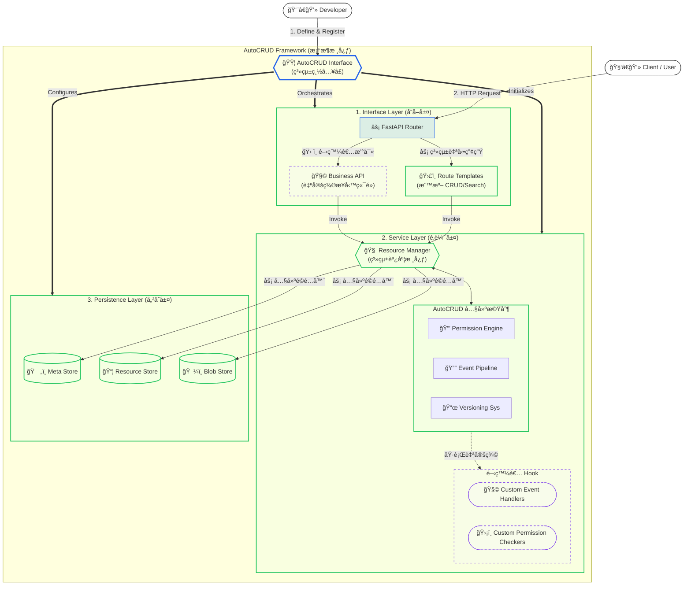
```mermaid
flowchart TD
    Dev([👨â€ğŸ’» Developer]) --> |"1. Define & Register"| AC{{"🟦 AutoCRUD Interface<br/>(系統總入å£)"}}
    Client([🧑â€ğŸ’» Client / User]) --> |"2. HTTP Request"| API[âš¡ FastAPI Router]

    subgraph Framework ["AutoCRUD Framework (框æ¶æ ¸å¿ƒ)"]
        direction TB
        
        AC ==> |"Orchestrates"| Interface
        AC ==> |"Initializes"| Service
        AC ==> |"Configures"| Persistence

        subgraph Interface ["1. Interface Layer (å­˜å–層)"]
            direction TB
            API --> |"âš¡ 系統自動產生"| Templates["ğŸ›£ï¸ Route Templates<br/>(標準 CRUD/Search)"]
            API --> |"ğŸ› ï¸ é–‹ç™¼è€…æ’°å¯«"| BizAPI["🧩 Business API<br/>(自定義業務端é»)"]
        end

        subgraph Service ["2. Service Layer (é‚輯層)"]
            direction TB
            Templates & BizAPI --> |"Invoke"| RM{{"🧠 Resource Manager<br/>(系統調度核心)"}}
            
            subgraph Logic ["AutoCRUD 內建機制"]
                direction LR
                Perm["🔒 Permission Engine"]
                Event["🔔 Event Pipeline"]
                Ver["📜 Versioning Sys"]
            end
            
            RM <--> Logic
            
            subgraph CustomHandlers ["開發者 Hook"]
                direction LR
                CH(["🧩 Custom Event Handlers"])
                CP(["ğŸ›¡ï¸ Custom Permission Checkers"])
            end
            
            Logic -.-> |"執行自定義"| CustomHandlers
        end

        subgraph Persistence ["3. Persistence Layer (儲存層)"]
            direction LR
            RM --> |"âš¡ 內建é©é…器"| MetaStore[("ğŸ—„ï¸ Meta Store")]
            RM --> |"âš¡ 內建é©é…器"| ResStore[("📦 Resource Store")]
            RM --> |"âš¡ 內建é©é…器"| BlobStore[("ğŸ–¼ï¸ Blob Store")]
        end
    end

    %% Styling
    classDef sys fill:#dcfce730,stroke:#22c55e,stroke-width:2px;
    classDef user fill:#f5f3ff30,stroke:#7c3aed,stroke-dasharray: 5 5;
    classDef bridge fill:#eff6ff30,stroke:#2563eb,stroke-width:3px;
    
    class Interface,Service,Persistence,RM,Logic,Templates,MetaStore,ResStore,BlobStore sys;
    class BizAPI,CustomHandlers,CH,CP user;
    class AC bridge;

    style Dev fill:#f9f9f930,stroke:#333
    style Client fill:#f9f9f930,stroke:#333
    style API fill:#60a5fa30,stroke:#2563eb
```

### 系統邊界æ˜ç´°ï¼šæˆ‘負責什麼 vs 系統æ供什麼

為了讓開發者更快速上手，AutoCRUD æ˜ç¢ºåŠƒåˆ†äº†è·è²¬é‚Šç•Œï¼š

| 層級 | 📦 AutoCRUD æ供的 (Built-in) | 🧑â€ğŸ’» 你需è¦æ供的 (User-defined) |
| :--- | :--- | :--- |
| **基ç¤è¨­æ–½** | æ··åˆå„²å­˜é©é…器 (SQL, S3, FS)ã€è³‡æ–™ç·¨è§£ç¢¼ (msgspec)ã€å»é‡æ©Ÿåˆ¶ | 儲存連æ¥è³‡è¨Š (Connection Strings) |
| **路由層** | RESTful CRUD/Search 路由模æ¿ã€GraphQL è‡ªå‹•ç”Ÿæˆ | **資æºæ¨¡å‹ (Schema)**ã€ç‰¹å®šæ¥­å‹™ç«¯é» (Custom Endpoints) |
| **é‚輯層** | 權é™é©—è­‰æ¡†æ¶ (RBAC/ACL)ã€ç‰ˆæœ¬è¿½è¹¤éˆã€äº‹ä»¶å»£æ’­å™¨ã€é·ç§»èª¿åº¦ | **業務 Hook (Event Handlers)**ã€å®¢è£½åŒ–權é™é‚輯 (Permission Logic) |
| **營é‹å±¤** | 自動化審計日誌腳本ã€å¤šç‰ˆæœ¬å…±å­˜æ”¯æ´ã€Partial Patch é©—è­‰ | 資料é·ç§»å‡½å¼ (Data Converters) |

---


```{include} functions.md
```


## 為什麼é¸æ“‡ AutoCRUD？(Why AutoCRUD?)

雖然 SQLAlchemy 或 Django ORM 在 Python 生態系中佔據主å°åœ°ä½ï¼Œä½† AutoCRUD é¸æ“‡äº†ä¸€æ¢ä¸åŒçš„æ¶æ§‹è·¯ç·šï¼Œæ—¨åœ¨è§£æ±ºå‚³çµ± ORM 在大å‹æ‡‰ç”¨ä¸­çš„ç—›é»ã€‚

| 特性 | 傳統 ORM (SQLAlchemy / Django) | AutoCRUD |
| :--- | :--- | :--- |
| **設計核心** | **Table-First**：資料庫表的物件映射 | **Resource-First**：業務資æºçš„ç”Ÿå‘½é€±æœŸç®¡ç† |
| **æ–°å¢è³‡æºæˆæœ¬** | **極高**：需定義 DB Tableã€ç·¨å¯« Migrationã€é–‹ç™¼ CRUD Serviceã€å»ºç«‹ DTO (Pydantic/Marshmallow)ã€æ‰‹å‹•æ›è¼‰ API Routeã€å¯¦ä½œæ¬Šé™é©—è­‰ | **極ä½**：僅需定義一個 `msgspec.Struct` (Schema) 並注入 AutoCRUD，系統å³åˆ»ç”Ÿæˆå®Œæ•´çš„ API 路由ã€æ··åˆå„²å­˜éˆã€æ¬Šé™æ¡†æ¶èˆ‡ç‰ˆæœ¬æ©Ÿåˆ¶ |
| **查詢æ€è€ƒ** | **SQL-Oriented**：需處ç†è¤‡é›œ Join 與表格關è¯ï¼Œé›£ä»¥å®Œå…¨è„«é›¢ SQL æ€è€ƒ | **Pythonic**：é€é Partial Read é濾欄ä½ï¼Œé¿å… Join 複雜度，專注收æ”業務é‚輯 |
| **é—œè¯æ€§** | **Foreign Key**：ä¾è³´è³‡æ–™åº«ç´„æŸèˆ‡ Cascade | **Event-Driven**：無隱性外éµï¼Œé—œè¯è¡Œç‚ºç”±æ˜ç¢ºçš„ Event Handler æ§åˆ¶ |
| **版本æ§åˆ¶** | 需外æ›æˆ–自行實作 | **Native**：內建 Revision Historyã€Draft/Stable 狀態機 |
| **資料é·ç§»** | **Imperative**：Alembic 複雜的å‡ç‰ˆ/é™ç‰ˆè…³æœ¬ | **Functional**：æä¾› `Data -> Data` 的純函數轉æ›å™¨ï¼Œæ”¯æ´ Lazy Migration |
| **儲存æ¶æ§‹** | 單一關è¯å¼è³‡æ–™åº« | **Hybrid**：Meta (SQL/Redis) + Payload (Object Storage) + Blob 分離 |

### 開發æµç¨‹ï¼šå¾ã€Œç¹ç‘£å·¥ç¨‹ã€åˆ°ã€Œå³æ™‚上線〠(Development Efficiency)

在傳統開發æµç¨‹ä¸­ï¼Œæ–°å¢ä¸€å€‹æ¥­å‹™è³‡æºï¼ˆä¾‹å¦‚「客戶åˆç´„ã€ï¼‰å¾€å¾€æ„味著巨大的開發å‹å‹•ï¼Œå› ç‚ºä½ å¿…須處ç†å„層之間的細節å°æ¥ã€‚AutoCRUD 將這些自動化了é‡è¤‡æ€§çš„工作。

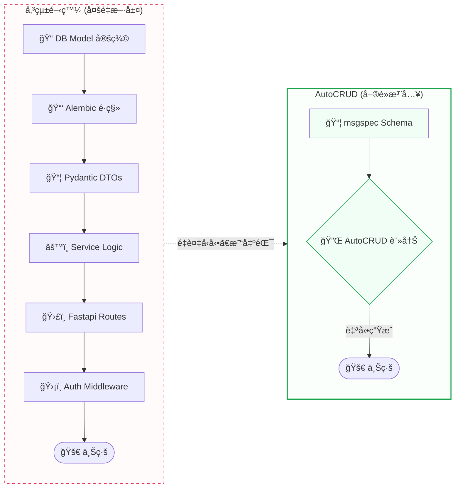
```mermaid
flowchart LR
    subgraph Traditional ["傳統開發 (多é‡æ–·å±¤)"]
        direction TB
        T1["📠DB Model 定義"] --> T2["📑 Alembic é·ç§»"]
        T2 --> T3["📦 Pydantic DTOs"]
        T3 --> T4["âš™ï¸ Service Logic"]
        T4 --> T5["ğŸ›£ï¸ Fastapi Routes"]
        T5 --> T6["ğŸ›¡ï¸ Auth Middleware"]
        T6 --> Finish1(["🚀 上線"])
    end

    subgraph AC ["AutoCRUD (å–®é»æ³¨å…¥)"]
        direction TB
        S1["📦 msgspec Schema"] --> S2{"🔌 AutoCRUD 註冊"}
        S2 --> |"自動生æˆ"| Finish2(["🚀 上線"])
    end

    Traditional -.-> |"é‡è¤‡å‹å‹•ã€æ˜“出錯"| AC
    
    %% Styling
    style Traditional fill:#fff1f250,stroke:#e11d48,stroke-dasharray: 5 5
    style AC fill:#f0fdf450,stroke:#16a34a,stroke-width:2px
    style S1 fill:#dcfce750
    style S2 fill:#dcfce750,stroke:#16a34a
```

### 純粹的 Python (Pure Python)

AutoCRUD 讓開發者脫離 SQL 與 DB Dialect 的泥沼。
*   **無需學習 Migration DSL**: é·ç§»é‚輯就是單純的 Python 函數，輸入舊資料，å›å‚³æ–°çµæ§‹ã€‚
*   **ä½ç¶­é‹æˆæœ¬**: 由於ä¸å¼·ä¾è³´å¼·ä¸€è‡´æ€§çš„é—œè¯å¼è³‡æ–™åº«åŠŸèƒ½ï¼ˆå¦‚外éµï¼‰ï¼Œåº•å±¤å„²å­˜å¯ä»¥è¼•æ˜“替æ›ç‚ºåˆ†æ•£å¼è³‡æ–™åº«æˆ– NoSQL 方案，具備更高的水平擴展潛力。

### 專注業務é‚輯：告別 Join 的泥沼 (Logic-First over SQL-Heavy)

在傳統 ORM 世界中，å³ä¾¿æ˜¯æœ€ Pythonic 的工具（如 SQLAlchemy），開發者在查詢時ä»éœ€è€—費大é‡ç²¾åŠ›æ€è€ƒã€Œå¦‚何 Joinã€ã€ã€Œå¤–éµæ¬„ä½æ˜¯å¦å°æ‡‰ã€ã€‚這會å°è‡´æ¥­å‹™é‚輯分散在多張表的關è¯çµæ§‹ä¸­ï¼Œå¢åŠ ç¶­è­·é›£åº¦ã€‚

AutoCRUD æ¡å–了ä¸åŒçš„哲學：
*   **高度收æ”é‚輯**: 建議將一個資æºæ‰€éœ€çš„所有資料都內èšåœ¨ Schema 中，而éç¢è£‚化地分佈。
*   **é€é Partial Read 減負**: 擔心寬表產生é大的 Payload？é€é AutoCRUD 內建的 `Partial Read` 功能，你å¯ä»¥åœ¨è§£ç¢¼éšæ®µå°±ç²¾ç¢ºé濾æ‰é€™æ¬¡è«‹æ±‚ä¸éœ€è¦çš„欄ä½ã€‚
*   **專注於「什麼ã€è€Œé「如何ã€**: 開發者ä¸å†éœ€è¦å»æ€è€ƒ SQL èªæ³•æˆ–表格 join key，而是將百分之百的精力集中在「業務é‚輯的æ€è€ƒã€èˆ‡ã€Œè³‡æ–™çš„生命週期ã€æœ¬èº«ã€‚

### 拒絕隱性副作用 (No Hidden Side Effects)

傳統 ORM çš„ `ON DELETE CASCADE` 雖然方便，但往往是系統穩定性的隱形殺手。AutoCRUD æ¡å– **「行為顯å¼åŒ–ã€** 策略：ä¸ä½¿ç”¨è³‡æ–™åº«å±¤ç´šçš„外éµã€‚

*   **所見å³æ‰€å¾—**: 若刪除 A 需è¦é€£å‹•åˆªé™¤ B，必須顯å¼è¨»å†Šä¸€å€‹ `AfterDelete` 事件。
*   **å¯æ¸¬è©¦æ€§**: 所有的業務é‚輯都在 Python 程å¼ç¢¼ä¸­ï¼Œè€Œééš±è—在資料庫 Schema 定義裡，這讓單元測試更容易覆蓋。

### 虛擬 NoSQL å¼•æ“ (Virtual NoSQL Engine)

AutoCRUD å¯ä»¥è¢«è¦–為一種 **「Soft NoSQLã€** 解決方案。
*   **無引æ“è² æ“”**: 我們沒有é‡æ–°ç™¼æ˜è³‡æ–™åº«å¼•æ“，而是將å„個æˆç†Ÿå„²å­˜æ–¹æ¡ˆï¼ˆRDBMS 的索引能力 + Object Storage çš„åå能力）æ‰åˆåœ¨ä¸€èµ·ã€‚
*   **最佳實è¸å°è£**: 開發者ç²å¾—了 NoSQL çš„éˆæ´»æ€§ï¼ˆSchema Free, Scale Out），但無需自行處ç†è³‡æ–™åˆ†ç‰‡æˆ–一致性å•é¡Œï¼Œå› ç‚º AutoCRUD 已經é€é `ResourceManager` å°è£äº†é€™äº›è¤‡é›œåº¦ã€‚

### 1. 設計核心：表優先 vs 資æºå„ªå…ˆ (Design Core)

傳統 ORM 往往強迫開發者將「業務物件ã€æ‹†è§£ (Normalize) 到多張資料庫表中，這å°è‡´æ¥­å‹™é‚輯被儲存層「é·å°±ã€ã€‚AutoCRUD 則讓開發者專注於定義 Schema，系統自動處ç†åº•å±¤å„²å­˜æ˜ å°„。

<table>
<tr>
<td width="50%">

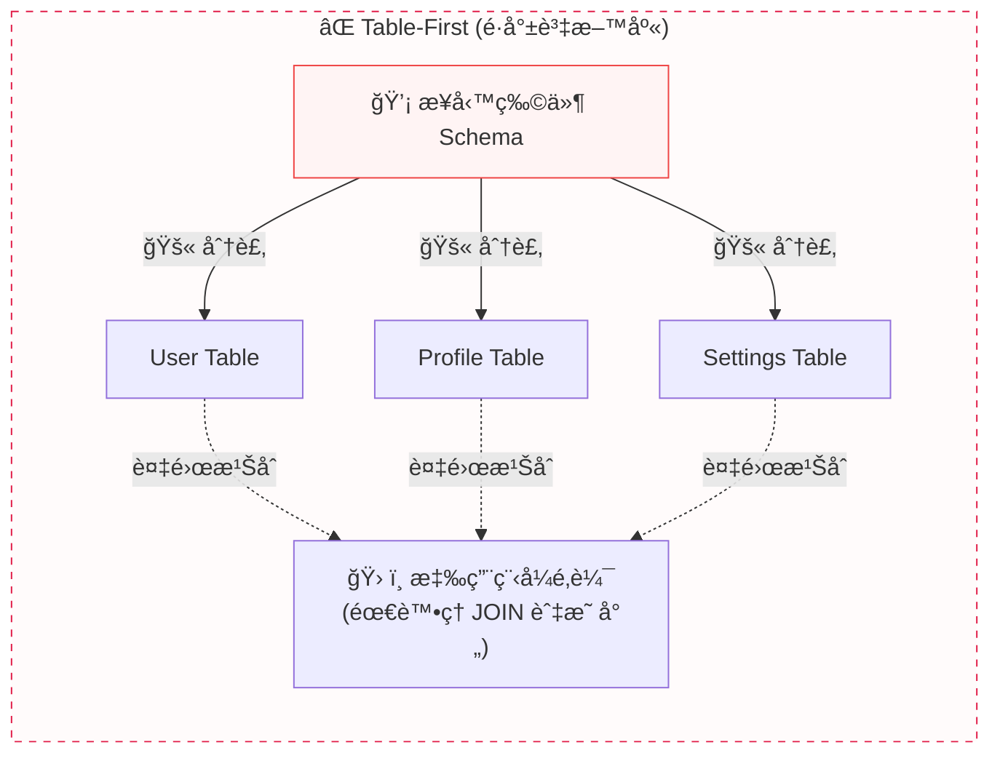
```mermaid
flowchart TD
    subgraph ORM ["⌠Table-First (é·å°±è³‡æ–™åº«)"]
        direction TB
        OBJ["💡 業務物件 Schema"]
        OBJ -- "🚫 分裂" --> T1[User Table]
        OBJ -- "🚫 分裂" --> T2[Profile Table]
        OBJ -- "🚫 分裂" --> T3[Settings Table]
        
        T1 & T2 & T3 -.-> |"複雜湊åˆ"| APP["ğŸ› ï¸ æ‡‰ç”¨ç¨‹å¼é‚輯<br/>(éœ€è™•ç† JOIN 與映射)"]
    end
    
    %% Styling
    style ORM fill:#fff1f250,stroke:#e11d48,stroke-dasharray: 5 5
    style OBJ fill:#fee2e250,stroke:#ef4444
```

</td>
<td width="50%">

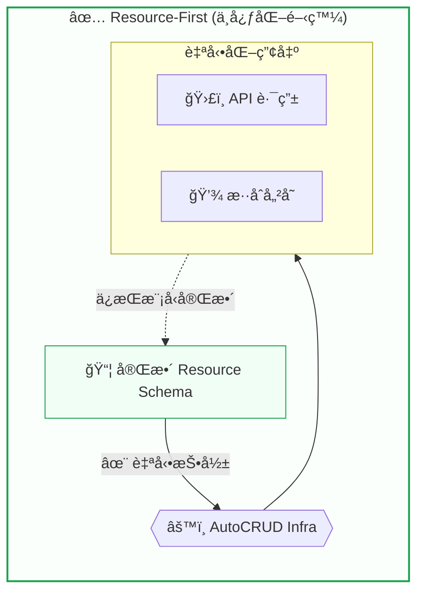
```mermaid
flowchart TD
    subgraph AC ["✅ Resource-First (中心化開發)"]
        direction TB
        SCHEMA["📦 完整 Resource Schema"]
        SCHEMA -- "✨ 自動投影" --> INFRA{{"âš™ï¸ AutoCRUD Infra"}}
        
        subgraph Auto [自動化產出]
            API["ğŸ›£ï¸ API 路由"]
            STORE["💾 æ··åˆå„²å­˜"]
        end
        
        INFRA --> Auto
        Auto -.-> |"ä¿æŒæ¨¡å‹å®Œæ•´"| SCHEMA
    end
    
    %% Styling
    style AC fill:#f0fdf450,stroke:#16a34a,stroke-width:2px
    style SCHEMA fill:#dcfce750,stroke:#16a34a
```

</td>
</tr>
</table>


### 2. 查詢æ€è€ƒï¼šSQL å°å‘ vs Pythonic (Query Paradigm)

<table>
<tr>
<td width="50%">

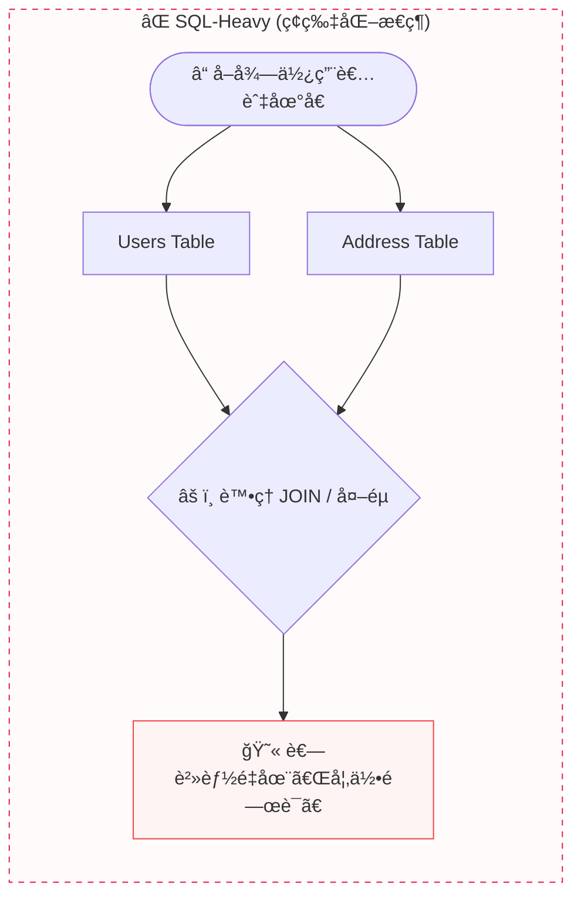
```mermaid
flowchart TD
    subgraph ORM ["⌠SQL-Heavy (ç¢ç‰‡åŒ–æ€ç¶­)"]
        direction TB
        Goal(["â“ å–得使用者與地å€"])
        Goal --> T1[Users Table]
        Goal --> T2[Address Table]
        T1 & T2 --> JOIN{"âš ï¸ è™•ç† JOIN / 外éµ"}
        JOIN --> Logic["😫 耗費能é‡åœ¨ã€Œå¦‚何關è¯ã€"]
    end
    
    %% Styling
    style ORM fill:#fff1f250,stroke:#e11d48,stroke-dasharray: 5 5
    style Logic fill:#fee2e250,stroke:#ef4444
```

</td>
<td width="50%">

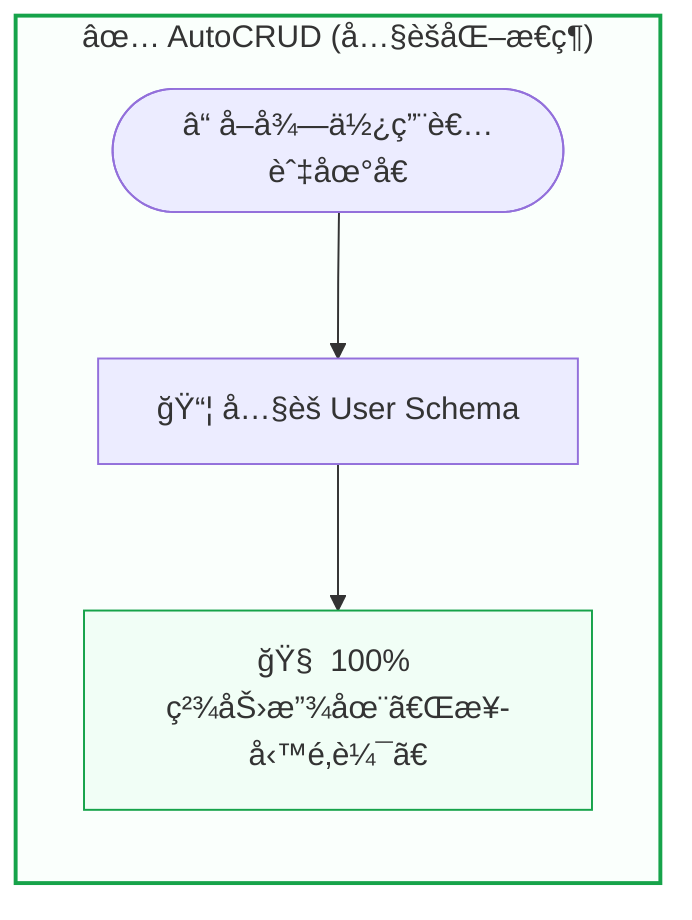
```mermaid
flowchart TD
    subgraph AC ["✅ AutoCRUD (å…§èšåŒ–æ€ç¶­)"]
        direction TB
        Goal2(["â“ å–得使用者與地å€"])
        Goal2 --> Schema["📦 å…§èš User Schema"]
        Schema --> Logic2["🧠 100% 精力放在「業務é‚輯ã€"]
    end
    
    %% Styling
    style AC fill:#f0fdf450,stroke:#16a34a,stroke-width:2px
    style Logic2 fill:#dcfce750,stroke:#16a34a
```

</td>
</tr>
</table>

### 3. é‚輯æ§åˆ¶ï¼šéš±æ€§ç´„æŸ vs 顯å¼äº‹ä»¶ (Logic Control)

<table>
<tr>
<td width="50%">

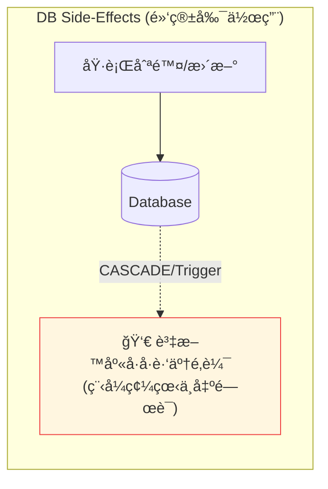
```mermaid
flowchart TD
    subgraph ORM ["DB Side-Effects (黑箱副作用)"]
        direction TB
        Action[執行刪除/更新] --> DB[(Database)]
        DB -.-> |"CASCADE/Trigger"| Secret["👀 資料庫å·å·è·‘了é‚輯<br/>(程å¼ç¢¼çœ‹ä¸å‡ºé—œè¯)"]
        style Secret fill:#fee2e250,stroke:#ef4444
    end
```

</td>
<td width="50%">

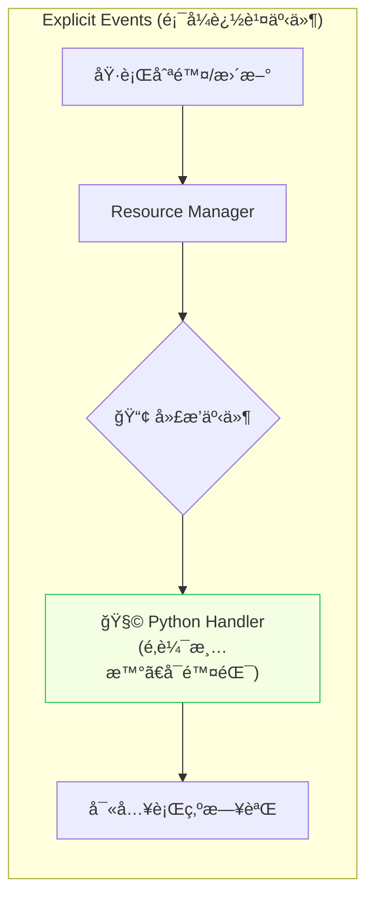
```mermaid
flowchart TD
    subgraph AC ["Explicit Events (顯å¼è¿½è¹¤äº‹ä»¶)"]
        direction TB
        Action2[執行刪除/更新] --> RM[Resource Manager]
        RM --> Event{📢 廣播事件}
        Event --> Handler["🧩 Python Handler<br/>(é‚輯清晰ã€å¯é™¤éŒ¯)"]
        Handler --> Log[寫入行為日誌]
        style Handler fill:#dcfce750,stroke:#22c55e
    end
```

</td>
</tr>
</table>

### 4. 版本æ§ç®¡ï¼šè¦†è“‹æ›´æ–° vs æ­·å²è¿½åŠ  (Versioning)

<table>
<tr>
<td width="50%">

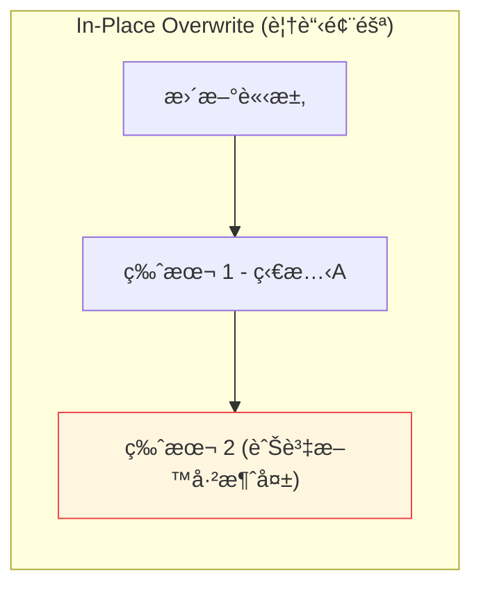
```mermaid
flowchart TD
    subgraph ORM ["In-Place Overwrite (覆蓋風險)"]
        direction TB
        V1[版本 1 - 狀態A]
        Update[更新請求] --> V1
        V1 --> V1_NEW["版本 2 (舊資料已消失)"]
        style V1_NEW fill:#fee2e250,stroke:#ef4444
    end
```

</td>
<td width="50%">

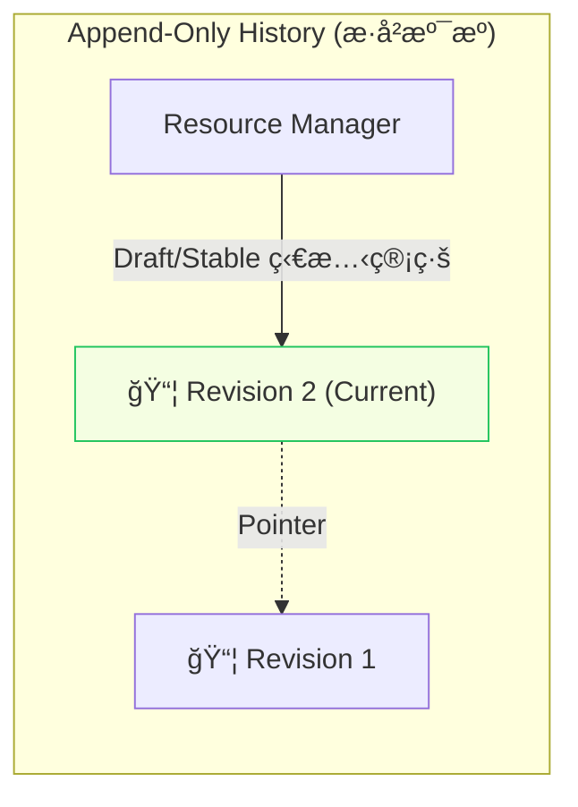
```mermaid
flowchart TD
    subgraph AC ["Append-Only History (æ­·å²æº¯æº)"]
        direction TB
        H1["📦 Revision 1"]
        H2["📦 Revision 2 (Current)"]
        H2 -.-> |"Pointer"| H1
        RM[Resource Manager] --> |"Draft/Stable 狀態管線"| H2
        style H2 fill:#dcfce750,stroke:#22c55e
    end
```

</td>
</tr>
</table>

### 5. 資料é·ç§»ï¼šçµæ§‹è®Šæ›´ vs æƒ°æ€§è½‰æ› (Migration)

<table>
<tr>
<td width="50%">

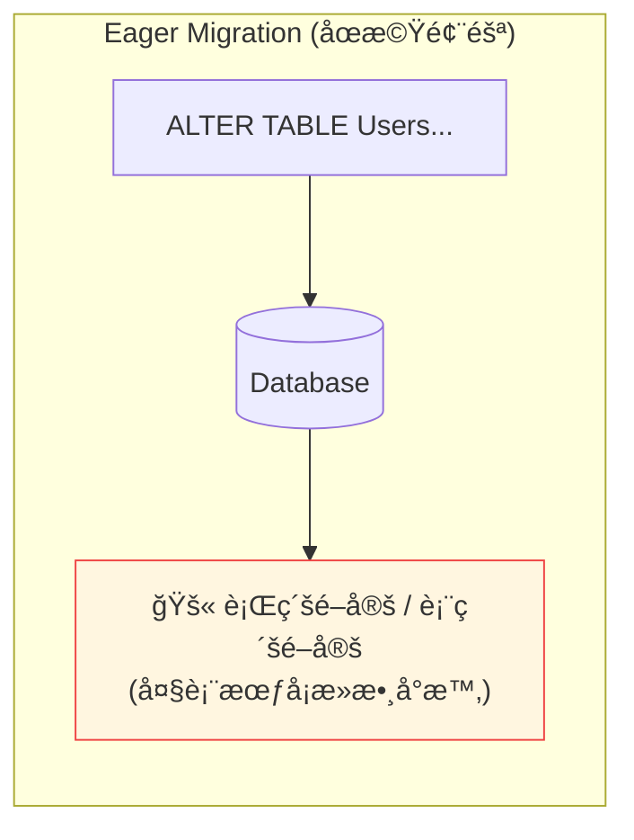
```mermaid
flowchart TD
    subgraph ORM ["Eager Migration (åœæ©Ÿé¢¨éšª)"]
        direction TB
        ALTER["ALTER TABLE Users..."]
        ALTER --> DB[(Database)]
        DB --> Lock["🚫 行級é–定 / 表級é–定<br/>(大表會å¡æ­»æ•¸å°æ™‚)"]
        style Lock fill:#fee2e250,stroke:#ef4444
    end
```

</td>
<td width="50%">

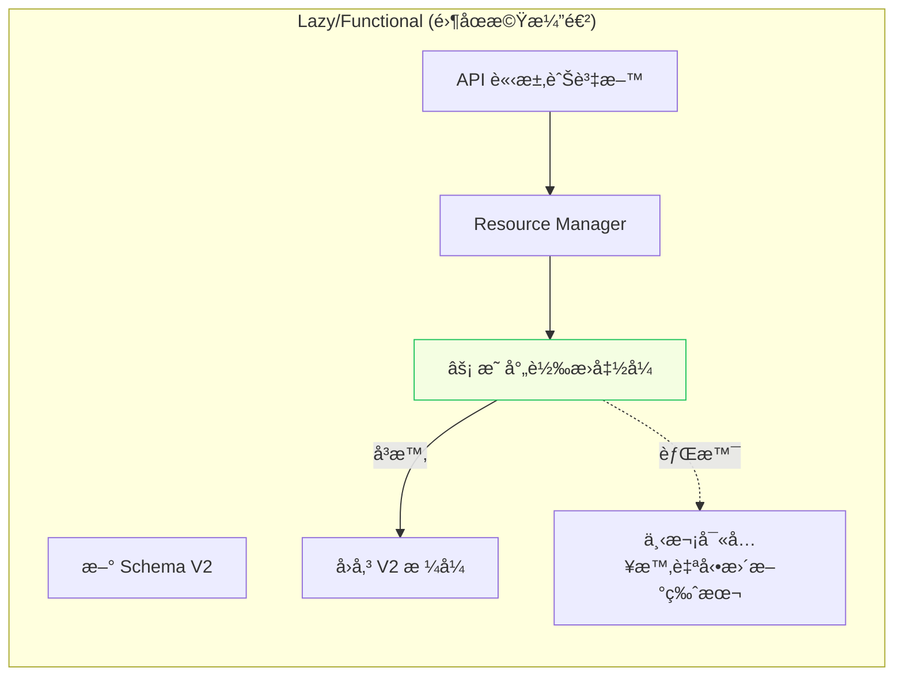
```mermaid
flowchart TD
    subgraph AC ["Lazy/Functional (零åœæ©Ÿæ¼”進)"]
        direction TB
        Schema2[æ–° Schema V2]
        Req[API 請求舊資料] --> RM[Resource Manager]
        RM --> Map["âš¡ 映射轉æ›å‡½å¼"]
        Map -->|å³æ™‚| Resp[å›å‚³ V2 æ ¼å¼]
        Map -.-> |背景| STORE["下次寫入時自動更新版本"]
        style Map fill:#dcfce750,stroke:#22c55e
    end
```

</td>
</tr>
</table>

### 6. 儲存æ¶æ§‹ï¼šå–®é«” vs æ··åˆ (Storage Architecture)

<table>
<tr>
<td width="50%">

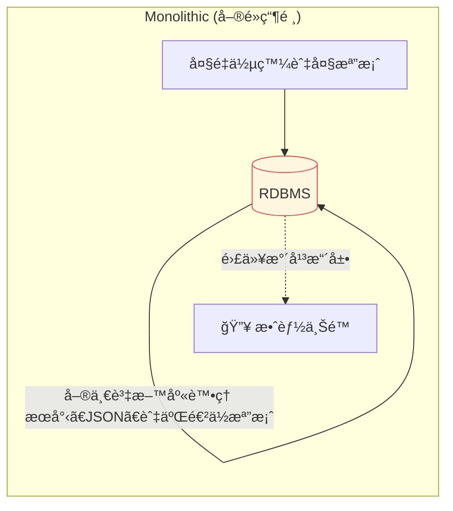
```mermaid
flowchart TD
    subgraph ORM ["Monolithic (å–®é»ç“¶é ¸)"]
        direction TB
        REQ[大é‡ä½µç™¼èˆ‡å¤§æª”案] --> DB[(RDBMS)]
        DB --> |"å–®ä¸€è³‡æ–™åº«è™•ç† æœå°‹ã€JSONã€èˆ‡äºŒé€²ä½æª”案"| DB
        DB -.-> |"難以水平擴展"| CRASH[🔥 效能上é™]
        style DB fill:#fee2e250,stroke:#ef4444
    end
```

</td>
<td width="50%">

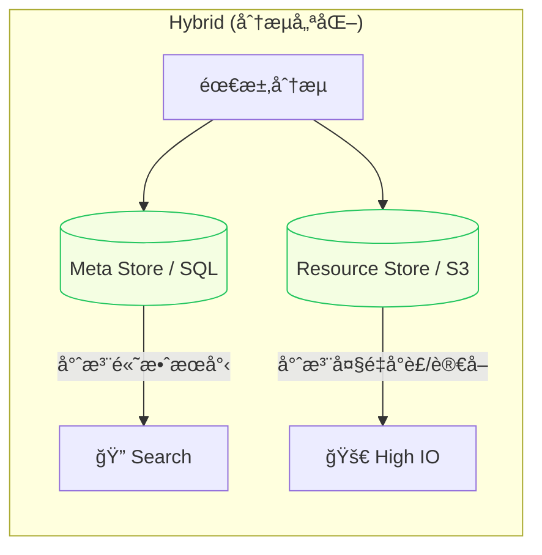
```mermaid
flowchart TD
    subgraph AC ["Hybrid (分æµå„ªåŒ–)"]
        direction TB
        REQ2[需求分æµ] --> META[(Meta Store / SQL)]
        REQ2 --> DATA[(Resource Store / S3)]
        META --> |"專注高效æœå°‹"| SEARCH[🔠Search]
        DATA --> |"專注大é‡å°è£/讀å–"| IO[🚀 High IO]
        style META fill:#dcfce750,stroke:#22c55e
        style DATA fill:#dcfce750,stroke:#22c55e
    end
```

</td>
</tr>
</table>

## 核心組件 (Core Components)

### 1. Application Layer: `AutoCRUD`
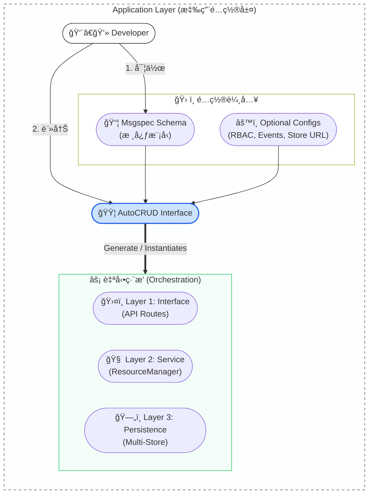
```mermaid
flowchart TD
    subgraph App ["Application Layer (應用é…置層)"]
        direction TB
        DEV([👨â€ğŸ’» Developer])
        
        subgraph Definitions ["ğŸ› ï¸ é…置輸入"]
            SCHEMA(["📦 Msgspec Schema<br/>(核心模å‹)"])
            CONFIG(["âš™ï¸ Optional Configs<br/>(RBAC, Events, Store URL)"])
        end
        
        AC_INTF(["🟦 AutoCRUD Interface"])
        
        DEV --> |"1. 實作"| SCHEMA
        DEV --> |"2. 註冊"| AC_INTF
        SCHEMA & CONFIG --> AC_INTF
        
        subgraph Orchestration ["âš¡ è‡ªå‹•ç·¨æ’ (Orchestration)"]
            direction LR
            L1(["ğŸ›¤ï¸ Layer 1: Interface<br/>(API Routes)"])
            L2(["🧠 Layer 2: Service<br/>(ResourceManager)"])
            L3(["ğŸ—„ï¸ Layer 3: Persistence<br/>(Multi-Store)"])
        end
        
        AC_INTF ==> |"Generate / Instantiates"| Orchestration
    end

    %% Styling
    style AC_INTF fill:#60a5fa50,stroke:#2563eb,stroke-width:2px
    style DEV fill:#f9f9f950,stroke:#333
    style App fill:#f8fafc50,stroke:#475569,stroke-dasharray: 5 5
    style Definitions fill:#ffffff50
    style Orchestration fill:#dcfce750,stroke:#22c55e
```

`AutoCRUD` 是開發者與系統互動的單一入å£ã€‚它的è·è²¬æ˜¯ï¼š
- æ¥æ”¶ä½¿ç”¨è€…定義的 Schema (msgspec.Struct)。
- å”調 `StorageFactory` 來創建å°æ‡‰çš„儲存後端。
- å°‡ `ResourceManager` 與 `RouteTemplate` ç¶å®šã€‚
- 將最終生æˆçš„路由æ›è¼‰åˆ° FastAPI App 上。

### 2. Interface Layer: `RouteTemplate` & `Business API`
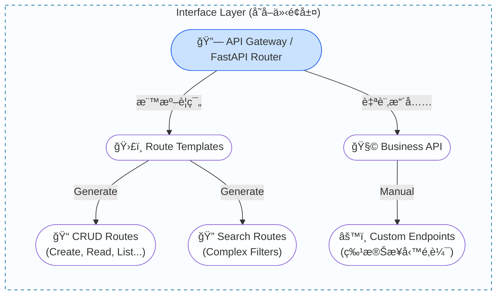
```mermaid
flowchart TD
    subgraph Interface ["Interface Layer (å­˜å–介é¢å±¤)"]
        direction TB
        API(["🔗 API Gateway / FastAPI Router"])
        
        API --> |"標準è¦ç¯„"| RT(["ğŸ›£ï¸ Route Templates"])
        API --> |"自訂擴充"| BA(["🧩 Business API"])
        
        RT --> |"Generate"| CRUD(["📠CRUD Routes<br/>(Create, Read, List...)"])
        RT --> |"Generate"| SEARCH(["🔠Search Routes<br/>(Complex Filters)"])
        BA --> |"Manual"| CUSTOM(["âš™ï¸ Custom Endpoints<br/>(特殊業務é‚輯)"])
    end

    %% Styling
    style API fill:#60a5fa50,stroke:#2563eb
    style Interface fill:#f0f9ff50,stroke:#0369a1,stroke-dasharray: 5 5
    style RT fill:#ffffff50
    style BA fill:#ffffff50
    style CRUD fill:#ffffff50
    style SEARCH fill:#ffffff50
    style CUSTOM fill:#ffffff50
```

這層決定了 API 的「長相ã€ã€‚`AutoCRUD Interface` 會根據開發者註冊的 Schema，é€é `IRouteTemplate` 介é¢è‡ªå‹•ç”Ÿæˆå°æ‡‰è·¯ç”±ã€‚
- **Route Templates**: æ供標準的 CRUD æ“作 (Create, Update, List...)。
- **Business API**: 開發者å¯ä»¥æ’°å¯«è‡ªå®šç¾©çš„ FastAPI 路由，直æ¥èª¿ç”¨ç”±ç³»çµ±ç”Ÿæˆçš„ `ResourceManager` 來復用底層é‚輯（如權é™ã€ç‰ˆæ§ï¼‰ï¼Œè€Œç„¡éœ€é‡é€ è¼ªå­ã€‚
- **è·è²¬**: 解æ HTTP 請求åƒæ•¸ -> å‘¼å« Resource Manager -> æ ¼å¼åŒ–å›å‚³ Response。

### 3. Service Layer: `ResourceManager`
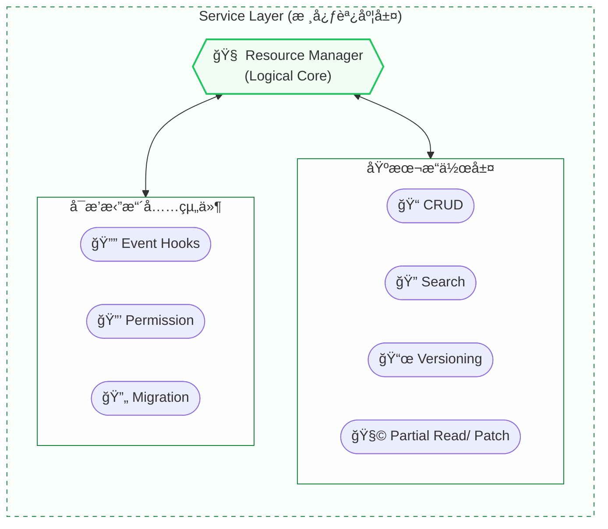
```mermaid
flowchart TD
    subgraph Service ["Service Layer (核心調度層)"]
        direction TB
        RM{{"🧠 Resource Manager<br/>(Logical Core)"}}
        
        subgraph Ops ["基本æ“作層"]
            direction LR
            CRUD(["📠CRUD"])
            SEARCH(["🔠Search"])
            VER(["📜 Versioning"])
            PARTIAL(["🧩 Partial Read/ Patch"])
        end
        
        subgraph Plugins ["å¯æ’拔擴充組件"]
            direction LR
            EVENT(["🔔 Event Hooks"])
            PERM(["🔒 Permission"])
            MIG(["🔄 Migration"])
        end
        
        RM <--> Ops
        RM <--> Plugins
    end

    %% Styling
    style RM fill:#dcfce750,stroke:#22c55e,stroke-width:2px
    style Service fill:#f0fdf450,stroke:#15803d,stroke-dasharray: 5 5
    style Ops fill:#ffffff50,stroke:#15803d
    style Plugins fill:#ffffff50,stroke:#15803d
```

`ResourceManager` 是 AutoCRUD 的「大腦ã€ï¼Œä¹Ÿæ˜¯æ‰€æœ‰è‡ªå®šç¾©é‚輯發生的地方。它由 `AutoCRUD Interface` 在系統啟動時自動實例化，並負責å”調所有的組件。當路由收到請求後，會轉交給它處ç†ã€‚

它執行的標準作業æµç¨‹ (SOP) 如下：
1.  **Context Setup**: 建立執行當下的 Context (åŒ…å« User, Timestamp)。
2.  **Permission Check**: å‘¼å« `IPermissionChecker` 確èªæ“作者權é™ã€‚
3.  **Before Hooks**: 觸發 `before` 事件 (例如：資料驗證ã€è‡ªå‹•å¡«å€¼)。
4.  **Action Execution**: 執行實體動作 (CRUDã€ç‰ˆæœ¬åˆ‡æ›æˆ–æœå°‹)。
5.  **Status Hooks**: 根據çµæœè§¸ç™¼ `on_success` 或 `on_error`。
6.  **After Hooks**: 觸發 `after` 事件 (ç„¡è«–å‹æ•—，皆執行收尾)。
7.  **Response Construction**: å°‡çµæœå°è£å›å‚³ã€‚

### 4. Persistence Layer: Multi-Store Strategy
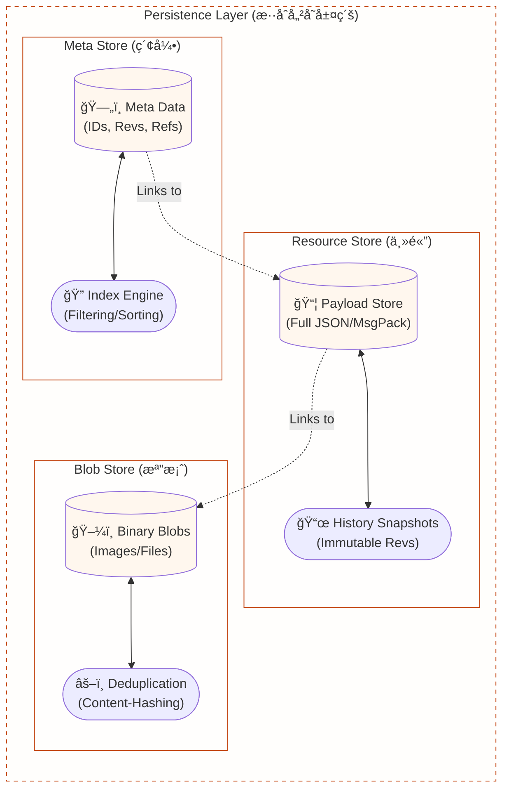
```mermaid
flowchart TD
    subgraph Persistence ["Persistence Layer (æ··åˆå„²å­˜å±¤ç´š)"]
        direction TB
        
        subgraph Meta ["Meta Store (索引)"]
            META[("ğŸ—„ï¸ Meta Data<br/>(IDs, Revs, Refs)")]
            IDX(["🔠Index Engine<br/>(Filtering/Sorting)"])
            META <--> IDX
        end
        
        subgraph Data ["Resource Store (主體)"]
            RES[("📦 Payload Store<br/>(Full JSON/MsgPack)")]
            SNAP(["📜 History Snapshots<br/>(Immutable Revs)"])
            RES <--> SNAP
        end
        
        subgraph Blobs ["Blob Store (檔案)"]
            BLOB[("ğŸ–¼ï¸ Binary Blobs<br/>(Images/Files)")]
            DEDUP(["âš–ï¸ Deduplication<br/>(Content-Hashing)"])
            BLOB <--> DEDUP
        end
        
        META -.-> |"Links to"| RES
        RES -.-> |"Links to"| BLOB
    end

    %% Styling
    style Persistence fill:#fff7ed30,stroke:#c2410c,stroke-dasharray: 5 5
    style Meta fill:#ffffff30,stroke:#c2410c
    style Data fill:#ffffff30,stroke:#c2410c
    style Blobs fill:#ffffff30,stroke:#c2410c
    style META fill:#fed7aa30
    style RES fill:#fed7aa30
    style BLOB fill:#fed7aa30
```

為了åŒæ™‚滿足 **高效æœå°‹**ã€**大容é‡å„²å­˜** 與 **二進ä½æª”案管ç†**，AutoCRUD æ¡å–了三層儲存分離策略：

*   **Meta Store (索引層)**: 
    *   儲存資æºçš„ Metadata (ID, CreatedTime, Tags, RevisionID) 與索引欄ä½ã€‚
    *   通常使用關è¯å¼è³‡æ–™åº« (Postgres, SQLite) 或高效 KV Store (Redis)。
    *   **è·è²¬**: `Search`, `Filter`, `Sort`, `Pagination`。
*   **Resource Store (資料層)**:
    *   儲存完整的 JSON/MsgPack Payload 以åŠæ­·å²ç‰ˆæœ¬å¿«ç…§ (Revision Blobs)。
    *   通常使用 Object Storage (S3, MinIO) 或 File System。
    *   **è·è²¬**: `Load`, `Dump`, `History Management`。
*   **Blob Store (檔案層)**:
    *   專門儲存éçµæ§‹åŒ–的二進ä½è³‡æ–™ (Images, PDFs, Videos)。
    *   資æºä¸­çš„ `Binary` 欄ä½åƒ…儲存 reference ID，實際內容存於此。
    *   **è·è²¬**: `File Upload/Download`, `Streaming`, `Signed URL Generation`。

## å”作æµç¨‹ç¯„例 (Interaction Flow)

以「新å¢ä¸€ç­†è³‡æº (Create Resource)ã€ç‚ºä¾‹ï¼š

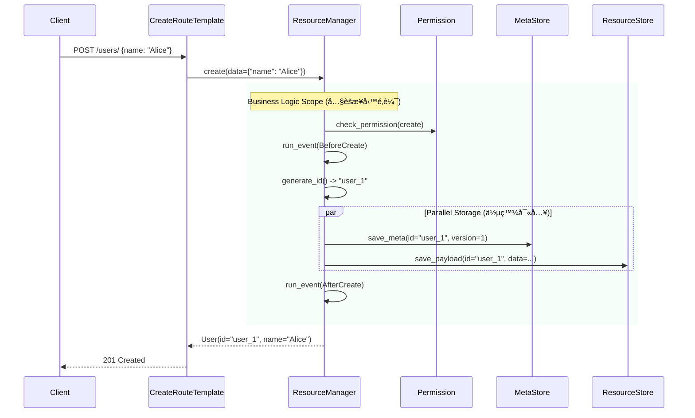
```mermaid
sequenceDiagram
    participant Client
    participant API as CreateRouteTemplate
    participant RM as ResourceManager
    participant Perm as Permission
    participant Meta as MetaStore
    participant Store as ResourceStore

    Client->>API: POST /users/ {name: "Alice"}
    API->>RM: create(data={"name": "Alice"})
    
    rect rgb(220, 252, 231, 0.3)
        Note over RM: Business Logic Scope (å…§èšæ¥­å‹™é‚輯)
        RM->>Perm: check_permission(create)
        RM->>RM: run_event(BeforeCreate)
        RM->>RM: generate_id() -> "user_1"
        
        par Parallel Storage (併發寫入)
            RM->>Meta: save_meta(id="user_1", version=1)
            RM->>Store: save_payload(id="user_1", data=...)
        end
        
        RM->>RM: run_event(AfterCreate)
    end
    
    RM-->>API: User(id="user_1", name="Alice")
    API-->>Client: 201 Created
```

é€é這種æ¶æ§‹ï¼ŒAutoCRUD 讓開發者能夠專注於「定義資料ã€ï¼Œè€Œå°‡è¤‡é›œçš„基ç¤è¨­æ–½å»ºç½®å·¥ä½œäº¤ç”±ç³»çµ±è‡ªå‹•å®Œæˆã€‚

## é—œéµç‰¹æ€§æ·±å…¥å‰–æ (Deep Dive Features)

### 1. 版本æ§åˆ¶æ¨¡å‹ (Versioning Model)

AutoCRUD 內建了完善的版本æ§åˆ¶æ©Ÿåˆ¶ï¼Œæ¯ä¸€ç­†è³‡æºçš„變更都會產生新的 `Revision`。

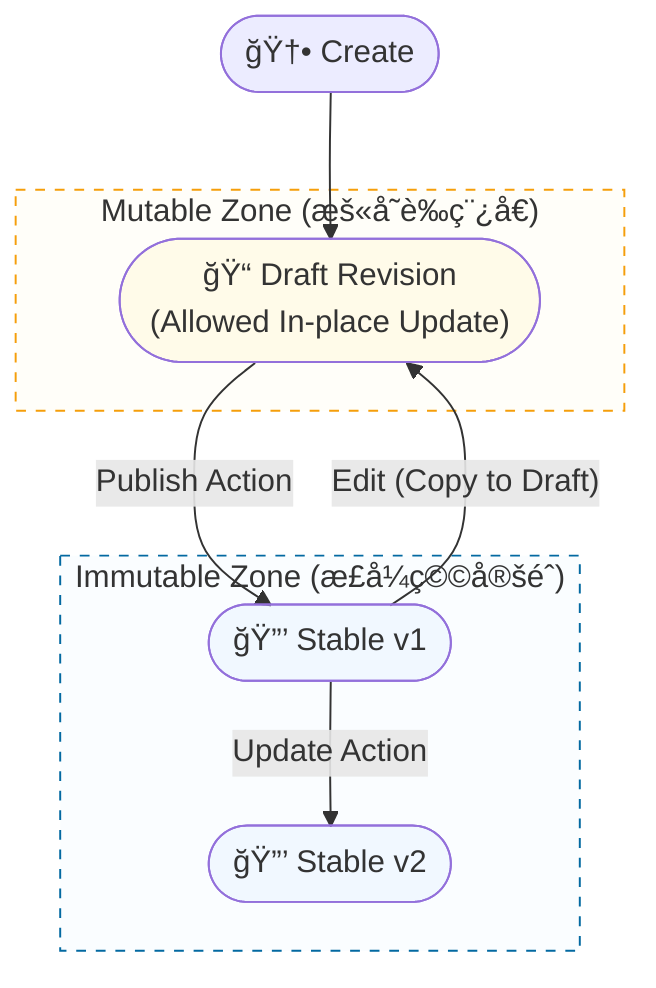
```mermaid
flowchart TD
    subgraph DraftZone ["Mutable Zone (æš«å­˜è‰ç¨¿å€)"]
        D1(["📠Draft Revision<br/>(Allowed In-place Update)"])
    end

    subgraph StableZone ["Immutable Zone (æ­£å¼ç©©å®šéˆ)"]
        S1(["🔒 Stable v1"])
        S2(["🔒 Stable v2"])
        S1 --> |"Update Action"| S2
    end

    Start([🆕 Create]) --> D1
    D1 --> |"Publish Action"| S1
    S1 --> |"Edit (Copy to Draft)"| D1

    %% Styling
    style DraftZone fill:#fffbeb50,stroke:#f59e0b,stroke-dasharray: 5 5
    style StableZone fill:#f0f9ff50,stroke:#0369a1,stroke-dasharray: 5 5
    style D1 fill:#fef3c750
    style S1 fill:#dbeafe50
    style S2 fill:#dbeafe50
```

*   **Revision 狀態**:
    *   `draft`: è‰ç¨¿ç‹€æ…‹ï¼Œå…許就地更新 (In-place update) 而ä¸ç”¢ç”Ÿæ–°ç‰ˆæœ¬ã€‚
    *   `stable`: 穩定狀態，一旦進入此狀態，任何修改都會強制產生一個全新的 Revision ID。
*   **指å‘與å›æº¯**:
    *   系統會維護一個 `parent_revision_id` 指å‘來æºç‰ˆæœ¬ï¼Œå½¢æˆä¸€æ¢å®Œæ•´çš„變更éˆã€‚
    *   開發者å¯ä»¥éš¨æ™‚å°‡è³‡æº `switch`（切æ›ï¼‰å›æ­·å²ä¸Šçš„任何一個 stable 版本。
*   **Schema 版本連çµ**: æ¯å€‹ Revision 都會紀錄當時使用的 `schema_version`，確ä¿åœ¨è³‡æ–™é·ç§» (Migration) 後ä¾ç„¶èƒ½æ­£ç¢ºè§£ææ­·å²è³‡æ–™ã€‚

### 2. 基ç¤è¨­æ–½æ±ºç­–脫鉤 (Infrastructure Decoupling)

在開發傳統 ORM 專案時，開發者往往需è¦è€—費大é‡ç²¾åŠ›åœ¨èˆ‡æ¥­å‹™ç„¡é—œã€ä½†åˆä¸å¾—ä¸è™•ç†çš„「基ç¤è¨­æ–½æ¬„ä½ã€èˆ‡ã€Œæ¶æ§‹æ±ºç­–ã€ä¸Šã€‚AutoCRUD 將這些雜事完全自動化，讓您真正åªå®šç¾© **「業務資料層ã€**。

```mermaid
flowchart LR
    subgraph ORM ["傳統 ORM (精力分散)"]
        direction TB
        Dec1["🆔 ID：用 Int 還是 UUID？<br/>DB 生æˆé‚„是 App 生æˆï¼Ÿ"]
        Dec2["â° Time：時å€æ€éº¼è™•ç†ï¼Ÿ<br/>Created/Updated 何時寫入？"]
        Dec3["👤 User：欄ä½è¦å« created_by<br/>還是 creator_id？"]
        Dec4["🔠Integrity：Hash 值æ€éº¼ç”¢ï¼Ÿ<br/>版號手動éå¢ï¼Ÿ"]
    end

    subgraph AC ["AutoCRUD (精力èšç„¦)"]
        direction TB
        Core[("💡 您的業務模å‹")]
        Meta{{"âš™ï¸ ç³»çµ±è‡ªå‹•è£ç”²<br/>(ResourceMeta)"}}
        
        Core --> Meta
        Meta -.-> |"Auto-Gen"| ID["🆔 Unique Resource ID"]
        Meta -.-> |"Auto-Sync"| Time["â° Timestamp (ISO/UTC)"]
        Meta -.-> |"Auto-Inject"| User["👤 Operator Tracking"]
        Meta -.-> |"Auto-Calc"| Hash["🔠Data Hash & Revisions"]
    end

    classDef focus fill:#dcfce750,stroke:#22c55e,stroke-width:2px;
    class Core focus;
```

*   **å…除é‡è¤‡å®šç¾©**: æ¯å€‹è³‡æºä¸€å®šæœƒæœ‰çš„ `resource_id`, `revision_id`, `created_at`, `updated_at`, `created_by`, `updated_by` 等欄ä½ï¼Œé€šé€šä¸éœ€è¦å¯«åœ¨ Schema 裡。AutoCRUD 會é€é `ResourceMeta` 與 `RevisionInfo` 自動幫您管ç†ã€‚
*   **一致性的æ¶æ§‹æ±ºç­–**: 
    - **ID ç­–ç•¥**: 統一æ¡ç”¨å…·å‚™å‹åˆ¥æ¨™è¨˜çš„內容尋å€/隨機 ID，無需爭論自å¢å€¼çš„高效性與安全性。
    - **時å€èˆ‡å¯«å…¥æ™‚æ©Ÿ**: 全系統統一使用 UTC/ISO æ ¼å¼ï¼Œä¸¦åœ¨ `ResourceManager` 核心步驟中自動æ•æ‰ï¼Œæ¶ˆé™¤ã€Œå¿˜è¨˜æ›´æ–°æ™‚間戳ã€çš„ Bug。
    - **人員追蹤**: é€é Context 注入，自動追蹤是誰執行了這次 Create/Update，無需手動傳é User 物件到æ¯ä¸€å€‹å±¤å›å¯«ã€‚
*   **專注於「變動ã€**: 系統自動生æˆçš„ `data_hash` 確ä¿åªæœ‰åœ¨å…§å®¹çœŸæ­£æ”¹è®Šæ™‚æ‰æœƒç”¢ç”Ÿæ–°ç‰ˆæœ¬ï¼Œé¿å…多餘的寫入與版本雜訊。

### 3. 權é™èˆ‡å®‰å…¨æ€§ (Security & Permissions)

權é™é©—證被整åˆåœ¨ `ResourceManager` 的核心æµç¨‹ä¸­ï¼Œç¢ºä¿ç„¡è«–是é€é API 還是內部調用，都能å—到ä¿è­·ã€‚

```mermaid
flowchart TD
    REQ(["📩 API Request"]) --> AUTH{{"ğŸ›¡ï¸ Auth Chain"}}
    
    subgraph Layers ["多層次驗證網"]
        direction TB
        GLOBAL{"🌠Global Rules<br/>(RBAC)"}
        MODEL{"📦 Model Rules<br/>(Resource Type)"}
        ACL{"🔑 Resource ACL<br/>(Instance Level)"}
        
        GLOBAL --> |Pass| MODEL
        MODEL --> |Pass| ACL
    end

    AUTH --> Layers
    ACL --> |"Success"| OK(["✅ Authorized"])
    
    GLOBAL -- "Deny" --> FAIL(["🚫 403 Forbidden"])
    MODEL -- "Deny" --> FAIL
    ACL -- "Deny" --> FAIL

    %% Styling
    style Layers fill:#f8fafc50,stroke:#475569,stroke-dasharray: 5 5
    style OK fill:#dcfce750,stroke:#22c55e
    style FAIL fill:#fee2e250,stroke:#ef4444
```

*   **RBAC (Role-Based Access Control)**: 支æ´åŸºæ–¼è§’色的權é™ç®¡ç†ï¼Œå¯ä»¥å®šç¾© `admin`, `editor`, `viewer` 等角色å°ä¸åŒè³‡æºçš„æ“作權é™ã€‚
*   **多層次驗證**:
    1.  **Global Level**: 應用程å¼å±¤ç´šçš„é è¨­æ¬Šé™ã€‚
    2.  **Model Level**: é‡å°ç‰¹å®šè³‡æ–™æ¨¡å‹çš„權é™è¨­å®šã€‚
    3.  **Resource Level (ACL)**: é‡å°å–®ä¸€è³‡æºå¯¦ä¾‹çš„å­˜å–æ§åˆ¶åˆ—表。
*   **自定義驗證器**: é€é實作 `IPermissionChecker`，開發者å¯ä»¥æ’°å¯«è¤‡é›œçš„é‚輯（例如：åªæœ‰è³‡æºæ“有者在特定時間內æ‰èƒ½ä¿®æ”¹ï¼‰ã€‚

### 4. 事件驅動æ¶æ§‹ (Event-Driven Hooks)

AutoCRUD æ供了éˆæ´»çš„事件 Hook é»ï¼Œè®“開發者在ä¸ä¾µå…¥æ ¸å¿ƒé‚輯的情æ³ä¸‹æ“´å……功能。

```mermaid
sequenceDiagram
    participant RM as ResourceManager
    participant EH as EventHandler
    participant Store as Persistence Layer

    RM->>EH: trigger(BeforeAction)
    activate EH
    EH-->>RM: continue
    deactivate EH
    
    Note over RM, Store: 執行核心動作
    RM->>Store: execute(Action)
    
    alt Success Case
        Store-->>RM: result
        RM->>EH: trigger(OnSuccess)
    else Failure Case
        Store-->>RM: raise Exception
        RM->>EH: trigger(OnError)
    end
    
    RM->>EH: trigger(AfterAction) (Always)
```

*   **四種事件 Hook**:
    *   `Before`: 在執行動作å‰è§¸ç™¼ã€‚å¯ç”¨æ–¼é€²éšè³‡æ–™æ ¡é©—ã€æ¬„ä½è‡ªå‹•è£œå…¨ï¼ˆä¾‹å¦‚：自動填入 `created_by`）。
    *   `OnSuccess`: 動作「æˆåŠŸåŸ·è¡Œã€å¾Œè§¸ç™¼ã€‚å¯ç”¨æ–¼ç™¼é€ Webhookã€æ¸…ç†å¿«å–ã€ç™¼é€éƒµä»¶é€šçŸ¥ã€‚
    *   `OnError`: 動作「執行失敗ã€æ™‚觸發。å¯ç”¨æ–¼éŒ¯èª¤è¿½è¹¤ã€å³æ™‚警報或補償é‚輯。
    *   `After`: 動作「çµæŸå¾Œã€è§¸ç™¼ï¼ˆç„¡è«–æˆåŠŸæˆ–失敗）。é©åˆåšæœ€çµ‚的資æºæ¸…ç†æˆ–審計日誌。

### 5. 二進ä½è³‡æ–™å„ªåŒ– (Binary Data Optimization)

é‡å°éçµæ§‹åŒ–資料 (Files)，AutoCRUD æ¡ç”¨äº†ã€Œæ¬„ä½ç´šåˆ¥çš„é€æ˜åŒ–處ç†ã€ï¼š

```mermaid
flowchart TD
    RAW(["📄 Raw Bytes (Upload)"]) --> RM{{"🧠 Resource Manager"}}
    RM --> HASH["🧮 Content Hashing<br/>(XXH3-128)"]
    
    subgraph Storage ["Blob Store Logic"]
        HASH --> BLOB{{"🔠Exists?"}}
        BLOB -- "No" --> SAVE["💾 Save to Object Store"]
        BLOB -- "Yes" --> SKIP["â­ï¸ Skip Upload"]
    end
    
    SAVE & SKIP --> REF["🔑 Get File Reference ID"]
    REF --> META["📠Store ID in MetaStore"]

    %% Styling
    style RM fill:#dcfce750,stroke:#22c55e
    style Storage fill:#fcfaf850,stroke:#c2410c,stroke-dasharray: 5 5
```

*   **Binary Struct**: 當 Schema 中使用 `Binary` é¡å‹æ™‚，系統會自動處ç†ä¸Šå‚³èˆ‡å„²å­˜ã€‚
*   **å»é‡å„²å­˜ (Deduplication)**: Blob Store 會根據檔案內容的 Hash 值來儲存。如æœå¤šå€‹è³‡æºä¸Šå‚³äº†ç›¸åŒçš„圖片，實體檔案åªæœƒå„²å­˜ä¸€ä»½ï¼Œç¯€çœç©ºé–“。
*   **延é²è®€å– (Lazy Loading)**: 當查詢資æºåˆ—表時，系統ä¸æœƒåŒ…å«åŸå§‹çš„二進ä½å…§å®¹ï¼Œè€Œæ˜¯è¿”å›æª”案 Metadata (ID, Size, Content-Type)，僅在æ˜ç¢ºè«‹æ±‚下載時æ‰ç”± Blob Store æ供串æµæœå‹™ã€‚

### 6. Schema 演進與é·ç§» (Schema Evolution & Migration)

隨著業務發展，資料模å‹å‹¢å¿…會發生變化。AutoCRUD æ供了åŠè‡ªå‹•åŒ–çš„é·ç§»è·¯å¾‘：

```mermaid
flowchart TD
    READ(["📥 Read Request"]) --> RM{{"🧠 Resource Manager"}}
    RM --> VER{{"🔢 Version Check"}}
    
    VER -- "Match" --> RET(["✅ Return Data"])
    
    subgraph Migration ["On-the-fly Upgrade"]
        VER -- "Old Version" --> CONV["âš¡ Apply Converter<br/>(Python Function)"]
        CONV --> MAP["🧪 Transform to New Schema"]
    end
    
    MAP --> RET
    MAP -. "Lazy Write" .-> WRITE["💾 Update Storage<br/>(Next Write Operation)"]

    %% Styling
    style RM fill:#dcfce750,stroke:#22c55e
    style Migration fill:#fff7ed50,stroke:#c2410c,stroke-dasharray: 5 5
```

*   **多版本共存**: 系統å…許在åŒä¸€å€‹ `ResourceManager` 中存在ä¸åŒçš„ `schema_version` 的資料。
*   **é·ç§»è…³æœ¬ (Migration Scripts)**: 當開發者å‡ç´šæ¨¡å‹æ™‚，å¯æ供一個 `Converter`。當舊版本的資料被讀å–時，系統會自動套用 Converter 將其å‡ç´šç‚ºæœ€æ–°æ ¼å¼ã€‚
*   **Lazily Update**: 資料ä¸éœ€è¦ä¸€æ¬¡æ€§å…¨éƒ¨é·ç§»ï¼ˆä»¥å…造æˆåœæ©Ÿï¼‰ï¼Œè€Œæ˜¯åœ¨è®€å–時動態å‡ç´šï¼Œä¸¦åœ¨ä¸‹ä¸€æ¬¡å¯«å…¥æ™‚存入新版本，分散資料庫壓力。

### 7. 局部更新 (RFC 6902 JSON Patch)

為了讓開發者無需處ç†è¤‡é›œçš„「先讀å–ã€å†åˆä½µã€å†å¯«å›ã€é‚輯，AutoCRUD æ¡ç”¨äº† **RFC 6902 JSON Patch** 標準。開發者åªéœ€ç™¼é€ã€Œè®Šæ›´æŒ‡ä»¤ã€ï¼Œå…¶é¤˜çš„åŸå­æ€§æ“作與å‹åˆ¥æª¢æŸ¥ç”±ç³»çµ±è‡ªå‹•å®Œæˆã€‚

```mermaid
sequenceDiagram
    participant User as 🧑â€ğŸ’» Client / Developer
    participant RM as 🧠 Resource Manager
    participant Store as 📦 Hybrid Storage
    
    User->>RM: PATCH (ID, Patch Ops)
    Note right of User: 💡 僅需傳é€ã€Œè®Šæ›´æŒ‡ä»¤ã€<br/>(例如：將 /status 替æ›ç‚º "active")

    rect rgb(232, 240, 254, 0.6)
        Note over RM: âš¡ åŸå­æ›´æ–°ç¨‹åº (Atomic Patch Workflow)
        RM->>Store: 1. ç²å–當å‰æœ€æ–°è³‡æ–™
        Store-->>RM: åŸå§‹è³‡æ–™ (Full Payload)
        RM->>RM: 2. 在記憶體中精準套用 Ops 指令
        Note over RM: ä¸æœƒå½±éŸ¿è³‡æ–™åº«ï¼Œåƒ…在暫存å€è¨ˆç®—
        RM->>RM: 3. å‹åˆ¥å®‰å…¨é©—è­‰ (msgspec)
        Note over RM: 確ä¿è®Šæ›´å¾Œçš„資料ä»ç¬¦åˆ Schema
    end
    
    RM->>Store: 4. 產生並存入新的 Revision
    RM-->>User: 200 OK (å›å‚³æ›´æ–°å¾Œçš„完整資æº)
```

*   **無需手動åˆä½µ (No Manual Merge)**: ä½ ä¸éœ€è¦åœ¨ç¨‹å¼ç¢¼ä¸­å¯« `if field in data: obj.field = data.field`。åªéœ€æ述「我è¦å°è·¯å¾‘ X åšä»€éº¼ã€ï¼Œç³»çµ±æœƒä¿è­‰æ­£ç¢ºæ€§ã€‚
*   **標準化指令集**: æ”¯æ´ `add`, `remove`, `replace`, `move`, `copy`, `test` 等標準æ“作，å¯è™•ç†æ·±å±¤åµŒå¥—çµæ§‹ï¼ˆå¦‚ `/metadata/tags/0`）。
*   **åŸå­æ€§ä¿è­‰ (Atomicity)**: 讀å–ã€å¥—用ã€é©—è­‰ã€å¯«å…¥æ˜¯åœ¨ä¸€å€‹å—æ§åˆ¶çš„ Lifecycle 中完æˆï¼Œç¢ºä¿ä¸æœƒç”¢ç”Ÿä¸­é–“態的髒資料。
*   **å¼·å‹åˆ¥é˜²è­·**: å³ä½¿ Patch 指令集是動態的，最終產生的çµæœå¿…須通é `msgspec` çš„å¼·å‹åˆ¥é©—證，å¦å‰‡æœƒç›´æ¥å ±éŒ¯ä¸¦çµ‚止更新。
*   **自動版本追蹤**: æ¯æ¬¡æˆåŠŸ Patch 都會自動產生一æ¢ç‰ˆæœ¬ç´€éŒ„，方便隨時å›æº¯ã€‚

### 8. 局部讀å–與動態 Schema 優化 (Partial Read & Dynamic Schema)

為了進一步æå‡æ•ˆèƒ½ä¸¦æ¸›å°‘網路頻寬消耗，AutoCRUD 支æ´ã€Œå±€éƒ¨è®€å–ã€åŠŸèƒ½ï¼Œé€™èƒŒå¾Œä¾è³´æ–¼ä¸€å¥—強大的 **å‹•æ…‹ Schema 生æˆæŠ€è¡“ (Dynamic Schema Generation)**。

```mermaid
flowchart TD
    BASE["📦 Base Model"] --> GEN{{"âš™ï¸ Partial Type Generator"}}
    PATHS(["📠JSON Paths / Pointers<br/>(e.g. name, /meta/title)"]) --> GEN
    
    subgraph TypeGen ["âš¡ Just-in-Time Schema"]
        GEN --> DYNAMIC["🧪 Dynamic Struct Class<br/>(Sub-type of Base)"]
    end
    
    subgraph Decoding ["🚀 msgspec Fast Decoding"]
        STORAGE[("ğŸ—„ï¸ Storage bytes")] --> DECODE{{"🧩 Specialized Decoder"}}
        DYNAMIC -. "Constraint" .-> DECODE
        DECODE --> OBJ(["ğŸ Partial Object"])
    end
    
    OBJ --> RES(["📤 Response"])

    %% Styling
    style TypeGen fill:#f5f3ff50,stroke:#7c3aed,stroke-dasharray: 5 5
    style Decoding fill:#f0fdf450,stroke:#15803d,stroke-dasharray: 5 5
```

*   **å‹•æ…‹é¡å‹ç”Ÿæˆ (Just-in-Time Schema)**: 系統能根據請求的欄ä½è·¯å¾‘，é€é `create_partial_type` å³æ™‚生æˆä¸€å€‹åƒ…包å«ç›®æ¨™æ¬„ä½çš„ `msgspec.Struct` é¡åˆ¥ã€‚
*   **高效解碼 (Efficient Decoding)**: ä¸åŒæ–¼å‚³çµ±ã€Œè®€é€²å…§å­˜ã€è½‰æ›æˆ Dict å† filterã€çš„åšæ³•ï¼ŒAutoCRUD 將動態生æˆçš„ Schema 傳給 `msgspec` 解碼器。這讓底層 C 實作的解碼器能在æƒæä½å…ƒçµ„æµæ™‚，直æ¥è·³é (Skip) ä¸éœ€è¦è™•ç†çš„欄ä½ã€‚
*   **記憶體與帶寬雙é‡å„ªåŒ–**: 
    - **記憶體**: 僅實例化需è¦çš„物件節é»ã€‚
    - **帶寬**: å°æ–¼åŒ…å«å¤§é‡å…¨æ–‡æª¢ç´¢å…§å®¹æˆ–複雜巢狀çµæ§‹çš„資æºï¼Œå±€éƒ¨è®€å–能顯著減少產出的 JSON payload 大å°ã€‚
*   **應用場景**: åˆ—è¡¨åˆ†é  (Pagination) 僅顯示摘è¦ã€æ‰‹æ©Ÿç«¯ä½æµé‡æ¨¡å¼ã€GraphQL 的準確欄ä½é¸æ“‡ã€‚

### 9. GraphQL æ•´åˆ (GraphQL Integration)

除了 RESTful API，AutoCRUD 也åŸç”Ÿæ”¯æ´ GraphQL，實ç¾äº†ã€Œå®šç¾©ä¸€æ¬¡ï¼Œé›™é‡ä»‹é¢ã€ã€‚

```mermaid
flowchart TD
    Schema(["📦 Msgspec Schema"]) --> |"Introspection"| GQLGen{{"✨ GraphQL Generator"}}
    
    subgraph GQL ["Auto-Generated Layer"]
        GQLGen --> GQLType["🟣 GraphQL Types"]
        GQLType --> Query["🔠Queries<br/>(Auto-Filter)"]
        GQLType --> Mutation["âœï¸ Mutations<br/>(Auto-Action)"]
    end
    
    Client(["🧑â€ğŸ’» Client Query"]) --> Res{{"ğŸ›¡ï¸ Resolver"}}
    Res --> |"Delegate"| RM{{"🧠 Resource Manager"}}

    %% Styling
    style GQL fill:#f5f3ff50,stroke:#7c3aed,stroke-dasharray: 5 5
    style GQLType fill:#ede9fe50
```

*   **自動å°æ‡‰ (Auto-Mapping)**: 利用 `Strawberry` 函å¼åº«ï¼Œè‡ªå‹•å°‡ msgspec 模å‹è½‰æ›ç‚º GraphQL Types。
*   **è±å¯Œçš„æœå°‹èƒ½åŠ›**: 自動生æˆçš„ GraphQL Query 支æ´å®Œæ•´çš„é濾æ¢ä»¶ (DataSearchOperator)，如 `eq`, `gt`, `contains` åŸç”Ÿå°æ‡‰ã€‚
*   **統一é‚輯**: GraphQL Resolver 底層åŒæ¨£å‘¼å« `Resource Manager`，因此所有的權é™æª¢æŸ¥ã€äº‹ä»¶ Hook 與版本æ§åˆ¶é‚輯完全一致。

### 10. 訊æ¯ä½‡åˆ—與éåŒæ­¥ä»»å‹™ (Message Queue & Async Tasks)
```{versionadded} 0.7.0
```
AutoCRUD 將「任務 (Job)ã€è¦–為一種標準資æºï¼Œé€é `IMessageQueue` 介é¢å¯¦ç¾èˆ‡æ ¸å¿ƒæ¶æ§‹çš„無縫整åˆã€‚這讓éåŒæ­¥è™•ç†ä¸å†æ˜¯æ¶æ§‹å¤–的孤島，而是系統的一æµå…¬æ°‘。

```mermaid
flowchart LR
    APP(["🚀 Application"]) --> |"Enqueue"| MQ{{"📨 Message Queue"}}
    MQ --> |"Create Job Resource"| RM{{"🧠 Resource Manager"}}
    
    subgraph Worker ["Async Worker"]
        direction TB
        W(["âš™ï¸ Consumer"]) --> |"ack/nack"| Q_BACKEND[("RabbitMQ / Memory")]
        W --> |"Update Status"| RM
    end

    RM <--> |"Persist State"| DB[("Storage")]
```

*   **Job as Resource**: 所有的éåŒæ­¥ä»»å‹™ï¼ˆå¦‚發é€éƒµä»¶ã€ç”Ÿæˆå ±è¡¨ï¼‰éƒ½è¢«å°è£ç‚º `Job` 資æºã€‚這æ„味著任務本身也享有 **版本æ§åˆ¶**ã€**權é™ç®¡ç†** 與 **生命週期事件**。管ç†è€…å¯ä»¥åƒæŸ¥è©¢æ™®é€šè³‡æ–™ä¸€æ¨£ï¼ŒæŸ¥è©¢ä»»å‹™çš„執行歷å²èˆ‡ç‹€æ…‹ã€‚
*   **狀態å¯è§€æ¸¬**: 任務狀態（Pending, Processing, Completed, Failed）的變é·ç”± `ResourceManager` åš´æ ¼æ§ç®¡ã€‚é…åˆ Event Hooks，å¯ä»¥åœ¨ä»»å‹™å¤±æ•—時自動觸發告警。
*   **後端中立**: æ”¯æ´ `Memory` (開發用) 與 `RabbitMQ` (生產用) ç­‰ä¸åŒå¾Œç«¯ï¼Œä¸¦æ供自動é‡è©¦ (Retry) 機制，確ä¿åœ¨é«˜ä¸¦ç™¼ä¸‹çš„一致性。


## çµèª (Conclusion)

AutoCRUD çš„æ¶æ§‹è¨­è¨ˆåˆè¡·æ˜¯ç‚ºäº†**消除開發é程中的é‡è¤‡æ€§åŸºç¤å‹å‹•**。é€éæ˜ç¢ºçš„è·è²¬åˆ†å±¤èˆ‡é«˜åº¦æ¨¡çµ„化的組件設計，它ä¸åƒ…æ供了開箱å³ç”¨çš„自動化功能，還ä¿ç•™äº†æ‡‰å°è¤‡é›œæ¥­å‹™å ´æ™¯æ‰€éœ€çš„彈性。無論是簡單的資料標註後å°ï¼Œé‚„是複雜的內容管ç†ç³»çµ± (CMS)，AutoCRUD 都能æ供穩定且å¯æ“´å±•çš„基石。
