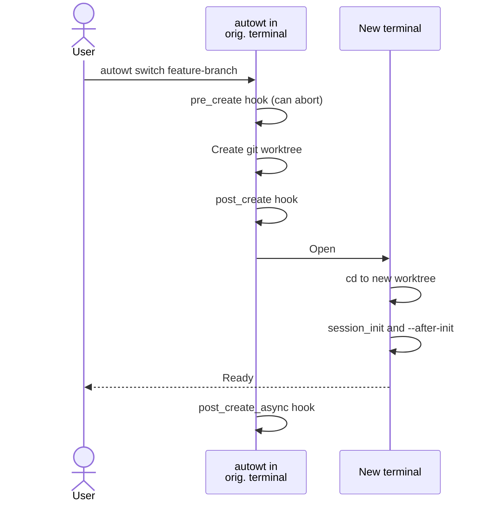
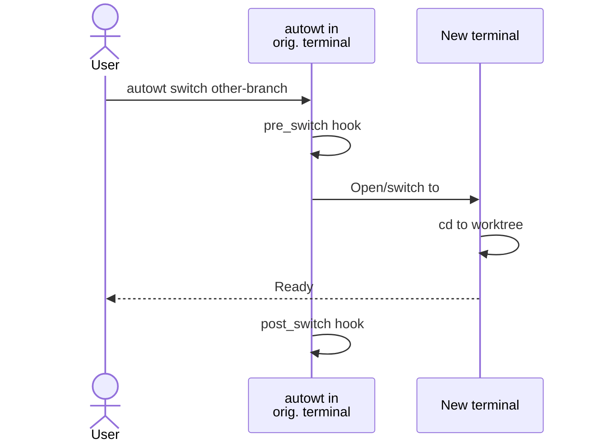
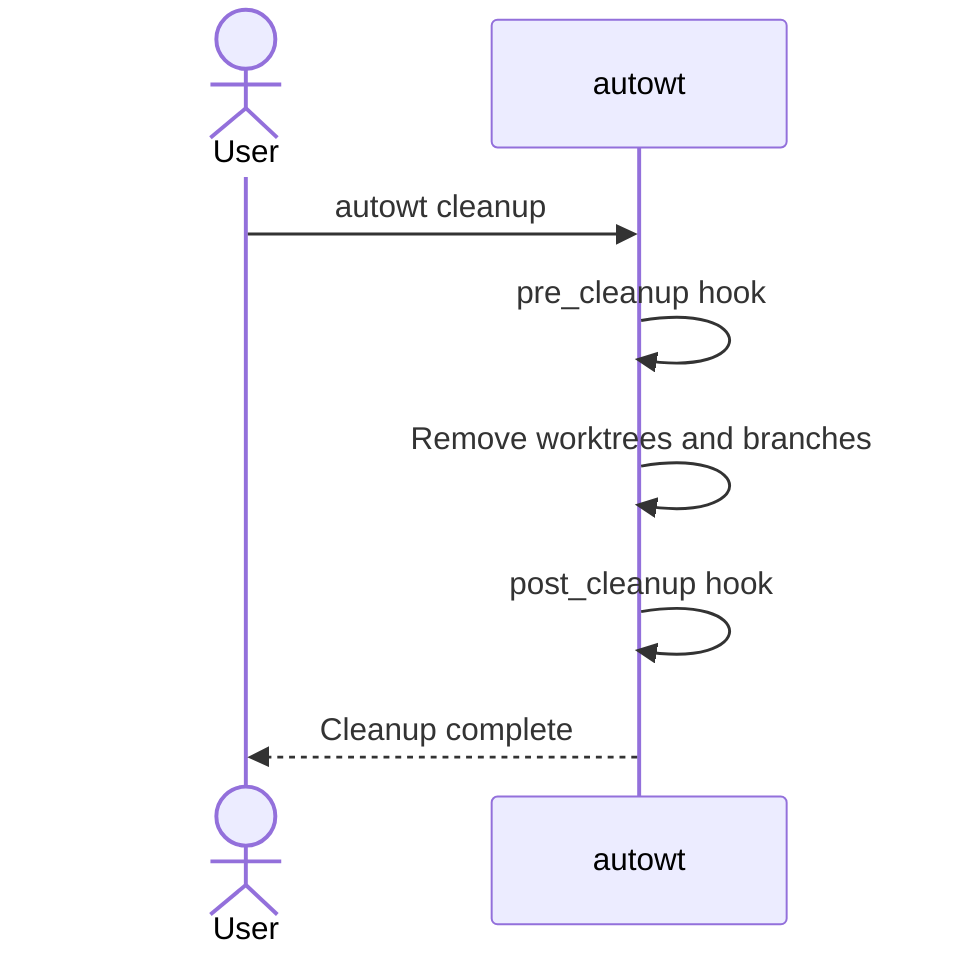

# Lifecycle Hooks and Init Scripts

`autowt` allows you to run custom commands at specific points during worktree operations. The motivating use cases are installing dependencies, copying secrets, and cleaning up resources.

## Example: installing dependencies and copying secrets

The most common hook is the **`session_init` script**, which runs in your new terminal session after creating a new worktree. This is perfect for setting up your shell environment, activating virtual environments, and running interactive setup tasks.

### Configuration

Set the `scripts.session_init` key in your `.autowt.toml` file:

```toml
# .autowt.toml
[scripts]
session_init = "npm install"
```

### Copying `.env` files

Worktrees start as clean checkouts, which means untracked files like `.env` are not automatically carried over. You can use an init script to copy these files from your main worktree.

autowt provides environment variables that make this easier, including `AUTOWT_MAIN_REPO_DIR` which points to the main repository directory.

```toml
# .autowt.toml
[scripts]
# Copy .env file from main worktree if it exists
session_init = """
npm install # kept from before
if [ -f "$AUTOWT_MAIN_REPO_DIR/.env" ]; then
  cp "$AUTOWT_MAIN_REPO_DIR/.env" .;
fi
"""
```

### Installing things in the background

If your dependency installation step takes a long time, you might wish to do all this in `post_create_async` instead of `session_init`. That way, you can get an interactive terminal without waiting for everything to get set up.

```toml
# .autowt.toml
[scripts]
post_create_async = """
npm install
if [ -f "$AUTOWT_MAIN_REPO_DIR/.env" ]; then
  cp "$AUTOWT_MAIN_REPO_DIR/.env" .;
fi
"""
```

## Quick reference

Beyond `session_init` scripts, autowt supports 8 lifecycle hooks that run at specific points during worktree operations:

<div class="autowt-hooks-wrapper"></div>

| Hook                                      | When it runs                                                                 | Execution Context                        |
| ----------------------------------------- | ---------------------------------------------------------------------------- | ---------------------------------------- |
| [`pre_create`](#pre_create)               | Before creating worktree                                                     | Workdir: main repo<br>Terminal: original |
| [`post_create`](#post_create)             | After creating worktree, before terminal switch                              | Workdir: worktree<br>Terminal: original  |
| [`post_create_async`](#post_create_async) | After terminal switch (or before `session_init`/`--after-init` in ECHO mode) | Workdir: worktree<br>Terminal: original  |
| [`session_init`](#session_init)           | In new terminal session after switching to worktree                          | Workdir: worktree<br>Terminal: new       |
| [`pre_cleanup`](#pre_cleanup)             | Before cleaning up worktrees                                                 | Workdir: worktree<br>Terminal: original  |
| [`post_cleanup`](#post_cleanup)           | After worktrees are removed                                                  | Workdir: main repo<br>Terminal: original |
| [`pre_switch`](#pre_switch)               | Before switching worktrees                                                   | Workdir: worktree<br>Terminal: original  |
| [`post_switch`](#post_switch)             | After switching worktrees                                                    | Workdir: worktree<br>Terminal: original  |

Note that there is a command-line-only `--after-init` flag to run additional commands after init is done. This is for cases when you want to immediately start up a one-off script after the worktree has been set up. If you find yourself repeating the same `--after-init` arg, consider writing a [custom script](./configuration.md#scriptscustom).

## Control flow diagrams

### Creating and switching to a new worktree



### Switching between existing worktrees



### Worktree cleanup



## Configuration

Project-level and global hooks run independently and do not override each other.

### Project-level configuration

Configure hooks in your project's `.autowt.toml` file:

```toml
# .autowt.toml
[scripts]
pre_create = "./scripts/validate-branch.sh"
post_create = "npm install && cp .env.example .env"
session_init = "source .env && npm run dev"
pre_cleanup = "./scripts/release-ports.sh"
post_cleanup = "./scripts/cleanup-volumes.sh"
pre_switch = "pkill -f 'npm run dev'"
post_switch = "npm run dev &"
```

### Global configuration

Configure hooks globally in `~/.config/autowt/config.toml` (Linux) or `~/Library/Application Support/autowt/config.toml` (macOS):

```toml
# Global config
[scripts]
pre_create = "echo 'Preparing to create worktree...'"
pre_cleanup = "echo 'Cleaning up worktree...'"
post_cleanup = "echo 'Worktree cleanup complete'"
```

## Environment variables and arguments

All hooks receive the following environment variables:

-   `AUTOWT_WORKTREE_DIR`: Path to the worktree directory (always set, even if directory doesn't exist yet or has been deleted)
-   `AUTOWT_MAIN_REPO_DIR`: Path to the main repository directory
-   `AUTOWT_BRANCH_NAME`: Name of the branch
-   `AUTOWT_HOOK_TYPE`: Type of hook being executed

**Working directory behavior**: Most hooks run with the worktree directory as their working directory. However, `pre_create` and `post_cleanup` hooks run with the **main repository directory** as their working directory, since the worktree doesn't exist yet (`pre_create`) or has been deleted (`post_cleanup`).

### Example script

```bash
# Using environment variables
echo "Hook type: $AUTOWT_HOOK_TYPE"
echo "Worktree: $AUTOWT_WORKTREE_DIR"
echo "Branch: $AUTOWT_BRANCH_NAME"

cd "$AUTOWT_WORKTREE_DIR"
# Do work here...

# Multi-line scripts work naturally
for file in *.txt; do
    echo "Processing $file"
done
```

### Hooks are executing using the system shell

Hook scripts are executed by passing the script text directly to the system shell (`/bin/sh` on Unix systems) rather than creating a temporary file. This is equivalent to running `/bin/sh -c "your_script_here"`.

This execution model means:

-   **Multi-line scripts work naturally**—the shell handles newlines and command separation
-   **All shell features are available**—variables, conditionals, loops, pipes, redirections, etc.
-   **Shebangs are ignored**—since no file is created, `#!/bin/bash` lines are treated as comments
-   **Cross-platform behavior is tricky**—PowerShell and bash are quite different! GitHub issues and pull requests on this topic are welcome.

```toml
[scripts]
# This works - shell script commands
post_create = """
echo "Setting up worktree"
npm install
mkdir -p logs
"""

# This works - calls external script file (shebang will work here)
post_create = "./setup-script.py"

# This doesn't work - shebang is ignored, shell tries to run Python code
post_create = """#!/usr/bin/env python3
import sys  # Shell doesn't understand this!
"""
```

If you need to use a different programming language, create a separate script file and call it from your hook. The external file can use shebangs normally.

!!! note "Why does it work like this?"

    This behavior is identical to Python's [`subprocess.run()`](https://docs.python.org/3/library/subprocess.html#subprocess.run) with `shell=True`.

## Complete reference

### `pre_create`

**Timing**: Before worktree creation begins  
**Execution Context**: Subprocess in main repository directory  
**Use cases**: Pre-flight validation, resource availability checks, branch name validation

The `pre_create` hook runs in the **main repository directory** (not the worktree directory, which doesn't exist yet). However, the `AUTOWT_WORKTREE_DIR` environment variable is still set to the path where the worktree will be created.

The `pre_create` hook can **prevent worktree creation** by exiting with a non-zero status. If this hook fails, autowt will completely abort worktree creation before the worktree is created.

```toml
[scripts]
pre_create = """
# Validate branch naming convention
if ! echo "$AUTOWT_BRANCH_NAME" | grep -q '^feature/\|^bugfix/\|^hotfix/'; then
  echo "Error: Branch must start with feature/, bugfix/, or hotfix/"
  exit 1
fi
"""
```

### `post_create`

**Timing**: After worktree creation, before terminal switch  
**Execution Context**: Subprocess in worktree directory  
**Use cases**: File operations, git setup, dependency installation, configuration copying

The `post_create` hook can **prevent terminal switching** by exiting with a non-zero status. If this hook fails, autowt will abort the operation (the worktree will exist but the terminal won't switch to it).

```toml
[scripts]
post_create = """
npm install
cp .env.example .env
"""
```

The post_create hook runs as a subprocess after the worktree is created but before switching to the terminal session. It's ideal for:

-   Installing dependencies that don't require shell interaction
-   Setting up configuration files
-   Running git commands
-   File operations that don't need shell environment

### `post_create_async`

**Timing**: After terminal switch (TAB/WINDOW modes) or before --after-init (ECHO/INPLACE modes)
**Execution Context**: Original terminal where autowt was invoked
**Use cases**: Expensive dependency installations that don't block terminal interactivity

The `post_create_async` hook is designed for **expensive operations** like `npm install`, `poetry install`, or `bundle install` that can run while the user is already working in the new terminal.

```toml
[scripts]
post_create_async = """
npm install
npm run build
"""
```

**Execution behavior varies by terminal mode:**

-   **TAB/WINDOW/VSCODE/CURSOR modes**: Runs in the original terminal _after_ the new terminal tab/window opens. The user can immediately start working in the new terminal while dependencies install in the background. The `autowt` process waits for completion before exiting.

-   **ECHO/INPLACE modes**: Runs _before_ `--after-init` since no actual terminal switch occurs. Ensures expensive operations complete before any after-init commands run.

**Failure handling**: Unlike `pre_create` and `post_create`, failures in this hook show a warning but don't abort the operation. Since the hook may run asynchronously, failures might not be detectable until after the user is already working.

**When to use**: Use `post_create_async` for operations that:

-   Are expensive but not critical for immediate work
-   Don't produce output the user needs to see right away
-   Can safely run while the user starts working (installing dependencies, building assets, etc.)

**When to use `post_create` instead**: Use the synchronous `post_create` hook for operations that:

-   Must complete before the user can work (copying config files, setting permissions)
-   Are fast and shouldn't delay terminal switching
-   Produce errors that should prevent terminal switching

### `session_init`

**Timing**: In terminal session after switching to worktree  
**Execution Context**: Terminal session (pasted/typed into terminal)  
**Use cases**: Virtual environment activation, shell configuration

```toml
[scripts]
session_init = """
source .env
conda activate myproject
export DEV_MODE=true
"""
```

The `session_init` hook is special—it's the only hook that runs **inside the new terminal session**. While other lifecycle hooks run inside the initial `autowt create` process, `session_init` scripts are literally pasted/typed into the terminal using terminal automation (i.e. AppleScript). This allows `session_init` scripts to: activate virtual environments or start interactive processes.

### `pre_cleanup`

**Timing**: Before any cleanup operations begin  
**Use cases**: Resource cleanup

```toml
[scripts]
pre_cleanup = """
# Release allocated ports
./scripts/release-ports.sh $AUTOWT_BRANCH_NAME
"""
```

### `post_cleanup`

**Timing**: After worktrees and branches are removed
**Execution Context**: Subprocess in main repository directory
**Use cases**: Volume cleanup, global state updates

The `post_cleanup` hook runs in the **main repository directory** (not the worktree directory, which has been deleted). However, the `AUTOWT_WORKTREE_DIR` environment variable is still set to the path where the worktree was located.

```toml
[scripts]
post_cleanup = """
# Clean up docker volumes
docker volume rm ${AUTOWT_BRANCH_NAME}_db_data 2>/dev/null || true
"""
```

### `pre_switch`

**Timing**: Before switching away from current worktree  
**Use cases**: Stop services, save state

```toml
[scripts]
pre_switch = """
# Stop development server
pkill -f "npm run dev" || true

# Save current state
./scripts/save-session-state.sh
"""
```

### `post_switch`

**Timing**: After switching to new worktree  
**Use cases**: Start services, restore state

```toml
[scripts]
post_switch = """
# Start development server in background
nohup npm run dev > dev.log 2>&1 &

# Restore session state
./scripts/restore-session-state.sh
"""
```
