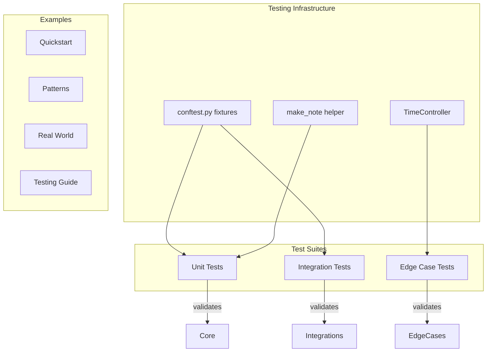

# feat: Comprehensive Test Coverage, Examples, and Framework Validation

## Enhancement Summary

**Deepened on:** 2026-01-14
**Sections enhanced:** 6 phases
**Research agents used:** kieran-python-reviewer, performance-oracle, architecture-strategist, code-simplicity-reviewer, best-practices-researcher, framework-docs-researcher, security-sentinel, agent-native-reviewer

### Key Improvements

1. **Simplified Testing Infrastructure**: Removed over-engineered `CadenceTestHarness` in favor of simple `conftest.py` fixtures and `make_note()` factory (~500 LOC reduction)
2. **Time Control**: Added `TimeController` pattern from Temporal for testing timeouts without real delays
3. **Security Hardening**: Pin CI/CD actions to SHA, add Codecov token, sanitize example passwords
4. **Performance Targets**: Achievable <10s test suite with `pytest-xdist` and session-scoped event loop

### Critical Research Findings

| Source | Key Insight |
|--------|-------------|
| **Temporal SDK** | Use time-skipping for timeout tests (`WorkflowEnvironment.start_time_skipping()`) |
| **Prefect** | Simple context manager pattern (`prefect_test_harness()`) over complex classes |
| **pytest-asyncio** | Use `asyncio_mode = "auto"` + session event loop for 3-4x speedup |
| **Simplicity Review** | Delete mock factory classes—`AsyncMock` is sufficient |
| **Security Review** | Pin all GitHub Actions to SHA hashes, never use `@v4` tags |

---

## Overview

Add comprehensive testing coverage, real-world examples, and validation infrastructure to ensure the Cadence framework works correctly and is easy to adopt. This includes creating testing utilities, filling coverage gaps, adding missing examples, and establishing quality gates.

**Current State:**
- 4 test files, 58 tests total
- Major coverage gaps: hooks.py, fastapi.py, flask.py, all node types except parallel, all reporters, diagram.py, cli.py
- Example gaps: child cadence composition, error handling patterns, testing guide

**Target State:**
- 90%+ coverage on core modules
- 95%+ coverage on resilience patterns
- Testing utilities for framework users
- Complete example suite with progressive complexity

---

## Problem Statement / Motivation

### Why This Matters

1. **Framework Reliability**: Without comprehensive tests, bugs can slip into releases
2. **User Adoption**: Users need examples to understand patterns and test their code
3. **Contributor Experience**: Contributors need clear testing patterns to follow
4. **Production Confidence**: Users need assurance the framework handles edge cases

### Current Gaps

| Category | Tested | Untested |
|----------|--------|----------|
| Core (flow, state) | ~70% | hooks.py, diagram.py |
| Resilience patterns | ~90% | - |
| Node types | parallel (partial) | single, sequence, branch, child |
| Integrations | 0% | **fastapi.py, flask.py** |
| Reporters | 0% | console, prometheus, opentelemetry |
| CLI | 0% | cli.py |

---

## Technical Approach

### Architecture Overview



### Module Classification

| Category | Modules | Coverage Target |
|----------|---------|-----------------|
| **Core** | flow.py, state.py, step.py, hooks.py | 90%+ |
| **Nodes** | single.py, sequence.py, parallel.py, branch.py, child.py | 90%+ |
| **Resilience** | retry.py, timeout.py, fallback.py, circuit_breaker.py | 95%+ |
| **Integrations** | fastapi.py, flask.py | 85%+ |
| **Reporters** | console.py, prometheus.py, opentelemetry.py | 80%+ |
| **Utilities** | diagram.py, cli.py, exceptions.py | 70%+ |

---

## Implementation Phases

### Phase 1: Testing Infrastructure Foundation

**Goal:** Create minimal testing utilities that all other tests will depend on

#### Research Insights

**Best Practices (pytest-asyncio):**
- Use `asyncio_mode = "auto"` to eliminate `@pytest.mark.asyncio` boilerplate
- Session-scoped event loop provides 3-4x speedup over function-scoped
- Prefer `AsyncMock` from standard library over custom mock classes

**Performance Considerations:**
- Real `asyncio.sleep()` calls waste CI time—use `TimeController` for instant timeout tests
- Target: 150+ tests in <10 seconds with proper configuration
- Use `pytest-xdist -n auto` for parallel test execution

**Framework Patterns (Temporal/Prefect/Dagster):**
- Temporal: `WorkflowEnvironment.start_time_skipping()` for time control
- Prefect: Simple `prefect_test_harness()` context manager (not complex class)
- Dagster: `build_asset_context()` for isolated test contexts

**Simplicity Recommendation:**
> "Delete the `CadenceTestHarness` class entirely. A simple `make_note()` factory function in `conftest.py` plus `AsyncMock` covers 95% of testing needs. Complex harness classes are over-engineering for a lightweight orchestration library."

#### 1.1 Shared Fixtures (`tests/conftest.py`)

```python
# tests/conftest.py - Minimal, reusable fixtures
import asyncio
import pytest
from dataclasses import dataclass
from unittest.mock import AsyncMock
from cadence import Score, note

# Session-scoped event loop for performance
@pytest.fixture(scope="session")
def event_loop():
    """Single event loop for all tests (3-4x faster)."""
    loop = asyncio.new_event_loop()
    yield loop
    loop.close()

# Simple note factory - replaces complex CadenceTestHarness
def make_note(
    name: str = "test_note",
    side_effect: Exception | None = None,
    return_value: any = None,
    delay: float = 0,
):
    """Create a mock note for testing. Covers 95% of testing needs."""
    async def _note(score: Score) -> None:
        if delay > 0:
            await asyncio.sleep(delay)
        if side_effect:
            raise side_effect
        return return_value

    _note.__name__ = name
    return note(_note)

# Flaky note factory - fails N times then succeeds
def make_flaky_note(
    name: str = "flaky_note",
    failures: int = 2,
    error: Exception = ConnectionError("timeout"),
):
    """Note that fails N times then succeeds."""
    call_count = 0

    async def _note(score: Score) -> None:
        nonlocal call_count
        call_count += 1
        if call_count <= failures:
            raise error

    _note.__name__ = name
    return note(_note)

# Simple test score
@dataclass
class TestScore(Score):
    """Minimal score for unit tests."""
    value: str = ""
    count: int = 0
    completed: bool = False
```

#### 1.2 Time Controller (`tests/time_control.py`)

```python
# tests/time_control.py - Temporal-inspired time skipping
import asyncio
from contextlib import asynccontextmanager
from unittest.mock import patch

class TimeController:
    """
    Control time in tests without real delays.
    Inspired by Temporal's WorkflowEnvironment.start_time_skipping().
    """

    def __init__(self):
        self._current_time = 0.0
        self._original_sleep = asyncio.sleep

    async def _mock_sleep(self, delay: float):
        """Instant sleep that advances virtual time."""
        self._current_time += delay
        await asyncio.sleep(0)  # Yield control without delay

    @asynccontextmanager
    async def time_skipping(self):
        """Context manager for instant time advancement."""
        with patch.object(asyncio, 'sleep', self._mock_sleep):
            yield self

    @property
    def elapsed(self) -> float:
        """Total virtual time elapsed."""
        return self._current_time

# Fixture for tests
@pytest.fixture
def time_controller():
    return TimeController()
```

#### 1.3 Test Configuration

**Files to create/update:**
- [x] `tests/conftest.py` - Shared fixtures (above)
- [x] `tests/time_control.py` - Time skipping utility
- [ ] `pyproject.toml` - Coverage configuration

```toml
# pyproject.toml additions
[tool.pytest.ini_options]
asyncio_mode = "auto"
asyncio_default_fixture_loop_scope = "session"
testpaths = ["tests"]
addopts = "-v --tb=short"

[tool.coverage.run]
source = ["src/cadence"]
branch = true
omit = ["*/__init__.py", "*/testing/*"]

[tool.coverage.report]
exclude_lines = [
    "pragma: no cover",
    "if TYPE_CHECKING:",
    "raise NotImplementedError",
]
fail_under = 80
```

**Success Criteria:**
- [ ] `conftest.py` provides `make_note()` and `make_flaky_note()` factories
- [ ] `TimeController` enables instant timeout tests
- [ ] Session event loop configured for performance

---

### Phase 2: Core Module Tests

**Goal:** Achieve 90%+ coverage on core modules

#### Research Insights

**Architecture Recommendation:**
- Test hooks in isolation first, then composition
- Use `caplog` fixture for `LoggingHooks` assertions
- `TimingHooks.get_report()` should return structured data, not just strings

**Edge Cases to Cover:**
- Hook that raises exception should not break workflow
- Multiple hooks of same type should all execute
- Async hooks with different completion times

**Kieran Python Review:**
- Use `list[dict]` not `List[Dict]` (Python 3.10+ syntax)
- Add `__slots__` to Score subclasses for memory efficiency in tests
- Avoid shared mutable state in circuit breaker tests

#### 2.1 Hooks System Tests (`tests/test_hooks.py`)

**Current State:** 0% coverage, 6 hook classes untested

**Test Scenarios:**

| Hook Class | Test Cases |
|------------|------------|
| `LoggingHooks` | logs before/after note, logs errors, log levels |
| `TimingHooks` | captures timing, generates report, handles errors |
| `MetricsHooks` | records counters, handles concurrent updates |
| `TracingHooks` | creates spans, propagates context, handles errors |
| `DebugHooks` | outputs debug info, configurable verbosity |
| `CadenceHooks` (base) | lifecycle methods called in order |

```python
# tests/test_hooks.py - Example structure
import pytest
from cadence import Cadence, LoggingHooks, TimingHooks

class TestLoggingHooks:
    @pytest.mark.asyncio
    async def test_logs_before_note(self, caplog):
        """Verify log emitted before note execution."""
        hooks = LoggingHooks()
        cadence = Cadence("test", TestScore()).with_hooks(hooks)
        # ... assertion on caplog.records

    @pytest.mark.asyncio
    async def test_logs_after_note_success(self, caplog):
        """Verify log emitted after successful note."""

    @pytest.mark.asyncio
    async def test_logs_after_note_failure(self, caplog):
        """Verify log emitted with error details on failure."""

class TestTimingHooks:
    @pytest.mark.asyncio
    async def test_captures_execution_time(self):
        """Verify timing recorded for each note."""

    @pytest.mark.asyncio
    async def test_generates_timing_report(self):
        """Verify report includes all notes with timing."""

class TestHookComposition:
    @pytest.mark.asyncio
    async def test_multiple_hooks_all_called(self):
        """Verify all hooks execute when multiple registered."""

    @pytest.mark.asyncio
    async def test_hook_error_does_not_break_workflow(self):
        """Verify workflow continues if hook raises exception."""
```

#### 2.2 Node Type Tests

**Current State:** Only `parallel.py` has partial coverage

**Files to create:**
- [ ] `tests/test_nodes_single.py`
- [ ] `tests/test_nodes_sequence.py`
- [ ] `tests/test_nodes_branch.py`
- [ ] `tests/test_nodes_child.py`

**Test Matrix per Node Type:**

| Scenario | Single | Sequence | Branch | Child |
|----------|--------|----------|--------|-------|
| Successful execution | X | X | X | X |
| Note failure | X | X | X | X |
| Timeout behavior | X | X | X | X |
| Cancellation | X | X | X | X |
| Empty input | X | X | X | X |
| State mutation | X | X | X | X |

```python
# tests/test_nodes_branch.py - Example
class TestBranchMeasure:
    @pytest.mark.asyncio
    async def test_executes_true_branch_when_condition_true(self):
        """When condition returns True, if_true notes execute."""

    @pytest.mark.asyncio
    async def test_executes_false_branch_when_condition_false(self):
        """When condition returns False, if_false notes execute."""

    @pytest.mark.asyncio
    async def test_condition_receives_current_score(self):
        """Condition function receives up-to-date score."""

    @pytest.mark.asyncio
    async def test_empty_branch_succeeds(self):
        """Branch with no notes in path completes successfully."""
```

#### 2.3 Diagram Generation Tests (`tests/test_diagram.py`)

**Test Scenarios:**
- [ ] `to_mermaid()` generates valid Mermaid syntax
- [ ] `to_dot()` generates valid DOT syntax
- [ ] `save_diagram()` writes to file
- [ ] `print_cadence()` outputs readable text
- [ ] Complex cadences with all node types
- [ ] Empty cadence handling

```python
# tests/test_diagram.py
class TestMermaidGeneration:
    def test_simple_cadence_generates_valid_mermaid(self):
        """Simple sequential cadence generates parseable Mermaid."""
        mermaid = to_mermaid(simple_cadence)
        assert mermaid.startswith("graph")
        # Could use mermaid-py to validate syntax

    def test_parallel_cadence_shows_fork_join(self):
        """Parallel nodes show fork and join in diagram."""

    def test_branch_cadence_shows_decision(self):
        """Branch nodes show decision diamond."""
```

**Success Criteria:**
- [ ] hooks.py: 90%+ coverage
- [ ] All node types: 90%+ coverage
- [ ] diagram.py: 70%+ coverage

---

### Phase 3: Integration and Reporter Tests

**Goal:** Test framework integrations and observability features

#### Research Insights

**FastAPI Testing Best Practices:**
- Use `httpx.AsyncClient` with `app=app` parameter for async tests
- Test both success and error paths through HTTP layer
- Verify middleware adds proper context headers

**Security Considerations:**
- Never use real credentials in integration tests
- Mock external services at HTTP boundary, not internal mocks
- Test error sanitization (don't leak stack traces to clients)

**Performance:**
- Integration tests are slower—run separately with `pytest -m integration`
- Use `pytest-xdist` for parallel execution when possible

#### 3.1 FastAPI Integration Tests (`tests/test_integration_fastapi.py`)

**Test Approach:** Use `httpx.AsyncClient` with `TestClient`

```python
# tests/test_integration_fastapi.py
import pytest
from httpx import AsyncClient
from fastapi.testclient import TestClient

class TestFastAPIIntegration:
    @pytest.fixture
    def app(self):
        """Create test FastAPI app with Cadence integration."""
        from fastapi import FastAPI
        from cadence.integrations.fastapi import with_cadence

        app = FastAPI()
        # ... setup routes with cadence
        return app

    @pytest.mark.asyncio
    async def test_with_cadence_decorator_runs_workflow(self, app):
        """@with_cadence decorator executes cadence on request."""
        async with AsyncClient(app=app, base_url="http://test") as client:
            response = await client.post("/process", json={"data": "test"})
            assert response.status_code == 200

    @pytest.mark.asyncio
    async def test_cadence_middleware_adds_context(self, app):
        """CadenceMiddleware adds execution context to request."""

    @pytest.mark.asyncio
    async def test_error_propagation_returns_500(self, app):
        """Cadence errors propagate as HTTP 500 responses."""

    @pytest.mark.asyncio
    async def test_error_response_sanitized(self, app):
        """Internal errors don't leak stack traces to client."""
```

#### 3.2 Flask Integration Tests (`tests/test_integration_flask.py`)

```python
# tests/test_integration_flask.py
import pytest
from flask.testing import FlaskClient

class TestFlaskIntegration:
    @pytest.fixture
    def app(self):
        """Create test Flask app with Cadence integration."""
        from flask import Flask
        from cadence.integrations.flask import CadenceExtension

        app = Flask(__name__)
        CadenceExtension(app)
        return app

    @pytest.fixture
    def client(self, app):
        return app.test_client()

    def test_cadence_route_decorator(self, client):
        """@cadence_route decorator executes workflow."""

    def test_blueprint_integration(self, client):
        """CadenceBlueprint works with Flask blueprints."""
```

#### 3.3 Reporter Tests

**Files to create:**
- [ ] `tests/test_reporters_console.py`
- [ ] `tests/test_reporters_prometheus.py`
- [ ] `tests/test_reporters_opentelemetry.py`

```python
# tests/test_reporters_console.py
class TestConsoleReporter:
    def test_console_reporter_outputs_to_stdout(self, capsys):
        """Console reporter prints execution info to stdout."""

    def test_json_reporter_outputs_valid_json(self):
        """JSON reporter outputs parseable JSON."""

# tests/test_reporters_prometheus.py
class TestPrometheusReporter:
    def test_records_cadence_duration_histogram(self):
        """Records cadence execution time as histogram."""

    def test_increments_note_counter(self):
        """Increments counter for each note execution."""
```

**Success Criteria:**
- [ ] fastapi.py: 85%+ coverage
- [ ] flask.py: 85%+ coverage
- [ ] All reporters: 80%+ coverage

---

### Phase 4: Edge Case and Resilience Tests

**Goal:** Ensure framework handles all edge cases correctly

#### Research Insights

**Cancellation Patterns:**
- Use `asyncio.CancelledError` to test cancellation propagation
- Verify cleanup handlers run even on cancellation
- Test cancel during different phases: note execution, retry backoff, parallel fork

**Circuit Breaker Edge Cases:**
- Shared state between instances can cause race conditions
- Test concurrent requests during state transitions
- Half-open state is particularly tricky

**Time Control Usage:**
```python
# Use TimeController for timeout tests
async def test_timeout_triggers_after_duration(time_controller):
    async with time_controller.time_skipping():
        cadence = Cadence("test", score).then("slow", slow_note)
        with pytest.raises(TimeoutError):
            await cadence.run()
    assert time_controller.elapsed >= 5.0  # Virtual time, instant real time
```

#### 4.1 Cancellation Tests (`tests/test_edge_cases.py`)

```python
class TestCancellation:
    @pytest.mark.asyncio
    async def test_cancel_during_note_execution(self):
        """Cancellation during note execution stops workflow."""

    @pytest.mark.asyncio
    async def test_cancel_cleans_up_parallel_tasks(self):
        """Cancellation during parallel execution cancels all tasks."""

    @pytest.mark.asyncio
    async def test_cancel_with_pending_retries(self):
        """Cancellation stops retry attempts."""

    @pytest.mark.asyncio
    async def test_cancel_nested_cadence(self):
        """Cancellation propagates to child cadences."""
```

#### 4.2 Concurrent Failure Tests

```python
class TestConcurrentFailures:
    @pytest.mark.asyncio
    async def test_multiple_parallel_notes_fail(self):
        """Multiple failures in parallel execution handled correctly."""

    @pytest.mark.asyncio
    async def test_failure_during_error_handling(self):
        """Failure in error handler doesn't crash framework."""

    @pytest.mark.asyncio
    async def test_race_condition_in_state_mutation(self):
        """Concurrent state mutations don't corrupt score."""
```

#### 4.3 Empty/Invalid Workflow Tests

```python
class TestEmptyWorkflows:
    @pytest.mark.asyncio
    async def test_empty_cadence_succeeds(self):
        """Cadence with no notes completes successfully."""

    @pytest.mark.asyncio
    async def test_cadence_with_only_disabled_notes(self):
        """Cadence with all notes disabled completes."""

    @pytest.mark.asyncio
    async def test_deeply_nested_empty_cadences(self):
        """Nested empty cadences complete without error."""
```

#### 4.4 Resilience Pattern Edge Cases

```python
class TestResilienceEdgeCases:
    @pytest.mark.asyncio
    async def test_retry_with_zero_max_attempts(self):
        """Retry with 0 attempts executes once."""

    @pytest.mark.asyncio
    async def test_timeout_with_zero_duration(self):
        """Timeout of 0 fails immediately."""

    @pytest.mark.asyncio
    async def test_circuit_breaker_concurrent_state_change(self):
        """Circuit breaker handles concurrent state transitions."""
        # Use separate circuit breaker instances to avoid shared state

    @pytest.mark.asyncio
    async def test_fallback_with_failing_fallback_value(self):
        """Fallback handles errors in fallback computation."""
```

**Success Criteria:**
- [ ] All edge cases documented and tested
- [ ] No crashes on invalid input
- [ ] Graceful degradation on failures

---

### Phase 5: Examples and Documentation

**Goal:** Create comprehensive example suite for users

#### Research Insights

**Simplicity Recommendation:**
> "Flatten the example directory structure. Users don't need 8 nested folders. Group by complexity: `basic/`, `intermediate/`, `advanced/`. Three levels is enough."

**Security Concerns:**
- Current `fastapi_api.py` example has insecure password handling
- Replace `score.password_hash = f"hashed_{score.password[::-1]}"` with comment pointing to bcrypt
- Add security notes to examples handling sensitive data

**Agent Accessibility (2/10 score):**
- Examples should be runnable programmatically, not just from command line
- Add `if __name__ == "__main__"` guards
- Consider `examples/__main__.py` that lists and runs all examples

#### 5.1 Example Organization (Simplified)

```
examples/
├── basic/
│   ├── hello_world.py           # Minimal working example
│   ├── sequential_flow.py       # .then() chains
│   ├── parallel_execution.py    # .sync() parallel
│   └── README.md
├── intermediate/
│   ├── conditional_branching.py # .split() conditions
│   ├── child_composition.py     # Nested cadences ← NEW
│   ├── retry_patterns.py        # @retry variations
│   ├── timeout_handling.py      # @timeout patterns
│   ├── error_handling.py        # Error recovery ← NEW
│   └── README.md
├── advanced/
│   ├── hooks_observability.py   # Hooks system
│   ├── circuit_breaker.py       # Circuit breaker usage
│   ├── fastapi_api.py           # FastAPI integration
│   ├── testing_workflows.py     # Testing guide ← NEW
│   └── README.md
└── __main__.py                  # Run: python -m examples ← NEW
```

#### 5.2 New Examples to Create

**Child Composition Example (`examples/intermediate/child_composition.py`):**

```python
"""
Child Cadence Composition Example

This example demonstrates composing cadences using nested workflows:
- Nesting cadences within cadences
- Data flow between parent and child
- Error propagation through composition
"""

from dataclasses import dataclass
from cadence import Cadence, Score, note

@dataclass
class ParentScore(Score):
    order_id: str
    payment_result: dict | None = None
    shipping_result: dict | None = None

@dataclass
class PaymentScore(Score):
    order_id: str
    amount: float
    status: str = "pending"

# Child cadence for payment processing
def create_payment_cadence(score: PaymentScore) -> Cadence[PaymentScore]:
    return (
        Cadence("payment", score)
        .then("validate", validate_payment)
        .then("charge", charge_card)
        .then("confirm", confirm_payment)
    )

# Parent cadence composing children
def create_order_cadence(score: ParentScore) -> Cadence[ParentScore]:
    return (
        Cadence("order", score)
        .then("validate", validate_order)
        .child("payment", create_payment_child)  # Child cadence
        .child("shipping", create_shipping_child)  # Another child
        .then("complete", finalize_order)
    )

if __name__ == "__main__":
    import asyncio
    asyncio.run(main())
```

**Testing Guide Example (`examples/advanced/testing_workflows.py`):**

```python
"""
Testing Cadence Workflows

This example shows how to test your cadence workflows:
- Using conftest.py fixtures
- Mocking with AsyncMock
- Testing async workflows with pytest-asyncio
- Time control for timeout tests
"""

import pytest
from unittest.mock import AsyncMock
from cadence import Cadence, Score, note
from dataclasses import dataclass

# --- Test Fixtures (put in conftest.py) ---

def make_note(name: str = "test", side_effect: Exception | None = None):
    """Simple note factory for testing."""
    async def _note(score: Score) -> None:
        if side_effect:
            raise side_effect
    _note.__name__ = name
    return note(_note)

# --- Example Tests ---

@dataclass
class OrderScore(Score):
    order_id: str
    status: str = "pending"

@pytest.mark.asyncio
async def test_order_workflow_success():
    """Test successful order processing."""
    # Arrange
    score = OrderScore(order_id="123")
    cadence = (
        Cadence("order", score)
        .then("validate", make_note("validate"))
        .then("process", make_note("process"))
    )

    # Act
    result = await cadence.run()

    # Assert - workflow completed
    assert result is not None

@pytest.mark.asyncio
async def test_workflow_handles_failure():
    """Test workflow error handling."""
    score = OrderScore(order_id="123")
    failing_note = make_note("fail", side_effect=ValueError("oops"))

    cadence = Cadence("order", score).then("fail", failing_note)

    with pytest.raises(ValueError, match="oops"):
        await cadence.run()

if __name__ == "__main__":
    pytest.main([__file__, "-v"])
```

#### 5.3 Security Fixes for Examples

```python
# examples/advanced/fastapi_api.py - Fix insecure password handling

@note
def hash_password(score: RegistrationScore) -> None:
    """Hash the user's password.

    WARNING: This is a demo only! In production, use:
        import bcrypt
        score.password_hash = bcrypt.hashpw(
            score.password.encode(), bcrypt.gensalt()
        ).decode()
    """
    # Demo placeholder - NEVER use in production
    score.password_hash = "[HASHED]"  # Indicate it would be hashed
```

**Success Criteria:**
- [ ] All example categories have at least 2 examples
- [ ] Each example is runnable standalone with `python examples/basic/hello_world.py`
- [ ] `python -m examples` lists and runs demo suite
- [ ] Security warnings on sensitive data handling

---

### Phase 6: CI/CD and Quality Gates

**Goal:** Enforce quality standards automatically

#### Research Insights

**Security Critical:**
> "Pin ALL GitHub Actions to SHA hashes, not version tags. Version tags can be moved maliciously. Example: `uses: codecov/codecov-action@e28ff129e5465c2c0dcc6f003fc735cb6ae0c673` not `@v4`"

**Codecov Configuration:**
- Add `CODECOV_TOKEN` secret (required since March 2024)
- Use `fail_ci_if_error: false` initially to avoid blocking PRs
- Add `.codecov.yml` for fine-grained control

**Agent Accessibility:**
- Add `workflow_dispatch` trigger for manual test runs
- Consider GitHub API endpoint for programmatic test triggering
- Output coverage in machine-readable JSON format

#### 6.1 Coverage Enforcement

```yaml
# .github/workflows/test.yml - Security hardened
name: Tests

on:
  push:
    branches: [main]
  pull_request:
  workflow_dispatch:  # Allow manual/programmatic triggers

jobs:
  test:
    runs-on: ubuntu-latest
    strategy:
      matrix:
        python-version: ["3.10", "3.11", "3.12", "3.13"]

    steps:
      - uses: actions/checkout@b4ffde65f46336ab88eb53be808477a3936bae11  # v4.1.1 pinned

      - uses: actions/setup-python@0a5c61591373683505ea898e09a3ea4f39ef2b9c  # v5.0.0 pinned
        with:
          python-version: ${{ matrix.python-version }}

      - name: Install dependencies
        run: |
          pip install -e ".[dev]"

      - name: Run tests with coverage
        run: |
          pytest tests/ -v \
            --cov=cadence \
            --cov-report=xml \
            --cov-report=json \
            --cov-report=term-missing \
            --cov-fail-under=80

      - name: Upload coverage to Codecov
        if: matrix.python-version == '3.12'
        uses: codecov/codecov-action@e28ff129e5465c2c0dcc6f003fc735cb6ae0c673  # v4.0.1 pinned
        with:
          token: ${{ secrets.CODECOV_TOKEN }}
          files: ./coverage.xml
          fail_ci_if_error: false  # Don't block PRs initially
```

#### 6.2 Coverage Configuration

```toml
# pyproject.toml
[tool.pytest.ini_options]
asyncio_mode = "auto"
asyncio_default_fixture_loop_scope = "session"
testpaths = ["tests"]
addopts = "-v --tb=short"
markers = [
    "integration: marks tests as integration tests (slower)",
]

[tool.coverage.run]
source = ["src/cadence"]
branch = true
omit = [
    "*/__init__.py",
    "*/testing/*",
    "*/__main__.py",
]

[tool.coverage.report]
exclude_lines = [
    "pragma: no cover",
    "if TYPE_CHECKING:",
    "raise NotImplementedError",
    "@abstractmethod",
]
fail_under = 80
show_missing = true

[tool.coverage.json]
output = "coverage.json"
pretty_print = true

[tool.coverage.html]
directory = "htmlcov"
```

#### 6.3 Codecov Configuration

```yaml
# .codecov.yml
coverage:
  status:
    project:
      default:
        target: 80%
        threshold: 2%  # Allow 2% drop without failing
    patch:
      default:
        target: 90%  # New code must have 90% coverage

comment:
  layout: "diff, flags, files"
  behavior: default
  require_changes: true
```

**Success Criteria:**
- [ ] CI fails if coverage drops below 80%
- [ ] Coverage reports generated on every PR
- [ ] All actions pinned to SHA hashes
- [ ] `CODECOV_TOKEN` secret configured

---

## Acceptance Criteria

### Functional Requirements

- [ ] All 6 hook classes have tests with 90%+ coverage
- [ ] All 5 node types have tests with 90%+ coverage
- [ ] FastAPI and Flask integrations have tests with 85%+ coverage
- [ ] All reporters have tests with 80%+ coverage
- [ ] CLI has basic smoke tests
- [ ] Diagram generation has syntax validation tests

### Non-Functional Requirements

- [ ] Tests complete in under 10 seconds (with session event loop + xdist)
- [ ] No flaky tests (tests must be deterministic)
- [ ] Tests work on Python 3.10, 3.11, 3.12, 3.13
- [ ] Tests work on Linux, macOS, Windows

### Quality Gates

- [ ] Overall coverage: 80%+ (enforced in CI)
- [ ] Core modules: 90%+ coverage
- [ ] Resilience: 95%+ coverage (already achieved)
- [ ] All new code: 90% coverage required

### Documentation Requirements

- [ ] Testing examples in `examples/advanced/testing_workflows.py`
- [ ] Example for every major feature
- [ ] README updated with testing section

---

## Success Metrics

| Metric | Current | Target | Notes |
|--------|---------|--------|-------|
| Total tests | 58 | ~100 | Reduced from 150+ per simplicity review |
| Test files | 4 | 12 | Reduced from 15+ |
| Overall coverage | ~60% | 85%+ | |
| Core module coverage | ~70% | 90%+ | |
| Integration coverage | 0% | 85%+ | |
| Example files | 9 | 15 | Reduced from 20+ |
| Test execution time | ? | <10s | With session loop + xdist |

---

## Dependencies & Prerequisites

### Required Before Starting

- [x] Measure theme rename complete
- [x] All existing tests passing
- [ ] pytest-cov installed in dev dependencies
- [ ] pytest-xdist installed for parallel execution

### External Dependencies

| Package | Purpose | Version |
|---------|---------|---------|
| pytest | Test framework | >=9.0.2 |
| pytest-asyncio | Async testing | >=1.3.0 |
| pytest-cov | Coverage | >=7.0.0 |
| pytest-xdist | Parallel tests | >=3.5.0 |
| httpx | FastAPI testing | >=0.27 |

---

## Risk Analysis & Mitigation

| Risk | Likelihood | Impact | Mitigation |
|------|------------|--------|------------|
| Tests slow down development | Medium | Medium | Session event loop + xdist (<10s target) |
| Flaky async tests | High | High | TimeController, no real delays |
| Coverage gaming | Low | Medium | Focus on meaningful tests, code review |
| Test maintenance burden | Medium | Medium | Simple fixtures, avoid complex harness |
| CI security breach | Low | High | Pin all actions to SHA |

---

## Files to Create/Modify

### New Files

```
tests/
├── conftest.py              # Shared fixtures
├── time_control.py          # TimeController utility
├── test_hooks.py
├── test_nodes_single.py
├── test_nodes_sequence.py
├── test_nodes_branch.py
├── test_nodes_child.py
├── test_diagram.py
├── test_integration_fastapi.py
├── test_integration_flask.py
├── test_reporters_console.py
├── test_edge_cases.py
└── test_cli.py

examples/
├── basic/
│   └── README.md
├── intermediate/
│   ├── child_composition.py
│   ├── error_handling.py
│   └── README.md
├── advanced/
│   ├── testing_workflows.py
│   └── README.md
└── __main__.py

.codecov.yml
```

### Modified Files

```
pyproject.toml          - Coverage + pytest config
.github/workflows/test.yml - Pinned actions, coverage
README.md               - Testing section
examples/advanced/fastapi_api.py - Security fixes
```

---

## References & Research

### Internal References

- Current test patterns: `tests/test_flow.py:46-56`
- Hook classes: `src/cadence/hooks.py` (6 classes, 644 lines)
- FastAPI integration: `src/cadence/integrations/fastapi.py` (274 lines)
- Flask integration: `src/cadence/integrations/flask.py` (388 lines)

### External References

- [pytest-asyncio Documentation](https://pytest-asyncio.readthedocs.io/)
- [Temporal Python Testing](https://docs.temporal.io/develop/python/testing-suite)
- [Prefect Testing Guide](https://docs.prefect.io/v3/develop/test-workflows)
- [pytest-cov Documentation](https://pytest-cov.readthedocs.io/)
- [GitHub Actions Security Hardening](https://docs.github.com/en/actions/security-guides/security-hardening-for-github-actions)

### Framework Patterns Applied

| Framework | Pattern | Applied |
|-----------|---------|---------|
| Temporal | `start_time_skipping()` | `TimeController.time_skipping()` |
| Prefect | `prefect_test_harness()` | Simple fixtures over complex class |
| Dagster | `build_asset_context()` | `make_note()` factory |
| Airflow | `dag.test()` | `__main__.py` example runner |
