# Core Concepts

Understanding the core concepts behind the CapiscIO Python SDK will help you use it effectively and make informed configuration decisions.

## Unilateral Protection: The Key Difference

**The core insight:** You can't control other agents' security practices, but you can control what YOUR agent accepts and calls.

```mermaid
graph LR
    A[Untrusted Agent] -->|Malicious Request| B[Your Agent]
    B -->|Always Validates| C{Security Layer}
    C -->|Blocks| D[❌ Rejected]
    C -->|Allows| E[✅ Processed]
    
    B -->|Calls Other Agent| F{Validates Target}
    F -->|Invalid| G[❌ Don't Call]
    F -->|Valid| H[✅ Safe to Call]
```



**Why This Matters:**

- ❌ You can't control if other agents are compromised
- ❌ You can't force peers to implement security
- ❌ You can't trust that agents follow the protocol correctly
- ✅ **But you CAN protect yourself unilaterally**

**The CapiscIO Python SDK ensures:**

1. All incoming requests are validated before processing
2. All outgoing calls are only to validated, safe agents
3. Your agent never processes malicious input
4. Your agent never calls unsafe endpoints

**No peer cooperation required. No permission needed. Just protection.**

---

## Security Architecture


## Validation Layers

### 1. Downstream Protection (Incoming)

Validates requests **before** they reach your agent.

**Validators:**

- **Message Validator**: Schema and structure
  - *Why it matters:* A missing `message_id` can break your task tracking. Empty `parts` arrays crash parsers. We've seen agents brought down by null sender IDs.
  
- **Protocol Validator**: A2A protocol compliance
  - *Why it matters:* Invalid protocol versions cause silent failures. Wrong message types in state transitions create stuck tasks. Header mismatches leak metadata.
  
- **Signature Validator**: JWT/JWS verification (optional)
  - *Why it matters:* Without signature verification, any agent can impersonate trusted peers. One compromised agent becomes a gateway to your entire agent network.
  
- **Rate Limiter**: Token bucket algorithm
  - *Why it matters:* A single misbehaving agent can send 10,000 requests in seconds, overwhelming your resources and blocking legitimate agents.

**Purpose:** Protect your agent from:
- Malformed messages that crash your code
- Protocol violations that create undefined behavior
- Excessive requests that exhaust your resources
- Spoofed identities claiming to be trusted agents

### 2. Upstream Protection (Outgoing)

Validates agents **before** you call them.

**Validators:**

- **Agent Card Validator**: Discovery metadata
  - *Why it matters:* An agent card with missing capabilities means you'll call endpoints that don't exist. Invalid provider info means you can't verify identity. Broken discovery = wasted calls and failed tasks.
  
- **Certificate Validator**: TLS/SSL certificates
  - *Why it matters:* Expired certificates mean man-in-the-middle attacks succeed. Self-signed certs can't be verified. Hostname mismatches expose you to DNS hijacking. We've seen entire agent networks compromised through one expired cert.
  
- **URL Security Validator**: SSRF prevention
  - *Why it matters:* An attacker sends you `http://localhost/admin/delete-everything`. Without validation, your agent makes that call with YOUR credentials. SSRF is how cloud metadata services get compromised.
  
- **Semver Validator**: Version compatibility
  - *Why it matters:* Calling an agent with breaking API changes means silent failures or data corruption. Version mismatches are the #1 cause of integration failures in production.

**Purpose:** Protect your agent from:
- Misconfigured agents that waste your calls
- Expired certificates that expose your traffic
- SSRF attacks that compromise internal services
- Version incompatibilities that break integrations

## Validation Results


Every validation returns a `ValidationResult` with **three score dimensions**:

```python
from capiscio_sdk.types import ValidationResult, ValidationIssue, ValidationSeverity

result = ValidationResult(
    success=True,              # Overall pass/fail
    compliance=ComplianceScore(total=95, ...),
    trust=TrustScore(total=90, ...),
    availability=AvailabilityScore(total=None, ...),
    issues=[                   # List of issues found
        ValidationIssue(
            severity=ValidationSeverity.WARNING,
            code="DEPRECATED_FIELD",
            message="Field 'old_param' is deprecated",
            path="message.old_param"
        )
    ],
    metadata={"validator": "message"}  # Additional context
)
```

### Severity Levels

| Severity | Impact | Typical Action |
|----------|--------|----------------|
| **ERROR** | Validation fails | Block request (block mode) |
| **WARNING** | Validation passes | Log for monitoring |
| **INFO** | No issues | Normal operation |

### Scoring System

Validation now uses **three score dimensions**:

- **Compliance (0-100):** Protocol specification adherence
- **Trust (0-100):** Security and authenticity signals
- **Availability (0-100):** Operational readiness (optional)

Each dimension has its own breakdown and rating enum. Example:

```python
result.compliance.total      # 0-100
result.trust.total           # 0-100
result.availability.total    # 0-100 or None
result.compliance.rating    # ComplianceRating enum
result.trust.rating         # TrustRating enum
result.availability.rating  # AvailabilityRating enum
```

**Migration Note:**

- Old: `result.score` (deprecated)
- New: `result.compliance.total`, `result.trust.total`, `result.availability.total`

## Configuration Presets

### Development Preset

```python
SecurityConfig.development()
```

**Characteristics:**
- ❌ Signatures not required
- ❌ Rate limiting disabled
- 📝 Fail mode: log only
- ✅ Schema validation enabled

**Use when:** Local development, debugging, rapid iteration

### Production Preset (Default)

```python
SecurityConfig.production()
```

**Characteristics:**
- ⚪ Signatures optional (verify if present)
- ✅ Rate limiting enabled (60/min)
- 🚫 Fail mode: block
- ✅ All validations enabled

**Use when:** Production deployment, staging environments

### Strict Preset

```python
SecurityConfig.strict()
```

**Characteristics:**
- ✅ Signatures **required**
- ✅ Rate limiting enabled (60/min)
- ✅ Upstream agent testing enabled
- 🚫 Fail mode: block
- ✅ Maximum security settings

**Use when:** High-security environments, financial transactions, sensitive data

### From Environment

```python
SecurityConfig.from_env()
```

Loads configuration from environment variables:

```bash
# Downstream config
export CAPISCIO_VALIDATE_SCHEMA=true
export CAPISCIO_VERIFY_SIGNATURES=true
export CAPISCIO_REQUIRE_SIGNATURES=false
export CAPISCIO_RATE_LIMITING=true
export CAPISCIO_RATE_LIMIT_RPM=100

# Upstream config
export CAPISCIO_VALIDATE_UPSTREAM=true
export CAPISCIO_CACHE_VALIDATION=true

# General
export CAPISCIO_FAIL_MODE=block
export CAPISCIO_TIMEOUT_MS=5000
```

**Use when:** 12-factor apps, containerized deployments, CI/CD pipelines

## Fail Modes

How the executor responds to validation failures:

### Block Mode (Default)

```python
config.fail_mode = "block"
```

**Behavior:**
- ✅ Validation passes → Request proceeds
- ❌ Validation fails → Request rejected with error

**Use when:** Production, security is critical

### Monitor Mode

```python
config.fail_mode = "monitor"
```

**Behavior:**
- ✅ Validation passes → Request proceeds
- ❌ Validation fails → Request proceeds **with warning log**

**Use when:** Testing security in production, gradual rollout, collecting data

### Log Mode

```python
config.fail_mode = "log"
```

**Behavior:**
- ✅ Validation passes → Request proceeds (logged)
- ❌ Validation fails → Request proceeds (logged)

**Use when:** Development, debugging, initial integration

## Caching

Validation results are cached to improve performance:

```python
config = SecurityConfig.production()
config.upstream.cache_validation = True
config.upstream.cache_timeout = 3600  # 1 hour in seconds
```

**What's Cached:**
- Agent card validation results
- Certificate validation results
- JWKS key fetches
- URL security checks

**Cache Key:** Combines validator type + target identifier

**TTL (Time To Live):** Configurable, default 1 hour

**Invalidation:** Automatic after TTL expires

## Rate Limiting

Token bucket algorithm prevents abuse:

```python
config = SecurityConfig.production()
config.downstream.enable_rate_limiting = True
config.downstream.rate_limit_requests_per_minute = 60
```

**How It Works:**

1. Each agent gets a "bucket" of tokens
2. Each request consumes 1 token
3. Tokens refill at configured rate (e.g., 60/minute = 1/second)
4. Empty bucket = rate limit exceeded

**Identifier:** Based on agent URL or sender ID

**Bucket Size:** Equal to requests per minute (burst capacity)

## Integration Patterns

### 1. Minimal (One-Liner)

```python
from capiscio_sdk import secure

agent = secure(MyAgentExecutor())
```

**Pros:**
- ✅ Fastest integration
- ✅ Sensible defaults
- ✅ One line of code

**Cons:**
- ❌ Limited customization
- ❌ Uses production preset only

**Best for:** Getting started, simple use cases

### 2. Explicit Configuration

```python
from capiscio_sdk import CapiscIOSecurityExecutor, SecurityConfig

config = SecurityConfig.production()
config.downstream.rate_limit_requests_per_minute = 100
config.fail_mode = "monitor"

agent = CapiscIOSecurityExecutor(
    delegate=MyAgentExecutor(),
    config=config
)
```

**Pros:**
- ✅ Full control
- ✅ Explicit and readable
- ✅ Easy to test

**Cons:**
- ❌ More verbose
- ❌ Requires configuration knowledge

**Best for:** Production deployments, custom requirements

### 3. Decorator Pattern

```python
from capiscio_sdk import secure_agent, SecurityConfig

@secure_agent(config=SecurityConfig.production())
class MyAgentExecutor(AgentExecutor):
    async def execute(self, context, event_queue):
        # Your agent logic
        pass
```

**Pros:**
- ✅ Pythonic
- ✅ Clear intent
- ✅ Class-level application

**Cons:**
- ❌ Less flexible (applies to all instances)
- ❌ Harder to test with different configs

**Best for:** Framework integration, clean code architecture

## Performance Considerations

### Caching Impact

```python
# First call: Full validation (~10-50ms depending on validators)
result1 = validator.validate_agent_card("https://agent.example.com")

# Subsequent calls: Cached (<1ms)
result2 = validator.validate_agent_card("https://agent.example.com")
```

### Async vs Sync

```python
# Sync validation (fast, no I/O)
result = validator.validate_message(message)  # ~1-5ms

# Async validation (I/O operations)
result = await validator.validate_url_certificate(url)  # ~50-200ms
```

**Design Decision:** Expensive operations (cert checks, HTTP calls) are:
- Optional (can be disabled)
- Async (don't block)
- Cached (results reused)

### Optimization Tips

1. **Enable caching** for upstream validation
2. **Tune rate limits** to your needs
3. **Use production preset** (balanced settings)
4. **Disable unused validators** if not needed

```python
config = SecurityConfig.production()

# Disable signature verification if not using signatures
config.downstream.verify_signatures = False

# Disable upstream testing if only receiving requests
config.upstream.test_endpoints = False
```

## Security Model

### Threat Model

**Protects Against:**

- ✅ Schema violations (malformed messages)
- ✅ Protocol violations (invalid state transitions)
- ✅ SSRF attacks (malicious URLs)
- ✅ Rate limit abuse (DoS attacks)
- ✅ Expired certificates (stale connections)
- ✅ Version incompatibilities (breaking changes)

**Does NOT Protect Against:**

- ❌ Logic bugs in your agent code
- ❌ Business logic vulnerabilities
- ❌ Infrastructure attacks (DDoS at network layer)
- ❌ Compromised dependencies

### Defense in Depth

The CapiscIO Python SDK is **one layer** of security:

```mermaid
graph TB
    A[Network Security<br/>Firewall] --> B[TLS/HTTPS Encryption]
    B --> C[Authentication/Authorization]
    C --> D[CapiscIO Python SDK<br/>⭐ Protocol Validation]
    D --> E[Your Agent Logic]
    E --> F[Data Validation]
    
    style D fill:#4db6ac,stroke:#00695c,stroke-width:3px,color:#fff
```



**Recommendation:** Use the CapiscIO Python SDK **in addition to** other security measures, not as a replacement.

## Next Steps

Now that you understand the core concepts:

1. [Configure for your needs](../guides/configuration.md)
2. [Learn about the scoring system](../guides/scoring.md)
3. See real examples in the [Quick Start Guide](quickstart.md)
