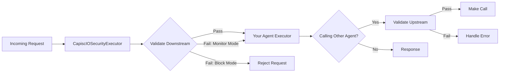

# CapiscIO Python SDK

**Runtime security middleware for A2A (Agent-to-Agent) protocol agents**

## The Problem

Your A2A agent communicates with other agents you don't control. **Any one of them could send:**

- 💥 Malformed messages that crash your agent
- 🎭 Spoofed identities claiming to be trusted agents  
- 🕳️ SSRF attacks via malicious URLs
- 🌊 Rate limit abuse overwhelming your resources
- 🔓 Invalid certificates exposing your connections

**And you have no control over their security practices.**

## The Solution

One line of code gives you unilateral protection - **no peer cooperation required:**

```python
from capiscio_sdk import secure

# Before: Vulnerable to any malicious input
agent = MyAgentExecutor()

# After: Protected from 7 attack vectors
agent = secure(MyAgentExecutor())
```

That's it. Your agent now validates everything, blocks attacks, and gives you complete observability.

---

<div class="grid cards" markdown>

-   :material-shield-check:{ .lg .middle } __Always-On Protection__

    ---

    Validate all incoming and outgoing messages without requiring peer cooperation. Your agent stays secure even when calling untrusted agents.

-   :material-rocket-launch:{ .lg .middle } __5-Minute Integration__

    ---

    Wrap your agent with one line of code. Start with sensible defaults, customize as you grow.

    [:octicons-arrow-right-24: Quick Start](getting-started/quickstart.md)

-   :material-check-all:{ .lg .middle } __7 Security Validators__

    ---

    Message schema, protocol compliance, signatures, semantic versioning, URL security, agent cards, and TLS certificates.

-   :material-lightning-bolt:{ .lg .middle } __Production Ready__

    ---

    Built-in rate limiting, caching, and configurable fail modes. 134 tests, 88% coverage.

</div>

## What is CapiscIO Python SDK?

The CapiscIO Python SDK provides **runtime protection** for agents using the [A2A (Agent-to-Agent) protocol](https://github.com/google/A2A). It acts as middleware that validates all agent communication, protecting you from:

- 🚫 **Malformed messages** - Schema and structure violations
- ⚠️ **Protocol violations** - Invalid state transitions, bad headers
- 🔒 **Missing signatures** - Unverified agent identities
- 🌐 **SSRF attacks** - Server-side request forgery via malicious URLs
- 📜 **Invalid agent cards** - Misconfigured discovery metadata
- 🔐 **Certificate issues** - Expired, self-signed, or mismatched TLS certificates

## Key Features

### 🛡️ Downstream Protection

Validate all incoming requests:

- ✅ Message schema validation
- ✅ Protocol compliance checking
- ✅ Signature verification (optional)
- ✅ Rate limiting per agent
- ✅ Configurable fail modes (block/monitor/log)

### 🔍 Upstream Protection

Validate agents before you call them:

- ✅ Agent card validation
- ✅ TLS certificate verification
- ✅ URL security (SSRF protection)
- ✅ Semantic version compatibility
- ✅ Cached validation results

### 🎯 Three Integration Patterns

Choose the pattern that fits your needs:

```python
# Pattern 1: Minimal (one-liner with preset)
from capiscio_sdk import secure, SecurityConfig
agent = secure(MyAgentExecutor(), SecurityConfig.production())

# Pattern 2: Granular Control
from capiscio_sdk import CapiscIOSecurityExecutor, SecurityConfig

config = SecurityConfig.production()
# Customize exactly what you need
config.downstream.rate_limit_requests_per_minute = 100  # Higher rate limit
config.downstream.require_signatures = True             # Enforce signatures
config.upstream.test_endpoints = True                   # Test before calling
config.fail_mode = "monitor"                            # Log but don't block yet

agent = CapiscIOSecurityExecutor(
    delegate=MyAgentExecutor(),
    config=config
)

# Pattern 3: Environment-Driven (12-factor app)
from capiscio_sdk import secure_agent

@secure_agent(config=SecurityConfig.from_env())
class MyAgentExecutor(AgentExecutor):
    async def execute(self, context, event_queue):
        # Your agent logic - config loaded from env vars
        pass
```

**Start with a preset, customize what matters to you.** All 16 configuration options documented in the [Configuration Guide](guides/configuration.md).

## Why CapiscIO Python SDK?

### 🚀 Fast to Integrate

```python
pip install capiscio-sdk
```

One line of code, instant protection. No complex setup, no infrastructure changes.

### 🎛️ Highly Configurable

Four built-in presets for every environment:

- **Development** - Permissive, fast iteration
- **Production** - Balanced security and performance
- **Strict** - Maximum security for sensitive environments
- **From Environment** - Load from environment variables

### 📊 Observable

Built-in logging and validation results make it easy to:

- Monitor security events
- Debug issues
- Track validation scores
- Understand attack patterns

### 🔄 No Peer Cooperation Required

Unlike protocol-level security that requires all participants to cooperate, the CapiscIO Python SDK protects **your agent** unilaterally. You don't need permission or coordination with peers.

## Quick Example

```python
from capiscio_sdk import secure
from a2a.server.request_handlers import DefaultRequestHandler
from a2a.server.tasks import InMemoryTaskStore
from my_agent import MyAgentExecutor

# Wrap your agent with security (production defaults)
secured_agent = secure(MyAgentExecutor())

# Use in A2A request handler
handler = DefaultRequestHandler(
    agent_executor=secured_agent,
    task_store=InMemoryTaskStore()
)

# Your agent now validates:
# - Message schemas
# - Protocol compliance
# - URL security
# - Rate limits
# - And more...
```

That's it! Your agent is now protected with:
- ✅ Message validation
- ✅ Protocol checking
- ✅ Rate limiting (60 req/min default)
- ✅ URL security
- ✅ Configurable fail modes

## What's Validated?

### Message Validator
Checks message structure, required fields (messageId, role, parts), and validates typed Part objects (TextPart, FilePart, DataPart).

### Protocol Validator
Validates protocol version, headers, message types, and state transitions.

### Signature Validator
Verifies JWS signatures using JWKS endpoints (when enabled).

### Semver Validator
Ensures semantic version compatibility between agents.

### URL Security Validator
Prevents SSRF attacks by validating URLs before making requests.

### Agent Card Validator
Validates agent discovery metadata including capabilities and provider information.

### Certificate Validator
Checks TLS certificates for expiry, hostname matching, and chain validity.

_Learn more about each validator in the API reference (coming soon)._

## Performance

The CapiscIO Python SDK is designed for minimal overhead:

- **Caching**: Validation results cached with configurable TTL
- **Async/Sync Split**: Expensive operations (certificate checks) are optional async
- **Rate Limiting**: Token bucket algorithm, no external dependencies
- **In-Memory**: No database or Redis required for basic operation

!!! info "Performance Benchmarks"
    Detailed performance benchmarks coming soon. Early testing shows <5ms overhead for typical validation paths.

## Architecture



## Next Steps

<div class="grid cards" markdown>

-   :material-clock-fast:{ .lg .middle } __Get Started in 5 Minutes__

    ---

    Install the package and integrate security with one line of code.

    [:octicons-arrow-right-24: Quick Start](getting-started/quickstart.md)

-   :material-book-open-variant:{ .lg .middle } __Learn Core Concepts__

    ---

    Understand how validation works and when to use each pattern.

    [:octicons-arrow-right-24: Core Concepts](getting-started/concepts.md)

-   :material-cog:{ .lg .middle } __Configure for Production__

    ---

    Learn about presets, fail modes, rate limiting, and all configuration options.

    [:octicons-arrow-right-24: Configuration Guide](guides/configuration.md)

-   :material-code-braces:{ .lg .middle } __Explore Examples__

    ---

    See real-world integration patterns in the [Quick Start Guide](getting-started/quickstart.md).

</div>

## Support & Community

- 📖 [Full Documentation](getting-started/installation.md)
- 🐛 [Report Issues](https://github.com/capiscio/capiscio-sdk-python/issues)
- 💬 [Discussions](https://github.com/capiscio/capiscio-sdk-python/discussions)
- 📦 [PyPI Package](https://pypi.org/project/capiscio-sdk/)

## License

The CapiscIO Python SDK is open source under the [Apache 2.0 License](https://github.com/capiscio/capiscio-sdk-python/blob/main/LICENSE).
