# Chromhandler - handling time-resolved chromatographic data


[](https://fairchemistry.github.io/Chromhandler/)
[](https://github.com/FAIRChemistry/Chromhandler/actions/workflows/run_tests.yaml)


## ℹ️ Overview

`chromhandler` (formerly `chromatopy`) is a Python package that aims to streamline the data processing and analysis of time-course chromatographic reaction data. It allows processing raw or pre-processed chromatographic data, enriching it with metadata such as reaction time, temperature, pH, and initial concentrations of reaction components. Finally, the peaks of interest can be aggregated, concentrations calculated, and the time-course data for each analyte transformed to EnzymeML data.

`chromhandler` is designed to work seamlessly with [OpenChrom](https://lablicate.com/platform/openchrom), enabling batch processing of proprietary chromatographic data. After processing in OpenChrom and exporting to an open file format, the data can be further analyzed in Jupyter Notebooks using `chromhandler`. This allows for creating and applying calibration curves and generating EnzymeML files for subsequent data analysis.
For some output formats, `chromhandler` provides a direct interface to read in data. For more information on the supported file formats and data preparation to use the `chromhandler` workflow, refer to the [data preparation](https://fairchemistry.github.io/chromhandler/supported_formats/#supported-formats) section.

``` mermaid
graph LR
  AD[🌈 Chromatographic Instrument] --> CAL
  AD --> RXN

  subgraph "📁experimental_data"

      CAL["<div style='text-align:left;font-family:monospace'>
📂 calib_substrate<br>
├── mh1_10mM.json<br>
├── mh2_50mM.json<br>
└── mh3_90mM.json<br><br>
📂 calib_prod1<br>
├── prod1_10mM.json<br>
├── prod1_50mM.json<br>
└── prod1_90mM.json<br><br>
</div>"]

      RXN["<div style='text-align:left;font-family:monospace'>
📂 reaction_mh9<br>
├── mh9_1h.json<br>
├── mh9_2h.json<br>
├── mh9_3h.json<br>
├── mh9_4h.json<br>
├── mh9_5h.json<br>
├── mh9_6h.json<br>
└── mh9_12h.json
</div>"]
  end

  CAL -->|read| C_cal{"<span style='font-family:monospace'><b>chromhandler</b></span><br>"}
  RXN -->|read| C_react{"<span style='font-family:monospace'><b>chromhandler</b></span><br>"}

  cal1["<div style='text-align:left'>
Define measured molecules<br>
– retention time<br>
– PubChem CID
</div>"]

  cal2["<div style='text-align:left'>
Create calibration standard
</div>"]

  E4["Define reaction conditions"]
  E3["Add measured molecules"]
  E5["Define enzymes"]
  Enz[📄 EnzymeML Document]

  subgraph "Calibration mode"
    C_cal --> cal1
    cal1 --> cal2
  end

  subgraph "Reaction mode"
    C_react --> E4
    E4 --> E3
    E3 --> E5
    cal2 --> E3
  end

  E5 -->|convert| Enz
```



## ⭐ Key Features

- **🌱 Low friction data processing**   
Leave behind data processing in spreadsheet applications and directly start with data analysis based on raw data.
- **🧪 Enrich reaction data with metadata**  
Assign metadata like initial concentrations of reactants, temperature, pH, etc., to reaction data to yield modeling-ready data.
- **📈 Create and apply calibration curves**  
Create calibrators for your analytes and use them throughout your data analysis for seamless concentration calculation.
- **📂 FAIR data**  
Transform your data into EnzymeML format for subsequent analysis pipelines.

## 🛠️ Installation

Install `chromhandler` using `pip`:

```bash
pip install chromhandler
```

or


```bash
pip install git+https://github.com/FAIRChemistry/Chromhandler.git
```

For more information and examples, please refer to the [Documentation](https://fairchemistry.github.io/chromhandler/) section.
