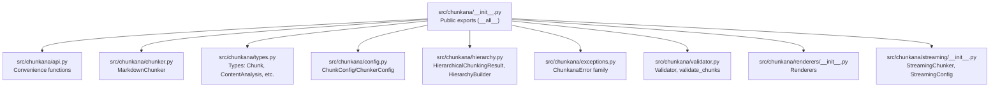
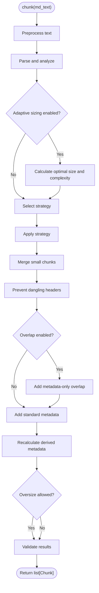
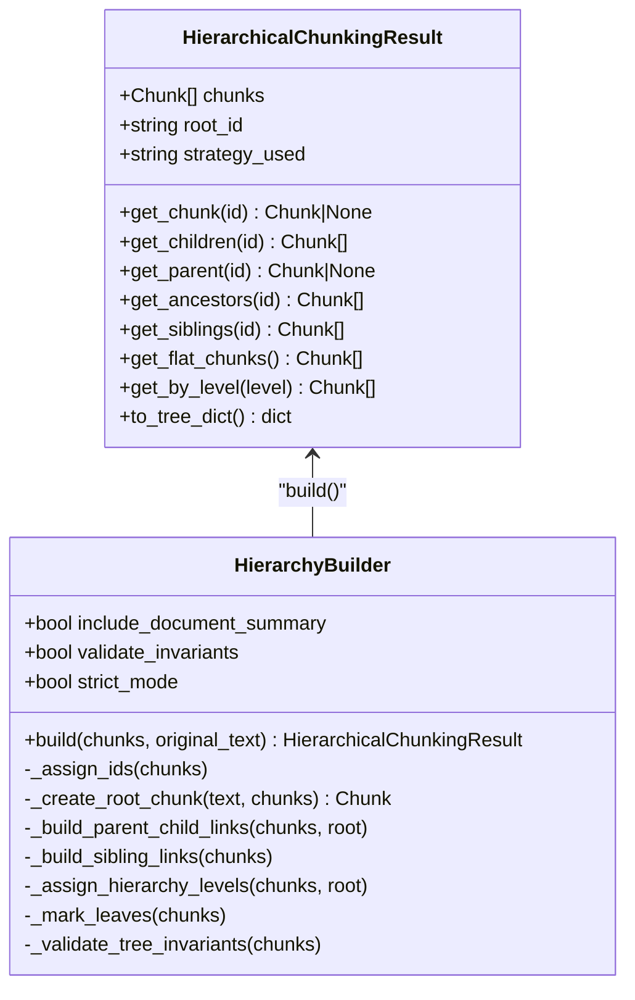
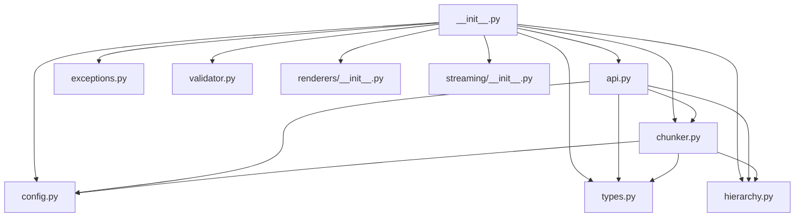

# API Reference

<cite>
**Referenced Files in This Document**
- [__init__.py](file://src/chunkana/__init__.py)
- [api.py](file://src/chunkana/api.py)
- [chunker.py](file://src/chunkana/chunker.py)
- [types.py](file://src/chunkana/types.py)
- [config.py](file://src/chunkana/config.py)
- [hierarchy.py](file://src/chunkana/hierarchy.py)
- [exceptions.py](file://src/chunkana/exceptions.py)
- [validator.py](file://src/chunkana/validator.py)
- [renderers/__init__.py](file://src/chunkana/renderers/__init__.py)
- [streaming/__init__.py](file://src/chunkana/streaming/__init__.py)
</cite>

## Table of Contents
1. [Introduction](#introduction)
2. [Project Structure](#project-structure)
3. [Core Components](#core-components)
4. [Architecture Overview](#architecture-overview)
5. [Detailed Component Analysis](#detailed-component-analysis)
6. [Dependency Analysis](#dependency-analysis)
7. [Performance Considerations](#performance-considerations)
8. [Troubleshooting Guide](#troubleshooting-guide)
9. [Conclusion](#conclusion)

## Introduction
This document provides comprehensive API documentation for Chunkana’s public interfaces. It covers:
- Top-level convenience functions for chunking and analysis
- The main MarkdownChunker class and its methods
- Public types and their fields and methods
- Hierarchical chunking result and builder
- Configuration options and their effects
- Validation utilities and exceptions
- Output renderers and streaming capabilities

The goal is to help developers integrate Chunkana effectively, understand parameter constraints, and anticipate error conditions.

## Project Structure
Chunkana exposes a focused public API through a central module that re-exports key functions, classes, and utilities. The main functional areas are:
- Public API functions for chunking, analysis, and streaming
- Core chunker class with chunking pipeline and helpers
- Types for chunks, analyses, and results
- Configuration for chunking behavior
- Hierarchical chunking result and builder
- Validation utilities and exceptions
- Renderers for different output formats
- Streaming chunker for large files



**Diagram sources**
- [__init__.py](file://src/chunkana/__init__.py#L24-L116)
- [api.py](file://src/chunkana/api.py#L1-L305)
- [chunker.py](file://src/chunkana/chunker.py#L1-L300)
- [types.py](file://src/chunkana/types.py#L1-L478)
- [config.py](file://src/chunkana/config.py#L1-L507)
- [hierarchy.py](file://src/chunkana/hierarchy.py#L1-L300)
- [exceptions.py](file://src/chunkana/exceptions.py#L1-L248)
- [validator.py](file://src/chunkana/validator.py#L1-L221)
- [renderers/__init__.py](file://src/chunkana/renderers/__init__.py#L1-L23)
- [streaming/__init__.py](file://src/chunkana/streaming/__init__.py#L1-L14)

**Section sources**
- [__init__.py](file://src/chunkana/__init__.py#L24-L116)

## Core Components
This section documents the primary public APIs grouped by functional area.

### Public Functions (Top-Level)
These functions provide convenient entry points for common chunking tasks.

- chunk_markdown(text, config=None) -> list[Chunk]
  - Purpose: Chunk markdown text into semantic segments.
  - Parameters:
    - text: str — Markdown text to chunk.
    - config: ChunkerConfig | None — Optional configuration; defaults used if None.
  - Returns: list[Chunk] — Chunks with content and metadata.
  - Exceptions: Raises on invalid configuration or processing errors.
  - Notes: Always returns a list; never a union type.
  - Cross-references: Uses MarkdownChunker internally.

- chunk_text(text, config=None) -> list[Chunk]
  - Purpose: Alias for chunk_markdown for plugin compatibility.
  - Parameters and behavior mirror chunk_markdown.

- analyze_markdown(text, config=None) -> ContentAnalysis
  - Purpose: Analyze markdown document without chunking; returns metrics and extracted elements.
  - Parameters: text, config
  - Returns: ContentAnalysis

- chunk_with_analysis(text, config=None) -> ChunkingResult
  - Purpose: Chunk text and return structured result with analysis metadata.
  - Returns: ChunkingResult with chunks, strategy_used, processing_time, totals.

- chunk_with_metrics(text, config=None) -> tuple[list[Chunk], ChunkingMetrics]
  - Purpose: Chunk text and compute quality metrics.
  - Returns: (chunks, metrics) where metrics include counts and statistics.

- iter_chunks(text, config=None) -> Iterator[Chunk]
  - Purpose: Incremental chunk iteration for memory efficiency.
  - Returns: Iterator over Chunk objects.

- chunk_file(file_path, config=None, encoding="utf-8") -> list[Chunk]
  - Purpose: Read a file and chunk its content.
  - Parameters: file_path, config, encoding
  - Returns: list[Chunk]
  - Exceptions: FileNotFoundError, UnicodeDecodeError

- chunk_file_streaming(file_path, chunk_config=None, streaming_config=None, encoding="utf-8") -> Iterator[Chunk]
  - Purpose: Stream large files in a memory-efficient manner.
  - Returns: Iterator[Chunk]
  - Exceptions: FileNotFoundError, UnicodeDecodeError
  - Notes: Maintains invariants: line coverage, atomic blocks, monotonic start_line.

- chunk_hierarchical(text, config=None, include_document_summary=True) -> HierarchicalChunkingResult
  - Purpose: Create hierarchical chunk structure with navigation methods.
  - Returns: HierarchicalChunkingResult with navigation methods (get_chunk, get_children, get_parent, get_ancestors, get_flat_chunks).

**Section sources**
- [api.py](file://src/chunkana/api.py#L18-L305)
- [__init__.py](file://src/chunkana/__init__.py#L24-L116)

### MarkdownChunker Class
The core class orchestrating the chunking pipeline.

- Initialization
  - MarkdownChunker(config=None)
  - Parameters: config: ChunkConfig | None — Defaults to ChunkConfig() if None.

- Methods
  - chunk(md_text) -> list[Chunk]
    - Pipeline: preprocess, analyze, select strategy, apply strategy, merge small chunks, prevent dangling headers, apply overlap, add metadata, recalculate metadata, add adaptive sizing metadata, validate.
    - Returns: list[Chunk]
    - Notes: Handles empty input by returning [].

  - chunk_with_metrics(md_text) -> tuple[list[Chunk], ChunkingMetrics]
    - Returns: (chunks, metrics)

  - chunk_with_analysis(md_text) -> tuple[list[Chunk], str, ContentAnalysis | None]
    - Returns: (chunks, strategy_name, analysis)

  - chunk_hierarchical(md_text) -> HierarchicalChunkingResult
    - Builds hierarchy using existing header_path metadata and returns navigation-enabled result.

  - chunk_file_streaming(file_path, streaming_config=None) -> Iterator[Chunk]
  - chunk_stream(stream, streaming_config=None) -> Iterator[Chunk]

- Overlap and Metadata
  - _apply_overlap(chunks) -> list[Chunk]
    - Adds metadata-only overlap fields: previous_content, next_content, overlap_size.
    - Behavior: Adaptive caps overlap by overlap_cap_ratio of adjacent chunk size; respects word boundaries.

  - _merge_small_chunks(chunks) -> list[Chunk]
    - Merges small chunks with adjacent chunks under constraints; flags small_chunk for structurally weak chunks.

  - _is_structurally_strong(chunk) -> bool
    - Heuristics: strong header, multiple paragraphs, meaningful content, or multiple paragraphs.

- Validation
  - _validate(chunks, original) -> None
    - Enforces relaxed content loss, size bounds, monotonic ordering, and relies on Chunk.__post_init__ for other invariants.

**Section sources**
- [chunker.py](file://src/chunkana/chunker.py#L37-L300)
- [chunker.py](file://src/chunkana/chunker.py#L301-L923)

### Public Types
The following types define the data structures used across the API.

- Chunk
  - Fields:
    - content: str
    - start_line: int
    - end_line: int
    - metadata: dict[str, Any]
  - Metadata fields commonly present:
    - chunk_index: int
    - content_type: "text" | "code" | "table" | "mixed" | "preamble"
    - has_code: bool
    - strategy: str
    - header_path: str (e.g., "/Level1/Level2/Level3"; special "/__preamble__" for preamble)
    - header_level: int
    - sub_headers: list[str] | None
    - small_chunk: bool
    - small_chunk_reason: str | None
    - previous_content: str | None
    - next_content: str | None
    - overlap_size: int | None
  - Methods:
    - size: int
    - line_count: int
    - is_oversize: bool
    - strategy: str
    - to_dict() -> dict
    - from_dict(dict) -> Chunk
    - to_json() -> str
    - from_json(str) -> Chunk
  - Constraints:
    - start_line >= 1
    - end_line >= start_line
    - content non-empty when normalized

- ContentAnalysis
  - Metrics and extracted elements for strategy selection.
  - Fields include totals, ratios, counts, and lists of extracted elements (code_blocks, headers, tables, list_blocks, latex_blocks), plus additional metrics and optional cached lines.

- ChunkingMetrics
  - Fields: total_chunks, avg_chunk_size, std_dev_size, min_size, max_size, undersize_count, oversize_count
  - Methods:
    - from_chunks(chunks, min_chunk_size, max_chunk_size) -> ChunkingMetrics
    - to_dict() -> dict

- ChunkingResult
  - Fields: chunks: list[Chunk], strategy_used: str, processing_time: float, total_chars: int, total_lines: int
  - Properties: chunk_count, total_output_size
  - Methods: to_dict(), from_dict()

- FencedBlock, TableBlock, Header, LatexBlock, ListBlock, ListItem
  - Represent parsed structural elements with positions, types, and optional context fields.

**Section sources**
- [types.py](file://src/chunkana/types.py#L1-L478)

### HierarchicalChunkingResult and HierarchyBuilder
- HierarchicalChunkingResult
  - Attributes: chunks: list[Chunk], root_id: str, strategy_used: str, _index: dict[str, Chunk] (internal)
  - Navigation methods:
    - get_chunk(chunk_id) -> Chunk | None
    - get_children(chunk_id) -> list[Chunk]
    - get_parent(chunk_id) -> Chunk | None
    - get_ancestors(chunk_id) -> list[Chunk]
    - get_siblings(chunk_id) -> list[Chunk]
    - get_flat_chunks() -> list[Chunk]
    - get_by_level(level) -> list[Chunk]
    - to_tree_dict() -> dict[str, object]

- HierarchyBuilder
  - Constructor: include_document_summary=True, validate_invariants=True, strict_mode=False
  - build(chunks, original_text) -> HierarchicalChunkingResult
  - Internals: assigns IDs, optionally creates root document chunk, builds parent-child and sibling links, assigns hierarchy levels, marks leaves, validates invariants.

**Section sources**
- [hierarchy.py](file://src/chunkana/hierarchy.py#L1-L300)
- [hierarchy.py](file://src/chunkana/hierarchy.py#L300-L966)

### Configuration
- ChunkConfig (also exported as ChunkerConfig)
  - Core size parameters: max_chunk_size, min_chunk_size, overlap_size
  - Behavior: preserve_atomic_blocks, extract_preamble
  - Strategy thresholds: code_threshold, structure_threshold, list_ratio_threshold, list_count_threshold
  - Overrides: strategy_override
  - Code-context binding: enable_code_context_binding, max_context_chars_before, max_context_chars_after, related_block_max_gap, bind_output_blocks, preserve_before_after_pairs
  - Adaptive sizing: use_adaptive_sizing, adaptive_config
  - Hierarchical: include_document_summary, validate_invariants, strict_mode
  - Preprocessing: strip_obsidian_block_ids
  - LaTeX: preserve_latex_blocks, latex_display_only, latex_max_context_chars
  - Tables: group_related_tables, table_grouping_config
  - Overlap cap ratio: overlap_cap_ratio
  - Computed property: enable_overlap
  - Class methods: default(), for_code_heavy(), for_structured(), minimal(), for_changelogs(), with_adaptive_sizing(), for_code_heavy_adaptive(), for_text_heavy_adaptive()
  - Serialization: to_dict(), from_dict()
  - Validation: __post_init__() enforces parameter ranges and relationships.

- StreamingConfig
  - Exposed via streaming module; used by StreamingChunker for large-file processing.

**Section sources**
- [config.py](file://src/chunkana/config.py#L1-L507)
- [streaming/__init__.py](file://src/chunkana/streaming/__init__.py#L1-L14)

### Validation Utilities
- Validator
  - validate(chunks, original_text, strict=False) -> ValidationResult
  - Checks domain properties: PROP-1 (content loss), PROP-2 (size bounds), PROP-3 (monotonic ordering), PROP-4 (no empty chunks), PROP-5 (valid line numbers)
- validate_chunks(chunks, original_text, config=None, strict=False) -> ValidationResult
  - Convenience wrapper around Validator.

**Section sources**
- [validator.py](file://src/chunkana/validator.py#L1-L221)

### Exceptions
- ChunkanaError (base)
- ValidationError
- ConfigurationError
- HierarchicalInvariantError
- TreeConstructionError

**Section sources**
- [exceptions.py](file://src/chunkana/exceptions.py#L1-L248)

### Renderers
- render_json, render_inline_metadata, render_dify_style, render_with_embedded_overlap, render_with_prev_overlap
  - Pure functions that format chunks for different output systems without mutating Chunk objects.

**Section sources**
- [renderers/__init__.py](file://src/chunkana/renderers/__init__.py#L1-L23)

## Architecture Overview
The public API centers around convenience functions that delegate to MarkdownChunker. Hierarchical chunking is built on top of the flat chunk list using header_path metadata. Validation and configuration are integrated throughout the pipeline.

```mermaid
sequenceDiagram
participant U as "User"
participant API as "api.py"
participant MC as "MarkdownChunker"
participant CFG as "ChunkConfig"
participant STR as "StrategySelector"
participant PAR as "Parser"
participant HB as "HierarchyBuilder"
U->>API : "chunk_markdown(text, config)"
API->>MC : "MarkdownChunker(config or default)"
API->>MC : "chunk(text)"
MC->>PAR : "analyze(text)"
PAR-->>MC : "ContentAnalysis"
MC->>STR : "select(analysis, effective_config)"
STR-->>MC : "strategy"
MC->>MC : "apply strategy, merge small chunks,<br/>prevent dangling headers, apply overlap"
MC-->>API : "list[Chunk]"
API-->>U : "list[Chunk]"
```

**Diagram sources**
- [api.py](file://src/chunkana/api.py#L18-L104)
- [chunker.py](file://src/chunkana/chunker.py#L85-L177)

## Detailed Component Analysis

### Public Functions: chunk_markdown and chunk_hierarchical
- chunk_markdown
  - Parameters:
    - text: str — Markdown text to chunk.
    - config: ChunkerConfig | None — Optional; defaults to ChunkerConfig.default().
  - Returns: list[Chunk]
  - Exceptions: ConfigurationError if invalid parameters; runtime errors during parsing/strategy application.
  - Usage example paths:
    - [api.py](file://src/chunkana/api.py#L18-L41)
    - [__init__.py](file://src/chunkana/__init__.py#L1-L20)

- chunk_hierarchical
  - Parameters:
    - text: str
    - config: ChunkerConfig | None
    - include_document_summary: bool
  - Returns: HierarchicalChunkingResult
  - Usage example paths:
    - [api.py](file://src/chunkana/api.py#L273-L305)
    - [__init__.py](file://src/chunkana/__init__.py#L1-L20)

**Section sources**
- [api.py](file://src/chunkana/api.py#L18-L305)
- [chunker.py](file://src/chunkana/chunker.py#L217-L248)

### MarkdownChunker: Pipeline and Helpers
- Pipeline stages:
  - Preprocess text (e.g., strip Obsidian block IDs)
  - Analyze content (one-time parse)
  - Adaptive sizing (optional)
  - Strategy selection and application
  - Merge small chunks
  - Prevent dangling headers
  - Apply overlap (metadata-only)
  - Add standard and recalculated metadata
  - Validate results
- Overlap behavior:
  - previous_content and next_content are metadata-only; chunk.content remains distinct
  - Overlap size capped by overlap_cap_ratio of adjacent chunk size
  - Word boundary-aware extraction
- Small chunk handling:
  - Merge header-only chunks with their section bodies
  - Merge remaining small chunks with neighbors under constraints
  - Flag small_chunk for structurally weak chunks that cannot merge



**Diagram sources**
- [chunker.py](file://src/chunkana/chunker.py#L85-L177)
- [chunker.py](file://src/chunkana/chunker.py#L301-L470)

**Section sources**
- [chunker.py](file://src/chunkana/chunker.py#L85-L470)

### Types: Chunk, ContentAnalysis, ChunkingMetrics, ChunkingResult
- Chunk
  - Validation constraints enforced in __post_init__
  - Serialization helpers to/from dict/json
- ContentAnalysis
  - Provides metrics and extracted elements for strategy selection
- ChunkingMetrics
  - Computes statistics from a list of chunks
- ChunkingResult
  - Bundles chunks and metadata for reporting

**Section sources**
- [types.py](file://src/chunkana/types.py#L240-L478)

### HierarchicalChunkingResult and HierarchyBuilder
- HierarchicalChunkingResult
  - Navigation methods for parent-child-sibling relationships
  - Flat retrieval support via get_flat_chunks
  - Tree serialization via to_tree_dict
- HierarchyBuilder
  - Assigns unique IDs, optionally creates root document chunk
  - Builds parent-child and sibling links using header_path
  - Assigns hierarchy levels and marks leaves
  - Validates tree invariants (strict or warning modes)



**Diagram sources**
- [hierarchy.py](file://src/chunkana/hierarchy.py#L16-L232)
- [hierarchy.py](file://src/chunkana/hierarchy.py#L233-L966)

**Section sources**
- [hierarchy.py](file://src/chunkana/hierarchy.py#L1-L966)

### Configuration Options and Effects
Key configuration parameters and their impact:
- Size bounds: max_chunk_size, min_chunk_size, overlap_size
  - overlap_size must be less than max_chunk_size; overlap_cap_ratio limits overlap proportionally to chunk size
- Strategy selection: code_threshold, structure_threshold, list_ratio_threshold, list_count_threshold, strategy_override
- Behavior toggles: preserve_atomic_blocks, extract_preamble, enable_code_context_binding, preserve_latex_blocks, group_related_tables
- Hierarchical: include_document_summary, validate_invariants, strict_mode
- Preprocessing: strip_obsidian_block_ids
- Adaptive sizing: use_adaptive_sizing, adaptive_config
- Serialization: to_dict()/from_dict() for compatibility

**Section sources**
- [config.py](file://src/chunkana/config.py#L1-L507)

### Validation and Error Conditions
- Validator checks:
  - PROP-1: Content loss acceptable within variance
  - PROP-2: Size bounds and oversize reasons
  - PROP-3: Monotonic ordering by start_line
  - PROP-4: No empty chunks
  - PROP-5: Valid line numbers
- Exceptions:
  - ChunkanaError (base)
  - ValidationError
  - ConfigurationError
  - HierarchicalInvariantError
  - TreeConstructionError

**Section sources**
- [validator.py](file://src/chunkana/validator.py#L1-L221)
- [exceptions.py](file://src/chunkana/exceptions.py#L1-L248)

### Renderers and Streaming
- Renderers:
  - render_json, render_inline_metadata, render_dify_style, render_with_embedded_overlap, render_with_prev_overlap
- Streaming:
  - chunk_file_streaming(file_path, chunk_config, streaming_config, encoding) -> Iterator[Chunk]
  - chunk_stream(stream, streaming_config) -> Iterator[Chunk]
  - Maintains invariants: line coverage, atomic blocks, monotonic start_line

**Section sources**
- [renderers/__init__.py](file://src/chunkana/renderers/__init__.py#L1-L23)
- [streaming/__init__.py](file://src/chunkana/streaming/__init__.py#L1-L14)
- [api.py](file://src/chunkana/api.py#L228-L272)

## Dependency Analysis
- Public exports:
  - __init__.py re-exports functions, classes, exceptions, renderers, streaming, and types
- Internal dependencies:
  - api.py depends on chunker.py, config.py, hierarchy.py, types.py
  - chunker.py depends on config.py, parser, strategies, header_processor, metadata_recalculator, hierarchy, types
  - hierarchy.py depends on types.py and raises hierarchical exceptions
  - validator.py depends on config.py and types.py
  - renderers/__init__.py re-exports formatters
  - streaming/__init__.py re-exports StreamingChunker and StreamingConfig



**Diagram sources**
- [__init__.py](file://src/chunkana/__init__.py#L24-L116)
- [api.py](file://src/chunkana/api.py#L1-L305)
- [chunker.py](file://src/chunkana/chunker.py#L1-L300)
- [types.py](file://src/chunkana/types.py#L1-L478)
- [config.py](file://src/chunkana/config.py#L1-L507)
- [hierarchy.py](file://src/chunkana/hierarchy.py#L1-L300)
- [exceptions.py](file://src/chunkana/exceptions.py#L1-L248)
- [validator.py](file://src/chunkana/validator.py#L1-L221)
- [renderers/__init__.py](file://src/chunkana/renderers/__init__.py#L1-L23)
- [streaming/__init__.py](file://src/chunkana/streaming/__init__.py#L1-L14)

**Section sources**
- [__init__.py](file://src/chunkana/__init__.py#L24-L116)

## Performance Considerations
- Use chunk_file_streaming for large files (>10 MB) to reduce memory usage.
- Adjust overlap_size thoughtfully; higher overlap improves continuity but increases metadata overhead.
- Consider enabling adaptive sizing for documents with varying complexity to balance chunk sizes.
- Use iter_chunks for incremental processing when memory is constrained.

[No sources needed since this section provides general guidance]

## Troubleshooting Guide
Common issues and resolutions:
- Empty or whitespace-only input to chunk_markdown returns [].
- Oversized chunks may be flagged with allow_oversize and oversize_reason; adjust max_chunk_size or strategy_override accordingly.
- Invalid configuration parameters raise ConfigurationError; ensure overlap_size < max_chunk_size and thresholds within valid ranges.
- HierarchicalInvariantError indicates tree structure inconsistencies; enable strict_mode to raise on violations.
- UnicodeDecodeError from chunk_file indicates encoding issues; specify correct encoding.
- For streaming failures, verify file existence and encoding; ensure overlap_size is non-negative and less than max_chunk_size.

**Section sources**
- [chunker.py](file://src/chunkana/chunker.py#L431-L470)
- [config.py](file://src/chunkana/config.py#L138-L229)
- [exceptions.py](file://src/chunkana/exceptions.py#L1-L248)
- [api.py](file://src/chunkana/api.py#L193-L226)

## Conclusion
Chunkana’s public API offers a streamlined, validated, and hierarchical approach to Markdown chunking. The convenience functions provide easy integration, while the MarkdownChunker class exposes a robust pipeline with configurable behavior. HierarchicalChunkingResult adds navigation and retrieval capabilities, and the validation utilities help ensure data integrity. Use the configuration options to tailor behavior for different content types and document sizes.