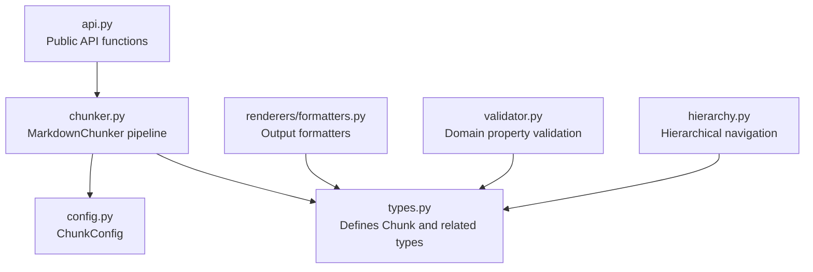
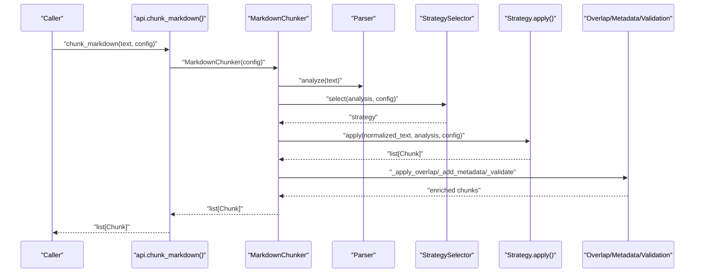
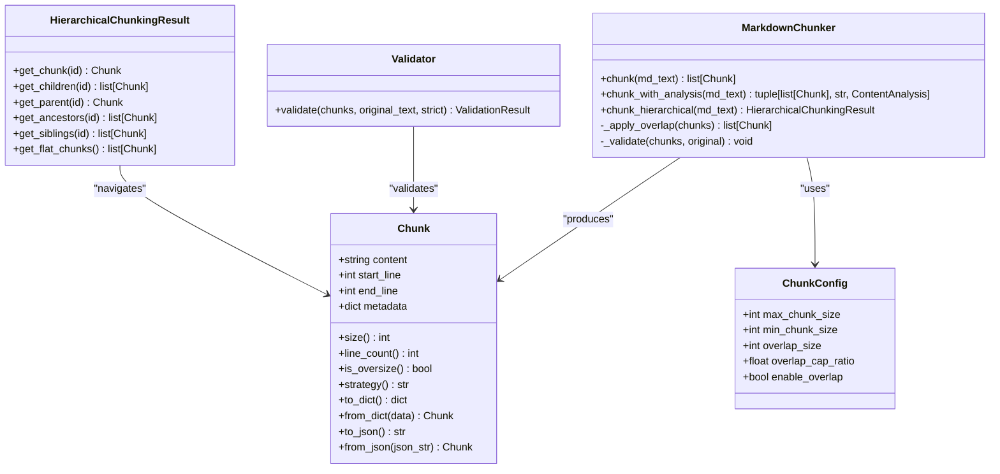

# Chunk

<cite>
**Referenced Files in This Document**
- [types.py](file://src/chunkana/types.py)
- [chunker.py](file://src/chunkana/chunker.py)
- [api.py](file://src/chunkana/api.py)
- [config.py](file://src/chunkana/config.py)
- [formatters.py](file://src/chunkana/renderers/formatters.py)
- [validator.py](file://src/chunkana/validator.py)
- [hierarchy.py](file://src/chunkana/hierarchy.py)
- [test_chunk.py](file://tests/unit/test_chunk.py)
</cite>

## Table of Contents
1. [Introduction](#introduction)
2. [Project Structure](#project-structure)
3. [Core Components](#core-components)
4. [Architecture Overview](#architecture-overview)
5. [Detailed Component Analysis](#detailed-component-analysis)
6. [Dependency Analysis](#dependency-analysis)
7. [Performance Considerations](#performance-considerations)
8. [Troubleshooting Guide](#troubleshooting-guide)
9. [Conclusion](#conclusion)

## Introduction
This document provides comprehensive data model documentation for the Chunk class, which represents a fundamental unit of processed markdown content. It explains all attributes, metadata fields, validation logic, computed properties, serialization methods, and integration points with renderers, validators, and hierarchical navigation systems. Practical examples demonstrate creating chunks, accessing metadata, and serializing for storage or transmission.

## Project Structure
The Chunk class is defined centrally in the types module and is consumed across the chunking pipeline, rendering, validation, and hierarchical navigation layers.

**Diagram sources**
- [types.py](file://src/chunkana/types.py#L240-L376)
- [chunker.py](file://src/chunkana/chunker.py#L1-L120)
- [api.py](file://src/chunkana/api.py#L1-L60)
- [config.py](file://src/chunkana/config.py#L17-L120)
- [formatters.py](file://src/chunkana/renderers/formatters.py#L1-L60)
- [validator.py](file://src/chunkana/validator.py#L1-L60)
- [hierarchy.py](file://src/chunkana/hierarchy.py#L1-L60)

**Section sources**
- [types.py](file://src/chunkana/types.py#L240-L376)
- [chunker.py](file://src/chunkana/chunker.py#L1-L120)
- [api.py](file://src/chunkana/api.py#L1-L60)
- [config.py](file://src/chunkana/config.py#L17-L120)
- [formatters.py](file://src/chunkana/renderers/formatters.py#L1-L60)
- [validator.py](file://src/chunkana/validator.py#L1-L60)
- [hierarchy.py](file://src/chunkana/hierarchy.py#L1-L60)

## Core Components
- Chunk: A dataclass representing a processed markdown segment with content, positional line numbers, and metadata.
- Chunking pipeline: Produces chunks and enriches them with metadata (e.g., content_type, header_path, small_chunk).
- Renderers: Format chunks for external systems (e.g., JSON, Dify-style).
- Validator: Enforces domain properties (e.g., size bounds, monotonic ordering, valid line numbers).
- Hierarchical navigation: Builds parent-child relationships using header_path metadata.

**Section sources**
- [types.py](file://src/chunkana/types.py#L240-L376)
- [chunker.py](file://src/chunkana/chunker.py#L120-L220)
- [formatters.py](file://src/chunkana/renderers/formatters.py#L1-L60)
- [validator.py](file://src/chunkana/validator.py#L32-L92)
- [hierarchy.py](file://src/chunkana/hierarchy.py#L16-L60)

## Architecture Overview
The Chunk class is the central data structure across the pipeline. The MarkdownChunker orchestrates parsing, strategy selection, overlap application, metadata enrichment, and validation. Renderers consume Chunk instances for output formatting. Validators enforce domain properties. Hierarchical navigation uses header_path metadata to construct parent-child relationships.

**Diagram sources**
- [api.py](file://src/chunkana/api.py#L18-L41)
- [chunker.py](file://src/chunkana/chunker.py#L85-L176)
- [chunker.py](file://src/chunkana/chunker.py#L301-L470)

## Detailed Component Analysis

### Chunk Data Model
The Chunk class encapsulates a processed markdown segment with:
- content: The text content of the chunk.
- start_line: Starting line number (1-indexed).
- end_line: Ending line number (1-indexed).
- metadata: A dictionary carrying additional information.

Metadata fields documented:
- chunk_index: Sequential index of the chunk in the document.
- content_type: One of "text", "code", "table", "mixed", "preamble".
- has_code: Boolean indicating presence of code blocks.
- strategy: Name of the strategy that created the chunk.
- header_path: Hierarchical path to the first header in the chunk, e.g., "/Level1/Level2/Level3"; special "/__preamble__" for preamble chunks; empty string if no headers.
- header_level: Level of the first header (1–6).
- sub_headers: Optional list of additional header texts within the chunk (excluding the first header).
- small_chunk: Boolean flag indicating the chunk is structurally weak and could not be merged without exceeding max_chunk_size.
- small_chunk_reason: Reason for small_chunk flag (currently "cannot_merge").
- previous_content: Last N characters from the previous chunk (metadata-only context).
- next_content: First N characters from the next chunk (metadata-only context).
- overlap_size: Size of the context window used for previous_content/next_content.

Validation logic in __post_init__:
- start_line must be ≥ 1.
- end_line must be ≥ start_line.
- content cannot be empty or whitespace-only.

Computed properties:
- size: Character count of content.
- line_count: Approximate line count computed from content.
- is_oversize: True if allow_oversize is set in metadata.
- strategy: Strategy name from metadata with fallback to "unknown".

Serialization methods:
- to_dict(): Returns a dictionary representation including content, start_line, end_line, size, line_count, and metadata.
- from_dict(data): Creates a Chunk from a dictionary, validating required fields.
- to_json(): Serializes to a JSON string.
- from_json(json_str): Deserializes from a JSON string with error handling for invalid JSON.

Practical examples:
- Creating a chunk: Instantiate Chunk with content, start_line, end_line, and optional metadata.
- Accessing metadata: Retrieve fields like content_type, header_path, header_level, small_chunk, etc.
- Serializing: Use to_dict() or to_json() for storage/transmission; use from_dict() or from_json() for reconstruction.

Integration points:
- Renderers: render_json() produces a list of dictionaries from chunks; formatters embed metadata or overlap into strings.
- Validator: Validates domain properties including size bounds and line number validity.
- Hierarchical navigation: Uses header_path metadata to build parent-child relationships and navigation methods.

**Section sources**
- [types.py](file://src/chunkana/types.py#L240-L376)
- [test_chunk.py](file://tests/unit/test_chunk.py#L1-L166)
- [formatters.py](file://src/chunkana/renderers/formatters.py#L15-L60)
- [validator.py](file://src/chunkana/validator.py#L115-L199)
- [hierarchy.py](file://src/chunkana/hierarchy.py#L360-L420)

### Validation Logic and Domain Properties
The Chunk class enforces:
- Valid line numbers: start_line ≥ 1 and end_line ≥ start_line.
- Non-empty content: content must contain non-whitespace characters.

Additional pipeline-level validations enforced by the chunker and validator:
- Size bounds: Chunks exceeding max_chunk_size require allow_oversize flag with a valid reason.
- Monotonic ordering: Chunks must be sorted by start_line.
- No empty chunks: All chunks must have non-empty content.
- Valid line numbers: end_line must not exceed total lines in the original document.

**Section sources**
- [types.py](file://src/chunkana/types.py#L297-L307)
- [chunker.py](file://src/chunkana/chunker.py#L431-L470)
- [validator.py](file://src/chunkana/validator.py#L115-L199)

### Computed Properties and Flags
- size: Character count of content.
- line_count: Approximate line count computed from content.
- is_oversize: True if allow_oversize is set in metadata.
- strategy: Strategy name from metadata with fallback to "unknown".

These properties simplify downstream consumers by providing convenient accessors.

**Section sources**
- [types.py](file://src/chunkana/types.py#L318-L376)

### Serialization Methods
- to_dict(): Includes content, start_line, end_line, size, line_count, and metadata.
- from_dict(data): Validates presence of required fields and constructs a Chunk.
- to_json(): Serializes to a JSON string.
- from_json(json_str): Parses JSON and reconstructs a Chunk, raising a ValueError for invalid JSON.

Error handling:
- from_dict raises ValueError if required fields are missing.
- from_json raises ValueError with a descriptive message for invalid JSON.

**Section sources**
- [types.py](file://src/chunkana/types.py#L329-L376)
- [test_chunk.py](file://tests/unit/test_chunk.py#L68-L166)

### Integration with Renderers
Renderers consume Chunk instances to produce formatted outputs:
- render_json(): Converts list[Chunk] to list[dict].
- render_inline_metadata(): Embeds metadata JSON and content.
- render_dify_style(): Formats metadata with start_line and end_line.
- render_with_embedded_overlap(): Concatenates previous_content, content, and next_content.
- render_with_prev_overlap(): Concatenates previous_content and content.

These are view operations that do not mutate Chunk objects.

**Section sources**
- [formatters.py](file://src/chunkana/renderers/formatters.py#L15-L146)

### Integration with Validators
Validators enforce domain properties:
- PROP-1: No content loss (allows variance).
- PROP-2: Size bounds and oversize reasons.
- PROP-3: Monotonic ordering.
- PROP-4: No empty chunks.
- PROP-5: Valid line numbers.

Validation occurs after chunking and overlap application.

**Section sources**
- [validator.py](file://src/chunkana/validator.py#L32-L221)

### Integration with Hierarchical Navigation
HierarchicalChunkingResult builds parent-child-sibling relationships using header_path metadata:
- Assigns unique chunk_id to each chunk.
- Creates a root document chunk if enabled.
- Establishes parent-child links by walking header_path segments.
- Builds sibling chains and assigns hierarchy levels.
- Provides navigation methods: get_chunk, get_children, get_parent, get_ancestors, get_siblings, get_flat_chunks.

This enables tree-based navigation and retrieval.

**Section sources**
- [hierarchy.py](file://src/chunkana/hierarchy.py#L16-L120)
- [hierarchy.py](file://src/chunkana/hierarchy.py#L233-L308)
- [hierarchy.py](file://src/chunkana/hierarchy.py#L374-L422)

### Practical Examples
- Creating chunks: Use Chunk(content, start_line, end_line, metadata) with required fields.
- Accessing metadata: Read fields such as content_type, header_path, header_level, small_chunk, small_chunk_reason, previous_content, next_content, overlap_size.
- Serializing: Use to_dict() or to_json() for persistence or transport; use from_dict() or from_json() to restore.

These behaviors are validated by unit tests.

**Section sources**
- [test_chunk.py](file://tests/unit/test_chunk.py#L1-L166)

## Dependency Analysis
The Chunk class depends on:
- types: Core data model definitions.
- chunker: Pipeline orchestration and metadata enrichment.
- config: Configuration affecting chunking behavior (e.g., overlap_size).
- renderers: Output formatting functions.
- validator: Domain property checks.
- hierarchy: Parent-child relationship building.

**Diagram sources**
- [types.py](file://src/chunkana/types.py#L240-L376)
- [chunker.py](file://src/chunkana/chunker.py#L85-L176)
- [config.py](file://src/chunkana/config.py#L17-L120)
- [validator.py](file://src/chunkana/validator.py#L32-L92)
- [hierarchy.py](file://src/chunkana/hierarchy.py#L16-L120)

**Section sources**
- [types.py](file://src/chunkana/types.py#L240-L376)
- [chunker.py](file://src/chunkana/chunker.py#L85-L176)
- [config.py](file://src/chunkana/config.py#L17-L120)
- [validator.py](file://src/chunkana/validator.py#L32-L92)
- [hierarchy.py](file://src/chunkana/hierarchy.py#L16-L120)

## Performance Considerations
- Computed properties (size, line_count) operate in O(n) with respect to content length.
- Overlap computation is O(n) per chunk and is bounded by overlap_size and adaptive caps.
- Serialization is linear in the size of the dictionary representation.
- Hierarchical navigation uses header_path indexing for O(1) lookups and BFS traversal for level assignment.

[No sources needed since this section provides general guidance]

## Troubleshooting Guide
Common issues and resolutions:
- Invalid line numbers: Ensure start_line ≥ 1 and end_line ≥ start_line; Chunk.__post_init__ raises ValueError for invalid values.
- Empty content: Provide non-empty content; Chunk.__post_init__ rejects whitespace-only content.
- Oversized chunks: If a chunk exceeds max_chunk_size unintentionally, set allow_oversize in metadata with a valid reason (e.g., code_block_integrity, table_integrity, section_integrity).
- Serialization errors: from_json raises ValueError for invalid JSON; verify JSON validity before deserialization.
- Validation failures: Use Validator to diagnose PROP-1 through PROP-5 violations and adjust configuration or chunking strategy accordingly.

**Section sources**
- [types.py](file://src/chunkana/types.py#L297-L307)
- [chunker.py](file://src/chunkana/chunker.py#L431-L470)
- [validator.py](file://src/chunkana/validator.py#L115-L199)
- [test_chunk.py](file://tests/unit/test_chunk.py#L68-L166)

## Conclusion
The Chunk class is a robust, metadata-rich representation of processed markdown segments. Its validation, computed properties, and serialization methods integrate seamlessly with the chunking pipeline, renderers, validators, and hierarchical navigation systems. By leveraging metadata fields and standardized properties, developers can reliably chunk, format, validate, and navigate structured markdown content for RAG and retrieval applications.