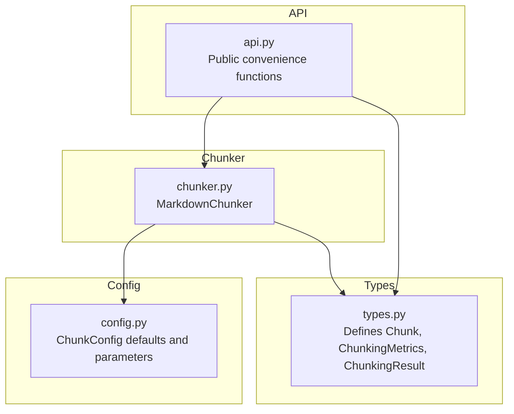
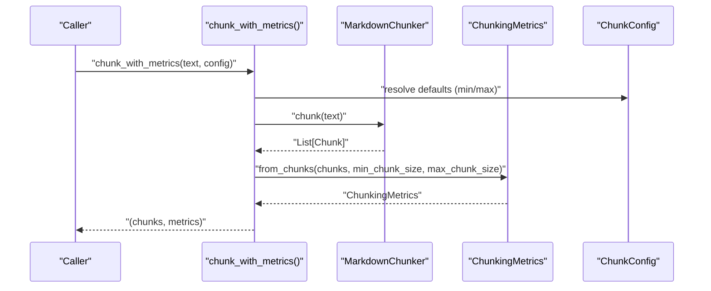
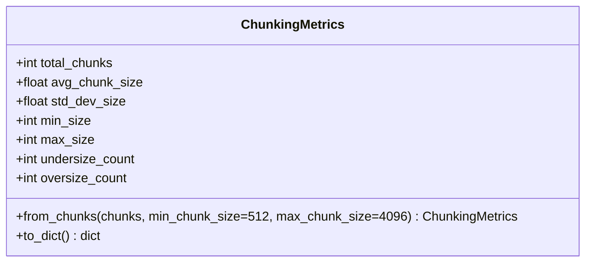
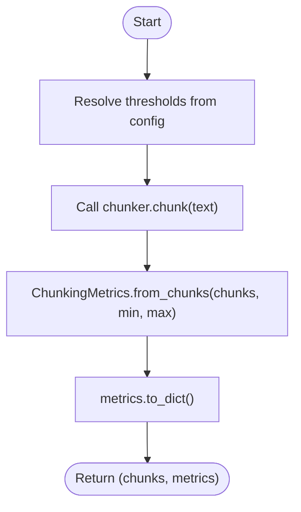
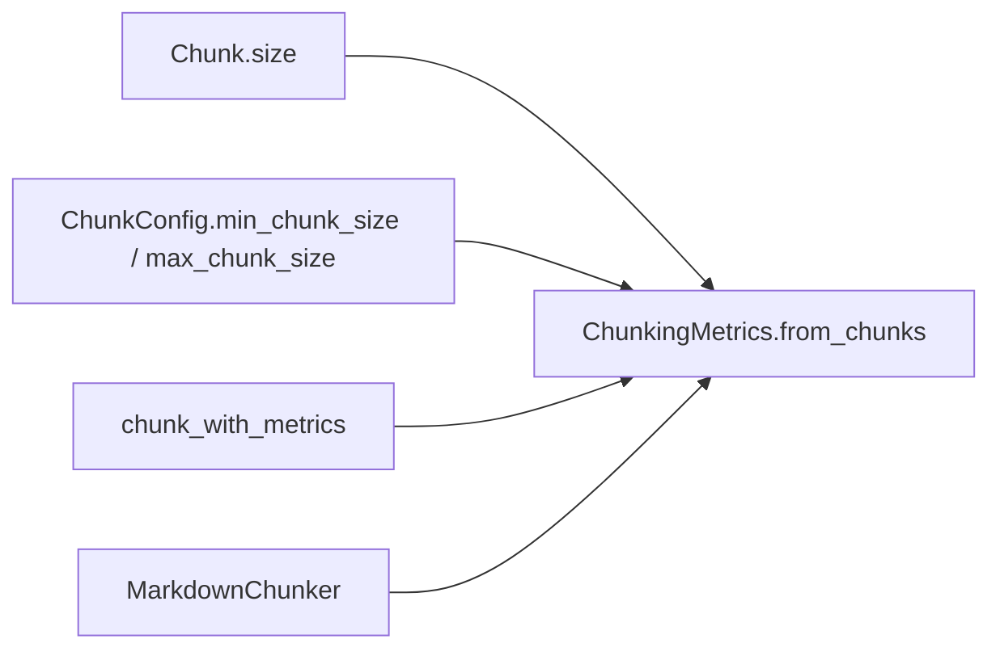

# ChunkingMetrics

<cite>
**Referenced Files in This Document**
- [types.py](file://src/chunkana/types.py)
- [chunker.py](file://src/chunkana/chunker.py)
- [api.py](file://src/chunkana/api.py)
- [config.py](file://src/chunkana/config.py)
</cite>

## Table of Contents
1. [Introduction](#introduction)
2. [Project Structure](#project-structure)
3. [Core Components](#core-components)
4. [Architecture Overview](#architecture-overview)
5. [Detailed Component Analysis](#detailed-component-analysis)
6. [Dependency Analysis](#dependency-analysis)
7. [Performance Considerations](#performance-considerations)
8. [Troubleshooting Guide](#troubleshooting-guide)
9. [Conclusion](#conclusion)

## Introduction
ChunkingMetrics provides quality assurance and performance monitoring for the chunking process. It summarizes key characteristics of a chunk set, enabling operators to assess chunk size distribution, detect anomalies, and tune chunking parameters for optimal downstream retrieval and processing. The metrics include total_chunks, avg_chunk_size, std_dev_size, min_size, max_size, undersize_count (chunks below min_chunk_size), and oversize_count (chunks above max_chunk_size). This document explains the data model, calculation logic, serialization, and practical interpretation for system tuning.

## Project Structure
ChunkingMetrics is defined alongside core types and is consumed by the chunker and public API.

**Diagram sources**
- [types.py](file://src/chunkana/types.py#L377-L430)
- [chunker.py](file://src/chunkana/chunker.py#L177-L190)
- [api.py](file://src/chunkana/api.py#L106-L136)
- [config.py](file://src/chunkana/config.py#L77-L81)

**Section sources**
- [types.py](file://src/chunkana/types.py#L377-L430)
- [chunker.py](file://src/chunkana/chunker.py#L177-L190)
- [api.py](file://src/chunkana/api.py#L106-L136)
- [config.py](file://src/chunkana/config.py#L77-L81)

## Core Components
- ChunkingMetrics: Dataclass holding descriptive statistics and counts for a chunk set.
- from_chunks: Class method that computes metrics from a list of Chunk objects.
- to_dict: Serialization method for exporting metrics to external monitoring systems.

Key fields:
- total_chunks: Count of chunks.
- avg_chunk_size: Mean chunk size in characters.
- std_dev_size: Population standard deviation of chunk sizes.
- min_size: Smallest chunk size.
- max_size: Largest chunk size.
- undersize_count: Number of chunks with size < min_chunk_size.
- oversize_count: Number of chunks with size > max_chunk_size.

Calculation details:
- Average and population variance are computed from the list of chunk sizes.
- Standard deviation is the square root of the variance.
- undersize_count and oversize_count are tallied using the provided min/max thresholds.

**Section sources**
- [types.py](file://src/chunkana/types.py#L377-L430)

## Architecture Overview
ChunkingMetrics is used by both the chunker and the public API to expose quality metrics after chunking.

**Diagram sources**
- [api.py](file://src/chunkana/api.py#L106-L136)
- [chunker.py](file://src/chunkana/chunker.py#L177-L190)
- [types.py](file://src/chunkana/types.py#L377-L430)
- [config.py](file://src/chunkana/config.py#L77-L81)

## Detailed Component Analysis

### Data Model: ChunkingMetrics
ChunkingMetrics is a dataclass designed for readability and interoperability. It exposes:
- Total count, central tendency (average), spread (standard deviation), and extremes (min/max).
- Counts for undersized and oversized chunks, which are thresholds used during chunking.

**Diagram sources**
- [types.py](file://src/chunkana/types.py#L377-L430)

**Section sources**
- [types.py](file://src/chunkana/types.py#L377-L430)

### Calculation Method: from_chunks
The from_chunks class method performs:
- Early exit for empty input.
- Collecting sizes from Chunk.size for each chunk.
- Computing average, population variance, and standard deviation.
- Determining min and max sizes.
- Counting undersized and oversized chunks using provided thresholds.

Statistical computation:
- Average: sum of sizes divided by number of chunks.
- Variance: sum of squared deviations from the mean, divided by the number of chunks (population variance).
- Standard deviation: square root of the variance.

Thresholds:
- undersize_count increments when size < min_chunk_size.
- oversize_count increments when size > max_chunk_size.

Edge cases:
- Empty chunk list returns zeros for all numeric fields.

Practical note:
- The method accepts explicit min_chunk_size and max_chunk_size to support scenarios where the thresholds differ from runtime configuration.

**Section sources**
- [types.py](file://src/chunkana/types.py#L393-L418)

### Serialization: to_dict
The to_dict method produces a dictionary suitable for logging, monitoring dashboards, or exporting to external systems. It includes all metric fields for straightforward consumption.

Typical usage:
- Call after chunking to produce a serializable representation of the metrics.

**Section sources**
- [types.py](file://src/chunkana/types.py#L419-L429)

### Integration Points
- Public API convenience function chunk_with_metrics returns both chunks and metrics.
- MarkdownChunker exposes chunk_with_metrics for programmatic access.
- ChunkConfig defines default min_chunk_size and max_chunk_size used by the convenience function.

**Diagram sources**
- [api.py](file://src/chunkana/api.py#L106-L136)
- [chunker.py](file://src/chunkana/chunker.py#L177-L190)
- [types.py](file://src/chunkana/types.py#L377-L430)
- [config.py](file://src/chunkana/config.py#L77-L81)

**Section sources**
- [api.py](file://src/chunkana/api.py#L106-L136)
- [chunker.py](file://src/chunkana/chunker.py#L177-L190)
- [config.py](file://src/chunkana/config.py#L77-L81)

## Dependency Analysis
- ChunkingMetrics depends on Chunk.size for computing statistics.
- Public API and chunker resolve thresholds from ChunkConfig defaults.
- No circular dependencies are introduced by this design.

**Diagram sources**
- [types.py](file://src/chunkana/types.py#L377-L430)
- [chunker.py](file://src/chunkana/chunker.py#L177-L190)
- [api.py](file://src/chunkana/api.py#L106-L136)
- [config.py](file://src/chunkana/config.py#L77-L81)

**Section sources**
- [types.py](file://src/chunkana/types.py#L377-L430)
- [chunker.py](file://src/chunkana/chunker.py#L177-L190)
- [api.py](file://src/chunkana/api.py#L106-L136)
- [config.py](file://src/chunkana/config.py#L77-L81)

## Performance Considerations
- Computation cost: from_chunks performs a single pass over the chunk list to collect sizes and compute average and variance. Time complexity is O(n) for n chunks; space complexity is O(n) for storing sizes plus O(1) for aggregates.
- Large documents: For very large outputs, consider sampling a subset of chunks to estimate distribution characteristics. Sampling reduces overhead while still capturing trends.
- Threshold sensitivity: Adjust min_chunk_size and max_chunk_size to balance retrieval quality and storage costs. Larger max_chunk_size may improve recall but increase latency and memory usage in downstream systems.
- Oversized chunks: The chunker may mark certain chunks as intentionally oversized to preserve atomic blocks (e.g., code or tables). These are not counted in oversize_count by default; oversize_count reflects chunks exceeding the configured limits.

Best practices:
- Monitor undersize_count and std_dev_size to detect fragmentation or inconsistent chunking strategies.
- Track avg_chunk_size to align with downstream embedding or LLM token limits.
- Use to_dict for lightweight export to monitoring systems.

[No sources needed since this section provides general guidance]

## Troubleshooting Guide
Common issues and interpretations:
- High undersize_count:
  - Indicates frequent small chunks, possibly due to overly aggressive splitting or short sections. Consider increasing min_chunk_size or adjusting strategy thresholds.
- High std_dev_size:
  - Suggests inconsistent chunk sizes across the document, potentially from mixed content types or uneven section lengths. Review strategy selection and consider adaptive sizing.
- High oversize_count:
  - May signal oversized chunks that could degrade retrieval quality or exceed downstream limits. Investigate atomic block preservation and consider reducing max_chunk_size or enabling adaptive sizing.

Operational tips:
- Use chunk_with_metrics to capture metrics for batches of documents and compare distributions across runs.
- Export metrics via to_dict for dashboards and alerting.

**Section sources**
- [types.py](file://src/chunkana/types.py#L377-L430)
- [chunker.py](file://src/chunkana/chunker.py#L431-L470)
- [api.py](file://src/chunkana/api.py#L106-L136)

## Conclusion
ChunkingMetrics offers a concise yet powerful lens into chunking quality. By tracking average and variability of chunk sizes, along with undersized and oversized counts, teams can continuously tune chunking parameters, validate strategy effectiveness, and maintain consistent retrieval performance. The straightforward to_dict serialization makes it easy to integrate metrics into monitoring pipelines.