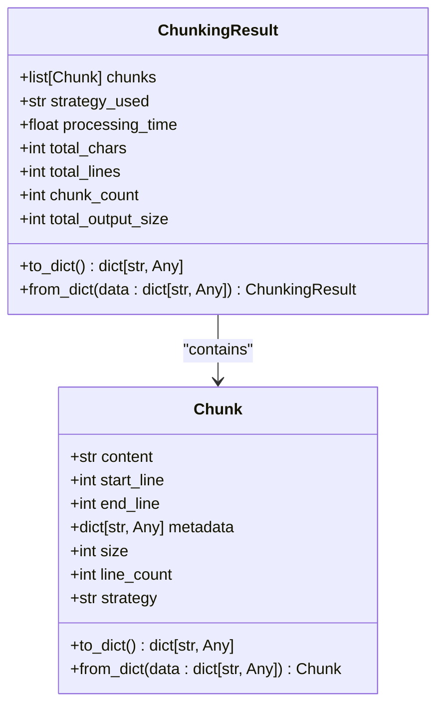
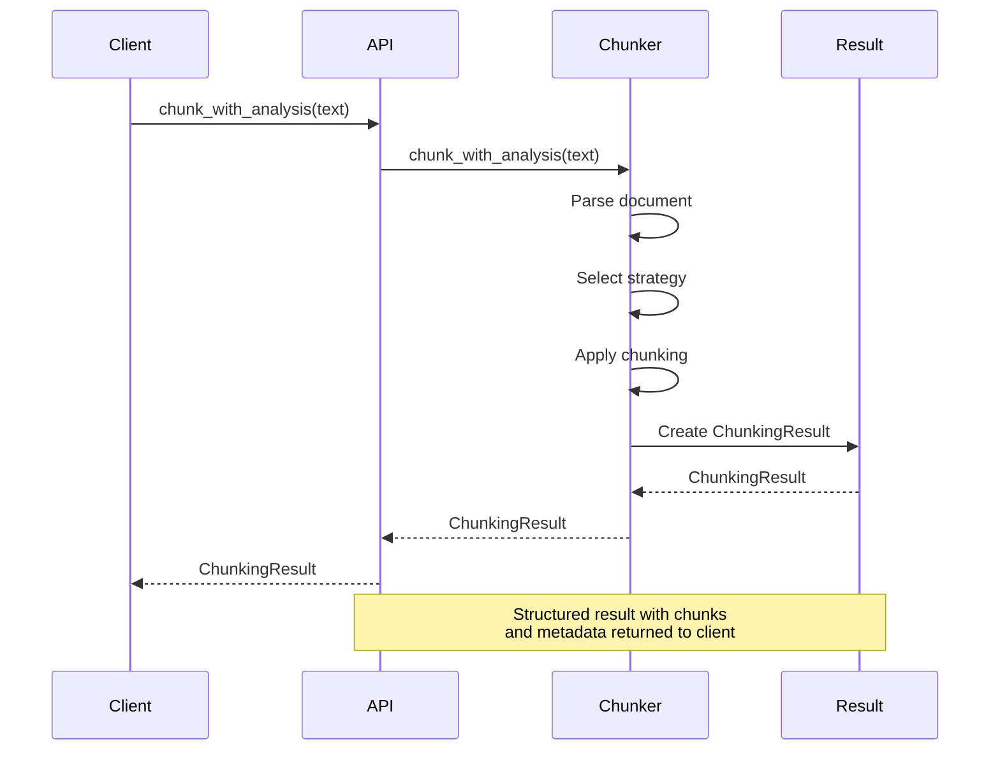

# ChunkingResult

<cite>
**Referenced Files in This Document**   
- [types.py](file://src/chunkana/types.py#L432-L477)
- [api.py](file://src/chunkana/api.py#L70-L103)
- [compat.py](file://src/chunkana/compat.py#L68-L74)
</cite>

## Table of Contents
1. [Introduction](#introduction)
2. [Core Attributes](#core-attributes)
3. [Computed Properties](#computed-properties)
4. [Serialization Methods](#serialization-methods)
5. [Usage in APIs and Workflows](#usage-in-apis-and-workflows)
6. [Performance Monitoring](#performance-monitoring)
7. [Common Issues and Handling](#common-issues-and-handling)

## Introduction
The `ChunkingResult` class is a data container that encapsulates the output of the markdown chunking process. It provides structured access to the generated chunks along with metadata about the chunking operation, enabling consistent handling across different components of the system. This wrapper class is central to the chunking pipeline, serving as the primary interface between the chunking engine and downstream consumers such as API endpoints, logging systems, and debugging tools.

**Section sources**
- [types.py](file://src/chunkana/types.py#L432-L477)

## Core Attributes
The `ChunkingResult` class contains several key attributes that capture essential information about the chunking operation:

- **chunks**: A list of `Chunk` objects representing the segmented content. Each `Chunk` contains the actual text content, positional information (start_line, end_line), and metadata about the chunk's characteristics and context within the document.

- **strategy_used**: A string indicating the name of the chunking strategy that was selected and applied during the process. This provides transparency into the algorithmic approach used for segmentation, which can be valuable for debugging and optimization.

- **processing_time**: A float value representing the duration of the chunking process in seconds. This metric enables performance monitoring and helps identify potential bottlenecks in the chunking pipeline.

- **total_chars**: An integer representing the total number of characters in the original input document. This provides context for understanding the scale of the chunking operation.

- **total_lines**: An integer representing the total number of lines in the original input document. This complements the character count by providing a line-based perspective on document size.

These attributes are initialized when the `ChunkingResult` is created and provide a comprehensive snapshot of the chunking operation.

**Section sources**
- [types.py](file://src/chunkana/types.py#L440-L444)

## Computed Properties
The `ChunkingResult` class provides two computed properties that offer quick access to important statistics:

- **chunk_count**: This property returns the number of chunks produced by the chunking process. It is implemented as a simple wrapper around `len(self.chunks)` and provides an efficient way to determine the output volume without needing to access the chunks list directly.

- **total_output_size**: This property calculates the total size of all chunks by summing the size of each individual chunk. It represents the aggregate character count across all output chunks and can be used to analyze the efficiency of the chunking process.

The difference between `total_chars` and `total_output_size` can reveal important information about the overhead introduced by the chunking process, such as metadata inclusion or content duplication for context preservation.

**Section sources**
- [types.py](file://src/chunkana/types.py#L446-L454)

## Serialization Methods
The `ChunkingResult` class provides robust serialization capabilities to facilitate data exchange and persistence:

- **to_dict()**: This method converts the `ChunkingResult` instance into a dictionary representation suitable for JSON serialization. It recursively calls the `to_dict()` method on each `Chunk` object in the chunks list, ensuring complete serialization of the entire structure. The resulting dictionary includes all core attributes along with the computed `chunk_count` property.

- **from_dict()**: This class method serves as a deserialization constructor, creating a new `ChunkingResult` instance from a dictionary representation. It reconstructs the `Chunk` objects from their dictionary representations using `Chunk.from_dict()`, ensuring proper object instantiation and validation.

These serialization methods enable the `ChunkingResult` to be easily transmitted across network boundaries, stored in databases, or written to files, making it suitable for integration with various systems and workflows.

**Diagram sources**
- [types.py](file://src/chunkana/types.py#L432-L477)

**Section sources**
- [types.py](file://src/chunkana/types.py#L456-L477)

## Usage in APIs and Workflows
The `ChunkingResult` class is extensively used across various API endpoints and workflows within the system:

- **API Responses**: The `chunk_with_analysis` function in the public API returns a `ChunkingResult` object, providing clients with comprehensive information about the chunking operation alongside the actual chunks. This enables rich client-side processing and analysis.

- **Logging and Debugging**: The structured nature of `ChunkingResult` makes it ideal for logging purposes. Systems can log the complete result or specific attributes (like processing_time or strategy_used) to monitor system behavior and troubleshoot issues.

- **Integration Workflows**: In compatibility layers, the `LegacyMarkdownChunker.chunk` method returns a `ChunkingResult` when `include_analysis=True`, maintaining backward compatibility while providing enhanced functionality.

The class serves as a standardized data transfer object that ensures consistency across different parts of the system, reducing the complexity of interface design and improving maintainability.

**Diagram sources**
- [api.py](file://src/chunkana/api.py#L70-L103)
- [compat.py](file://src/chunkana/compat.py#L68-L74)

**Section sources**
- [api.py](file://src/chunkana/api.py#L70-L103)
- [compat.py](file://src/chunkana/compat.py#L54-L76)

## Performance Monitoring
The `processing_time` attribute of `ChunkingResult` plays a crucial role in performance monitoring and system optimization:

- **Performance Benchmarking**: By tracking processing_time across different documents and configurations, developers can establish performance baselines and measure the impact of optimizations.

- **Strategy Comparison**: The processing_time can be compared across different chunking strategies to evaluate their relative efficiency, helping to inform strategy selection algorithms.

- **Resource Planning**: Understanding processing_time distributions helps in capacity planning and setting appropriate timeouts for API endpoints.

- **Anomaly Detection**: Significant deviations from expected processing_time values can indicate potential issues such as inefficient algorithms, resource constraints, or problematic input patterns.

The combination of processing_time with other metrics like total_chars and chunk_count enables sophisticated performance analysis, allowing developers to understand the computational complexity of the chunking process relative to input size.

**Section sources**
- [types.py](file://src/chunkana/types.py#L442)

## Common Issues and Handling
Several common issues can arise when working with `ChunkingResult`, and the system provides mechanisms to address them:

- **Incomplete Chunk Lists**: In cases where the chunking process is terminated early (e.g., due to resource constraints), the chunks list may be incomplete. The system should validate the completeness of results before processing, potentially implementing retry mechanisms or fallback strategies.

- **Large Results Handling**: For documents that produce a large number of chunks, memory usage can become a concern. The system addresses this through streaming interfaces like `chunk_file_streaming` that yield chunks incrementally rather than returning them all at once.

- **Metadata Overhead**: The difference between total_chars and total_output_size can reveal overhead from metadata or duplication. When this overhead is significant, it may indicate suboptimal chunking parameters that could be adjusted to improve efficiency.

- **Strategy Selection Issues**: If the strategy_used field indicates a suboptimal strategy, this can be used to trigger re-evaluation of the strategy selection algorithm or to provide feedback for machine learning models that might be used in adaptive systems.

These considerations highlight the importance of robust error handling and monitoring when working with `ChunkingResult` in production environments.

**Section sources**
- [types.py](file://src/chunkana/types.py#L432-L477)
- [api.py](file://src/chunkana/api.py#L228-L270)