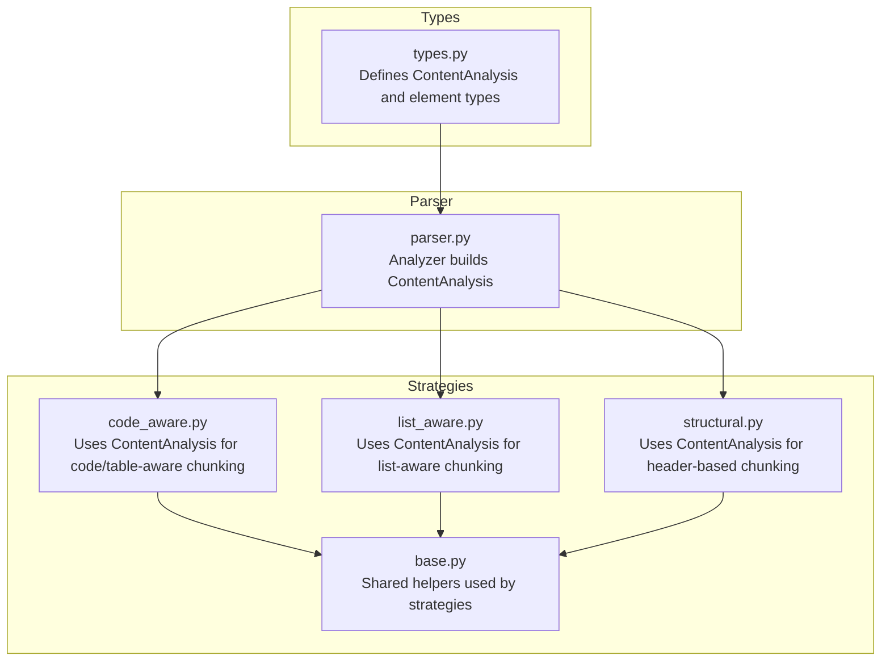
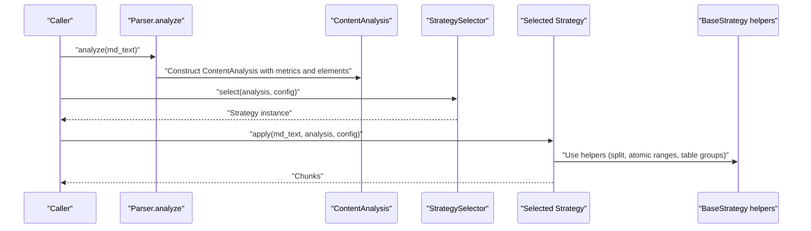
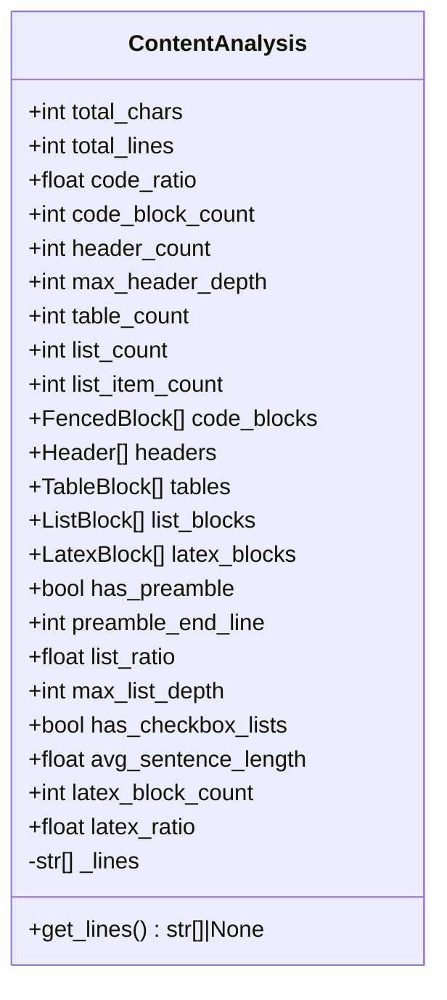
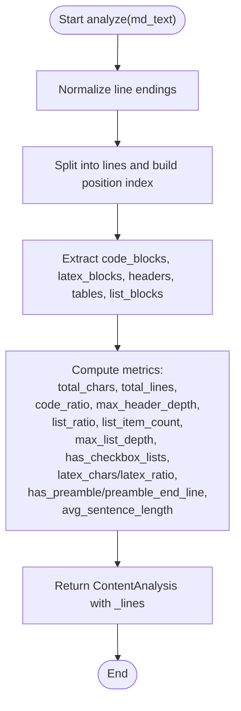
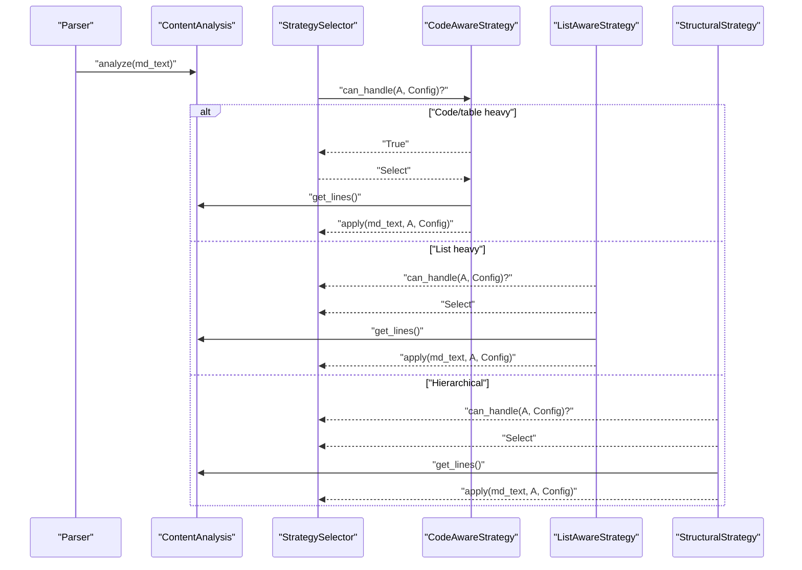
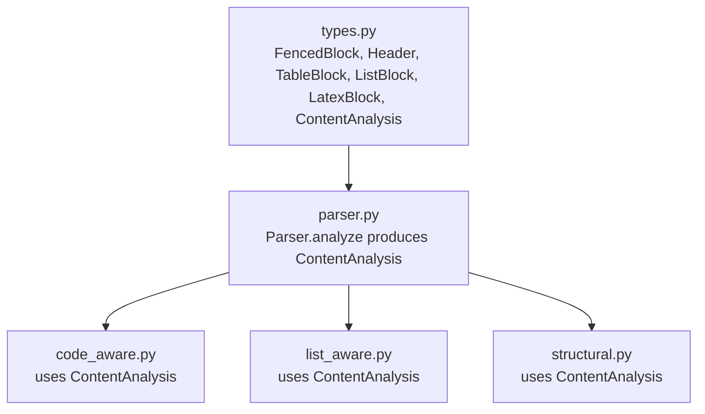

# ContentAnalysis

<cite>
**Referenced Files in This Document**
- [types.py](file://src/chunkana/types.py)
- [parser.py](file://src/chunkana/parser.py)
- [code_aware.py](file://src/chunkana/strategies/code_aware.py)
- [list_aware.py](file://src/chunkana/strategies/list_aware.py)
- [structural.py](file://src/chunkana/strategies/structural.py)
- [base.py](file://src/chunkana/strategies/base.py)
- [test_strategies.py](file://tests/unit/test_strategies.py)
</cite>

## Table of Contents
1. [Introduction](#introduction)
2. [Project Structure](#project-structure)
3. [Core Components](#core-components)
4. [Architecture Overview](#architecture-overview)
5. [Detailed Component Analysis](#detailed-component-analysis)
6. [Dependency Analysis](#dependency-analysis)
7. [Performance Considerations](#performance-considerations)
8. [Troubleshooting Guide](#troubleshooting-guide)
9. [Conclusion](#conclusion)

## Introduction
This document describes the ContentAnalysis data model that captures document-level metrics and extracted elements to drive intelligent chunking decisions. It explains the basic metrics (total_chars, total_lines), content ratios (code_ratio, latex_ratio), element counts (code_block_count, header_count, max_header_depth, table_count, list_count, list_item_count, latex_block_count), and the extracted elements lists (code_blocks, headers, tables, list_blocks, latex_blocks). It also documents additional computed metrics (has_preamble, preamble_end_line, list_ratio, max_list_depth, has_checkbox_lists, avg_sentence_length) and the optional _lines cache field. Finally, it shows how strategies use ContentAnalysis for decision-making and outlines common issues and performance implications.

## Project Structure
ContentAnalysis is defined alongside related types in a single module and is consumed by the parser and strategies.

**Diagram sources**
- [types.py](file://src/chunkana/types.py#L181-L240)
- [parser.py](file://src/chunkana/parser.py#L44-L121)
- [code_aware.py](file://src/chunkana/strategies/code_aware.py#L32-L41)
- [list_aware.py](file://src/chunkana/strategies/list_aware.py#L48-L90)
- [structural.py](file://src/chunkana/strategies/structural.py#L52-L66)
- [base.py](file://src/chunkana/strategies/base.py#L168-L209)

**Section sources**
- [types.py](file://src/chunkana/types.py#L181-L240)
- [parser.py](file://src/chunkana/parser.py#L44-L121)

## Core Components
- ContentAnalysis: The central data model holding document-level metrics and extracted elements.
- Element types: FencedBlock, Header, TableBlock, ListBlock, LatexBlock.
- Parser: Produces ContentAnalysis from raw markdown text.
- Strategies: Use ContentAnalysis to select and apply chunking strategies.

Key responsibilities:
- ContentAnalysis aggregates counts, ratios, and element lists for downstream decision-making.
- Parser computes metrics and extracts elements using a single pass over normalized lines.
- Strategies consume ContentAnalysis to decide whether to preserve atomic blocks, split on headers, or handle lists.

**Section sources**
- [types.py](file://src/chunkana/types.py#L181-L240)
- [parser.py](file://src/chunkana/parser.py#L44-L121)
- [code_aware.py](file://src/chunkana/strategies/code_aware.py#L32-L41)
- [list_aware.py](file://src/chunkana/strategies/list_aware.py#L48-L90)
- [structural.py](file://src/chunkana/strategies/structural.py#L52-L66)

## Architecture Overview
The pipeline is: raw markdown text → Parser.analyze → ContentAnalysis → StrategySelector → Strategy.apply → Chunks.

**Diagram sources**
- [parser.py](file://src/chunkana/parser.py#L44-L121)
- [code_aware.py](file://src/chunkana/strategies/code_aware.py#L42-L103)
- [list_aware.py](file://src/chunkana/strategies/list_aware.py#L91-L110)
- [structural.py](file://src/chunkana/strategies/structural.py#L58-L150)
- [base.py](file://src/chunkana/strategies/base.py#L210-L361)

## Detailed Component Analysis

### ContentAnalysis data model
ContentAnalysis is a dataclass that holds:
- Basic metrics: total_chars, total_lines
- Content ratios: code_ratio, latex_ratio
- Element counts: code_block_count, header_count, max_header_depth, table_count, list_count, list_item_count
- Extracted elements: code_blocks, headers, tables, list_blocks, latex_blocks
- Additional computed metrics: has_preamble, preamble_end_line, list_ratio, max_list_depth, has_checkbox_lists, avg_sentence_length, latex_block_count
- Optional optimization cache: _lines (a list[str] of lines)

Behavioral notes:
- _lines is optional and private (not shown in repr). Strategies can use analysis.get_lines() to access it for optimization and fall back to splitting md_text if unavailable.
- The parser populates _lines during analysis to avoid redundant line splits later.

**Diagram sources**
- [types.py](file://src/chunkana/types.py#L181-L240)

**Section sources**
- [types.py](file://src/chunkana/types.py#L181-L240)

### How the parser constructs ContentAnalysis
The parser performs a single-pass analysis:
- Normalizes line endings once.
- Splits text into lines and builds a position index for O(1) lookups.
- Extracts code blocks, LaTeX blocks, headers, tables, and lists using the shared lines and positions.
- Computes metrics: total_chars, total_lines, code_ratio, max_header_depth, list_ratio, list_item_count, max_list_depth, has_checkbox_lists, latex_chars/latex_ratio, has_preamble/preamble_end_line, avg_sentence_length.
- Returns ContentAnalysis with _lines populated for strategy optimization.

**Diagram sources**
- [parser.py](file://src/chunkana/parser.py#L44-L121)

**Section sources**
- [parser.py](file://src/chunkana/parser.py#L44-L121)

### Element types used by ContentAnalysis
- FencedBlock: code blocks with language, content, start/end lines/positions, fence char/length, closed state, and optional code-context binding fields.
- Header: ATX headers with level, text, line, and position.
- TableBlock: tables with content, start/end lines, column/row counts.
- ListBlock: contiguous list items with items, start/end lines, predominant list type, and max depth.
- LatexBlock: LaTeX blocks with content, type (display/environment/inline), start/end lines/positions, and optional environment name.

These types are used to populate the corresponding fields in ContentAnalysis.

**Section sources**
- [types.py](file://src/chunkana/types.py#L80-L179)

### Strategy usage of ContentAnalysis
- Code-aware strategy selects when code_block_count >= 1, table_count >= 1, or code_ratio exceeds threshold. It preserves atomic blocks and uses analysis.get_lines() for efficient splitting.
- List-aware strategy selects based on list_ratio and list_count thresholds, with special logic for strongly structured documents. It preserves list hierarchies and uses analysis.get_lines().
- Structural strategy selects when header_count and max_header_depth exceed thresholds. It uses analysis.headers and analysis.get_lines() to split by headers and compute header_path metadata.

**Diagram sources**
- [parser.py](file://src/chunkana/parser.py#L44-L121)
- [code_aware.py](file://src/chunkana/strategies/code_aware.py#L32-L41)
- [list_aware.py](file://src/chunkana/strategies/list_aware.py#L48-L90)
- [structural.py](file://src/chunkana/strategies/structural.py#L52-L66)

**Section sources**
- [code_aware.py](file://src/chunkana/strategies/code_aware.py#L32-L41)
- [list_aware.py](file://src/chunkana/strategies/list_aware.py#L48-L90)
- [structural.py](file://src/chunkana/strategies/structural.py#L52-L66)
- [test_strategies.py](file://tests/unit/test_strategies.py#L12-L62)

### Decision-making examples
- Code-aware strategy: high code_ratio or presence of code blocks/tables triggers preservation of atomic blocks and splitting around them.
- List-aware strategy: high list_ratio and/or high list_count (with thresholds) triggers preservation of list hierarchies and optional introduction binding.
- Structural strategy: sufficient headers and max header depth triggers header-based splitting and header_path metadata construction.

These behaviors are validated by unit tests that construct documents with known characteristics and assert the selected strategy.

**Section sources**
- [test_strategies.py](file://tests/unit/test_strategies.py#L12-L62)
- [test_strategies.py](file://tests/unit/test_strategies.py#L91-L123)

## Dependency Analysis
ContentAnalysis depends on element types and is consumed by strategies. The parser is the producer.

**Diagram sources**
- [types.py](file://src/chunkana/types.py#L80-L240)
- [parser.py](file://src/chunkana/parser.py#L44-L121)
- [code_aware.py](file://src/chunkana/strategies/code_aware.py#L32-L41)
- [list_aware.py](file://src/chunkana/strategies/list_aware.py#L48-L90)
- [structural.py](file://src/chunkana/strategies/structural.py#L52-L66)

**Section sources**
- [types.py](file://src/chunkana/types.py#L80-L240)
- [parser.py](file://src/chunkana/parser.py#L44-L121)
- [code_aware.py](file://src/chunkana/strategies/code_aware.py#L32-L41)
- [list_aware.py](file://src/chunkana/strategies/list_aware.py#L48-L90)
- [structural.py](file://src/chunkana/strategies/structural.py#L52-L66)

## Performance Considerations
- Single-pass analysis: The parser normalizes line endings once, splits into lines once, and builds a position index for O(1) lookups, minimizing repeated scans.
- Shared line array: ContentAnalysis stores _lines so strategies can avoid redundant splits and reuse the parsed lines.
- Atomic block preservation: Strategies rely on ContentAnalysis to avoid splitting atomic blocks, reducing post-processing overhead.
- Threshold-based selection: Strategies short-circuit when thresholds are not met, avoiding unnecessary work.

Common pitfalls and mitigations:
- Missing element extraction: If a document lacks certain elements, counts/ratios will reflect zero/negligible values. Strategies still select appropriately based on thresholds.
- Over-reliance on ratios: Very low-density content may not trigger specialized strategies; consider adjusting thresholds via configuration.
- Large documents: The parser’s single-pass design scales linearly with document size; ensure max_chunk_size and overlap_size are tuned for memory and throughput.

**Section sources**
- [parser.py](file://src/chunkana/parser.py#L54-L121)
- [code_aware.py](file://src/chunkana/strategies/code_aware.py#L69-L103)
- [list_aware.py](file://src/chunkana/strategies/list_aware.py#L96-L110)
- [structural.py](file://src/chunkana/strategies/structural.py#L67-L99)

## Troubleshooting Guide
- Symptom: Strategies do not select expected behavior.
  - Verify thresholds: code_ratio threshold for code-aware, list_ratio and list_count thresholds for list-aware, header_count and max_header_depth for structural.
  - Inspect ContentAnalysis fields: confirm counts and ratios align with expectations.
- Symptom: Missing elements in ContentAnalysis.
  - Confirm parser ran successfully and returned ContentAnalysis.
  - Check that the document contains expected elements (e.g., fenced code, headers, tables, lists).
- Symptom: Unexpected oversize chunks.
  - Oversize is intentional when preserving atomic blocks or large sections; strategies set allow_oversize with a reason.
- Symptom: Fence imbalance errors.
  - Some chunks may have unbalanced fences; strategies attempt to merge with neighbors or mark fence_balance_error.

Validation references:
- Strategy selection tests demonstrate expected behavior for code-heavy, list-heavy, and hierarchical documents.
- Tests verify that chunks preserve atomic blocks and respect size limits.

**Section sources**
- [test_strategies.py](file://tests/unit/test_strategies.py#L12-L62)
- [test_strategies.py](file://tests/unit/test_strategies.py#L165-L219)
- [test_strategies.py](file://tests/unit/test_strategies.py#L221-L269)
- [test_strategies.py](file://tests/unit/test_strategies.py#L270-L364)
- [base.py](file://src/chunkana/strategies/base.py#L118-L167)

## Conclusion
ContentAnalysis provides a compact yet comprehensive summary of a markdown document’s structure and content density. Its metrics and extracted elements enable strategies to make informed, efficient chunking decisions while preserving atomic blocks and document hierarchy. The optional _lines cache field further optimizes performance by enabling strategies to reuse parsed lines. Proper tuning of thresholds and awareness of performance characteristics ensure robust chunking across diverse document types.