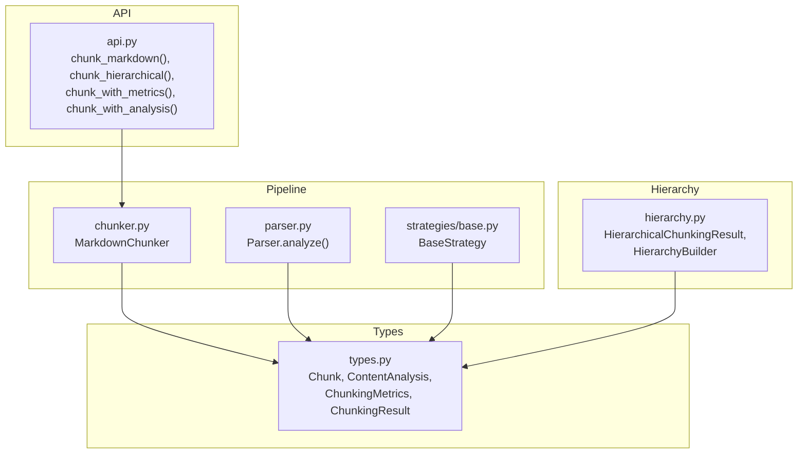
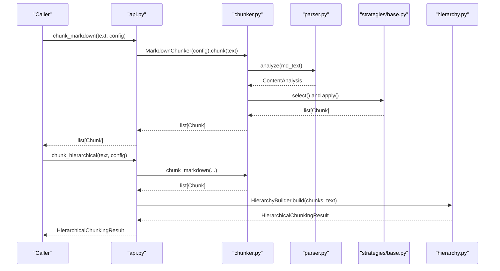
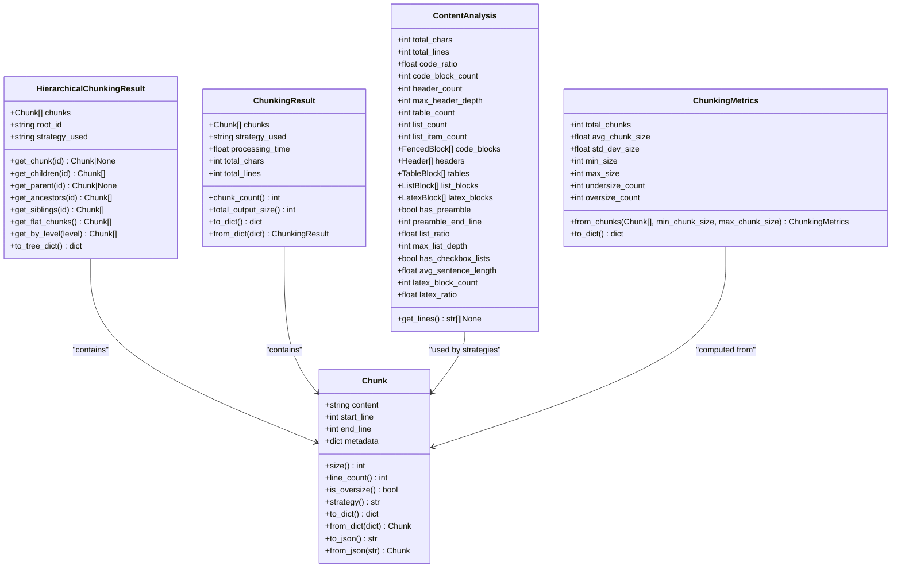
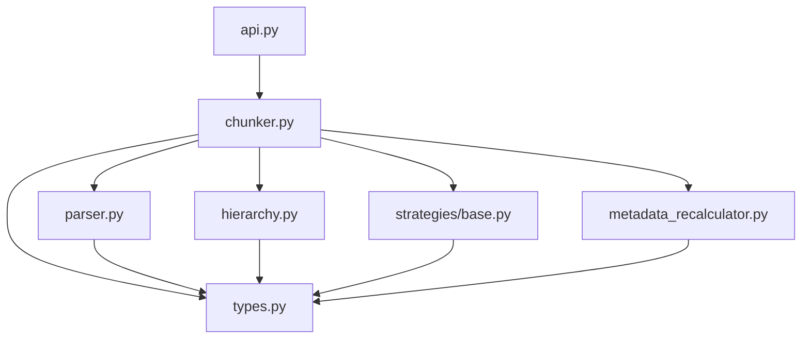

# Data Models

<cite>
**Referenced Files in This Document**
- [types.py](file://src/chunkana/types.py)
- [chunker.py](file://src/chunkana/chunker.py)
- [hierarchy.py](file://src/chunkana/hierarchy.py)
- [api.py](file://src/chunkana/api.py)
- [parser.py](file://src/chunkana/parser.py)
- [metadata_recalculator.py](file://src/chunkana/metadata_recalculator.py)
- [base.py](file://src/chunkana/strategies/base.py)
</cite>

## Table of Contents
1. [Introduction](#introduction)
2. [Project Structure](#project-structure)
3. [Core Components](#core-components)
4. [Architecture Overview](#architecture-overview)
5. [Detailed Component Analysis](#detailed-component-analysis)
6. [Dependency Analysis](#dependency-analysis)
7. [Performance Considerations](#performance-considerations)
8. [Troubleshooting Guide](#troubleshooting-guide)
9. [Conclusion](#conclusion)

## Introduction
This document provides comprehensive data model documentation for Chunkana’s core data structures. It focuses on:
- The Chunk class and its metadata fields
- The ContentAnalysis class and its document metrics and extracted elements
- The ChunkingMetrics class and the ChunkingResult wrapper
- The HierarchicalChunkingResult class and its navigation methods
- Practical usage examples in the API

The goal is to make these models accessible to both technical and non-technical users by clearly defining fields, data types, relationships, and real-world usage patterns.

## Project Structure
The data models are defined centrally and consumed across the chunking pipeline:
- Types define the canonical data structures and enums
- The chunker orchestrates parsing, strategy selection, chunking, overlap, and validation
- The hierarchy builder adds parent-child relationships and navigation
- The API exposes convenient functions returning typed results

**Diagram sources**
- [types.py](file://src/chunkana/types.py#L240-L478)
- [chunker.py](file://src/chunkana/chunker.py#L85-L216)
- [hierarchy.py](file://src/chunkana/hierarchy.py#L16-L120)
- [api.py](file://src/chunkana/api.py#L18-L110)
- [parser.py](file://src/chunkana/parser.py#L44-L122)
- [base.py](file://src/chunkana/strategies/base.py#L67-L117)

**Section sources**
- [types.py](file://src/chunkana/types.py#L240-L478)
- [chunker.py](file://src/chunkana/chunker.py#L85-L216)
- [hierarchy.py](file://src/chunkana/hierarchy.py#L16-L120)
- [api.py](file://src/chunkana/api.py#L18-L110)
- [parser.py](file://src/chunkana/parser.py#L44-L122)
- [base.py](file://src/chunkana/strategies/base.py#L67-L117)

## Core Components
This section defines the core data structures and their roles in the system.

- Chunk: A single chunk of content with positional metadata and arbitrary metadata fields
- ContentAnalysis: Metrics and extracted elements from a parsed document
- ChunkingMetrics: Quality metrics computed from a list of chunks
- ChunkingResult: Wrapper around chunks and metadata for transport
- HierarchicalChunkingResult: A flat list of chunks augmented with parent-child-sibling relationships and navigation methods

**Section sources**
- [types.py](file://src/chunkana/types.py#L240-L478)
- [hierarchy.py](file://src/chunkana/hierarchy.py#L16-L120)

## Architecture Overview
The chunking pipeline produces Chunk objects enriched with metadata. The hierarchy builder augments these chunks with navigation metadata. The API exposes typed results for consumers.

**Diagram sources**
- [api.py](file://src/chunkana/api.py#L18-L110)
- [chunker.py](file://src/chunkana/chunker.py#L85-L216)
- [parser.py](file://src/chunkana/parser.py#L44-L122)
- [base.py](file://src/chunkana/strategies/base.py#L67-L117)
- [hierarchy.py](file://src/chunkana/hierarchy.py#L260-L308)

## Detailed Component Analysis

### Chunk
Chunk represents a single chunk of content with:
- content: string
- start_line: int (1-indexed)
- end_line: int (1-indexed)
- metadata: dict[str, Any]

Key behaviors:
- Validation enforces positive start_line and non-empty content
- Utility properties: size, line_count, is_oversize, strategy
- Serialization helpers: to_dict/from_dict, to_json/from_json

Important metadata fields populated during chunking:
- chunk_index: int — sequential index of chunk in document
- content_type: str — "text" | "code" | "table" | "mixed" | "preamble"
- has_code: bool — presence of fenced code markers
- strategy: str — strategy name that created this chunk
- header_path: str — hierarchical path to first header in chunk (e.g., "/Level1/Level2/Level3"; special "/__preamble__" for preamble; empty if no headers)
- header_level: int — level of first header in chunk (1–6)
- sub_headers: list[str] (optional) — additional header texts within the chunk (excluding the first header)
- small_chunk: bool — whether the chunk is structurally weak and below min_chunk_size
- small_chunk_reason: str — reason for small_chunk flag (e.g., "cannot_merge")
- previous_content: str (optional) — last N characters from previous chunk (metadata-only)
- next_content: str (optional) — first N characters from next chunk (metadata-only)
- overlap_size: int (optional) — size of context window used for overlap metadata
- allow_oversize: bool — whether the chunk is intentionally oversized
- oversize_reason: str — reason for oversize (e.g., "code_block_integrity", "table_integrity", "section_integrity", "latex_integrity", "related_code_group")

Practical usage examples:
- Access content and line range for downstream processing
- Use metadata to route chunks by content_type or strategy
- Use header_path to navigate hierarchical structure
- Use overlap metadata to provide context windows for LLMs without duplicating content

**Section sources**
- [types.py](file://src/chunkana/types.py#L240-L376)
- [chunker.py](file://src/chunkana/chunker.py#L301-L470)
- [chunker.py](file://src/chunkana/chunker.py#L471-L682)
- [chunker.py](file://src/chunkana/chunker.py#L813-L824)
- [base.py](file://src/chunkana/strategies/base.py#L90-L117)

### ContentAnalysis
ContentAnalysis captures document-level metrics and extracted elements:
- Basic metrics: total_chars: int, total_lines: int
- Content ratios: code_ratio: float
- Element counts: code_block_count: int, header_count: int, max_header_depth: int, table_count: int, list_count: int, list_item_count: int
- Extracted elements: code_blocks: list[FencedBlock], headers: list[Header], tables: list[TableBlock], list_blocks: list[ListBlock], latex_blocks: list[LatexBlock]
- Additional metrics: has_preamble: bool, preamble_end_line: int, list_ratio: float, max_list_depth: int, has_checkbox_lists: bool, avg_sentence_length: float, latex_block_count: int, latex_ratio: float
- Internal optimization: _lines: list[str] | None — cached line array enabling strategy optimizations

Practical usage examples:
- Use code_ratio and list_ratio to inform strategy selection
- Use headers and tables to guide structural strategies
- Use has_preamble and preamble_end_line to adjust chunk boundaries
- Use _lines for efficient strategy operations without repeated splits

**Section sources**
- [types.py](file://src/chunkana/types.py#L182-L239)
- [parser.py](file://src/chunkana/parser.py#L44-L122)

### ChunkingMetrics
ChunkingMetrics provides quality metrics for monitoring and tuning:
- total_chunks: int
- avg_chunk_size: float
- std_dev_size: float
- min_size: int
- max_size: int
- undersize_count: int — chunks < min_chunk_size
- oversize_count: int — chunks > max_chunk_size

Computed from a list of chunks with configurable thresholds.

Practical usage examples:
- Monitor distribution of chunk sizes
- Tune min_chunk_size and max_chunk_size based on std_dev_size
- Track undersize_count and oversize_count to detect problematic documents

**Section sources**
- [types.py](file://src/chunkana/types.py#L378-L431)

### ChunkingResult
ChunkingResult wraps chunking output with metadata:
- chunks: list[Chunk]
- strategy_used: str
- processing_time: float
- total_chars: int
- total_lines: int
- chunk_count: int — property
- total_output_size: int — property

Serialization helpers: to_dict/from_dict.

Practical usage examples:
- Transport chunks and metadata together
- Inspect strategy_used and timing
- Aggregate totals for reporting

**Section sources**
- [types.py](file://src/chunkana/types.py#L433-L478)
- [api.py](file://src/chunkana/api.py#L70-L104)
- [api.py](file://src/chunkana/api.py#L106-L136)

### HierarchicalChunkingResult
HierarchicalChunkingResult augments a flat list of chunks with navigation metadata and methods:
- chunks: list[Chunk]
- root_id: str
- strategy_used: str
- Navigation methods:
  - get_chunk(chunk_id) -> Chunk | None
  - get_children(chunk_id) -> list[Chunk]
  - get_parent(chunk_id) -> Chunk | None
  - get_ancestors(chunk_id) -> list[Chunk]
  - get_siblings(chunk_id) -> list[Chunk]
  - get_flat_chunks() -> list[Chunk]
  - get_by_level(level) -> list[Chunk]
  - to_tree_dict() -> dict[str, object]

HierarchyBuilder constructs parent-child-sibling relationships using header_path metadata and assigns:
- chunk_id: str — unique ID per chunk
- parent_id: str | None
- children_ids: list[str]
- hierarchy_level: int — calculated from tree depth
- is_root: bool — root document chunk
- is_leaf: bool — no children
- section_tags: list[str] — derived from content headers (recalculated)

Practical usage examples:
- Navigate parent-child relationships
- Retrieve ancestors to reconstruct document path
- Get siblings for ordered traversal
- Export tree structure for visualization

**Diagram sources**
- [types.py](file://src/chunkana/types.py#L240-L478)
- [hierarchy.py](file://src/chunkana/hierarchy.py#L16-L120)

**Section sources**
- [hierarchy.py](file://src/chunkana/hierarchy.py#L16-L231)
- [hierarchy.py](file://src/chunkana/hierarchy.py#L233-L308)
- [hierarchy.py](file://src/chunkana/hierarchy.py#L309-L511)
- [hierarchy.py](file://src/chunkana/hierarchy.py#L512-L655)
- [hierarchy.py](file://src/chunkana/hierarchy.py#L656-L800)

## Dependency Analysis
The following diagram shows how the core data models depend on each other and on the pipeline components.

**Diagram sources**
- [types.py](file://src/chunkana/types.py#L240-L478)
- [chunker.py](file://src/chunkana/chunker.py#L85-L216)
- [hierarchy.py](file://src/chunkana/hierarchy.py#L16-L120)
- [api.py](file://src/chunkana/api.py#L18-L110)
- [parser.py](file://src/chunkana/parser.py#L44-L122)
- [base.py](file://src/chunkana/strategies/base.py#L67-L117)
- [metadata_recalculator.py](file://src/chunkana/metadata_recalculator.py#L1-L161)

**Section sources**
- [types.py](file://src/chunkana/types.py#L240-L478)
- [chunker.py](file://src/chunkana/chunker.py#L85-L216)
- [hierarchy.py](file://src/chunkana/hierarchy.py#L16-L120)
- [api.py](file://src/chunkana/api.py#L18-L110)
- [parser.py](file://src/chunkana/parser.py#L44-L122)
- [base.py](file://src/chunkana/strategies/base.py#L67-L117)
- [metadata_recalculator.py](file://src/chunkana/metadata_recalculator.py#L1-L161)

## Performance Considerations
- Chunk.__post_init__ validates inputs early to prevent invalid states
- Chunk.size and line_count are computed on demand
- Overlap metadata is metadata-only; chunk.content remains distinct and non-overlapping
- ContentAnalysis caches lines via _lines to avoid repeated splits in strategies
- MetadataRecalculator recomputes derived metadata after post-processing to ensure consistency

[No sources needed since this section provides general guidance]

## Troubleshooting Guide
Common issues and remedies:
- Oversized chunks: If a chunk exceeds max_chunk_size due to atomic blocks, allow_oversize is set with an oversize_reason. Review strategy_used and content_type to understand why.
- Small chunks: If a chunk is below min_chunk_size and cannot merge, small_chunk is set with small_chunk_reason. Consider adjusting min_chunk_size or reviewing structural strength heuristics.
- Fence balance: If code fences are unbalanced, strategies may merge adjacent chunks or mark fence_balance_error. Ensure code blocks are properly closed.
- Dangling headers: The header processor prevents dangling headers by merging or adjusting chunk boundaries. Check merge_reason and header_path to diagnose.

**Section sources**
- [chunker.py](file://src/chunkana/chunker.py#L431-L470)
- [chunker.py](file://src/chunkana/chunker.py#L471-L682)
- [base.py](file://src/chunkana/strategies/base.py#L118-L167)

## Conclusion
Chunkana’s data models provide a robust foundation for semantic chunking:
- Chunk encapsulates content and metadata with flexible extension
- ContentAnalysis supplies actionable metrics and extracted elements
- ChunkingMetrics and ChunkingResult enable monitoring and transport
- HierarchicalChunkingResult adds powerful navigation capabilities
These models integrate cleanly with the chunking pipeline and API, enabling reliable, high-quality chunking across diverse markdown documents.