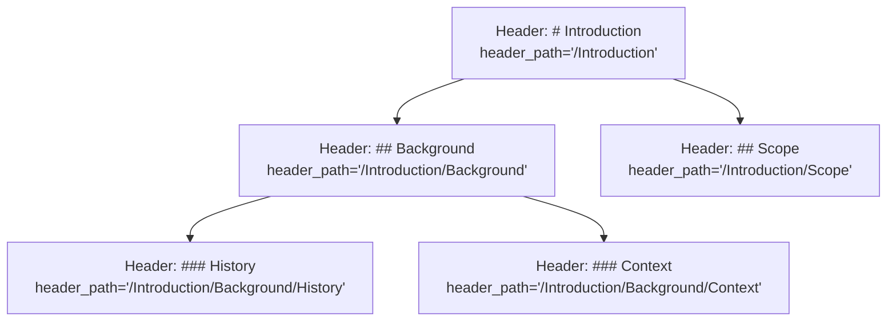

# HierarchicalChunkingResult

<cite>
**Referenced Files in This Document**   
- [hierarchy.py](file://src/chunkana/hierarchy.py)
- [chunker.py](file://src/chunkana/chunker.py)
- [types.py](file://src/chunkana/types.py)
- [header_processor.py](file://src/chunkana/header_processor.py)
</cite>

## Table of Contents
1. [Introduction](#introduction)
2. [Tree Structure and Parent-Child Relationships](#tree-structure-and-parent-child-relationships)
3. [Navigation Methods](#navigation-methods)
4. [Header Path Metadata](#header-path-metadata)
5. [Traversal Examples](#traversal-examples)
6. [Table of Contents Generation](#table-of-contents-generation)
7. [Context Maintenance During Retrieval](#context-maintenance-during-retrieval)
8. [Common Issues](#common-issues)
9. [Performance Considerations](#performance-considerations)
10. [UI Integration](#ui-integration)

## Introduction
The `HierarchicalChunkingResult` class provides a tree-based navigation system for chunked content, enabling hierarchical traversal of document sections. This data model is central to organizing and navigating chunked markdown content based on header hierarchy. The class implements O(1) navigation methods for efficient traversal between parent, child, and sibling chunks. The hierarchy is constructed post-chunking using the `header_path` metadata that exists in each chunk, allowing for bidirectional navigation while maintaining the flat structure of the original chunks.

**Section sources**
- [hierarchy.py](file://src/chunkana/hierarchy.py#L17-L35)

## Tree Structure and Parent-Child Relationships
The `HierarchicalChunkingResult` implements a tree structure where chunks are organized based on their document hierarchy as determined by markdown headers. Each chunk is connected to its parent and children through metadata references rather than structural nesting, maintaining the flat list of chunks while enabling tree-like navigation. The hierarchy is built using the `header_path` metadata from each chunk, which encodes the path from the document root to the chunk's position in the hierarchy. Parent-child relationships are established by analyzing these paths and creating bidirectional links between chunks. The root of the tree is either a special document-level chunk (when `include_document_summary=True`) or the first chunk in the document. This approach allows for efficient navigation while preserving the original chunking structure.

```mermaid
graph TD
A["Root Chunk\nheader_path='/'] --> B["Section 1\nheader_path='/Section 1'"]
A --> C["Section 2\nheader_path='/Section 2'"]
B --> D["Subsection 1.1\nheader_path='/Section 1/Subsection 1.1'"]
B --> E["Subsection 1.2\nheader_path='/Section 1/Subsection 1.2'"]
C --> F["Subsection 2.1\nheader_path='/Section 2/Subsection 2.1'"]
D --> G["Paragraph\nheader_path='/Section 1/Subsection 1.1/Paragraph'"]
```

**Diagram sources**
- [hierarchy.py](file://src/chunkana/hierarchy.py#L374-L421)
- [types.py](file://src/chunkana/types.py#L260-L264)

## Navigation Methods
The `HierarchicalChunkingResult` class provides several navigation methods for traversing the document hierarchy. These methods enable efficient access to related chunks based on their position in the tree structure. The navigation is implemented with O(1) lookup performance through an internal index that maps chunk IDs to chunk objects. This allows for rapid traversal operations regardless of document size or hierarchy depth.

### get_chunk
The `get_chunk` method retrieves a specific chunk by its unique identifier with O(1) lookup time. This method uses an internal index that is built during initialization, allowing for direct access to any chunk in the hierarchy without searching through the entire list of chunks.

**Section sources**
- [hierarchy.py](file://src/chunkana/hierarchy.py#L44-L54)

### get_children
The `get_children` method returns all direct child chunks of a given parent chunk. It retrieves the list of child chunk IDs from the parent's metadata and then looks up each child chunk using the internal index. This method returns an empty list if the chunk has no children or if the specified chunk ID is not found.

**Section sources**
- [hierarchy.py](file://src/chunkana/hierarchy.py#L56-L72)

### get_parent
The `get_parent` method returns the immediate parent chunk of a given child chunk. It retrieves the parent chunk ID from the child's metadata and then looks up the parent chunk using the internal index. This method returns `None` if the chunk is the root of the hierarchy or if the specified chunk ID is not found.

**Section sources**
- [hierarchy.py](file://src/chunkana/hierarchy.py#L73-L89)

### get_ancestors
The `get_ancestors` method returns all ancestor chunks from the immediate parent up to the root of the hierarchy. It traverses upward through the parent chain, collecting each parent chunk until reaching the root (a chunk with no parent). The ancestors are returned in order from immediate parent to root, providing the complete lineage of the chunk within the document hierarchy.

**Section sources**
- [hierarchy.py](file://src/chunkana/hierarchy.py#L90-L113)

### get_flat_chunks
The `get_flat_chunks` method returns a list of chunks suitable for flat retrieval, maintaining backward compatibility with non-hierarchical systems. It includes leaf chunks (those without children) and non-leaf chunks that have significant content of their own. This ensures that no content is lost when using flat retrieval mode, as parent chunks with introductory content are included alongside their children.

**Section sources**
- [hierarchy.py](file://src/chunkana/hierarchy.py#L137-L164)

## Header Path Metadata
The `header_path` metadata is fundamental to building and navigating the hierarchical structure. It is a string representation of the path from the document root to a chunk's position in the hierarchy, with each segment corresponding to a header level. The path format is "/Level1/Level2/Level3" where each segment represents a header text in the hierarchy. Special values include "/__preamble__" for preamble chunks and "/" for the root document chunk. The header path is constructed during the initial chunking process by analyzing the sequence of headers preceding each chunk and building a hierarchical path that reflects the document's structure. This metadata is used by the `HierarchyBuilder` to establish parent-child relationships by matching path segments.



**Diagram sources**
- [hierarchy.py](file://src/chunkana/hierarchy.py#L382-L415)
- [types.py](file://src/chunkana/types.py#L260-L264)

## Traversal Examples
The hierarchical navigation system enables various traversal patterns for accessing document content. These examples demonstrate common use cases for navigating the document structure.

### Depth-First Traversal
A depth-first traversal can be implemented by recursively visiting each chunk and its children. Starting from the root, this approach processes all descendants of a section before moving to its siblings. This is useful for operations that need to process content in document order while maintaining hierarchical context.

### Breadth-First Traversal
A breadth-first traversal processes chunks level by level, starting from the root and moving outward. This approach is useful for generating summaries or table of contents, as it naturally groups content by hierarchy level.

### Path-Based Navigation
Path-based navigation allows direct access to specific sections using their header path. This enables jumping to deeply nested sections without traversing the entire hierarchy, which is particularly useful for implementing document bookmarks or deep linking.

**Section sources**
- [hierarchy.py](file://src/chunkana/hierarchy.py#L90-L113)
- [hierarchy.py](file://src/chunkana/hierarchy.py#L56-L72)

## Table of Contents Generation
The hierarchical structure enables automatic generation of table of contents that reflects the document's organization. By traversing the hierarchy and collecting header paths, a complete outline of the document can be created. The `get_by_level` method facilitates this by allowing retrieval of all chunks at a specific hierarchy level, making it easy to build a multi-level table of contents. The header path metadata provides the textual content for each entry, while the parent-child relationships define the nesting structure. This approach ensures that the table of contents accurately reflects the document's logical organization, even when chunks have been split across hierarchy boundaries.

**Section sources**
- [hierarchy.py](file://src/chunkana/hierarchy.py#L188-L201)

## Context Maintenance During Retrieval
The hierarchical navigation system supports context maintenance during content retrieval by allowing access to ancestral and sibling chunks. When retrieving a specific chunk, the system can automatically include context from parent sections or related sibling sections. The `get_ancestors` method provides access to all higher-level sections that provide context for the current chunk, while the `get_siblings` method allows access to peer sections at the same hierarchy level. This contextual awareness is crucial for applications like question answering, where understanding the broader document context is essential for accurate responses.

**Section sources**
- [hierarchy.py](file://src/chunkana/hierarchy.py#L90-L113)
- [hierarchy.py](file://src/chunkana/hierarchy.py#L115-L136)

## Common Issues
Several common issues can arise when working with hierarchical chunking, particularly related to malformed headers and edge cases in document structure.

### Broken Hierarchies from Malformed Headers
Malformed headers, such as headers with inconsistent spacing or special characters, can disrupt the hierarchy construction. The system handles this by normalizing header text and using robust parsing, but extreme cases may still result in broken hierarchies. The validation system detects these issues and can either raise exceptions or attempt to repair the hierarchy based on configuration.

### Dangling Headers
Dangling headers occur when a header is separated from its content by a chunk boundary. The `HeaderProcessor` detects and fixes these cases by moving headers to the appropriate chunk, then updating the header path metadata to maintain hierarchy integrity.

### Empty or Invalid Paths
Empty or invalid header paths can occur with documents that lack proper headers or have unconventional structure. The system handles this by treating such chunks as direct children of the root or by creating a synthetic hierarchy based on document order.

**Section sources**
- [header_processor.py](file://src/chunkana/header_processor.py#L29-L150)
- [hierarchy.py](file://src/chunkana/hierarchy.py#L812-L880)

## Performance Considerations
The hierarchical chunking system is designed with performance in mind, particularly for deep trees and large documents.

### O(1) Navigation
All navigation methods operate in O(1) time complexity through the use of an internal index that maps chunk IDs to chunk objects. This ensures consistent performance regardless of document size or hierarchy depth.

### Memory Efficiency
The hierarchy is implemented as metadata on flat chunks rather than as a nested data structure, minimizing memory overhead. The parent-child relationships are stored as ID references rather than object references, preventing circular dependencies and reducing memory usage.

### Deep Tree Performance
For documents with deep hierarchies, the system maintains performance by using efficient data structures and algorithms. The BFS traversal used for level assignment and the indexed lookups for navigation ensure that operations scale well with hierarchy depth.

**Section sources**
- [hierarchy.py](file://src/chunkana/hierarchy.py#L37-L43)
- [hierarchy.py](file://src/chunkana/hierarchy.py#L473-L495)

## UI Integration
The hierarchical structure integrates with UI components that visualize document structure, such as tree views and interactive outlines. The navigation methods provide the foundation for these visualizations by enabling efficient traversal and access to hierarchical relationships. The `to_tree_dict` method converts the hierarchy to a nested dictionary format suitable for serialization and transmission to frontend components. This allows UIs to render the document structure as an interactive tree, enabling users to expand and collapse sections, navigate by clicking on outline entries, and visualize the document's organization. The O(1) navigation performance ensures that these interactions remain responsive even for large documents with complex hierarchies.

**Section sources**
- [hierarchy.py](file://src/chunkana/hierarchy.py#L202-L230)
- [chunker.py](file://src/chunkana/chunker.py#L217-L247)