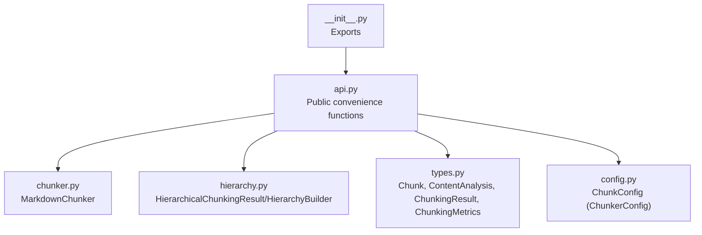
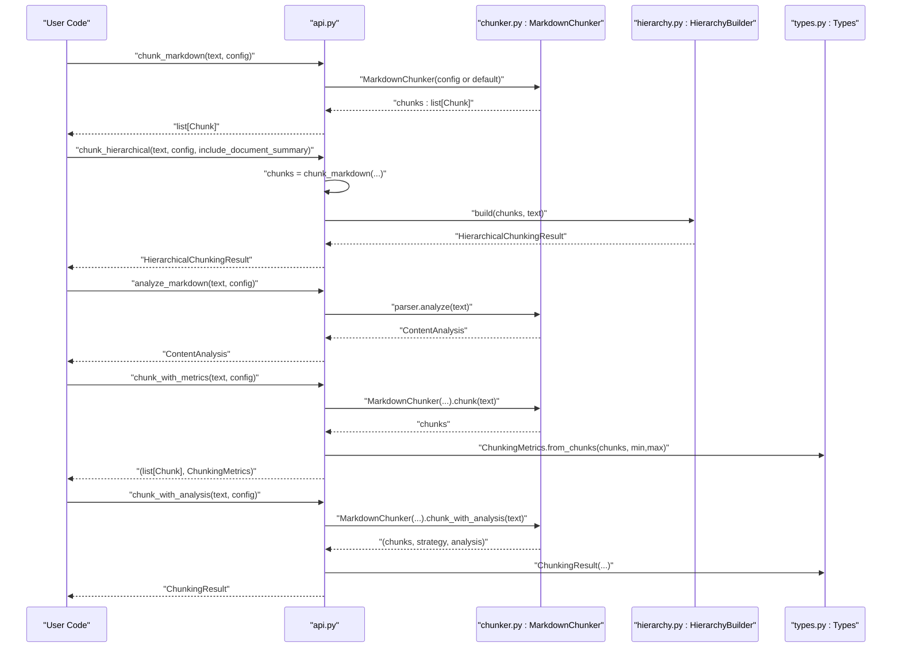
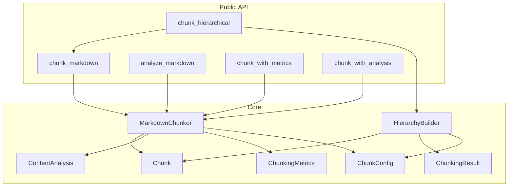

# Main Functions

<cite>
**Referenced Files in This Document**
- [api.py](file://src/chunkana/api.py)
- [chunker.py](file://src/chunkana/chunker.py)
- [types.py](file://src/chunkana/types.py)
- [hierarchy.py](file://src/chunkana/hierarchy.py)
- [config.py](file://src/chunkana/config.py)
- [__init__.py](file://src/chunkana/__init__.py)
- [test_hierarchy.py](file://tests/unit/test_hierarchy.py)
- [test_api_wrappers.py](file://tests/property/test_api_wrappers.py)
</cite>

## Table of Contents
1. [Introduction](#introduction)
2. [Project Structure](#project-structure)
3. [Core Components](#core-components)
4. [Architecture Overview](#architecture-overview)
5. [Detailed Component Analysis](#detailed-component-analysis)
6. [Dependency Analysis](#dependency-analysis)
7. [Performance Considerations](#performance-considerations)
8. [Troubleshooting Guide](#troubleshooting-guide)
9. [Conclusion](#conclusion)

## Introduction
This document provides comprehensive API documentation for the main convenience functions in Chunkana’s public API. It covers:
- chunk_markdown: Basic chunking of Markdown text into semantic segments.
- chunk_hierarchical: Hierarchical chunking with navigation methods and optional document summary.
- analyze_markdown: Content analysis without chunking, returning ContentAnalysis metrics.
- chunk_with_metrics: Chunking plus quality metrics computation.
- chunk_with_analysis: Chunking plus structured result with strategy and analysis metadata.

For each function, we document parameters, return types, constraints, error conditions, and practical usage patterns. Cross-references to configuration options and strategies are included to help tune behavior.

## Project Structure
The main API functions live in the public API module and delegate to the core chunker and hierarchy builder. Types and configuration define the data contracts and behavior knobs.

**Diagram sources**
- [api.py](file://src/chunkana/api.py#L1-L305)
- [chunker.py](file://src/chunkana/chunker.py#L1-L200)
- [hierarchy.py](file://src/chunkana/hierarchy.py#L1-L120)
- [types.py](file://src/chunkana/types.py#L180-L478)
- [config.py](file://src/chunkana/config.py#L17-L126)
- [__init__.py](file://src/chunkana/__init__.py#L24-L71)

**Section sources**
- [api.py](file://src/chunkana/api.py#L1-L305)
- [__init__.py](file://src/chunkana/__init__.py#L24-L71)

## Core Components
- chunk_markdown: Primary convenience function for basic chunking. Returns a list of Chunk objects.
- chunk_hierarchical: Produces hierarchical results with navigation methods and optional root document summary.
- analyze_markdown: Returns ContentAnalysis with document metrics and extracted elements.
- chunk_with_metrics: Returns a tuple of (chunks, metrics) with statistics computed from chunk sizes.
- chunk_with_analysis: Returns ChunkingResult with chunks and metadata such as strategy_used and totals.

Key return types and their responsibilities:
- Chunk: Represents a chunk with content, positional metadata, and rich metadata fields.
- ContentAnalysis: Metrics and extracted elements for strategy selection and analysis.
- ChunkingResult: Structured result with chunks and metadata.
- ChunkingMetrics: Quality metrics computed from chunk sizes.
- HierarchicalChunkingResult: Hierarchical structure with navigation methods.

**Section sources**
- [api.py](file://src/chunkana/api.py#L18-L305)
- [types.py](file://src/chunkana/types.py#L180-L478)
- [hierarchy.py](file://src/chunkana/hierarchy.py#L16-L120)

## Architecture Overview
The public API functions are thin wrappers around the core chunker and hierarchy builder. They accept optional configuration and return strongly typed results.

**Diagram sources**
- [api.py](file://src/chunkana/api.py#L18-L305)
- [chunker.py](file://src/chunkana/chunker.py#L85-L216)
- [hierarchy.py](file://src/chunkana/hierarchy.py#L233-L308)
- [types.py](file://src/chunkana/types.py#L378-L478)

## Detailed Component Analysis

### chunk_markdown
Purpose:
- Chunk Markdown text into semantic segments using the configured strategy.
- Always returns a list of Chunk objects.

Parameters:
- text: str
- config: ChunkerConfig | None (optional; defaults to ChunkerConfig.default())

Return type:
- list[Chunk]

Behavior and constraints:
- If text is empty or whitespace-only, returns an empty list.
- Uses MarkdownChunker with the provided or default configuration.
- Applies preprocessing (e.g., stripping Obsidian block IDs if enabled), parsing, strategy selection, merging small chunks, overlap application, metadata enrichment, and validation.

Common usage patterns:
- Basic chunking of a Markdown string.
- Tuning chunk sizes and overlap via ChunkerConfig.

Cross-references:
- Configuration options affecting behavior: max_chunk_size, min_chunk_size, overlap_size, preserve_atomic_blocks, extract_preamble, strategy_override, enable_code_context_binding, use_adaptive_sizing, include_document_summary, strip_obsidian_block_ids, preserve_latex_blocks, latex_display_only, latex_max_context_chars, group_related_tables, table_grouping_config, overlap_cap_ratio.

Error conditions:
- Empty or whitespace-only input yields empty list.
- Configuration validation errors are raised during ChunkerConfig initialization if invalid values are provided.

Practical examples:
- See usage in tests and property checks for typical patterns.

**Section sources**
- [api.py](file://src/chunkana/api.py#L18-L41)
- [chunker.py](file://src/chunkana/chunker.py#L85-L176)
- [config.py](file://src/chunkana/config.py#L17-L126)

### chunk_hierarchical
Purpose:
- Chunk Markdown text and return a hierarchical result with navigation methods.
- Supports optional inclusion of a root document summary chunk.

Parameters:
- text: str
- config: ChunkerConfig | None (optional; defaults to ChunkerConfig.default())
- include_document_summary: bool (default: True)

Return type:
- HierarchicalChunkingResult

Navigation methods (on HierarchicalChunkingResult):
- get_chunk(id): Retrieve a chunk by ID.
- get_children(id): Get child chunks.
- get_parent(id): Get parent chunk.
- get_ancestors(id): Get path to root.
- get_siblings(id): Get siblings including self.
- get_flat_chunks(): Get leaf chunks or significant non-leaf chunks for flat retrieval.
- get_by_level(level): Get chunks at a specific hierarchy level.
- to_tree_dict(): Serialize tree structure safely.

Behavior and constraints:
- Internally calls chunk_markdown to produce flat chunks, then builds parent-child-sibling relationships using header_path metadata.
- Optionally creates a root document chunk with a generated summary and title.
- Validates tree invariants when enabled; raises exceptions in strict mode.

Cross-references:
- Configuration options: include_document_summary, validate_invariants, strict_mode.
- Related types: Chunk, HierarchicalChunkingResult, HierarchyBuilder.

Practical examples:
- Building a navigable tree from a Markdown document.
- Retrieving ancestors or siblings for contextual retrieval.

**Section sources**
- [api.py](file://src/chunkana/api.py#L273-L305)
- [hierarchy.py](file://src/chunkana/hierarchy.py#L16-L120)
- [hierarchy.py](file://src/chunkana/hierarchy.py#L233-L308)
- [test_hierarchy.py](file://tests/unit/test_hierarchy.py#L64-L94)
- [test_api_wrappers.py](file://tests/property/test_api_wrappers.py#L243-L270)

### analyze_markdown
Purpose:
- Analyze Markdown content without producing chunks.
- Return ContentAnalysis with metrics and extracted elements.

Parameters:
- text: str
- config: ChunkerConfig | None (optional)

Return type:
- ContentAnalysis

Fields of ContentAnalysis:
- total_chars, total_lines
- code_ratio
- code_block_count, header_count, max_header_depth, table_count, list_count, list_item_count
- code_blocks, headers, tables, list_blocks, latex_blocks
- has_preamble, preamble_end_line
- list_ratio, max_list_depth, has_checkbox_lists
- avg_sentence_length, latex_block_count, latex_ratio
- get_lines(): Optional cached line array for downstream strategies.

Behavior and constraints:
- Delegates to the parser to compute analysis.
- Useful for strategy selection and understanding content characteristics.

Practical examples:
- Inspecting code density and header distribution to select a strategy.
- Using metrics to decide whether to enable adaptive sizing.

**Section sources**
- [api.py](file://src/chunkana/api.py#L43-L68)
- [types.py](file://src/chunkana/types.py#L182-L239)

### chunk_with_metrics
Purpose:
- Chunk Markdown text and compute quality metrics.

Parameters:
- text: str
- config: ChunkerConfig | None (optional)

Return type:
- tuple[list[Chunk], ChunkingMetrics]

Metrics computed:
- total_chunks
- avg_chunk_size
- std_dev_size
- min_size, max_size
- undersize_count (chunks < min_chunk_size)
- oversize_count (chunks > max_chunk_size)

Behavior and constraints:
- Uses MarkdownChunker.chunk to produce chunks, then computes metrics from chunk sizes and configured min/max thresholds.

Practical examples:
- Monitoring chunk size distribution and tuning min/max_chunk_size.
- Identifying undersized or oversized chunks for refinement.

**Section sources**
- [api.py](file://src/chunkana/api.py#L106-L136)
- [types.py](file://src/chunkana/types.py#L378-L431)
- [chunker.py](file://src/chunkana/chunker.py#L178-L189)

### chunk_with_analysis
Purpose:
- Chunk Markdown text and return a structured result with strategy and analysis metadata.

Parameters:
- text: str
- config: ChunkerConfig | None (optional)

Return type:
- ChunkingResult

Fields of ChunkingResult:
- chunks: list[Chunk]
- strategy_used: str
- processing_time: float (default 0.0)
- total_chars: int (from analysis)
- total_lines: int (from analysis)

Behavior and constraints:
- Uses MarkdownChunker.chunk_with_analysis to obtain chunks, strategy, and analysis.
- Constructs ChunkingResult with strategy_used and totals from analysis.

Practical examples:
- Tracking which strategy was selected and overall document totals.
- Integrating with downstream systems requiring structured metadata.

**Section sources**
- [api.py](file://src/chunkana/api.py#L70-L104)
- [chunker.py](file://src/chunkana/chunker.py#L191-L216)
- [types.py](file://src/chunkana/types.py#L432-L478)

## Dependency Analysis
The public API functions depend on core types and configuration, and delegate to the chunker and hierarchy builder.

**Diagram sources**
- [api.py](file://src/chunkana/api.py#L18-L305)
- [chunker.py](file://src/chunkana/chunker.py#L1-L200)
- [hierarchy.py](file://src/chunkana/hierarchy.py#L233-L308)
- [types.py](file://src/chunkana/types.py#L180-L478)
- [config.py](file://src/chunkana/config.py#L17-L126)

**Section sources**
- [api.py](file://src/chunkana/api.py#L18-L305)
- [chunker.py](file://src/chunkana/chunker.py#L1-L200)
- [hierarchy.py](file://src/chunkana/hierarchy.py#L233-L308)
- [types.py](file://src/chunkana/types.py#L180-L478)
- [config.py](file://src/chunkana/config.py#L17-L126)

## Performance Considerations
- chunk_with_metrics and chunk_with_analysis compute metrics from chunk sizes; overhead is linear in the number of chunks.
- chunk_hierarchical adds O(n) traversal to build parent-child-sibling relationships and assign hierarchy levels.
- Configuration parameters such as overlap_size and overlap_cap_ratio influence memory and processing characteristics.
- For large files, consider streaming chunking via the underlying chunker’s streaming methods.

[No sources needed since this section provides general guidance]

## Troubleshooting Guide
Common issues and resolutions:
- Empty or whitespace-only input to chunk_markdown returns an empty list; ensure the input contains Markdown content.
- Invalid Chunk metadata (e.g., start_line < 1, end_line < start_line, or empty content) raises ValueError during chunk creation/validation.
- Misconfigured overlap_size (>= max_chunk_size) triggers validation errors; adjust overlap_size accordingly.
- Hierarchical navigation failures (e.g., missing parent_id) indicate tree invariants violation; enable validation and strict mode to surface issues.

Related validations and tests:
- Chunk validation invariants and serialization tests.
- Hierarchical navigation correctness and root existence tests.
- Property tests for hierarchical navigation and root presence.

**Section sources**
- [types.py](file://src/chunkana/types.py#L297-L317)
- [config.py](file://src/chunkana/config.py#L138-L158)
- [test_chunk.py](file://tests/unit/test_chunk.py#L13-L53)
- [test_hierarchy.py](file://tests/unit/test_hierarchy.py#L64-L94)
- [test_api_wrappers.py](file://tests/property/test_api_wrappers.py#L243-L270)

## Conclusion
The main convenience functions in Chunkana provide a clean, strongly typed interface for Markdown chunking:
- Use chunk_markdown for straightforward chunking.
- Use chunk_hierarchical when you need a navigable tree with parent-child relationships.
- Use analyze_markdown to understand content characteristics without chunking.
- Use chunk_with_metrics and chunk_with_analysis to obtain quality metrics and structured results for monitoring and integration.

Tune behavior via ChunkerConfig to balance chunk sizes, overlap, strategy selection, and advanced features like adaptive sizing and code-context binding.