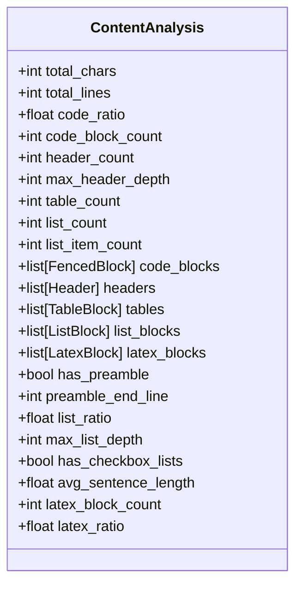
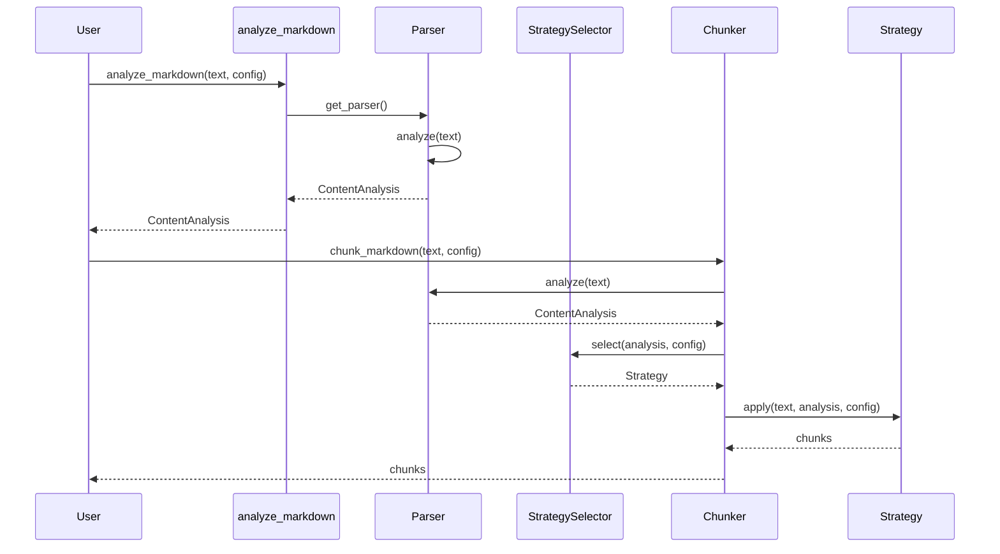
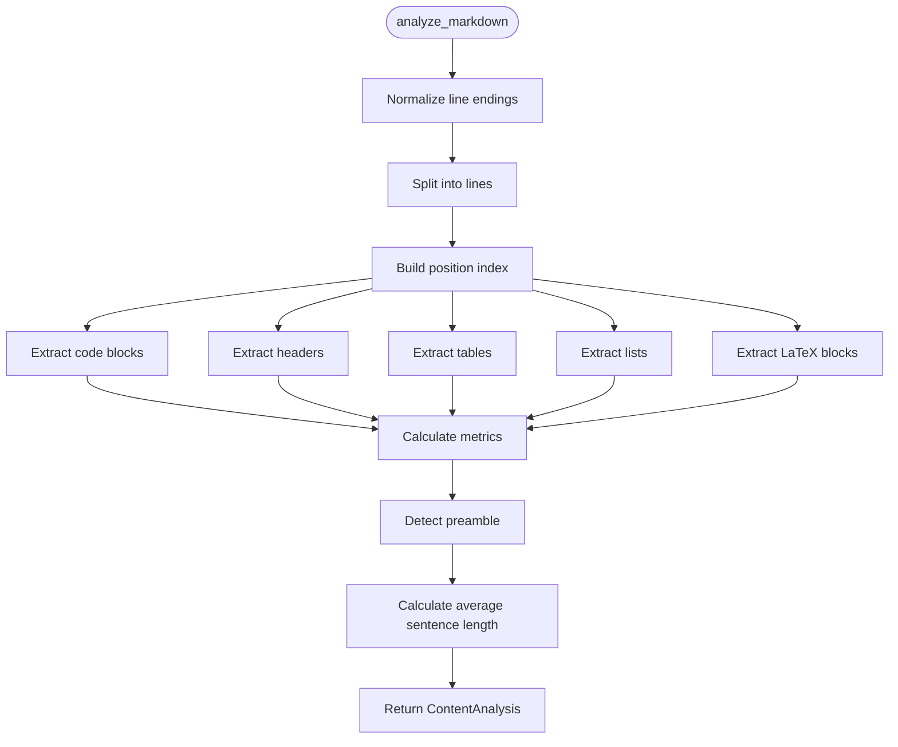

# analyze_markdown

<cite>
**Referenced Files in This Document**   
- [api.py](file://src/chunkana/api.py#L43-L67)
- [parser.py](file://src/chunkana/parser.py#L44-L121)
- [types.py](file://src/chunkana/types.py#L182-L223)
- [chunker.py](file://src/chunkana/chunker.py#L112)
- [strategies/__init__.py](file://src/chunkana/strategies/__init__.py#L55-L57)
</cite>

## Table of Contents
1. [Introduction](#introduction)
2. [Function Parameters](#function-parameters)
3. [Return Value](#return-value)
4. [Content Analysis Metrics](#content-analysis-metrics)
5. [Strategy Selection and Chunking Behavior](#strategy-selection-and-chunking-behavior)
6. [Practical Examples](#practical-examples)
7. [Internal Implementation](#internal-implementation)
8. [Common Issues](#common-issues)
9. [Performance Considerations](#performance-considerations)
10. [Use Cases](#use-cases)

## Introduction
The `analyze_markdown()` function is a core utility in the Chunkana library that performs comprehensive content analysis on Markdown documents without chunking them. This function provides detailed metrics about the document's structure and content composition, which are essential for making informed decisions about chunking strategies and configuration settings. The analysis helps determine the optimal approach for processing different types of Markdown content, from code-heavy technical documentation to structured articles with hierarchical headers.

**Section sources**
- [api.py](file://src/chunkana/api.py#L43-L67)

## Function Parameters
The `analyze_markdown()` function accepts two parameters:

- **text**: A string containing the Markdown input to be analyzed. This is the primary input that will be parsed and analyzed for various content characteristics.
- **config**: An optional `ChunkerConfig` object that provides configuration settings for the analysis. While this parameter is optional, it can influence certain aspects of the analysis, particularly when strategy selection thresholds are customized.

The function is designed to be simple to use, requiring only the Markdown text as input for basic analysis, while allowing for configuration customization when needed.

**Section sources**
- [api.py](file://src/chunkana/api.py#L43-L67)

## Return Value
The function returns a `ContentAnalysis` object containing comprehensive metrics about the analyzed Markdown document. This object provides quantitative data about the document's composition, including ratios of different content types, counts of structural elements, and other analytical data that informs subsequent processing decisions.

**Section sources**
- [api.py](file://src/chunkana/api.py#L43-L67)
- [types.py](file://src/chunkana/types.py#L182-L223)

## Content Analysis Metrics
The `ContentAnalysis` object returned by `analyze_markdown()` contains several key metrics that characterize the document:

- **code_ratio**: The ratio of code characters to total characters in the document, indicating how code-heavy the content is.
- **total_chars**: The total number of characters in the document.
- **total_lines**: The total number of lines in the document.
- **header_count**: The number of headers (lines starting with #) in the document.
- **table_count**: The number of tables (identified by | characters and separator rows) in the document.
- **list_blocks**: Information about list blocks, including count and item details.
- **atomic_element_distribution**: Data about atomic elements like code blocks, tables, and LaTeX formulas, including their count, size, and distribution.

These metrics provide a comprehensive profile of the document's structure and content composition, enabling intelligent processing decisions.



**Diagram sources**
- [types.py](file://src/chunkana/types.py#L182-L223)

**Section sources**
- [types.py](file://src/chunkana/types.py#L182-L223)

## Strategy Selection and Chunking Behavior
The metrics from `analyze_markdown()` directly inform strategy selection in the chunking pipeline. The Chunkana library uses a priority-based strategy selection system that evaluates the content analysis to determine the most appropriate chunking approach:

1. **CodeAwareStrategy**: Selected for documents with significant code content (code_ratio above threshold) or tables.
2. **ListAwareStrategy**: Chosen for list-heavy documents based on list_count and list_ratio thresholds.
3. **StructuralStrategy**: Applied to documents with hierarchical structure indicated by header_count.
4. **FallbackStrategy**: Used as a default for plain text documents without distinctive features.

The strategy selection process uses the configuration's thresholds (code_threshold, structure_threshold, list_ratio_threshold, list_count_threshold) to make these decisions, ensuring that the chunking approach is optimized for the document's specific characteristics.



**Diagram sources**
- [api.py](file://src/chunkana/api.py#L43-L67)
- [parser.py](file://src/chunkana/parser.py#L44-L121)
- [strategies/__init__.py](file://src/chunkana/strategies/__init__.py#L55-L57)

**Section sources**
- [strategies/__init__.py](file://src/chunkana/strategies/__init__.py#L55-L57)
- [chunker.py](file://src/chunkana/chunker.py#L112)

## Practical Examples
The analysis results can be used to pre-determine optimal configuration settings or detect document characteristics before chunking:

```python
from chunkana import analyze_markdown, chunk_markdown, ChunkerConfig

# Analyze document to determine characteristics
analysis = analyze_markdown(large_markdown_document)

# Use analysis to select appropriate configuration
if analysis.code_ratio > 0.4:
    # Code-heavy document - use larger chunks
    config = ChunkerConfig.for_code_heavy()
elif analysis.header_count > 10:
    # Highly structured document - optimize for structure
    config = ChunkerConfig.for_structured()
else:
    # Default configuration
    config = ChunkerConfig.default()

# Process document with optimal configuration
chunks = chunk_markdown(large_markdown_document, config)
```

This approach allows for adaptive processing based on document characteristics, ensuring optimal chunking behavior for different content types.

**Section sources**
- [config.py](file://src/chunkana/config.py#L315-L332)
- [api.py](file://src/chunkana/api.py#L43-L67)

## Internal Implementation
The `analyze_markdown()` function is implemented in the `api.py` module and serves as a wrapper around the parser module's `analyze()` method. The implementation follows a systematic process:

1. **Line Ending Normalization**: All line endings are converted to Unix-style (\n) for consistent processing.
2. **Single Split Operation**: The text is split into lines once, with the resulting array reused throughout the analysis pipeline.
3. **Element Extraction**: Code blocks, headers, tables, lists, and LaTeX formulas are extracted using the shared line array.
4. **Metric Calculation**: Content ratios, element counts, and other metrics are calculated based on the extracted elements.
5. **Preamble Detection**: The presence of content before the first header is detected.
6. **Sentence Analysis**: Average sentence length is calculated to assess text complexity.

The parser uses pre-compiled regular expressions and optimization techniques like position indexing to ensure efficient processing, even for large documents.



**Diagram sources**
- [parser.py](file://src/chunkana/parser.py#L44-L121)

**Section sources**
- [parser.py](file://src/chunkana/parser.py#L44-L121)
- [api.py](file://src/chunkana/api.py#L64-L67)

## Common Issues
While `analyze_markdown()` is robust, certain issues can affect the accuracy of metrics:

- **Malformed Markdown**: Documents with improperly formatted elements (unclosed code blocks, invalid table syntax) may produce inaccurate metrics.
- **Nested Structures**: Complex nesting of code blocks, lists, or tables can sometimes lead to edge cases in element detection.
- **Mixed Content Types**: Documents with multiple dominant content types may not clearly fit into a single strategy category.
- **Large Documents**: Very large documents may experience performance issues, though the parser is optimized for efficiency.

These issues are generally handled gracefully, with the analysis providing best-effort metrics even for imperfectly formatted Markdown.

**Section sources**
- [parser.py](file://src/chunkana/parser.py#L247-L292)
- [parser.py](file://src/chunkana/parser.py#L590-L654)

## Performance Considerations
The `analyze_markdown()` function is designed with performance in mind, particularly for large inputs:

- **Single Pass Processing**: The analysis is performed in a single pass through the document, minimizing processing time.
- **Optimized Regular Expressions**: Pre-compiled patterns are used for critical operations like fence detection and list parsing.
- **Line Array Reuse**: The split line array is reused across all extraction operations, avoiding redundant string operations.
- **Position Indexing**: A cumulative position index enables O(1) position lookups instead of O(n×m) calculations.
- **Early Termination**: Pattern matching uses early termination to minimize unnecessary processing.

For extremely large documents, the analysis time scales linearly with document size, making it suitable for processing even very large Markdown files efficiently.

**Section sources**
- [parser.py](file://src/chunkana/parser.py#L143-L166)
- [parser.py](file://src/chunkana/parser.py#L37-L42)

## Use Cases
The `analyze_markdown()` function has several valuable use cases:

- **Document Profiling**: Understanding the composition of Markdown documents before processing.
- **Preprocessing Decision-Making**: Determining optimal chunking strategies and configuration settings based on document characteristics.
- **Quality Assurance**: Verifying document structure and content composition before further processing.
- **Content Classification**: Categorizing documents based on their structural characteristics for specialized processing pipelines.
- **Performance Optimization**: Adapting processing parameters based on document complexity to optimize resource usage.

These use cases demonstrate how content analysis enables intelligent, adaptive processing of Markdown documents, improving the effectiveness of downstream applications like RAG systems.

**Section sources**
- [api.py](file://src/chunkana/api.py#L43-L67)
- [chunker.py](file://src/chunkana/chunker.py#L112)