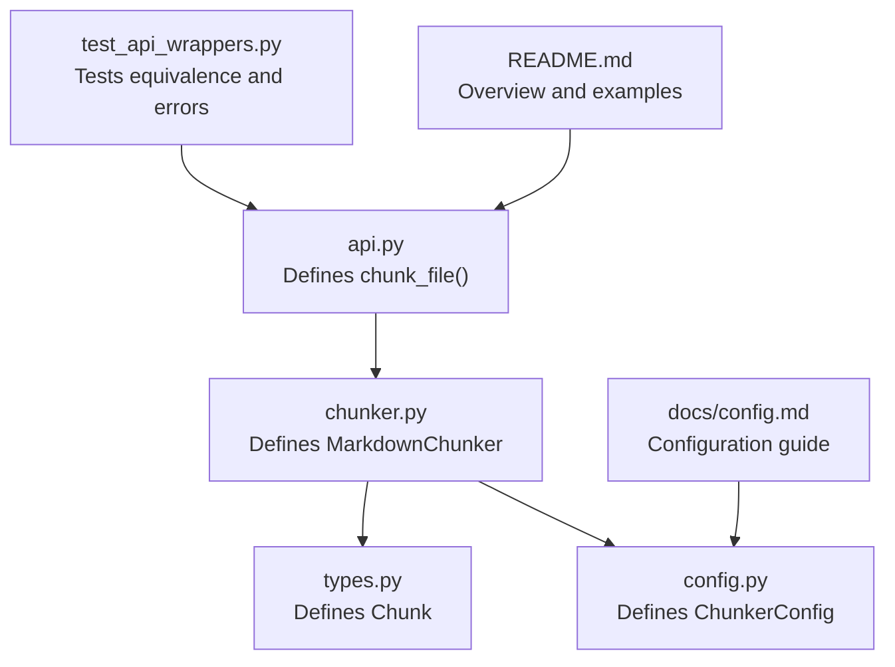
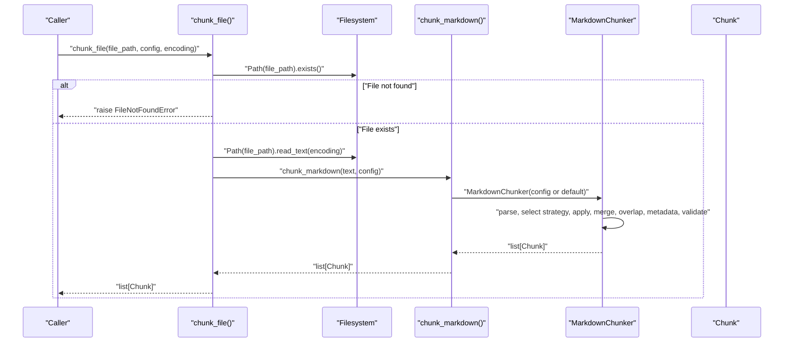
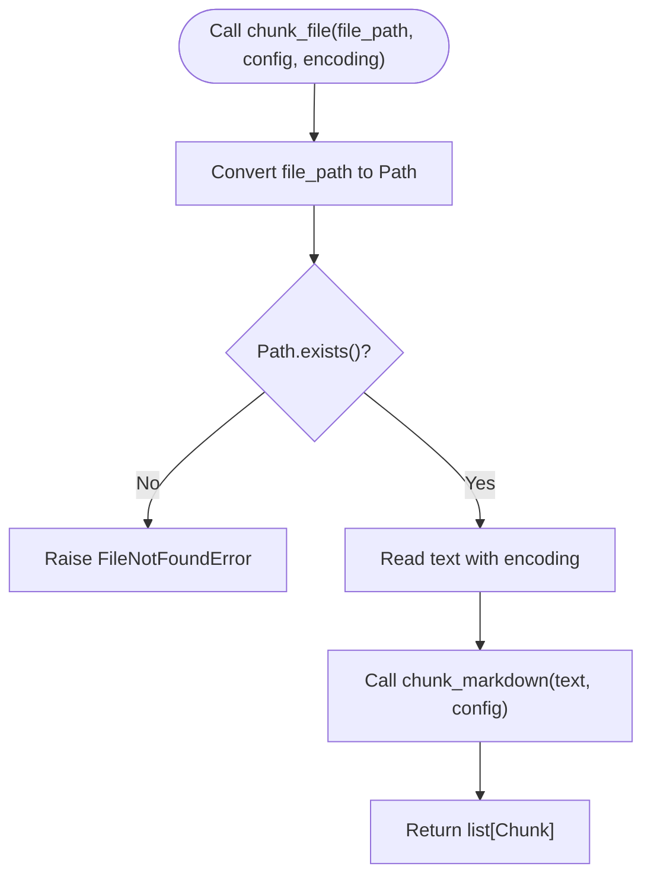
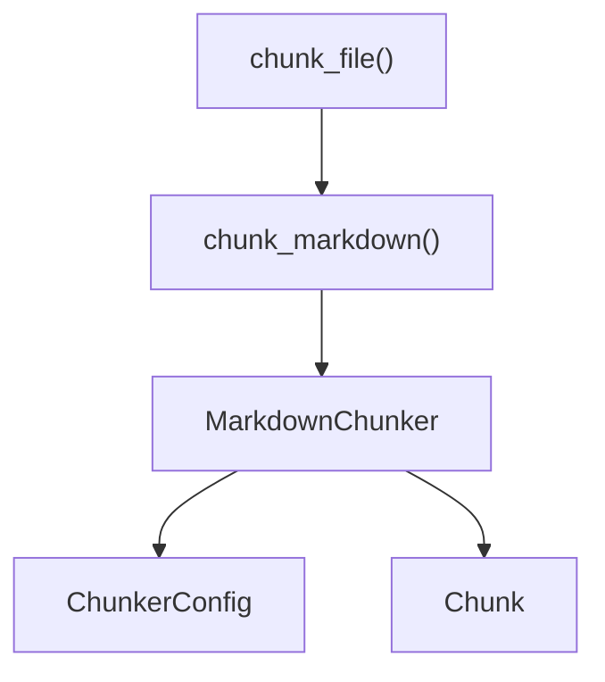

# chunk_file

<cite>
**Referenced Files in This Document**
- [api.py](file://src/chunkana/api.py)
- [chunker.py](file://src/chunkana/chunker.py)
- [types.py](file://src/chunkana/types.py)
- [config.py](file://src/chunkana/config.py)
- [test_api_wrappers.py](file://tests/property/test_api_wrappers.py)
- [README.md](file://README.md)
- [docs/config.md](file://docs/config.md)
</cite>

## Table of Contents
1. [Introduction](#introduction)
2. [Project Structure](#project-structure)
3. [Core Components](#core-components)
4. [Architecture Overview](#architecture-overview)
5. [Detailed Component Analysis](#detailed-component-analysis)
6. [Dependency Analysis](#dependency-analysis)
7. [Performance Considerations](#performance-considerations)
8. [Troubleshooting Guide](#troubleshooting-guide)
9. [Conclusion](#conclusion)
10. [Appendices](#appendices)

## Introduction
This document provides comprehensive API documentation for the chunk_file() function that reads and chunks Markdown files directly. It explains the function’s parameters, behavior, error conditions, and internal workflow, and cross-references chunk_markdown() for chunking behavior and configuration options. It also includes usage examples, best practices, and guidance for handling common issues such as file permissions, large files, and encoding mismatches.

## Project Structure
The chunk_file() function is part of the public API and delegates to chunk_markdown() after performing file I/O. The core chunking logic resides in the MarkdownChunker class.

**Diagram sources**
- [api.py](file://src/chunkana/api.py#L193-L226)
- [chunker.py](file://src/chunkana/chunker.py#L85-L177)
- [types.py](file://src/chunkana/types.py#L241-L376)
- [config.py](file://src/chunkana/config.py#L17-L126)
- [test_api_wrappers.py](file://tests/property/test_api_wrappers.py#L89-L127)
- [README.md](file://README.md#L1-L179)
- [docs/config.md](file://docs/config.md#L1-L172)

**Section sources**
- [api.py](file://src/chunkana/api.py#L193-L226)
- [chunker.py](file://src/chunkana/chunker.py#L85-L177)
- [types.py](file://src/chunkana/types.py#L241-L376)
- [config.py](file://src/chunkana/config.py#L17-L126)
- [test_api_wrappers.py](file://tests/property/test_api_wrappers.py#L89-L127)
- [README.md](file://README.md#L1-L179)
- [docs/config.md](file://docs/config.md#L1-L172)

## Core Components
- chunk_file(file_path, config=None, encoding="utf-8") -> list[Chunk]: Reads a Markdown file and returns a list of Chunk objects by delegating to chunk_markdown().
- chunk_markdown(text, config=None) -> list[Chunk]: Core chunking entry point that constructs a MarkdownChunker and applies strategies to produce chunks.
- MarkdownChunker: Orchestrates parsing, strategy selection, merging, overlap, metadata enrichment, and validation.
- Chunk: Data structure representing a chunk with content, line ranges, and metadata.
- ChunkerConfig (alias ChunkConfig): Configuration controlling chunk size bounds, strategy thresholds, overlap behavior, and other chunking options.

Key behaviors:
- File I/O: Validates file existence and reads text with the specified encoding.
- Delegation: Converts the loaded text into chunks via chunk_markdown().
- Return type: Always returns a list of Chunk objects.

**Section sources**
- [api.py](file://src/chunkana/api.py#L193-L226)
- [chunker.py](file://src/chunkana/chunker.py#L85-L177)
- [types.py](file://src/chunkana/types.py#L241-L376)
- [config.py](file://src/chunkana/config.py#L17-L126)

## Architecture Overview
The chunk_file() function is a thin wrapper around file I/O and text chunking. It ensures the file exists, reads it, and then delegates to chunk_markdown(), which internally uses MarkdownChunker to apply strategies and produce chunks.

**Diagram sources**
- [api.py](file://src/chunkana/api.py#L193-L226)
- [chunker.py](file://src/chunkana/chunker.py#L85-L177)
- [types.py](file://src/chunkana/types.py#L241-L376)

## Detailed Component Analysis

### chunk_file() API Definition and Behavior
- Purpose: Read a Markdown file and produce a list of Chunk objects.
- Parameters:
  - file_path: str | Path — Path to the Markdown file.
  - config: ChunkerConfig | None — Optional configuration; defaults are used if None.
  - encoding: str — File encoding; default is "utf-8".
- Returns: list[Chunk] — Chunks with content and metadata.
- Errors:
  - FileNotFoundError — Raised when the file does not exist.
  - UnicodeDecodeError — Raised when the file cannot be decoded with the specified encoding.
- Internal workflow:
  - Convert file_path to a Path object.
  - Check existence; if missing, raise FileNotFoundError.
  - Read text with the specified encoding.
  - Delegate to chunk_markdown(text, config) and return the result.

Cross-reference:
- chunk_markdown() is the core chunking entry point and uses MarkdownChunker to produce chunks.

**Section sources**
- [api.py](file://src/chunkana/api.py#L193-L226)

### chunk_markdown() and MarkdownChunker
- chunk_markdown(text, config=None) -> list[Chunk]: Creates a MarkdownChunker with the provided config (or default) and returns the chunk list.
- MarkdownChunker.chunk(text): Applies a full pipeline:
  - Parse once.
  - Strategy selection.
  - Apply strategy.
  - Merge small chunks.
  - Prevent dangling headers.
  - Apply overlap (metadata-only).
  - Add metadata and recalculate derived metadata.
  - Validate invariants.

This pipeline determines the chunking behavior and configuration options that affect chunk size, content type, overlap, and metadata.

**Section sources**
- [api.py](file://src/chunkana/api.py#L18-L41)
- [chunker.py](file://src/chunkana/chunker.py#L85-L177)

### Chunk Data Model
- Chunk: Represents a chunk with content, start_line, end_line, and metadata.
- Metadata fields include chunk_index, content_type, header_path, header_level, small_chunk flags, and overlap metadata (previous_content, next_content, overlap_size).

These fields inform downstream consumers about chunk boundaries, content characteristics, and contextual overlap.

**Section sources**
- [types.py](file://src/chunkana/types.py#L241-L376)

### Configuration Options
- ChunkerConfig (alias ChunkConfig) controls:
  - Size bounds: max_chunk_size, min_chunk_size, overlap_size.
  - Strategy thresholds: code_threshold, structure_threshold, list_ratio_threshold, list_count_threshold.
  - Behavior toggles: preserve_atomic_blocks, extract_preamble, strategy_override.
  - Code-context binding parameters.
  - Adaptive sizing and table grouping options.
  - Overlap cap ratio for metadata-only overlap.

These parameters influence how MarkdownChunker divides content and enriches chunks with metadata.

**Section sources**
- [config.py](file://src/chunkana/config.py#L17-L126)
- [docs/config.md](file://docs/config.md#L1-L172)

### Usage Examples
Below are representative usage scenarios. Replace the placeholder paths and configurations with your actual values.

- Basic usage with default encoding:
  - Call chunk_file("README.md") to read and chunk a Markdown file with default UTF-8 encoding.
- Using a Path object:
  - Call chunk_file(Path("docs/index.md")) to accept a pathlib.Path argument.
- Specifying encoding:
  - Call chunk_file("README.md", encoding="latin-1") to read with a different encoding.
- Providing configuration:
  - Call chunk_file("README.md", config=ChunkerConfig(max_chunk_size=2048, overlap_size=100)) to customize chunking behavior.

Notes:
- The function returns list[Chunk]; iterate over the result to access content and metadata.
- For large files (>10MB), consider chunk_file_streaming() to avoid loading the entire file into memory.

**Section sources**
- [api.py](file://src/chunkana/api.py#L193-L226)
- [test_api_wrappers.py](file://tests/property/test_api_wrappers.py#L89-L127)
- [README.md](file://README.md#L1-L179)

### Error Conditions and Handling
- FileNotFoundError: Raised when the file does not exist.
- UnicodeDecodeError: Raised when the file cannot be decoded with the specified encoding.
- Best practices:
  - Validate file existence before calling chunk_file() in production.
  - Catch and log specific exceptions to distinguish file-not-found vs encoding issues.
  - Provide clear error messages to users indicating the problematic file path and encoding.

**Section sources**
- [api.py](file://src/chunkana/api.py#L193-L226)
- [test_api_wrappers.py](file://tests/property/test_api_wrappers.py#L114-L127)

### Internal Workflow Diagram

**Diagram sources**
- [api.py](file://src/chunkana/api.py#L193-L226)

## Dependency Analysis
- chunk_file depends on:
  - Path existence checks and text reading.
  - chunk_markdown() for the actual chunking logic.
- chunk_markdown depends on:
  - MarkdownChunker for the chunking pipeline.
  - ChunkerConfig for configuration.
  - Chunk for the output data structure.

**Diagram sources**
- [api.py](file://src/chunkana/api.py#L18-L41)
- [chunker.py](file://src/chunkana/chunker.py#L85-L177)
- [types.py](file://src/chunkana/types.py#L241-L376)
- [config.py](file://src/chunkana/config.py#L17-L126)

**Section sources**
- [api.py](file://src/chunkana/api.py#L18-L41)
- [chunker.py](file://src/chunkana/chunker.py#L85-L177)
- [types.py](file://src/chunkana/types.py#L241-L376)
- [config.py](file://src/chunkana/config.py#L17-L126)

## Performance Considerations
- chunk_file() loads the entire file into memory before chunking. For very large files (>10MB), prefer chunk_file_streaming() to process content incrementally and reduce memory usage.
- Encoding choice affects performance indirectly; ensure the correct encoding to avoid decoding errors and retries.
- ChunkerConfig settings (e.g., max_chunk_size, overlap_size) influence chunk count and downstream processing costs.

[No sources needed since this section provides general guidance]

## Troubleshooting Guide
Common issues and resolutions:
- File not found:
  - Symptom: FileNotFoundError raised.
  - Resolution: Verify the file path and permissions; ensure the file exists before calling chunk_file().
- Permission denied:
  - Symptom: OSError or FileNotFoundError depending on platform.
  - Resolution: Check file permissions and access rights; run with appropriate privileges.
- Encoding mismatch:
  - Symptom: UnicodeDecodeError raised.
  - Resolution: Specify the correct encoding (e.g., "utf-8", "latin-1", "cp1252") or convert the file to UTF-8.
- Large file memory pressure:
  - Symptom: Out-of-memory errors.
  - Resolution: Use chunk_file_streaming() for streaming chunking of large files.
- Unexpected chunk sizes or overlaps:
  - Symptom: Chunks too big/small or missing overlap context.
  - Resolution: Adjust ChunkerConfig (max_chunk_size, min_chunk_size, overlap_size, overlap_cap_ratio).

**Section sources**
- [api.py](file://src/chunkana/api.py#L193-L226)
- [test_api_wrappers.py](file://tests/property/test_api_wrappers.py#L114-L127)
- [docs/config.md](file://docs/config.md#L76-L98)

## Conclusion
chunk_file() provides a convenient way to read a Markdown file and produce a list of Chunk objects by delegating to chunk_markdown(). It handles file existence checks and text reading with a specified encoding, and raises clear exceptions for missing files and encoding issues. For advanced control over chunking behavior, configure ChunkerConfig. For large files, use chunk_file_streaming() to avoid memory overhead.

[No sources needed since this section summarizes without analyzing specific files]

## Appendices

### Cross-reference: chunk_markdown() and configuration
- chunk_markdown(text, config=None) -> list[Chunk]: Core chunking entry point.
- MarkdownChunker applies parsing, strategy selection, merging, overlap, metadata enrichment, and validation.
- ChunkerConfig controls size bounds, strategy thresholds, overlap behavior, and other options.

**Section sources**
- [api.py](file://src/chunkana/api.py#L18-L41)
- [chunker.py](file://src/chunkana/chunker.py#L85-L177)
- [config.py](file://src/chunkana/config.py#L17-L126)
- [docs/config.md](file://docs/config.md#L1-L172)

### Best Practices for Production Environments
- Validate inputs: Check file existence and permissions before calling chunk_file().
- Handle exceptions gracefully: Distinguish FileNotFoundError from UnicodeDecodeError and surface actionable messages.
- Choose appropriate encoding: Default to UTF-8; specify alternate encodings only when necessary.
- Tune configuration: Adjust ChunkerConfig for your content type and retrieval goals.
- Monitor performance: For large files, prefer streaming chunking to reduce memory footprint.

**Section sources**
- [api.py](file://src/chunkana/api.py#L193-L226)
- [docs/config.md](file://docs/config.md#L1-L172)