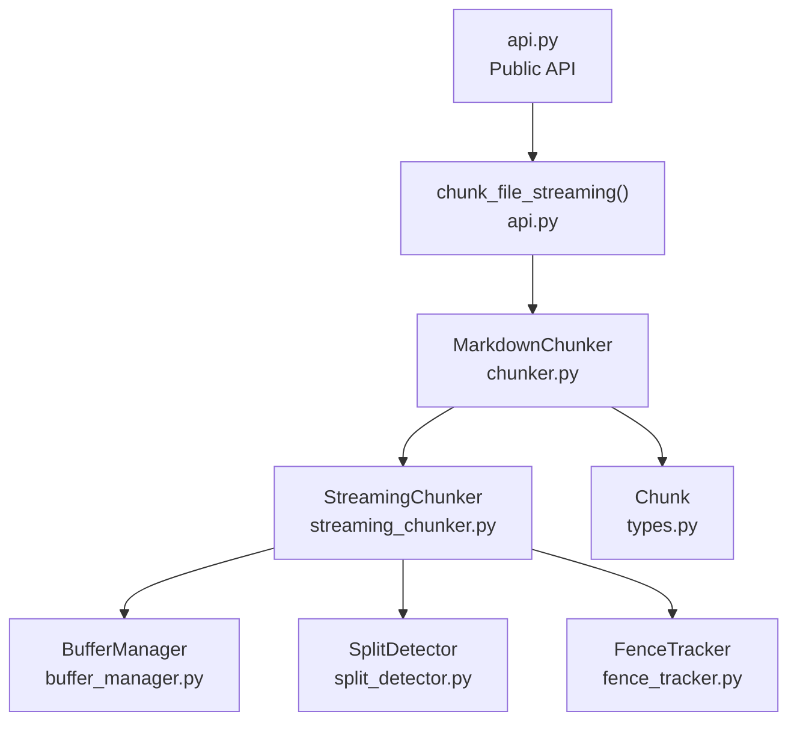
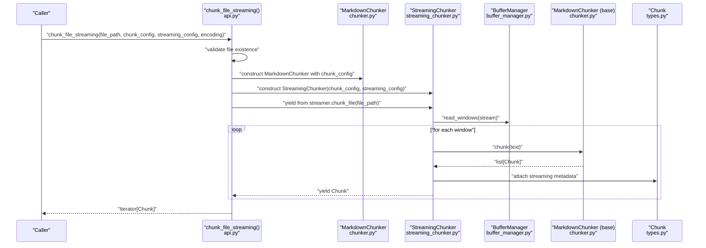
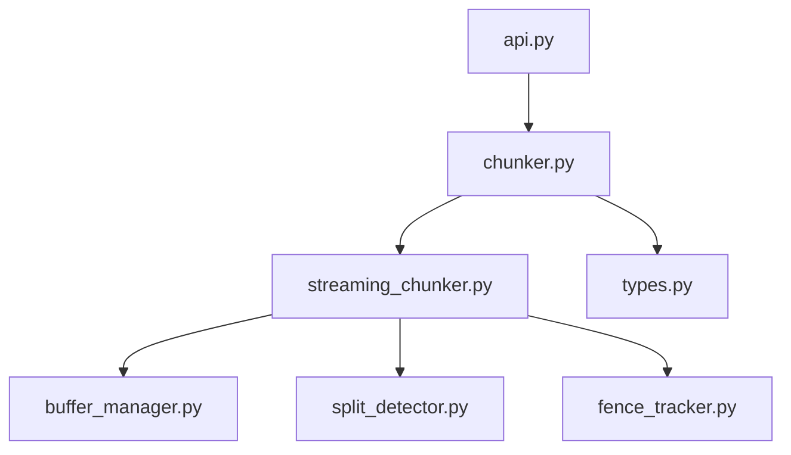

# chunk_file_streaming

<cite>
**Referenced Files in This Document**
- [api.py](file://src/chunkana/api.py)
- [chunker.py](file://src/chunkana/chunker.py)
- [streaming_chunker.py](file://src/chunkana/streaming/streaming_chunker.py)
- [buffer_manager.py](file://src/chunkana/streaming/buffer_manager.py)
- [config.py](file://src/chunkana/streaming/config.py)
- [fence_tracker.py](file://src/chunkana/streaming/fence_tracker.py)
- [split_detector.py](file://src/chunkana/streaming/split_detector.py)
- [types.py](file://src/chunkana/types.py)
- [test_streaming.py](file://tests/unit/test_streaming.py)
</cite>

## Table of Contents
1. [Introduction](#introduction)
2. [Project Structure](#project-structure)
3. [Core Components](#core-components)
4. [Architecture Overview](#architecture-overview)
5. [Detailed Component Analysis](#detailed-component-analysis)
6. [Dependency Analysis](#dependency-analysis)
7. [Performance Considerations](#performance-considerations)
8. [Troubleshooting Guide](#troubleshooting-guide)
9. [Conclusion](#conclusion)
10. [Appendices](#appendices)

## Introduction
This document provides comprehensive API documentation for the chunk_file_streaming() function, designed for memory-efficient processing of large Markdown files. It explains parameters, return type, invariants, implementation details, error handling, performance characteristics, and practical configuration guidance. The function streams content in fixed-size windows, preserving atomic blocks and maintaining monotonic line ordering, yielding an iterator of Chunk objects suitable for incremental processing.

## Project Structure
The chunk_file_streaming() API sits at the public surface and delegates to a streaming pipeline composed of a chunker and streaming subsystem.

**Diagram sources**
- [api.py](file://src/chunkana/api.py#L228-L271)
- [chunker.py](file://src/chunkana/chunker.py#L249-L300)
- [streaming_chunker.py](file://src/chunkana/streaming/streaming_chunker.py#L18-L99)
- [buffer_manager.py](file://src/chunkana/streaming/buffer_manager.py#L13-L62)
- [split_detector.py](file://src/chunkana/streaming/split_detector.py#L10-L93)
- [fence_tracker.py](file://src/chunkana/streaming/fence_tracker.py#L10-L65)
- [types.py](file://src/chunkana/types.py#L240-L375)

**Section sources**
- [api.py](file://src/chunkana/api.py#L228-L271)
- [chunker.py](file://src/chunkana/chunker.py#L249-L300)

## Core Components
- chunk_file_streaming(file_path, chunk_config, streaming_config, encoding) -> Iterator[Chunk]: Public API for streaming chunking of large Markdown files.
- StreamingChunker(chunk_config, streaming_config): Orchestrates windowed processing and yields Chunk objects.
- BufferManager: Reads input in fixed-size windows with overlap.
- SplitDetector: Finds safe split points prioritizing headers, paragraphs, and non-fenced newlines.
- FenceTracker: Tracks fenced code block state across windows to prevent splitting atomic blocks.
- Chunk: Output type with content, positional metadata, and streaming metadata.

Key invariants maintained:
- Complete line coverage: Every source line appears in output.
- Atomic block preservation: Code blocks and tables are not split across windows.
- Monotonic start_line ordering: Chunks are yielded in ascending order by start_line.

**Section sources**
- [api.py](file://src/chunkana/api.py#L228-L271)
- [streaming_chunker.py](file://src/chunkana/streaming/streaming_chunker.py#L18-L99)
- [buffer_manager.py](file://src/chunkana/streaming/buffer_manager.py#L13-L62)
- [split_detector.py](file://src/chunkana/streaming/split_detector.py#L10-L93)
- [fence_tracker.py](file://src/chunkana/streaming/fence_tracker.py#L10-L65)
- [types.py](file://src/chunkana/types.py#L240-L375)

## Architecture Overview
The streaming pipeline reads the file incrementally, detects safe split points, and applies the configured chunking strategy to each window’s content.

**Diagram sources**
- [api.py](file://src/chunkana/api.py#L228-L271)
- [chunker.py](file://src/chunkana/chunker.py#L249-L300)
- [streaming_chunker.py](file://src/chunkana/streaming/streaming_chunker.py#L43-L99)
- [buffer_manager.py](file://src/chunkana/streaming/buffer_manager.py#L29-L55)
- [types.py](file://src/chunkana/types.py#L240-L375)

## Detailed Component Analysis

### API: chunk_file_streaming()
- Purpose: Stream large Markdown files and yield Chunk objects incrementally.
- Parameters:
  - file_path: Path to the Markdown file.
  - chunk_config: Chunker configuration (uses defaults if None).
  - streaming_config: Streaming configuration (uses defaults if None).
  - encoding: File encoding (default utf-8).
- Returns: Iterator[Chunk].
- Behavior:
  - Validates file existence; raises FileNotFoundError if missing.
  - Constructs MarkdownChunker and StreamingChunker.
  - Delegates to StreamingChunker.chunk_file() to process the file.
- Invariants: Complete line coverage, atomic block preservation, monotonic start_line ordering.
- Errors: FileNotFoundError for missing file; UnicodeDecodeError if encoding fails.

Practical usage patterns:
- Iterate over chunks to process incrementally.
- Integrate with data pipelines by chaining iterators.
- Use streaming_config to tune memory and throughput.

**Section sources**
- [api.py](file://src/chunkana/api.py#L228-L271)
- [test_streaming.py](file://tests/unit/test_streaming.py#L117-L132)

### StreamingChunker
- Responsibilities:
  - Manages buffer windows and overlap.
  - Applies the base MarkdownChunker to each window.
  - Attaches streaming metadata to each Chunk.
- Methods:
  - chunk_file(file_path): Opens file and yields chunks.
  - chunk_stream(stream): Streams from an io.TextIOBase.
  - _process_window(buffer, overlap, window_index, start_chunk_index): Combines overlap and buffer, chunks text, and yields results.

Streaming metadata attached:
- stream_chunk_index: Sequential index of chunk within the stream.
- stream_window_index: Window index where chunk originated.
- bytes_processed: Cumulative bytes processed across windows.

**Section sources**
- [streaming_chunker.py](file://src/chunkana/streaming/streaming_chunker.py#L18-L99)
- [test_streaming.py](file://tests/unit/test_streaming.py#L344-L360)

### BufferManager
- Reads input line-by-line and emits windows when buffer_size threshold is reached.
- Maintains overlap_lines from the end of the previous buffer for continuity.
- Yields tuples of (buffer_lines, overlap_lines, bytes_processed).

**Section sources**
- [buffer_manager.py](file://src/chunkana/streaming/buffer_manager.py#L13-L62)
- [test_streaming.py](file://tests/unit/test_streaming.py#L174-L232)

### SplitDetector and FenceTracker
- SplitDetector:
  - Finds safe split points prioritizing:
    - Line before a header.
    - Paragraph boundary (double newline).
    - Newline outside fenced content.
  - Falls back to threshold-based split.
- FenceTracker:
  - Tracks opening/closing fences across lines to avoid splitting code blocks.

**Section sources**
- [split_detector.py](file://src/chunkana/streaming/split_detector.py#L10-L93)
- [fence_tracker.py](file://src/chunkana/streaming/fence_tracker.py#L10-L65)
- [test_streaming.py](file://tests/unit/test_streaming.py#L233-L288)

### Chunk
- Represents a chunk with content, start_line, end_line, and metadata.
- Streaming pipeline augments metadata with streaming-specific fields.

**Section sources**
- [types.py](file://src/chunkana/types.py#L240-L375)
- [test_streaming.py](file://tests/unit/test_streaming.py#L344-L360)

### Implementation Using StreamingChunker and Configuration
- StreamingChunker composes:
  - MarkdownChunker for chunking each window.
  - BufferManager for windowed IO.
  - SplitDetector and FenceTracker for safe boundaries.
- StreamingConfig controls:
  - buffer_size: Bytes per window.
  - overlap_lines: Lines carried over to next window.
  - max_memory_mb: Memory ceiling hint.
  - safe_split_threshold: Fraction to start looking for split points.

**Section sources**
- [streaming_chunker.py](file://src/chunkana/streaming/streaming_chunker.py#L18-L42)
- [config.py](file://src/chunkana/streaming/config.py#L8-L24)
- [test_streaming.py](file://tests/unit/test_streaming.py#L17-L53)

### Error Conditions
- FileNotFoundError: Raised when file_path does not exist.
- UnicodeDecodeError: Raised when the file cannot be decoded with the specified encoding.

**Section sources**
- [api.py](file://src/chunkana/api.py#L228-L271)
- [test_streaming.py](file://tests/unit/test_streaming.py#L117-L132)

### Performance Characteristics and Memory Benefits
- Memory usage is bounded by buffer_size and overlap_lines; the entire file is not loaded into memory.
- Throughput scales with buffer_size and CPU; smaller buffers increase overhead due to more windows and metadata attachment.
- Atomic block preservation avoids costly rework by preventing splits inside fenced code blocks and tables.
- Monotonic ordering ensures downstream consumers receive chunks in document order.

**Section sources**
- [buffer_manager.py](file://src/chunkana/streaming/buffer_manager.py#L29-L55)
- [streaming_chunker.py](file://src/chunkana/streaming/streaming_chunker.py#L43-L99)
- [test_streaming.py](file://tests/unit/test_streaming.py#L292-L315)

### Configuring Streaming Parameters for Optimal Performance
- buffer_size:
  - Increase for higher throughput; decrease for lower latency and memory footprint.
  - Must be tuned to available RAM and typical chunk sizes.
- overlap_lines:
  - Larger overlap improves continuity across windows; increases memory slightly.
  - Recommended default is sufficient for most documents.
- safe_split_threshold:
  - Controls where split detection begins within a window.
  - Adjust if encountering frequent mid-paragraph splits.
- max_memory_mb:
  - Advisory; actual memory depends on buffer_size and runtime behavior.

Guidance:
- For large files (>10 MB), start with default buffer_size and adjust based on observed memory and latency.
- If encountering frequent mid-fenced splits, reduce buffer_size to minimize long fenced regions per window.
- If latency is critical, reduce buffer_size to increase window granularity.

**Section sources**
- [config.py](file://src/chunkana/streaming/config.py#L8-L24)
- [test_streaming.py](file://tests/unit/test_streaming.py#L17-L53)

### Troubleshooting Common Streaming Issues
- Empty or whitespace-only input yields no chunks.
  - Verify input content and encoding.
- Unexpected mid-fenced splits:
  - Reduce buffer_size to keep fenced regions within a single window.
- Excessive memory usage:
  - Decrease buffer_size and overlap_lines.
- Poor chunk boundaries:
  - Tune safe_split_threshold and ensure headers/paragraphs are present for natural boundaries.
- Streaming metadata anomalies:
  - Confirm that stream_chunk_index increments monotonically and stream_window_index reflects window transitions.

**Section sources**
- [test_streaming.py](file://tests/unit/test_streaming.py#L150-L169)
- [test_streaming.py](file://tests/unit/test_streaming.py#L133-L149)
- [test_streaming.py](file://tests/unit/test_streaming.py#L316-L343)
- [test_streaming.py](file://tests/unit/test_streaming.py#L344-L360)

## Dependency Analysis
The streaming pipeline exhibits low coupling between modules, with clear responsibilities:
- api.py depends on chunker.py and streaming components.
- chunker.py orchestrates MarkdownChunker and delegates to streaming when invoked.
- streaming_chunker.py composes buffer_manager, split_detector, and fence_tracker.
- types.py defines Chunk and its metadata contract.

**Diagram sources**
- [api.py](file://src/chunkana/api.py#L228-L271)
- [chunker.py](file://src/chunkana/chunker.py#L249-L300)
- [streaming_chunker.py](file://src/chunkana/streaming/streaming_chunker.py#L18-L42)
- [buffer_manager.py](file://src/chunkana/streaming/buffer_manager.py#L13-L22)
- [split_detector.py](file://src/chunkana/streaming/split_detector.py#L10-L24)
- [fence_tracker.py](file://src/chunkana/streaming/fence_tracker.py#L10-L21)
- [types.py](file://src/chunkana/types.py#L240-L296)

**Section sources**
- [api.py](file://src/chunkana/api.py#L228-L271)
- [chunker.py](file://src/chunkana/chunker.py#L249-L300)
- [streaming_chunker.py](file://src/chunkana/streaming/streaming_chunker.py#L18-L42)

## Performance Considerations
- Window size trade-offs: Larger windows reduce overhead but increase memory and latency; smaller windows improve responsiveness at the cost of more windows and metadata.
- Overlap impact: Increasing overlap_lines improves continuity but slightly increases memory and processing time.
- Atomic block preservation: Prevents expensive rework and maintains correctness at the cost of careful split detection.
- Encoding: UTF-8 is the default; ensure the file encoding matches to avoid decoding errors.

[No sources needed since this section provides general guidance]

## Troubleshooting Guide
- File not found:
  - Verify file_path exists and permissions are correct.
- Encoding errors:
  - Specify the correct encoding or convert the file to UTF-8.
- Unexpected chunk boundaries:
  - Adjust buffer_size and safe_split_threshold.
- Mid-fenced splits:
  - Reduce buffer_size to keep fenced regions within a single window.
- Memory pressure:
  - Lower buffer_size and overlap_lines.

**Section sources**
- [api.py](file://src/chunkana/api.py#L228-L271)
- [test_streaming.py](file://tests/unit/test_streaming.py#L117-L132)
- [test_streaming.py](file://tests/unit/test_streaming.py#L133-L149)
- [test_streaming.py](file://tests/unit/test_streaming.py#L150-L169)

## Conclusion
chunk_file_streaming() provides a robust, memory-efficient way to process large Markdown files by streaming fixed-size windows, preserving atomic blocks, and maintaining monotonic ordering. By tuning buffer_size, overlap_lines, and split thresholds, users can balance memory usage, throughput, and chunk quality for diverse workloads.

[No sources needed since this section summarizes without analyzing specific files]

## Appendices

### API Definition Reference
- Function: chunk_file_streaming(file_path, chunk_config=None, streaming_config=None, encoding="utf-8") -> Iterator[Chunk]
- Parameters:
  - file_path: str | Path
  - chunk_config: ChunkerConfig | None
  - streaming_config: StreamingConfig | None
  - encoding: str
- Returns: Iterator[Chunk]
- Raises: FileNotFoundError, UnicodeDecodeError

**Section sources**
- [api.py](file://src/chunkana/api.py#L228-L271)

### Streaming Metadata Fields
- stream_chunk_index: int
- stream_window_index: int
- bytes_processed: int

**Section sources**
- [streaming_chunker.py](file://src/chunkana/streaming/streaming_chunker.py#L66-L78)
- [test_streaming.py](file://tests/unit/test_streaming.py#L344-L360)