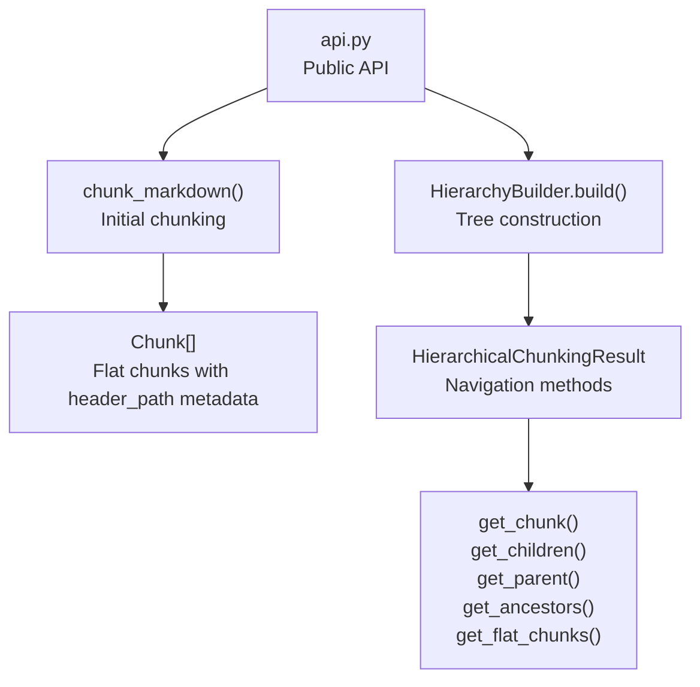
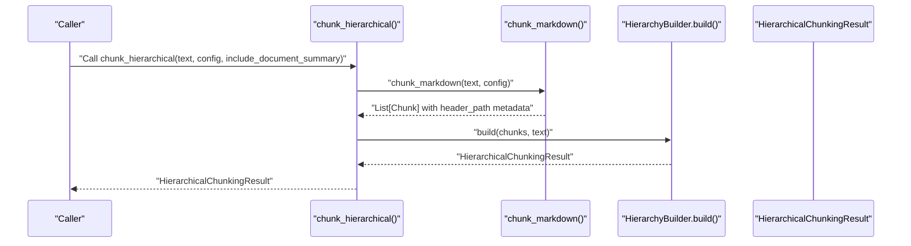
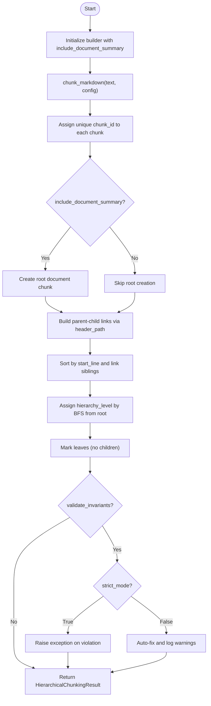
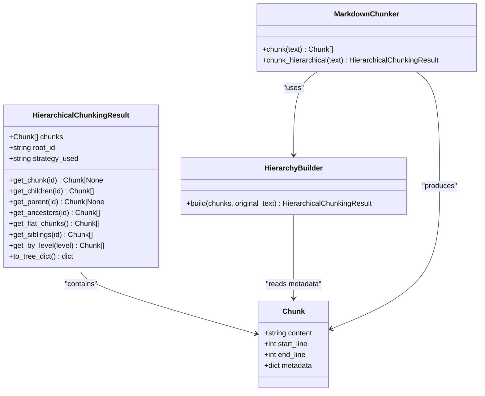

# chunk_hierarchical

<cite>
**Referenced Files in This Document**
- [api.py](file://src/chunkana/api.py)
- [chunker.py](file://src/chunkana/chunker.py)
- [hierarchy.py](file://src/chunkana/hierarchy.py)
- [types.py](file://src/chunkana/types.py)
- [config.py](file://src/chunkana/config.py)
- [README.md](file://README.md)
- [test_hierarchy.py](file://tests/unit/test_hierarchy.py)
- [test_api_wrappers.py](file://tests/property/test_api_wrappers.py)
</cite>

## Table of Contents
1. [Introduction](#introduction)
2. [Project Structure](#project-structure)
3. [Core Components](#core-components)
4. [Architecture Overview](#architecture-overview)
5. [Detailed Component Analysis](#detailed-component-analysis)
6. [Dependency Analysis](#dependency-analysis)
7. [Performance Considerations](#performance-considerations)
8. [Troubleshooting Guide](#troubleshooting-guide)
9. [Conclusion](#conclusion)
10. [Appendices](#appendices)

## Introduction
This document provides comprehensive API documentation for the chunk_hierarchical() function, which enables tree-based navigation of chunked Markdown content. It explains the function’s parameters, return type, and navigation capabilities, and describes the internal workflow that produces a hierarchical structure from flat chunks. It also covers common use cases, troubleshooting guidance, and performance tips.

## Project Structure
The chunk_hierarchical() function is part of the public API and orchestrates chunk_markdown() for initial segmentation and HierarchyBuilder to construct parent-child relationships based on header paths.

**Diagram sources**
- [api.py](file://src/chunkana/api.py#L273-L304)
- [hierarchy.py](file://src/chunkana/hierarchy.py#L233-L308)
- [types.py](file://src/chunkana/types.py#L241-L376)

**Section sources**
- [api.py](file://src/chunkana/api.py#L273-L304)
- [hierarchy.py](file://src/chunkana/hierarchy.py#L233-L308)
- [types.py](file://src/chunkana/types.py#L241-L376)

## Core Components
- chunk_hierarchical(text, config=None, include_document_summary=True) -> HierarchicalChunkingResult
  - text: Input Markdown string to chunk.
  - config: Optional ChunkerConfig for controlling chunking behavior.
  - include_document_summary: Boolean flag to create a root document-level chunk.
  - Returns: HierarchicalChunkingResult with navigation methods and metadata.

- HierarchicalChunkingResult
  - Navigation methods:
    - get_chunk(chunk_id) -> Chunk | None
    - get_children(chunk_id) -> list[Chunk]
    - get_parent(chunk_id) -> Chunk | None
    - get_ancestors(chunk_id) -> list[Chunk]
    - get_flat_chunks() -> list[Chunk]
  - Additional helpers:
    - get_siblings(chunk_id) -> list[Chunk]
    - get_by_level(level) -> list[Chunk]
    - to_tree_dict() -> dict

- HierarchyBuilder
  - build(chunks, original_text) -> HierarchicalChunkingResult
  - Internal steps:
    - Assign unique IDs to chunks
    - Optionally create root document chunk
    - Build parent-child links using header_path
    - Build sibling links
    - Assign hierarchy levels (tree depth)
    - Mark leaves
    - Validate relationships (optional)

**Section sources**
- [api.py](file://src/chunkana/api.py#L273-L304)
- [hierarchy.py](file://src/chunkana/hierarchy.py#L16-L231)
- [hierarchy.py](file://src/chunkana/hierarchy.py#L233-L308)
- [types.py](file://src/chunkana/types.py#L241-L376)

## Architecture Overview
The function performs two stages:
1) Initial chunking via chunk_markdown(text, config) to produce a flat list of chunks with header_path metadata.
2) Tree construction via HierarchyBuilder.build(chunks, text) to add parent-child-sibling relationships and hierarchy levels.

**Diagram sources**
- [api.py](file://src/chunkana/api.py#L273-L304)
- [hierarchy.py](file://src/chunkana/hierarchy.py#L233-L308)

## Detailed Component Analysis

### chunk_hierarchical() API
- Purpose: Produce a hierarchical representation of Markdown chunks with navigation methods.
- Parameters:
  - text: Markdown input string.
  - config: Optional ChunkerConfig controlling chunking behavior (size bounds, overlap, strategy selection, etc.).
  - include_document_summary: When True, adds a root-level document chunk summarizing the document.
- Returns: HierarchicalChunkingResult with:
  - chunks: All chunks including root (if enabled)
  - root_id: Identifier of the root chunk
  - strategy_used: Strategy name applied during chunking
- Navigation methods:
  - get_chunk(id): Lookup by chunk_id
  - get_children(id): Children of a given chunk
  - get_parent(id): Parent of a given chunk
  - get_ancestors(id): Path from chunk to root
  - get_flat_chunks(): Leaf chunks plus non-leaf chunks with significant content

Common usage patterns:
- Tree traversal: Start from root_id, iterate children, and traverse down the hierarchy.
- Retrieval modes:
  - Flat retrieval: Use get_flat_chunks() to avoid losing content-bearing parents.
  - Hierarchical retrieval: Use get_children()/get_parent() to navigate by sections.

**Section sources**
- [api.py](file://src/chunkana/api.py#L273-L304)
- [hierarchy.py](file://src/chunkana/hierarchy.py#L16-L231)
- [hierarchy.py](file://src/chunkana/hierarchy.py#L309-L548)

### Internal Workflow: chunk_markdown() + HierarchyBuilder
- chunk_markdown() produces a list of Chunk objects with metadata including:
  - header_path: Hierarchical path derived from the first header in each chunk.
  - header_level: Level of the first header.
  - content_type: Type of content (text/code/table/preamble/mixed).
  - start_line/end_line: Approximate positions in the source document.
- HierarchyBuilder.build() then:
  - Assigns unique chunk_id to each chunk.
  - Optionally creates a root document chunk with a meaningful title and summary.
  - Builds parent-child relationships by walking header_path segments.
  - Links siblings by sorting chunks under the same parent by start_line.
  - Assigns hierarchy_level based on tree depth (BFS).
  - Marks leaves consistently (no children).
  - Validates relationships (optional) and can auto-fix or raise depending on strict_mode.

**Diagram sources**
- [api.py](file://src/chunkana/api.py#L273-L304)
- [hierarchy.py](file://src/chunkana/hierarchy.py#L233-L308)
- [hierarchy.py](file://src/chunkana/hierarchy.py#L309-L548)

**Section sources**
- [api.py](file://src/chunkana/api.py#L273-L304)
- [hierarchy.py](file://src/chunkana/hierarchy.py#L233-L308)
- [hierarchy.py](file://src/chunkana/hierarchy.py#L309-L548)

### Navigation Methods and Traversal
- get_chunk(id): O(1) lookup via internal index keyed by chunk_id.
- get_children(id): Retrieve children by reading children_ids from metadata.
- get_parent(id): Retrieve parent by reading parent_id from metadata.
- get_ancestors(id): Walk upward using parent_id until reaching root.
- get_flat_chunks(): Returns leaf chunks and non-leaf chunks with significant content (more than 100 characters of non-header text).
- get_siblings(id): Returns siblings ordered by start_line.
- get_by_level(level): Returns chunks at a specific hierarchy level (0=root, 1=sections, 2=subsections, 3+ further nesting).
- to_tree_dict(): Serializes the hierarchy as a nested dictionary using IDs.

Practical traversal example:
- Start at root_id, call get_children(root_id) to iterate top-level sections.
- For each child, call get_children(child_id) to go deeper.
- Use get_ancestors(id) to reconstruct the path from a leaf to root.

**Section sources**
- [hierarchy.py](file://src/chunkana/hierarchy.py#L16-L231)
- [hierarchy.py](file://src/chunkana/hierarchy.py#L233-L308)

### Data Model: Chunk and Metadata
- Chunk fields:
  - content: Text content
  - start_line, end_line: Approximate positions
  - metadata: Rich metadata including header_path, header_level, content_type, chunk_id, parent_id, children_ids, hierarchy_level, is_leaf, is_root, strategy, etc.
- ChunkingResult and ChunkingMetrics are used by other convenience functions; hierarchical mode returns HierarchicalChunkingResult with navigation.

**Section sources**
- [types.py](file://src/chunkana/types.py#L241-L376)

### Configuration Impact
- ChunkerConfig controls:
  - Size bounds (max_chunk_size, min_chunk_size)
  - Overlap (overlap_size, overlap_cap_ratio)
  - Strategy selection thresholds (code_threshold, structure_threshold, list_ratio_threshold, list_count_threshold)
  - Hierarchical chunking flags (include_document_summary, validate_invariants, strict_mode)
  - Other behaviors (preserve_atomic_blocks, extract_preamble, adaptive sizing, LaTeX/table handling, etc.)

These settings influence the flat chunks produced by chunk_markdown(), which in turn affects the resulting hierarchy.

**Section sources**
- [config.py](file://src/chunkana/config.py#L17-L123)
- [config.py](file://src/chunkana/config.py#L310-L407)

## Dependency Analysis
- Public API depends on chunk_markdown() and HierarchyBuilder.
- HierarchyBuilder depends on Chunk metadata (header_path, header_level, content_type).
- HierarchicalChunkingResult depends on Chunk and maintains an internal index for O(1) lookups.

**Diagram sources**
- [hierarchy.py](file://src/chunkana/hierarchy.py#L16-L231)
- [hierarchy.py](file://src/chunkana/hierarchy.py#L233-L308)
- [chunker.py](file://src/chunkana/chunker.py#L217-L248)
- [types.py](file://src/chunkana/types.py#L241-L376)

**Section sources**
- [hierarchy.py](file://src/chunkana/hierarchy.py#L16-L231)
- [hierarchy.py](file://src/chunkana/hierarchy.py#L233-L308)
- [chunker.py](file://src/chunkana/chunker.py#L217-L248)
- [types.py](file://src/chunkana/types.py#L241-L376)

## Performance Considerations
- Complexity:
  - chunk_markdown(): Linear in input size with strategy selection and post-processing.
  - HierarchyBuilder.build(): Linear in number of chunks for ID assignment and sibling linking; parent-child linking via header_path indexing is efficient; assigning hierarchy_level via BFS is linear in nodes.
- Memory:
  - HierarchicalChunkingResult stores all chunks and an internal index for O(1) lookups.
  - get_flat_chunks() filters based on is_leaf and significant content; this is linear in chunk count.
- Recommendations:
  - Use overlap_size judiciously; higher overlap increases metadata size and processing time.
  - For very large documents, consider enabling adaptive sizing to adjust chunk sizes dynamically.
  - Disable validate_invariants in production if strict_mode is not needed; it adds validation overhead.

[No sources needed since this section provides general guidance]

## Troubleshooting Guide
Common issues and resolutions:
- Unexpected hierarchy structure:
  - Ensure header_path metadata is present in chunks (produced by chunk_markdown()). If absent, relationships will default to linking to root.
  - Verify that header_path follows the expected format (e.g., "/Level1/Level2/...").
- Orphaned chunks:
  - HierarchyBuilder links chunks without a matching parent to root. Check header_path correctness and ensure headers are not dangling.
- Invariant violations:
  - With validate_invariants=True, HierarchyBuilder can raise exceptions (strict_mode=True) or auto-fix (strict_mode=False). Review suggested fixes and adjust chunking configuration.
- Large documents:
  - Consider increasing max_chunk_size or enabling adaptive sizing to reduce fragmentation.
- Retrieval mode mismatch:
  - Use get_flat_chunks() to avoid losing content-bearing parents; use get_children()/get_parent() for hierarchical navigation.

Validation and error handling:
- HierarchicalInvariantError is raised when tree invariants are violated and strict_mode is True.
- ChunkanaError is the base exception type for broader chunking errors.

**Section sources**
- [README.md](file://README.md#L90-L112)
- [hierarchy.py](file://src/chunkana/hierarchy.py#L656-L800)
- [test_hierarchy.py](file://tests/unit/test_hierarchy.py#L1-L268)
- [test_api_wrappers.py](file://tests/property/test_api_wrappers.py#L243-L270)

## Conclusion
chunk_hierarchical() provides a robust, validated tree structure over chunked Markdown content. By combining flat chunking with header-path-based parent-child relationships, it enables intuitive navigation and flexible retrieval strategies. Use include_document_summary to create a document-level root for contextual retrieval, and leverage get_flat_chunks() to balance completeness with retrieval efficiency.

[No sources needed since this section summarizes without analyzing specific files]

## Appendices

### API Reference Summary
- chunk_hierarchical(text, config=None, include_document_summary=True) -> HierarchicalChunkingResult
- HierarchicalChunkingResult navigation:
  - get_chunk(id), get_children(id), get_parent(id), get_ancestors(id), get_flat_chunks()
  - get_siblings(id), get_by_level(level), to_tree_dict()

**Section sources**
- [api.py](file://src/chunkana/api.py#L273-L304)
- [hierarchy.py](file://src/chunkana/hierarchy.py#L16-L231)
- [hierarchy.py](file://src/chunkana/hierarchy.py#L233-L308)

### Example Workflows
- Tree-based retrieval:
  - result = chunk_hierarchical(text)
  - root = result.get_chunk(result.root_id)
  - children = result.get_children(result.root_id)
  - Iterate children and drill down using get_children(child_id).
- Flat retrieval:
  - flat = result.get_flat_chunks()
  - Use flat for semantic search to avoid losing parent content.
- Without document summary:
  - result = chunk_hierarchical(text, include_document_summary=False)
  - Works when a root document chunk is not desired.

**Section sources**
- [test_api_wrappers.py](file://tests/property/test_api_wrappers.py#L243-L270)
- [test_hierarchy.py](file://tests/unit/test_hierarchy.py#L1-L268)