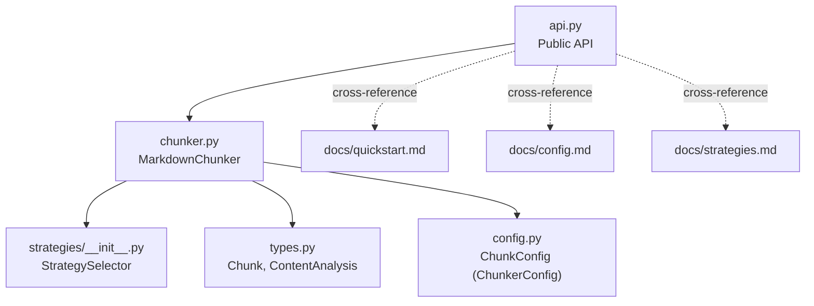
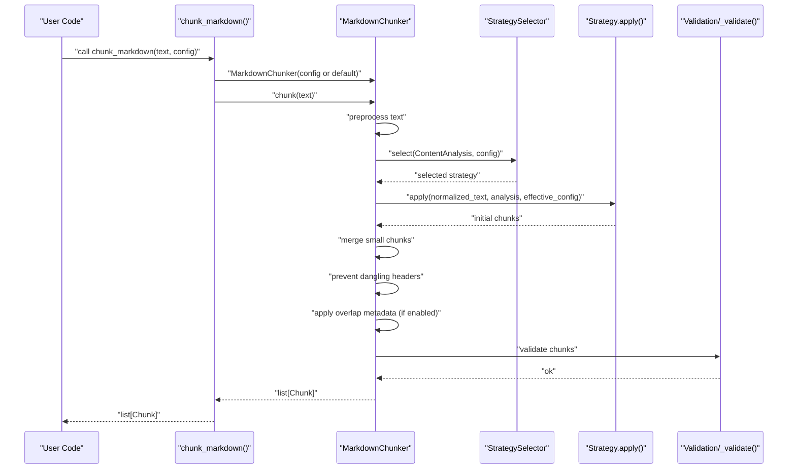
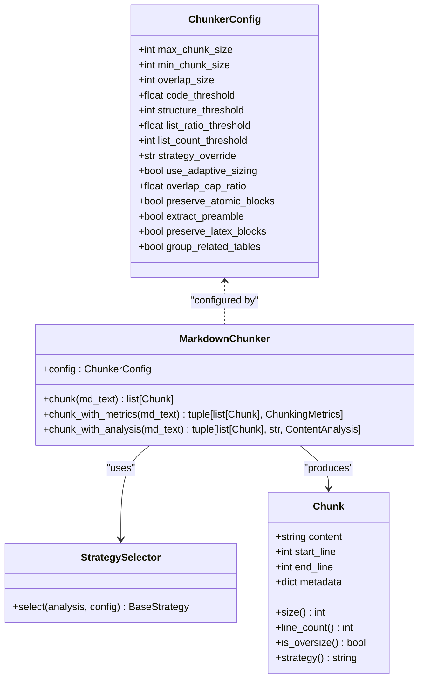

# chunk_markdown

<cite>
**Referenced Files in This Document**
- [api.py](file://src/chunkana/api.py)
- [chunker.py](file://src/chunkana/chunker.py)
- [types.py](file://src/chunkana/types.py)
- [config.py](file://src/chunkana/config.py)
- [strategies/__init__.py](file://src/chunkana/strategies/__init__.py)
- [README.md](file://README.md)
- [docs/quickstart.md](file://docs/quickstart.md)
- [docs/config.md](file://docs/config.md)
- [docs/strategies.md](file://docs/strategies.md)
- [MIGRATION_GUIDE.md](file://MIGRATION_GUIDE.md)
</cite>

## Table of Contents
1. [Introduction](#introduction)
2. [Project Structure](#project-structure)
3. [Core Components](#core-components)
4. [Architecture Overview](#architecture-overview)
5. [Detailed Component Analysis](#detailed-component-analysis)
6. [Dependency Analysis](#dependency-analysis)
7. [Performance Considerations](#performance-considerations)
8. [Troubleshooting Guide](#troubleshooting-guide)
9. [Conclusion](#conclusion)
10. [Appendices](#appendices)

## Introduction
This document provides comprehensive API documentation for the chunk_markdown() function, the primary entry point for basic chunking operations in Chunkana. It explains the function’s signature, return type guarantees, and behavior, and shows how it integrates with the MarkdownChunker class and configuration. It also documents the Chunk object structure, metadata semantics, and how configuration influences strategy selection, chunk sizing, and metadata enrichment. Practical usage examples and common issues are covered, along with cross-references to configuration options and strategy selection mechanics.

## Project Structure
The chunk_markdown() function is part of the public API and delegates to the MarkdownChunker class. The core types and configuration live in dedicated modules, and strategies are selected automatically based on content analysis.

**Diagram sources**
- [api.py](file://src/chunkana/api.py#L18-L41)
- [chunker.py](file://src/chunkana/chunker.py#L37-L177)
- [strategies/__init__.py](file://src/chunkana/strategies/__init__.py#L20-L68)
- [types.py](file://src/chunkana/types.py#L240-L376)
- [config.py](file://src/chunkana/config.py#L17-L126)
- [docs/quickstart.md](file://docs/quickstart.md#L1-L70)
- [docs/config.md](file://docs/config.md#L1-L172)
- [docs/strategies.md](file://docs/strategies.md#L1-L82)

**Section sources**
- [api.py](file://src/chunkana/api.py#L18-L41)
- [README.md](file://README.md#L21-L47)

## Core Components
- chunk_markdown(text: str, config: ChunkerConfig | None = None) -> list[Chunk]: The primary convenience function for basic chunking. It always returns a list of Chunk objects and never a union type.
- MarkdownChunker: The core class that performs parsing, strategy selection, chunking, merging, overlap application, metadata enrichment, and validation.
- Chunk: The data structure representing a chunk with content, line ranges, and metadata.
- ChunkerConfig (alias ChunkConfig): Configuration controlling chunk sizing, strategy thresholds, overlap behavior, and advanced features.

Key guarantees:
- Consistent return type: list[Chunk].
- No union returns.
- Empty input returns an empty list.
- Validation ensures invariants and metadata correctness.

**Section sources**
- [api.py](file://src/chunkana/api.py#L18-L41)
- [chunker.py](file://src/chunkana/chunker.py#L85-L177)
- [types.py](file://src/chunkana/types.py#L240-L376)
- [config.py](file://src/chunkana/config.py#L17-L126)
- [MIGRATION_GUIDE.md](file://MIGRATION_GUIDE.md#L32-L52)

## Architecture Overview
The chunk_markdown() function constructs a MarkdownChunker with the provided or default configuration and delegates to its chunk() method. The pipeline includes parsing, adaptive sizing, strategy selection, applying the strategy, merging small chunks, overlap metadata injection, metadata recalculation, and validation.

**Diagram sources**
- [api.py](file://src/chunkana/api.py#L18-L41)
- [chunker.py](file://src/chunkana/chunker.py#L85-L177)
- [strategies/__init__.py](file://src/chunkana/strategies/__init__.py#L20-L68)

## Detailed Component Analysis

### chunk_markdown() API
- Signature: chunk_markdown(text: str, config: ChunkerConfig | None = None) -> list[Chunk]
- Behavior:
  - Uses ChunkerConfig.default() when config is None.
  - Delegates to MarkdownChunker.chunk(text).
  - Always returns a list[Chunk]; never a union type.
- Typical usage:
  - Simple: chunks = chunk_markdown("# Hello\n\nWorld")
  - With configuration: chunks = chunk_markdown(text, ChunkerConfig(max_chunk_size=4096))

Practical examples:
- Basic usage: see [README.md](file://README.md#L21-L47)
- Quickstart examples: see [docs/quickstart.md](file://docs/quickstart.md#L11-L34)
- Rendering output: see [docs/quickstart.md](file://docs/quickstart.md#L50-L63)

Integration with MarkdownChunker:
- The function constructs MarkdownChunker(config or ChunkerConfig.default()) and calls chunk(text).
- See [api.py](file://src/chunkana/api.py#L18-L41).

Return type guarantee:
- Canonical output compatibility: see [MIGRATION_GUIDE.md](file://MIGRATION_GUIDE.md#L32-L52).

**Section sources**
- [api.py](file://src/chunkana/api.py#L18-L41)
- [README.md](file://README.md#L21-L47)
- [docs/quickstart.md](file://docs/quickstart.md#L11-L34)
- [docs/quickstart.md](file://docs/quickstart.md#L50-L63)
- [MIGRATION_GUIDE.md](file://MIGRATION_GUIDE.md#L32-L52)

### Chunk object structure
Chunk attributes and metadata:
- content: The text content of the chunk.
- start_line: Starting line number (1-indexed).
- end_line: Ending line number (1-indexed).
- metadata: Additional information (see below).

Metadata fields commonly present:
- chunk_index: Sequential index of chunk in document.
- content_type: "text" | "code" | "table" | "mixed" | "preamble".
- has_code: Whether chunk contains code blocks.
- strategy: Strategy name that created this chunk.
- header_path: Hierarchical path to first header in chunk (e.g., "/Level1/Level2/Level3"; special "/__preamble__" for preamble).
- header_level: Level of first header in chunk (1-6).
- sub_headers: Additional header texts within the chunk (when applicable).
- small_chunk: True if chunk qualifies as structurally weak and below min_chunk_size.
- small_chunk_reason: Reason for small_chunk flag (e.g., "cannot_merge").
- previous_content: Last N characters from previous chunk (metadata-only).
- next_content: First N characters from next chunk (metadata-only).
- overlap_size: Size of context window used for overlap metadata.

Computed properties:
- size: Character count of content.
- line_count: Number of lines in content.
- is_oversize: Whether chunk is intentionally oversized (metadata flag).
- strategy: Strategy used (from metadata).

Validation:
- start_line must be >= 1.
- end_line must be >= start_line.
- content cannot be empty or whitespace-only.

Serialization helpers:
- to_dict(), from_dict(), to_json(), from_json().

**Section sources**
- [types.py](file://src/chunkana/types.py#L240-L376)

### Configuration and strategy selection
Configuration controls:
- ChunkerConfig (alias ChunkConfig) governs sizing, thresholds, overlap, adaptive sizing, LaTeX handling, table grouping, and code-context binding.
- Key parameters affecting chunk_markdown():
  - max_chunk_size, min_chunk_size
  - overlap_size, overlap_cap_ratio
  - preserve_atomic_blocks, extract_preamble
  - code_threshold, structure_threshold, list_ratio_threshold, list_count_threshold
  - strategy_override
  - use_adaptive_sizing, adaptive_config
  - preserve_latex_blocks, latex_display_only, latex_max_context_chars
  - group_related_tables, table_grouping_config

Strategy selection:
- Automatic selection order: CodeAware > ListAware > Structural > Fallback.
- Conditions depend on ContentAnalysis and thresholds.
- Can be forced via strategy_override.

Overlap behavior:
- Stored in metadata fields previous_content and next_content.
- Not embedded in chunk.content; overlap_size indicates the window size.

Adaptive sizing:
- Can dynamically adjust max_chunk_size based on content complexity.
- Adds adaptive sizing metadata to chunks when enabled.

**Section sources**
- [config.py](file://src/chunkana/config.py#L17-L126)
- [config.py](file://src/chunkana/config.py#L248-L313)
- [strategies/__init__.py](file://src/chunkana/strategies/__init__.py#L20-L68)
- [docs/strategies.md](file://docs/strategies.md#L1-L82)
- [docs/config.md](file://docs/config.md#L1-L172)

### Pipeline and post-processing
The MarkdownChunker.chunk() pipeline:
1. Preprocess text (e.g., strip Obsidian block IDs if configured).
2. Parse and analyze content (ContentAnalysis).
3. Optional adaptive sizing calculation.
4. Strategy selection.
5. Strategy application.
6. Merge small chunks.
7. Prevent dangling headers.
8. Apply overlap metadata (if enabled).
9. Add standard metadata and recalculate derived metadata.
10. Validate results.

Overlap extraction:
- previous_content and next_content are extracted respecting word boundaries and overlap caps.
- overlap_size is set in metadata.

Validation:
- Ensures near-total content preservation, enforces size bounds, fixes monotonic ordering, and flags oversize reasons.

**Section sources**
- [chunker.py](file://src/chunkana/chunker.py#L85-L177)
- [chunker.py](file://src/chunkana/chunker.py#L301-L430)
- [chunker.py](file://src/chunkana/chunker.py#L431-L470)

### Practical usage examples
Simple Markdown:
- See [README.md](file://README.md#L21-L47) for a basic example.
- See [docs/quickstart.md](file://docs/quickstart.md#L11-L34) for a minimal example.

Complex Markdown:
- Code-heavy documents: configure higher max_chunk_size and code_threshold; enable code-context binding and adaptive sizing if needed.
- Structured documents: increase structure_threshold and preserve headers.
- List-heavy documents: tune list_ratio_threshold and list_count_threshold.
- Scientific documents: enable preserve_latex_blocks and preserve_atomic_blocks.

Rendering:
- Use renderers to convert chunks to desired formats (e.g., render_dify_style, render_json).

**Section sources**
- [README.md](file://README.md#L21-L47)
- [docs/quickstart.md](file://docs/quickstart.md#L11-L34)
- [docs/config.md](file://docs/config.md#L124-L172)
- [docs/strategies.md](file://docs/strategies.md#L1-L82)

### Integration with MarkdownChunker and configuration effects
- chunk_markdown() constructs MarkdownChunker(config or ChunkerConfig.default()) and calls chunk(text).
- Configuration affects:
  - Strategy selection via thresholds and override.
  - Chunk sizing via min_chunk_size and max_chunk_size.
  - Overlap via overlap_size and overlap_cap_ratio.
  - Metadata enrichment via adaptive sizing and code-context binding.
  - Preservation of atomic blocks and LaTeX.

**Section sources**
- [api.py](file://src/chunkana/api.py#L18-L41)
- [chunker.py](file://src/chunkana/chunker.py#L85-L177)
- [config.py](file://src/chunkana/config.py#L17-L126)

## Dependency Analysis
Relationships among the key components:

**Diagram sources**
- [types.py](file://src/chunkana/types.py#L240-L376)
- [config.py](file://src/chunkana/config.py#L17-L126)
- [chunker.py](file://src/chunkana/chunker.py#L37-L177)
- [strategies/__init__.py](file://src/chunkana/strategies/__init__.py#L20-L68)

**Section sources**
- [types.py](file://src/chunkana/types.py#L240-L376)
- [config.py](file://src/chunkana/config.py#L17-L126)
- [chunker.py](file://src/chunkana/chunker.py#L37-L177)
- [strategies/__init__.py](file://src/chunkana/strategies/__init__.py#L20-L68)

## Performance Considerations
- chunk_markdown() returns a list of Chunk; for very large inputs, consider streaming chunking via chunk_file_streaming() or iter_chunks() to reduce memory usage.
- Overlap metadata is computed but not embedded in chunk.content, minimizing memory overhead compared to duplicating text.
- Adaptive sizing can increase processing time but improves chunk quality for complex documents.
- Strategy selection and merging small chunks add overhead but improve semantic coherence.

[No sources needed since this section provides general guidance]

## Troubleshooting Guide
Common issues and resolutions:
- Empty input handling:
  - chunk_markdown() returns [] for empty or whitespace-only input.
  - See [chunker.py](file://src/chunkana/chunker.py#L105-L107).

- Malformed Markdown:
  - The parser and strategies preserve atomic blocks and enforce invariants; unexpected structures may lead to oversize chunks flagged with allow_oversize and oversize_reason metadata.
  - See [chunker.py](file://src/chunkana/chunker.py#L431-L470) and [types.py](file://src/chunkana/types.py#L240-L376).

- Oversized chunks:
  - Intentionally oversized chunks are flagged with allow_oversize and a reason (e.g., code_block_integrity, table_integrity).
  - See [chunker.py](file://src/chunkana/chunker.py#L431-L470).

- Overlap behavior:
  - overlap_size determines the metadata-only overlap window; ensure overlap_size < max_chunk_size.
  - See [config.py](file://src/chunkana/config.py#L138-L158) and [chunker.py](file://src/chunkana/chunker.py#L301-L430).

- Strategy selection:
  - Adjust thresholds (code_threshold, structure_threshold, list_ratio_threshold, list_count_threshold) or force a strategy via strategy_override.
  - See [strategies/__init__.py](file://src/chunkana/strategies/__init__.py#L20-L68) and [docs/strategies.md](file://docs/strategies.md#L1-L82).

- Validation errors:
  - Chunk.__post_init__ enforces line ranges and non-empty content.
  - See [types.py](file://src/chunkana/types.py#L297-L307).

**Section sources**
- [chunker.py](file://src/chunkana/chunker.py#L105-L107)
- [chunker.py](file://src/chunkana/chunker.py#L431-L470)
- [types.py](file://src/chunkana/types.py#L297-L307)
- [config.py](file://src/chunkana/config.py#L138-L158)
- [strategies/__init__.py](file://src/chunkana/strategies/__init__.py#L20-L68)
- [docs/strategies.md](file://docs/strategies.md#L1-L82)

## Conclusion
chunk_markdown() provides a simple, reliable entry point for basic chunking with consistent typing and rich metadata. It integrates seamlessly with MarkdownChunker and ChunkerConfig, enabling automatic strategy selection, adaptive sizing, overlap metadata, and robust validation. By tuning configuration parameters, users can optimize chunking for different content types and use cases.

[No sources needed since this section summarizes without analyzing specific files]

## Appendices

### API definition summary
- chunk_markdown(text: str, config: ChunkerConfig | None = None) -> list[Chunk]
- Always returns list[Chunk]; never a union type.
- Empty input returns [].

**Section sources**
- [api.py](file://src/chunkana/api.py#L18-L41)
- [MIGRATION_GUIDE.md](file://MIGRATION_GUIDE.md#L32-L52)

### Cross-references to configuration and strategies
- Configuration options: [docs/config.md](file://docs/config.md#L1-L172)
- Strategy selection mechanics: [docs/strategies.md](file://docs/strategies.md#L1-L82)
- StrategySelector implementation: [strategies/__init__.py](file://src/chunkana/strategies/__init__.py#L20-L68)

**Section sources**
- [docs/config.md](file://docs/config.md#L1-L172)
- [docs/strategies.md](file://docs/strategies.md#L1-L82)
- [strategies/__init__.py](file://src/chunkana/strategies/__init__.py#L20-L68)