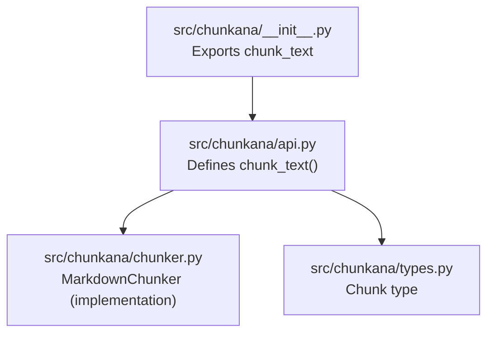
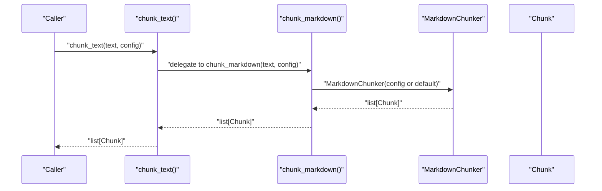
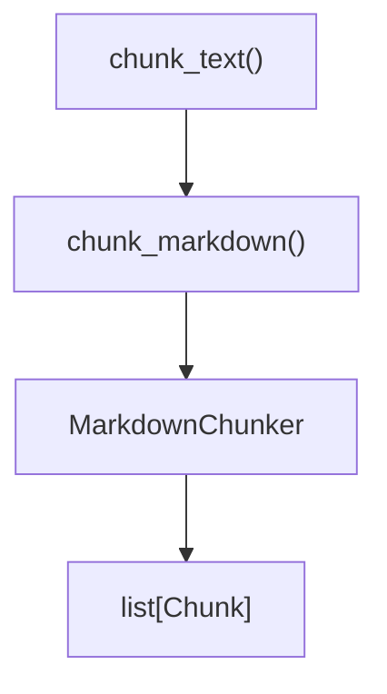

# chunk_text

<cite>
**Referenced Files in This Document**
- [api.py](file://src/chunkana/api.py)
- [types.py](file://src/chunkana/types.py)
- [compat.py](file://src/chunkana/compat.py)
- [test_api_wrappers.py](file://tests/property/test_api_wrappers.py)
- [MIGRATION_GUIDE.md](file://MIGRATION_GUIDE.md)
</cite>

## Table of Contents
1. [Introduction](#introduction)
2. [Project Structure](#project-structure)
3. [Core Components](#core-components)
4. [Architecture Overview](#architecture-overview)
5. [Detailed Component Analysis](#detailed-component-analysis)
6. [Dependency Analysis](#dependency-analysis)
7. [Performance Considerations](#performance-considerations)
8. [Troubleshooting Guide](#troubleshooting-guide)
9. [Conclusion](#conclusion)

## Introduction
This document provides API documentation for the chunk_text() function. It explains that chunk_text() is a compatibility alias for chunk_markdown(), with an identical signature and behavior. The function returns List[Chunk] from Markdown text input and exists solely to maintain plugin parity and integration compatibility with external systems that expect a function named chunk_text(). The documentation includes usage guidance, examples demonstrating interchangeability with chunk_markdown(), and recommendations for choosing between chunk_text() and chunk_markdown() in different contexts.

## Project Structure
The chunk_text() function resides in the public API module alongside other convenience functions. It is exported via the package’s main init and is backed by the same underlying chunking implementation used by chunk_markdown().

**Diagram sources**
- [api.py](file://src/chunkana/api.py#L169-L191)
- [types.py](file://src/chunkana/types.py#L240-L375)

**Section sources**
- [api.py](file://src/chunkana/api.py#L169-L191)
- [__init__.py](file://src/chunkana/__init__.py#L24-L35)

## Core Components
- chunk_text(text: str, config: ChunkerConfig | None = None) -> list[Chunk]
  - Purpose: Compatibility alias for chunk_markdown().
  - Signature: Identical to chunk_markdown().
  - Behavior: Returns the same List[Chunk] as chunk_markdown() for the same input and configuration.
  - Internals: Delegates to chunk_markdown() without additional logic.
- Chunk: The return type representing a semantic chunk with content, line range, and metadata.
- ChunkerConfig: Configuration controlling chunk size limits, overlap, and adaptive sizing.

Key characteristics:
- Output type: Always returns list[Chunk].
- No union returns: Unlike older plugin APIs, this function never returns strings or other types.
- Backward compatibility: Exists to support integrations expecting chunk_text() naming conventions.

**Section sources**
- [api.py](file://src/chunkana/api.py#L169-L191)
- [types.py](file://src/chunkana/types.py#L240-L375)

## Architecture Overview
The chunk_text() function is a thin wrapper around chunk_markdown(). It forwards arguments and returns the same result, ensuring identical performance and functionality.

**Diagram sources**
- [api.py](file://src/chunkana/api.py#L169-L191)
- [api.py](file://src/chunkana/api.py#L18-L41)

## Detailed Component Analysis

### Function Definition and Behavior
- Identity with chunk_markdown():
  - Same parameters: text: str, config: ChunkerConfig | None = None.
  - Same return type: list[Chunk].
  - Same semantics: Produces semantically coherent chunks with metadata.
- Implementation:
  - The function body simply calls chunk_markdown(text, config) and returns the result.
  - There is no additional branching, validation, or transformation logic.
- Use cases:
  - Plugin parity: Integrations that historically used chunk_text() can continue to call it without refactoring.
  - Third-party libraries: Systems that depend on a function named chunk_text() can interoperate seamlessly with Chunkana.

Interchangeability examples:
- The property tests demonstrate that chunk_text(text) produces identical output to chunk_markdown(text) for arbitrary Markdown inputs.
- Configurations passed to chunk_text() are respected identically to chunk_markdown().

Guidance on when to use:
- Prefer chunk_markdown() in new code for clarity and consistency with the library’s primary API.
- Use chunk_text() when integrating with legacy plugins or external systems that require a function named chunk_text().

**Section sources**
- [api.py](file://src/chunkana/api.py#L169-L191)
- [test_api_wrappers.py](file://tests/property/test_api_wrappers.py#L57-L83)

### Relationship to Legacy Compatibility Layer
- A separate compatibility module provides a legacy chunk_text() that delegates to the v2 implementation. This demonstrates the intended compatibility behavior and validates that chunk_text() is a straightforward alias.
- The presence of this legacy function reinforces that chunk_text() is not a separate algorithmic path but a naming shim.

**Section sources**
- [compat.py](file://src/chunkana/compat.py#L94-L104)

### Data Model: Chunk
- The function returns list[Chunk], which encapsulates:
  - content: The chunk’s text.
  - start_line, end_line: Approximate source line range.
  - metadata: Rich metadata (e.g., strategy, header_path, overlap context).
- These attributes enable downstream rendering and retrieval systems to consume structured chunks consistently.

**Section sources**
- [types.py](file://src/chunkana/types.py#L240-L375)

### Migration Context
- The migration guide clarifies that chunk_markdown() is the canonical function and that chunk_text() is an alias for compatibility.
- This context helps teams migrating from older plugin APIs understand why chunk_text() exists and how to choose between the two.

**Section sources**
- [MIGRATION_GUIDE.md](file://MIGRATION_GUIDE.md#L1-L40)

## Dependency Analysis
- chunk_text() depends on chunk_markdown() for all logic.
- chunk_markdown() constructs a MarkdownChunker with the provided or default configuration and delegates to its chunk() method.
- Both functions return list[Chunk], ensuring consistent downstream processing.

**Diagram sources**
- [api.py](file://src/chunkana/api.py#L169-L191)
- [api.py](file://src/chunkana/api.py#L18-L41)

**Section sources**
- [api.py](file://src/chunkana/api.py#L169-L191)
- [api.py](file://src/chunkana/api.py#L18-L41)

## Performance Considerations
- chunk_text() has identical performance characteristics to chunk_markdown() because it delegates directly to the same implementation.
- There is no overhead from additional logic; the cost is entirely attributable to the underlying chunking algorithm and configuration.

[No sources needed since this section provides general guidance]

## Troubleshooting Guide
Common scenarios:
- Unexpected return type: chunk_text() always returns list[Chunk]; if you receive a string or union, verify you are importing from the correct module and not mixing with legacy plugin APIs.
- Configuration not applied: Ensure you pass a ChunkerConfig instance; passing None uses defaults.
- Empty or unexpected chunks: Validate the input Markdown text and consider adjusting chunk size thresholds in ChunkerConfig.

Verification:
- Property tests confirm that chunk_text() and chunk_markdown() produce identical outputs for the same inputs and configurations.

**Section sources**
- [test_api_wrappers.py](file://tests/property/test_api_wrappers.py#L57-L83)

## Conclusion
chunk_text() is a compatibility alias for chunk_markdown() with an identical signature, behavior, and performance. It exists to bridge integrations and plugins that expect a function named chunk_text(). For new development, prefer chunk_markdown(); use chunk_text() when interacting with legacy systems or when naming conventions require it. The function’s simplicity ensures predictable behavior and seamless interoperability.