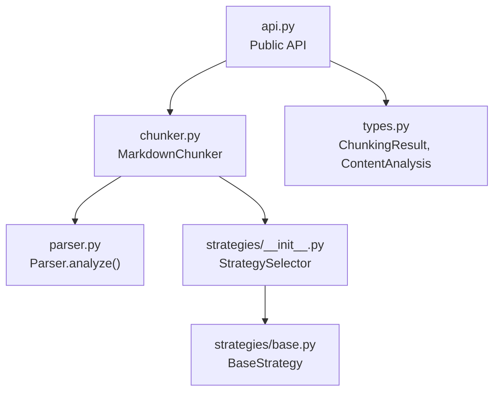
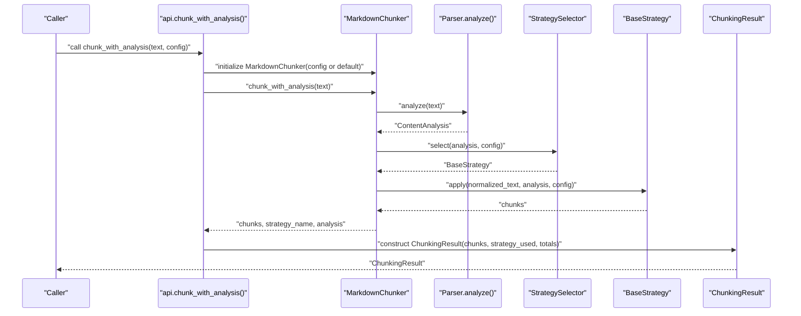
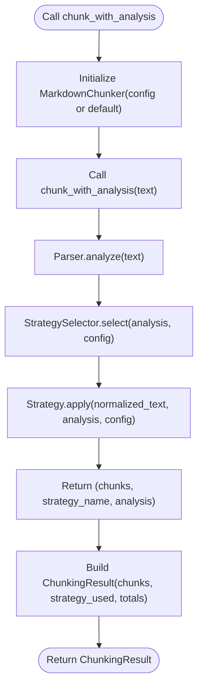
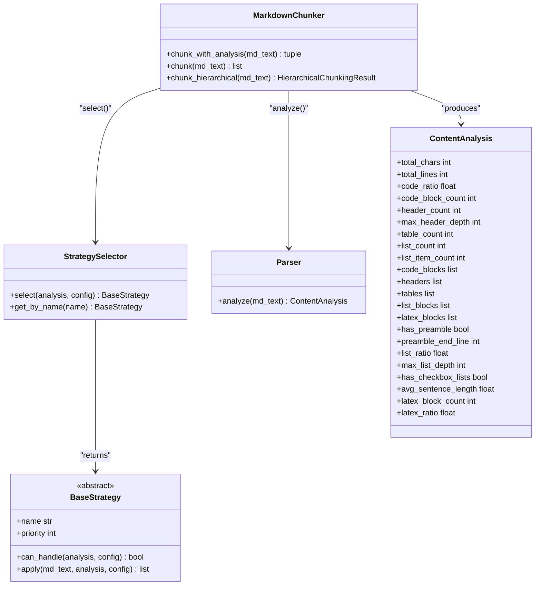
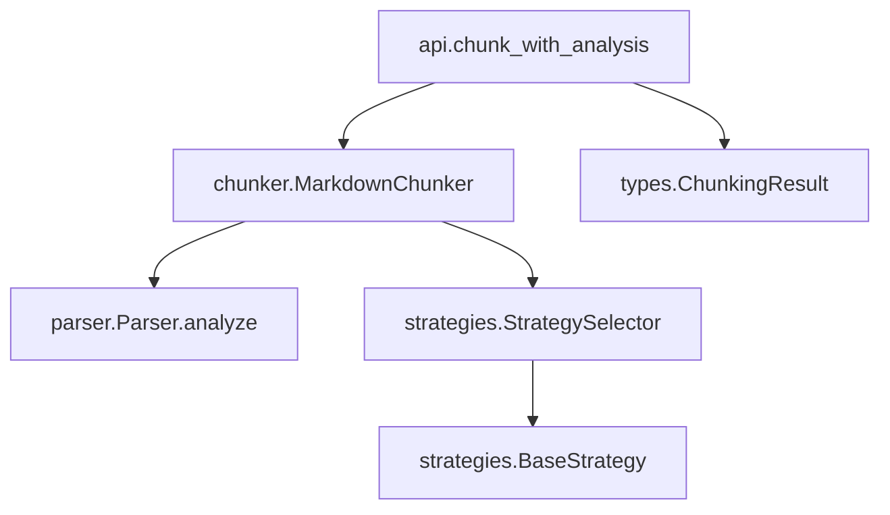

# chunk_with_analysis

<cite>
**Referenced Files in This Document**
- [__init__.py](file://src/chunkana/__init__.py)
- [api.py](file://src/chunkana/api.py)
- [chunker.py](file://src/chunkana/chunker.py)
- [types.py](file://src/chunkana/types.py)
- [strategies/__init__.py](file://src/chunkana/strategies/__init__.py)
- [strategies/base.py](file://src/chunkana/strategies/base.py)
- [parser.py](file://src/chunkana/parser.py)
- [README.md](file://README.md)
- [docs/strategies.md](file://docs/strategies.md)
- [MIGRATION_GUIDE.md](file://MIGRATION_GUIDE.md)
</cite>

## Table of Contents
1. [Introduction](#introduction)
2. [Project Structure](#project-structure)
3. [Core Components](#core-components)
4. [Architecture Overview](#architecture-overview)
5. [Detailed Component Analysis](#detailed-component-analysis)
6. [Dependency Analysis](#dependency-analysis)
7. [Performance Considerations](#performance-considerations)
8. [Troubleshooting Guide](#troubleshooting-guide)
9. [Conclusion](#conclusion)

## Introduction
This document provides comprehensive API documentation for the chunk_with_analysis() function. It explains the function’s purpose, return type ChunkingResult, and how it exposes processing metadata for visibility and performance monitoring. It also details the internal workflow that uses MarkdownChunker.chunk_with_analysis() to obtain both chunks and ContentAnalysis, and how strategy selection influences the output. Practical examples show how to access the selected strategy and processing statistics, along with guidance on interpreting strategy_used in relation to document characteristics.

## Project Structure
The chunk_with_analysis() function is part of the public API and delegates to the core chunker. The key modules involved are:
- Public API wrapper: api.py
- Core chunker: chunker.py
- Types and return models: types.py
- Strategy selection: strategies/__init__.py
- Strategy base class: strategies/base.py
- Document parser and analysis: parser.py
- Package exports: __init__.py

**Diagram sources**
- [api.py](file://src/chunkana/api.py#L70-L104)
- [chunker.py](file://src/chunkana/chunker.py#L191-L216)
- [parser.py](file://src/chunkana/parser.py#L44-L121)
- [strategies/__init__.py](file://src/chunkana/strategies/__init__.py#L20-L68)
- [strategies/base.py](file://src/chunkana/strategies/base.py#L15-L118)
- [types.py](file://src/chunkana/types.py#L432-L478)

**Section sources**
- [__init__.py](file://src/chunkana/__init__.py#L24-L67)
- [README.md](file://README.md#L1-L60)

## Core Components
- chunk_with_analysis(text, config=None) -> ChunkingResult
  - Returns a structured result containing:
    - chunks: List[Chunk]
    - strategy_used: str (name of the selected strategy)
    - processing_time: float (placeholder; not populated by this function)
    - total_chars: int (from ContentAnalysis)
    - total_lines: int (from ContentAnalysis)
- Internal workflow:
  - MarkdownChunker.chunk_with_analysis(text) returns (chunks, strategy_name, analysis)
  - api.chunk_with_analysis constructs ChunkingResult with strategy_used and totals from analysis

Key return type details:
- ChunkingResult fields: chunks, strategy_used, processing_time, total_chars, total_lines
- Chunk metadata includes strategy used for each chunk

**Section sources**
- [api.py](file://src/chunkana/api.py#L70-L104)
- [types.py](file://src/chunkana/types.py#L432-L478)
- [chunker.py](file://src/chunkana/chunker.py#L191-L216)

## Architecture Overview
The function integrates parsing, strategy selection, and chunk generation, then packages the results into a standardized structure with metadata.

**Diagram sources**
- [api.py](file://src/chunkana/api.py#L70-L104)
- [chunker.py](file://src/chunkana/chunker.py#L191-L216)
- [parser.py](file://src/chunkana/parser.py#L44-L121)
- [strategies/__init__.py](file://src/chunkana/strategies/__init__.py#L20-L68)
- [strategies/base.py](file://src/chunkana/strategies/base.py#L15-L118)
- [types.py](file://src/chunkana/types.py#L432-L478)

## Detailed Component Analysis

### Function: chunk_with_analysis()
- Purpose: Provide chunking results with processing metadata for observability and performance monitoring.
- Inputs:
  - text: Markdown text to chunk
  - config: Optional ChunkerConfig (defaults applied if None)
- Outputs:
  - ChunkingResult with:
    - chunks: List[Chunk]
    - strategy_used: str (strategy name)
    - processing_time: float (always 0.0 in current implementation)
    - total_chars: int (from ContentAnalysis)
    - total_lines: int (from ContentAnalysis)

Implementation highlights:
- Delegates to MarkdownChunker.chunk_with_analysis() to obtain chunks, strategy name, and ContentAnalysis.
- Constructs ChunkingResult with strategy_used and totals copied from analysis.
- Strategy name is taken from strategy.name returned by the selected strategy.

**Diagram sources**
- [api.py](file://src/chunkana/api.py#L70-L104)
- [chunker.py](file://src/chunkana/chunker.py#L191-L216)
- [parser.py](file://src/chunkana/parser.py#L44-L121)
- [strategies/__init__.py](file://src/chunkana/strategies/__init__.py#L20-L68)
- [strategies/base.py](file://src/chunkana/strategies/base.py#L15-L118)
- [types.py](file://src/chunkana/types.py#L432-L478)

**Section sources**
- [api.py](file://src/chunkana/api.py#L70-L104)
- [chunker.py](file://src/chunkana/chunker.py#L191-L216)
- [types.py](file://src/chunkana/types.py#L432-L478)

### Return Type: ChunkingResult
- fields:
  - chunks: List[Chunk]
  - strategy_used: str
  - processing_time: float (default 0.0)
  - total_chars: int
  - total_lines: int
- helpers:
  - chunk_count: number of chunks
  - total_output_size: sum of chunk sizes
  - to_dict/from_dict: serialization helpers

Accessing fields:
- Access strategy_used to determine which strategy was selected.
- Use total_chars and total_lines to monitor input size characteristics.
- Use chunk_count and total_output_size to assess chunking outcomes.

**Section sources**
- [types.py](file://src/chunkana/types.py#L432-L478)

### Internal Workflow: MarkdownChunker.chunk_with_analysis()
- Returns a tuple of (chunks, strategy_name, analysis) where:
  - chunks: list of Chunk instances
  - strategy_name: str (strategy name)
  - analysis: ContentAnalysis | None
- The chunker performs:
  - Preprocessing
  - Parser.analyze() to compute ContentAnalysis
  - StrategySelector.select() to pick a strategy
  - Strategy.apply() to produce chunks
  - Optional overlap application and validation
  - Returns the tuple for the API wrapper to construct ChunkingResult

**Diagram sources**
- [chunker.py](file://src/chunkana/chunker.py#L191-L216)
- [strategies/__init__.py](file://src/chunkana/strategies/__init__.py#L20-L68)
- [strategies/base.py](file://src/chunkana/strategies/base.py#L15-L118)
- [parser.py](file://src/chunkana/parser.py#L44-L121)
- [types.py](file://src/chunkana/types.py#L182-L239)

**Section sources**
- [chunker.py](file://src/chunkana/chunker.py#L191-L216)
- [parser.py](file://src/chunkana/parser.py#L44-L121)
- [strategies/__init__.py](file://src/chunkana/strategies/__init__.py#L20-L68)
- [strategies/base.py](file://src/chunkana/strategies/base.py#L15-L118)
- [types.py](file://src/chunkana/types.py#L182-L239)

### Strategy Selection Behavior and Interpretation
- StrategySelector chooses among CodeAware, ListAware, Structural, and Fallback based on ContentAnalysis and thresholds.
- Valid strategy_override values are documented in the migration guide and strategies documentation.
- The selected strategy name is exposed via strategy_used and also recorded in each chunk’s metadata.

Interpretation guidelines:
- CodeAware: Documents with code blocks or tables; preserves atomic blocks.
- ListAware: List-heavy documents; preserves list integrity.
- Structural: Documents with hierarchical headers; splits on header boundaries.
- Fallback: Plain text; splits by paragraphs and groups to fit size limits.

Cross-references:
- Strategy selection logic and thresholds: docs/strategies.md
- Strategy override configuration: MIGRATION_GUIDE.md
- Strategy metadata in chunks: docs/strategies.md

**Section sources**
- [strategies/__init__.py](file://src/chunkana/strategies/__init__.py#L20-L68)
- [docs/strategies.md](file://docs/strategies.md#L1-L82)
- [MIGRATION_GUIDE.md](file://MIGRATION_GUIDE.md#L268-L277)

### Examples: How to Use chunk_with_analysis()
- Access the selected strategy:
  - result = chunk_with_analysis(text)
  - strategy = result.strategy_used
- Access processing totals:
  - total_chars = result.total_chars
  - total_lines = result.total_lines
- Inspect individual chunks’ strategy metadata:
  - strategy_per_chunk = chunks[0].metadata.get("strategy")

These examples demonstrate how to retrieve and interpret the strategy_used field and totals for debugging, performance optimization, and understanding strategy selection behavior.

**Section sources**
- [api.py](file://src/chunkana/api.py#L70-L104)
- [docs/strategies.md](file://docs/strategies.md#L73-L82)

## Dependency Analysis
- chunk_with_analysis depends on:
  - MarkdownChunker.chunk_with_analysis for the core chunking and analysis
  - Parser.analyze for ContentAnalysis
  - StrategySelector for strategy selection
  - BaseStrategy for applying the chosen strategy
  - ChunkingResult for packaging results

**Diagram sources**
- [api.py](file://src/chunkana/api.py#L70-L104)
- [chunker.py](file://src/chunkana/chunker.py#L191-L216)
- [parser.py](file://src/chunkana/parser.py#L44-L121)
- [strategies/__init__.py](file://src/chunkana/strategies/__init__.py#L20-L68)
- [strategies/base.py](file://src/chunkana/strategies/base.py#L15-L118)
- [types.py](file://src/chunkana/types.py#L432-L478)

**Section sources**
- [api.py](file://src/chunkana/api.py#L70-L104)
- [chunker.py](file://src/chunkana/chunker.py#L191-L216)
- [parser.py](file://src/chunkana/parser.py#L44-L121)
- [strategies/__init__.py](file://src/chunkana/strategies/__init__.py#L20-L68)
- [strategies/base.py](file://src/chunkana/strategies/base.py#L15-L118)
- [types.py](file://src/chunkana/types.py#L432-L478)

## Performance Considerations
- chunk_with_analysis() returns a structured result suitable for monitoring and logging. While processing_time is set to 0.0 in the current implementation, you can wrap calls with a timer externally to measure execution duration.
- Strategy selection and parsing are deterministic and depend on document characteristics. Use strategy_used to understand whether the document triggered CodeAware, ListAware, Structural, or Fallback behavior.
- total_chars and total_lines provide insight into input size characteristics, which can help tune chunk sizes and overlaps.

[No sources needed since this section provides general guidance]

## Troubleshooting Guide
Common issues and resolutions:
- Unexpected strategy selection:
  - Verify ContentAnalysis metrics (code_ratio, list_ratio, header_count, table_count) influence selection.
  - Use strategy_override to force a specific strategy for debugging.
- Oversized chunks:
  - Some strategies intentionally allow oversized chunks to preserve atomic blocks. Check chunk metadata for allow_oversize and oversize_reason.
- Inconsistent totals:
  - total_chars and total_lines come from ContentAnalysis. Ensure the input text is normalized and free of extraneous whitespace that might skew totals.

Guidance:
- Use docs/strategies.md to understand thresholds and selection behavior.
- Use MIGRATION_GUIDE.md to configure strategy_override correctly.

**Section sources**
- [docs/strategies.md](file://docs/strategies.md#L1-L82)
- [MIGRATION_GUIDE.md](file://MIGRATION_GUIDE.md#L268-L277)
- [strategies/base.py](file://src/chunkana/strategies/base.py#L90-L118)

## Conclusion
chunk_with_analysis() provides a standardized way to obtain chunking results with rich metadata, enabling visibility into strategy selection and input characteristics. By accessing strategy_used and totals, you can debug chunking behavior, optimize performance, and understand how document features influence strategy choice. The function delegates to MarkdownChunker.chunk_with_analysis(), which integrates parsing, strategy selection, and chunk generation, then packages the outcome into ChunkingResult for easy consumption.