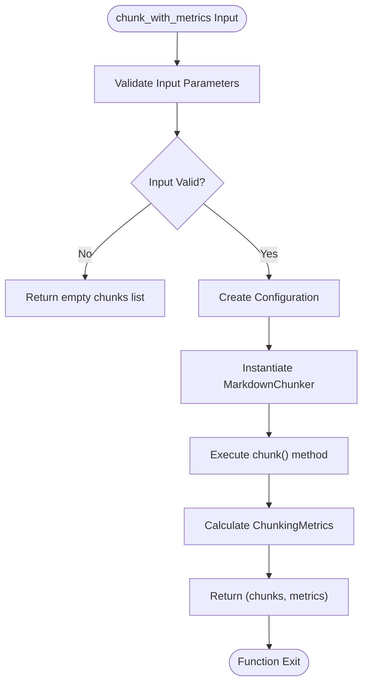
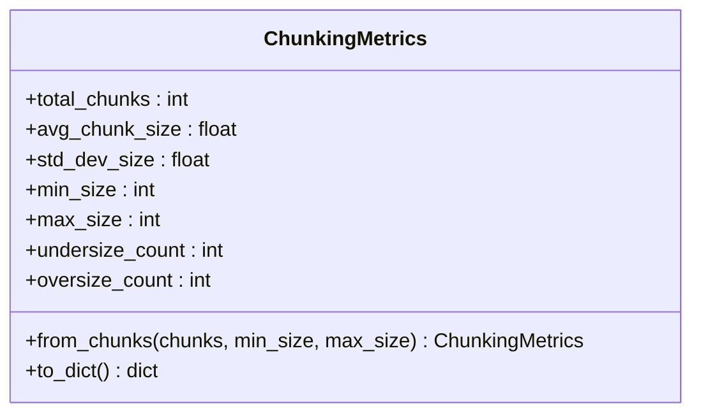
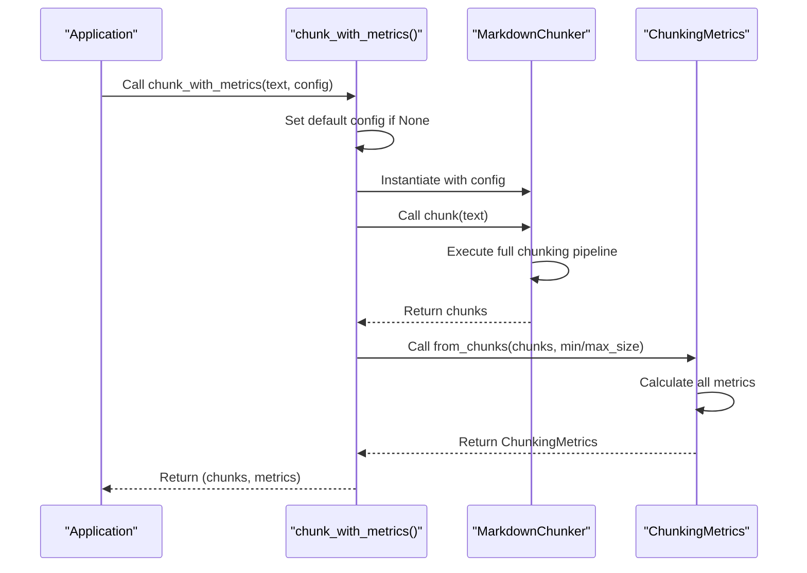
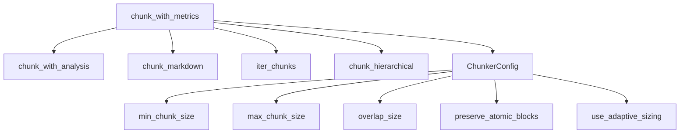

# chunk_with_metrics

<cite>
**Referenced Files in This Document**   
- [api.py](file://src/chunkana/api.py#L105-L135)
- [chunker.py](file://src/chunkana/chunker.py#L177-L188)
- [types.py](file://src/chunkana/types.py#L376-L428)
- [config.py](file://src/chunkana/config.py#L18-L127)
</cite>

## Table of Contents
1. [Introduction](#introduction)
2. [Function Signature and Return Value](#function-signature-and-return-value)
3. [ChunkingMetrics Fields](#chunkingmetrics-fields)
4. [Implementation Details](#implementation-details)
5. [Usage Examples](#usage-examples)
6. [Common Use Cases](#common-use-cases)
7. [Related Functions and Configuration](#related-functions-and-configuration)
8. [Troubleshooting](#troubleshooting)
9. [Performance Considerations](#performance-considerations)

## Introduction

The `chunk_with_metrics()` function is a core utility in the chunkana library that provides both chunked content and comprehensive quality assessment metrics. This function enables developers and system administrators to evaluate the effectiveness of the chunking process, optimize configuration parameters, and ensure high-quality output for retrieval-augmented generation (RAG) systems. By returning a tuple of chunks and metrics, it facilitates data-driven decisions in document processing workflows.

**Section sources**
- [api.py](file://src/chunkana/api.py#L105-L135)

## Function Signature and Return Value

The `chunk_with_metrics()` function accepts a string of Markdown text and an optional configuration object, returning a tuple containing the generated chunks and quality metrics. The function signature is:

```python
def chunk_with_metrics(
    text: str,
    config: ChunkerConfig | None = None,
) -> tuple[list[Chunk], ChunkingMetrics]:
```

This function returns a tuple where the first element is a list of `Chunk` objects containing the semantic segments of the input text, and the second element is a `ChunkingMetrics` object that provides statistical analysis of the chunking results. When no configuration is provided, the function uses default settings defined in `ChunkerConfig.default()`.



**Diagram sources**
- [api.py](file://src/chunkana/api.py#L105-L135)
- [chunker.py](file://src/chunkana/chunker.py#L177-L188)

**Section sources**
- [api.py](file://src/chunkana/api.py#L105-L135)

## ChunkingMetrics Fields

The `ChunkingMetrics` class provides seven key fields that quantify the quality and characteristics of the chunking process:

- **total_chunks**: Integer representing the total number of chunks generated
- **avg_chunk_size**: Float representing the average size of chunks in characters
- **std_dev_size**: Float representing the standard deviation of chunk sizes, indicating size consistency
- **min_size**: Integer representing the size of the smallest chunk in characters
- **max_size**: Integer representing the size of the largest chunk in characters
- **undersize_count**: Integer counting chunks smaller than the configured `min_chunk_size`
- **oversize_count**: Integer counting chunks larger than the configured `max_chunk_size`

These metrics are calculated from the actual chunk sizes and compared against the configuration parameters to provide actionable insights into the chunking quality. The metrics help identify potential issues such as excessive fragmentation (high undersize_count) or oversized chunks that may exceed model context limits (high oversize_count).



**Diagram sources**
- [types.py](file://src/chunkana/types.py#L376-L428)

**Section sources**
- [types.py](file://src/chunkana/types.py#L376-L428)

## Implementation Details

The `chunk_with_metrics()` function implements a two-step process: first creating chunks using the `MarkdownChunker` class, then calculating metrics from the resulting chunks. The implementation uses the `MarkdownChunker` to process the input text according to the specified configuration, which includes parsing the Markdown, selecting an appropriate chunking strategy, applying the strategy, merging small chunks, and validating the results.

After chunking, the function calls `ChunkingMetrics.from_chunks()` to analyze the chunk sizes and generate the quality metrics. This method calculates the average size, standard deviation, minimum and maximum sizes, and counts chunks that fall outside the configured size bounds. The metrics calculation is performed efficiently in a single pass through the chunk list, making it suitable for large documents.

The chunking pipeline includes several stages: text preprocessing, parsing, adaptive size calculation (if enabled), strategy selection, strategy application, small chunk merging, overlap application (if enabled), metadata addition, and validation. Each stage contributes to the final quality of the chunks and the accuracy of the metrics.



**Diagram sources**
- [api.py](file://src/chunkana/api.py#L105-L135)
- [chunker.py](file://src/chunkana/chunker.py#L84-L175)
- [types.py](file://src/chunkana/types.py#L393-L417)

**Section sources**
- [api.py](file://src/chunkana/api.py#L105-L135)
- [chunker.py](file://src/chunkana/chunker.py#L84-L175)
- [types.py](file://src/chunkana/types.py#L393-L417)

## Usage Examples

The `chunk_with_metrics()` function can be used to evaluate and optimize chunking configurations. Here are practical examples demonstrating how to use the metrics for different purposes:

```python
# Basic usage
chunks, metrics = chunk_with_metrics(text)
print(f"Generated {metrics.total_chunks} chunks")
print(f"Average size: {metrics.avg_chunk_size:.1f} chars")
print(f"Size range: {metrics.min_size}-{metrics.max_size} chars")
print(f"Std dev: {metrics.std_dev_size:.1f}")
print(f"Undersize chunks: {metrics.undersize_count}")
print(f"Oversize chunks: {metrics.oversize_count}")

# Configuration optimization
def evaluate_configuration(text, config):
    chunks, metrics = chunk_with_metrics(text, config)
    
    # Score configuration based on metrics
    size_balance = 1.0 - (metrics.std_dev_size / config.max_chunk_size)
    undersize_penalty = metrics.undersize_count * 0.1
    oversize_penalty = metrics.oversize_count * 0.2
    
    score = size_balance - undersize_penalty - oversize_penalty
    return metrics, score

# Test different min/max size combinations
configs = [
    ChunkerConfig(min_chunk_size=256, max_chunk_size=1024),
    ChunkerConfig(min_chunk_size=512, max_chunk_size=2048),
    ChunkerConfig(min_chunk_size=1024, max_chunk_size=4096),
]

best_config = None
best_score = -float('inf')

for config in configs:
    metrics, score = evaluate_configuration(text, config)
    if score > best_score:
        best_score = score
        best_config = config
    
    print(f"Config {config.min_chunk_size}/{config.max_chunk_size}: "
          f"Score={score:.3f}, Chunks={metrics.total_chunks}, "
          f"Undersize={metrics.undersize_count}, Oversize={metrics.oversize_count}")
```

These examples show how the metrics can be used to compare different configurations and select the optimal settings for a given document or use case.

**Section sources**
- [api.py](file://src/chunkana/api.py#L105-L135)

## Common Use Cases

The `chunk_with_metrics()` function serves several important use cases in document processing workflows. One primary use case is optimizing min/max chunk size settings by analyzing the distribution of chunk sizes and adjusting parameters to minimize both undersized and oversized chunks. By examining the `std_dev_size` metric, users can identify configurations that produce more consistent chunk sizes, which often leads to better retrieval performance.

Another common use case is validating chunking quality, particularly when processing new document types or domains. The metrics provide objective measures to ensure that the chunking process is working as expected, with low counts of undersized and oversized chunks indicating good quality. This is especially important when integrating the library into production systems where consistent output quality is critical.

The function is also valuable for benchmarking different chunking strategies. By comparing metrics across different configurations or strategy overrides, users can determine which approach works best for their specific content types. For example, code-heavy documents might benefit from larger chunk sizes, while list-heavy documents might require different settings to avoid fragmentation.

Additionally, the metrics can be used for automated quality assurance in CI/CD pipelines, where threshold checks on metrics like `oversize_count` or `std_dev_size` can prevent deployment of configurations that produce poor-quality chunks.

**Section sources**
- [api.py](file://src/chunkana/api.py#L105-L135)
- [config.py](file://src/chunkana/config.py#L18-L127)

## Related Functions and Configuration

The `chunk_with_metrics()` function is part of a suite of related functions that provide different levels of information about the chunking process. It is closely related to `chunk_with_analysis()`, which returns chunks along with strategy information and document analysis, providing insights into why certain chunking decisions were made. Both functions build upon the core `chunk()` method of the `MarkdownChunker` class.

Configuration options significantly affect the chunking process and resulting metrics. Key parameters include `min_chunk_size` and `max_chunk_size`, which define the acceptable range for chunk sizes and directly impact the `undersize_count` and `oversize_count` metrics. The `overlap_size` parameter affects how chunks are connected, while `preserve_atomic_blocks` ensures that code blocks and tables remain intact, potentially creating larger chunks.

Advanced configuration options like `use_adaptive_sizing` can dynamically adjust chunk sizes based on content complexity, which will be reflected in the metrics. Strategy selection thresholds such as `code_threshold` and `structure_threshold` influence which chunking strategy is selected, affecting the overall chunking pattern and metrics. Understanding these configuration options is essential for interpreting the metrics and making informed adjustments.



**Diagram sources**
- [api.py](file://src/chunkana/api.py#L105-L135)
- [config.py](file://src/chunkana/config.py#L18-L127)

**Section sources**
- [api.py](file://src/chunkana/api.py#L105-L135)
- [config.py](file://src/chunkana/config.py#L18-L127)

## Troubleshooting

When encountering unexpected metric values, several common issues should be investigated. High `undersize_count` values may indicate that the `min_chunk_size` is set too high for the content, or that the document contains many small structural elements that cannot be merged. In such cases, consider lowering the `min_chunk_size` or examining whether the `merge_small_chunks` functionality is working as expected.

High `oversize_count` values typically occur when atomic blocks like large code blocks or tables exceed the `max_chunk_size`. This is often intentional to preserve content integrity, but if problematic, consider enabling `adaptive_sizing` or adjusting the `max_chunk_size`. Very high `std_dev_size` values suggest inconsistent chunk sizes, which might be addressed by adjusting strategy selection thresholds or using adaptive sizing.

If the `total_chunks` count seems unexpectedly high or low, verify the input text and check for issues with the parsing stage. Empty or nearly empty chunks might indicate problems with the chunking strategy or document structure. The `validate_chunks()` function can be used to check for invariant violations that might affect chunk quality.

Performance issues with metrics calculation are rare since it's a simple statistical analysis of the chunk list, but for extremely large documents, consider using `iter_chunks()` for memory efficiency and calculating metrics incrementally.

**Section sources**
- [api.py](file://src/chunkana/api.py#L105-L135)
- [chunker.py](file://src/chunkana/chunker.py#L430-L468)
- [types.py](file://src/chunkana/types.py#L400-L417)

## Performance Considerations

The performance impact of calculating metrics with `chunk_with_metrics()` is minimal, as the metrics computation involves a single pass through the chunk list to collect size statistics. The time complexity is O(n) where n is the number of chunks, making it efficient even for large documents with many chunks. The memory overhead is also negligible, as only a few scalar values are stored in the `ChunkingMetrics` object.

However, the overall performance of `chunk_with_metrics()` is dominated by the chunking process itself, not the metrics calculation. For large documents, the chunking pipeline involving parsing, strategy application, and post-processing represents the primary performance consideration. When processing very large documents, consider using the streaming interfaces like `chunk_file_streaming()` to manage memory usage.

The metrics calculation does require storing all chunks in memory before analysis, so for memory-constrained environments processing extremely large documents, it may be preferable to use streaming chunking and calculate metrics incrementally. In most practical scenarios, the performance difference between `chunk_with_metrics()` and basic chunking is negligible, making the additional insights well worth the minimal overhead.

**Section sources**
- [api.py](file://src/chunkana/api.py#L105-L135)
- [types.py](file://src/chunkana/types.py#L400-L417)
- [chunker.py](file://src/chunkana/chunker.py#L84-L175)