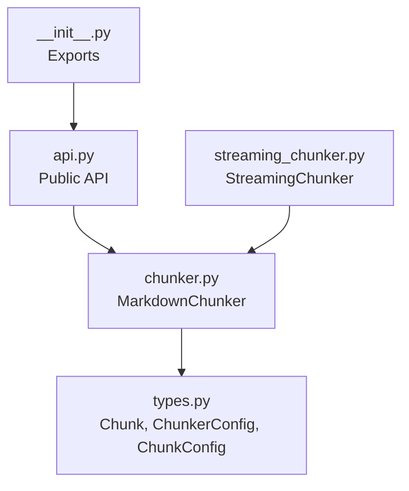
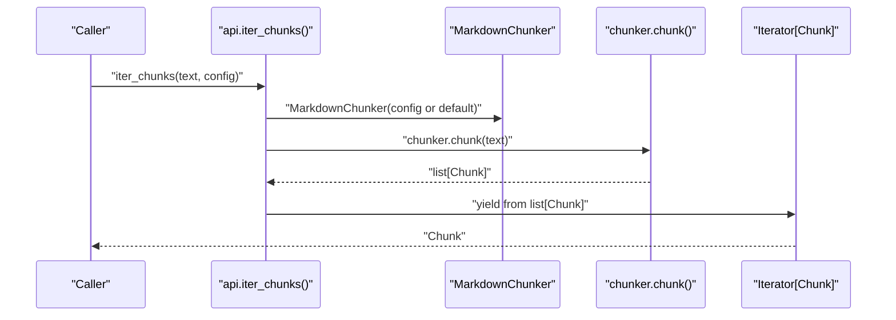
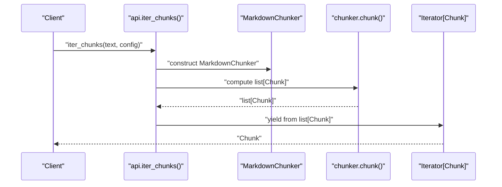
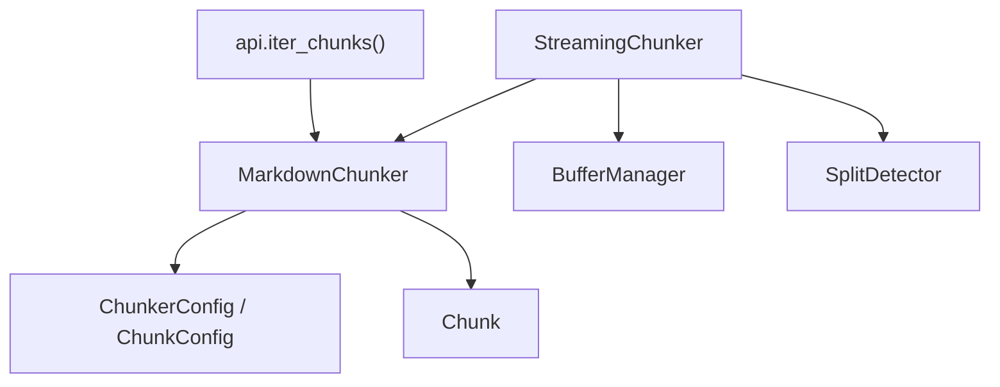

# iter_chunks

<cite>
**Referenced Files in This Document**
- [__init__.py](file://src/chunkana/__init__.py)
- [api.py](file://src/chunkana/api.py)
- [chunker.py](file://src/chunkana/chunker.py)
- [streaming_chunker.py](file://src/chunkana/streaming/streaming_chunker.py)
- [types.py](file://src/chunkana/types.py)
- [config.py](file://src/chunkana/config.py)
- [test_streaming.py](file://tests/unit/test_streaming.py)
</cite>

## Table of Contents
1. [Introduction](#introduction)
2. [Project Structure](#project-structure)
3. [Core Components](#core-components)
4. [Architecture Overview](#architecture-overview)
5. [Detailed Component Analysis](#detailed-component-analysis)
6. [Dependency Analysis](#dependency-analysis)
7. [Performance Considerations](#performance-considerations)
8. [Troubleshooting Guide](#troubleshooting-guide)
9. [Conclusion](#conclusion)
10. [Appendices](#appendices)

## Introduction
This document provides detailed API documentation for the iter_chunks() function, which offers a memory-efficient generator-based approach to iterating over chunks of Markdown text. It explains the generator pattern that yields Chunk objects one at a time, highlights the parameters text and config, and clarifies the current implementation limitation where all chunks are computed and held in memory before yielding. It also outlines the planned enhancement for true streaming and compares iter_chunks() with chunk_file_streaming() for large files. Guidance is included for integrating iter_chunks() into data processing pipelines and streaming architectures.

## Project Structure
The iter_chunks() function is part of the public API and delegates to the core chunking engine. The relevant files are organized as follows:
- Public API surface: api.py defines convenience functions including iter_chunks().
- Core chunking engine: chunker.py implements the MarkdownChunker class and its chunk() method.
- Streaming chunker: streaming_chunker.py implements a streaming pipeline for large files.
- Types and configuration: types.py defines the Chunk dataclass and related types; config.py defines ChunkerConfig and ChunkConfig.

**Diagram sources**
- [api.py](file://src/chunkana/api.py#L138-L163)
- [chunker.py](file://src/chunkana/chunker.py#L85-L176)
- [streaming_chunker.py](file://src/chunkana/streaming/streaming_chunker.py#L18-L99)
- [types.py](file://src/chunkana/types.py#L240-L376)
- [__init__.py](file://src/chunkana/__init__.py#L24-L67)

**Section sources**
- [__init__.py](file://src/chunkana/__init__.py#L24-L67)
- [api.py](file://src/chunkana/api.py#L138-L163)
- [chunker.py](file://src/chunkana/chunker.py#L85-L176)
- [streaming_chunker.py](file://src/chunkana/streaming/streaming_chunker.py#L18-L99)
- [types.py](file://src/chunkana/types.py#L240-L376)

## Core Components
- iter_chunks(text, config): Generator that yields Chunk objects one at a time. Internally, it constructs a MarkdownChunker and yields from chunker.chunk(text). The current implementation computes all chunks first and then yields them, which is not truly streaming.
- MarkdownChunker.chunk(text): The core chunking pipeline that parses, selects a strategy, applies it, merges small chunks, applies overlap, recalculates metadata, and validates. It returns a list[Chunk].
- StreamingChunker.chunk_file()/chunk_stream(): True streaming implementation for large files that processes input in buffer windows and yields chunks incrementally.

Key types:
- Chunk: The dataclass representing a chunk with content, positional metadata, and rich metadata fields.
- ChunkerConfig and ChunkConfig: Configuration objects controlling chunking behavior.

**Section sources**
- [api.py](file://src/chunkana/api.py#L138-L163)
- [chunker.py](file://src/chunkana/chunker.py#L85-L176)
- [streaming_chunker.py](file://src/chunkana/streaming/streaming_chunker.py#L43-L99)
- [types.py](file://src/chunkana/types.py#L240-L376)

## Architecture Overview
The iter_chunks() function sits at the API boundary and forwards to the core chunking engine. The core engine performs a deterministic pipeline to produce a list of chunks. StreamingChunker provides a separate, memory-efficient path for large files by processing input in windows and yielding chunks incrementally.

**Diagram sources**
- [api.py](file://src/chunkana/api.py#L138-L163)
- [chunker.py](file://src/chunkana/chunker.py#L85-L176)

## Detailed Component Analysis

### iter_chunks() API Definition
- Purpose: Provide a generator interface to iterate over chunks one at a time for memory efficiency.
- Parameters:
  - text: Markdown input string to be chunked.
  - config: Optional ChunkerConfig object to control chunking behavior.
- Returns: An iterator of Chunk objects.
- Behavior: Constructs a MarkdownChunker with the provided or default configuration, computes all chunks via chunker.chunk(text), and yields them one by one.

Current implementation note: The function currently computes the entire list of chunks before yielding them. This is not true streaming and still loads all chunks into memory. A TODO comment in the function explicitly notes the need to implement true streaming in the chunker.

Integration note: The function is exported via the package’s public API surface.

**Section sources**
- [api.py](file://src/chunkana/api.py#L138-L163)
- [__init__.py](file://src/chunkana/__init__.py#L24-L67)

### MarkdownChunker.chunk() Pipeline
- Input preprocessing and normalization.
- Parsing and analysis of the Markdown document.
- Adaptive sizing calculation (optional).
- Strategy selection and application.
- Small chunk merging and header handling.
- Overlap metadata application (metadata-only overlap).
- Metadata recalculation and validation.

This pipeline produces a list[Chunk] that iter_chunks() then yields.

**Section sources**
- [chunker.py](file://src/chunkana/chunker.py#L85-L176)

### StreamingChunker.chunk_stream() (True Streaming)
- Reads input in buffer windows with overlap.
- Applies the base chunker to each window.
- Yields chunks incrementally with streaming metadata (window index, chunk index, bytes processed).
- Preserves atomic blocks (code, tables) and maintains invariants across windows.

This is the recommended approach for large files where memory conservation is critical.

**Section sources**
- [streaming_chunker.py](file://src/chunkana/streaming/streaming_chunker.py#L43-L99)

### Chunk Data Model
- Chunk: Contains content, positional metadata (start_line, end_line), and a metadata dict with fields such as strategy, header_path, header_level, small_chunk flags, and overlap metadata.
- ChunkingResult and ChunkingMetrics: Supporting types for richer results and metrics.

These types define the structure yielded by both iter_chunks() and streaming pipelines.

**Section sources**
- [types.py](file://src/chunkana/types.py#L240-L376)

### API Workflow Diagram

**Diagram sources**
- [api.py](file://src/chunkana/api.py#L138-L163)
- [chunker.py](file://src/chunkana/chunker.py#L85-L176)

### Implementation Limitation and TODO
- Current behavior: iter_chunks() computes all chunks via chunker.chunk(text) and then yields them. This is not streaming; all chunks are loaded into memory before iteration begins.
- TODO: The function includes a TODO comment indicating that true streaming support should be implemented in the underlying chunker.

This limitation affects memory usage for very large inputs because the entire list of chunks is materialized before yielding.

**Section sources**
- [api.py](file://src/chunkana/api.py#L138-L163)

### When to Use iter_chunks() vs chunk_file_streaming()
- Use iter_chunks() when:
  - Working with moderately sized Markdown strings in memory.
  - You want a simple generator interface that yields Chunk objects.
  - You do not need true streaming and can afford to hold all chunks in memory temporarily.
- Use chunk_file_streaming() when:
  - Processing large files (>10MB) where memory conservation is critical.
  - You need true streaming with buffer windows and streaming metadata.
  - You require guarantees about memory usage and line coverage across windows.

The streaming variant is designed for large files and provides streaming metadata that helps track chunk and window positions.

**Section sources**
- [api.py](file://src/chunkana/api.py#L228-L271)
- [streaming_chunker.py](file://src/chunkana/streaming/streaming_chunker.py#L43-L99)

### Incremental Processing Patterns
- Iterate over chunks one at a time to process them incrementally without storing the entire list in memory.
- Use the metadata fields (e.g., header_path, strategy, overlap metadata) to drive downstream processing decisions.
- For streaming scenarios, leverage streaming metadata (stream_chunk_index, stream_window_index, bytes_processed) to track progress and manage resources.

**Section sources**
- [api.py](file://src/chunkana/api.py#L138-L163)
- [types.py](file://src/chunkana/types.py#L240-L376)

### Integration with Pipelines and Streaming Architectures
- iter_chunks() integrates naturally with data processing pipelines that consume iterators and process items incrementally.
- StreamingChunker is designed for streaming architectures where input is consumed in chunks and processed without loading the entire file into memory.
- Streaming metadata supports observability and resource management in distributed or constrained environments.

**Section sources**
- [streaming_chunker.py](file://src/chunkana/streaming/streaming_chunker.py#L43-L99)
- [test_streaming.py](file://tests/unit/test_streaming.py#L54-L362)

## Dependency Analysis
- iter_chunks() depends on MarkdownChunker and ChunkerConfig.
- MarkdownChunker depends on parsers, strategies, and configuration to produce a list[Chunk].
- StreamingChunker depends on BufferManager, SplitDetector, and the base MarkdownChunker to implement true streaming.

**Diagram sources**
- [api.py](file://src/chunkana/api.py#L138-L163)
- [chunker.py](file://src/chunkana/chunker.py#L85-L176)
- [streaming_chunker.py](file://src/chunkana/streaming/streaming_chunker.py#L18-L99)
- [types.py](file://src/chunkana/types.py#L240-L376)

**Section sources**
- [api.py](file://src/chunkana/api.py#L138-L163)
- [chunker.py](file://src/chunkana/chunker.py#L85-L176)
- [streaming_chunker.py](file://src/chunkana/streaming/streaming_chunker.py#L18-L99)
- [types.py](file://src/chunkana/types.py#L240-L376)

## Performance Considerations
- Memory usage:
  - iter_chunks(): Materializes the entire list[Chunk] before yielding, so peak memory equals the total size of all chunks plus overhead.
  - chunk_file_streaming(): Processes input in buffer windows, limiting memory usage to the window size plus processing overhead.
- Throughput:
  - iter_chunks(): Single-pass computation of all chunks; iteration is lightweight after the initial compute.
  - chunk_file_streaming(): Windowed processing introduces overhead from buffer management and split detection, but avoids loading the entire file.
- Overlap and metadata:
  - Both approaches apply overlap metadata (previous_content, next_content) to help downstream models understand boundaries without duplicating content in chunk.content.

Guidance:
- For large files, prefer chunk_file_streaming() to constrain memory usage.
- For moderate-sized inputs where simplicity is preferred, iter_chunks() suffices.

**Section sources**
- [api.py](file://src/chunkana/api.py#L228-L271)
- [streaming_chunker.py](file://src/chunkana/streaming/streaming_chunker.py#L43-L99)
- [chunker.py](file://src/chunkana/chunker.py#L301-L370)

## Troubleshooting Guide
- iter_chunks() yields nothing:
  - Ensure the input text is non-empty and contains meaningful Markdown content.
  - Verify that ChunkerConfig settings (e.g., min_chunk_size, max_chunk_size) are appropriate for the input.
- Unexpectedly high memory usage:
  - iter_chunks() materializes all chunks; switch to chunk_file_streaming() for large inputs.
- Streaming differences:
  - chunk_file_streaming() may produce different boundaries at buffer splits and different overlap metadata near window edges. This is documented and expected for streaming.

**Section sources**
- [api.py](file://src/chunkana/api.py#L228-L271)
- [test_streaming.py](file://tests/unit/test_streaming.py#L54-L362)

## Conclusion
iter_chunks() provides a convenient generator interface for iterating over Chunk objects, but its current implementation still loads all chunks into memory before yielding. For large files and memory-constrained environments, use chunk_file_streaming() to achieve true streaming with bounded memory usage. The TODO in iter_chunks() acknowledges the need for true streaming support in the underlying chunker. Choose the appropriate API based on input size and memory constraints, and leverage metadata fields to integrate with downstream processing pipelines.

## Appendices

### API Reference Summary
- iter_chunks(text: str, config: ChunkerConfig | None = None) -> Iterator[Chunk]
  - Yields Chunk objects one at a time.
  - Internally computes all chunks via MarkdownChunker and yields them.
  - TODO: Implement true streaming in the underlying chunker.

- chunk_file_streaming(file_path: str | Path, chunk_config: ChunkerConfig | None = None, streaming_config: StreamingConfig | None = None, encoding: str = "utf-8") -> Iterator[Chunk]
  - Memory-efficient streaming for large files.
  - Yields chunks with streaming metadata.

- Chunk: Dataclass with content, positional metadata, and metadata fields (e.g., strategy, header_path, overlap metadata).

**Section sources**
- [api.py](file://src/chunkana/api.py#L138-L163)
- [api.py](file://src/chunkana/api.py#L228-L271)
- [types.py](file://src/chunkana/types.py#L240-L376)