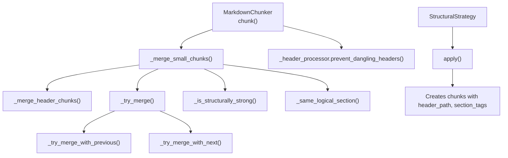
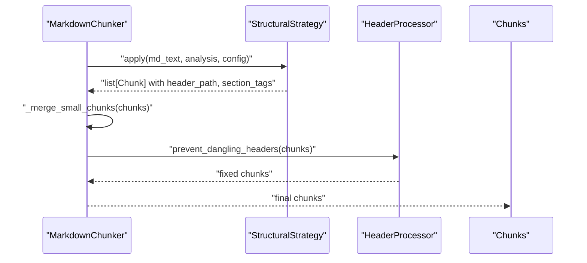
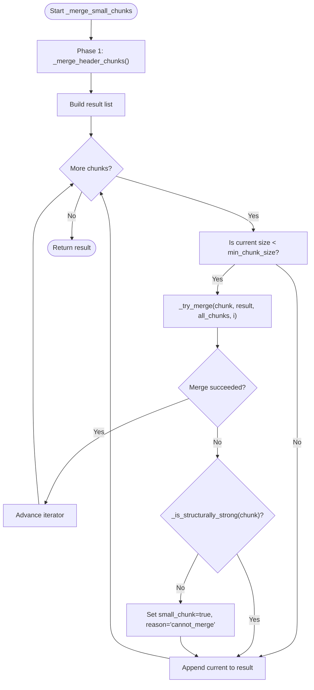
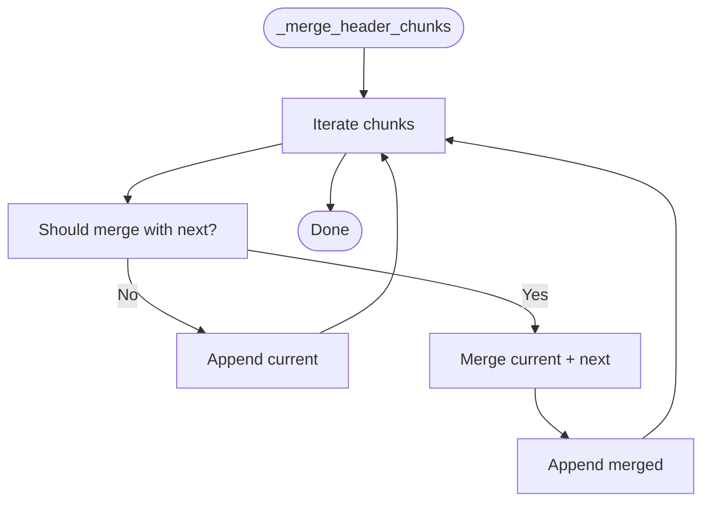
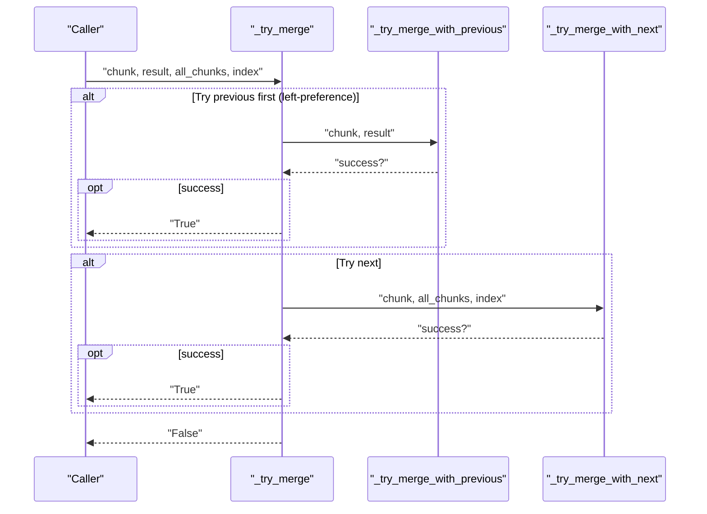
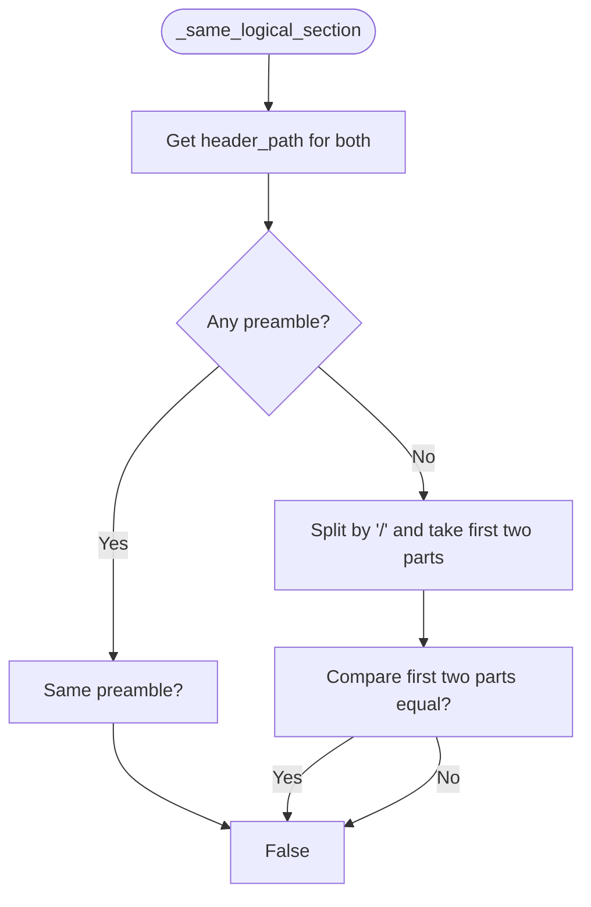
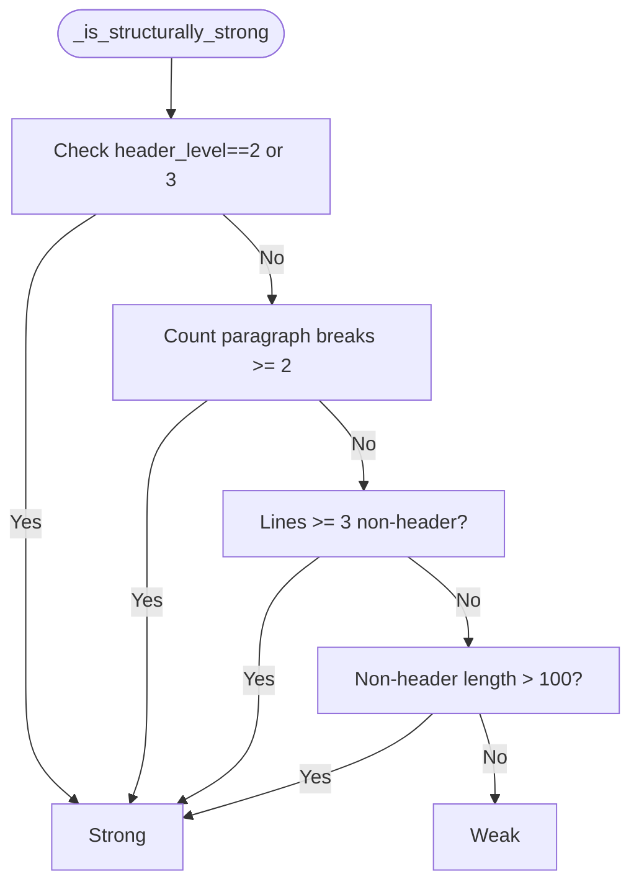
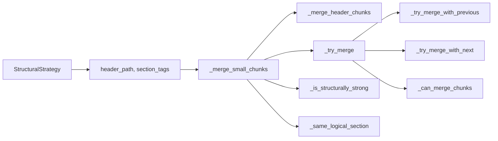

# Chunk Merging Strategies

<cite>
**Referenced Files in This Document**
- [chunker.py](file://src/chunkana/chunker.py)
- [header_processor.py](file://src/chunkana/header_processor.py)
- [structural.py](file://src/chunkana/strategies/structural.py)
- [config.py](file://src/chunkana/config.py)
- [types.py](file://src/chunkana/types.py)
- [test_micro_chunks.py](file://test_micro_chunks.py)
- [test_structural_strength.py](file://tests/unit/test_structural_strength.py)
</cite>

## Table of Contents
1. [Introduction](#introduction)
2. [Project Structure](#project-structure)
3. [Core Components](#core-components)
4. [Architecture Overview](#architecture-overview)
5. [Detailed Component Analysis](#detailed-component-analysis)
6. [Dependency Analysis](#dependency-analysis)
7. [Performance Considerations](#performance-considerations)
8. [Troubleshooting Guide](#troubleshooting-guide)
9. [Conclusion](#conclusion)
10. [Appendices](#appendices)

## Introduction
This document explains the chunk merging strategies implemented in the v2 chunker, focusing on the two-phase merging pipeline: header chunk consolidation followed by size-based merging. It documents the key methods and helpers, including _merge_small_chunks(), _merge_header_chunks(), _try_merge(), _is_structurally_strong(), and _same_logical_section(). It also covers the header-only merging threshold (150 characters), structural strength criteria, left-preference merging, preamble compatibility rules, and configuration options that influence final chunk distribution. Guidance is included for tuning min_chunk_size across different content types.

## Project Structure
The merging logic resides primarily in the main chunker class and integrates with the structural strategy and header processor. The configuration and types define the parameters and metadata used during merging.

**Diagram sources**
- [chunker.py](file://src/chunkana/chunker.py#L469-L800)
- [header_processor.py](file://src/chunkana/header_processor.py#L393-L474)
- [structural.py](file://src/chunkana/strategies/structural.py#L52-L150)

**Section sources**
- [chunker.py](file://src/chunkana/chunker.py#L85-L176)
- [structural.py](file://src/chunkana/strategies/structural.py#L52-L150)

## Core Components
- Two-phase merging pipeline:
  - Phase 1: Consolidate header-only chunks with their section bodies using a small-size heuristic and section membership rules.
  - Phase 2: Merge remaining small chunks with adjacent chunks under size and section constraints, preferring left merges and enforcing preamble compatibility.
- Structural strength evaluation prevents small_chunk flagging for structurally strong chunks.
- Logical section membership is determined by header_path prefixes up to the second level.

Key configuration parameters influencing merging:
- min_chunk_size: Lower bound for small chunk detection and merging eligibility.
- max_chunk_size: Upper bound for merged chunk size.
- overlap_size: Controls overlap metadata extraction; indirectly affects distribution by reducing fragmentation risk.
- overlap_cap_ratio: Caps overlap size relative to chunk size for overlap extraction.

**Section sources**
- [chunker.py](file://src/chunkana/chunker.py#L469-L800)
- [config.py](file://src/chunkana/config.py#L77-L126)

## Architecture Overview
The chunker orchestrates merging after strategy application. The structural strategy produces chunks with header_path and section_tags metadata, which the merging logic uses to enforce section boundaries and preamble isolation.

**Diagram sources**
- [chunker.py](file://src/chunkana/chunker.py#L146-L176)
- [structural.py](file://src/chunkana/strategies/structural.py#L52-L150)
- [header_processor.py](file://src/chunkana/header_processor.py#L393-L474)

## Detailed Component Analysis

### Two-Phase Merging Pipeline
- Phase 1: Header-only consolidation
  - Targets header chunks with levels 1 or 2 that are small (below a threshold) and not preamble.
  - Merges with the next chunk if they are in the same logical section or child section.
  - Preserves content_type and section_tags appropriately.
- Phase 2: Size-based merging
  - For chunks below min_chunk_size, tries to merge left (previous) first, then right (next).
  - Enforces size limits and preamble compatibility.
  - Flags truly weak small chunks with small_chunk metadata.

**Diagram sources**
- [chunker.py](file://src/chunkana/chunker.py#L469-L515)
- [chunker.py](file://src/chunkana/chunker.py#L683-L776)
- [chunker.py](file://src/chunkana/chunker.py#L634-L682)

**Section sources**
- [chunker.py](file://src/chunkana/chunker.py#L469-L515)
- [chunker.py](file://src/chunkana/chunker.py#L683-L776)

### Header Chunk Consolidation: _merge_header_chunks()
- Purpose: Merge small header-only chunks (levels 1 or 2) with their immediate section body.
- Conditions:
  - Current chunk header level is 1 or 2.
  - Current chunk size is below the threshold.
  - Current chunk is not preamble.
  - Next chunk is in the same section or is a child section.
  - Next chunk is not preamble.
- Threshold: 150 characters (hardcoded heuristic).
- Section membership: header_path equality or next_path starts with current_path + "/".
- Metadata handling: content_type and section_tags propagation; content_type re-detection if merging atomic blocks.

**Diagram sources**
- [chunker.py](file://src/chunkana/chunker.py#L516-L579)
- [chunker.py](file://src/chunkana/chunker.py#L581-L633)

**Section sources**
- [chunker.py](file://src/chunkana/chunker.py#L516-L579)
- [chunker.py](file://src/chunkana/chunker.py#L581-L633)

### Size-Based Merging: _try_merge(), _try_merge_with_previous(), _try_merge_with_next()
- Left-preference strategy:
  - Attempt to merge with the previous chunk in the result list first.
  - If not possible, attempt to merge with the next chunk in the original list.
- Constraints:
  - Combined size must not exceed max_chunk_size.
  - Preamble chunks must not be merged with structural chunks (preamble compatibility).
  - Logical section membership enforced by _same_logical_section().
- Metadata updates:
  - content_type re-detection if merging atomic blocks.
  - header_path and section_tags propagated from the chosen base chunk.

**Diagram sources**
- [chunker.py](file://src/chunkana/chunker.py#L683-L707)
- [chunker.py](file://src/chunkana/chunker.py#L735-L776)

**Section sources**
- [chunker.py](file://src/chunkana/chunker.py#L683-L707)
- [chunker.py](file://src/chunkana/chunker.py#L735-L776)

### Logical Section Membership: _same_logical_section()
- Compares header_path prefixes up to the first two segments to determine if two chunks belong to the same logical section.
- Preamble chunks are treated specially: they are isolated and only mergeable with other preamble chunks.

**Diagram sources**
- [chunker.py](file://src/chunkana/chunker.py#L777-L800)

**Section sources**
- [chunker.py](file://src/chunkana/chunker.py#L777-L800)

### Structural Strength Evaluation: _is_structurally_strong()
- A chunk is considered structurally strong if any of the following are true:
  - Has a strong header (level 2 or 3).
  - Has at least 3 lines of non-header content.
  - Has meaningful content (>100 characters after header extraction).
  - Has at least 2 paragraph breaks (double newline).
- Weak chunks below min_chunk_size that cannot be merged are flagged as small_chunk with reason "cannot_merge".

**Diagram sources**
- [chunker.py](file://src/chunkana/chunker.py#L634-L682)

**Section sources**
- [chunker.py](file://src/chunkana/chunker.py#L634-L682)
- [test_structural_strength.py](file://tests/unit/test_structural_strength.py#L1-L209)

### Preamble Compatibility: _can_merge_chunks()
- Preamble chunks are isolated and must not be merged with structural chunks.
- Two chunks can merge only if both are preamble or both are not preamble.

**Section sources**
- [chunker.py](file://src/chunkana/chunker.py#L708-L714)

### Structural Strategy Integration
- The structural strategy sets header_path and section_tags for chunks, which the merging logic uses to enforce section boundaries and preamble isolation.
- Preamble chunks receive a dedicated header_path and content_type.

**Section sources**
- [structural.py](file://src/chunkana/strategies/structural.py#L80-L150)

### Dangling Header Prevention
- After merging, the header processor checks for dangling headers (headers at the end of a chunk with content in the next) and either moves the header into the next chunk or merges chunks to keep content cohesive.

**Section sources**
- [header_processor.py](file://src/chunkana/header_processor.py#L393-L474)

## Dependency Analysis
- _merge_small_chunks depends on:
  - _merge_header_chunks for phase 1.
  - _try_merge for phase 2.
  - _is_structurally_strong to avoid flagging strong chunks.
  - _same_logical_section to respect section boundaries.
  - _can_merge_chunks to enforce preamble compatibility.
- Structural metadata (header_path, section_tags) originates from the structural strategy and is used throughout merging.

**Diagram sources**
- [chunker.py](file://src/chunkana/chunker.py#L469-L800)
- [structural.py](file://src/chunkana/strategies/structural.py#L120-L200)

**Section sources**
- [chunker.py](file://src/chunkana/chunker.py#L469-L800)
- [structural.py](file://src/chunkana/strategies/structural.py#L120-L200)

## Performance Considerations
- The merging pipeline is linear in the number of chunks and uses lightweight metadata comparisons (header_path prefix and content_type).
- Structural strength checks are O(n) per chunk with simple string operations.
- Overlap extraction occurs after merging and does not affect merging decisions.

[No sources needed since this section provides general guidance]

## Troubleshooting Guide
Common issues and resolutions:
- Unexpected small_chunk flags:
  - Verify structural strength: chunks with level 2–3 headers, multiple paragraphs, sufficient non-header lines, or meaningful content (>100 characters after header extraction) should not be flagged.
  - See tests demonstrating structural strength logic.
- Preamble merged with structural content:
  - Ensure both chunks are preamble or both are not preamble; otherwise they cannot merge.
- Merging across section boundaries:
  - Chunks must share the same logical section prefix (up to two path segments); otherwise merging is blocked.
- Very small header-only chunks not consolidated:
  - Confirm header level is 1 or 2 and size is below 150 characters; also ensure next chunk is in the same or child section and not preamble.

**Section sources**
- [test_structural_strength.py](file://tests/unit/test_structural_strength.py#L1-L209)
- [chunker.py](file://src/chunkana/chunker.py#L581-L633)
- [chunker.py](file://src/chunkana/chunker.py#L708-L714)
- [chunker.py](file://src/chunkana/chunker.py#L777-L800)

## Conclusion
The merging pipeline enforces two-phase consolidation: header-only chunks are merged with their bodies when small and section-compatible, followed by size-based merging with strict constraints on section membership and preamble compatibility. Structural strength prevents unnecessary flagging of small but meaningful chunks. Configuration parameters like min_chunk_size, max_chunk_size, and overlap settings shape the final distribution and quality of chunks.

[No sources needed since this section summarizes without analyzing specific files]

## Appendices

### Configuration Options Affecting Merging Behavior
- min_chunk_size: Controls detection of small chunks eligible for merging.
- max_chunk_size: Enforces upper bound on merged chunk size.
- overlap_size and overlap_cap_ratio: Influence overlap extraction behavior; indirectly reduce fragmentation risk by enabling safe merging near boundaries.
- extract_preamble: Determines whether preamble is isolated and treated separately.
- structure_threshold: Influences strategy selection; structural strategy sets header_path and section_tags used by merging.

**Section sources**
- [config.py](file://src/chunkana/config.py#L77-L126)
- [structural.py](file://src/chunkana/strategies/structural.py#L52-L77)

### Tuning min_chunk_size for Different Content Types
- Code-heavy documents:
  - Increase min_chunk_size to keep code blocks cohesive; consider larger max_chunk_size and reduced overlap_size to minimize fragmentation.
  - Reference: specialized configurations for code-heavy scenarios.
- Structured documents:
  - Moderate min_chunk_size balances readability and retrieval granularity; ensure structure_threshold aligns with document header density.
- Text-heavy documents:
  - Smaller min_chunk_size improves recall; verify overlap_size is sufficient to mitigate boundary effects.
- Changelogs and lists:
  - Adjust list_ratio_threshold and list_count_threshold to leverage list-aware strategies; tune min_chunk_size to capture list items coherently.

**Section sources**
- [config.py](file://src/chunkana/config.py#L314-L407)
- [test_micro_chunks.py](file://test_micro_chunks.py#L1-L329)