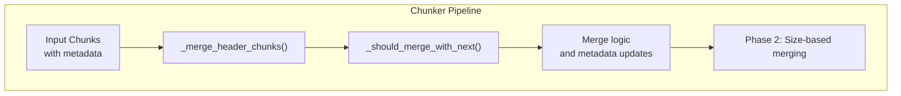
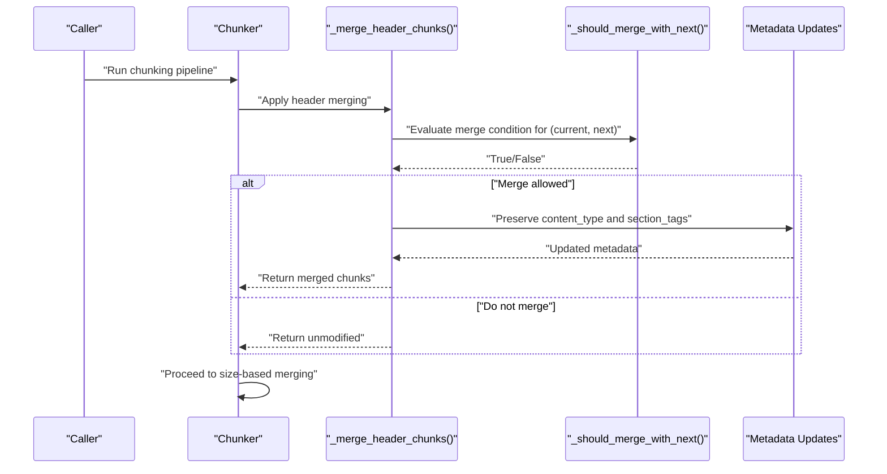
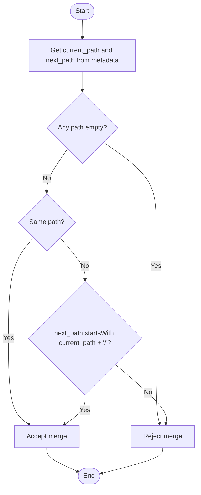
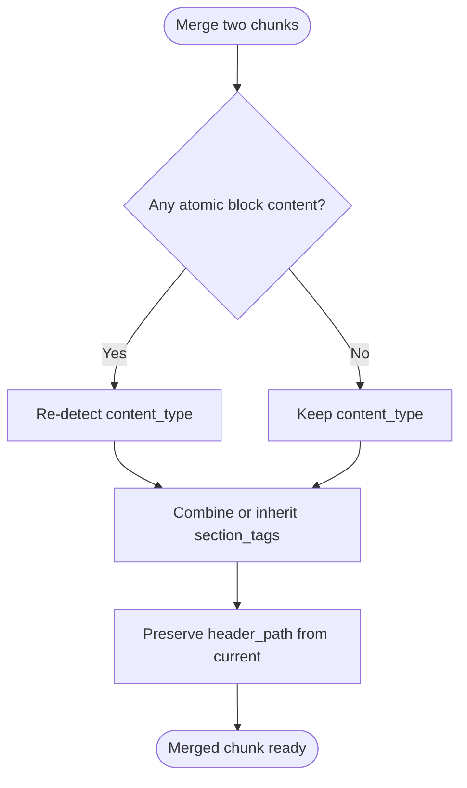
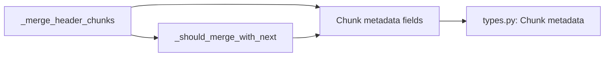

# Header Chunk Merging

<cite>
**Referenced Files in This Document**
- [chunker.py](file://src/chunkana/chunker.py)
- [types.py](file://src/chunkana/types.py)
- [config.py](file://src/chunkana/config.py)
- [test_dangling_headers.py](file://test_dangling_headers.py)
</cite>

## Table of Contents
1. [Introduction](#introduction)
2. [Project Structure](#project-structure)
3. [Core Components](#core-components)
4. [Architecture Overview](#architecture-overview)
5. [Detailed Component Analysis](#detailed-component-analysis)
6. [Dependency Analysis](#dependency-analysis)
7. [Performance Considerations](#performance-considerations)
8. [Troubleshooting Guide](#troubleshooting-guide)
9. [Conclusion](#conclusion)

## Introduction
This document explains the header chunk merging mechanism that consolidates small top-level header chunks (H1/H2) with their subsequent section bodies. It covers the purpose of preventing isolated header fragments, the merge decision logic, the role of HEADER_MERGE_THRESHOLD, header level restrictions, section continuity checks using header_path prefix matching, preamble exclusion, and metadata preservation during merge. It also describes how configuration influences the behavior via min_chunk_size and max_chunk_size and how this phase prevents fragmentation in document structure.

## Project Structure
The header chunk merging lives in the chunker pipeline and is invoked as part of the initial phases before size-based merging. It operates on lists of Chunk objects enriched with metadata such as content_type, header_path, header_level, and section_tags.

**Diagram sources**
- [chunker.py](file://src/chunkana/chunker.py#L490-L579)
- [chunker.py](file://src/chunkana/chunker.py#L581-L633)

**Section sources**
- [chunker.py](file://src/chunkana/chunker.py#L490-L579)
- [chunker.py](file://src/chunkana/chunker.py#L581-L633)

## Core Components
- _merge_header_chunks(): Iterates through chunks and merges small top-level header chunks (H1/H2) with their immediate next chunk when conditions are met.
- _should_merge_with_next(): Enforces all merge conditions, including header level, size threshold, preamble exclusion, and section continuity via header_path prefix matching.
- Chunk metadata: content_type, header_path, header_level, section_tags are used to drive decisions and preserved across merges.

Key responsibilities:
- Prevents standalone header fragments by consolidating small H1/H2 chunks with their section bodies.
- Ensures structural continuity by requiring the next chunk to be in the same section or a child section.
- Preserves metadata such as content_type and section_tags across merges.

**Section sources**
- [chunker.py](file://src/chunkana/chunker.py#L516-L579)
- [chunker.py](file://src/chunkana/chunker.py#L581-L633)
- [types.py](file://src/chunkana/types.py#L240-L290)

## Architecture Overview
The header merging phase runs before size-based merging. It identifies small header-only chunks (H1/H2) and attempts to merge them with the next chunk if they share the same logical section or are parent/child.

**Diagram sources**
- [chunker.py](file://src/chunkana/chunker.py#L490-L579)
- [chunker.py](file://src/chunkana/chunker.py#L581-L633)
- [chunker.py](file://src/chunkana/chunker.py#L546-L573)

## Detailed Component Analysis

### Purpose and Scope
- Purpose: Consolidate small top-level header chunks (H1/H2) with their subsequent section bodies to avoid isolated header fragments.
- Scope: Top-level headers only (H1/H2). Deeper headers are handled elsewhere in the system.

**Section sources**
- [chunker.py](file://src/chunkana/chunker.py#L516-L532)

### HEADER_MERGE_THRESHOLD (150 characters)
- Threshold: Current chunk size must be strictly less than 150 characters to qualify for merging with the next chunk.
- Rationale: Small header-only chunks are likely standalone and should be merged with the following body.

**Section sources**
- [chunker.py](file://src/chunkana/chunker.py#L604-L608)

### Header Level Restrictions (Levels 1–2 only)
- Only H1 and H2 chunks are eligible for merging.
- Deeper levels (H3+) are intentionally excluded from this consolidation logic.

**Section sources**
- [chunker.py](file://src/chunkana/chunker.py#L599-L602)

### Section Continuity Checks Using header_path Prefix Matching
- Same section: next_path equals current_path.
- Child section: next_path starts with current_path + "/".
- Empty paths are rejected to avoid ambiguous merges.

**Diagram sources**
- [chunker.py](file://src/chunkana/chunker.py#L619-L633)

**Section sources**
- [chunker.py](file://src/chunkana/chunker.py#L619-L633)

### Preamble Exclusion Rule
- Current chunk: Must not be of content_type "preamble".
- Next chunk: Must not be of content_type "preamble".
- Preambles are excluded from merging with header chunks to preserve document structure.

**Section sources**
- [chunker.py](file://src/chunkana/chunker.py#L609-L617)

### Metadata Preservation During Merge
- content_type: Re-detected when merging atomic blocks (code/table) to ensure correctness.
- section_tags: Combined from both chunks or inherited from the next chunk if absent in the current.
- header_path: Preserved from the current chunk’s top-level header_path to maintain structural context.

**Diagram sources**
- [chunker.py](file://src/chunkana/chunker.py#L555-L573)

**Section sources**
- [chunker.py](file://src/chunkana/chunker.py#L555-L573)

### Practical Examples
Below are conceptual examples of how merging works. These illustrate scenarios without showing code content.

- Example A: A small H1 header-only chunk is merged with the next chunk because:
  - The next chunk is in the same section (header_path match).
  - The next chunk is not a preamble.
  - The current chunk is under the 150-character threshold.
  - The current chunk is H1.

- Example B: A small H2 header-only chunk is merged with the next chunk because:
  - The next chunk is a child section (header_path prefix match).
  - The next chunk is not a preamble.
  - The current chunk is under the 150-character threshold.
  - The current chunk is H2.

- Example C: A small H3 header-only chunk is not merged because:
  - The merge logic applies only to H1/H2.
  - Even if the next chunk satisfies other conditions, the header level restriction prevents merging.

- Example D: A small H1 header-only chunk is not merged because:
  - The next chunk is a preamble.
  - The preamble exclusion rule rejects the merge.

- Example E: A small H1 header-only chunk is not merged because:
  - The next chunk is not in the same section nor a child section.
  - The header_path prefix matching fails.

**Section sources**
- [chunker.py](file://src/chunkana/chunker.py#L581-L633)
- [chunker.py](file://src/chunkana/chunker.py#L516-L579)

### Configuration Influence via min_chunk_size and max_chunk_size
- min_chunk_size: Used later in size-based merging to decide whether a chunk below this threshold should be merged with neighbors. While header merging happens before size-based merging, the resulting chunks still respect min_chunk_size and max_chunk_size constraints during subsequent steps.
- max_chunk_size: Enforced during merges to ensure combined content does not exceed the configured maximum. If combining two chunks would exceed max_chunk_size, the merge is prevented.

Practical implication:
- If two chunks are small and could be merged, the system checks max_chunk_size before performing the merge. If the combined size exceeds max_chunk_size, the merge is skipped to avoid oversized chunks.

**Section sources**
- [chunker.py](file://src/chunkana/chunker.py#L743-L746)
- [chunker.py](file://src/chunkana/chunker.py#L764-L767)
- [config.py](file://src/chunkana/config.py#L77-L81)

### How This Phase Prevents Fragmentation
- By consolidating small H1/H2 header-only chunks with their section bodies, the pipeline avoids producing isolated header fragments.
- Section continuity checks ensure that merges occur only within the intended logical sections or child sections, preserving document hierarchy.
- Preamble exclusion preserves the separation between preface material and main content.
- Metadata preservation maintains structural context (header_path) and content characteristics (content_type, section_tags) across merges.

**Section sources**
- [chunker.py](file://src/chunkana/chunker.py#L516-L579)
- [chunker.py](file://src/chunkana/chunker.py#L581-L633)
- [chunker.py](file://src/chunkana/chunker.py#L555-L573)

## Dependency Analysis
- _merge_header_chunks() depends on:
  - Chunk metadata fields: content_type, header_path, header_level, section_tags.
  - _should_merge_with_next() for decision logic.
- _should_merge_with_next() depends on:
  - Header level (H1/H2).
  - Size threshold (150 characters).
  - Preamble exclusion (content_type).
  - header_path prefix matching for same or child section.

**Diagram sources**
- [chunker.py](file://src/chunkana/chunker.py#L516-L579)
- [chunker.py](file://src/chunkana/chunker.py#L581-L633)
- [types.py](file://src/chunkana/types.py#L240-L290)

**Section sources**
- [chunker.py](file://src/chunkana/chunker.py#L516-L579)
- [chunker.py](file://src/chunkana/chunker.py#L581-L633)
- [types.py](file://src/chunkana/types.py#L240-L290)

## Performance Considerations
- Complexity: The header merging phase iterates through the chunk list once, performing constant-time checks per pair of adjacent chunks. Overall complexity is linear in the number of chunks.
- Early exits: Conditions short-circuit when header level or size thresholds fail, reducing unnecessary work.
- Metadata updates: content_type re-detection occurs only when merging atomic blocks, minimizing overhead.

[No sources needed since this section provides general guidance]

## Troubleshooting Guide
Common issues and resolutions:
- Merges not occurring:
  - Verify that the current chunk is H1 or H2 and under 150 characters.
  - Confirm that neither chunk is a preamble.
  - Ensure that header_path of the next chunk matches or is a child of the current chunk’s header_path.
- Unexpected content_type after merge:
  - Merging atomic blocks triggers content_type re-detection; confirm that the merged content contains code or tables to trigger re-classification.
- Oversized merged chunks:
  - If combined size exceeds max_chunk_size, the merge is prevented. Adjust configuration or review chunk boundaries.

Supporting evidence:
- Preamble exclusion and header_path checks are enforced in merge conditions.
- content_type re-detection occurs only for atomic blocks.
- max_chunk_size enforcement is checked before merging.

**Section sources**
- [chunker.py](file://src/chunkana/chunker.py#L609-L617)
- [chunker.py](file://src/chunkana/chunker.py#L555-L563)
- [chunker.py](file://src/chunkana/chunker.py#L764-L767)

## Conclusion
The header chunk merging phase prevents fragmented document structure by consolidating small H1/H2 header-only chunks with their section bodies. It enforces strict conditions—header level, size threshold, preamble exclusion, and section continuity—while preserving metadata integrity. Configuration parameters like min_chunk_size and max_chunk_size influence downstream merging and chunk sizing, ensuring balanced chunk sizes and structural coherence.