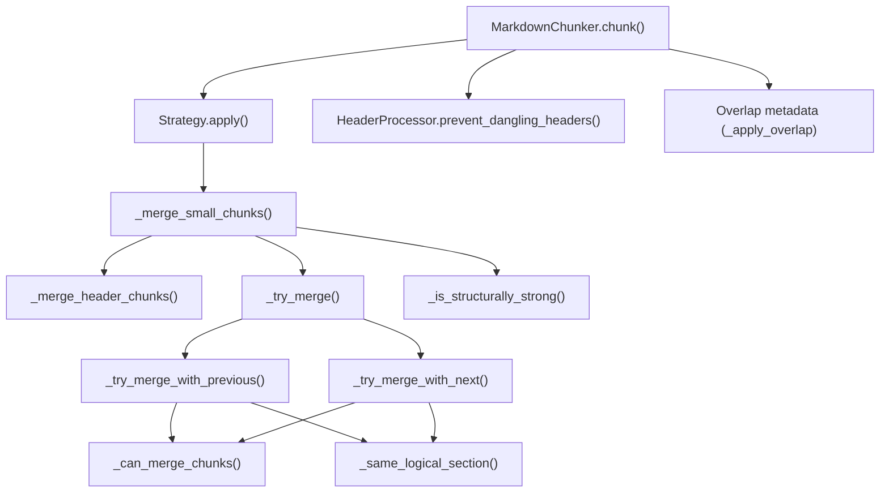
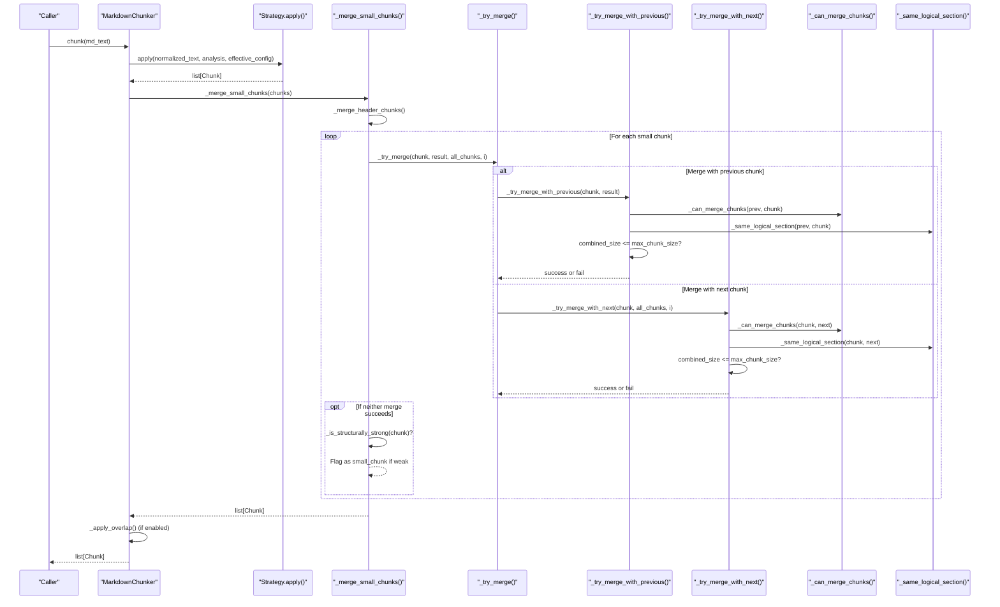
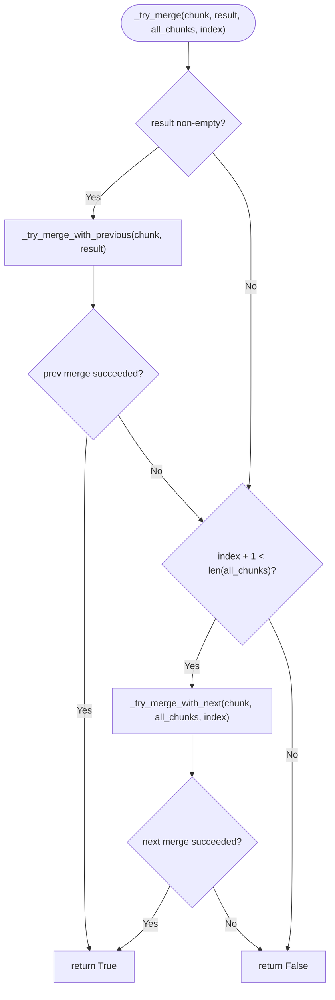
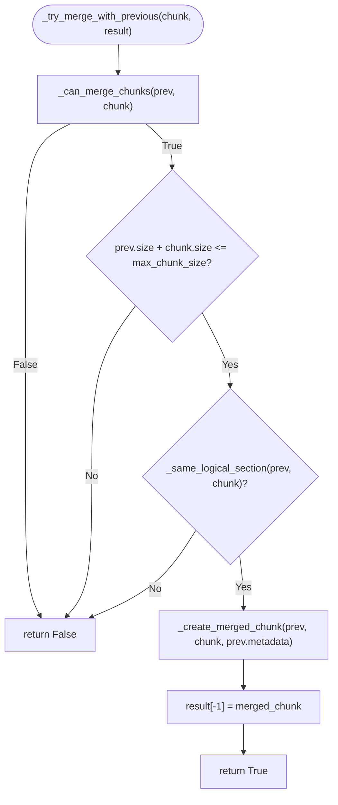
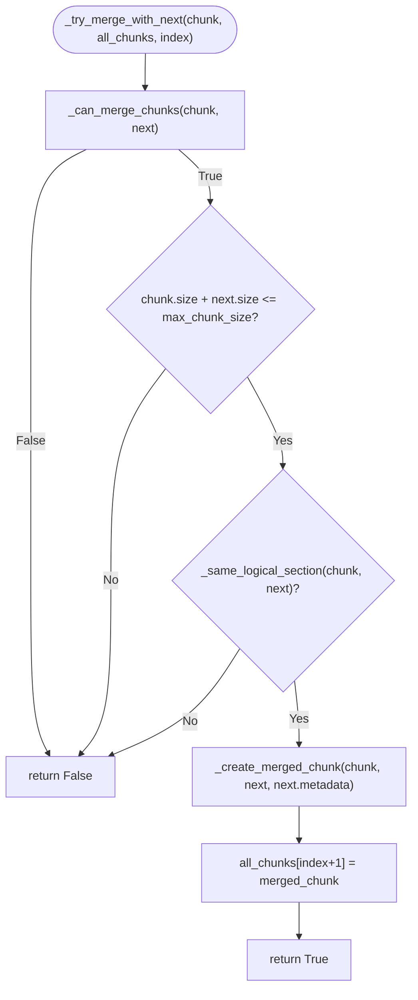
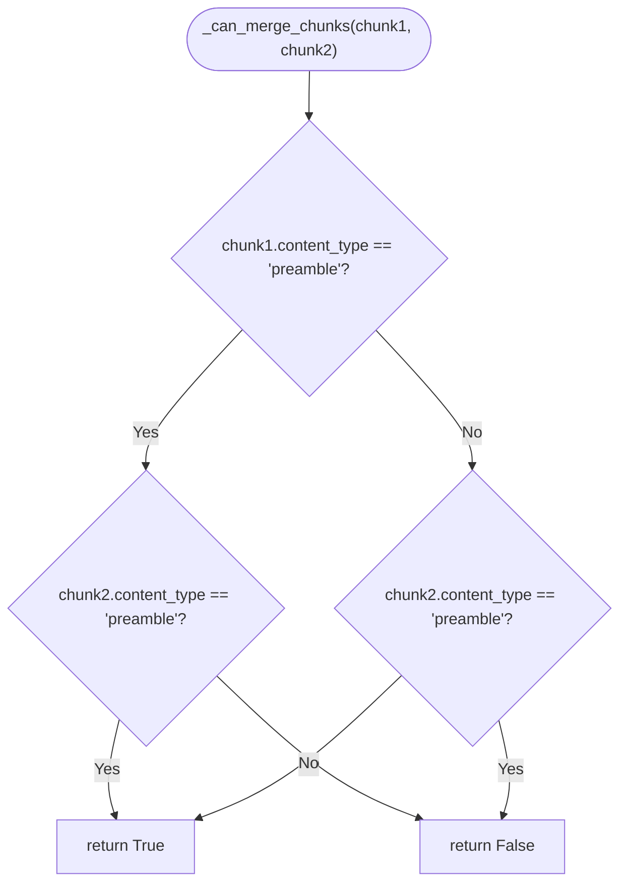
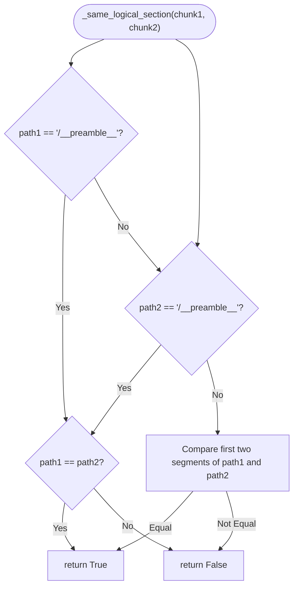
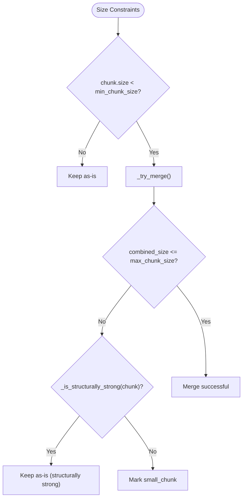
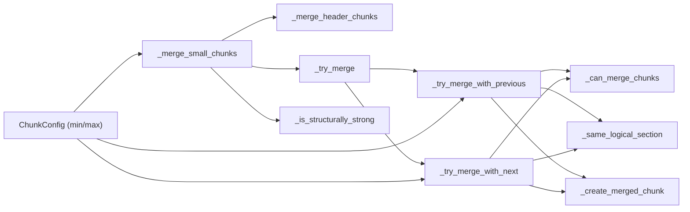

# Small Chunk Merging

<cite>
**Referenced Files in This Document**
- [chunker.py](file://src/chunkana/chunker.py)
- [config.py](file://src/chunkana/config.py)
- [structural.py](file://src/chunkana/strategies/structural.py)
- [header_processor.py](file://src/chunkana/header_processor.py)
- [types.py](file://src/chunkana/types.py)
- [test_micro_chunks.py](file://test_micro_chunks.py)
</cite>

## Table of Contents
1. [Introduction](#introduction)
2. [Project Structure](#project-structure)
3. [Core Components](#core-components)
4. [Architecture Overview](#architecture-overview)
5. [Detailed Component Analysis](#detailed-component-analysis)
6. [Dependency Analysis](#dependency-analysis)
7. [Performance Considerations](#performance-considerations)
8. [Troubleshooting Guide](#troubleshooting-guide)
9. [Conclusion](#conclusion)

## Introduction
This document explains the small-chunk merging mechanism implemented in the size-based merging phase. It focuses on the _try_merge() method and its integration within the chunker pipeline, detailing:
- Left-preference merging strategy (favoring previous chunk over next)
- Two-phase merge attempt process
- The _can_merge_chunks() preamble compatibility rule that prevents mixing preamble and structural content
- The _same_logical_section() logic enforcing header_path prefix alignment up to level 2
- How this process interacts with min_chunk_size and max_chunk_size to prevent micro-chunks
- Examples of successful merges and cases where merging is blocked due to size or section boundaries

## Project Structure
The small-chunk merging lives in the main chunker pipeline and integrates with strategies, header processing, and configuration.

**Diagram sources**
- [chunker.py](file://src/chunkana/chunker.py#L85-L176)
- [structural.py](file://src/chunkana/strategies/structural.py#L59-L150)
- [header_processor.py](file://src/chunkana/header_processor.py#L405-L451)

**Section sources**
- [chunker.py](file://src/chunkana/chunker.py#L85-L176)
- [structural.py](file://src/chunkana/strategies/structural.py#L59-L150)
- [header_processor.py](file://src/chunkana/header_processor.py#L405-L451)

## Core Components
- _merge_small_chunks(): Orchestrates the size-based merging phase, including a header-only pre-merge pass and the two-phase merge attempt for remaining small chunks.
- _try_merge(): Attempts to merge a small chunk with either the previous or next neighbor, preferring left (previous) due to left-preference policy.
- _try_merge_with_previous(): Validates preamble compatibility, size constraints, and logical section alignment before merging with the previous chunk.
- _try_merge_with_next(): Validates preamble compatibility, size constraints, and logical section alignment before merging with the next chunk.
- _can_merge_chunks(): Enforces preamble compatibility so preamble chunks are not merged with structural content and vice versa.
- _same_logical_section(): Ensures merging occurs within the same logical section by comparing header_path prefixes up to level 2.
- _is_structurally_strong(): Determines whether a small chunk should be preserved as-is due to structural strength (e.g., strong headers, multiple paragraphs, meaningful content).
- Configuration: min_chunk_size and max_chunk_size control the thresholds for merging and micro-chunk prevention.

**Section sources**
- [chunker.py](file://src/chunkana/chunker.py#L471-L514)
- [chunker.py](file://src/chunkana/chunker.py#L683-L707)
- [chunker.py](file://src/chunkana/chunker.py#L735-L776)
- [chunker.py](file://src/chunkana/chunker.py#L708-L714)
- [chunker.py](file://src/chunkana/chunker.py#L777-L803)
- [chunker.py](file://src/chunkana/chunker.py#L634-L682)
- [config.py](file://src/chunkana/config.py#L77-L81)

## Architecture Overview
The size-based merging phase runs after strategy application and before overlap metadata injection. It prevents micro-chunks by refusing to merge when doing so would exceed max_chunk_size or violate section boundaries, and by preserving structurally weak small chunks as small_chunk flags.

**Diagram sources**
- [chunker.py](file://src/chunkana/chunker.py#L85-L176)
- [chunker.py](file://src/chunkana/chunker.py#L471-L514)
- [chunker.py](file://src/chunkana/chunker.py#L683-L707)
- [chunker.py](file://src/chunkana/chunker.py#L735-L776)
- [chunker.py](file://src/chunkana/chunker.py#L708-L714)
- [chunker.py](file://src/chunkana/chunker.py#L777-L803)

## Detailed Component Analysis

### _try_merge() and the Two-Phase Merge Attempt
- Purpose: Attempt to merge a small chunk with adjacent neighbors to avoid micro-chunks.
- Left-preference: Always tries merging with the previous chunk first, then falls back to the next chunk.
- Validation: For each candidate neighbor, checks preamble compatibility, logical section alignment, and combined size constraint.

Key behaviors:
- If merging with previous succeeds, the previous chunk is replaced with the merged chunk.
- If merging with next succeeds, the next chunk is replaced in-place with the merged chunk.
- If both attempts fail, the small chunk is evaluated for structural strength; if weak, it is flagged as small_chunk.

**Diagram sources**
- [chunker.py](file://src/chunkana/chunker.py#L683-L707)

**Section sources**
- [chunker.py](file://src/chunkana/chunker.py#L683-L707)

### _try_merge_with_previous(): Left-Preference Merge
- Validates preamble compatibility via _can_merge_chunks().
- Checks combined size constraint: prev.size + chunk.size <= max_chunk_size.
- Enforces same logical section via _same_logical_section().
- On success, replaces the previous chunk with the merged chunk.

**Diagram sources**
- [chunker.py](file://src/chunkana/chunker.py#L735-L755)
- [chunker.py](file://src/chunkana/chunker.py#L708-L714)
- [chunker.py](file://src/chunkana/chunker.py#L777-L803)
- [chunker.py](file://src/chunkana/chunker.py#L715-L734)

**Section sources**
- [chunker.py](file://src/chunkana/chunker.py#L735-L755)
- [chunker.py](file://src/chunkana/chunker.py#L708-L714)
- [chunker.py](file://src/chunkana/chunker.py#L777-L803)
- [chunker.py](file://src/chunkana/chunker.py#L715-L734)

### _try_merge_with_next(): Right-Fallback Merge
- Validates preamble compatibility via _can_merge_chunks().
- Checks combined size constraint: chunk.size + next.size <= max_chunk_size.
- Enforces same logical section via _same_logical_section().
- On success, replaces the next chunk in-place with the merged chunk.

**Diagram sources**
- [chunker.py](file://src/chunkana/chunker.py#L756-L776)
- [chunker.py](file://src/chunkana/chunker.py#L708-L714)
- [chunker.py](file://src/chunkana/chunker.py#L777-L803)
- [chunker.py](file://src/chunkana/chunker.py#L715-L734)

**Section sources**
- [chunker.py](file://src/chunkana/chunker.py#L756-L776)
- [chunker.py](file://src/chunkana/chunker.py#L708-L714)
- [chunker.py](file://src/chunkana/chunker.py#L777-L803)
- [chunker.py](file://src/chunkana/chunker.py#L715-L734)

### _can_merge_chunks(): Preamble Compatibility Rule
- Prevents mixing preamble and structural content.
- Returns True only if both chunks are preamble or both are not preamble.

**Diagram sources**
- [chunker.py](file://src/chunkana/chunker.py#L708-L714)
- [structural.py](file://src/chunkana/strategies/structural.py#L80-L99)

**Section sources**
- [chunker.py](file://src/chunkana/chunker.py#L708-L714)
- [structural.py](file://src/chunkana/strategies/structural.py#L80-L99)

### _same_logical_section(): Section Boundary Alignment (Up to Level 2)
- Compares header_path prefixes up to the first two segments to enforce merging within the same logical section.
- Special-cases preamble chunks: preamble chunks are isolated and only merge with other preamble chunks.

**Diagram sources**
- [chunker.py](file://src/chunkana/chunker.py#L777-L803)

**Section sources**
- [chunker.py](file://src/chunkana/chunker.py#L777-L803)

### Interaction with min_chunk_size and max_chunk_size
- min_chunk_size: Small chunks below this threshold are candidates for merging.
- max_chunk_size: Merging is blocked if combining two small chunks would exceed this limit.
- The process avoids creating micro-chunks by:
  - Rejecting merges that would exceed max_chunk_size
  - Preserving structurally weak small chunks as small_chunk flags when merging is not possible

**Diagram sources**
- [chunker.py](file://src/chunkana/chunker.py#L471-L514)
- [chunker.py](file://src/chunkana/chunker.py#L634-L682)
- [config.py](file://src/chunkana/config.py#L77-L81)

**Section sources**
- [chunker.py](file://src/chunkana/chunker.py#L471-L514)
- [chunker.py](file://src/chunkana/chunker.py#L634-L682)
- [config.py](file://src/chunkana/config.py#L77-L81)

### Examples and Scenarios

- Successful merge within same logical section:
  - Two small chunks with header_path "/A/B" and "/A/B/C" can merge if combined size is within max_chunk_size and they are adjacent.
  - The merge preserves metadata from the chosen base chunk and updates content accordingly.

- Blocked due to size:
  - A small chunk cannot merge with its neighbor if the combined size exceeds max_chunk_size, even if both are in the same logical section.

- Blocked due to section boundary:
  - A chunk with header_path "/A/B" cannot merge with a chunk in section "/C/D" because their first two segments differ.

- Preamble isolation:
  - A preamble chunk (content_type "preamble") cannot merge with a structural chunk and vice versa.

- Structural strength preservation:
  - A small chunk with strong headers, multiple paragraphs, or meaningful content is not flagged as small_chunk even if below min_chunk_size.

These behaviors are validated by tests that assert:
- Small chunks are flagged appropriately
- Structurally strong small chunks are not flagged
- Section boundaries are respected
- Preamble isolation holds
- Metadata correctness after merges

**Section sources**
- [test_micro_chunks.py](file://test_micro_chunks.py#L15-L66)
- [test_micro_chunks.py](file://test_micro_chunks.py#L69-L119)
- [test_micro_chunks.py](file://test_micro_chunks.py#L122-L163)
- [test_micro_chunks.py](file://test_micro_chunks.py#L166-L205)
- [test_micro_chunks.py](file://test_micro_chunks.py#L208-L245)
- [test_micro_chunks.py](file://test_micro_chunks.py#L248-L295)

## Dependency Analysis
- _merge_small_chunks() depends on:
  - _merge_header_chunks() for header-only pre-merge
  - _try_merge() for two-phase merge attempts
  - _is_structurally_strong() to decide whether to flag small_chunk
- _try_merge_with_previous() and _try_merge_with_next() depend on:
  - _can_merge_chunks() for preamble compatibility
  - _same_logical_section() for section alignment
  - _create_merged_chunk() for constructing merged chunks
- Configuration parameters min_chunk_size and max_chunk_size are enforced throughout merging logic.

**Diagram sources**
- [chunker.py](file://src/chunkana/chunker.py#L471-L514)
- [chunker.py](file://src/chunkana/chunker.py#L683-L707)
- [chunker.py](file://src/chunkana/chunker.py#L735-L776)
- [chunker.py](file://src/chunkana/chunker.py#L708-L714)
- [chunker.py](file://src/chunkana/chunker.py#L777-L803)
- [chunker.py](file://src/chunkana/chunker.py#L715-L734)
- [chunker.py](file://src/chunkana/chunker.py#L634-L682)
- [config.py](file://src/chunkana/config.py#L77-L81)

**Section sources**
- [chunker.py](file://src/chunkana/chunker.py#L471-L514)
- [chunker.py](file://src/chunkana/chunker.py#L683-L707)
- [chunker.py](file://src/chunkana/chunker.py#L735-L776)
- [chunker.py](file://src/chunkana/chunker.py#L708-L714)
- [chunker.py](file://src/chunkana/chunker.py#L777-L803)
- [chunker.py](file://src/chunkana/chunker.py#L715-L734)
- [chunker.py](file://src/chunkana/chunker.py#L634-L682)
- [config.py](file://src/chunkana/config.py#L77-L81)

## Performance Considerations
- Complexity: The merging loop iterates over chunks once, performing constant-time checks per candidate merge. Overall complexity is linear in the number of chunks.
- Early exits: Validation checks short-circuit on failure, minimizing unnecessary work.
- Metadata updates: Merging updates content and metadata; content_type re-detection occurs only when merging atomic blocks (code/table) to avoid redundant work.
- Section boundary enforcement: Comparing header_path prefixes up to level 2 is efficient and bounded by the number of path segments.

[No sources needed since this section provides general guidance]

## Troubleshooting Guide
Common issues and resolutions:
- Micro-chunks persist:
  - Verify min_chunk_size and max_chunk_size are set appropriately.
  - Check that _is_structurally_strong() returns False for the chunk to allow merging.
- Unexpected small_chunk flags:
  - Confirm the chunk is structurally weak (lacks strong headers, multiple paragraphs, or meaningful content).
- Preamble merged with structural content:
  - Ensure _can_merge_chunks() is correctly enforcing preamble compatibility.
- Section boundary violations:
  - Confirm _same_logical_section() is comparing header_path prefixes up to level 2 and that preamble chunks are isolated.

Validation and tests:
- Use test_micro_chunks.py to reproduce and verify behaviors around small chunk flagging, structural strength detection, section boundary respect, preamble isolation, and metadata correctness.

**Section sources**
- [test_micro_chunks.py](file://test_micro_chunks.py#L15-L66)
- [test_micro_chunks.py](file://test_micro_chunks.py#L69-L119)
- [test_micro_chunks.py](file://test_micro_chunks.py#L122-L163)
- [test_micro_chunks.py](file://test_micro_chunks.py#L166-L205)
- [test_micro_chunks.py](file://test_micro_chunks.py#L208-L245)
- [test_micro_chunks.py](file://test_micro_chunks.py#L248-L295)

## Conclusion
The small-chunk merging phase enforces robust chunking quality by:
- Favoring left merges to preserve document flow
- Preventing preamble and structural content mixing
- Aligning merges to logical sections up to level 2
- Respecting size constraints defined by min_chunk_size and max_chunk_size
- Preserving structurally strong small chunks and flagging truly weak ones as small_chunk

Together, these rules minimize micro-chunks, maintain section integrity, and improve downstream retrieval quality.