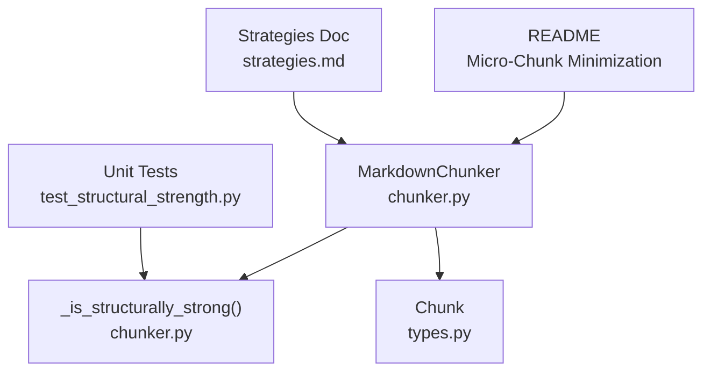
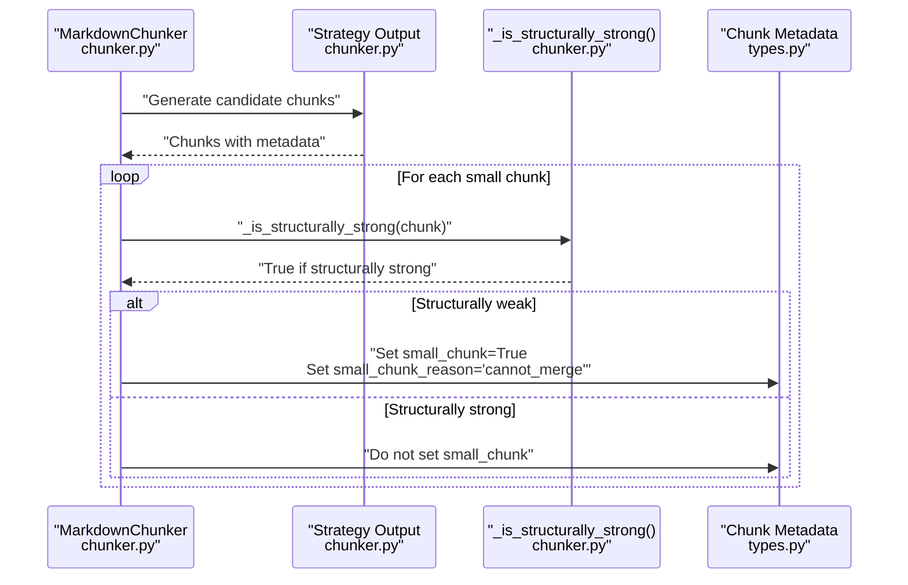
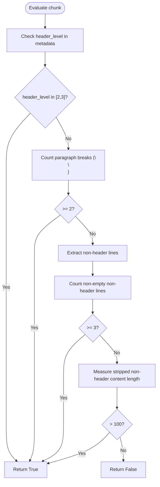
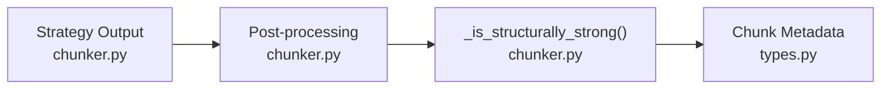

# Structural Strength Detection

<cite>
**Referenced Files in This Document**
- [chunker.py](file://src/chunkana/chunker.py)
- [types.py](file://src/chunkana/types.py)
- [test_structural_strength.py](file://tests/unit/test_structural_strength.py)
- [README.md](file://README.md)
- [strategies.md](file://docs/strategies.md)
</cite>

## Table of Contents
1. [Introduction](#introduction)
2. [Project Structure](#project-structure)
3. [Core Components](#core-components)
4. [Architecture Overview](#architecture-overview)
5. [Detailed Component Analysis](#detailed-component-analysis)
6. [Dependency Analysis](#dependency-analysis)
7. [Performance Considerations](#performance-considerations)
8. [Troubleshooting Guide](#troubleshooting-guide)
9. [Conclusion](#conclusion)

## Introduction
This document explains the _is_structurally_strong() method and its role in preventing small chunks from being flagged as “small_chunk” when they are semantically meaningful. It describes the four structural strength criteria, demonstrates how the logic avoids mis-flagging compact but meaningful sections (e.g., short subsections with multiple paragraphs), and outlines the current limitation around list items. It also shows how this logic supports the quality goal of minimizing micro-chunks while preserving semantic integrity.

## Project Structure
The structural strength detection lives in the core chunker module and is validated by unit tests. The Chunk data model defines the metadata fields used by the logic, including small_chunk and small_chunk_reason.

**Diagram sources**
- [chunker.py](file://src/chunkana/chunker.py#L479-L514)
- [chunker.py](file://src/chunkana/chunker.py#L634-L681)
- [types.py](file://src/chunkana/types.py#L240-L310)
- [test_structural_strength.py](file://tests/unit/test_structural_strength.py#L1-L209)
- [README.md](file://README.md#L134-L137)
- [strategies.md](file://docs/strategies.md#L40-L51)

**Section sources**
- [chunker.py](file://src/chunkana/chunker.py#L479-L514)
- [chunker.py](file://src/chunkana/chunker.py#L634-L681)
- [types.py](file://src/chunkana/types.py#L240-L310)
- [test_structural_strength.py](file://tests/unit/test_structural_strength.py#L1-L209)
- [README.md](file://README.md#L134-L137)
- [strategies.md](file://docs/strategies.md#L40-L51)

## Core Components
- _is_structurally_strong(chunk): Evaluates whether a small chunk should be treated as structurally strong and thus not flagged as small_chunk.
- Chunk.small_chunk and Chunk.small_chunk_reason: Metadata fields set during post-processing to track micro-chunk flags and reasons.
- Unit tests: Validate that strong headers, multiple paragraphs, sufficient non-header lines, and meaningful content prevent small_chunk flagging, and that lists are not currently considered structural indicators.

Key responsibilities:
- Prevent micro-chunk flagging for compact but meaningful sections.
- Preserve semantic integrity by preferring merges within the same logical section.
- Provide a small_chunk_reason when a chunk cannot be merged.

**Section sources**
- [chunker.py](file://src/chunkana/chunker.py#L479-L514)
- [chunker.py](file://src/chunkana/chunker.py#L634-L681)
- [types.py](file://src/chunkana/types.py#L240-L310)
- [test_structural_strength.py](file://tests/unit/test_structural_strength.py#L1-L209)

## Architecture Overview
The small-chunk flagging pipeline integrates structural strength detection with merging heuristics. When a chunk is below the minimum size and cannot be merged without exceeding the maximum size, the system checks structural strength. If the chunk is structurally weak, it is flagged as small_chunk with a reason.

**Diagram sources**
- [chunker.py](file://src/chunkana/chunker.py#L479-L514)
- [chunker.py](file://src/chunkana/chunker.py#L634-L681)
- [types.py](file://src/chunkana/types.py#L240-L310)

## Detailed Component Analysis

### _is_structurally_strong(chunk): Four Criteria
The method evaluates whether a chunk is structurally strong despite being small. A chunk qualifies if any of the following conditions is met:
1. Strong header: The chunk’s first header is level 2 (##) or 3 (###).
2. Sufficient non-header lines: At least 3 lines of non-header content.
3. Meaningful content: Non-header content exceeds 100 characters after header extraction.
4. Multiple paragraphs: At least 2 paragraph breaks (double newline).

These criteria collectively ensure that compact sections with clear semantic anchors or dense information are not treated as micro-chunks.

**Diagram sources**
- [chunker.py](file://src/chunkana/chunker.py#L634-L681)

**Section sources**
- [chunker.py](file://src/chunkana/chunker.py#L634-L681)

### How It Prevents Mis-Flagging Compact Sections
- Presence of H2/H3 headers: Even if a subsection is short, a level 2 or 3 header signals semantic importance and prevents small_chunk flagging.
- Multiple paragraphs: A compact section containing multiple paragraphs is likely cohesive and informative, so it is not flagged as small.
- Non-header lines and meaningful content: Ensures that short but dense text (e.g., bullet lists embedded under headers) is not treated as micro-chunk material if it carries substantial meaning.

Examples from tests demonstrate:
- A short subsection with a level 2 header is not flagged as small.
- A section with multiple paragraphs is not flagged as small.
- A section with sufficient non-header content (>100 characters) is not flagged as small.
- A truly weak chunk (very brief, no strong headers, no multiple paragraphs, and insufficient non-header content) is flagged as small with reason “cannot_merge”.

Contrasting examples:
- Structurally strong small chunk: A short subsection under a level 2 header with multiple paragraphs and meaningful content.
- Structurally weak small chunk: A brief standalone phrase without headers or paragraph breaks.

**Section sources**
- [test_structural_strength.py](file://tests/unit/test_structural_strength.py#L14-L118)
- [test_structural_strength.py](file://tests/unit/test_structural_strength.py#L119-L167)

### Current Limitation: Lists Are Not Considered Structural Indicators
The method explicitly notes that lists (bullet/numbered) are not currently considered structural strength indicators. This is a deliberate limitation for this version, with future support planned.

Implications:
- A compact list under a header may still be flagged as small if it lacks strong headers, multiple paragraphs, or meaningful content.
- Future enhancements could incorporate list density or item count thresholds to improve robustness.

**Section sources**
- [chunker.py](file://src/chunkana/chunker.py#L648-L650)
- [test_structural_strength.py](file://tests/unit/test_structural_strength.py#L122-L133)

### Role in Quality Assurance: Minimizing Micro-Chunks While Preserving Semantic Integrity
- The structural strength logic reduces micro-chunk flagging for meaningful but compact sections.
- During merging, the system prefers merging within the same logical section (same header_path prefix) and sets small_chunk_reason to “cannot_merge” when a chunk cannot be merged without violating size constraints.
- This preserves semantic coherence (e.g., keeping headers with their content) while minimizing fragmentation.

**Section sources**
- [chunker.py](file://src/chunkana/chunker.py#L479-L514)
- [README.md](file://README.md#L134-L137)

## Dependency Analysis
- _is_structurally_strong depends on:
  - Chunk.metadata.header_level (set by strategies).
  - Chunk.content (for counting paragraph breaks and extracting non-header lines).
- The method is invoked during post-processing after size-based merging attempts.

**Diagram sources**
- [chunker.py](file://src/chunkana/chunker.py#L479-L514)
- [chunker.py](file://src/chunkana/chunker.py#L634-L681)
- [types.py](file://src/chunkana/types.py#L240-L310)

**Section sources**
- [chunker.py](file://src/chunkana/chunker.py#L479-L514)
- [chunker.py](file://src/chunkana/chunker.py#L634-L681)
- [types.py](file://src/chunkana/types.py#L240-L310)

## Performance Considerations
- The structural strength check is O(n) in the number of lines for paragraph break counting and non-header extraction.
- Using metadata (header_level) avoids re-parsing headers, reducing overhead.
- The logic short-circuits on the first positive indicator, minimizing unnecessary computations.

[No sources needed since this section provides general guidance]

## Troubleshooting Guide
Common scenarios and resolutions:
- A chunk remains flagged as small_chunk:
  - Verify that header_level is not 2 or 3 and that paragraph breaks are fewer than 2.
  - Confirm that non-header lines are fewer than 3 and that non-header content is not longer than 100 characters.
  - Consider adding a level 2 or 3 header or increasing content density to meet the criteria.
- small_chunk_reason is “cannot_merge”:
  - This is expected when merging with neighbors would exceed max_chunk_size or when the chunks are not in the same logical section.
  - Adjust min_chunk_size or overlap_size to enable merging when appropriate.

Validation references:
- Flagging behavior and reasons are covered by unit tests.
- Structural strength criteria are validated by targeted assertions.

**Section sources**
- [test_structural_strength.py](file://tests/unit/test_structural_strength.py#L138-L167)
- [chunker.py](file://src/chunkana/chunker.py#L479-L514)

## Conclusion
The _is_structurally_strong() method provides a pragmatic, rule-based mechanism to prevent micro-chunk flagging for compact but meaningful sections. By considering strong headers, paragraph breaks, non-header line counts, and meaningful content, it aligns with the project’s quality goals of minimizing micro-chunks while preserving semantic integrity. The current limitation around list items highlights an opportunity for future enhancement to further refine structural strength detection.