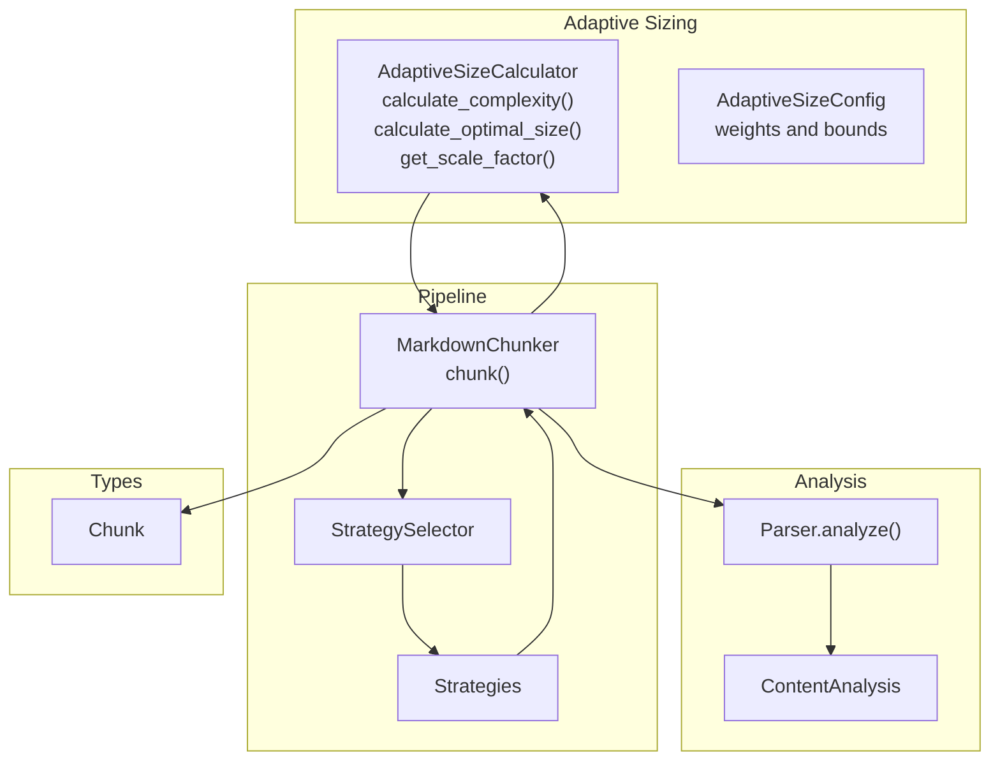
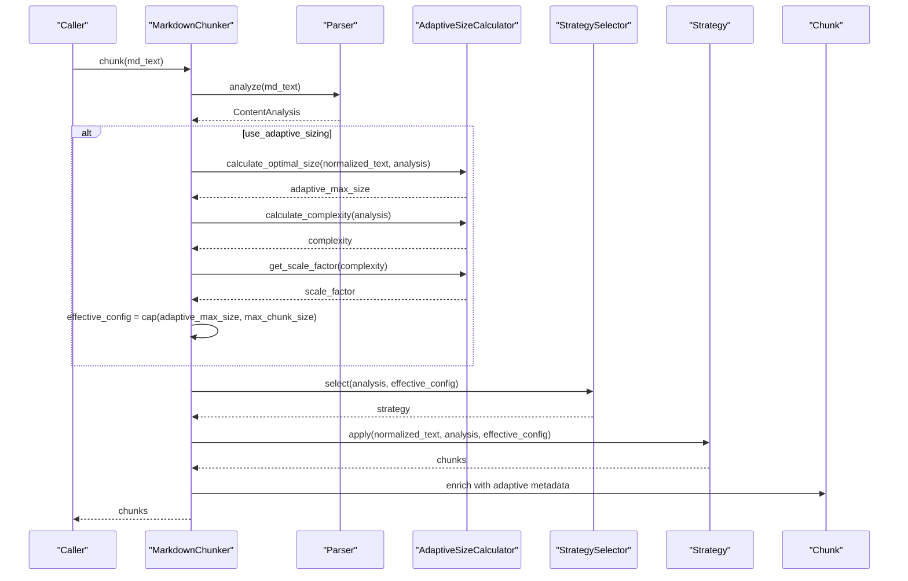
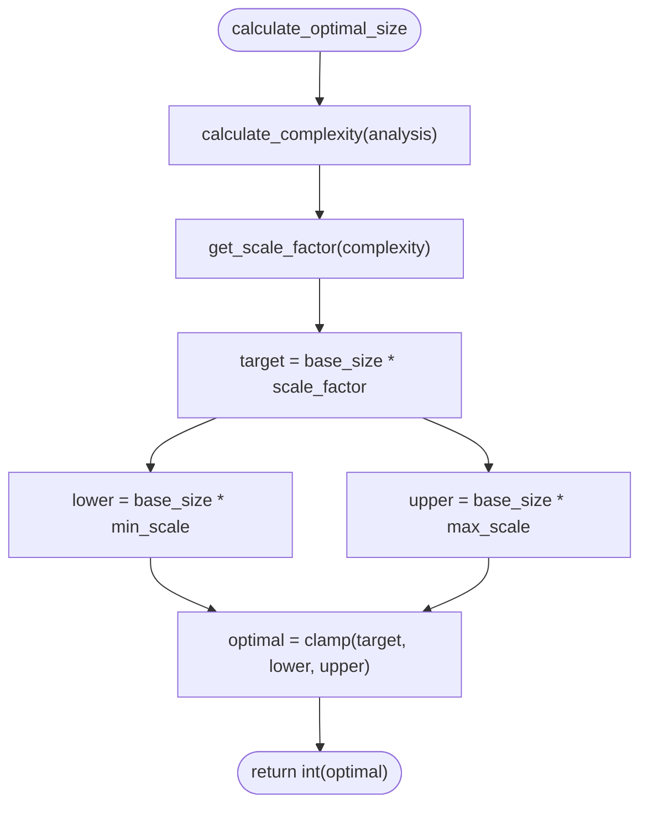
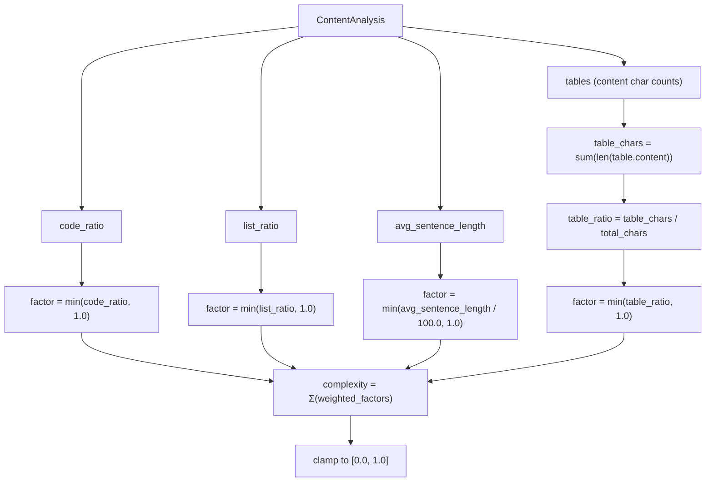
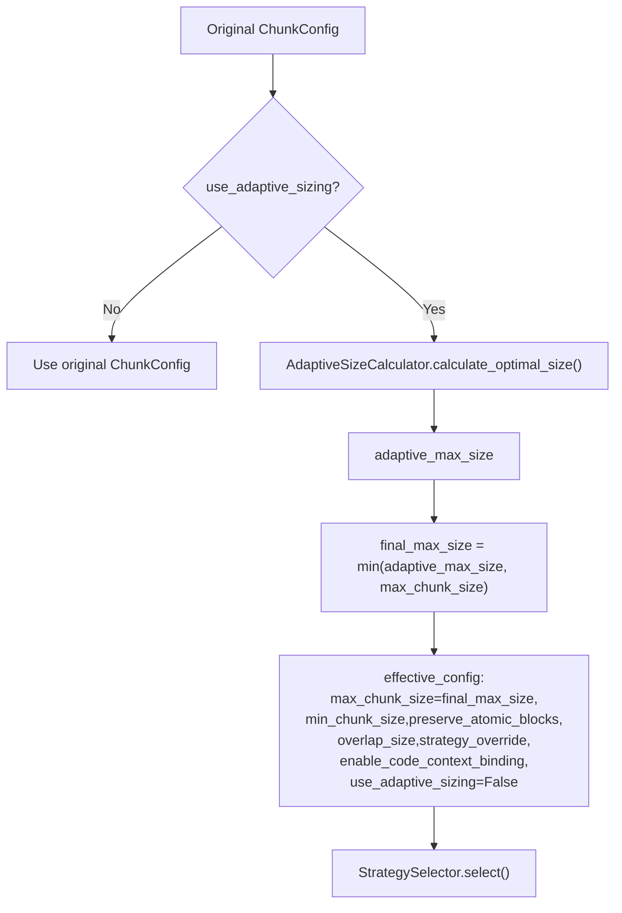
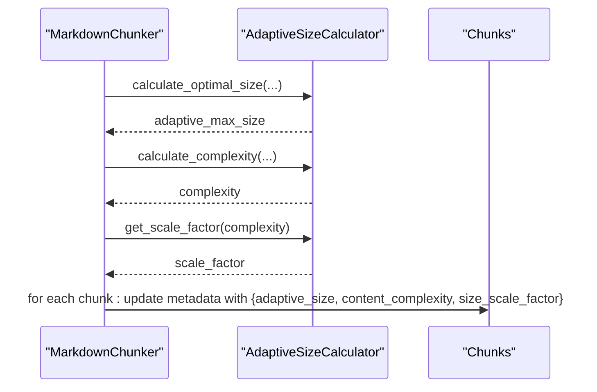
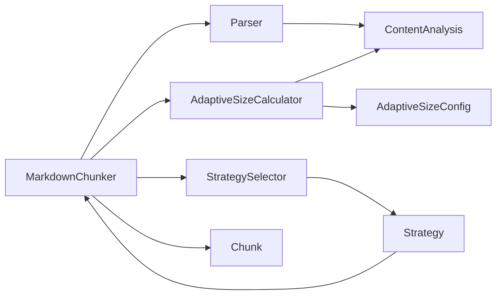

# Adaptive Size Calculation

<cite>
**Referenced Files in This Document**
- [adaptive_sizing.py](file://src/chunkana/adaptive_sizing.py)
- [config.py](file://src/chunkana/config.py)
- [chunker.py](file://src/chunkana/chunker.py)
- [types.py](file://src/chunkana/types.py)
- [parser.py](file://src/chunkana/parser.py)
- [adaptive_sizing.md](file://tests/baseline/fixtures/adaptive_sizing.md)
- [adaptive_sizing.jsonl](file://tests/baseline/golden_canonical/adaptive_sizing.jsonl)
- [test_performance_regression.py](file://tests/performance/test_performance_regression.py)
</cite>

## Table of Contents
1. [Introduction](#introduction)
2. [Project Structure](#project-structure)
3. [Core Components](#core-components)
4. [Architecture Overview](#architecture-overview)
5. [Detailed Component Analysis](#detailed-component-analysis)
6. [Dependency Analysis](#dependency-analysis)
7. [Performance Considerations](#performance-considerations)
8. [Troubleshooting Guide](#troubleshooting-guide)
9. [Conclusion](#conclusion)
10. [Appendices](#appendices)

## Introduction
This document explains the adaptive sizing calculation feature that dynamically adjusts chunk size based on document content characteristics. It covers how the system analyzes content complexity using code density, table usage, list density, and sentence length; how the effective configuration is derived from the original configuration; how complexity scores and scale factors influence chunk sizing; and how adaptive metadata is stored and propagated through the pipeline. It also documents configuration options in adaptive_config and discusses performance implications for large documents.

## Project Structure
The adaptive sizing feature spans several modules:
- Adaptive sizing core: calculates complexity and optimal size
- Configuration: defines adaptive sizing parameters and integrates with the main chunker configuration
- Chunker pipeline: orchestrates parsing, adaptive sizing, strategy selection, and metadata enrichment
- Types: defines ContentAnalysis and Chunk data structures used by adaptive sizing
- Parser: produces ContentAnalysis used as input to adaptive sizing
- Tests: include fixture and golden outputs for adaptive sizing behavior and performance benchmarks

**Diagram sources**
- [adaptive_sizing.py](file://src/chunkana/adaptive_sizing.py#L103-L197)
- [config.py](file://src/chunkana/config.py#L17-L123)
- [chunker.py](file://src/chunkana/chunker.py#L85-L177)
- [types.py](file://src/chunkana/types.py#L181-L239)
- [parser.py](file://src/chunkana/parser.py#L44-L122)

**Section sources**
- [adaptive_sizing.py](file://src/chunkana/adaptive_sizing.py#L1-L197)
- [config.py](file://src/chunkana/config.py#L1-L123)
- [chunker.py](file://src/chunkana/chunker.py#L85-L177)
- [types.py](file://src/chunkana/types.py#L181-L239)
- [parser.py](file://src/chunkana/parser.py#L44-L122)

## Core Components
- AdaptiveSizeConfig: Defines weights and scaling bounds for adaptive sizing, including base_size, min_scale, max_scale, and weights for code, table, list, and sentence length.
- AdaptiveSizeCalculator: Stateless calculator that computes a complexity score from ContentAnalysis and derives an optimal chunk size using a linear scale factor.
- ChunkConfig: Main configuration that includes use_adaptive_sizing and adaptive_config. When adaptive sizing is enabled, the chunker computes an adaptive_max_size and caps it by max_chunk_size to produce effective_config.
- ContentAnalysis: Aggregates metrics such as code_ratio, list_ratio, avg_sentence_length, and table content character counts used by adaptive sizing.
- MarkdownChunker: Orchestrates parsing, adaptive sizing, strategy selection, overlap, and metadata enrichment. It stores adaptive metadata in chunks when enabled.

**Section sources**
- [adaptive_sizing.py](file://src/chunkana/adaptive_sizing.py#L14-L101)
- [adaptive_sizing.py](file://src/chunkana/adaptive_sizing.py#L103-L197)
- [config.py](file://src/chunkana/config.py#L17-L123)
- [types.py](file://src/chunkana/types.py#L181-L239)
- [chunker.py](file://src/chunkana/chunker.py#L85-L177)

## Architecture Overview
The adaptive sizing pipeline:
1. Parse markdown once to produce ContentAnalysis.
2. If adaptive sizing is enabled, compute complexity and optimal size.
3. Cap adaptive_max_size by max_chunk_size to derive effective_config.
4. Select strategy using effective_config and apply it.
5. Enrich chunks with adaptive metadata (adaptive_size, content_complexity, size_scale_factor).
6. Apply overlap and validation.

**Diagram sources**
- [chunker.py](file://src/chunkana/chunker.py#L117-L172)
- [adaptive_sizing.py](file://src/chunkana/adaptive_sizing.py#L147-L181)
- [parser.py](file://src/chunkana/parser.py#L44-L122)

## Detailed Component Analysis

### AdaptiveSizeCalculator
- Complexity calculation: Combines normalized factors for code_ratio, table_ratio, list_ratio, and sentence_length/100, weighted by AdaptiveSizeConfig weights. The result is clamped to [0.0, 1.0].
- Scale factor: Maps complexity in [0.0, 1.0] to a scale factor in [min_scale, max_scale].
- Optimal size: Computes base_size * scale_factor, then clamps to [base_size * min_scale, base_size * max_scale].

**Diagram sources**
- [adaptive_sizing.py](file://src/chunkana/adaptive_sizing.py#L120-L168)
- [adaptive_sizing.py](file://src/chunkana/adaptive_sizing.py#L169-L181)

**Section sources**
- [adaptive_sizing.py](file://src/chunkana/adaptive_sizing.py#L120-L181)

### ContentAnalysis and Factors Used by Adaptive Sizing
- code_ratio: Fraction of characters in code blocks.
- list_ratio: Fraction of characters in lists.
- avg_sentence_length: Normalized to a per-sentence length factor by dividing by 100.
- table_ratio: Derived from ContentAnalysis.tables by summing content lengths and dividing by total_chars.

**Diagram sources**
- [adaptive_sizing.py](file://src/chunkana/adaptive_sizing.py#L120-L146)
- [types.py](file://src/chunkana/types.py#L181-L239)
- [parser.py](file://src/chunkana/parser.py#L68-L121)

**Section sources**
- [adaptive_sizing.py](file://src/chunkana/adaptive_sizing.py#L120-L146)
- [types.py](file://src/chunkana/types.py#L181-L239)
- [parser.py](file://src/chunkana/parser.py#L68-L121)

### Relationship Between Original Configuration and Effective Config
- When use_adaptive_sizing is True, the chunker computes adaptive_max_size using AdaptiveSizeCalculator and caps it by max_chunk_size to produce final_max_size.
- An effective_config is created with max_chunk_size set to final_max_size, min_chunk_size preserved, overlap_size preserved, and use_adaptive_sizing set to False to prevent recursive adaptive sizing.
- Strategy selection and subsequent processing use effective_config.

**Diagram sources**
- [chunker.py](file://src/chunkana/chunker.py#L117-L145)
- [config.py](file://src/chunkana/config.py#L103-L123)

**Section sources**
- [chunker.py](file://src/chunkana/chunker.py#L117-L145)
- [config.py](file://src/chunkana/config.py#L103-L123)

### Storage and Propagation of Adaptive Metadata
- During chunking, when adaptive sizing is enabled, the chunker stores adaptive metadata in a dictionary:
  - adaptive_size: the final chunk size used for this document
  - content_complexity: the calculated complexity score
  - size_scale_factor: the scale factor applied to base_size
- After strategy application and before validation, the chunker updates each chunk’s metadata with this dictionary.

**Diagram sources**
- [chunker.py](file://src/chunkana/chunker.py#L117-L172)
- [adaptive_sizing.py](file://src/chunkana/adaptive_sizing.py#L147-L181)

**Section sources**
- [chunker.py](file://src/chunkana/chunker.py#L117-L172)

### Configuration Options in AdaptiveSizeConfig
- base_size: Baseline chunk size for medium complexity content.
- min_scale: Minimum scaling factor (simple content).
- max_scale: Maximum scaling factor (complex content).
- code_weight: Weight for code_ratio.
- table_weight: Weight for table_ratio.
- list_weight: Weight for list_ratio.
- sentence_length_weight: Weight for sentence_length/100 factor.
- Validation ensures:
  - All sizes and scales are positive.
  - min_scale < max_scale.
  - Weights are non-negative and sum to 1.0 (within tolerance).
  - Base size is positive.

**Section sources**
- [adaptive_sizing.py](file://src/chunkana/adaptive_sizing.py#L14-L101)

### Configuration Options in ChunkConfig Related to Adaptive Sizing
- use_adaptive_sizing: Enables adaptive sizing.
- adaptive_config: Instance of AdaptiveSizeConfig; auto-created if enabled.
- max_chunk_size, min_chunk_size, overlap_size: Control absolute bounds and overlap behavior.
- Strategy thresholds and other behavior flags remain unchanged; adaptive sizing affects only the maximum chunk size.

**Section sources**
- [config.py](file://src/chunkana/config.py#L17-L123)

### Examples: Different Document Types and Their Adaptive Sizes
- Technical documentation (code-heavy): Expect higher code_ratio and possibly higher list_ratio; complexity increases, leading to larger adaptive_max_size and larger chunks.
- Simple text: Lower code_ratio and table_ratio; complexity closer to zero; adaptive_max_size near base_size or slightly below due to min_scale.
- Mixed content: Balanced weights; adaptive_max_size depends on the weighted combination of factors.

The repository includes a fixture and golden outputs demonstrating adaptive sizing behavior across dense code, sparse text, mixed density, and list-heavy sections.

**Section sources**
- [adaptive_sizing.md](file://tests/baseline/fixtures/adaptive_sizing.md#L1-L97)
- [adaptive_sizing.jsonl](file://tests/baseline/golden_canonical/adaptive_sizing.jsonl#L1-L3)

## Dependency Analysis
- AdaptiveSizeCalculator depends on AdaptiveSizeConfig and ContentAnalysis.
- MarkdownChunker depends on Parser (for ContentAnalysis), AdaptiveSizeCalculator (for complexity and optimal size), StrategySelector, and Strategy implementations.
- ContentAnalysis is produced by Parser and consumed by AdaptiveSizeCalculator and downstream strategies.
- Chunk metadata enrichment depends on adaptive metadata computed during chunking.

**Diagram sources**
- [parser.py](file://src/chunkana/parser.py#L44-L122)
- [adaptive_sizing.py](file://src/chunkana/adaptive_sizing.py#L103-L197)
- [chunker.py](file://src/chunkana/chunker.py#L85-L177)
- [types.py](file://src/chunkana/types.py#L181-L239)

**Section sources**
- [parser.py](file://src/chunkana/parser.py#L44-L122)
- [adaptive_sizing.py](file://src/chunkana/adaptive_sizing.py#L103-L197)
- [chunker.py](file://src/chunkana/chunker.py#L85-L177)
- [types.py](file://src/chunkana/types.py#L181-L239)

## Performance Considerations
- Complexity calculation cost: O(1) per document because it operates on precomputed ContentAnalysis fields (ratios and sums).
- Parsing cost: O(n) in characters; the parser computes code_ratio, list_ratio, avg_sentence_length, and table_chars in a single pass.
- Adaptive sizing adds negligible overhead compared to parsing and strategy application.
- Performance tests confirm that chunking scales reasonably with document size and that validation overhead is bounded.

Practical tips:
- Keep use_adaptive_sizing enabled only when content characteristics vary widely.
- Tune base_size and weights to match domain characteristics for predictable chunk sizes.
- For extremely large documents, consider streaming modes if memory is constrained, though adaptive sizing itself is lightweight.

**Section sources**
- [test_performance_regression.py](file://tests/performance/test_performance_regression.py#L236-L267)
- [test_performance_regression.py](file://tests/performance/test_performance_regression.py#L269-L291)
- [parser.py](file://src/chunkana/parser.py#L68-L121)
- [adaptive_sizing.py](file://src/chunkana/adaptive_sizing.py#L120-L168)

## Troubleshooting Guide
Common issues and resolutions:
- Unexpectedly small or large chunks:
  - Verify use_adaptive_sizing and adaptive_config settings.
  - Inspect content_characteristics (code_ratio, list_ratio, avg_sentence_length) to understand complexity.
- Oversized chunks:
  - Ensure max_chunk_size is set appropriately; adaptive_max_size is capped by max_chunk_size.
- Misconfigured weights:
  - Ensure weights sum to 1.0 (within tolerance) and are non-negative; validation raises errors otherwise.
- Metadata not present:
  - Confirm use_adaptive_sizing is True; adaptive metadata is attached only when enabled.

**Section sources**
- [config.py](file://src/chunkana/config.py#L203-L209)
- [adaptive_sizing.py](file://src/chunkana/adaptive_sizing.py#L37-L76)
- [chunker.py](file://src/chunkana/chunker.py#L117-L172)

## Conclusion
Adaptive sizing dynamically tailors chunk size to content complexity by combining code density, table usage, list density, and sentence length into a weighted complexity score. The system computes an optimal size, caps it by the configured maximum, and propagates adaptive metadata for observability. Configuration is straightforward via AdaptiveSizeConfig and ChunkConfig, with robust validation and minimal performance overhead.

## Appendices

### Appendix A: Configuration Profiles Demonstrating Adaptive Behavior
- Default adaptive profile: Enables adaptive sizing with balanced weights and moderate base_size.
- Code-heavy adaptive profile: Emphasizes code_weight and increases max_scale to accommodate dense code.
- Text-heavy adaptive profile: Emphasizes sentence_length_weight and list_weight to reflect verbose text.

**Section sources**
- [config.py](file://src/chunkana/config.py#L355-L407)