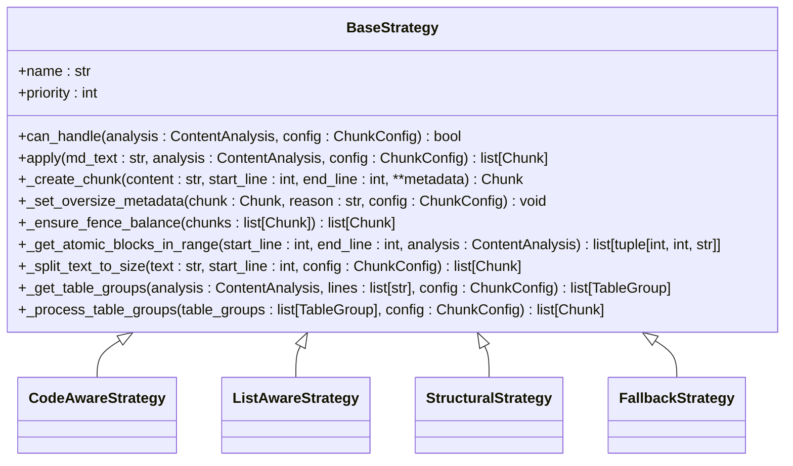
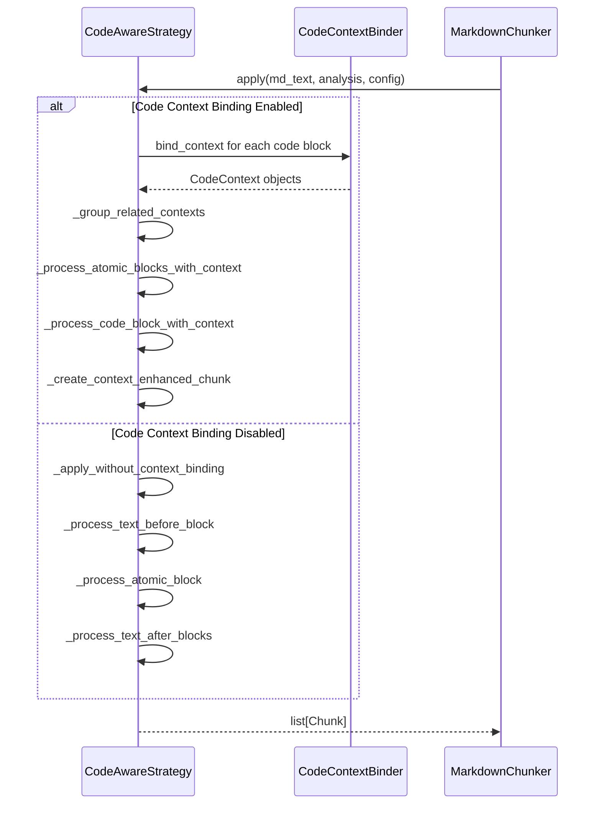
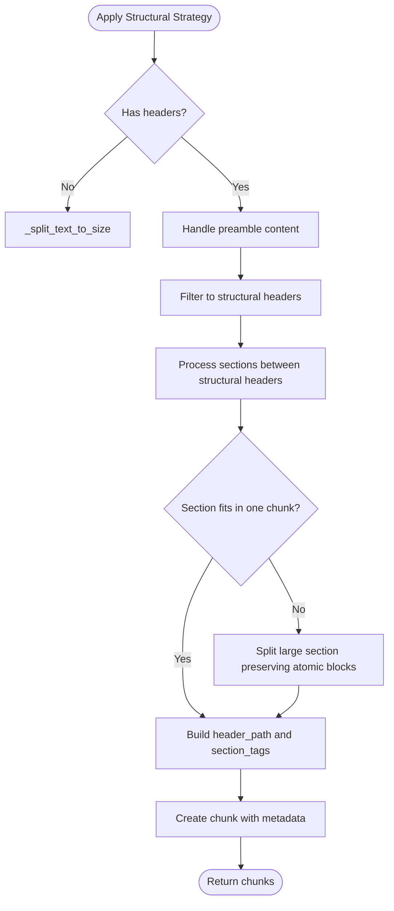
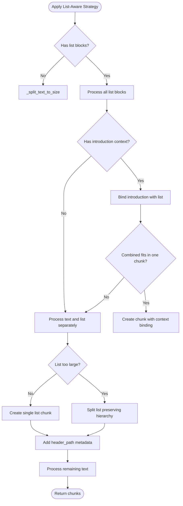
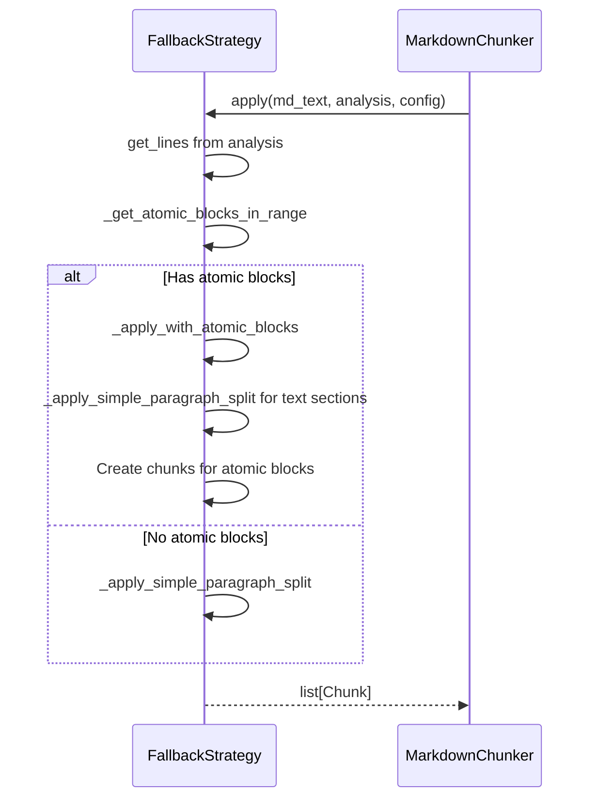

# Chunk Application

<cite>
**Referenced Files in This Document**   
- [base.py](file://src/chunkana/strategies/base.py)
- [code_aware.py](file://src/chunkana/strategies/code_aware.py)
- [structural.py](file://src/chunkana/strategies/structural.py)
- [list_aware.py](file://src/chunkana/strategies/list_aware.py)
- [fallback.py](file://src/chunkana/strategies/fallback.py)
- [config.py](file://src/chunkana/config.py)
- [types.py](file://src/chunkana/types.py)
- [chunker.py](file://src/chunkana/chunker.py)
</cite>

## Table of Contents
1. [Introduction](#introduction)
2. [Base Strategy Interface](#base-strategy-interface)
3. [Strategy Implementation Approaches](#strategy-implementation-approaches)
4. [Configuration Parameter Handling](#configuration-parameter-handling)
5. [Strategy Comparison Examples](#strategy-comparison-examples)
6. [Error Handling and Fallback Mechanisms](#error-handling-and-fallback-mechanisms)
7. [Memory Usage and Performance](#memory-usage-and-performance)
8. [Conclusion](#conclusion)

## Introduction
The chunk application phase in the chunkana library processes normalized text and analysis results through specialized strategies to create semantically meaningful chunks. Each strategy implements a unique approach to chunking based on document characteristics, while preserving atomic blocks such as code, tables, and LaTeX formulas. The system uses a priority-based selection mechanism to determine the most appropriate strategy for a given document, with the ability to override this selection through configuration. This document details how the strategies implement their approaches, interact with configuration parameters, handle edge cases, and perform under various conditions.

**Section sources**
- [base.py](file://src/chunkana/strategies/base.py#L1-L361)
- [chunker.py](file://src/chunkana/chunker.py#L85-L176)

## Base Strategy Interface

The `BaseStrategy` class defines the common interface for all chunking strategies in the chunkana library. This abstract base class establishes the contract that all concrete strategies must implement, ensuring consistency across different chunking approaches.



**Diagram sources**
- [base.py](file://src/chunkana/strategies/base.py#L15-L361)

The interface consists of several key components:

- **name**: A string identifier for the strategy, used in metadata and configuration
- **priority**: An integer indicating selection priority (1 = highest)
- **can_handle**: A method that determines whether the strategy can process the document based on analysis results and configuration
- **apply**: The main method that processes the normalized text and returns chunks

The base class also provides several utility methods that support the chunking process:

- `_create_chunk`: Creates a chunk with strategy metadata
- `_set_oversize_metadata`: Marks chunks that exceed size limits for valid reasons
- `_ensure_fence_balance`: Ensures code fences are balanced across chunks
- `_get_atomic_blocks_in_range`: Identifies atomic blocks within a line range
- `_split_text_to_size`: Splits text into chunks respecting size limits

These utility methods are shared across strategies, reducing code duplication and ensuring consistent behavior for common operations.

**Section sources**
- [base.py](file://src/chunkana/strategies/base.py#L15-L361)

## Strategy Implementation Approaches

### Code-Aware Strategy

The `CodeAwareStrategy` handles documents with code blocks or tables, preserving atomic blocks intact while splitting text around them. With the highest priority (1), it is selected for documents containing code blocks, tables, or when the code ratio exceeds the configured threshold.



**Diagram sources**
- [code_aware.py](file://src/chunkana/strategies/code_aware.py#L14-L752)

The strategy has two main execution paths:

1. **Without context binding**: Processes atomic blocks individually, creating separate chunks for each code block, table, or LaTeX formula while splitting surrounding text at paragraph boundaries.

2. **With context binding**: When enabled, it binds code blocks to their explanatory context and groups related blocks. This includes:
   - Before/After pairs when `preserve_before_after_pairs` is enabled
   - Code/Output pairs when `bind_output_blocks` is enabled
   - Related blocks with the same language in close proximity

The strategy preserves atomic blocks by never splitting them across chunks, even if they exceed the maximum chunk size. When this occurs, it marks the chunk with appropriate metadata indicating the reason for oversize status.

### Structural Strategy

The `StructuralStrategy` processes documents with hierarchical headers, splitting the document by header boundaries while maintaining the header hierarchy. It has a priority of 3 and is selected when the document has sufficient headers and hierarchy depth.



**Diagram sources**
- [structural.py](file://src/chunkana/strategies/structural.py#L15-L596)

Key features of the structural strategy include:

- **Header hierarchy preservation**: Builds a `header_path` that reflects the document's structural context (e.g., "/Chapter 1/Section 1.1")
- **Configurable structural levels**: The `max_structural_level` parameter determines which headers contribute to the structural context
- **Section tags**: Captures local sections (headers deeper than the structural level) as `section_tags`
- **Caching optimization**: Uses a header stack cache to avoid redundant computation when consecutive chunks share the same header context

For large sections that exceed the size limit, the strategy splits them while preserving any atomic blocks within the section, ensuring that code blocks, tables, and LaTeX formulas remain intact.

### List-Aware Strategy

The `ListAwareStrategy` handles list-heavy documents, preserving list hierarchies and binding context paragraphs to lists. With a priority of 2, it activates when documents meet specific list density criteria.



**Diagram sources**
- [list_aware.py](file://src/chunkana/strategies/list_aware.py#L15-L536)

The strategy employs several sophisticated techniques:

- **Introduction binding**: Detects and binds introduction paragraphs to lists when they end with a colon or contain phrases like "following" or "such as"
- **Hierarchy preservation**: When splitting large lists, it keeps parent items with all their children to maintain structural integrity
- **Contextual awareness**: Adds `header_path` metadata to chunks, building the hierarchy from headers that precede the chunk
- **Adaptive activation**: Uses different criteria for documents with strong structure (requiring both list ratio and count thresholds) versus those without (using OR logic)

The strategy creates rich metadata for list chunks, including information about nested lists, maximum depth, item count, checkbox statistics, and relationship types.

### Fallback Strategy

The `FallbackStrategy` serves as a universal strategy that works for any document, with the lowest priority (4). It splits documents by paragraphs and groups them to fit within the maximum chunk size.



**Diagram sources**
- [fallback.py](file://src/chunkana/strategies/fallback.py#L13-L187)

The fallback strategy implements a two-phase approach:

1. **Atomic block preservation**: When the document contains code blocks, tables, or LaTeX formulas, it preserves these blocks intact while splitting surrounding text into paragraph-sized chunks.

2. **Simple paragraph splitting**: For documents without atomic blocks, it splits on paragraph boundaries (double newlines) and groups paragraphs to fit within the maximum chunk size.

The strategy ensures that even when atomic blocks exceed the size limit, they are preserved as single chunks with appropriate oversize metadata.

**Section sources**
- [code_aware.py](file://src/chunkana/strategies/code_aware.py#L14-L752)
- [structural.py](file://src/chunkana/strategies/structural.py#L15-L596)
- [list_aware.py](file://src/chunkana/strategies/list_aware.py#L15-L536)
- [fallback.py](file://src/chunkana/strategies/fallback.py#L13-L187)

## Configuration Parameter Handling

### Effective Configuration Parameters

The chunking process respects several key configuration parameters that influence strategy behavior:

#### Max Chunk Size
The `max_chunk_size` parameter defines the maximum size of a chunk in characters. Strategies respect this limit while preserving atomic blocks. When an atomic block exceeds this size, the strategy creates a chunk anyway but marks it with oversize metadata:

```python
if chunk.size > config.max_chunk_size:
    self._set_oversize_metadata(chunk, "code_block_integrity", config)
```

This ensures that code blocks, tables, and LaTeX formulas remain intact even when they exceed the size limit, preserving their semantic meaning.

#### Preserve Atomic Blocks
The `preserve_atomic_blocks` parameter controls whether atomic blocks should be kept intact. When enabled (default), strategies never split code blocks, tables, or LaTeX formulas across chunks. The base strategy provides utility methods to identify and handle these blocks:

```python
def _get_atomic_blocks_in_range(self, start_line: int, end_line: int, analysis: ContentAnalysis) -> list[tuple[int, int, str]]:
    # Returns list of (block_start, block_end, block_type) tuples
    # for code, table, and LaTeX blocks in the specified range
```

Strategies use this method to identify atomic blocks within sections and ensure they are processed as single units.

### Strategy Selection Parameters

The system uses several parameters to determine which strategy to apply:

- **code_threshold**: The minimum code ratio (code characters / total characters) for the `CodeAwareStrategy` to activate
- **structure_threshold**: The minimum number of headers for the `StructuralStrategy` to activate
- **list_ratio_threshold**: The minimum list ratio for the `ListAwareStrategy` to activate
- **list_count_threshold**: The minimum number of list blocks for the `ListAwareStrategy` to activate

The `StrategySelector` evaluates these parameters in priority order, selecting the first strategy whose `can_handle` method returns true.

### Code Context Binding Parameters

When code context binding is enabled, several parameters influence how code blocks are processed:

- **enable_code_context_binding**: Enables enhanced code-context binding
- **max_context_chars_before**: Maximum characters to search backward for explanations
- **max_context_chars_after**: Maximum characters to search forward for explanations
- **related_block_max_gap**: Maximum line gap to consider blocks related
- **bind_output_blocks**: Automatically binds output blocks to code
- **preserve_before_after_pairs**: Keeps Before/After examples in a single chunk

These parameters allow fine-tuning of how code blocks are grouped and contextualized, improving the semantic coherence of the resulting chunks.

**Section sources**
- [config.py](file://src/chunkana/config.py#L17-L507)
- [base.py](file://src/chunkana/strategies/base.py#L90-L117)
- [code_aware.py](file://src/chunkana/strategies/code_aware.py#L32-L40)

## Strategy Comparison Examples

To illustrate the different approaches of the strategies, consider the following input document:

```markdown
# Data Analysis Example

This section demonstrates data processing with Python.

```python
import pandas as pd
df = pd.read_csv('data.csv')
```

The code above loads a CSV file into a DataFrame.

## Data Summary

| Metric | Value |
|--------|-------|
| Rows | 1000 |
| Columns | 5 |

The table shows basic statistics about the dataset.
```

### Code-Aware Strategy Output
The `CodeAwareStrategy` would produce three chunks:

1. **Text before code block**: Contains the introductory text up to the code block
2. **Code block**: Preserves the entire code block as a single chunk with metadata indicating code block integrity
3. **Remaining content**: Combines the text after the code block, the header, the table, and the final text

The table is preserved as an atomic block, even if it exceeds the maximum chunk size, with appropriate oversize metadata.

### Structural Strategy Output
The `StructuralStrategy` would split at header boundaries:

1. **Preamble chunk**: Contains content before the first header
2. **Section 1 chunk**: Contains the content under "# Data Analysis Example" including the code block
3. **Section 2 chunk**: Contains the content under "## Data Summary" including the table

Each chunk would have a `header_path` metadata field indicating its position in the document hierarchy, such as "/Data Analysis Example" for the second chunk.

### List-Aware Strategy Output
Since this document doesn't contain lists, the `ListAwareStrategy` would not be selected. However, if the document contained lists, it would preserve list hierarchies and potentially bind introduction paragraphs to lists when appropriate.

### Fallback Strategy Output
The `FallbackStrategy` would produce chunks based on paragraph boundaries:

1. **First paragraph**: The text before the code block
2. **Code block**: Preserved as a single chunk
3. **Second paragraph**: The text after the code block
4. **Header and table**: The header and table might be combined into a single chunk
5. **Final paragraph**: The concluding text

The exact output would depend on the `max_chunk_size` parameter and whether the text sections exceed this limit.

These examples demonstrate how each strategy applies its unique approach to creating semantically meaningful chunks while respecting the document's structure and content types.

**Section sources**
- [test_strategies.py](file://tests/unit/test_strategies.py#L165-L364)
- [code_aware.py](file://src/chunkana/strategies/code_aware.py#L42-L103)
- [structural.py](file://src/chunkana/strategies/structural.py#L58-L150)

## Error Handling and Fallback Mechanisms

### Strategy Application Errors

The chunking system implements robust error handling to ensure reliable operation even when strategy application fails. The primary mechanism is the fallback strategy, which serves as a universal fallback for any document.

When a strategy's `apply` method encounters an error, the system relies on the `StrategySelector` to ensure a valid strategy is always selected:

```python
def select(self, analysis: ContentAnalysis, config: ChunkConfig) -> BaseStrategy:
    # Check for strategy override
    if config.strategy_override:
        return self.get_by_name(config.strategy_override)
    
    # Select by priority
    for strategy in self.strategies:
        if strategy.can_handle(analysis, config):
            return strategy
    
    # Fallback always works
    return self.strategies[-1]
```

The `FallbackStrategy`'s `can_handle` method always returns `True`, guaranteeing that a strategy is always available.

### Validation and Correction

After strategy application, the `MarkdownChunker` performs validation and correction to ensure the integrity of the chunking results:

```python
def _validate(self, chunks: list[Chunk], original: str) -> None:
    # PROP-2: Size bounds
    for chunk in chunks:
        if chunk.size > self.config.max_chunk_size and not chunk.metadata.get("allow_oversize"):
            # Set default oversize metadata
            chunk.metadata["allow_oversize"] = True
            if "```" in chunk.content:
                chunk.metadata["oversize_reason"] = "code_block_integrity"
            elif "|" in chunk.content and "---" in chunk.content:
                chunk.metadata["oversize_reason"] = "table_integrity"
            else:
                chunk.metadata["oversize_reason"] = "section_integrity"
    
    # PROP-3: Monotonic ordering
    for i in range(len(chunks) - 1):
        if chunks[i].start_line > chunks[i + 1].start_line:
            # Fix ordering
            chunks.sort(key=lambda c: (c.start_line, c.end_line))
            break
```

This validation process ensures that chunks exceeding the size limit are properly marked and that chunks maintain monotonic ordering by line number.

### Fence Balance Correction

The base strategy includes a method to ensure code fences are balanced across chunks:

```python
def _ensure_fence_balance(self, chunks: list[Chunk]) -> list[Chunk]:
    result = []
    i = 0
    
    while i < len(chunks):
        chunk = chunks[i]
        fence_count = chunk.content.count("```")
        
        if fence_count % 2 == 0:
            # Balanced - keep as is
            result.append(chunk)
            i += 1
        else:
            # Unbalanced - try to merge with next chunk
            if i + 1 < len(chunks):
                merged_content = chunk.content + "\n" + chunks[i + 1].content
                merged_fence_count = merged_content.count("```")
                
                if merged_fence_count % 2 == 0:
                    # Merge restored balance
                    merged_chunk = self._create_chunk(
                        content=merged_content,
                        start_line=chunk.start_line,
                        end_line=chunks[i + 1].end_line,
                        merged_for_fence_balance=True,
                    )
                    result.append(merged_chunk)
                    i += 2
                    continue
            
            # Merge didn't help - mark error
            chunk.metadata["fence_balance_error"] = True
            chunk.metadata["fence_count"] = fence_count
            result.append(chunk)
            i += 1
    
    return result
```

This method attempts to merge adjacent chunks when a chunk has an unbalanced number of code fences, restoring balance when possible. If merging doesn't resolve the issue, it marks the chunk with an error flag for downstream processing.

**Section sources**
- [chunker.py](file://src/chunkana/chunker.py#L431-L468)
- [base.py](file://src/chunkana/strategies/base.py#L118-L166)

## Memory Usage and Performance

### Memory Usage Patterns

The chunk application phase exhibits different memory usage patterns depending on the strategy and document characteristics:

- **Code-Aware Strategy**: Memory usage is proportional to the number of code blocks and tables, as it maintains context information for each block. When code context binding is enabled, memory usage increases due to the storage of context information and grouping data.

- **Structural Strategy**: Memory usage is primarily determined by the header hierarchy depth, as it maintains a stack of headers for context tracking. The caching of header stacks reduces redundant computation but increases memory usage for documents with complex hierarchies.

- **List-Aware Strategy**: Memory usage scales with the number and depth of list items, as it processes and groups list items while preserving hierarchy.

- **Fallback Strategy**: Has the lowest memory footprint as it primarily processes text in a streaming fashion, only maintaining state for the current chunk being processed.

The system optimizes memory usage through several techniques:

- **Line array caching**: The `ContentAnalysis` object can cache the document's line array, avoiding redundant splitting operations
- **Lazy evaluation**: Strategies only process the portions of the document they need, rather than loading everything into memory at once
- **Incremental processing**: The fallback strategy processes text incrementally, minimizing memory usage for large documents

### Performance Characteristics

The performance of different strategy implementations varies based on document structure and configuration:

- **Code-Aware Strategy**: Performance is optimized for documents with code blocks and tables. The strategy's performance scales linearly with the number of atomic blocks, with additional overhead when code context binding is enabled.

- **Structural Strategy**: Performs efficiently on documents with clear hierarchical structure. The header stack caching provides significant performance benefits for documents with repetitive header patterns.

- **List-Aware Strategy**: Performance depends on the complexity of list structures. Documents with deeply nested lists require more processing time to preserve hierarchy.

- **Fallback Strategy**: Provides consistent performance across document types, with processing time primarily determined by document length.

The system includes several performance optimizations:

- **O1: Line array optimization**: Strategies use cached lines from analysis when available, avoiding redundant split operations
- **O4: Header stack cache**: The structural strategy caches header stacks to avoid redundant computation
- **Efficient text splitting**: The `_split_text_to_size` method splits text at paragraph boundaries efficiently

Benchmark testing in `test_performance_regression.py` ensures that performance remains stable across versions, with specific tests for different document types and sizes.

**Section sources**
- [chunker.py](file://src/chunkana/chunker.py#L111-L115)
- [structural.py](file://src/chunkana/strategies/structural.py#L41-L42)
- [types.py](file://src/chunkana/types.py#L221-L237)

## Conclusion
The chunk application phase in the chunkana library implements a sophisticated strategy-based approach to creating semantically meaningful chunks from markdown documents. By defining a common interface in the `BaseStrategy` class and implementing specialized strategies for different document types, the system effectively handles various content structures while preserving atomic blocks. The strategies respect configuration parameters such as `max_chunk_size` and `preserve_atomic_blocks`, ensuring consistent behavior across different use cases. Robust error handling and fallback mechanisms guarantee reliable operation, while performance optimizations maintain efficiency even with complex documents. The combination of specialized strategies, flexible configuration, and comprehensive error handling makes the chunk application phase a robust and effective component of the overall chunking pipeline.