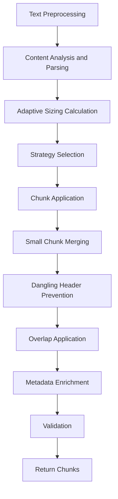
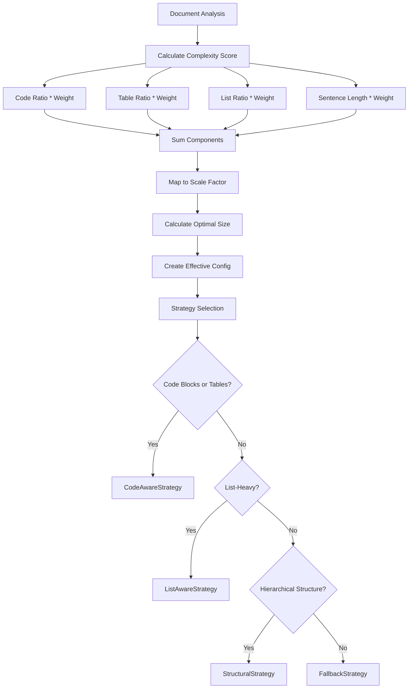
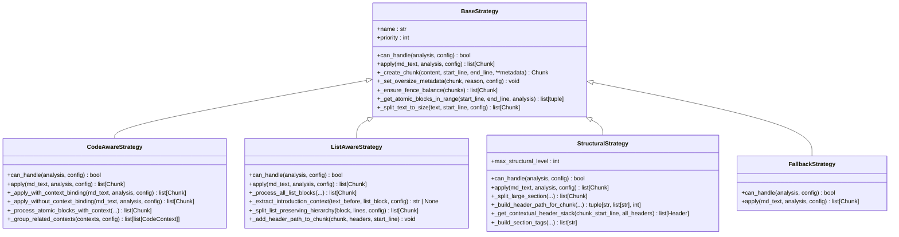

# Core Chunking Pipeline

<cite>
**Referenced Files in This Document**   
- [chunker.py](file://src/chunkana/chunker.py)
- [adaptive_sizing.py](file://src/chunkana/adaptive_sizing.py)
- [parser.py](file://src/chunkana/parser.py)
- [config.py](file://src/chunkana/config.py)
- [types.py](file://src/chunkana/types.py)
- [strategies/__init__.py](file://src/chunkana/strategies/__init__.py)
- [strategies/base.py](file://src/chunkana/strategies/base.py)
- [strategies/code_aware.py](file://src/chunkana/strategies/code_aware.py)
- [strategies/list_aware.py](file://src/chunkana/strategies/list_aware.py)
- [strategies/structural.py](file://src/chunkana/strategies/structural.py)
- [header_processor.py](file://src/chunkana/header_processor.py)
- [metadata_recalculator.py](file://src/chunkana/metadata_recalculator.py)
- [validator.py](file://src/chunkana/validator.py)
</cite>

## Table of Contents
1. [Introduction](#introduction)
2. [Pipeline Overview](#pipeline-overview)
3. [Text Preprocessing](#text-preprocessing)
4. [Content Analysis and Parsing](#content-analysis-and-parsing)
5. [Adaptive Sizing and Strategy Selection](#adaptive-sizing-and-strategy-selection)
6. [Chunk Application and Strategy Implementation](#chunk-application-and-strategy-implementation)
7. [Small Chunk Merging](#small-chunk-merging)
8. [Dangling Header Prevention](#dangling-header-prevention)
9. [Overlap Application](#overlap-application)
10. [Metadata Enrichment](#metadata-enrichment)
11. [Validation](#validation)
12. [Performance Considerations](#performance-considerations)

## Introduction
The core chunking pipeline implemented in the `chunk()` method provides a comprehensive system for processing markdown documents into semantically meaningful chunks. This pipeline follows a linear, single-pass architecture designed for reliability and predictability. The process begins with text preprocessing and document parsing, followed by adaptive sizing calculations and strategy selection based on document characteristics. The selected strategy then applies chunking rules, after which several post-processing stages refine the results through small chunk merging, dangling header prevention, overlap application, and metadata enrichment. The pipeline concludes with validation to ensure the integrity of the chunking process. This document provides a detailed analysis of each processing stage, including data flow diagrams, configuration interactions, error handling mechanisms, and performance characteristics.

**Section sources**
- [chunker.py](file://src/chunkana/chunker.py#L85-L176)

## Pipeline Overview
The chunking pipeline follows a linear sequence of processing stages that transform raw markdown text into validated chunks. Each stage builds upon the output of the previous stage, creating a stateful transformation process. The pipeline begins with text preprocessing to normalize the input, followed by content analysis to extract structural elements and calculate document metrics. Based on this analysis, the system determines an adaptive chunk size and selects an appropriate chunking strategy. The chosen strategy applies its specific rules to create initial chunks, which then undergo several post-processing stages including small chunk merging, dangling header prevention, and overlap application. Finally, metadata enrichment adds contextual information to each chunk before validation ensures the results meet quality criteria. This linear design ensures predictable behavior and simplifies debugging, as each stage has well-defined inputs and outputs with minimal side effects.

**Diagram sources** 
- [chunker.py](file://src/chunkana/chunker.py#L85-L176)

**Section sources**
- [chunker.py](file://src/chunkana/chunker.py#L85-L176)

## Text Preprocessing
The text preprocessing stage normalizes the input markdown text before further processing. This stage specifically handles Obsidian block ID removal when configured, eliminating identifiers that appear at the end of lines in the format `^identifier`. The preprocessing occurs immediately after input validation and before document parsing, ensuring that subsequent stages work with clean content. The implementation uses a regular expression to identify and remove these block IDs, preserving the rest of the line content. This preprocessing step is optional and controlled by the `strip_obsidian_block_ids` configuration parameter, which defaults to false. When enabled, the preprocessing ensures that these metadata markers do not interfere with content analysis or chunk boundaries, particularly for documents originating from Obsidian or similar knowledge management systems.

**Section sources**
- [chunker.py](file://src/chunkana/chunker.py#L66-L83)

## Content Analysis and Parsing
The content analysis and parsing stage extracts structural elements and calculates document metrics through a comprehensive analysis process. The parser identifies and extracts code blocks, LaTeX formulas, headers, tables, and lists while normalizing line endings to Unix-style format. This stage produces a `ContentAnalysis` object containing both extracted elements and calculated metrics such as code ratio, list ratio, average sentence length, and structural depth. The analysis process is optimized through several performance enhancements, including pre-compiled regular expressions, a position index for O(1) line position lookups, and shared line arrays to avoid redundant string operations. The parser handles nested fences, mixed fence types, and unclosed fences, ensuring robust extraction even from malformed markdown. The resulting analysis serves as the foundation for strategy selection, adaptive sizing, and subsequent chunking operations.

**Section sources**
- [parser.py](file://src/chunkana/parser.py#L44-L121)
- [types.py](file://src/chunkana/types.py#L181-L238)

## Adaptive Sizing and Strategy Selection
The adaptive sizing and strategy selection stage determines the optimal chunk size and appropriate processing strategy based on document characteristics. Adaptive sizing calculates an optimal chunk size by analyzing content complexity, which is derived from factors such as code ratio, table presence, list density, and sentence length. The complexity score is mapped to a scale factor that adjusts the base chunk size within configurable minimum and maximum bounds. This calculated size is used to create an effective configuration that temporarily overrides the original configuration for the current processing session. Strategy selection follows a priority-based approach, with the system evaluating document characteristics against threshold values to determine the most appropriate strategy. The selection order prioritizes code-aware processing for technical content, list-aware processing for bulleted content, structural processing for hierarchical documents, with a fallback strategy ensuring universal coverage.

**Diagram sources** 
- [chunker.py](file://src/chunkana/chunker.py#L117-L145)
- [adaptive_sizing.py](file://src/chunkana/adaptive_sizing.py#L120-L167)
- [strategies/__init__.py](file://src/chunkana/strategies/__init__.py#L54-L57)

**Section sources**
- [chunker.py](file://src/chunkana/chunker.py#L117-L145)
- [adaptive_sizing.py](file://src/chunkana/adaptive_sizing.py#L120-L167)
- [strategies/__init__.py](file://src/chunkana/strategies/__init__.py#L54-L57)

## Chunk Application and Strategy Implementation
The chunk application stage implements the selected strategy to divide the document into chunks according to specific rules and heuristics. Each strategy type addresses different document characteristics: CodeAwareStrategy preserves atomic blocks like code and tables while splitting around them; ListAwareStrategy maintains list hierarchies and binds introduction paragraphs to lists; StructuralStrategy splits documents by headers while maintaining hierarchy; and FallbackStrategy provides universal coverage. The strategies share common functionality through the BaseStrategy class, which provides utilities for creating chunks, handling atomic blocks, and splitting text. Strategy implementation considers document structure, content type, and configuration parameters to produce chunks that balance size constraints with semantic integrity. The selected strategy applies its rules to the normalized text and analysis results, producing an initial set of chunks that serve as input for subsequent post-processing stages.

**Diagram sources** 
- [strategies/base.py](file://src/chunkana/strategies/base.py#L15-L361)
- [strategies/code_aware.py](file://src/chunkana/strategies/code_aware.py#L14-L752)
- [strategies/list_aware.py](file://src/chunkana/strategies/list_aware.py#L15-L536)
- [strategies/structural.py](file://src/chunkana/strategies/structural.py#L15-L596)

**Section sources**
- [strategies/base.py](file://src/chunkana/strategies/base.py#L15-L361)
- [strategies/code_aware.py](file://src/chunkana/strategies/code_aware.py#L14-L752)
- [strategies/list_aware.py](file://src/chunkana/strategies/list_aware.py#L15-L536)
- [strategies/structural.py](file://src/chunkana/strategies/structural.py#L15-L596)

## Small Chunk Merging
The small chunk merging stage combines undersized chunks with adjacent chunks to improve content coherence and meet minimum size requirements. This process occurs in two phases: first merging small header chunks with their section bodies, then addressing remaining small chunks through size-based merging. The header chunk merging targets top-level headers (levels 1-2) with minimal content (less than 150 characters) that are followed by content in the same or a child section. The size-based merging evaluates each small chunk against its neighbors, preferring to merge with the previous chunk when possible and considering structural compatibility (preamble chunks are not merged with structural chunks). Chunks that cannot be merged without exceeding the maximum size are flagged as small_chunk only if they are structurally weak, determined by criteria such as header level, paragraph count, and meaningful content length. This approach preserves semantically significant small chunks while consolidating those that would otherwise fragment the document.

**Section sources**
- [chunker.py](file://src/chunkana/chunker.py#L470-L514)

## Dangling Header Prevention
The dangling header prevention stage detects and resolves situations where headers are separated from their content across chunk boundaries. The system identifies dangling headers by analyzing the last non-empty line of each chunk, flagging headers at levels 3-6 that lack substantial content and are followed by chunks containing relevant content. The prevention mechanism employs a two-step approach: first attempting to move the header to the beginning of the next chunk, and if that would exceed size limits, attempting to merge the chunks. The process tracks header movements through the header_moved_from metadata field, which records the source chunk index to maintain provenance. The implementation iteratively applies fixes until no more dangling headers are detected or a maximum iteration count is reached, preventing infinite loops in complex documents. This stage ensures that headers remain semantically connected to their content, improving the usability of chunks for downstream applications like search and retrieval.

**Section sources**
- [header_processor.py](file://src/chunkana/header_processor.py#L405-L450)

## Overlap Application
The overlap application stage adds metadata-only context between adjacent chunks to improve continuity and understanding at chunk boundaries. This implementation uses a metadata-only approach where context from neighboring chunks is stored in metadata fields (previous_content and next_content) without duplicating text in the chunk content. The overlap size is determined by the config.overlap_size parameter but is capped at a configurable ratio (default 35%) of the adjacent chunk's size to prevent bloat. The system extracts overlap text with word boundary awareness, attempting to break at spaces when possible to avoid splitting words. For the first chunk, only next_content is added; for the last chunk, only previous_content is added; and for middle chunks, both fields are populated. This approach provides language models with context about adjacent content while maintaining distinct, non-overlapping chunk content, avoiding issues with index bloat and semantic search confusion that can arise from text duplication.

**Section sources**
- [chunker.py](file://src/chunkana/chunker.py#L301-L369)

## Metadata Enrichment
The metadata enrichment stage adds contextual information to chunks through multiple mechanisms, enhancing their utility for downstream applications. The process begins with strategy-specific metadata added during chunk creation, including content_type, header_path, and strategy identifiers. Following post-processing stages, the system applies additional metadata enrichment, including adaptive sizing parameters when enabled, and recalculates derived metadata fields like section_tags to ensure consistency after operations such as dangling header fixes and chunk merging. The metadata_recalculator component ensures that section_tags accurately reflect the actual headers present in each chunk's content, maintaining integrity after structural modifications. Various strategies add specialized metadata, such as code context roles, list hierarchy information, and table grouping details. The enrichment process also includes validation metadata, such as small_chunk flags and oversize reasons, providing transparency into the chunking decisions and enabling informed usage by downstream systems.

**Section sources**
- [chunker.py](file://src/chunkana/chunker.py#L162-L172)
- [metadata_recalculator.py](file://src/chunkana/metadata_recalculator.py#L33-L72)

## Validation
The validation stage ensures the integrity of the chunking results by verifying compliance with five domain properties (PROP-1 through PROP-5). PROP-1 checks for content loss by comparing the total output size to the original input, allowing a 10% variance for overlap and normalization. PROP-2 verifies size bounds, ensuring chunks respect the maximum size unless explicitly marked as oversize with a valid reason. PROP-3 confirms monotonic ordering by checking that chunks are in sequence by start_line. PROP-4 validates that no chunks have empty content, and PROP-5 ensures valid line numbers with proper start/end relationships. The validation process is implemented in the Validator class and applied as the final step in the pipeline. While some checks trigger warnings rather than errors (allowing the pipeline to continue), the overall validation ensures that the output meets quality standards and maintains document integrity throughout the chunking process.

**Section sources**
- [chunker.py](file://src/chunkana/chunker.py#L431-L468)
- [validator.py](file://src/chunkana/validator.py#L47-L91)

## Performance Considerations
The chunking pipeline is designed with performance considerations that balance efficiency, memory usage, and processing speed. The linear pipeline design minimizes state complexity and enables straightforward optimization, while the single-parse architecture reduces computational overhead by analyzing the document once and reusing the results throughout the process. Memory usage is optimized through the use of generators for streaming operations, pre-compiled regular expressions, and shared data structures like the line array cache in ContentAnalysis. The adaptive sizing calculation and strategy selection are lightweight operations that leverage the pre-computed analysis metrics, avoiding redundant processing. For large documents, the streaming interface provides memory-efficient processing by chunking files incrementally rather than loading them entirely into memory. The implementation prioritizes algorithmic efficiency through O(1) position lookups, early termination in list processing, and optimized fence detection, ensuring responsive performance even with complex documents.

**Section sources**
- [chunker.py](file://src/chunkana/chunker.py#L85-L176)
- [parser.py](file://src/chunkana/parser.py#L143-L166)
- [chunker.py](file://src/chunkana/chunker.py#L249-L273)