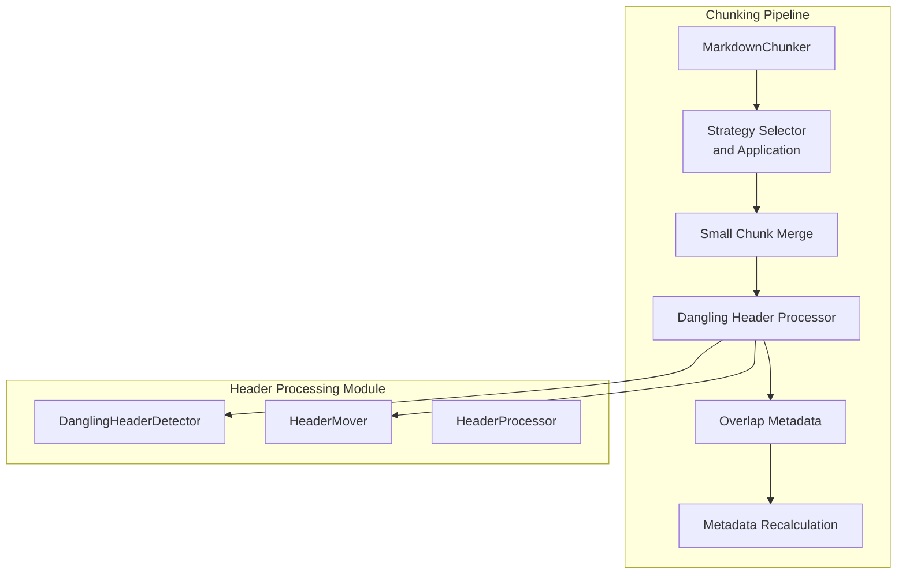
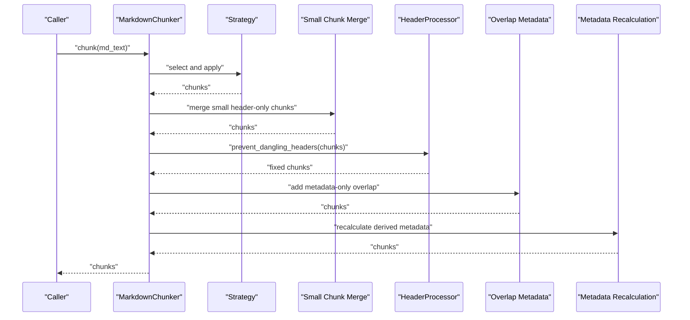
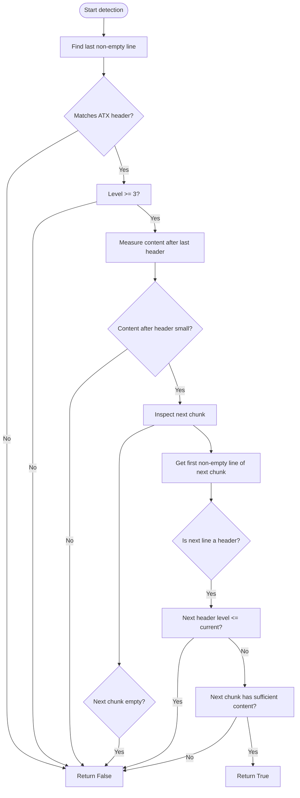
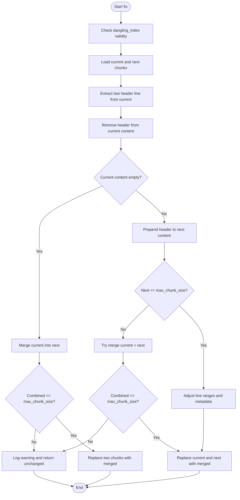
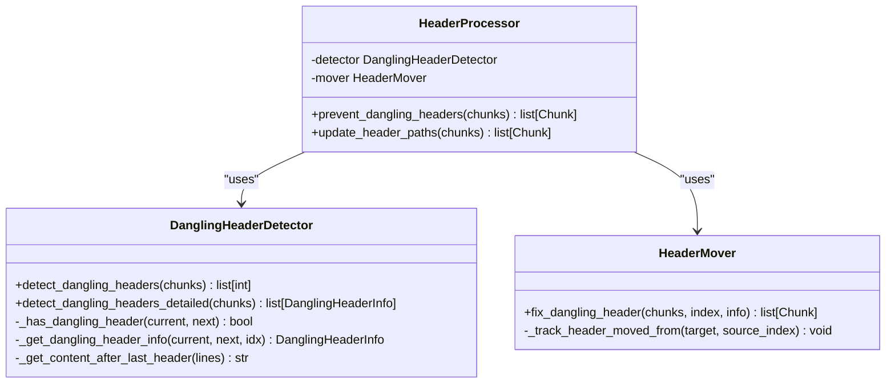
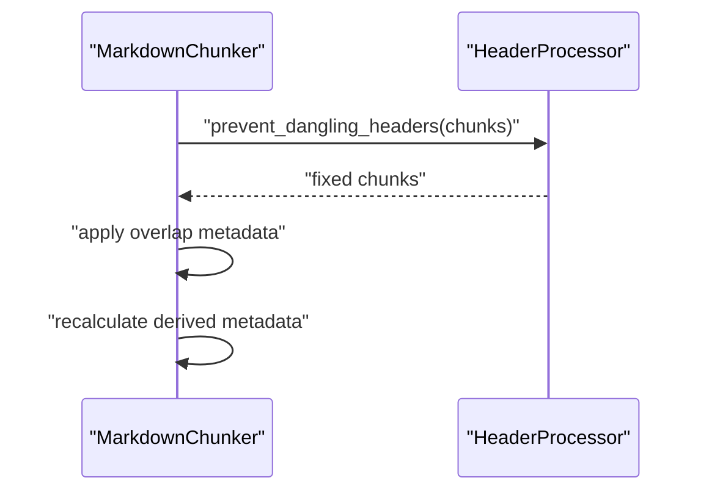
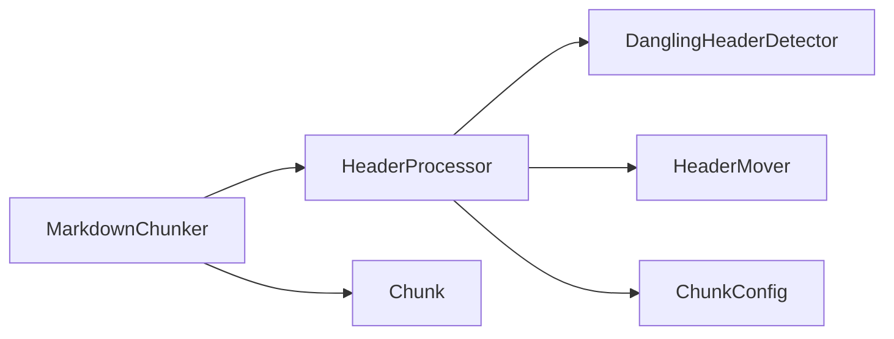

# Dangling Header Prevention

<cite>
**Referenced Files in This Document**
- [header_processor.py](file://src/chunkana/header_processor.py)
- [chunker.py](file://src/chunkana/chunker.py)
- [types.py](file://src/chunkana/types.py)
- [config.py](file://src/chunkana/config.py)
- [test_dangling_headers.py](file://test_dangling_headers.py)
</cite>

## Table of Contents
1. [Introduction](#introduction)
2. [Project Structure](#project-structure)
3. [Core Components](#core-components)
4. [Architecture Overview](#architecture-overview)
5. [Detailed Component Analysis](#detailed-component-analysis)
6. [Dependency Analysis](#dependency-analysis)
7. [Performance Considerations](#performance-considerations)
8. [Troubleshooting Guide](#troubleshooting-guide)
9. [Conclusion](#conclusion)

## Introduction
This document explains the dangling header prevention mechanism implemented in the chunker. It focuses on how the system detects headers that appear alone at the end of a chunk without sufficient context or content, and how it resolves them by moving the header into the next chunk or merging chunks when appropriate. It also describes the conditions that determine whether a header chunk should be merged, including header level, size thresholds, and section continuity. Finally, it covers the interaction between the chunker and the header processor, configuration options that influence behavior, and performance implications.

## Project Structure
The dangling header prevention lives in a dedicated module and is integrated into the main chunking pipeline. The key files are:
- Header processing logic: [header_processor.py](file://src/chunkana/header_processor.py)
- Main chunker pipeline: [chunker.py](file://src/chunkana/chunker.py)
- Types and metadata: [types.py](file://src/chunkana/types.py)
- Configuration: [config.py](file://src/chunkana/config.py)
- Tests: [test_dangling_headers.py](file://test_dangling_headers.py)

**Diagram sources**
- [chunker.py](file://src/chunkana/chunker.py#L146-L176)
- [header_processor.py](file://src/chunkana/header_processor.py#L393-L473)

**Section sources**
- [chunker.py](file://src/chunkana/chunker.py#L146-L176)
- [header_processor.py](file://src/chunkana/header_processor.py#L393-L473)

## Core Components
- DanglingHeaderDetector: Scans chunk pairs to identify dangling headers at the end of a chunk that should be attached to the next chunk’s content.
- HeaderMover: Applies the fix by either moving the header into the next chunk or merging the two chunks if moving would exceed size limits.
- HeaderProcessor: Orchestrates detection and iterative fixing, tracks header movement provenance, and marks chunks for header path updates.

Key behaviors:
- Detection focuses on ATX headers (levels 3–6) at the end of a chunk, with heuristics to avoid false positives.
- Fixing prefers moving the header into the next chunk; if that would exceed size limits, it tries merging; otherwise it logs a warning and leaves the chunks unchanged.
- Movement provenance is tracked via metadata to support downstream navigation and analytics.

**Section sources**
- [header_processor.py](file://src/chunkana/header_processor.py#L29-L238)
- [header_processor.py](file://src/chunkana/header_processor.py#L240-L391)
- [header_processor.py](file://src/chunkana/header_processor.py#L393-L473)

## Architecture Overview
The chunker integrates the dangling header prevention as a post-processing step after strategy application and small chunk merging, but before overlap metadata and final validation.

**Diagram sources**
- [chunker.py](file://src/chunkana/chunker.py#L146-L176)
- [chunker.py](file://src/chunkana/chunker.py#L471-L514)
- [chunker.py](file://src/chunkana/chunker.py#L516-L580)
- [chunker.py](file://src/chunkana/chunker.py#L301-L370)
- [chunker.py](file://src/chunkana/chunker.py#L431-L470)
- [header_processor.py](file://src/chunkana/header_processor.py#L393-L473)

## Detailed Component Analysis

### DanglingHeaderDetector
Responsibilities:
- Identify chunks that end with a header (levels 3–6) and whose next chunk contains content that logically belongs to that header.
- Heuristics:
  - The last non-empty line of the current chunk must match an ATX header pattern.
  - The header must be level 3 or deeper to be considered potentially dangling.
  - The amount of content immediately after the last header in the current chunk must be small (threshold used during detection).
  - The next chunk must be non-empty and start with content that is not a header of the same or higher level.
  - The next chunk must contain a minimum amount of content to be considered a legitimate continuation.

**Diagram sources**
- [header_processor.py](file://src/chunkana/header_processor.py#L86-L150)
- [header_processor.py](file://src/chunkana/header_processor.py#L151-L214)

**Section sources**
- [header_processor.py](file://src/chunkana/header_processor.py#L86-L150)
- [header_processor.py](file://src/chunkana/header_processor.py#L151-L214)

### HeaderMover
Responsibilities:
- Attempt to move the header from the end of the current chunk into the next chunk.
- If moving would exceed size limits, attempt to merge the two chunks.
- If merging would still exceed limits, log a warning and leave chunks unchanged.
- Track the source chunk index for the moved header in metadata.

Fixing strategy:
- If removing the header from the current chunk leaves it empty, merge the entire current chunk into the next chunk.
- Otherwise, prepend the header to the next chunk’s content and adjust line ranges and metadata accordingly.
- If the next chunk would exceed size limits, combine both chunks into one merged chunk.
- If neither move nor merge is feasible, warn and keep the chunks as-is.

**Diagram sources**
- [header_processor.py](file://src/chunkana/header_processor.py#L250-L371)
- [header_processor.py](file://src/chunkana/header_processor.py#L372-L391)

**Section sources**
- [header_processor.py](file://src/chunkana/header_processor.py#L250-L371)
- [header_processor.py](file://src/chunkana/header_processor.py#L372-L391)

### HeaderProcessor
Responsibilities:
- Iteratively detect and fix dangling headers until none remain or a maximum iteration threshold is reached.
- Track movement provenance via metadata and mark chunks for header path updates.
- Provide a placeholder method to update header_path metadata after movement.

Behavior highlights:
- Iterative loop: Fixes one dangling header at a time to avoid index shifts.
- Iteration limit: Prevents infinite loops on complex documents.
- Metadata: Sets flags indicating that a header was moved and that header_path may need recalculation.

**Diagram sources**
- [header_processor.py](file://src/chunkana/header_processor.py#L393-L473)
- [header_processor.py](file://src/chunkana/header_processor.py#L29-L238)
- [header_processor.py](file://src/chunkana/header_processor.py#L240-L391)

**Section sources**
- [header_processor.py](file://src/chunkana/header_processor.py#L393-L473)

### Integration with MarkdownChunker
The dangling header prevention is invoked in the main pipeline after small chunk merging and before overlap metadata and final validation.

Key integration points:
- After strategy application and small chunk merging, the chunker calls the header processor to fix dangling headers.
- The chunker also recalculates derived metadata after all post-processing steps.

**Diagram sources**
- [chunker.py](file://src/chunkana/chunker.py#L146-L176)
- [chunker.py](file://src/chunkana/chunker.py#L301-L370)
- [chunker.py](file://src/chunkana/chunker.py#L431-L470)
- [header_processor.py](file://src/chunkana/header_processor.py#L393-L473)

**Section sources**
- [chunker.py](file://src/chunkana/chunker.py#L146-L176)
- [chunker.py](file://src/chunkana/chunker.py#L471-L514)
- [chunker.py](file://src/chunkana/chunker.py#L516-L580)
- [chunker.py](file://src/chunkana/chunker.py#L301-L370)
- [chunker.py](file://src/chunkana/chunker.py#L431-L470)

## Dependency Analysis
- HeaderProcessor depends on:
  - DanglingHeaderDetector for detection logic.
  - HeaderMover for applying fixes.
  - ChunkConfig for size limits and thresholds.
- MarkdownChunker composes HeaderProcessor and invokes it in the pipeline.
- Types define the Chunk structure and metadata fields used by the header processor.

**Diagram sources**
- [chunker.py](file://src/chunkana/chunker.py#L48-L65)
- [header_processor.py](file://src/chunkana/header_processor.py#L393-L473)
- [types.py](file://src/chunkana/types.py#L240-L399)
- [config.py](file://src/chunkana/config.py#L77-L126)

**Section sources**
- [chunker.py](file://src/chunkana/chunker.py#L48-L65)
- [header_processor.py](file://src/chunkana/header_processor.py#L393-L473)
- [types.py](file://src/chunkana/types.py#L240-L399)
- [config.py](file://src/chunkana/config.py#L77-L126)

## Performance Considerations
- Detection cost: Linear scan across chunk pairs with lightweight string operations and regex matching. Complexity is approximately O(N) for N chunks.
- Fixing cost: Single-pass movement or merge per dangling header detected. Iterative fixing can increase cost slightly if multiple passes are needed.
- Memory: Minimal overhead; operations are in-place copies of lists and shallow copies of metadata.
- Configuration impact:
  - max_chunk_size directly affects feasibility of moving or merging; smaller sizes increase the chance of merges or warnings.
  - overlap_size influences downstream overlap metadata computation but does not affect dangling header detection.
- Validation: The chunker validates size bounds and ordering after all post-processing, which can trigger additional checks.

[No sources needed since this section provides general guidance]

## Troubleshooting Guide
Common issues and resolutions:
- Headers remain dangling:
  - Verify that the next chunk starts with content that is not a header of the same or higher level.
  - Confirm that the next chunk contains sufficient content to justify attachment.
  - Check that max_chunk_size is not overly restrictive; if moving would exceed the limit, merging may be required.
- Excessive warnings:
  - The system logs a warning when a dangling header cannot be fixed without exceeding size limits. Consider increasing max_chunk_size or adjusting strategy selection.
- Header path inconsistencies:
  - After header movement, header_path metadata may need recalculation. The header processor marks affected chunks for update.

Validation and testing:
- The test suite demonstrates detection, moving headers, merging chunks under size constraints, and integration with the chunker pipeline.

**Section sources**
- [test_dangling_headers.py](file://test_dangling_headers.py#L1-L271)
- [header_processor.py](file://src/chunkana/header_processor.py#L363-L371)
- [header_processor.py](file://src/chunkana/header_processor.py#L441-L449)

## Conclusion
The dangling header prevention mechanism provides robust detection and resolution of headers that appear without sufficient context. By focusing on levels 3–6 and using conservative heuristics, it minimizes false positives while preserving content integrity. The fix prefers moving headers into the next chunk, falling back to merging when necessary, and tracks movement provenance for downstream navigation. Integrated into the main pipeline, it ensures clean chunk boundaries and improves downstream retrieval quality.