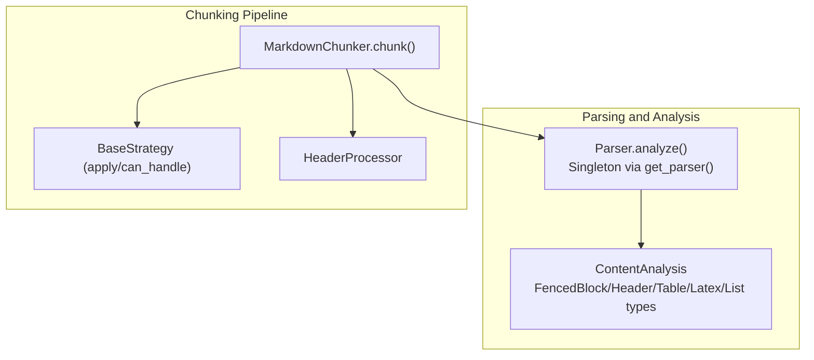
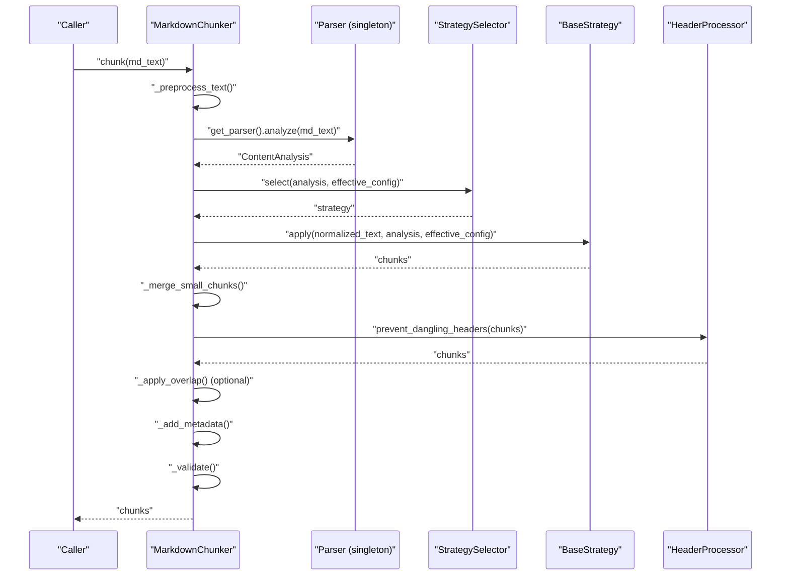
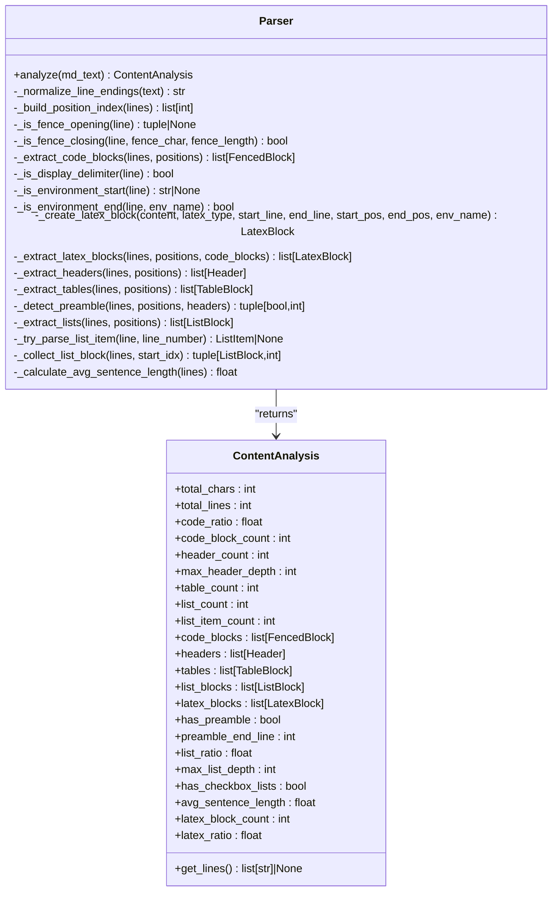
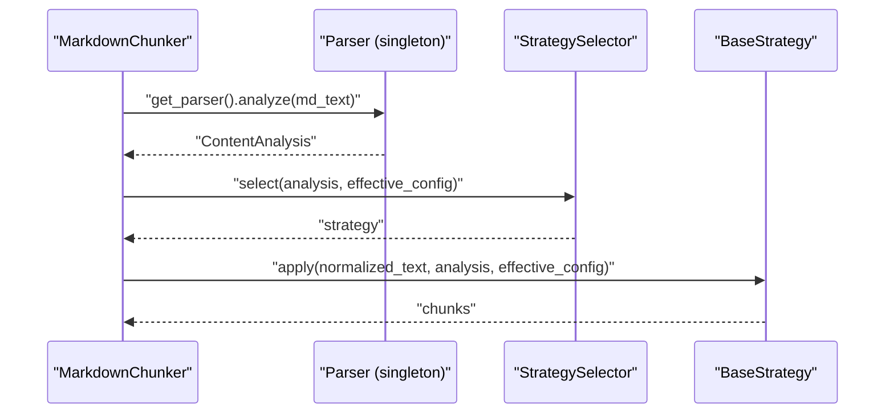
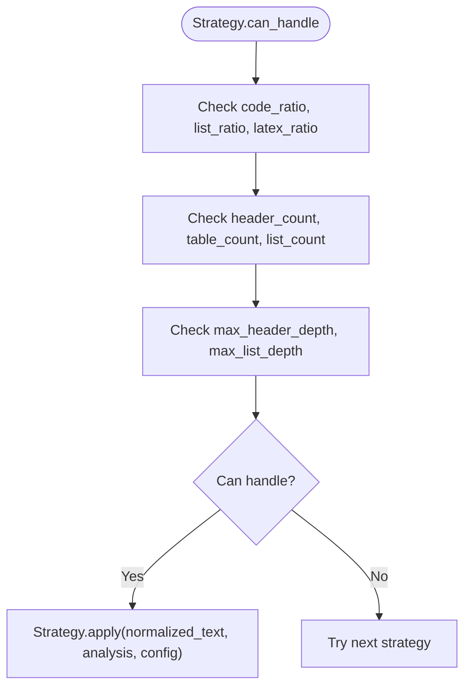
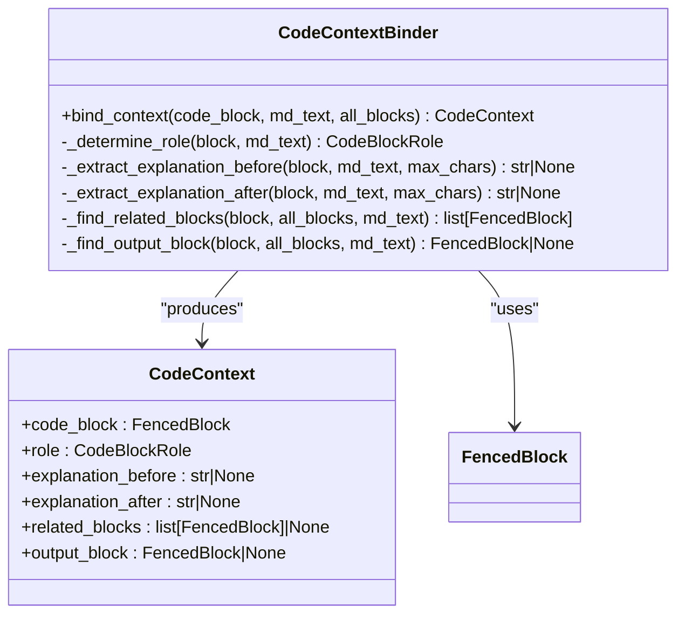
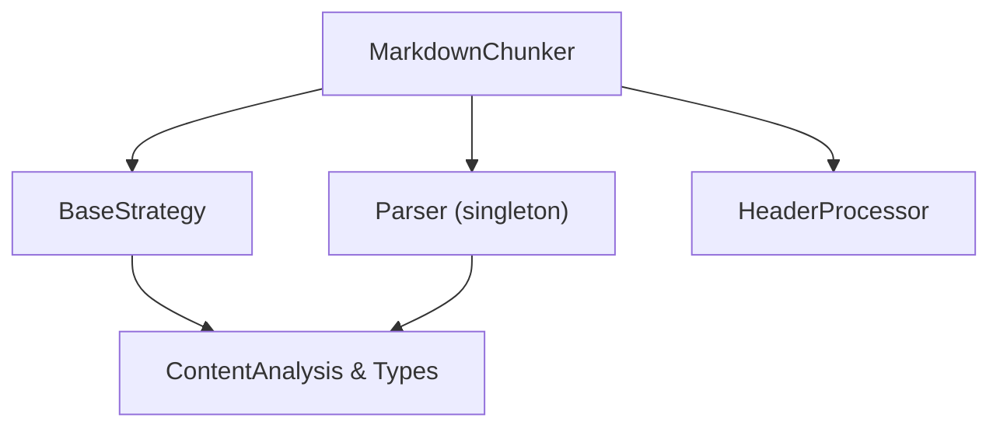

# Document Parsing and Analysis

<cite>
**Referenced Files in This Document**
- [parser.py](file://src/chunkana/parser.py)
- [types.py](file://src/chunkana/types.py)
- [chunker.py](file://src/chunkana/chunker.py)
- [code_context.py](file://src/chunkana/code_context.py)
- [header_processor.py](file://src/chunkana/header_processor.py)
- [base.py](file://src/chunkana/strategies/base.py)
- [code_heavy.md](file://tests/baseline/fixtures/code_heavy.md)
- [headers_deep.md](file://tests/baseline/fixtures/headers_deep.md)
- [mixed_content.md](file://tests/baseline/fixtures/mixed_content.md)
- [test_parser_fencing.py](file://tests/unit/test_parser_fencing.py)
</cite>

## Table of Contents
1. [Introduction](#introduction)
2. [Project Structure](#project-structure)
3. [Core Components](#core-components)
4. [Architecture Overview](#architecture-overview)
5. [Detailed Component Analysis](#detailed-component-analysis)
6. [Dependency Analysis](#dependency-analysis)
7. [Performance Considerations](#performance-considerations)
8. [Troubleshooting Guide](#troubleshooting-guide)
9. [Conclusion](#conclusion)
10. [Appendices](#appendices)

## Introduction
This document explains the parsing and content analysis phase in the chunking pipeline. It focuses on how the Parser component analyzes Markdown structure, detects code blocks, tables, headers, and other semantic elements, and how the ContentAnalysis object captures document characteristics such as structural depth, code density, and atomic block distribution. It also covers the importance of line ending normalization, how analysis results inform strategy selection, and how the chunker interacts with the parser singleton instance. Finally, it provides examples of distinct analysis profiles for different document types and outlines performance considerations for large documents.

## Project Structure
The parsing and analysis phase centers around the Parser component and its singleton accessor, the ContentAnalysis data model, and the integration points with the chunker and strategies.

**Diagram sources**
- [parser.py](file://src/chunkana/parser.py#L44-L122)
- [parser.py](file://src/chunkana/parser.py#L938-L948)
- [types.py](file://src/chunkana/types.py#L181-L239)
- [chunker.py](file://src/chunkana/chunker.py#L85-L177)
- [base.py](file://src/chunkana/strategies/base.py#L15-L66)

**Section sources**
- [parser.py](file://src/chunkana/parser.py#L44-L122)
- [types.py](file://src/chunkana/types.py#L181-L239)
- [chunker.py](file://src/chunkana/chunker.py#L85-L177)

## Core Components
- Parser.analyze: Performs a single-pass analysis of Markdown text, normalizes line endings, extracts code blocks, LaTeX, headers, tables, and lists, and computes metrics such as code ratio, list ratios, max header depth, and preamble presence. It returns a ContentAnalysis object.
- ContentAnalysis: A dataclass capturing document-wide metrics and extracted elements, including counts, ratios, and optional cached line array for downstream strategies.
- get_parser(): Singleton accessor that returns a shared Parser instance to avoid repeated regex compilation and instantiation costs.

Key responsibilities:
- Line ending normalization to ensure consistent processing.
- Extraction of fenced code blocks with nested fence support.
- Detection of LaTeX display and environment blocks, skipping content inside code blocks.
- Extraction of headers, tables, and lists with awareness of fenced contexts.
- Calculation of structural and content metrics for strategy selection.

**Section sources**
- [parser.py](file://src/chunkana/parser.py#L44-L122)
- [parser.py](file://src/chunkana/parser.py#L123-L142)
- [parser.py](file://src/chunkana/parser.py#L228-L293)
- [parser.py](file://src/chunkana/parser.py#L371-L513)
- [parser.py](file://src/chunkana/parser.py#L515-L571)
- [parser.py](file://src/chunkana/parser.py#L573-L655)
- [parser.py](file://src/chunkana/parser.py#L684-L744)
- [parser.py](file://src/chunkana/parser.py#L907-L926)
- [parser.py](file://src/chunkana/parser.py#L938-L948)
- [types.py](file://src/chunkana/types.py#L181-L239)

## Architecture Overview
The chunker orchestrates a linear pipeline: parse once, select strategy, apply strategy, merge small chunks, prevent dangling headers, apply overlap, add metadata, and validate. The parser singleton is used for analysis, and the ContentAnalysis object is passed to the strategy selector and strategies.

**Diagram sources**
- [chunker.py](file://src/chunkana/chunker.py#L85-L177)
- [parser.py](file://src/chunkana/parser.py#L938-L948)
- [base.py](file://src/chunkana/strategies/base.py#L15-L66)

## Detailed Component Analysis

### Parser Component
The Parser performs a single-pass analysis of Markdown text. Its responsibilities include:
- Line ending normalization to Unix-style.
- Building a position index for O(1) line-to-position lookups.
- Extracting fenced code blocks with nested fence support and metadata.
- Extracting LaTeX blocks (display and environments), skipping content inside code blocks.
- Extracting headers, tables, and lists while respecting fenced contexts.
- Computing metrics such as code ratio, list ratios, max header depth, preamble presence, and average sentence length.
- Returning a ContentAnalysis object with extracted elements and metrics.

Notable implementation patterns:
- Pre-compiled regex patterns for performance.
- Early termination checks for list items using pre-compiled patterns.
- Fence stack to handle nested fenced contexts.
- Position index to avoid O(n) scans for line positions.
- Single split of the entire document for downstream reuse.

**Diagram sources**
- [parser.py](file://src/chunkana/parser.py#L44-L122)
- [parser.py](file://src/chunkana/parser.py#L123-L142)
- [parser.py](file://src/chunkana/parser.py#L228-L293)
- [parser.py](file://src/chunkana/parser.py#L371-L513)
- [parser.py](file://src/chunkana/parser.py#L515-L571)
- [parser.py](file://src/chunkana/parser.py#L573-L655)
- [parser.py](file://src/chunkana/parser.py#L684-L744)
- [parser.py](file://src/chunkana/parser.py#L907-L926)
- [types.py](file://src/chunkana/types.py#L181-L239)

**Section sources**
- [parser.py](file://src/chunkana/parser.py#L44-L122)
- [parser.py](file://src/chunkana/parser.py#L123-L142)
- [parser.py](file://src/chunkana/parser.py#L228-L293)
- [parser.py](file://src/chunkana/parser.py#L371-L513)
- [parser.py](file://src/chunkana/parser.py#L515-L571)
- [parser.py](file://src/chunkana/parser.py#L573-L655)
- [parser.py](file://src/chunkana/parser.py#L684-L744)
- [parser.py](file://src/chunkana/parser.py#L907-L926)
- [types.py](file://src/chunkana/types.py#L181-L239)

### ContentAnalysis Object
ContentAnalysis encapsulates:
- Basic metrics: total_chars, total_lines.
- Content ratios: code_ratio, list_ratio, latex_ratio.
- Element counts: code_block_count, header_count, table_count, list_count, list_item_count, latex_block_count.
- Extracted elements: code_blocks, headers, tables, list_blocks, latex_blocks.
- Additional metrics: has_preamble, preamble_end_line, max_header_depth, max_list_depth, has_checkbox_lists, avg_sentence_length.
- Optional cached line array (_lines) to avoid redundant splits in strategies.

The presence of _lines enables strategies to reuse the parsed line array for efficient processing.

**Section sources**
- [types.py](file://src/chunkana/types.py#L181-L239)

### Interaction Between Chunker and Parser Singleton
The chunker obtains a singleton Parser instance and calls analyze to produce ContentAnalysis. The chunker then:
- Optionally calculates adaptive sizing using ContentAnalysis.
- Selects a strategy based on ContentAnalysis and effective configuration.
- Applies the strategy to normalized text and ContentAnalysis.
- Post-processes chunks (merge small chunks, prevent dangling headers, apply overlap, add metadata, validate).

**Diagram sources**
- [chunker.py](file://src/chunkana/chunker.py#L85-L177)
- [parser.py](file://src/chunkana/parser.py#L938-L948)
- [base.py](file://src/chunkana/strategies/base.py#L15-L66)

**Section sources**
- [chunker.py](file://src/chunkana/chunker.py#L85-L177)
- [parser.py](file://src/chunkana/parser.py#L938-L948)

### Strategy Selection Based on Analysis
Strategies use ContentAnalysis to decide whether they can handle a document and how to split it. For example:
- can_handle checks content ratios and element counts.
- apply uses normalized text and ContentAnalysis to produce chunks.
- BaseStrategy helpers include atomic block detection and oversize metadata setting.

**Diagram sources**
- [base.py](file://src/chunkana/strategies/base.py#L15-L66)

**Section sources**
- [base.py](file://src/chunkana/strategies/base.py#L15-L66)

### Examples of Analysis Profiles
Different document types produce distinct analysis profiles captured by ContentAnalysis:

- Code-heavy document:
  - High code_ratio and code_block_count.
  - Lower header_count and table_count.
  - Likely max_header_depth around 2–3.
  - Example fixture: [code_heavy.md](file://tests/baseline/fixtures/code_heavy.md#L1-L74)

- Deeply nested headers document:
  - Lower code_ratio and table_count.
  - High header_count with max_header_depth near 6.
  - Example fixture: [headers_deep.md](file://tests/baseline/fixtures/headers_deep.md#L1-L66)

- Mixed content document:
  - Moderate code_ratio and list_ratio.
  - Non-zero header_count, table_count, and list_count.
  - Example fixture: [mixed_content.md](file://tests/baseline/fixtures/mixed_content.md#L1-L45)

These profiles guide strategy selection toward code-aware or structural strategies depending on dominance.

**Section sources**
- [code_heavy.md](file://tests/baseline/fixtures/code_heavy.md#L1-L74)
- [headers_deep.md](file://tests/baseline/fixtures/headers_deep.md#L1-L66)
- [mixed_content.md](file://tests/baseline/fixtures/mixed_content.md#L1-L45)

### Enhanced Code Context Binding
While not part of the parsing phase, the code context binder uses ContentAnalysis-produced code_blocks to infer roles and relationships for improved chunking. It classifies code blocks by language tags and preceding patterns, extracts explanations before/after code blocks, and identifies related blocks and output blocks.

**Diagram sources**
- [code_context.py](file://src/chunkana/code_context.py#L63-L163)
- [code_context.py](file://src/chunkana/code_context.py#L164-L244)
- [code_context.py](file://src/chunkana/code_context.py#L279-L356)
- [code_context.py](file://src/chunkana/code_context.py#L357-L516)

**Section sources**
- [code_context.py](file://src/chunkana/code_context.py#L63-L163)
- [code_context.py](file://src/chunkana/code_context.py#L164-L244)
- [code_context.py](file://src/chunkana/code_context.py#L279-L356)
- [code_context.py](file://src/chunkana/code_context.py#L357-L516)

## Dependency Analysis
The chunker depends on the parser singleton for analysis, and strategies depend on ContentAnalysis for selection and application. The header processor acts as a post-processing step to prevent dangling headers.

**Diagram sources**
- [chunker.py](file://src/chunkana/chunker.py#L85-L177)
- [parser.py](file://src/chunkana/parser.py#L938-L948)
- [base.py](file://src/chunkana/strategies/base.py#L15-L66)
- [types.py](file://src/chunkana/types.py#L181-L239)

**Section sources**
- [chunker.py](file://src/chunkana/chunker.py#L85-L177)
- [parser.py](file://src/chunkana/parser.py#L938-L948)
- [base.py](file://src/chunkana/strategies/base.py#L15-L66)
- [types.py](file://src/chunkana/types.py#L181-L239)

## Performance Considerations
- Line ending normalization: Performed first to ensure consistent processing and avoid platform-specific issues. The fast-path detection avoids unnecessary work when input is already Unix-formatted.
- Single split and position index: The entire document is split once and a cumulative position index is built for O(1) lookups, reducing repeated O(n) scans.
- Pre-compiled regex patterns: Patterns for fences, headers, list items, and LaTeX are compiled once and reused.
- Fence stack: Maintains nested fenced contexts without repeated scanning.
- Singleton parser: Avoids repeated regex compilation and instantiation overhead.
- Memory usage: ContentAnalysis caches the line array (_lines) to minimize downstream splits. Strategies can reuse this to reduce memory allocations.
- Large document parsing: The parser’s single-pass design and O(1) position lookups keep memory usage predictable and processing linear in document size.

**Section sources**
- [parser.py](file://src/chunkana/parser.py#L123-L142)
- [parser.py](file://src/chunkana/parser.py#L143-L167)
- [parser.py](file://src/chunkana/parser.py#L32-L43)
- [parser.py](file://src/chunkana/parser.py#L938-L948)
- [types.py](file://src/chunkana/types.py#L221-L239)

## Troubleshooting Guide
Common issues and diagnostics:
- Unclosed fenced code blocks: The parser marks is_closed=False for unclosed fences and extends content to the end of the document. Tests confirm behavior for unclosed fences.
- Mixed fence types: The parser supports mixing backticks and tildes and preserves inner fence syntax exactly.
- Nested fences: Quadruple and higher-length fences are supported, and inner fences are preserved.
- Headers inside code: Headers inside fenced code blocks are ignored during header extraction.
- Tables inside code: Tables inside fenced code blocks are ignored during table extraction.
- Preamble detection: The parser detects preamble as content before the first header.
- Average sentence length: Computed from reconstructed text for downstream strategy decisions.

Validation and tests:
- Fencing tests cover nested fences, mixed types, unclosed fences, and metadata correctness.
- Fixture documents demonstrate code-heavy, deeply nested headers, and mixed content scenarios.

**Section sources**
- [parser.py](file://src/chunkana/parser.py#L371-L513)
- [parser.py](file://src/chunkana/parser.py#L515-L571)
- [parser.py](file://src/chunkana/parser.py#L573-L655)
- [parser.py](file://src/chunkana/parser.py#L657-L683)
- [parser.py](file://src/chunkana/parser.py#L907-L926)
- [test_parser_fencing.py](file://tests/unit/test_parser_fencing.py#L1-L377)
- [code_heavy.md](file://tests/baseline/fixtures/code_heavy.md#L1-L74)
- [headers_deep.md](file://tests/baseline/fixtures/headers_deep.md#L1-L66)
- [mixed_content.md](file://tests/baseline/fixtures/mixed_content.md#L1-L45)

## Conclusion
The parsing and content analysis phase provides a robust, single-pass analysis of Markdown documents with strong support for nested fenced code blocks, LaTeX, headers, tables, and lists. ContentAnalysis captures essential metrics and extracted elements that drive strategy selection and chunking behavior. The singleton parser and cached line arrays optimize performance and memory usage. The chunker integrates seamlessly with the parser and strategies, enabling adaptive sizing and post-processing steps like preventing dangling headers.

## Appendices
- Example fixtures for testing:
  - Code-heavy: [code_heavy.md](file://tests/baseline/fixtures/code_heavy.md#L1-L74)
  - Deeply nested headers: [headers_deep.md](file://tests/baseline/fixtures/headers_deep.md#L1-L66)
  - Mixed content: [mixed_content.md](file://tests/baseline/fixtures/mixed_content.md#L1-L45)
- Parser fencing tests: [test_parser_fencing.py](file://tests/unit/test_parser_fencing.py#L1-L377)