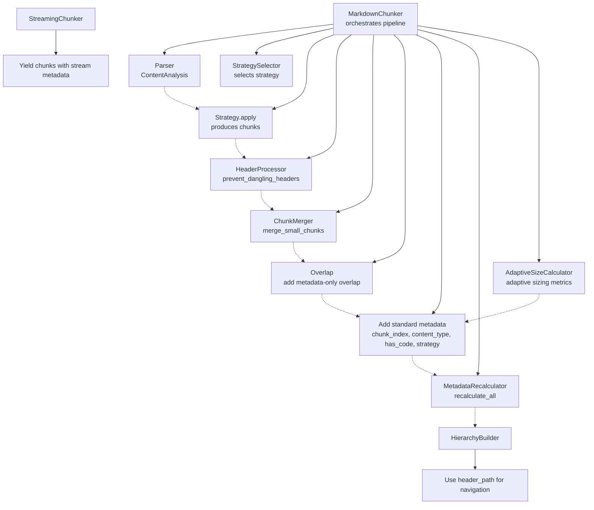
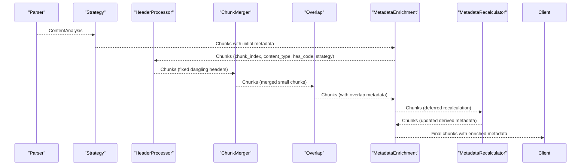
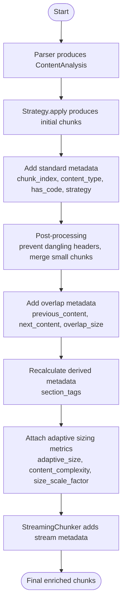
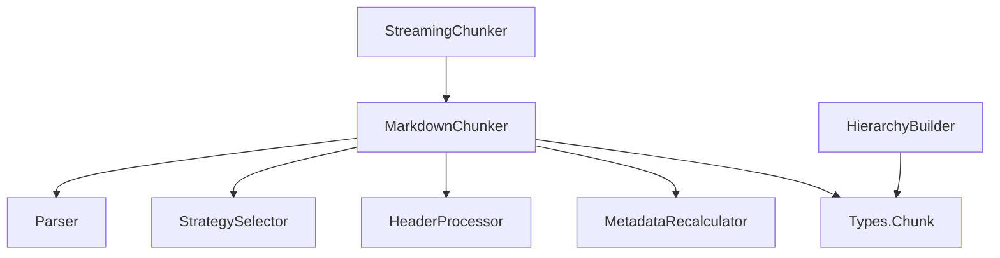

# Metadata Enrichment

<cite>
**Referenced Files in This Document**
- [chunker.py](file://src/chunkana/chunker.py)
- [metadata_recalculator.py](file://src/chunkana/metadata_recalculator.py)
- [types.py](file://src/chunkana/types.py)
- [header_processor.py](file://src/chunkana/header_processor.py)
- [adaptive_sizing.py](file://src/chunkana/adaptive_sizing.py)
- [streaming_chunker.py](file://src/chunkana/streaming/streaming_chunker.py)
- [hierarchy.py](file://src/chunkana/hierarchy.py)
- [strategies/base.py](file://src/chunkana/strategies/base.py)
- [parser.py](file://src/chunkana/parser.py)
</cite>

## Table of Contents
1. [Introduction](#introduction)
2. [Project Structure](#project-structure)
3. [Core Components](#core-components)
4. [Architecture Overview](#architecture-overview)
5. [Detailed Component Analysis](#detailed-component-analysis)
6. [Dependency Analysis](#dependency-analysis)
7. [Performance Considerations](#performance-considerations)
8. [Troubleshooting Guide](#troubleshooting-guide)
9. [Conclusion](#conclusion)

## Introduction
This document explains the metadata enrichment phase in the chunking pipeline. It covers how standard metadata like strategy_name is added to chunks, how MetadataRecalculator updates derived fields like section_tags after post-processing, the timing of metadata application (immediate vs. deferred recalculation), the structure of metadata fields (including header_path, content_type, and adaptive sizing metrics), examples of metadata evolution through the pipeline, and how metadata supports downstream use cases such as hierarchical navigation and content filtering. It also addresses performance implications and memory overhead considerations for large chunk sets.

## Project Structure
The metadata enrichment pipeline spans several modules:
- Chunker orchestrates parsing, strategy selection, chunk generation, post-processing, and metadata enrichment.
- MetadataRecalculator performs deferred recalculation of derived metadata after post-processing.
- Types define the Chunk data model and metadata field contracts.
- HeaderProcessor prevents dangling headers and tracks header movement.
- AdaptiveSizeCalculator computes adaptive sizing metrics used for enrichment.
- StreamingChunker enriches streaming-mode chunks with window and stream indices.
- HierarchyBuilder uses header_path metadata to construct navigable hierarchies.

**Diagram sources**
- [chunker.py](file://src/chunkana/chunker.py#L85-L176)
- [metadata_recalculator.py](file://src/chunkana/metadata_recalculator.py#L33-L48)
- [types.py](file://src/chunkana/types.py#L240-L375)
- [header_processor.py](file://src/chunkana/header_processor.py#L405-L451)
- [adaptive_sizing.py](file://src/chunkana/adaptive_sizing.py#L103-L197)
- [streaming_chunker.py](file://src/chunkana/streaming/streaming_chunker.py#L70-L99)
- [hierarchy.py](file://src/chunkana/hierarchy.py#L374-L421)

**Section sources**
- [chunker.py](file://src/chunkana/chunker.py#L85-L176)
- [types.py](file://src/chunkana/types.py#L240-L375)

## Core Components
- Chunker: Central orchestrator that adds standard metadata immediately after applying strategies and merges, then applies deferred recalculations afterward.
- MetadataRecalculator: Defers recalculating derived metadata (e.g., section_tags) until after all post-processing (dangling header fixes, merging).
- Types.Chunk: Defines metadata fields and helpers used throughout the pipeline.
- HeaderProcessor: Prevents dangling headers and marks chunks for potential header_path updates.
- AdaptiveSizeCalculator: Computes adaptive sizing metrics used to enrich chunks with complexity and scaling factors.
- StreamingChunker: Adds streaming-specific metadata to chunks yielded from buffered windows.
- HierarchyBuilder: Consumes header_path metadata to build navigable parent-child relationships.

**Section sources**
- [chunker.py](file://src/chunkana/chunker.py#L804-L821)
- [metadata_recalculator.py](file://src/chunkana/metadata_recalculator.py#L33-L48)
- [types.py](file://src/chunkana/types.py#L240-L375)
- [header_processor.py](file://src/chunkana/header_processor.py#L405-L451)
- [adaptive_sizing.py](file://src/chunkana/adaptive_sizing.py#L103-L197)
- [streaming_chunker.py](file://src/chunkana/streaming/streaming_chunker.py#L70-L99)
- [hierarchy.py](file://src/chunkana/hierarchy.py#L374-L421)

## Architecture Overview
The metadata enrichment phase follows a two-stage approach:
- Immediate enrichment: Adds standard metadata (chunk_index, content_type, has_code, strategy) right after strategy application and merging.
- Deferred enrichment: Recalculates derived metadata (e.g., section_tags) after post-processing steps (dangling header fixes, merging) to ensure consistency.

**Diagram sources**
- [chunker.py](file://src/chunkana/chunker.py#L85-L176)
- [chunker.py](file://src/chunkana/chunker.py#L804-L821)
- [metadata_recalculator.py](file://src/chunkana/metadata_recalculator.py#L33-L48)

## Detailed Component Analysis

### Standard Metadata Enrichment (Immediate)
Standard metadata fields are added immediately after strategy application and merging:
- chunk_index: Sequential index of the chunk in the document.
- content_type: Detected content type (text/code/table/mixed/preamble).
- has_code: Boolean indicating presence of fenced code.
- strategy: Strategy name that produced the chunk.
- header_path: Hierarchical path to the first header in the chunk.
- header_level: Level of the first header in the chunk.
- sub_headers: Additional header texts within the chunk (when applicable).
- small_chunk and small_chunk_reason: Flags for weakly structured small chunks.
- previous_content, next_content, overlap_size: Metadata-only overlap context between adjacent chunks.
- headers_in_content: Debugging aid capturing headers found during recalibration.

These fields are set by the chunker’s standard metadata step and are used throughout the pipeline and downstream consumers.

**Section sources**
- [chunker.py](file://src/chunkana/chunker.py#L804-L821)
- [types.py](file://src/chunkana/types.py#L240-L375)

### Derived Metadata Recalculation (Deferred)
Derived metadata is recalculated after post-processing to ensure correctness:
- section_tags: Updated to reflect headers actually present in each chunk’s content. The recalculator extracts headers from chunk content and updates section_tags accordingly. It also validates consistency between section_tags and actual headers and logs warnings in debug mode.

Timing:
- The recalculator is invoked after all post-processing operations (dangling header fixes and merging) to guarantee that section_tags align with the final content.

Validation:
- A dedicated validation routine compares section_tags with headers extracted from content and reports mismatches.

**Section sources**
- [metadata_recalculator.py](file://src/chunkana/metadata_recalculator.py#L33-L48)
- [metadata_recalculator.py](file://src/chunkana/metadata_recalculator.py#L101-L133)

### Adaptive Sizing Metrics Enrichment
When adaptive sizing is enabled, the chunker computes:
- adaptive_size: Optimal chunk size based on content complexity.
- content_complexity: Normalized complexity score (0.0–1.0).
- size_scale_factor: Scaling factor derived from complexity.

These metrics are attached to each chunk during the final enrichment stage, enabling downstream systems to reason about chunk sizes and content density.

**Section sources**
- [chunker.py](file://src/chunkana/chunker.py#L117-L172)
- [adaptive_sizing.py](file://src/chunkana/adaptive_sizing.py#L103-L197)

### Streaming Metadata Enrichment
StreamingChunker yields chunks with additional metadata for windowed processing:
- stream_chunk_index: Index of the chunk within the stream.
- stream_window_index: Index of the buffer window processed.
- bytes_processed: Total bytes processed so far.

This metadata helps track provenance and progress for large files.

**Section sources**
- [streaming_chunker.py](file://src/chunkana/streaming/streaming_chunker.py#L70-L99)

### Downstream Navigation and Filtering Using Metadata
- Hierarchical navigation: HierarchyBuilder constructs parent-child-sibling relationships using header_path metadata, enabling O(1) navigation and tree traversal.
- Content filtering: Consumers can filter by content_type, strategy, header_path, or section_tags to target specific sections or content kinds.

**Section sources**
- [hierarchy.py](file://src/chunkana/hierarchy.py#L374-L421)
- [types.py](file://src/chunkana/types.py#L240-L375)

### Metadata Evolution Through the Pipeline
Below is a conceptual flow of how metadata evolves across stages:

**Diagram sources**
- [chunker.py](file://src/chunkana/chunker.py#L85-L176)
- [chunker.py](file://src/chunkana/chunker.py#L804-L821)
- [metadata_recalculator.py](file://src/chunkana/metadata_recalculator.py#L33-L48)
- [adaptive_sizing.py](file://src/chunkana/adaptive_sizing.py#L103-L197)
- [streaming_chunker.py](file://src/chunkana/streaming/streaming_chunker.py#L70-L99)

## Dependency Analysis
Key dependencies and relationships:
- Chunker depends on Parser for ContentAnalysis, StrategySelector for strategy selection, HeaderProcessor for dangling header prevention, and MetadataRecalculator for derived metadata updates.
- Types.Chunk defines the metadata contract used across modules.
- HierarchyBuilder relies on header_path metadata to build navigable structures.
- StreamingChunker composes the base chunker and enriches yielded chunks with stream metadata.

**Diagram sources**
- [chunker.py](file://src/chunkana/chunker.py#L85-L176)
- [types.py](file://src/chunkana/types.py#L240-L375)
- [hierarchy.py](file://src/chunkana/hierarchy.py#L374-L421)
- [streaming_chunker.py](file://src/chunkana/streaming/streaming_chunker.py#L70-L99)

**Section sources**
- [chunker.py](file://src/chunkana/chunker.py#L85-L176)
- [types.py](file://src/chunkana/types.py#L240-L375)

## Performance Considerations
- Immediate enrichment cost: Adding standard metadata is linear in the number of chunks and inexpensive.
- Deferred recalculation cost: Recalculating section_tags scans each chunk’s content to extract headers; complexity is proportional to total characters across chunks. This is performed once after post-processing.
- Adaptive sizing cost: Computing complexity and optimal size is linear in the parsed content and performed once per document.
- Streaming overhead: StreamingChunker introduces minimal overhead by adding lightweight metadata fields and delegating chunking to the base chunker.
- Memory footprint: Metadata is stored in chunk.metadata dictionaries. While metadata is small per chunk, large chunk sets increase memory usage. Consider limiting unnecessary metadata fields in constrained environments.

[No sources needed since this section provides general guidance]

## Troubleshooting Guide
Common issues and remedies:
- Inconsistent section_tags: Use the validation routine to detect mismatches between section_tags and actual headers in content. Review post-processing steps (merges, dangling header fixes) that may alter content.
- Missing header_path: Ensure header_path is computed by strategies and not overwritten by subsequent steps. If header movement occurs, confirm that header_path updates are applied.
- Oversized chunks: The pipeline may mark allow_oversize with a reason (e.g., code_block_integrity). Adjust strategy or configuration to respect size limits.
- Streaming provenance: Verify stream_chunk_index and stream_window_index to track chunk origin and progress.

**Section sources**
- [metadata_recalculator.py](file://src/chunkana/metadata_recalculator.py#L101-L133)
- [header_processor.py](file://src/chunkana/header_processor.py#L405-L451)
- [chunker.py](file://src/chunkana/chunker.py#L431-L470)
- [streaming_chunker.py](file://src/chunkana/streaming/streaming_chunker.py#L70-L99)

## Conclusion
The metadata enrichment phase in the chunking pipeline combines immediate standard metadata addition with deferred recalculations for derived fields like section_tags. This two-stage approach ensures correctness after post-processing while keeping costs predictable. The resulting metadata supports downstream navigation, filtering, and adaptive sizing, enabling robust downstream applications. For large-scale processing, monitor derived metadata recalculation costs and consider streaming modes to manage memory overhead.